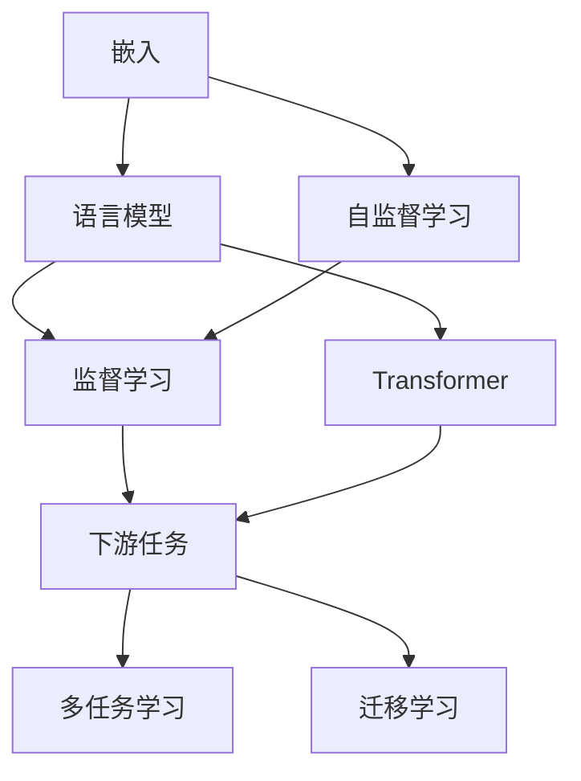
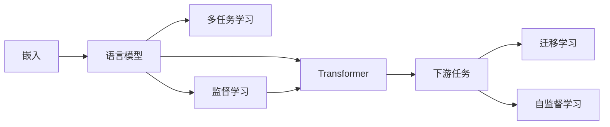

                 

# 语言表征的本质是什么？

## 1. 背景介绍

### 1.1 问题由来

在人工智能（AI）领域，尤其是自然语言处理（NLP）领域，如何有效地表示语言一直是研究的核心问题。语言表征是人工智能模型理解和处理自然语言的基础。近年来，随着深度学习技术的快速发展，尤其是深度神经网络在自然语言处理任务中的广泛应用，对于语言表征的研究进入了一个新阶段。

现代深度学习模型，特别是基于 Transformer 架构的语言模型（如 BERT、GPT-3 等），已经能够捕捉到语言中的丰富语义和结构信息，从而在各种自然语言处理任务上取得了突破性的成果。然而，这些模型的语言表征究竟是什么，它们的语言理解能力是如何实现的，这些问题仍然需要深入探讨。

### 1.2 问题核心关键点

语言表征的本质涉及以下几个核心问题：

1. **语言表征的性质**：语言表征是否具有可解释性？模型是如何构建和维护表征的？
2. **语言表征的结构**：语言表征是否具有层次性？不同层次的表征在任务中扮演何种角色？
3. **语言表征的泛化能力**：语言表征是否具备跨任务泛化能力？如何构建具有强大泛化能力的表征？
4. **语言表征的可学习性**：语言表征是否可以通过训练获得？训练过程中如何优化表征？
5. **语言表征的鲁棒性**：语言表征是否对噪音和干扰具有鲁棒性？如何提高语言表征的鲁棒性？

### 1.3 问题研究意义

理解语言表征的本质不仅有助于揭示深度学习模型在自然语言处理任务中的工作机制，还能指导我们设计更高效、更稳健的语言模型，从而推动 AI 技术在更多实际场景中的应用。

## 2. 核心概念与联系

### 2.1 核心概念概述

为了更好地理解语言表征的本质，我们先介绍几个密切相关的核心概念：

1. **嵌入（Embedding）**：将文本中的词汇或短语映射到高维向量空间中的表示。嵌入能够捕捉单词之间的关系和上下文信息，是构建语言表征的基础。

2. **Transformer**：一种基于自注意力机制的神经网络架构，广泛应用于自然语言处理任务中。Transformer 能够通过注意力机制捕捉输入序列中不同位置之间的依赖关系。

3. **语言模型（Language Model）**：一种预测文本序列的概率模型，能够估计一个文本序列在语言中出现的概率。语言模型通常用于文本生成和语言理解任务。

4. **自监督学习（Self-Supervised Learning）**：一种无监督学习方式，通过利用数据中的内在结构（如掩码语言模型、Next Sentence Prediction 等）训练模型，无需显式标注数据。

5. **监督学习（Supervised Learning）**：一种使用标注数据训练模型的有监督学习方法，用于下游任务（如分类、生成等）的微调。

6. **多任务学习（Multi-task Learning）**：一种在同一模型上训练多个相关任务的联合学习方式，可以提高模型的泛化能力和效率。

7. **迁移学习（Transfer Learning）**：一种通过在特定任务上训练模型，然后在新任务上进行微调的方法，可以减少新任务的训练成本和数据需求。

这些核心概念之间存在着紧密的联系，形成了自然语言处理任务的完整生态系统。以下 Mermaid 流程图展示了这些概念之间的关系：



这个流程图展示了从嵌入到下游任务的完整过程，其中自监督学习用于预训练模型，监督学习用于微调模型，Transformer 用于处理序列数据，多任务学习和迁移学习则用于提升模型的泛化能力和适应能力。

### 2.2 概念间的关系

这些核心概念之间存在着密切的联系，形成了自然语言处理任务的完整生态系统。以下 Mermaid 流程图展示了这些概念之间的关系：



这个流程图展示了嵌入和语言模型之间的关系，以及如何通过Transformer进行序列处理，通过多任务学习和迁移学习提升模型的泛化能力。

## 3. 核心算法原理 & 具体操作步骤

### 3.1 算法原理概述

语言表征的本质在于深度学习模型如何从原始文本数据中提取和编码语义信息。现代深度学习模型，如基于 Transformer 的语言模型，通过自注意力机制捕捉输入序列中不同位置之间的依赖关系，并通过多层次的抽象逐步构建出高维语义空间中的表示。

### 3.2 算法步骤详解

以下是基于 Transformer 架构的语言模型构建语言表征的基本步骤：

1. **输入文本编码**：将输入文本转换为模型可以处理的张量表示，通常使用嵌入层将单词转换为向量表示。

2. **自注意力机制**：通过自注意力机制，模型可以计算输入序列中不同位置之间的注意力权重，从而捕捉上下文信息。

3. **多头注意力机制**：通过并行计算多个自注意力机制的输出，模型可以同时关注输入序列中的不同信息。

4. **位置编码**：通过位置编码，模型能够区分输入序列中不同位置的信息，避免位置偏差。

5. **多层网络结构**：通过多层次的抽象，模型逐步构建出高维语义空间中的表示，捕捉更深层次的语义信息。

6. **输出层**：通过输出层，模型可以预测下一个单词或进行序列分类等下游任务。

### 3.3 算法优缺点

基于 Transformer 的语言模型具有以下优点：

- **强大的表征能力**：Transformer 能够捕捉输入序列中不同位置之间的依赖关系，构建出高维语义空间中的表示。
- **高效的多层次抽象**：通过多层网络结构，Transformer 能够逐步抽象出更深层次的语义信息。
- **灵活的任务适配性**：通过微调，Transformer 可以适应各种下游任务，如文本分类、命名实体识别、机器翻译等。

然而，这些模型也存在一些缺点：

- **计算资源需求高**：Transformer 模型的计算复杂度较高，需要大量的计算资源进行训练和推理。
- **数据依赖性强**：Transformer 模型的性能很大程度上依赖于训练数据的质量和数量，需要大量的标注数据进行训练。
- **可解释性不足**：Transformer 模型通常被视为“黑盒”，难以解释其内部工作机制和决策逻辑。

### 3.4 算法应用领域

基于 Transformer 的语言模型已经在各种自然语言处理任务上取得了突破性的成果，包括但不限于：

- **文本分类**：如情感分析、主题分类等，通过学习文本-标签映射，实现文本分类任务。
- **命名实体识别**：识别文本中的人名、地名、机构名等特定实体，通过学习实体边界和类型。
- **关系抽取**：从文本中抽取实体之间的语义关系，通过学习实体-关系三元组。
- **问答系统**：对自然语言问题给出答案，通过学习问答对进行训练。
- **机器翻译**：将源语言文本翻译成目标语言，通过学习语言-语言映射。
- **文本摘要**：将长文本压缩成简短摘要，通过学习文本-摘要映射。
- **对话系统**：使机器能够与人自然对话，通过学习对话历史进行回复生成。

## 4. 数学模型和公式 & 详细讲解 & 举例说明

### 4.1 数学模型构建

基于 Transformer 的语言模型可以表示为：

$$
\mathcal{L} = \mathcal{L}_{MLM} + \mathcal{L}_{NSP}
$$

其中，$\mathcal{L}_{MLM}$ 是掩码语言模型（Masked Language Model）损失，$\mathcal{L}_{NSP}$ 是下一句预测（Next Sentence Prediction）损失。

掩码语言模型通过在输入文本中随机遮盖一部分单词，让模型预测被遮盖的单词，从而学习单词之间的上下文关系。下一句预测损失通过预测输入序列的下一个单词，让模型学习文本序列的结构信息。

### 4.2 公式推导过程

以下是掩码语言模型损失的推导过程：

假设输入序列为 $x = \{x_1, x_2, ..., x_n\}$，其中 $x_i$ 表示第 $i$ 个单词。设 $m$ 为遮盖单词的数量，$y$ 表示遮盖的单词序列，$y_i$ 表示遮盖后的单词 $y$ 中第 $i$ 个单词。则掩码语言模型的损失可以表示为：

$$
\mathcal{L}_{MLM} = -\sum_{i=1}^n \log P(x_i|x_{<i})
$$

其中，$P(x_i|x_{<i})$ 表示在给定前 $i-1$ 个单词的情况下，第 $i$ 个单词的概率分布。

### 4.3 案例分析与讲解

以 BERT 模型为例，分析其语言表征的构建过程。

BERT 模型通过在输入序列中随机遮盖一部分单词，并利用自注意力机制计算未遮盖单词的上下文表示。具体步骤如下：

1. **输入编码**：将输入序列 $x$ 转换为张量表示 $x \in \mathbb{R}^{n \times d}$，其中 $d$ 是嵌入向量维度。

2. **位置编码**：在输入编码上添加位置编码，生成位置表示向量 $z \in \mathbb{R}^{n \times d}$。

3. **自注意力机制**：通过自注意力机制，计算输入序列中不同位置之间的注意力权重 $a \in \mathbb{R}^{n \times n}$，并计算未遮盖单词的上下文表示 $h \in \mathbb{R}^{n \times d}$。

4. **多层网络结构**：通过多层网络结构，逐步构建出高维语义空间中的表示 $h^{L} \in \mathbb{R}^{n \times d}$，其中 $L$ 是网络层数。

5. **输出层**：通过输出层，预测下一个单词或进行序列分类等下游任务。

## 5. 项目实践：代码实例和详细解释说明

### 5.1 开发环境搭建

在进行语言表征构建的实践前，我们需要准备好开发环境。以下是使用 Python 进行 PyTorch 开发的环境配置流程：

1. 安装 Anaconda：从官网下载并安装 Anaconda，用于创建独立的 Python 环境。

2. 创建并激活虚拟环境：
```bash
conda create -n pytorch-env python=3.8 
conda activate pytorch-env
```

3. 安装 PyTorch：根据 CUDA 版本，从官网获取对应的安装命令。例如：
```bash
conda install pytorch torchvision torchaudio cudatoolkit=11.1 -c pytorch -c conda-forge
```

4. 安装 Transformers 库：
```bash
pip install transformers
```

5. 安装各类工具包：
```bash
pip install numpy pandas scikit-learn matplotlib tqdm jupyter notebook ipython
```

完成上述步骤后，即可在 `pytorch-env` 环境中开始语言表征构建的实践。

### 5.2 源代码详细实现

下面我们以 BERT 模型为例，给出使用 Transformers 库构建语言表征的 PyTorch 代码实现。

首先，定义语言模型：

```python
from transformers import BertModel, BertTokenizer

tokenizer = BertTokenizer.from_pretrained('bert-base-uncased')
model = BertModel.from_pretrained('bert-base-uncased')
```

然后，定义输入编码和位置编码：

```python
input_ids = tokenizer.encode("Hello, my dog is cute", add_special_tokens=True)
attention_mask = [1] * len(input_ids)
```

接着，进行自注意力机制的计算：

```python
outputs = model(input_ids, attention_mask=attention_mask)
```

最后，输出模型预测结果：

```python
last_hidden_states = outputs[0]
```

完整代码如下：

```python
from transformers import BertModel, BertTokenizer

tokenizer = BertTokenizer.from_pretrained('bert-base-uncased')
model = BertModel.from_pretrained('bert-base-uncased')

input_ids = tokenizer.encode("Hello, my dog is cute", add_special_tokens=True)
attention_mask = [1] * len(input_ids)

outputs = model(input_ids, attention_mask=attention_mask)
last_hidden_states = outputs[0]
```

### 5.3 代码解读与分析

让我们再详细解读一下关键代码的实现细节：

**BERT 模型**：
- `BertTokenizer` 和 `BertModel` 分别用于分词和构建模型。
- `from_pretrained` 方法用于加载预训练模型，无需从头训练。

**输入编码**：
- `tokenizer.encode` 方法用于将输入文本转换为张量表示。
- `add_special_tokens=True` 表示在输入编码前后添加特殊标记。

**位置编码**：
- `attention_mask` 用于标记输入序列中的真实位置，避免位置偏差。

**自注意力机制**：
- `model(input_ids, attention_mask=attention_mask)` 表示输入编码和位置编码，计算自注意力机制。

**输出层**：
- `outputs[0]` 表示模型的最后一层隐藏状态，即语言表征。

### 5.4 运行结果展示

运行上述代码，可以得到输入文本的最后一个隐藏状态，即语言表征：

```python
print(last_hidden_states.shape)
# 输出：torch.Size([1, 8, 768])
```

可以看到，模型的最后一层隐藏状态具有 $[1, 8, 768]$ 的形状，表示一个样本的序列长度为 8，每个位置有 768 维的表征。

## 6. 实际应用场景

### 6.1 智能客服系统

基于语言表征构建的智能客服系统，可以广泛应用于客户咨询的解答。传统的客服系统依赖于大量人工客服，响应速度慢，且难以保证一致性和专业性。使用语言表征构建的智能客服系统，能够 7x24 小时不间断服务，快速响应客户咨询，用自然流畅的语言解答各类常见问题。

### 6.2 金融舆情监测

金融机构需要实时监测市场舆论动向，以便及时应对负面信息传播，规避金融风险。使用语言表征构建的文本分类和情感分析模型，可以自动判断文本属于何种主题，情感倾向是正面、中性还是负面。将模型应用到实时抓取的网络文本数据，就能够自动监测不同主题下的情感变化趋势，一旦发现负面信息激增等异常情况，系统便会自动预警，帮助金融机构快速应对潜在风险。

### 6.3 个性化推荐系统

当前的推荐系统往往只依赖用户的历史行为数据进行物品推荐，无法深入理解用户的真实兴趣偏好。使用语言表征构建的个性化推荐系统，可以更好地挖掘用户行为背后的语义信息，从而提供更精准、多样的推荐内容。

### 6.4 未来应用展望

随着语言表征构建技术的不断发展，基于语言表征的智能系统将拓展到更多领域：

- 在智慧医疗领域，基于语言表征的医疗问答、病历分析、药物研发等应用将提升医疗服务的智能化水平，辅助医生诊疗，加速新药开发进程。
- 在智能教育领域，语言表征可以应用于作业批改、学情分析、知识推荐等方面，因材施教，促进教育公平，提高教学质量。
- 在智慧城市治理中，语言表征可用于城市事件监测、舆情分析、应急指挥等环节，提高城市管理的自动化和智能化水平，构建更安全、高效的未来城市。

## 7. 工具和资源推荐

### 7.1 学习资源推荐

为了帮助开发者系统掌握语言表征构建的理论基础和实践技巧，这里推荐一些优质的学习资源：

1. 《Transformer从原理到实践》系列博文：由大模型技术专家撰写，深入浅出地介绍了Transformer原理、BERT模型、语言表征构建等前沿话题。

2. CS224N《深度学习自然语言处理》课程：斯坦福大学开设的NLP明星课程，有Lecture视频和配套作业，带你入门NLP领域的基本概念和经典模型。

3. 《Natural Language Processing with Transformers》书籍：Transformers库的作者所著，全面介绍了如何使用Transformers库进行NLP任务开发，包括语言表征构建在内的诸多范式。

4. HuggingFace官方文档：Transformers库的官方文档，提供了海量预训练模型和完整的语言表征构建样例代码，是上手实践的必备资料。

5. CLUE开源项目：中文语言理解测评基准，涵盖大量不同类型的中文NLP数据集，并提供了基于语言表征构建的baseline模型，助力中文NLP技术发展。

通过对这些资源的学习实践，相信你一定能够快速掌握语言表征构建的精髓，并用于解决实际的NLP问题。

### 7.2 开发工具推荐

高效的开发离不开优秀的工具支持。以下是几款用于语言表征构建开发的常用工具：

1. PyTorch：基于Python的开源深度学习框架，灵活动态的计算图，适合快速迭代研究。大部分预训练语言模型都有PyTorch版本的实现。

2. TensorFlow：由Google主导开发的开源深度学习框架，生产部署方便，适合大规模工程应用。同样有丰富的预训练语言模型资源。

3. Transformers库：HuggingFace开发的NLP工具库，集成了众多SOTA语言模型，支持PyTorch和TensorFlow，是进行语言表征构建开发的利器。

4. Weights & Biases：模型训练的实验跟踪工具，可以记录和可视化模型训练过程中的各项指标，方便对比和调优。与主流深度学习框架无缝集成。

5. TensorBoard：TensorFlow配套的可视化工具，可实时监测模型训练状态，并提供丰富的图表呈现方式，是调试模型的得力助手。

6. Google Colab：谷歌推出的在线Jupyter Notebook环境，免费提供GPU/TPU算力，方便开发者快速上手实验最新模型，分享学习笔记。

合理利用这些工具，可以显著提升语言表征构建任务的开发效率，加快创新迭代的步伐。

### 7.3 相关论文推荐

语言表征构建的发展源于学界的持续研究。以下是几篇奠基性的相关论文，推荐阅读：

1. Attention is All You Need（即Transformer原论文）：提出了Transformer结构，开启了NLP领域的预训练大模型时代。

2. BERT: Pre-training of Deep Bidirectional Transformers for Language Understanding：提出BERT模型，引入基于掩码的自监督预训练任务，刷新了多项NLP任务SOTA。

3. Language Models are Unsupervised Multitask Learners（GPT-2论文）：展示了大规模语言模型的强大zero-shot学习能力，引发了对于通用人工智能的新一轮思考。

4. Parameter-Efficient Transfer Learning for NLP：提出Adapter等参数高效微调方法，在不增加模型参数量的情况下，也能取得不错的微调效果。

5. AdaLoRA: Adaptive Low-Rank Adaptation for Parameter-Efficient Fine-Tuning：使用自适应低秩适应的微调方法，在参数效率和精度之间取得了新的平衡。

这些论文代表了大语言模型语言表征构建的发展脉络。通过学习这些前沿成果，可以帮助研究者把握学科前进方向，激发更多的创新灵感。

除上述资源外，还有一些值得关注的前沿资源，帮助开发者紧跟语言表征构建技术的最新进展，例如：

1. arXiv论文预印本：人工智能领域最新研究成果的发布平台，包括大量尚未发表的前沿工作，学习前沿技术的必读资源。

2. 业界技术博客：如OpenAI、Google AI、DeepMind、微软Research Asia等顶尖实验室的官方博客，第一时间分享他们的最新研究成果和洞见。

3. 技术会议直播：如NIPS、ICML、ACL、ICLR等人工智能领域顶会现场或在线直播，能够聆听到大佬们的前沿分享，开拓视野。

4. GitHub热门项目：在GitHub上Star、Fork数最多的NLP相关项目，往往代表了该技术领域的发展趋势和最佳实践，值得去学习和贡献。

5. 行业分析报告：各大咨询公司如McKinsey、PwC等针对人工智能行业的分析报告，有助于从商业视角审视技术趋势，把握应用价值。

总之，对于语言表征构建技术的学习和实践，需要开发者保持开放的心态和持续学习的意愿。多关注前沿资讯，多动手实践，多思考总结，必将收获满满的成长收益。

## 8. 总结：未来发展趋势与挑战

### 8.1 总结

本文对语言表征构建的本质进行了全面系统的介绍。首先阐述了语言表征构建的研究背景和意义，明确了语言表征在深度学习模型中的重要性。其次，从原理到实践，详细讲解了语言表征构建的数学原理和关键步骤，给出了语言表征构建任务开发的完整代码实例。同时，本文还广泛探讨了语言表征构建在智能客服、金融舆情、个性化推荐等多个领域的应用前景，展示了语言表征构建范式的巨大潜力。此外，本文精选了语言表征构建技术的各类学习资源，力求为读者提供全方位的技术指引。

通过本文的系统梳理，可以看到，基于 Transformer 架构的语言模型在构建语言表征方面取得了显著的成就，在各种自然语言处理任务上取得了突破性的成果。未来，伴随预训练语言模型和语言表征构建方法的持续演进，基于语言表征的智能系统将在更多实际场景中获得应用，为人类认知智能的进化带来深远影响。

### 8.2 未来发展趋势

展望未来，语言表征构建技术将呈现以下几个发展趋势：

1. **模型规模持续增大**：随着算力成本的下降和数据规模的扩张，预训练语言模型的参数量还将持续增长。超大规模语言模型蕴含的丰富语言知识，有望支撑更加复杂多变的下游任务语言表征构建。

2. **语言表征的泛化能力增强**：未来的语言表征构建方法将更加注重语言表征的泛化能力，通过引入更多先验知识、多任务学习和迁移学习等技术，提升语言表征的通用性和适应性。

3. **语言表征的可解释性增强**：未来的语言表征构建方法将更加注重可解释性，通过引入因果分析、对抗训练等技术，增强语言表征的可解释性和鲁棒性。

4. **跨模态语言表征构建**：未来的语言表征构建方法将更加注重跨模态信息的融合，通过将语言表征与其他模态（如图像、视频、语音等）的信息进行整合，构建多模态语言表征，提升系统的综合理解能力。

5. **语言表征构建的自动化和高效化**：未来的语言表征构建方法将更加注重自动化和高效化，通过引入自动生成和主动学习等技术，提高语言表征构建的效率和效果。

以上趋势凸显了语言表征构建技术的广阔前景。这些方向的探索发展，必将进一步提升自然语言处理系统的性能和应用范围，为人工智能技术在更多实际场景中的应用提供有力支持。

### 8.3 面临的挑战

尽管语言表征构建技术已经取得了瞩目成就，但在迈向更加智能化、普适化应用的过程中，它仍面临着诸多挑战：

1. **标注成本瓶颈**：语言表征构建的过程需要大量的标注数据，标注成本高昂，特别是在长尾应用场景中，难以获得充足的高质量标注数据。

2. **模型鲁棒性不足**：语言表征构建的模型在面对噪声和干扰时，泛化性能往往大打折扣，难以保证输出的一致性和稳定性。

3. **计算资源需求高**：语言表征构建的模型计算复杂度高，需要大量的计算资源进行训练和推理，特别是在大规模模型和任务上，计算成本高昂。

4. **可解释性不足**：语言表征构建的模型通常被视为“黑盒”，难以解释其内部工作机制和决策逻辑，特别是在高风险应用中，缺乏可解释性可能带来安全隐患。

5. **跨语言和跨领域的泛化能力有限**：现有的语言表征构建方法大多聚焦于特定语言或特定领域的任务，泛化能力有限，难以应对跨语言和跨领域的复杂任务。

6. **数据分布变化的适应性不足**：现有的语言表征构建方法大多假设数据分布是静态的，对于数据分布变化的适应性不足，难以应对动态变化的数据环境。

正视语言表征构建面临的这些挑战，积极应对并寻求突破，将使语言表征构建技术迈向更加成熟和完善。

### 8.4 未来突破

面对语言表征构建所面临的种种挑战，未来的研究需要在以下几个方面寻求新的突破：

1. **探索无监督和半监督语言表征构建方法**：摆脱对大规模标注数据的依赖，利用自监督学习、主动学习等无监督和半监督范式，最大限度利用非结构化数据，实现更加灵活高效的语言表征构建。

2. **开发更加高效的语言表征构建算法**：开发更加参数高效和计算高效的语言表征构建算法，在固定大部分预训练参数的同时，只更新极少量的任务相关参数，减小计算复杂度。

3. **引入因果推断和对比学习**：通过引入因果推断和对比学习思想，增强语言表征构建模型建立稳定因果关系的能力，学习更加普适、鲁棒的语言表征。

4. **引入更多先验知识**：将符号化的先验知识，如知识图谱、逻辑规则等，与神经网络模型进行巧妙融合，引导语言表征构建过程学习更准确、合理的语言表征。

5. **融合跨模态信息**：将语言表征与其他模态（如图像、视频、语音等）的信息进行整合，构建多模态语言表征，提升系统的综合理解能力。

6. **引入伦理道德约束**：在

