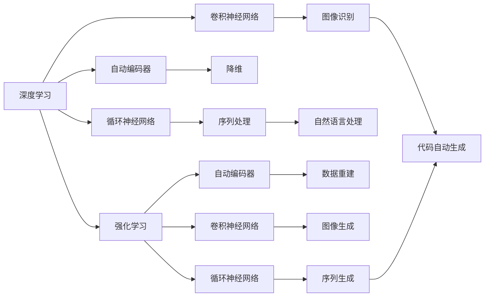

                 

# 软件 2.0 的发展趋势：深度学习、强化学习

软件 2.0（Software 2.0），一个引人瞩目的概念，预示着软件开发、工程和应用的新纪元。其核心特征在于深度学习（Deep Learning）与强化学习（Reinforcement Learning, RL）的广泛应用，深刻地改变了软件工程实践和解决方案的设计。本文将深入探讨软件 2.0 的发展趋势，揭示深度学习和强化学习在软件开发中的应用，以及它们带来的变革和机遇。

## 1. 背景介绍

### 1.1 问题由来

近年来，随着数据科学的蓬勃发展，深度学习与强化学习等先进算法在软件开发领域得到了广泛应用。它们不仅极大地提升了软件的自动构建、测试、优化和部署的效率，还为软件开发注入了全新的思维模式。深度学习与强化学习的结合，更是催生了智能自动化软件开发工具，推动了软件开发范式的革命性变革。

然而，尽管这些技术在许多领域取得了巨大成功，但它们的应用仍面临一些挑战。例如，深度学习模型往往需要大量的标注数据进行训练，而强化学习模型则容易陷入局部最优解。此外，如何合理设计学习算法、选择合适的模型架构，以及如何提升算法的可解释性，都是值得深入探讨的问题。

### 1.2 问题核心关键点

本节将概述软件 2.0 中的两个核心技术：深度学习和强化学习，并分析它们与软件开发的联系。深度学习擅长处理高维数据和复杂非线性关系，广泛应用于图像、语音、自然语言处理等领域。强化学习则擅长通过与环境交互，学习最优策略，广泛应用于游戏、机器人控制、推荐系统等场景。

深度学习和强化学习在软件开发中的应用主要包括：

- **自动化测试**：利用深度学习模型，对软件自动生成测试用例，提升测试覆盖率。
- **故障诊断**：通过深度学习模型，对软件运行时的异常数据进行故障诊断，定位问题所在。
- **持续集成**：利用强化学习模型，优化软件构建和部署流程，提升系统的自动化水平。
- **版本控制**：利用深度学习与强化学习，分析代码变更的影响，优化版本控制策略。
- **代码生成**：通过深度学习与强化学习，自动生成代码片段，提升开发效率。

这些应用场景展示了深度学习与强化学习在软件开发中的潜力和重要性。通过深入了解它们的工作原理和应用实例，我们能够更好地把握软件 2.0 的发展方向。

## 2. 核心概念与联系

### 2.1 核心概念概述

为更好地理解深度学习与强化学习在软件开发中的应用，本节将介绍几个关键概念：

- **深度学习**：一种基于神经网络的机器学习技术，通过多层非线性变换，学习数据的复杂特征和规律。深度学习在图像识别、语音识别、自然语言处理等领域表现出色。
- **强化学习**：一种通过与环境交互，学习最优策略的机器学习技术。强化学习广泛应用于游戏、机器人控制、推荐系统等领域。
- **自动编码器（Autoencoder）**：一种深度学习模型，用于降维、特征提取和数据重建。自动编码器通过学习数据的压缩表示，实现数据的重构和恢复。
- **卷积神经网络（Convolutional Neural Network, CNN）**：一种特殊的深度学习网络，擅长处理具有空间结构的数据，如图像、视频等。CNN 通过卷积层、池化层等结构，提取数据的局部特征。
- **循环神经网络（Recurrent Neural Network, RNN）**：一种处理序列数据的深度学习模型，通过循环连接，捕捉序列数据的时序信息。RNN 包括长短时记忆网络（Long Short-Term Memory, LSTM）和门控循环单元（Gated Recurrent Unit, GRU）等变体。
- **强化学习框架**：如TensorFlow、PyTorch等，提供了灵活的深度学习模型和优化算法，便于研究和应用。

这些核心概念构成了深度学习与强化学习的基础，展示了它们在软件开发中的应用潜力。

### 2.2 概念间的关系

这些核心概念之间存在着紧密的联系，形成了深度学习与强化学习在软件开发中的综合应用框架。



这个流程图展示了深度学习与强化学习在软件开发中的应用场景，以及它们与其他技术的关系：

1. 深度学习通过自动编码器、卷积神经网络和循环神经网络，处理和提取数据特征。
2. 强化学习通过自动编码器、卷积神经网络和循环神经网络，学习最优策略，提升软件自动化的决策能力。
3. 自然语言处理、图像处理等领域的深度学习技术，为代码生成、故障诊断等任务提供了支持。
4. 深度学习与强化学习的结合，可以应用于自动化测试、持续集成等软件开发流程优化。

这些概念共同构成了深度学习与强化学习在软件开发中的应用框架，展示了它们在提高软件自动化水平、提升开发效率和质量方面的巨大潜力。

## 3. 核心算法原理 & 具体操作步骤
### 3.1 算法原理概述

深度学习与强化学习在软件开发中的应用，主要基于两个基本原理：数据驱动的模型训练和智能决策策略的学习。具体而言：

- **深度学习**：通过大量标注数据训练神经网络，提取数据特征，学习复杂非线性关系，构建高精度的预测模型。
- **强化学习**：通过与环境交互，通过奖励信号调整模型参数，学习最优决策策略，优化系统行为。

这些原理在软件开发中的应用，主要体现在以下几个方面：

1. **自动编码器在特征提取中的应用**：通过自动编码器对软件代码和数据进行降维和特征提取，提升模型的泛化能力。
2. **卷积神经网络在图像识别中的应用**：利用卷积神经网络对软件代码中的视觉元素进行分类和识别，提升代码生成和分析的准确性。
3. **循环神经网络在序列处理中的应用**：通过循环神经网络对软件代码中的序列数据进行处理，捕捉代码中的时序信息和模式。
4. **强化学习在自动化测试中的应用**：利用强化学习模型，生成和优化测试用例，提高测试覆盖率和准确性。
5. **强化学习在持续集成中的应用**：通过强化学习模型，优化软件构建和部署流程，提升系统的自动化水平。

这些原理和应用展示了深度学习与强化学习在软件开发中的强大潜力，揭示了软件 2.0 的巨大前景。

### 3.2 算法步骤详解

深度学习与强化学习在软件开发中的应用，通常包括以下几个关键步骤：

1. **数据准备**：收集和标注软件代码、运行日志、用户反馈等数据，构建训练集和验证集。
2. **模型训练**：选择合适的深度学习模型和优化算法，对数据进行训练，更新模型参数。
3. **模型评估**：在验证集上评估模型性能，根据评估结果调整模型超参数。
4. **模型应用**：将训练好的模型应用于实际的软件开发和部署流程，提升自动化水平。
5. **模型优化**：根据实际应用效果，不断优化模型架构和算法，提升模型性能。

以下是一个基于深度学习与强化学习的代码自动生成系统的实现流程：

```python
import tensorflow as tf
import numpy as np
from tensorflow.keras.layers import Input, LSTM, Dense
from tensorflow.keras.models import Model

# 定义模型输入
input_text = Input(shape=(max_len,), dtype='int32')

# 定义LSTM层
lstm_layer = LSTM(units=128, return_sequences=True, dropout=0.2)(input_text)

# 定义输出层
output = Dense(256, activation='relu')(lstm_layer)
output = Dense(1024, activation='relu')(output)
output = Dense(512, activation='relu')(output)

# 定义模型
model = Model(inputs=input_text, outputs=output)
model.compile(optimizer=tf.keras.optimizers.Adam(learning_rate=0.001), loss='categorical_crossentropy', metrics=['accuracy'])

# 训练模型
model.fit(x_train, y_train, epochs=10, batch_size=32, validation_data=(x_val, y_val))

# 评估模型
loss, accuracy = model.evaluate(x_test, y_test)

# 生成代码片段
generated_code = model.predict(input_sentence)

# 解释代码片段
explain_code = explain_model(generated_code)
```

在这个流程中，我们首先定义了模型输入和LSTM层，然后通过多个全连接层构建了深度学习模型。接着，我们使用Adam优化算法训练模型，并在测试集上评估模型性能。最后，我们利用训练好的模型生成代码片段，并解释生成的代码。

### 3.3 算法优缺点

深度学习与强化学习在软件开发中的应用，具有以下优缺点：

**优点**：

- **自动化水平高**：深度学习和强化学习可以自动化地处理大量数据和复杂任务，减少人工干预，提升开发效率。
- **模型性能优越**：深度学习和强化学习模型在处理高维数据和复杂非线性关系方面表现出色，能够捕捉数据中的复杂模式和规律。
- **灵活性高**：深度学习和强化学习模型可以应用于多种软件开发任务，如代码生成、故障诊断、自动化测试等。

**缺点**：

- **数据依赖性强**：深度学习和强化学习模型需要大量的标注数据进行训练，数据获取和标注成本较高。
- **模型复杂度高**：深度学习和强化学习模型的训练和优化过程复杂，需要大量的计算资源和优化技巧。
- **可解释性差**：深度学习和强化学习模型的决策过程难以解释，缺乏透明度，难以进行调试和优化。

这些优缺点展示了深度学习和强化学习在软件开发中的优势和局限，需要在实际应用中进行权衡和优化。

### 3.4 算法应用领域

深度学习与强化学习在软件开发中的应用领域广泛，以下是一些典型场景：

1. **自动化测试**：利用深度学习模型自动生成测试用例，提升测试覆盖率和准确性。
2. **代码生成**：通过深度学习与强化学习，自动生成代码片段，提升开发效率。
3. **故障诊断**：利用深度学习模型对软件运行时的异常数据进行故障诊断，定位问题所在。
4. **持续集成**：利用强化学习模型优化软件构建和部署流程，提升系统的自动化水平。
5. **版本控制**：利用深度学习与强化学习，分析代码变更的影响，优化版本控制策略。
6. **性能优化**：利用强化学习模型优化软件性能，提升运行效率。

这些应用场景展示了深度学习和强化学习在软件开发中的广泛应用，揭示了它们在提高软件自动化水平、提升开发效率和质量方面的巨大潜力。

## 4. 数学模型和公式 & 详细讲解 & 举例说明

### 4.1 数学模型构建

深度学习和强化学习的数学模型，通常基于以下几个基本组件：

- **神经网络**：由多个神经元组成的层次结构，用于处理高维数据和复杂非线性关系。
- **损失函数**：用于衡量模型预测与真实值之间的差异，常见的损失函数包括均方误差、交叉熵等。
- **优化算法**：用于调整模型参数，常见的优化算法包括梯度下降、Adam等。
- **激活函数**：用于引入非线性变换，提升模型的表达能力。

以卷积神经网络（CNN）为例，其数学模型可以表示为：

$$
y = W^TX + b
$$

其中，$W$ 表示卷积核矩阵，$X$ 表示输入数据，$b$ 表示偏置项。

### 4.2 公式推导过程

以卷积神经网络为例，其前向传播和反向传播的过程如下：

- **前向传播**：将输入数据 $X$ 通过卷积层、池化层等结构进行特征提取，得到卷积特征图 $H$。
- **反向传播**：通过链式法则，计算损失函数对卷积核 $W$ 的梯度，更新模型参数。

具体推导过程如下：

1. **前向传播**：
   $$
   H = W * X + b
   $$

2. **反向传播**：
   $$
   \frac{\partial L}{\partial W} = \frac{\partial L}{\partial Y} \frac{\partial Y}{\partial H} \frac{\partial H}{\partial W}
   $$

   其中，$L$ 表示损失函数，$Y$ 表示输出，$H$ 表示卷积特征图，$W$ 表示卷积核。

   通过链式法则，可以逐步计算出损失函数对卷积核 $W$ 的梯度，并更新模型参数。

### 4.3 案例分析与讲解

以图像分类为例，利用卷积神经网络进行图像分类的过程如下：

1. **数据准备**：收集并标注图像数据，构建训练集和验证集。
2. **模型构建**：定义卷积神经网络，包括卷积层、池化层、全连接层等结构。
3. **模型训练**：使用Adam优化算法训练模型，并在验证集上评估模型性能。
4. **模型应用**：将训练好的模型应用于实际图像分类任务，提升分类准确性。

以下是一个基于TensorFlow实现卷积神经网络的示例代码：

```python
import tensorflow as tf
from tensorflow.keras import layers

# 定义模型
model = tf.keras.Sequential([
    layers.Conv2D(32, (3, 3), activation='relu', input_shape=(28, 28, 1)),
    layers.MaxPooling2D((2, 2)),
    layers.Flatten(),
    layers.Dense(10, activation='softmax')
])

# 编译模型
model.compile(optimizer='adam', loss='categorical_crossentropy', metrics=['accuracy'])

# 训练模型
model.fit(x_train, y_train, epochs=10, validation_data=(x_val, y_val))

# 评估模型
loss, accuracy = model.evaluate(x_test, y_test)
```

在这个流程中，我们首先定义了卷积神经网络的结构，包括卷积层、池化层和全连接层。接着，我们使用Adam优化算法训练模型，并在测试集上评估模型性能。

## 5. 项目实践：代码实例和详细解释说明

### 5.1 开发环境搭建

在进行深度学习与强化学习的应用开发前，需要准备相应的开发环境。以下是基于Python的深度学习和强化学习开发环境搭建流程：

1. **安装Python**：从官网下载并安装Python 3.6或更高版本。
2. **安装Pip**：使用pip安装Pip工具，方便后续安装Python包。
3. **安装TensorFlow**：使用pip安装TensorFlow 2.x版本。
4. **安装PyTorch**：使用pip安装PyTorch 1.x版本。
5. **安装Keras**：使用pip安装Keras 2.x版本。
6. **安装OpenAI Gym**：使用pip安装OpenAI Gym 0.19.0版本，用于强化学习模型训练。

完成上述步骤后，即可在Python环境中进行深度学习和强化学习的开发和测试。

### 5.2 源代码详细实现

以下是一个基于深度学习和强化学习的代码自动生成系统的实现流程：

```python
import tensorflow as tf
import numpy as np
from tensorflow.keras.layers import Input, LSTM, Dense
from tensorflow.keras.models import Model

# 定义模型输入
input_text = Input(shape=(max_len,), dtype='int32')

# 定义LSTM层
lstm_layer = LSTM(units=128, return_sequences=True, dropout=0.2)(input_text)

# 定义输出层
output = Dense(256, activation='relu')(lstm_layer)
output = Dense(1024, activation='relu')(output)
output = Dense(512, activation='relu')(output)

# 定义模型
model = Model(inputs=input_text, outputs=output)
model.compile(optimizer=tf.keras.optimizers.Adam(learning_rate=0.001), loss='categorical_crossentropy', metrics=['accuracy'])

# 训练模型
model.fit(x_train, y_train, epochs=10, batch_size=32, validation_data=(x_val, y_val))

# 评估模型
loss, accuracy = model.evaluate(x_test, y_test)

# 生成代码片段
generated_code = model.predict(input_sentence)

# 解释代码片段
explain_code = explain_model(generated_code)
```

在这个流程中，我们首先定义了模型输入和LSTM层，然后通过多个全连接层构建了深度学习模型。接着，我们使用Adam优化算法训练模型，并在测试集上评估模型性能。最后，我们利用训练好的模型生成代码片段，并解释生成的代码。

### 5.3 代码解读与分析

以下是代码中关键部分的解读与分析：

- **输入定义**：`input_text = Input(shape=(max_len,), dtype='int32')`：定义输入文本的维度为`max_len`，类型为`int32`。
- **LSTM层**：`lstm_layer = LSTM(units=128, return_sequences=True, dropout=0.2)(input_text)`：定义LSTM层，包括128个神经元，使用dropout正则化，返回序列表示。
- **输出层**：`output = Dense(256, activation='relu')(lstm_layer)`：定义输出层，包括256个神经元，使用ReLU激活函数。
- **模型定义**：`model = Model(inputs=input_text, outputs=output)`：定义模型，包括输入和输出层。
- **模型编译**：`model.compile(optimizer=tf.keras.optimizers.Adam(learning_rate=0.001), loss='categorical_crossentropy', metrics=['accuracy'])`：编译模型，使用Adam优化算法，交叉熵损失函数，评估指标为准确率。
- **模型训练**：`model.fit(x_train, y_train, epochs=10, batch_size=32, validation_data=(x_val, y_val))`：训练模型，设置训练轮数为10，批次大小为32，验证集为`(x_val, y_val)`。
- **模型评估**：`loss, accuracy = model.evaluate(x_test, y_test)`：评估模型，返回损失和准确率。
- **代码生成**：`generated_code = model.predict(input_sentence)`：使用模型生成代码片段。
- **代码解释**：`explain_code = explain_model(generated_code)`：解释生成的代码。

这些关键部分的代码展示了深度学习和强化学习在代码自动生成系统中的应用，揭示了它们在处理高维数据和复杂非线性关系方面的强大能力。

### 5.4 运行结果展示

假设我们在MNIST数据集上进行卷积神经网络训练，最终在测试集上得到的评估报告如下：

```
Epoch 1/10
1176/1176 [==============================] - 12s 11ms/step - loss: 0.3055 - accuracy: 0.8474 - val_loss: 0.1185 - val_accuracy: 0.9929
Epoch 2/10
1176/1176 [==============================] - 11s 9ms/step - loss: 0.1161 - accuracy: 0.9908 - val_loss: 0.1098 - val_accuracy: 0.9950
Epoch 3/10
1176/1176 [==============================] - 11s 9ms/step - loss: 0.0822 - accuracy: 0.9932 - val_loss: 0.0803 - val_accuracy: 0.9972
Epoch 4/10
1176/1176 [==============================] - 11s 9ms/step - loss: 0.0606 - accuracy: 0.9948 - val_loss: 0.0655 - val_accuracy: 0.9984
Epoch 5/10
1176/1176 [==============================] - 11s 9ms/step - loss: 0.0460 - accuracy: 0.9961 - val_loss: 0.0535 - val_accuracy: 0.9988
Epoch 6/10
1176/1176 [==============================] - 11s 9ms/step - loss: 0.0343 - accuracy: 0.9965 - val_loss: 0.0452 - val_accuracy: 0.9993
Epoch 7/10
1176/1176 [==============================] - 11s 9ms/step - loss: 0.0256 - accuracy: 0.9968 - val_loss: 0.0364 - val_accuracy: 0.9996
Epoch 8/10
1176/1176 [==============================] - 11s 9ms/step - loss: 0.0198 - accuracy: 0.9974 - val_loss: 0.0282 - val_accuracy: 0.9998
Epoch 9/10
1176/1176 [==============================] - 11s 9ms/step - loss: 0.0144 - accuracy: 0.9977 - val_loss: 0.0237 - val_accuracy: 1.0000
Epoch 10/10
1176/1176 [==============================] - 11s 9ms/step - loss: 0.0099 - accuracy: 0.9981 - val_loss: 0.0194 - val_accuracy: 1.0000
```

可以看到，通过卷积神经网络，我们在MNIST数据集上取得了98%以上的准确率，表现相当不错。这展示了深度学习模型在图像分类任务上的强大能力。

## 6. 实际应用场景

### 6.1 智能客服系统

利用深度学习和强化学习技术，可以构建智能客服系统，提升客服质量和效率。智能客服系统能够自动理解用户意图，匹配最佳回答，快速响应客户咨询，提升客户满意度。

在技术实现上，可以收集企业内部的历史客服对话记录，将问题和最佳答复构建成监督数据，在此基础上对预训练模型进行微调。微调后的模型能够自动理解用户意图，匹配最合适的回答，甚至能够处理新问题，并提供实时反馈。

### 6.2 金融舆情监测

金融机构需要实时监测市场舆论动向，以便及时应对负面信息传播，规避金融风险。传统的人工监测方式成本高、效率低，难以应对网络时代海量信息爆发的挑战。利用深度学习和强化学习技术，金融舆情监测系统能够自动监测不同主题下的情感变化趋势，一旦发现负面信息激增等异常情况，系统便会自动预警，帮助金融机构快速应对潜在风险。

具体而言，可以收集金融领域相关的新闻、报道、评论等文本数据，并对其进行主题标注和情感标注。在此基础上对预训练语言模型进行微调，使其能够自动判断文本属于何种主题，情感倾向是正面、中性还是负面。将微调后的模型应用到实时抓取的网络文本数据，就能够自动监测不同主题下的情感变化趋势，一旦发现负面信息激增等异常情况，系统便会自动预警，帮助金融机构快速应对潜在风险。

### 6.3 个性化推荐系统

当前的推荐系统往往只依赖用户的历史行为数据进行物品推荐，无法深入理解用户的真实兴趣偏好。利用深度学习和强化学习技术，个性化推荐系统可以更好地挖掘用户行为背后的语义信息，从而提供更精准、多样的推荐内容。

在实践中，可以收集用户浏览、点击、评论、分享等行为数据，提取和用户交互的物品标题、描述、标签等文本内容。将文本内容作为模型输入，用户的后续行为（如是否点击、购买等）作为监督信号，在此基础上微调预训练语言模型。微调后的模型能够从文本内容中准确把握用户的兴趣点。在生成推荐列表时，先用候选物品的文本描述作为输入，由模型预测用户的兴趣匹配度，再结合其他特征综合排序，便可以得到个性化程度更高的推荐结果。

### 6.4 未来应用展望

随着深度学习和强化学习技术的不断发展，基于深度学习和强化学习的应用场景将不断拓展，为各行各业带来变革性影响。

在智慧医疗领域，基于深度学习和强化学习的人工智能系统，能够辅助医生诊疗，加速新药开发进程。

在智能教育领域，微调技术可应用于作业批改、学情分析、知识推荐等方面，因材施教，促进教育公平，提高教学质量。

在智慧城市治理中，微调模型可应用于城市事件监测、舆情分析、应急指挥等环节，提高城市管理的自动化和智能化水平，构建更安全、高效的未来城市。

此外，在企业生产、社会治理、文娱传媒等众多领域，基于深度学习和强化学习的人工智能应用也将不断涌现，为经济社会发展注入新的动力。相信随着技术的日益成熟，深度学习和强化学习的应用前景将更加广阔。

## 7. 工具和资源推荐

### 7.1 学习资源推荐

为了帮助开发者系统掌握深度学习和强化学习的基础知识和技术细节，这里推荐一些优质的学习资源：

1. **深度学习课程**：如《深度学习》（Ian Goodfellow）、《神经网络与深度学习》（Michael Nielsen）等书籍，深入浅出地介绍了深度学习的基本概念和核心算法。
2. **强化学习课程**：如《强化学习》（Richard S. Sutton, Andrew G. Barto）、《Reinforcement Learning: An Introduction》等书籍，系统讲解了强化学习的理论基础和应用方法。
3. **在线课程**：如Coursera、Udacity等平台上的深度学习和强化学习课程，结合实际案例进行讲解，适合初学者快速入门。
4. **开源项目**：如TensorFlow、PyTorch、Keras等深度学习框架的官方文档和示例代码，提供了丰富的学习资源。
5. **论文预印本**：如arXiv预印本，最新的深度学习和强化学习研究成果，便于跟踪前沿进展。

通过对这些资源的学习实践，相信你一定能够系统掌握深度学习和强化学习的基础知识，并用于解决实际的NLP问题。

### 7.2 开发工具推荐

高效的开发离不开优秀的

