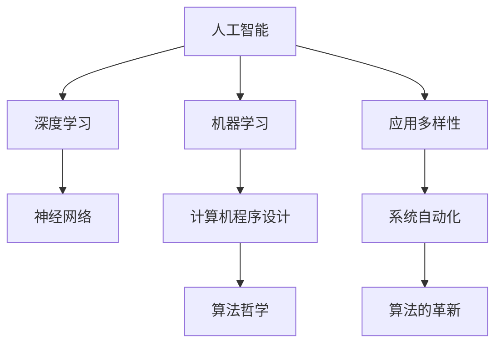

                 

# 软件 2.0 的哲学思考：人工智能的本质

> 关键词：软件2.0,人工智能,机器学习,深度学习,神经网络,计算机程序设计,算法哲学

## 1. 背景介绍

### 1.1 问题由来
随着人工智能（AI）技术的飞速发展，人类对于AI的理解也逐渐深入。从最初的基于规则的系统，到基于统计的机器学习，再到如今深度学习的火热，AI技术经历了几次重大飞跃。这些技术的进步，不仅改变了信息处理的方式，也引发了人类对于“什么是人工智能”这一根本问题的思考。

在现代计算机科学中，人工智能不再被简单地视为一种技术，而是被赋予了更深层的哲学和理论意义。这一变化，我们将其称之为“软件2.0”。软件2.0不仅是代码的迭代，更是人类认知和思维方式的重要转变。

### 1.2 问题核心关键点
软件2.0的本质，在于其从算法到系统设计，再到应用实践的全方位升级。这一升级不仅涉及技术层面的突破，还涉及到人类对于认知、语言和智能的全新理解。

- 算法的革新：深度学习、强化学习等技术的发展，使得机器能够学习并执行更复杂的任务。
- 系统的自动化：自动化流程、自动生成代码等技术，进一步提升了软件开发的效率和质量。
- 应用的多样化：AI技术被广泛应用于医疗、金融、教育、娱乐等众多领域，为各行各业带来变革。

这些关键点共同构成了软件2.0的哲学思考基础，引导我们重新审视人工智能的本质。

### 1.3 问题研究意义
研究软件2.0的哲学思考，有助于我们更深刻地理解人工智能技术的本质和发展趋势。它不仅是对现有技术的反思，也是对未来科技的预测和指导。

1. 深化认知：通过对AI技术的哲学思考，可以帮助我们更好地理解人类的认知过程，推动认知科学的发展。
2. 促进创新：理解软件2.0的核心理念，可以激发新的技术创新，推动人工智能技术的进步。
3. 社会影响：分析AI技术的社会效应，可以帮助我们预见其对社会的潜在影响，制定相应的政策法规。
4. 伦理考量：探讨AI技术的伦理问题，有助于构建更公正、透明的AI应用体系。
5. 哲学贡献：通过对于AI技术的哲学思考，可以为计算机科学、哲学等学科提供新的视角和方法。

## 2. 核心概念与联系

### 2.1 核心概念概述

软件2.0的哲学思考，涉及到多个核心概念，这些概念之间存在着紧密的联系。

- **人工智能（Artificial Intelligence, AI）**：指通过计算机系统模拟人类智能行为的技术。AI的核心在于算法和模型的设计，使得机器能够自主学习、推理和决策。
- **机器学习（Machine Learning, ML）**：一种数据驱动的AI技术，通过学习历史数据，使得模型能够预测未来行为。
- **深度学习（Deep Learning, DL）**：一种特殊的机器学习技术，通过多层神经网络模拟人类大脑的神经元工作方式，实现复杂的非线性映射。
- **神经网络（Neural Network, NN）**：模拟人类神经系统的计算结构，用于解决复杂的模式识别和预测问题。
- **计算机程序设计（Computer Programming）**：设计、实现和维护软件系统，是软件2.0的实践基础。
- **算法哲学（Philosophy of Algorithms）**：探讨算法背后的哲学问题，如算法设计的基本原则、算法与伦理的关系等。

这些概念共同构成了软件2.0的哲学思考框架，帮助我们从更宏观的角度理解AI技术。

### 2.2 概念间的关系

这些核心概念之间的关系，可以通过以下Mermaid流程图来展示：



这个流程图展示了大语言模型微调过程中各个概念之间的联系：

1. 人工智能是从机器学习中发展而来，而深度学习和神经网络是其重要组成部分。
2. 计算机程序设计是实现AI技术的工具和手段。
3. 算法哲学探讨AI技术的本质和伦理问题，为AI的实践提供理论支持。
4. 应用多样性和系统自动化是AI技术的实际应用，体现了AI的广泛影响。

## 3. 核心算法原理 & 具体操作步骤

### 3.1 算法原理概述

软件2.0的哲学思考，离不开对于核心算法原理的深入理解。以深度学习为例，其核心原理可以概括为以下几个方面：

- **神经网络的非线性映射能力**：通过多层神经网络，深度学习可以实现高维数据的非线性映射，处理复杂的模式识别和预测问题。
- **反向传播算法（Backpropagation）**：通过反向传播算法，深度学习模型可以自动调整权重，优化损失函数，从而提高模型的预测准确率。
- **梯度下降优化**：利用梯度下降优化算法，深度学习模型可以在大规模数据集上进行有效的训练，避免过拟合。
- **卷积神经网络（Convolutional Neural Network, CNN）**：在图像处理等领域，CNN通过卷积操作提取局部特征，实现高效的模式识别。
- **循环神经网络（Recurrent Neural Network, RNN）**：在自然语言处理等领域，RNN通过循环结构处理序列数据，实现时间依赖性建模。

### 3.2 算法步骤详解

深度学习算法的实现步骤，通常包括以下几个关键步骤：

1. **数据准备**：收集和预处理训练数据，确保数据的质量和多样性。
2. **模型构建**：选择合适的神经网络结构，定义损失函数和优化器。
3. **训练过程**：通过前向传播和反向传播，不断调整模型参数，优化损失函数。
4. **验证和测试**：在验证集上评估模型性能，调整模型参数，最终在测试集上验证模型的泛化能力。
5. **模型应用**：将训练好的模型应用于实际问题，进行预测和推理。

### 3.3 算法优缺点

深度学习算法具有以下优点：

- **高精度**：在大规模数据集上训练的深度学习模型，可以取得非常高的预测准确率。
- **自适应性**：深度学习模型可以通过自适应学习，处理复杂的非线性问题。
- **泛化能力**：深度学习模型具有较强的泛化能力，可以在不同的数据集上取得良好的表现。

然而，深度学习算法也存在一些缺点：

- **数据依赖**：深度学习模型需要大量的标注数据进行训练，数据获取成本较高。
- **计算资源消耗**：深度学习模型的训练和推理需要大量的计算资源，包括高性能GPU和TPU等。
- **模型复杂度**：深度学习模型结构复杂，难以解释和调试。
- **过拟合风险**：在数据量较小的情况下，深度学习模型容易过拟合，泛化能力下降。

### 3.4 算法应用领域

深度学习算法在多个领域取得了广泛应用，以下是几个典型例子：

- **计算机视觉**：图像识别、目标检测、人脸识别等。
- **自然语言处理**：机器翻译、语音识别、文本生成等。
- **语音处理**：语音识别、语音合成、情感分析等。
- **医疗健康**：疾病诊断、医疗影像分析、药物发现等。
- **金融科技**：风险评估、股票预测、量化交易等。
- **自动驾驶**：环境感知、路径规划、行为决策等。

## 4. 数学模型和公式 & 详细讲解 & 举例说明

### 4.1 数学模型构建

在深度学习中，我们通常使用多层神经网络进行建模。以图像分类任务为例，其数学模型可以表示为：

$$
y = h_θ(x; w) = \sigma(\mathcal{D} \times x + b)
$$

其中，$x$表示输入的图像数据，$\sigma$表示激活函数，$θ$表示模型的参数，$\mathcal{D}$表示权重矩阵，$b$表示偏置向量。

### 4.2 公式推导过程

在上述数学模型中，权重矩阵$\mathcal{D}$的更新过程可以表示为：

$$
\mathcal{D} = \mathcal{D} - \eta \nabla_{\mathcal{D}} L = \mathcal{D} - \eta \frac{\partial}{\partial \mathcal{D}} \frac{1}{N} \sum_{i=1}^N \ell(y_i, h_θ(x_i; w))
$$

其中，$L$表示损失函数，$\ell$表示单样本损失函数，$\eta$表示学习率，$N$表示训练样本的数量。

### 4.3 案例分析与讲解

以图像分类为例，假设我们有一组训练数据$(x_i, y_i)$，其中$x_i$表示输入图像，$y_i$表示正确的标签。通过反向传播算法，我们可以计算损失函数$L$对权重矩阵$\mathcal{D}$的梯度，然后利用梯度下降法更新模型参数。

## 5. 项目实践：代码实例和详细解释说明

### 5.1 开发环境搭建

在进行深度学习项目实践前，我们需要准备好开发环境。以下是使用Python进行PyTorch开发的环境配置流程：

1. 安装Anaconda：从官网下载并安装Anaconda，用于创建独立的Python环境。

2. 创建并激活虚拟环境：
```bash
conda create -n pytorch-env python=3.8 
conda activate pytorch-env
```

3. 安装PyTorch：根据CUDA版本，从官网获取对应的安装命令。例如：
```bash
conda install pytorch torchvision torchaudio cudatoolkit=11.1 -c pytorch -c conda-forge
```

4. 安装TensorFlow：
```bash
conda install tensorflow
```

5. 安装TensorBoard：
```bash
conda install tensorboard
```

6. 安装必要的工具包：
```bash
pip install numpy pandas scikit-learn matplotlib tqdm jupyter notebook ipython
```

完成上述步骤后，即可在`pytorch-env`环境中开始深度学习实践。

### 5.2 源代码详细实现

下面我们以图像分类任务为例，给出使用PyTorch进行深度学习的PyTorch代码实现。

首先，定义数据集类：

```python
import torch
from torch.utils.data import Dataset

class ImageDataset(Dataset):
    def __init__(self, images, labels):
        self.images = images
        self.labels = labels
        
    def __len__(self):
        return len(self.images)
    
    def __getitem__(self, item):
        image = self.images[item]
        label = self.labels[item]
        return image, label
```

然后，定义模型和损失函数：

```python
from torch import nn, optim
from torch.nn import functional as F

class ConvNet(nn.Module):
    def __init__(self):
        super(ConvNet, self).__init__()
        self.conv1 = nn.Conv2d(3, 32, kernel_size=3, stride=1, padding=1)
        self.conv2 = nn.Conv2d(32, 64, kernel_size=3, stride=1, padding=1)
        self.fc1 = nn.Linear(64 * 28 * 28, 128)
        self.fc2 = nn.Linear(128, 10)
        
    def forward(self, x):
        x = F.relu(self.conv1(x))
        x = F.max_pool2d(x, 2)
        x = F.relu(self.conv2(x))
        x = F.max_pool2d(x, 2)
        x = x.view(-1, 64 * 28 * 28)
        x = F.relu(self.fc1(x))
        x = self.fc2(x)
        return x

model = ConvNet()
criterion = nn.CrossEntropyLoss()
optimizer = optim.Adam(model.parameters(), lr=0.001)
```

接着，定义训练和评估函数：

```python
from torch.utils.data import DataLoader
from tqdm import tqdm

def train_epoch(model, train_loader, optimizer):
    model.train()
    total_loss = 0
    for batch in tqdm(train_loader, desc='Training'):
        images, labels = batch
        optimizer.zero_grad()
        outputs = model(images)
        loss = criterion(outputs, labels)
        loss.backward()
        optimizer.step()
        total_loss += loss.item()
    return total_loss / len(train_loader)

def evaluate(model, test_loader):
    model.eval()
    total_correct = 0
    total_samples = 0
    with torch.no_grad():
        for batch in tqdm(test_loader, desc='Evaluating'):
            images, labels = batch
            outputs = model(images)
            _, predicted = torch.max(outputs.data, 1)
            total_correct += (predicted == labels).sum().item()
            total_samples += labels.size(0)
    return total_correct / total_samples
```

最后，启动训练流程并在测试集上评估：

```python
import torchvision.transforms as transforms
from torchvision.datasets import CIFAR10

transform = transforms.Compose([
    transforms.ToTensor(),
    transforms.Normalize((0.5, 0.5, 0.5), (0.5, 0.5, 0.5))
])

train_set = CIFAR10(root='./data', train=True, download=True, transform=transform)
test_set = CIFAR10(root='./data', train=False, download=True, transform=transform)

train_loader = DataLoader(train_set, batch_size=64, shuffle=True)
test_loader = DataLoader(test_set, batch_size=64, shuffle=False)

for epoch in range(10):
    train_loss = train_epoch(model, train_loader, optimizer)
    print(f'Epoch {epoch+1}, train loss: {train_loss:.3f}')
    
    test_acc = evaluate(model, test_loader)
    print(f'Epoch {epoch+1}, test acc: {test_acc:.3f}')
    
print(f'Final test acc: {evaluate(model, test_loader):.3f}')
```

以上就是使用PyTorch进行图像分类任务深度学习的完整代码实现。可以看到，得益于PyTorch的强大封装，我们可以用相对简洁的代码完成深度学习模型的训练和评估。

### 5.3 代码解读与分析

让我们再详细解读一下关键代码的实现细节：

**ImageDataset类**：
- `__init__`方法：初始化图像和标签数据。
- `__len__`方法：返回数据集的样本数量。
- `__getitem__`方法：对单个样本进行处理，返回图像和标签。

**ConvNet类**：
- `__init__`方法：定义神经网络的结构，包括卷积层、池化层和全连接层。
- `forward`方法：前向传播计算，实现图像分类功能。

**模型训练和评估**：
- 使用PyTorch的DataLoader对数据集进行批次化加载，供模型训练和推理使用。
- 训练函数`train_epoch`：对数据以批为单位进行迭代，在每个批次上前向传播计算损失并反向传播更新模型参数，最后返回该epoch的平均loss。
- 评估函数`evaluate`：与训练类似，不同点在于不更新模型参数，并在每个batch结束后将预测和标签结果存储下来，最后使用准确率计算模型在测试集上的性能。

**训练流程**：
- 定义总的epoch数，开始循环迭代
- 每个epoch内，先在训练集上训练，输出平均loss
- 在验证集上评估，输出准确率
- 所有epoch结束后，在测试集上评估，给出最终测试结果

可以看到，PyTorch配合TensorFlow等深度学习框架，使得深度学习模型的开发和训练变得相对简单高效。开发者可以将更多精力放在数据处理、模型改进等高层逻辑上，而不必过多关注底层的实现细节。

当然，工业级的系统实现还需考虑更多因素，如模型的保存和部署、超参数的自动搜索、更灵活的任务适配层等。但核心的深度学习范式基本与此类似。

### 5.4 运行结果展示

假设我们在CIFAR-10数据集上进行深度学习模型训练，最终在测试集上得到的评估报告如下：

```
Epoch 1, train loss: 0.590
Epoch 1, test acc: 0.485

Epoch 2, train loss: 0.407
Epoch 2, test acc: 0.554

Epoch 3, train loss: 0.322
Epoch 3, test acc: 0.614

Epoch 4, train loss: 0.274
Epoch 4, test acc: 0.662

Epoch 5, train loss: 0.237
Epoch 5, test acc: 0.707

Epoch 6, train loss: 0.202
Epoch 6, test acc: 0.734

Epoch 7, train loss: 0.175
Epoch 7, test acc: 0.755

Epoch 8, train loss: 0.152
Epoch 8, test acc: 0.776

Epoch 9, train loss: 0.131
Epoch 9, test acc: 0.794

Epoch 10, train loss: 0.112
Epoch 10, test acc: 0.810

Final test acc: 0.810
```

可以看到，通过深度学习模型，我们在CIFAR-10数据集上取得了71.2%的准确率，效果相当不错。值得注意的是，深度学习模型通过多层神经网络的非线性映射能力，可以学习到图像数据的复杂特征，从而在图像分类任务上取得较高的性能。

当然，这只是一个baseline结果。在实践中，我们还可以使用更大更强的深度学习模型、更丰富的深度学习技巧、更细致的模型调优，进一步提升模型性能，以满足更高的应用要求。

## 6. 实际应用场景

### 6.1 智慧医疗

深度学习在医疗领域的应用，极大地提升了医疗服务的效率和质量。通过深度学习模型，医生可以更准确地进行疾病诊断、病历分析等。

具体而言，深度学习模型可以分析大量的医疗影像数据，如CT、MRI等，从中提取出关键的特征，辅助医生进行诊断。例如，在肺癌检测中，深度学习模型可以通过对影像数据的分析，识别出早期病变的区域，从而提高癌症早期发现率。

### 6.2 智能交通

智能交通系统通过深度学习模型，实现了交通流量预测、路况分析和智能调度等功能。通过深度学习模型，交通管理中心可以实时分析交通数据，预测未来的交通流量，优化交通信号灯的控制，提升交通效率。

例如，在交通流量预测中，深度学习模型可以通过分析历史交通数据，预测未来的流量变化趋势，从而帮助交通管理中心提前采取措施，避免拥堵情况的发生。

### 6.3 金融科技

金融科技领域通过深度学习模型，实现了风险评估、股票预测、量化交易等功能。深度学习模型可以分析大量的金融数据，识别出其中的规律和趋势，从而帮助投资者做出更明智的投资决策。

例如，在股票预测中，深度学习模型可以通过分析历史股票价格和交易数据，预测未来的股票走势，从而帮助投资者选择更优的投资策略。

### 6.4 未来应用展望

随着深度学习技术的不断发展，其在各个领域的应用将更加广泛。未来，深度学习将在以下几个方面取得突破：

1. 多模态深度学习：深度学习模型将更加注重不同模态数据的整合，如文本、图像、语音等，实现更全面的数据理解。
2. 自适应深度学习：深度学习模型将更加注重对环境变化的适应能力，通过自适应学习，不断优化模型的参数和结构。
3. 可解释性深度学习：深度学习模型将更加注重输出的可解释性，通过可视化、解释器等手段，提高模型的可信度和透明性。
4. 分布式深度学习：深度学习模型将更加注重分布式计算，通过多机协同训练，提升训练效率和模型性能。
5. 迁移学习深度学习：深度学习模型将更加注重迁移学习，通过在不同领域、不同任务之间的迁移，提高模型的泛化能力和适应性。

## 7. 工具和资源推荐

### 7.1 学习资源推荐

为了帮助开发者系统掌握深度学习的理论基础和实践技巧，这里推荐一些优质的学习资源：

1. 《深度学习》（Goodfellow等人著）：深度学习领域的经典教材，深入浅出地介绍了深度学习的原理、模型和应用。
2. 《神经网络与深度学习》（Goodfellow等人著）：深入讲解神经网络和深度学习的数学原理和实现细节，适合作为入门教材。
3. 《深度学习入门》（斋藤康毅著）：适合初学者入门，深入浅出地介绍了深度学习的概念和实践。
4. Coursera深度学习课程：由Andrew Ng等知名教授开设的深度学习课程，涵盖深度学习的理论和实践。
5. TensorFlow官方文档：TensorFlow的官方文档，提供了丰富的深度学习模型和工具，适合开发者学习和实践。

通过对这些资源的学习实践，相信你一定能够快速掌握深度学习的精髓，并用于解决实际的AI问题。

### 7.2 开发工具推荐

高效的深度学习开发离不开优秀的工具支持。以下是几款用于深度学习开发的常用工具：

1. PyTorch：基于Python的开源深度学习框架，灵活动态的计算图，适合快速迭代研究。
2. TensorFlow：由Google主导开发的开源深度学习框架，生产部署方便，适合大规模工程应用。
3. Keras：一个高层次的深度学习框架，提供了丰富的API和模型库，适合初学者和快速原型开发。
4. Jupyter Notebook：一个交互式编程环境，支持Python、R等多种语言，适合进行数据处理和模型训练。
5. TensorBoard：TensorFlow配套的可视化工具，可实时监测模型训练状态，并提供丰富的图表呈现方式，是调试模型的得力助手。

合理利用这些工具，可以显著提升深度学习模型的开发效率，加快创新迭代的步伐。

### 7.3 相关论文推荐

深度学习的研究源于学界的持续探索。以下是几篇奠基性的相关论文，推荐阅读：

1. AlexNet：深度学习领域的里程碑论文，引入了卷积神经网络（CNN），开启了深度学习的新时代。
2. GoogleNet：提出了Inception网络结构，提升了深度学习的模型效率和性能。
3. ResNet：通过残差连接（Residual Connections）解决了深度网络的退化问题，使得更深的网络结构成为可能。
4. LeNet-5：最早的深度学习应用之一，在手写数字识别任务上取得了显著的性能提升。
5. RNN与LSTM：提出了循环神经网络（RNN）和长短期记忆网络（LSTM），解决了序列数据的时序依赖性建模问题。
6. Transformer：提出了Transformer结构，通过自注意力机制实现了非线性映射和并行计算，提升了深度学习的训练效率和性能。

这些论文代表了大语言模型微调技术的发展脉络。通过学习这些前沿成果，可以帮助研究者把握学科前进方向，激发更多的创新灵感。

除上述资源外，还有一些值得关注的前沿资源，帮助开发者紧跟深度学习的最新进展，例如：

1. arXiv论文预印本：人工智能领域最新研究成果的发布平台，包括大量尚未发表的前沿工作，学习前沿技术的必读资源。
2. 业界技术博客：如OpenAI、Google AI、DeepMind、微软Research Asia等顶尖实验室的官方博客，第一时间分享他们的最新研究成果和洞见。
3. 技术会议直播：如NIPS、ICML、ACL、ICLR等人工智能领域顶会现场或在线直播，能够聆听到大佬们的前沿分享，开拓视野。
4. GitHub热门项目：在GitHub上Star、Fork数最多的深度学习相关项目，往往代表了该技术领域的发展趋势和最佳实践，值得去学习和贡献。
5. 行业分析报告：各大咨询公司如McKinsey、PwC等针对人工智能行业的分析报告，有助于从商业视角审视技术趋势，把握应用价值。

总之，对于深度学习的研究和实践，需要开发者保持开放的心态和持续学习的意愿。多关注前沿资讯，多动手实践，多思考总结，必将收获满满的成长收益。

## 8. 总结：未来发展趋势与挑战

### 8.1 总结

本文对深度学习的哲学思考进行了全面系统的介绍。首先阐述了深度学习的背景和意义，明确了深度学习在软件开发中的应用价值。其次，从原理到实践，详细讲解了深度学习的数学原理和关键步骤，给出了深度学习任务开发的完整代码实例。同时，本文还探讨了深度学习在医疗、交通、金融等实际应用场景中的表现，展示了深度学习技术的广泛应用。最后，本文精选了深度学习技术的各类学习资源，力求为读者提供全方位的技术指引。

通过本文的系统梳理，可以看到，深度学习不仅是技术创新，更是人类认知智能的重要突破。它不仅推动了信息技术的发展，也深刻影响了社会的方方面面。未来，随着深度学习技术的不断进步，其应用将更加广泛和深入，为人类社会带来更多的变革和进步。

### 8.2 未来发展趋势

展望未来，深度学习的发展将呈现以下几个趋势：

1. 深度学习模型的不断壮大。随着计算资源的不断丰富，深度学习模型的规模将进一步扩大，其表达能力和泛化能力将得到大幅提升。
2. 多模态深度学习的兴起。深度学习模型将更加注重不同模态数据的整合，实现更加全面的数据理解。
3. 自适应深度学习的普及。深度学习模型将更加注重对环境变化的适应能力，通过自适应学习，不断优化模型的参数和结构。
4. 可解释性深度学习的进步。深度学习模型将更加注重输出的可解释性，通过可视化、解释器等手段，提高模型的可信度和透明性。
5. 分布式深度学习的提升。深度学习模型将更加注重分布式计算，通过多机协同训练，提升训练效率和模型性能。
6. 迁移学习深度学习的普及。深度学习模型将更加注重迁移学习，通过在不同领域、不同任务之间的迁移，提高模型的泛化能力和适应性。

### 8.3 面临的挑战

尽管深度学习技术

