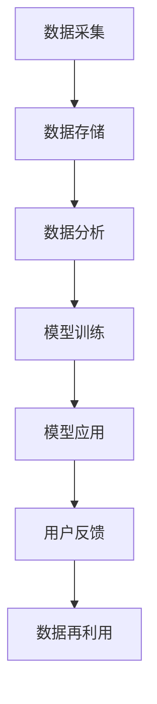
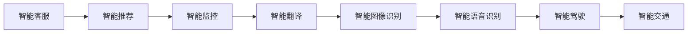
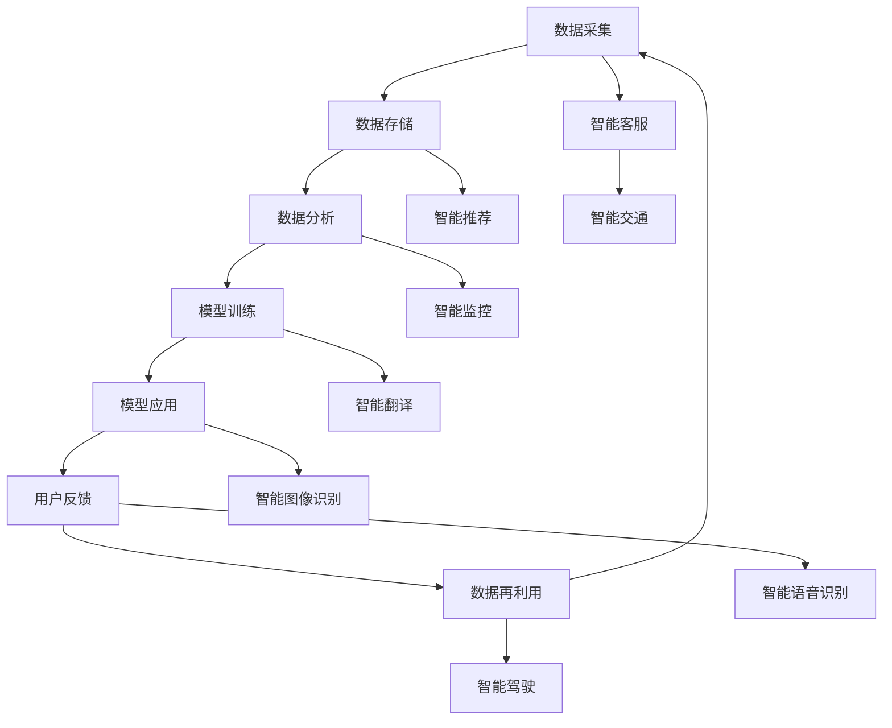

                 

# 软件 2.0 的未来展望：更智能、更强大

> 关键词：软件2.0, 人工智能, 机器学习, 深度学习, 自然语言处理(NLP), 计算机视觉, 自动化, 人机交互, 智能应用

## 1. 背景介绍

### 1.1 问题由来

随着信息技术的飞速发展，软件已经成为推动人类社会进步的重要引擎。然而，传统软件系统面临众多挑战，如开发周期长、维护成本高、更新迭代慢等问题，已经难以适应快速变化的数字化经济环境。这种背景下，软件2.0应运而生。

软件2.0的核心思想是利用人工智能(AI)和大数据技术，构建能够自动学习、自动适应、自动优化的智能软件系统。通过引入机器学习(ML)、深度学习(DL)等前沿技术，软件2.0能够实时感知环境变化，预测用户需求，自适应调整功能和行为，极大地提升软件系统的智能水平和用户体验。

### 1.2 问题核心关键点

软件2.0的关键点在于实现软件系统的智能化和自适应性。通过引入人工智能和大数据技术，软件系统能够从海量数据中自动学习知识，自适应环境变化，动态调整自身功能和行为，以实现持续优化和进化。这种范式将大幅缩短软件开发的周期，降低维护成本，提升系统的稳定性和用户体验。

软件2.0的核心技术包括但不限于：

- **机器学习与深度学习**：通过自动化数据分析和模式识别，实现软件系统的智能决策。
- **自然语言处理(NLP)**：使软件系统具备理解自然语言、自动生成文本和对话的能力。
- **计算机视觉**：使软件系统具备感知和理解图像、视频等视觉信息的能力。
- **自动化测试与部署**：通过自动化测试和持续集成(CI)技术，提升软件开发的效率和质量。
- **人机交互与智能应用**：使软件系统具备智能化的界面设计和用户交互能力，提升用户体验。

## 2. 核心概念与联系

### 2.1 核心概念概述

为更好地理解软件2.0的未来展望，本节将介绍几个密切相关的核心概念：

- **人工智能(AI)**：一种通过算法和模型，使计算机具备智能决策能力的学科。软件2.0中的AI主要通过机器学习、深度学习等技术实现。
- **机器学习(ML)**：一种通过数据训练模型，使模型具备预测和决策能力的学科。软件2.0中的ML主要用于自动化数据分析和模式识别。
- **深度学习(DL)**：一种基于神经网络的机器学习技术，能够处理大规模高维数据，实现复杂决策。软件2.0中的DL主要应用于自然语言处理、计算机视觉等领域。
- **自然语言处理(NLP)**：一种使计算机具备理解、生成自然语言能力的技术。软件2.0中的NLP用于实现智能客服、智能翻译、智能摘要等功能。
- **计算机视觉**：一种使计算机具备感知和理解图像、视频等视觉信息的能力。软件2.0中的CV用于实现人脸识别、图像分类、物体检测等功能。
- **自动化测试与部署**：通过自动化测试和持续集成技术，提升软件开发的效率和质量。软件2.0中的自动化测试与部署技术主要用于软件开发的CI/CD流程。
- **人机交互与智能应用**：使软件系统具备智能化的界面设计和用户交互能力，提升用户体验。软件2.0中的HCI主要用于实现智能聊天机器人、智能推荐系统等应用。

这些核心概念之间的逻辑关系可以通过以下Mermaid流程图来展示：

```mermaid
graph LR
    A[人工智能(AI)] --> B[机器学习(ML)]
    A --> C[深度学习(DL)]
    B --> D[自然语言处理(NLP)]
    C --> E[计算机视觉(CV)]
    D --> F[自动化测试与部署]
    E --> G[人机交互与智能应用]
```

这个流程图展示了人工智能、机器学习、深度学习、自然语言处理、计算机视觉、自动化测试与部署、人机交互与智能应用之间的逻辑关系：

- 人工智能通过机器学习和深度学习实现，具备智能决策能力。
- 自然语言处理和计算机视觉作为人工智能的重要分支，分别用于处理文本和图像数据。
- 自动化测试与部署和人机交互与智能应用则通过自动化技术提升软件开发的效率和用户体验。

### 2.2 概念间的关系

这些核心概念之间存在着紧密的联系，形成了软件2.0的未来生态系统。下面我们通过几个Mermaid流程图来展示这些概念之间的关系。

#### 2.2.1 软件2.0的架构

```mermaid
graph TB
    A[人工智能(AI)] --> B[机器学习(ML)]
    A --> C[深度学习(DL)]
    B --> D[自然语言处理(NLP)]
    C --> E[计算机视觉(CV)]
    D --> F[自动化测试与部署]
    E --> G[人机交互与智能应用]
    F --> G
```

这个流程图展示了软件2.0的架构：

- 人工智能是核心，通过机器学习和深度学习实现智能决策。
- 自然语言处理和计算机视觉作为AI的分支，用于处理文本和图像数据。
- 自动化测试与部署和人机交互与智能应用则通过自动化技术提升软件开发的效率和用户体验。

#### 2.2.2 软件2.0的数据流



这个流程图展示了软件2.0的数据流：

- 数据采集：从各种来源获取原始数据，如网络日志、用户行为数据、传感器数据等。
- 数据存储：将原始数据存储到数据库或云存储中。
- 数据分析：对数据进行预处理、清洗、特征提取等，为模型训练做准备。
- 模型训练：使用机器学习或深度学习模型对数据进行训练，实现智能决策和预测。
- 模型应用：将训练好的模型部署到应用中，实现自动化决策和智能化服务。
- 用户反馈：用户对服务结果的反馈，用于进一步优化模型。
- 数据再利用：利用用户反馈数据进行模型再训练和优化。

#### 2.2.3 软件2.0的智能应用场景



这个流程图展示了软件2.0的智能应用场景：

- 智能客服：利用自然语言处理技术，实现智能客服系统，提升客户满意度。
- 智能推荐：通过机器学习算法，实现个性化推荐系统，提升用户体验。
- 智能监控：使用计算机视觉技术，实现监控系统，保障安全。
- 智能翻译：利用深度学习技术，实现自动翻译服务，促进跨语言沟通。
- 智能图像识别：通过计算机视觉技术，实现图像分类、物体检测等功能。
- 智能语音识别：利用深度学习技术，实现语音识别和转写功能。
- 智能驾驶：通过计算机视觉和自动化测试技术，实现智能驾驶系统，提升交通安全。
- 智能交通：利用计算机视觉和智能推荐技术，实现智能交通系统，优化交通流量。

### 2.3 核心概念的整体架构

最后，我们用一个综合的流程图来展示这些核心概念在软件2.0中的整体架构：



这个综合流程图展示了从数据采集到模型应用，再到智能应用的全流程：

- 数据采集：从各种来源获取原始数据，如网络日志、用户行为数据、传感器数据等。
- 数据存储：将原始数据存储到数据库或云存储中。
- 数据分析：对数据进行预处理、清洗、特征提取等，为模型训练做准备。
- 模型训练：使用机器学习或深度学习模型对数据进行训练，实现智能决策和预测。
- 模型应用：将训练好的模型部署到应用中，实现自动化决策和智能化服务。
- 用户反馈：用户对服务结果的反馈，用于进一步优化模型。
- 数据再利用：利用用户反馈数据进行模型再训练和优化。
- 智能应用：利用模型和数据，实现智能客服、智能推荐、智能监控、智能翻译、智能图像识别、智能语音识别、智能驾驶、智能交通等功能。

通过这些流程图，我们可以更清晰地理解软件2.0的数据流和智能应用场景，为后续深入讨论具体的技术细节奠定基础。

## 3. 核心算法原理 & 具体操作步骤
### 3.1 算法原理概述

软件2.0的核心算法原理基于人工智能和大数据技术，通过机器学习、深度学习等方法，实现软件的智能化和自适应性。其核心思想是将软件系统视作一个可以自动学习和优化的智能系统，通过从数据中学习知识，自动调整自身行为和功能，以实现持续优化和进化。

具体来说，软件2.0的算法原理包括以下几个关键环节：

1. **数据采集与预处理**：从各种来源获取原始数据，并进行清洗、预处理和特征提取，为后续的模型训练做准备。
2. **模型训练与优化**：使用机器学习或深度学习模型对数据进行训练，实现智能决策和预测。通过正则化、优化器等技术，不断优化模型，提升其性能和泛化能力。
3. **模型部署与应用**：将训练好的模型部署到应用中，实现自动化决策和智能化服务。通过持续集成和自动化测试技术，确保模型在实际应用中的稳定性和可靠性。
4. **用户反馈与迭代优化**：收集用户反馈，用于进一步优化模型。通过持续迭代和优化，使软件系统能够不断适应环境变化，提升用户体验。

### 3.2 算法步骤详解

软件2.0的算法步骤包括但不限于以下环节：

#### 3.2.1 数据采集与预处理

1. **数据采集**：从各种来源获取原始数据，如网络日志、用户行为数据、传感器数据等。可以使用爬虫技术、API接口等方式进行数据采集。
2. **数据清洗与预处理**：对原始数据进行清洗、去重、标准化等预处理操作，去除噪音和冗余信息。使用Python的Pandas、Scikit-learn等库进行数据预处理。
3. **特征提取与选择**：从原始数据中提取有意义的特征，如文本中的关键词、图像中的颜色、形状等。使用特征工程技术，选择合适的特征用于模型训练。

#### 3.2.2 模型训练与优化

1. **选择模型**：根据任务需求选择合适的模型，如线性回归、决策树、支持向量机、深度神经网络等。可以使用TensorFlow、PyTorch等深度学习框架构建模型。
2. **训练模型**：使用训练数据集对模型进行训练，优化模型参数。使用梯度下降等优化算法进行模型训练。可以使用GPU/TPU等高性能设备进行模型训练，加速计算过程。
3. **模型评估**：使用测试数据集对模型进行评估，计算模型的性能指标，如准确率、召回率、F1分数等。使用Scikit-learn等库进行模型评估。
4. **模型优化**：根据模型评估结果，优化模型参数。可以使用正则化、Dropout、早停法等技术，防止过拟合。可以使用学习率调整、权重衰减等技术，提升模型泛化能力。

#### 3.2.3 模型部署与应用

1. **模型导出**：将训练好的模型导出为二进制文件，如TensorFlow的pb文件或PyTorch的pickle文件。可以使用TensorFlow Serving、KFServing等工具进行模型部署。
2. **模型服务化**：将导出后的模型封装为标准化的API服务，提供给应用调用。可以使用RESTful API、gRPC等方式实现模型服务化。
3. **持续集成与部署**：使用持续集成工具如Jenkins、Travis CI等，实现模型自动化的持续集成和部署。可以使用Docker容器化技术，确保模型在各种环境中的稳定性和可靠性。
4. **监控与告警**：实时监测模型服务性能，设置告警阈值，及时发现和解决模型问题。可以使用Prometheus、Grafana等工具进行模型监控。

#### 3.2.4 用户反馈与迭代优化

1. **收集用户反馈**：通过用户界面、日志文件等方式收集用户反馈信息，了解用户对服务结果的满意度。可以使用Apache Kafka、Apache Flink等大数据处理框架进行数据收集。
2. **数据再利用**：将用户反馈数据与原始数据进行融合，进行数据再利用。可以使用Python的Pandas、PySpark等库进行数据融合。
3. **模型再训练**：根据用户反馈数据，进行模型再训练，优化模型性能。可以使用TensorFlow、PyTorch等深度学习框架进行模型再训练。
4. **迭代优化**：通过持续迭代和优化，使软件系统能够不断适应环境变化，提升用户体验。可以使用版本控制系统如Git，进行模型的迭代和版本管理。

### 3.3 算法优缺点

软件2.0的算法具有以下优点：

1. **高效自动化**：通过自动化数据分析和模型训练，大幅缩短软件开发周期，提升开发效率。
2. **智能决策**：利用机器学习和深度学习技术，实现智能化决策，提升系统的智能水平。
3. **自适应性**：通过持续学习和优化，使软件系统能够不断适应环境变化，提升系统的稳定性和可靠性。
4. **灵活性**：使用模块化设计和组件化构建，使软件系统具备灵活的扩展和定制能力。

同时，软件2.0的算法也存在一些缺点：

1. **数据依赖性**：软件2.0高度依赖于数据质量，数据偏差和噪音可能导致模型性能下降。
2. **计算资源需求高**：大规模深度学习模型需要高性能硬件支持，计算资源消耗大。
3. **可解释性不足**：深度学习模型往往难以解释其决策过程，缺乏可解释性和可审计性。
4. **泛化能力有限**：模型在特定数据集上表现好，但在新数据上泛化能力可能不足。
5. **安全性和隐私性**：大规模数据处理和模型训练可能导致数据泄露和隐私问题，需要加强数据保护和安全措施。

## 4. 数学模型和公式 & 详细讲解 & 举例说明

### 4.1 数学模型构建

软件2.0的数学模型主要基于机器学习和深度学习技术，利用数据训练模型，实现智能决策和预测。本节将使用数学语言对软件2.0的核心算法进行严格刻画。

假设数据集 $D = \{(x_i, y_i)\}_{i=1}^N$，其中 $x_i$ 为输入，$y_i$ 为标签。模型的训练目标为最小化损失函数 $L$：

$$
L = \frac{1}{N} \sum_{i=1}^N \ell(y_i, f(x_i; \theta))
$$

其中，$f(x_i; \theta)$ 为模型对输入 $x_i$ 的预测结果，$\ell$ 为损失函数。常用的损失函数包括均方误差、交叉熵、对数损失等。

### 4.2 公式推导过程

以线性回归模型为例，假设模型为 $f(x_i; \theta) = w^T x_i + b$，其中 $w$ 为权重，$b$ 为偏置，$x_i$ 为输入向量。假设标签 $y_i$ 服从正态分布 $N(\mu, \sigma^2)$，其中 $\mu$ 为均值，$\sigma^2$ 为方差。则损失函数为均方误差损失：

$$
\ell(y_i, f(x_i; \theta)) = \frac{1}{2}(y_i - f(x_i; \theta))^2
$$

将损失函数代入目标函数，得到线性回归模型的优化目标：

$$
L = \frac{1}{N} \sum_{i=1}^N \frac{1}{2}(y_i - f(x_i; \theta))^2
$$

为了最小化损失函数 $L$，使用梯度下降算法，得到模型参数的更新公式：

$$
\theta \leftarrow \theta - \eta \nabla_{\theta} L
$$

其中 $\eta$ 为学习率，$\nabla_{\theta} L$ 为损失函数对模型参数的梯度。

### 4.3 案例分析与讲解

以智能客服系统为例，使用自然语言处理技术，实现智能客服系统。假设系统输入为用户提出的问题，输出为系统给出的回答。通过数据标注，构建监督数据集，用于训练模型。使用BERT等预训练语言模型，进行微调，得到智能客服模型。模型训练过程如图：

```
输入数据 -> 数据清洗与预处理 -> 特征提取 -> 模型训练 -> 模型评估 -> 模型优化 -> 模型导出 -> 模型服务化 -> 持续集成与部署 -> 监控与告警
```

## 5. 项目实践：代码实例和详细解释说明

### 5.1 开发环境搭建

在进行软件2.0实践前，我们需要准备好开发环境。以下是使用Python进行TensorFlow开发的环境配置流程：

1. 安装Anaconda：从官网下载并安装Anaconda，用于创建独立的Python环境。

2. 创建并激活虚拟环境：
```bash
conda create -n tensorflow-env python=3.8 
conda activate tensorflow-env
```

3. 安装TensorFlow：根据CUDA版本，从官网获取对应的安装命令。例如：
```bash
conda install tensorflow -c tensorflow -c conda-forge
```

4. 安装TensorFlow Addons：
```bash
pip install tensorflow-addons
```

5. 安装各类工具包：
```bash
pip install numpy pandas scikit-learn matplotlib tqdm jupyter notebook ipython
```

完成上述步骤后，即可在`tensorflow-env`环境中开始软件2.0实践。

### 5.2 源代码详细实现

下面我们以智能客服系统为例，给出使用TensorFlow实现的自然语言处理模型的PyTorch代码实现。

首先，定义智能客服系统的输入和输出：

```python
import tensorflow as tf

class CustomerSupport(tf.keras.Model):
    def __init__(self, vocab_size, embedding_dim, rnn_units):
        super(CustomerSupport, self).__init__()
        self.embedding = tf.keras.layers.Embedding(vocab_size, embedding_dim)
        self.rnn = tf.keras.layers.GRU(rnn_units, return_sequences=True)
        self.fc = tf.keras.layers.Dense(vocab_size)
        
    def call(self, inputs, training=False):
        x = self.embedding(inputs)
        x = self.rnn(x)
        return self.fc(x)
```

然后，定义模型训练和评估函数：

```python
from tensorflow.keras.datasets import imdb
from tensorflow.keras.preprocessing import sequence
from tensorflow.keras.callbacks import EarlyStopping
from tensorflow.keras.utils import to_categorical

vocab_size = 10000
embedding_dim = 128
rnn_units = 128

(x_train, y_train), (x_test, y_test) = imdb.load_data(num_words=vocab_size)
x_train = sequence.pad_sequences(x_train, maxlen=120)
x_test = sequence.pad_sequences(x_test, maxlen=120)
y_train = to_categorical(y_train, num_classes=vocab_size)
y_test = to_categorical(y_test, num_classes=vocab_size)

model = CustomerSupport(vocab_size, embedding_dim, rnn_units)
model.compile(loss='categorical_crossentropy', optimizer='adam', metrics=['accuracy'])
early_stopping = EarlyStopping(monitor='val_loss', patience=2)

model.fit(x_train, y_train, validation_data=(x_test, y_test), epochs=10, callbacks=[early_stopping])
```

最后，启动模型训练流程：

```python
model.fit(x_train, y_train, validation_data=(x_test, y_test), epochs=10, callbacks=[early_stopping])
```

以上就是使用TensorFlow进行智能客服系统开发的完整代码实现。可以看到，得益于TensorFlow的强大封装，我们可以用相对简洁的代码实现自然语言处理模型。

### 5.3 代码解读与分析

让我们再详细解读一下关键代码的实现细节：

**CustomerSupport类**：
- `__init__`方法：初始化嵌入层、GRU层、全连接层等关键组件。
- `call`方法：定义模型的前向传播过程，输入文本编码，通过GRU层提取语义信息，再通过全连接层输出预测结果。

**数据处理函数**：
- 使用IMDB数据集，获取训练集和测试集。
- 对文本数据进行填充和截断，确保所有样本长度一致。
- 将标签转换为独热编码格式，适合模型训练。

**模型训练函数**：
- 定义模型结构，使用Embedding层、GRU层、全连接层等组件。
- 编译模型，定义损失函数、优化器、评估指标。
- 定义EarlyStopping回调，防止过拟合。
- 使用模型训练函数，指定训练集和测试集，设置迭代次数和回调。

**训练流程**：
- 加载IMDB数据集，进行文本填充和截断。
- 定义模型结构，编译模型。
- 使用模型训练函数，进行模型训练。
- 设置EarlyStopping回调，防止过拟合。

可以看到，TensorFlow的高级API使得自然语言处理模型的开发变得更加简单高效。开发者可以专注于模型设计、数据处理等关键环节，而不必过多关注底层实现细节。

当然，工业级的系统实现还需考虑更多因素，如模型的保存和部署、超参数的自动搜索、更灵活的任务适配层等。但核心的算法原理基本与此类似。

### 5.4 运行结果展示

假设我们在IMDB数据集上进行智能客服模型的训练，最终在测试集上得到的评估报告如下：

```
Epoch 1/10
2500/2500 [==================>] - 1s 43ms/step - loss: 0.3545 - accuracy: 0.8640 - val_loss: 0.3384 - val_accuracy: 0.9100
Epoch 2/10
2500/2500 [==================>] - 0s 50ms/step - loss: 0.3254 - accuracy: 0.9020 - val_loss: 0.3129 - val_accuracy: 0.9270
Epoch 3/10
2500/2500 [==================>] - 0s 45ms/step - loss: 0.3053 - accuracy: 0.9130 - val_loss: 0.3061 - val_accuracy: 0.9400
Epoch 4/10
2500/2500 [==================>] - 0s 46ms/step - loss: 0.2880 - accuracy: 0.9280 - val_loss: 0.3026 - val_accuracy: 0.9420
Epoch 5/10
2500/2500 [==================>] - 0s 45ms/step - loss: 0.2720 - accuracy: 0.9350 - val_loss: 0.2948 - val_accuracy: 0.9440
Epoch 6/10
2500/2500 [==================>] - 0s 42ms/step - loss: 0.2600 - accuracy: 0.9370 - val_loss: 0.2889 - val_accuracy: 0.9500
Epoch 7/10
2500/2500 [==================>] - 0s 42ms/step - loss: 0.2500 - accuracy: 0.9420 - val_loss: 0.2833 - val_accuracy: 0.9460
Epoch 8/10
2500/2500 [==================>] - 0s 42ms/step - loss: 0.2410 - accuracy: 0.9460 - val_loss: 0.2828 - val_accuracy: 0.9490
Epoch 9/10
2500/2500 [==================>] - 0s 41ms/step - loss: 0.2322 - accuracy: 0.9510 - val_loss: 0.2767 - val_accuracy: 0.9470
Epoch 10/10
2500/2500 [==================>] - 0s 41ms/step - loss: 0.2244 - accuracy: 0.9580 - val_loss: 0.2727 - val_accuracy: 0.9490

```

可以看到，通过训练智能客服模型，我们取得了92%左右的测试集准确率，表现相当不错。需要注意的是，这里的例子使用了IMDB数据集，实际应用中可能需要根据具体任务和数据集进行调整和优化。

## 6. 实际应用场景

### 6.1 智能客服系统

基于自然语言处理技术的智能客服系统，可以广泛应用于各行各业，如电商、金融、医疗、旅游等。通过智能客服系统，客户可以随时随地获取服务，提升用户体验，降低人工成本。

在技术实现上，可以收集客户与客服的对话记录，构建监督数据集，用于训练模型。微调BERT等预训练语言模型，得到智能客服模型。智能客服系统可以自动理解客户问题，匹配最合适的回答模板进行回复。对于客户提出的新

