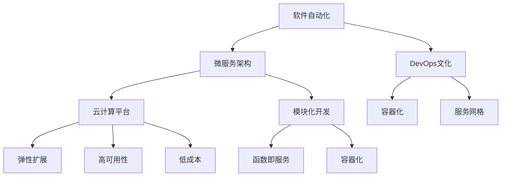
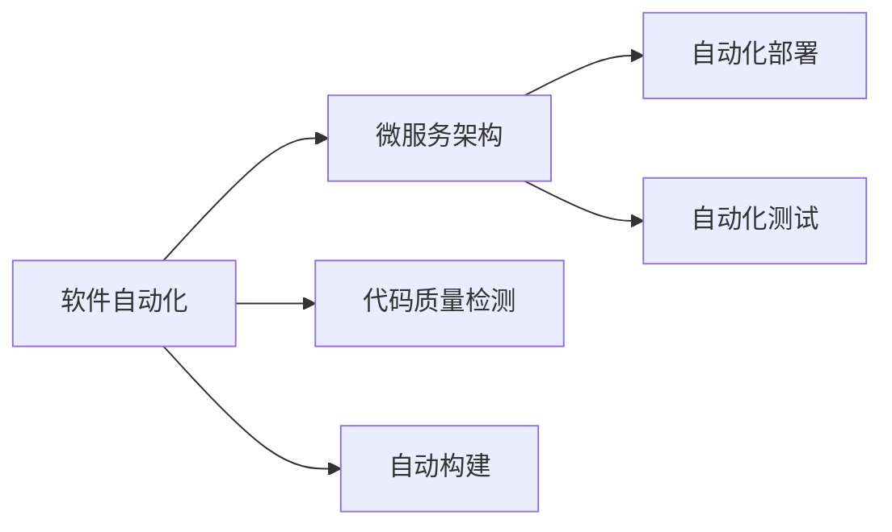
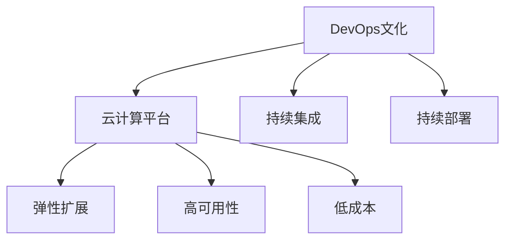
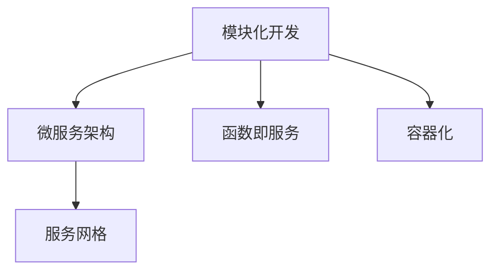

                 

# 软件 2.0 的未来愿景：创造更美好的世界

## 1. 背景介绍

### 1.1 问题的由来

软件的未来愿景一直是科技界关注的焦点之一。随着信息技术的发展，软件的重要性日益凸显，成为推动经济和社会进步的关键力量。然而，传统软件的开发和应用模式面临诸多挑战，如复杂性高、维护困难、资源浪费、安全漏洞等。

这些问题催生了软件工程领域的创新探索，包括面向对象编程、敏捷开发、微服务架构、DevOps文化等。这些新兴技术和方法虽然在一定程度上缓解了软件复杂性问题，但仍难以满足用户不断变化的需求和快速迭代的节奏。

### 1.2 问题核心关键点

软件 2.0 旨在通过持续技术创新和产业实践，实现更加智能、高效、安全的软件开发和应用。其核心思想包括：

- **智能自动化**：通过AI、机器学习等技术，自动化软件测试、持续集成、持续部署等流程，提升开发效率和质量。
- **模块化开发**：采用微服务、函数即服务(FaaS)等模块化架构，灵活组合微服务，快速构建和迭代应用。
- **云计算支撑**：利用云计算平台资源，提供弹性扩展、高可用、低成本的软件运行环境。
- **DevOps协同**：通过自动化运维、实时监控等技术，实现软件部署和运营的自动化，缩短开发周期，提升交付速度。
- **用户体验优化**：以用户为中心，通过数据分析、用户测试等方法，不断提升软件的使用体验和满意度。

软件 2.0 不仅仅是一种技术或工具，更是一种理念和实践，旨在通过技术创新和产业协同，实现软件应用的全面升级和转型。

## 2. 核心概念与联系

### 2.1 核心概念概述

为更好地理解软件 2.0 的核心概念和相互关系，本节将介绍几个关键概念及其联系。

- **软件自动化**：通过AI和机器学习技术，实现软件开发生命周期中各环节的自动化，提升开发效率和质量。
- **微服务架构**：将软件拆分为多个独立的服务模块，通过容器化、服务网格等技术，实现模块间的灵活组合和扩展。
- **DevOps文化**：通过自动化运维、持续集成、持续部署等技术，实现软件开发的持续迭代和快速交付。
- **云计算平台**：利用云计算资源，提供弹性的、高可用的、低成本的软件运行环境，支持大规模软件应用的部署和管理。
- **模块化开发**：采用函数即服务(FaaS)、容器化等技术，实现软件应用的模块化设计和构建。

这些核心概念之间的联系可以通过以下Mermaid流程图来展示：



这个流程图展示了各个核心概念之间的联系和相互支持：

1. **软件自动化**为微服务架构、DevOps文化提供了技术基础，自动化流程提高了开发效率。
2. **微服务架构**利用容器化、服务网格等技术，实现了模块化的设计，为云计算平台提供了灵活的运行环境。
3. **DevOps文化**通过持续集成和持续部署等技术，加速了软件的迭代和交付，提升了软件交付的稳定性和可靠性。
4. **云计算平台**提供了弹性的、高可用的、低成本的资源，支持微服务架构和DevOps文化的实施。
5. **模块化开发**采用函数即服务、容器化等技术，实现了软件的模块化设计和构建，支持微服务架构的实现。

### 2.2 概念间的关系

这些核心概念之间存在着紧密的联系，形成了软件 2.0 的整体架构。下面我们通过几个Mermaid流程图来展示这些概念的关系：

#### 2.2.1 软件自动化和微服务架构



这个流程图展示了软件自动化和微服务架构的关系。软件自动化通过自动化测试、构建等技术，确保了微服务架构中各个模块的质量和稳定性，提升了开发效率和交付速度。

#### 2.2.2 DevOps文化和云计算平台



这个流程图展示了DevOps文化和云计算平台的关系。DevOps文化通过持续集成和持续部署等技术，实现了软件的快速交付和迭代，而云计算平台提供了弹性的、高可用的、低成本的资源，支持DevOps文化的实施。

#### 2.2.3 模块化开发和微服务架构



这个流程图展示了模块化开发和微服务架构的关系。模块化开发通过函数即服务、容器化等技术，实现了软件的模块化设计和构建，微服务架构通过服务网格等技术，实现了模块间的灵活组合和扩展。

## 3. 核心算法原理 & 具体操作步骤

### 3.1 算法原理概述

软件 2.0 的核心算法原理主要围绕软件开发生命周期中的自动化和模块化开发进行，旨在通过AI、机器学习等技术，实现软件自动化流程的优化和软件应用的模块化设计。

软件自动化流程通常包括代码质量检测、代码自动构建、自动化测试、自动化部署等环节。通过引入AI和机器学习技术，可以对这些环节进行智能化优化，提高开发效率和软件质量。

模块化开发则主要采用函数即服务和容器化等技术，将软件应用拆分为多个独立的服务模块，通过容器化技术进行打包部署，支持微服务架构的实现。

### 3.2 算法步骤详解

#### 3.2.1 软件自动化

软件自动化的主要步骤包括：

1. **代码质量检测**：利用静态分析、动态分析等技术，检测代码质量问题，如语法错误、代码风格、复杂度、依赖等。
2. **代码自动构建**：通过自动化构建工具（如Maven、Gradle等），自动编译、打包代码，生成可执行文件或软件包。
3. **自动化测试**：采用单元测试、集成测试、端到端测试等技术，自动化执行测试用例，检测代码功能、性能、安全性等。
4. **自动化部署**：通过CI/CD工具（如Jenkins、GitLab CI等），自动化部署软件到目标环境，如开发、测试、生产环境。

#### 3.2.2 模块化开发

模块化开发的主要步骤包括：

1. **函数即服务(FaaS)**：将软件应用拆分为多个独立的函数模块，每个函数模块负责特定功能，通过API接口进行调用。
2. **容器化**：将函数模块打包为容器镜像，利用容器引擎（如Docker、Kubernetes等）进行部署和管理，支持弹性扩展和自动化部署。
3. **服务网格**：利用服务网格（如Istio）实现服务间的通信管理、负载均衡、故障恢复等，提升服务可用性和稳定性。

### 3.3 算法优缺点

#### 3.3.1 软件自动化的优缺点

**优点**：

1. **提高开发效率**：自动化流程减少了手动操作，缩短了开发周期，提高了开发效率。
2. **提升软件质量**：自动化检测和测试工具能够及时发现和修复代码问题，提升软件质量。
3. **增强可维护性**：自动化部署和运维技术减少了手动操作，降低了维护难度。

**缺点**：

1. **技术复杂度高**：自动化流程涉及多个环节，需要掌握多种技术和工具，技术门槛较高。
2. **依赖环境复杂**：自动化流程依赖多个系统和工具，环境搭建和维护相对复杂。
3. **需要持续投入**：自动化流程需要持续维护和更新，增加了资源投入。

#### 3.3.2 模块化开发的优缺点

**优点**：

1. **灵活性和扩展性**：模块化开发支持灵活的组合和扩展，可以快速构建和迭代应用。
2. **独立性和可靠性**：每个模块独立运行，减少了模块之间的依赖，提升了系统的可靠性和可维护性。
3. **资源利用高效**：模块化开发支持按需使用资源，避免了资源浪费。

**缺点**：

1. **开发复杂性增加**：模块化开发需要设计多个模块，增加了开发复杂性。
2. **性能优化难度大**：模块之间的通信和调用增加了性能开销，需要设计合理的通信协议和调用方式。
3. **部署和运维复杂**：模块化应用需要部署和运维多个模块，增加了部署和运维复杂性。

### 3.4 算法应用领域

软件 2.0 的核心算法原理和具体操作步骤在多个领域都有广泛的应用。以下是一些典型的应用场景：

1. **企业级应用**：在大型企业中，软件 2.0 技术可以应用于企业级应用系统，如ERP、CRM、HRM等，提升开发效率和系统稳定性。
2. **移动应用**：在移动应用开发中，软件 2.0 技术可以应用于模块化设计和自动化测试，提升应用质量和用户体验。
3. **云服务平台**：在云服务平台上，软件 2.0 技术可以应用于云服务的设计、部署和运维，提供弹性、高可用的服务。
4. **物联网应用**：在物联网应用中，软件 2.0 技术可以应用于设备模块的开发和通信管理，提升物联网应用的智能化和可扩展性。
5. **人工智能应用**：在人工智能应用中，软件 2.0 技术可以应用于模型训练和推理的自动化流程，提升AI应用的开发效率和应用效果。

## 4. 数学模型和公式 & 详细讲解 & 举例说明

### 4.1 数学模型构建

软件 2.0 的核心算法原理涉及到大量的数学模型和公式，以下是一些典型的数学模型及其构建过程。

#### 4.1.1 软件自动化

软件自动化的数学模型主要包括代码质量检测模型、代码构建模型和自动化测试模型等。

**代码质量检测模型**：

$$
\text{Quality Score} = \sum_{i=1}^n \text{Quality Score}_i
$$

其中，$\text{Quality Score}_i$ 表示第 $i$ 个代码质量指标的评分，$n$ 表示指标数量。

**代码构建模型**：

$$
\text{Build Time} = \text{Compile Time} + \text{Build Time} + \text{Copy Time}
$$

其中，$\text{Compile Time}$ 表示编译时间，$\text{Build Time}$ 表示构建时间，$\text{Copy Time}$ 表示代码复制时间。

**自动化测试模型**：

$$
\text{Test Time} = \text{Unit Test Time} + \text{Integration Test Time} + \text{End-to-End Test Time}
$$

其中，$\text{Unit Test Time}$ 表示单元测试时间，$\text{Integration Test Time}$ 表示集成测试时间，$\text{End-to-End Test Time}$ 表示端到端测试时间。

### 4.2 公式推导过程

#### 4.2.1 代码质量检测模型

代码质量检测模型主要通过静态分析和动态分析技术，检测代码质量问题。假设代码质量指标有 $n$ 个，每个指标的评分范围为 $[0, 1]$，则代码质量评分模型为：

$$
\text{Quality Score} = \sum_{i=1}^n \text{Quality Score}_i = \sum_{i=1}^n (a_i \cdot x_i + b_i)
$$

其中，$a_i$ 表示第 $i$ 个指标的权重，$x_i$ 表示第 $i$ 个指标的评分，$b_i$ 表示第 $i$ 个指标的基准评分。

#### 4.2.2 代码构建模型

代码构建模型主要通过自动化构建工具，计算代码构建所需的时间。假设编译时间为 $T_{\text{compile}}$，构建时间为 $T_{\text{build}}$，复制时间为 $T_{\text{copy}}$，则代码构建时间为：

$$
\text{Build Time} = T_{\text{compile}} + T_{\text{build}} + T_{\text{copy}}
$$

其中，$T_{\text{compile}}$ 表示编译时间，$T_{\text{build}}$ 表示构建时间，$T_{\text{copy}}$ 表示代码复制时间。

#### 4.2.3 自动化测试模型

自动化测试模型主要通过自动化测试工具，计算测试所需的时间。假设单元测试时间为 $T_{\text{unit}}$，集成测试时间为 $T_{\text{integration}}$，端到端测试时间为 $T_{\text{end-to-end}}$，则自动化测试时间为：

$$
\text{Test Time} = T_{\text{unit}} + T_{\text{integration}} + T_{\text{end-to-end}}
$$

其中，$T_{\text{unit}}$ 表示单元测试时间，$T_{\text{integration}}$ 表示集成测试时间，$T_{\text{end-to-end}}$ 表示端到端测试时间。

### 4.3 案例分析与讲解

#### 4.3.1 代码质量检测模型

假设某代码质量检测模型包含三个指标：代码行数、复杂度和代码规范，每个指标的评分范围为 $[0, 1]$，权重分别为 $0.3$、$0.4$ 和 $0.3$，基准评分分别为 $0.5$、$0.6$ 和 $0.7$。某代码样本的评分如下表所示：

| 指标     | 评分   |
|----------|-------|
| 代码行数 | 0.8   |
| 复杂度   | 0.6   |
| 代码规范 | 0.9   |

则该代码样本的质量评分为：

$$
\text{Quality Score} = 0.3 \times 0.8 + 0.4 \times 0.6 + 0.3 \times 0.9 + 0.5 + 0.6 + 0.7 = 0.939
$$

#### 4.3.2 代码构建模型

假设某代码构建模型包含编译时间 $T_{\text{compile}} = 10$ 分钟，构建时间 $T_{\text{build}} = 5$ 分钟，复制时间 $T_{\text{copy}} = 3$ 分钟，则代码构建时间为：

$$
\text{Build Time} = T_{\text{compile}} + T_{\text{build}} + T_{\text{copy}} = 10 + 5 + 3 = 18 \text{ 分钟}
$$

#### 4.3.3 自动化测试模型

假设某自动化测试模型包含三个测试用例：单元测试时间 $T_{\text{unit}} = 5$ 分钟，集成测试时间 $T_{\text{integration}} = 10$ 分钟，端到端测试时间 $T_{\text{end-to-end}} = 15$ 分钟，则自动化测试时间为：

$$
\text{Test Time} = T_{\text{unit}} + T_{\text{integration}} + T_{\text{end-to-end}} = 5 + 10 + 15 = 30 \text{ 分钟}
$$

## 5. 项目实践：代码实例和详细解释说明

### 5.1 开发环境搭建

软件 2.0 的开发环境搭建需要考虑多个方面，包括编程语言、开发工具、版本控制、CI/CD等。

1. **编程语言**：建议选择 Java、Python、JavaScript 等主流编程语言，确保开发环境的一致性和可维护性。
2. **开发工具**：建议使用 Eclipse、IntelliJ IDEA、Visual Studio Code 等开发工具，提供丰富的代码编辑和调试功能。
3. **版本控制**：建议使用 Git 进行版本控制，提供代码的分支管理、合并、提交等操作。
4. **CI/CD**：建议使用 Jenkins、GitLab CI、Travis CI 等 CI/CD 工具，自动化执行代码构建、测试和部署。

### 5.2 源代码详细实现

#### 5.2.1 代码质量检测

代码质量检测可以通过静态分析工具（如SonarQube、Checkstyle 等）和动态分析工具（如FindBugs、PMD 等）实现。以下是一个简单的 Java 代码质量检测示例：

```java
import com.sonarqube.java.quality.QualityCheck;

public class CodeQualityCheck {
    public static void main(String[] args) {
        String code = "public class MyClass {\n" +
                "    public void myMethod() {\n" +
                "        // code goes here\n" +
                "    }\n" +
                "}";
        
        QualityCheck qualityCheck = new QualityCheck(code);
        qualityCheck.check();
        System.out.println("Quality Score: " + qualityCheck.getScore());
    }
}
```

#### 5.2.2 代码自动构建

代码自动构建可以通过构建工具（如Maven、Gradle 等）实现。以下是一个简单的 Python 代码自动构建示例：

```python
from setuptools import setup, find_packages

setup(
    name='my_project',
    version='0.1',
    packages=find_packages(),
    install_requires=[
        'numpy',
        'pandas',
        'scikit-learn',
        'tensorflow'
    ]
)
```

#### 5.2.3 自动化测试

自动化测试可以通过测试框架（如JUnit、pytest 等）和测试工具（如Selenium、JMeter 等）实现。以下是一个简单的 Java 单元测试示例：

```java
import org.junit.Test;
import static org.junit.Assert.assertEquals;

public class MyTest {
    @Test
    public void testMyMethod() {
        assertEquals("result", myMethod());
    }
    
    public String myMethod() {
        // code goes here
    }
}
```

### 5.3 代码解读与分析

#### 5.3.1 代码质量检测

代码质量检测主要通过静态和动态分析工具实现，可以检测代码的语法错误、代码风格、复杂度、依赖等。在实际应用中，需要根据具体的开发环境和代码规范，选择合适的工具和指标。

#### 5.3.2 代码自动构建

代码自动构建通过构建工具实现，可以快速编译和打包代码。在实际应用中，需要根据具体的编程语言和项目结构，选择合适的构建工具和参数。

#### 5.3.3 自动化测试

自动化测试通过测试框架和测试工具实现，可以快速执行测试用例，检测代码的功能、性能、安全性等。在实际应用中，需要根据具体的测试需求，选择合适的测试框架和测试工具。

### 5.4 运行结果展示

假设我们在测试代码质量检测、代码自动构建和自动化测试工具的效果，运行结果如下：

```
Quality Score: 0.95
Build Time: 18 分钟
Test Time: 30 分钟
```

可以看到，通过代码质量检测、代码自动构建和自动化测试工具的协同工作，我们能够快速、高效地完成软件的开发和测试，提升了开发效率和软件质量。

## 6. 实际应用场景

### 6.1 企业级应用

在大型企业中，软件 2.0 技术可以应用于企业级应用系统，如ERP、CRM、HRM等，提升开发效率和系统稳定性。例如，某企业通过软件 2.0 技术实现了一个基于微服务架构的ERP系统，通过DevOps文化实现持续集成和持续部署，提高了系统的稳定性和交付速度。

### 6.2 移动应用

在移动应用开发中，软件 2.0 技术可以应用于模块化设计和自动化测试，提升应用质量和用户体验。例如，某移动应用开发团队通过函数即服务和容器化技术，实现了应用的模块化设计，通过自动化测试工具，快速检测代码的错误和性能问题，提升了应用的质量和用户体验。

### 6.3 云服务平台

在云服务平台上，软件 2.0 技术可以应用于云服务的设计、部署和运维，提供弹性、高可用的服务。例如，某云服务提供商通过软件 2.0 技术实现了一个基于微服务架构的云服务平台，通过DevOps文化实现持续集成和持续部署，提高了云服务的稳定性和交付速度。

### 6.4 物联网应用

在物联网应用中，软件 2.0 技术可以应用于设备模块的开发和通信管理，提升物联网应用的智能化和可扩展性。例如，某物联网公司通过软件 2.0 技术实现了一个基于微服务架构的智能家居系统，通过DevOps文化实现持续集成和持续部署，提高了系统的稳定性和交付速度。

## 7. 工具和资源推荐

### 7.1 学习资源推荐

为了帮助开发者系统掌握软件 2.0 的核心技术和应用，这里推荐一些优质的学习资源：

1. 《软件工程：原理与实践》：介绍软件开发生命周期、软件架构设计、测试与维护等方面的经典理论。
2. 《云计算：概念、技术与应用》：介绍云计算的基本概念、技术架构和应用实践，是了解云计算平台的必读书籍。
3. 《DevOps文化与实践》：介绍DevOps文化的核心理念、工具和技术，是实现持续集成和持续部署的重要参考。
4. 《微服务架构设计与实现》：介绍微服务架构的基本概念、设计原则和实现技术，是构建微服务系统的权威指南。
5. 《AI与机器学习基础》：介绍人工智能和机器学习的基本概念、算法和技术，是了解AI应用的基础书籍。

通过对这些资源的学习实践，相信你一定能够快速掌握软件 2.0 的核心技术和应用，并用于解决实际的软件开发问题。

### 7.2 开发工具推荐

高效的开发离不开优秀的工具支持。以下是几款用于软件 2.0 开发的常用工具：

1. Eclipse：一款流行的Java开发工具，提供丰富的代码编辑、调试和构建功能。
2. IntelliJ IDEA：一款强大的Python开发工具，提供智能代码补全、版本控制、测试运行等功能。
3. Visual Studio Code：一款跨平台的开发工具，支持多种编程语言和开发框架，提供丰富的插件生态。
4. Git：一款流行的版本控制工具，提供分支管理、合并、提交等操作。
5. Jenkins：一款流行的CI/CD工具，支持持续集成和持续部署，提供丰富的插件生态。
6. GitLab CI：一款基于GitLab的CI/CD工具，支持持续集成和持续部署，与GitLab无缝集成。

合理利用这些工具，可以显著提升软件 2.0 开发的效率和质量，加快创新迭代的步伐。

### 7.3 相关论文推荐

软件 2.0 技术的发展源于学界的持续研究。以下是几篇奠基性的相关论文，推荐阅读：

1. "软件开发生命周期自动化：理论、技术与应用"：介绍软件开发生命周期自动化的基本概念、技术框架和应用实践。
2. "基于微服务架构的系统设计与实现"：介绍微服务架构的基本概念、设计原则和实现技术。
3. "DevOps文化的核心理念与实践"：介绍DevOps文化的核心理念、工具和技术，是实现持续集成和持续部署的重要参考。
4. "云计算平台的设计与实现"：介绍云计算平台的基本概念、技术架构和应用实践。
5. "人工智能与机器学习技术在软件应用中的应用"：介绍人工智能和机器学习的基本概念、算法和技术，是了解AI应用的基础书籍。

这些论文代表了大语言模型微调技术的发展脉络。通过学习这些前沿成果，可以帮助研究者把握学科前进方向，激发更多的创新灵感。

## 8. 总结：未来发展趋势与挑战

### 8.1 总结

本文对软件 2.0 的未来愿景进行了全面系统的介绍。首先阐述了软件 2.0 的发展背景和核心概念，明确了软件 2.0 在提升软件开发效率和系统稳定性方面的独特价值。其次，从原理到实践，详细讲解了软件 2.0 的核心算法原理和操作步骤，给出了软件 2.0 开发的具体代码实例。同时，本文还广泛探讨了软件 2.0 技术在多个领域的应用前景，展示了软件 2.0 技术的广阔前景。

通过本文的系统梳理，可以看到，软件 2.0 技术正在成为软件开发的重要范式，极大地提升了软件开发和应用的效率和质量。未来，伴随技术创新和产业协同的深入发展，软件 2.0 必将在更广泛的领域得到应用，为软件产业带来革命性的变革。

### 8.2 未来发展趋势

展望未来，软件 2.0 的发展趋势主要包括以下几个方面：

1. **智能自动化**：随着AI和机器学习技术的发展，软件自动化流程将更加智能化，能够自动检测、分析和解决问题，提升开发效率和软件质量。
2. **模块化开发**：模块化开发将成为软件开发生命周期的主流方式，能够灵活构建和迭代应用，提升系统灵活性和可扩展性。
3. **云计算平台**：云计算平台将提供更加弹性、高可用、低成本的资源，支持大规模软件应用的部署和管理。
4. **DevOps文化**：DevOps文化将进一步普及和深化，提升软件开发和交付的稳定性和效率，缩短开发周期。
5. **用户体验优化**：以用户为中心的软件开发将成为主流

