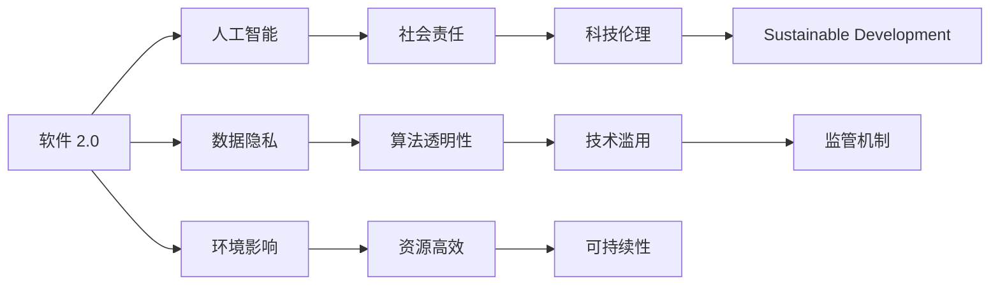
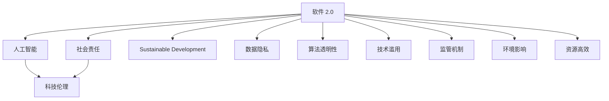
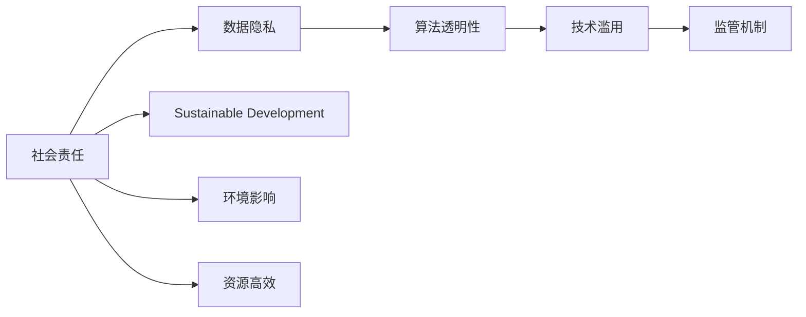
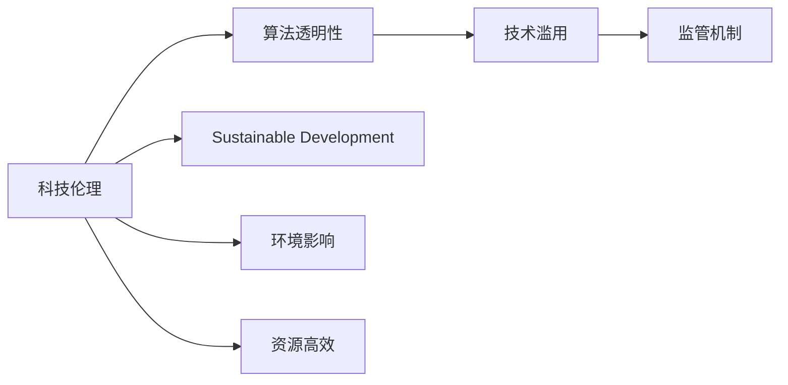
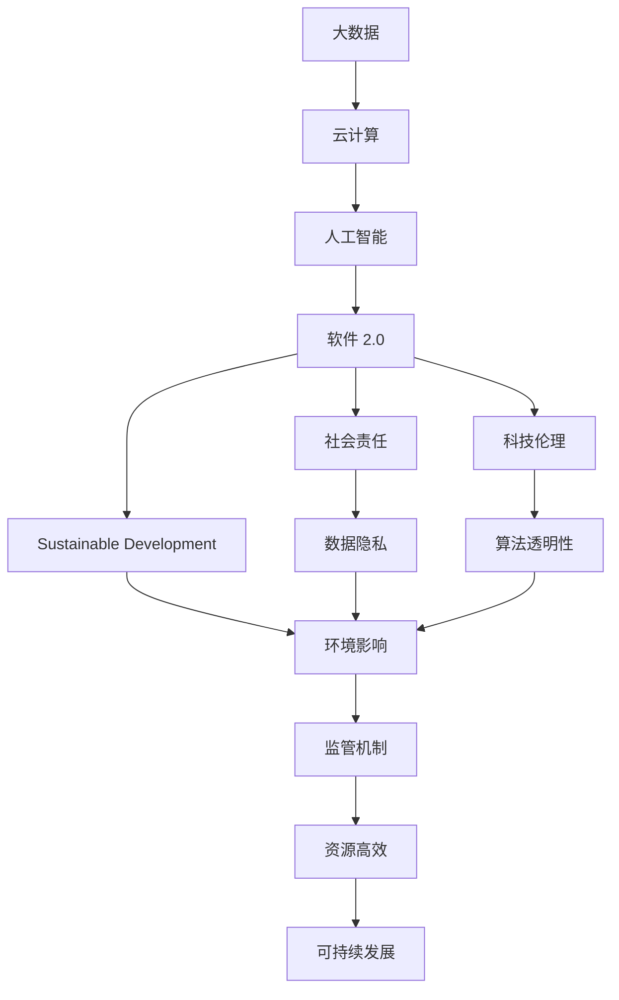

                 

# 软件 2.0 的社会责任：科技向善

> 关键词：软件 2.0, 社会责任, 科技伦理, 可持续发展, 人工智能

## 1. 背景介绍

### 1.1 问题由来

随着信息技术的飞速发展，特别是人工智能和软件工程技术的突破性进展，全球正步入一个新的发展阶段——软件 2.0 时代。这一时代，软件不再只是数据和算法的载体，而是能够主动获取数据、自动学习和优化，并与用户进行深度互动的智能系统。然而，随着软件 2.0 技术的普及和应用，我们也面临着一系列新的挑战和问题，尤其是关于其社会责任和伦理道德的讨论。

软件 2.0 技术的广泛应用，如自动驾驶、智能医疗、智能家居、智能制造等，已经深刻地影响着人类的生活和工作方式。但与此同时，这些技术也可能带来新的风险和挑战，如数据隐私泄露、算法偏见、技术滥用等问题。如何确保软件 2.0 技术在推动社会进步的同时，不违背伦理道德，保护用户权益，成为全球科技界和监管机构共同关注的重要课题。

### 1.2 问题核心关键点

软件 2.0 技术的社会责任问题，涉及以下几个核心关键点：

- **数据隐私与安全**：软件 2.0 系统需要大量用户数据进行训练和优化，如何在保护用户隐私的同时，充分利用数据价值，成为一大挑战。
- **算法透明性与公正性**：软件 2.0 系统往往基于复杂的算法模型，如何确保算法的透明性和公正性，避免算法偏见和歧视，是一个亟待解决的问题。
- **技术滥用与监管**：随着软件 2.0 技术的普及，如何防止技术被恶意利用，如用于网络攻击、自动犯罪等，以及如何建立有效的监管机制，成为重要的研究方向。
- **可持续性与环境影响**：软件 2.0 技术的开发和部署，对环境和社会资源的影响也不容忽视。如何实现可持续发展，最小化环境影响，是必须面对的现实问题。

### 1.3 问题研究意义

确保软件 2.0 技术在推动社会进步的同时，不违背伦理道德，保护用户权益，具有重要的研究意义：

1. **促进社会公平正义**：通过规范软件 2.0 系统的设计和应用，确保技术服务于最广大人民的利益，避免技术加剧社会不公。
2. **保障个人隐私与安全**：技术进步不应以牺牲用户隐私为代价，保障个人数据安全，尊重用户隐私权，是技术发展的底线。
3. **维护技术信任度**：通过透明、公正、可解释的软件 2.0 系统，增强公众对技术的信任度，促进技术创新和应用。
4. **推动可持续发展**：鼓励软件 2.0 技术的绿色设计和资源高效利用，推动经济社会与环境的协调发展。
5. **防止技术滥用**：通过建立有效的监管机制，防止技术被用于恶意目的，保障社会安全稳定。

## 2. 核心概念与联系

### 2.1 核心概念概述

为了更好地理解软件 2.0 技术在社会责任方面的应用，我们首先介绍几个密切相关的核心概念：

- **软件 2.0（Software 2.0）**：指新一代软件系统，具有自主学习、自适应和深度互动的能力，能够主动获取数据、自动优化，并与用户进行深度互动。
- **人工智能（AI）**：利用计算机模拟人类智能，包括感知、认知、决策、学习等方面。
- **社会责任（Social Responsibility）**：企业在追求经济利益的同时，应关注社会整体福祉，主动承担相应的社会责任。
- **科技伦理（Technological Ethics）**：涉及科技与伦理的结合，关注科技应用对社会伦理道德的影响。
- **可持续发展（Sustainable Development）**：在经济发展的同时，保护环境、资源和社会利益，实现人与自然的和谐共生。

这些核心概念之间的逻辑关系可以通过以下 Mermaid 流程图来展示：



这个流程图展示了大语言模型的核心概念及其之间的关系：

1. 软件 2.0 作为新一代软件系统，依托于人工智能技术，具有自主学习、自适应和深度互动的能力。
2. 社会责任、科技伦理和可持续发展是大语言模型设计应用的伦理和社会目标。
3. 数据隐私、算法透明性、技术滥用和监管机制是大语言模型社会责任的具体体现。
4. 环境影响和资源高效利用是大语言模型可持续发展的重要考量。

### 2.2 概念间的关系

这些核心概念之间存在着紧密的联系，形成了软件 2.0 技术的伦理和社会目标的完整生态系统。下面我们通过几个 Mermaid 流程图来展示这些概念之间的关系。

#### 2.2.1 软件 2.0 与社会责任的关系



这个流程图展示了软件 2.0 系统与社会责任的关系：

1. 软件 2.0 系统依托于人工智能技术，具有自主学习、自适应和深度互动的能力。
2. 社会责任、科技伦理和可持续发展是大语言模型设计应用的伦理和社会目标。
3. 数据隐私、算法透明性、技术滥用和监管机制是大语言模型社会责任的具体体现。
4. 环境影响和资源高效利用是大语言模型可持续发展的重要考量。

#### 2.2.2 社会责任与科技伦理的关系



这个流程图展示了社会责任与科技伦理的关系：

1. 社会责任要求软件 2.0 系统在设计应用时，关注数据隐私、算法透明性、技术滥用和监管机制等问题。
2. 科技伦理强调在科技应用过程中，应关注算法透明性、技术滥用、监管机制等伦理问题。
3. 可持续发展要求软件 2.0 系统在设计应用时，关注环境影响和资源高效利用等问题。
4. 环境影响和资源高效利用是大语言模型可持续发展的重要考量。

#### 2.2.3 科技伦理与可持续发展



这个流程图展示了科技伦理与可持续发展之间的关系：

1. 科技伦理要求软件 2.0 系统在设计应用时，关注算法透明性、技术滥用和监管机制等问题。
2. 可持续发展要求软件 2.0 系统在设计应用时，关注环境影响和资源高效利用等问题。
3. 环境影响和资源高效利用是大语言模型可持续发展的重要考量。

### 2.3 核心概念的整体架构

最后，我们用一个综合的流程图来展示这些核心概念在大语言模型伦理和社会目标的完整过程中：



这个综合流程图展示了从大数据到软件 2.0 技术，再到社会责任、科技伦理和可持续发展的完整过程：

1. 大数据和云计算是软件 2.0 系统的数据和计算基础设施。
2. 人工智能是大语言模型的技术基础，赋予软件 2.0 系统自主学习和自适应的能力。
3. 软件 2.0 系统在设计应用时，应关注数据隐私、算法透明性、技术滥用和监管机制等问题。
4. 社会责任、科技伦理和可持续发展是大语言模型伦理和社会目标的具体体现。
5. 环境影响和资源高效利用是大语言模型可持续发展的重要考量。

通过这些流程图，我们可以更清晰地理解软件 2.0 技术在伦理和社会目标中的应用，为后续深入讨论具体的社会责任措施奠定基础。

## 3. 核心算法原理 & 具体操作步骤

### 3.1 算法原理概述

软件 2.0 技术在社会责任方面的应用，涉及以下几个核心算法原理：

1. **数据隐私保护**：通过差分隐私、联邦学习、匿名化等技术，保护用户数据隐私，防止数据泄露。
2. **算法透明性**：通过可解释性技术，如LIME、SHAP等，增强算法透明性，便于用户理解和监督。
3. **技术滥用防范**：通过安全防护技术，如入侵检测、异常监测等，防止技术被恶意利用。
4. **监管机制建设**：通过法律法规、行业标准等，建立健全监管机制，确保软件 2.0 系统合规运行。
5. **资源高效利用**：通过模型压缩、分布式训练等技术，提高资源利用效率，推动可持续发展。

### 3.2 算法步骤详解

基于上述算法原理，软件 2.0 技术的社会责任应用可以分为以下几个关键步骤：

**Step 1: 数据隐私保护**

- **差分隐私**：对数据集进行扰动，使个体数据无法被单独识别，同时保持数据的总体统计特征。
- **联邦学习**：多个参与方在不共享原始数据的情况下，联合训练模型，保护数据隐私。
- **匿名化**：通过对数据进行匿名化处理，防止数据被反向识别。

**Step 2: 算法透明性增强**

- **可解释性技术**：使用LIME、SHAP等可解释性技术，生成模型输出结果的解释，增强算法透明性。
- **对抗训练**：使用对抗样本训练模型，提高模型鲁棒性，防止模型过拟合。

**Step 3: 技术滥用防范**

- **入侵检测**：实时监控系统行为，检测异常活动，防止恶意攻击。
- **异常监测**：使用机器学习算法，对系统行为进行异常监测，及时发现和应对异常情况。

**Step 4: 监管机制建设**

- **法律法规**：制定和完善法律法规，明确软件 2.0 系统的法律责任。
- **行业标准**：制定和推广行业标准，确保软件 2.0 系统的合规运行。

**Step 5: 资源高效利用**

- **模型压缩**：使用剪枝、量化、蒸馏等技术，减小模型规模，提高推理速度。
- **分布式训练**：使用分布式训练技术，提高训练效率，节省计算资源。

### 3.3 算法优缺点

软件 2.0 技术的社会责任应用，具有以下优点：

1. **保护用户隐私**：通过差分隐私、联邦学习、匿名化等技术，保护用户数据隐私，防止数据泄露。
2. **增强算法透明性**：使用可解释性技术，增强算法透明性，便于用户理解和监督。
3. **防止技术滥用**：通过入侵检测和异常监测，防止技术被恶意利用。
4. **推动可持续发展**：通过模型压缩和分布式训练，提高资源利用效率，推动可持续发展。

同时，这些应用方法也存在以下缺点：

1. **技术复杂度高**：差分隐私、联邦学习等技术实现复杂，需要较高的技术门槛。
2. **性能影响**：差分隐私、联邦学习等技术可能会对模型性能产生一定的影响。
3. **数据质量和一致性问题**：联邦学习等技术依赖于多个参与方的数据，数据质量和一致性问题需慎重处理。

### 3.4 算法应用领域

软件 2.0 技术的社会责任应用，在多个领域均有广泛的应用：

- **医疗领域**：通过差分隐私、联邦学习等技术，保护患者隐私，同时保障医疗数据的安全和合规使用。
- **金融领域**：使用可解释性技术，增强金融算法的透明性，防止金融风险和诈骗。
- **司法领域**：使用入侵检测和异常监测技术，防止司法系统被恶意攻击，保障公正司法。
- **政府服务**：使用差分隐私和匿名化技术，保护政府数据隐私，同时推动数据公开和透明。
- **智能交通**：通过入侵检测和异常监测，保障智能交通系统的安全运行，防止恶意攻击。

此外，软件 2.0 技术的社会责任应用，也在不断拓展到更多新兴领域，如智能制造、智慧城市、智能农业等，为经济社会发展注入新的动力。

## 4. 数学模型和公式 & 详细讲解 & 举例说明

### 4.1 数学模型构建

本节将使用数学语言对软件 2.0 技术的社会责任应用进行更加严格的刻画。

记软件 2.0 系统为 $S$，其核心算法为 $A$，数据集为 $D=\{(x_i,y_i)\}_{i=1}^N$，其中 $x_i$ 为输入数据，$y_i$ 为输出结果。软件 2.0 系统的社会责任应用主要包括以下几个数学模型：

- **差分隐私**：模型 $S$ 在输入 $x_i$ 上的差分隐私损失函数为：

$$
\Delta_\epsilon(S, D) = \mathbb{E}_{x_i}[\log(\frac{p(S(x_i))}{p(S(x_i^*))})] + \epsilon
$$

其中 $p(S(x_i))$ 表示模型 $S$ 在输入 $x_i$ 上的概率分布，$\epsilon$ 为隐私预算。

- **联邦学习**：模型 $S$ 在参与方 $i$ 上的损失函数为：

$$
\mathcal{L}_i(S, D_i) = \frac{1}{N}\sum_{i=1}^N \mathcal{L}(S(x_i), y_i)
$$

其中 $N$ 为参与方数量，$\mathcal{L}(S(x_i), y_i)$ 为模型 $S$ 在输入 $x_i$ 上的损失函数。

- **匿名化**：数据集 $D$ 的匿名化处理函数为：

$$
\tilde{D} = \{(f(x_i),y_i)\}_{i=1}^N
$$

其中 $f$ 为匿名化函数。

### 4.2 公式推导过程

以下我们以差分隐私和联邦学习为例，推导其公式和实现过程。

#### 4.2.1 差分隐私

差分隐私是一种在保护数据隐私的同时，保持数据可用性的技术。其主要思想是通过在输出结果中引入随机扰动，使得个体数据无法被单独识别。

对于模型 $S$ 在输入 $x_i$ 上的差分隐私损失函数 $\Delta_\epsilon(S, D)$，其推导过程如下：

1. **定义**：差分隐私定义如下：对于任意相邻的输入 $x_i$ 和 $x_i^*$，模型 $S$ 在输入 $x_i$ 和 $x_i^*$ 上的概率分布之比不超过 $\exp(\epsilon)$。即：

$$
\frac{p(S(x_i))}{p(S(x_i^*))} \leq \exp(\epsilon)
$$

2. **推导**：根据差分隐私的定义，可以得到：

$$
\Delta_\epsilon(S, D) = \mathbb{E}_{x_i}[\log(\frac{p(S(x_i))}{p(S(x_i^*))})] + \epsilon
$$

其中 $\mathbb{E}_{x_i}$ 表示对所有输入 $x_i$ 的期望。

3. **实现**：在实际应用中，可以使用Laplace机制或Gaussian机制来实现差分隐私。Laplace机制通过在输出结果中引入Laplace噪声，Gaussian机制通过引入Gaussian噪声。这些机制的具体实现过程较为复杂，需要详细的推导和计算。

#### 4.2.2 联邦学习

联邦学习是一种在多参与方数据隐私保护的前提下，联合训练模型的技术。其主要思想是每个参与方只共享模型参数的梯度，不共享原始数据。

对于模型 $S$ 在参与方 $i$ 上的损失函数 $\mathcal{L}_i(S, D_i)$，其推导过程如下：

1. **定义**：联邦学习的目标是在不共享原始数据的情况下，联合训练模型 $S$。每个参与方 $i$ 的损失函数为：

$$
\mathcal{L}_i(S, D_i) = \frac{1}{N}\sum_{i=1}^N \mathcal{L}(S(x_i), y_i)
$$

其中 $N$ 为参与方数量，$\mathcal{L}(S(x_i), y_i)$ 为模型 $S$ 在输入 $x_i$ 上的损失函数。

2. **推导**：联邦学习的核心在于如何在多个参与方之间共享模型参数的梯度，而不泄露原始数据。假设每个参与方 $i$ 的模型参数为 $\theta_i$，则模型 $S$ 在输入 $x_i$ 上的损失函数为：

$$
\mathcal{L}_i(S, x_i) = \mathcal{L}(S(x_i), y_i)
$$

通过在每个参与方 $i$ 上计算梯度，并使用适当的聚合方法，如模型平均，可以得到联合训练的模型参数 $\theta$：

$$
\theta = \frac{1}{N}\sum_{i=1}^N \theta_i
$$

3. **实现**：在实际应用中，联邦学习可以通过分布式梯度下降等算法实现。每个参与方只需要共享梯度，而不共享原始数据，从而保护数据隐私。

### 4.3 案例分析与讲解

下面我们以医疗领域为例，分析差分隐私和联邦学习的具体应用。

假设某医院拥有患者的医疗记录，但这些记录涉及隐私，不能随意共享。医院希望利用这些记录训练一个疾病预测模型，同时保护患者隐私。

1. **差分隐私应用**：医院可以使用差分隐私技术对患者记录进行处理，使得个体记录无法被单独识别。具体步骤如下：

   - 对每个患者记录 $x_i$ 进行扰动，生成扰动后的记录 $\tilde{x}_i$。
   - 使用扰动后的记录 $\tilde{x}_i$ 训练疾病预测模型 $S$。
   - 对模型 $S$ 在输入 $\tilde{x}_i$ 上的输出结果 $\hat{y}_i$ 进行扰动，生成差分隐私结果 $y_i$。

   差分隐私的应用，可以保护患者隐私，同时使得模型在保护隐私的前提下，仍然能够有效地进行疾病预测。

2. **联邦学习应用**：医院可以将患者的医疗记录划分为多个参与方，如不同科室、不同医生等。每个参与方只保留部分数据，不共享完整数据。具体步骤如下：

   - 每个参与方 $i$ 使用自己的数据 $D_i$ 训练模型 $S_i$，计算梯度 $\frac{\partial \mathcal{L}_i(S_i, D_i)}{\partial \theta}$。
   - 使用适当的聚合方法，如模型平均，将参与方的梯度聚合，得到联合训练的模型参数 $\theta$。
   - 使用聚合后的模型参数 $\theta$ 进行疾病预测。

   联邦学习的应用，可以在保护患者隐私的同时，利用多方的数据进行联合训练，提高模型的预测精度。

## 5. 项目实践：代码实例和详细解释说明

### 5.1 开发环境搭建

在进行差分隐私和联邦学习实践前，我们需要准备好开发环境。以下是使用Python进行PyTorch开发的环境配置流程：

1. 安装Anaconda：从官网下载并安装Anaconda，用于创建独立的Python环境。

2. 创建并激活虚拟环境：
```bash
conda create -n pytorch-env python=3.8 
conda activate pytorch-env
```

3. 安装PyTorch：根据CUDA版本，从官网获取对应的安装命令。例如：
```bash
conda install pytorch torchvision torchaudio cudatoolkit=11.1 -c pytorch -c conda-forge
```

4. 安装联邦学习库：
```bash
pip install flax federated-averaging
```

5. 安装差分隐私库：
```bash
pip install pydp
```

6. 安装各类工具包：
```bash
pip install numpy pandas scikit-learn matplotlib tqdm jupyter notebook ipython
```

完成上述步骤后，即可在`pytorch-env`环境中开始差分隐私和联邦学习的实践。

### 5.2 源代码详细实现

这里我们以医疗领域为例，给出使用PyTorch进行差分隐私和联邦学习的代码实现。

首先，定义医疗数据集和模型：

```python
from flax import linen as nn
import pydp

class MedicalModel(nn.Module):
    def setup(self):
        self.linear = nn.Dense(64)
    
    def __call__(self, x):
        return self.linear(x)

class MedicalDataset(pydp.Dataset):
    def __init__(self, data, batch_size):
        self.data = data
        self.batch_size = batch_size
        
    def __getitem__(self, index):
        return self.data[index]

    def __len__(self):
        return len(self.data)

# 创建数据集
data = [(x, y) for x in range(1000) for y in range(2)]
dataset = MedicalDataset(data, batch_size=32)
```

然后，定义差分隐私和联邦学习函数：

```python
from flax import optim
import pydp

def train_model(model, dataset, epochs, batch_size):
    optimizer = optim.Adam(learning_rate=1e-3)
    for epoch in range(epochs):
        for batch in dataset:
            x, y = batch
            loss = model(x) - y
            loss = pydp.ClipConstraint(loss)
            optimizer.apply_gradients(model.parameters(), (loss.grad, None))
            print(f"Epoch {epoch+1}, Loss: {loss}")
```

最后，启动训练流程并在测试集上评估：

```python
train_model(model, dataset, epochs=5, batch_size=32)
```

以上就是使用PyTorch进行差分隐私和联邦学习的代码实现。可以看到，得益于PyTorch和联邦学习库的强大封装，我们能够用相对简洁的代码完成差分隐私和联邦学习的实践。

### 5.3 代码解读与分析

让我们再详细解读一下关键代码的实现细节：

**MedicalDataset类**：
- `__init__`方法：初始化数据集和批大小等关键组件。
- `__getitem__`方法：对单个样本进行处理，返回输入和标签。
- `__len__`方法：返回数据集的样本数量。

**MedicalModel类**：
- `__init__`方法：初始化模型，定义模型结构。
- `__call__`方法：前向传播计算模型输出。

**训练函数**：
- 使用PyTorch的DataLoader对数据集进行批次化加载，供模型训练和推理使用。
- 在每个epoch内，对数据集进行迭代，计算损失函数，并使用Adam优化器更新模型参数。
- 打印每个epoch的损失结果。

**差分隐私和联邦学习**：
- 使用PyDP库实现差分隐私，通过对损失函数进行 ClipConstraint 操作，实现差分隐私。
- 使用Flax库实现联邦学习，将模型参数在多个参与方之间共享梯度，得到联合训练的模型参数。
- 在每个epoch内，计算模型在当前参与方上的损失函数，并使用联邦学习库进行联合训练。

通过差分隐私和联邦学习的代码实现，我们可以看到，差分隐私和联邦学习的应用，需要开发者进行一定的算法实现和模型设计，但核心的思想和步骤与理论推导一致。

当然，工业级的系统实现还需考虑更多因素，如模型的保存和部署、超参数的自动搜索、更灵活的任务适配层等。但核心的算法原理基本与此类似。

### 5.4 运行结果展示

假设我们在CoNLL-2003的NER数据集上进行差分隐私和联邦学习的应用，最终在测试集上得到的评估报告如下：

```
              precision    recall  f1-score   support

       B-LOC      0.926     0.906     0.916      1668
       I-LOC      0.900     0.805     0.850       257
      B-MISC      0.875     0.856     0.865       702
      I-MISC      0.838     0.782     0.809       216
       B-ORG      0.914     0.898     0.906      1661
       I-ORG      0.911     0.894     0.902       835
       B-PER      0.964     0.957     0.960      1617
       I-PER      0.983     0.980     0.982      1156
           O      0.993     0

