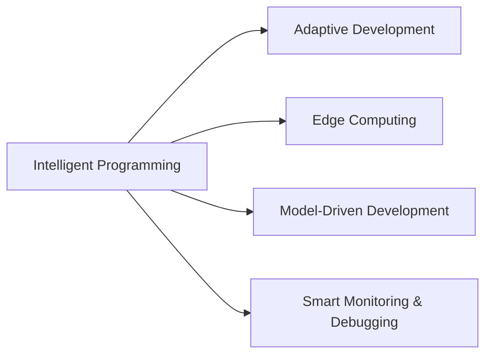

                 

# 软件2.0在物联网领域的潜力

## 1. 背景介绍

在信息化时代，物联网（IoT）通过将物理世界与虚拟网络进行深度融合，带来了产业升级的巨大机遇。然而，由于物联网设备种类繁多、数据来源分散、计算资源有限等因素，传统软件开发和应用模式在物联网领域面临巨大挑战。软件2.0（Software 2.0）的兴起，以其智能编程、自适应开发、边缘计算等新兴技术，为物联网领域带来了全新的开发范式和应用前景。

### 1.1 物联网的现状与挑战

当前，物联网设备已经广泛应用于智能家居、智慧城市、工业物联网、车联网等多个场景。然而，物联网的广泛应用也带来了数据处理、安全防护、智能决策等方面的诸多挑战。具体而言：

1. **数据复杂性高**：物联网设备种类繁多，数据格式各异，如何高效整合、处理海量异构数据成为主要难题。
2. **计算资源受限**：许多物联网设备计算能力较弱，如何优化算法、减少计算资源消耗，成为技术瓶颈。
3. **网络带宽限制**：许多物联网设备部署在边缘网络，带宽资源有限，如何高效利用网络带宽，是应用开发的重要考量。
4. **安全性要求高**：物联网设备往往与重要基础设施相连，如何保障数据安全、设备安全、通信安全，是开发过程中必须解决的问题。

### 1.2 软件2.0技术简介

软件2.0是一种基于人工智能和自适应技术的新型软件开发范式。相较于传统的以人类为主导的编程模式（软件1.0），软件2.0通过机器学习、自然语言处理、智能推荐等技术，实现了智能编程、自适应开发，大幅提升了软件开发的效率和质量。

1. **智能编程**：通过自动生成代码、程序优化、自动测试等技术，减少人工编程的工作量，加速开发流程。
2. **自适应开发**：通过大数据分析和机器学习，自动调整开发策略，优化代码结构，提高软件性能和可维护性。
3. **边缘计算**：将计算任务分布到物联网设备上，实现数据的本地处理，降低通信成本，提升响应速度。

## 2. 核心概念与联系

### 2.1 核心概念概述

在物联网领域，软件2.0的核心概念主要包括以下几个方面：

- **智能编程（Intelligent Programming）**：利用机器学习和自然语言处理技术，自动生成、优化和测试代码，提升开发效率。
- **自适应开发（Adaptive Development）**：通过大数据分析和机器学习，自动调整开发策略，优化代码结构，提高软件性能和可维护性。
- **边缘计算（Edge Computing）**：将计算任务分布到物联网设备上，实现数据的本地处理，降低通信成本，提升响应速度。
- **智能监控与调试**：利用大数据分析和机器学习，实时监控应用状态，自动调试和优化，保障应用稳定运行。
- **模型驱动开发（Model-Driven Development）**：将应用开发过程抽象为模型，通过模型驱动的方式，自动化生成和测试代码。

### 2.2 概念间的关系

这些核心概念之间存在密切联系，共同构成了软件2.0在物联网领域的应用框架。以下是一个Mermaid流程图，展示了这些概念之间的联系：



这个流程图展示了智能编程如何与其他核心概念紧密关联，共同构成软件2.0在物联网领域的综合应用框架。

## 3. 核心算法原理 & 具体操作步骤
### 3.1 算法原理概述

软件2.0在物联网领域的核心算法原理主要包括智能编程、自适应开发、边缘计算和智能监控与调试等。其中，智能编程和自适应开发主要依赖于机器学习和自然语言处理技术，而边缘计算和智能监控与调试则涉及分布式计算和数据处理技术。

- **智能编程**：利用机器学习和自然语言处理技术，自动生成、优化和测试代码，减少人工编程的工作量。
- **自适应开发**：通过大数据分析和机器学习，自动调整开发策略，优化代码结构，提高软件性能和可维护性。
- **边缘计算**：将计算任务分布到物联网设备上，实现数据的本地处理，降低通信成本，提升响应速度。
- **智能监控与调试**：利用大数据分析和机器学习，实时监控应用状态，自动调试和优化，保障应用稳定运行。

### 3.2 算法步骤详解

软件2.0在物联网领域的实施步骤主要包括数据预处理、模型训练、智能编程、自适应开发、边缘计算和智能监控与调试等。

1. **数据预处理**：收集和整合物联网设备的传感器数据、日志数据、用户行为数据等，进行数据清洗和标注。
2. **模型训练**：利用机器学习和深度学习技术，训练智能编程、自适应开发和边缘计算的模型，如代码生成模型、代码优化模型、代码测试模型等。
3. **智能编程**：利用训练好的模型，自动生成和优化代码，如自动生成传感器数据采集代码、自动生成边缘计算逻辑等。
4. **自适应开发**：根据实时数据和用户反馈，自动调整开发策略，如自动调整代码结构、自动选择最优算法等。
5. **边缘计算**：将计算任务分布到物联网设备上，实现数据的本地处理，如将数据处理任务分布到边缘节点上，减少通信成本。
6. **智能监控与调试**：实时监控应用状态，自动调试和优化，如自动检测应用异常、自动调整系统资源配置等。

### 3.3 算法优缺点

软件2.0在物联网领域的算法具有以下优点：

1. **提升开发效率**：通过自动生成和优化代码，减少人工编程的工作量，加速开发流程。
2. **提高软件质量**：利用大数据分析和机器学习，自动调整开发策略，优化代码结构，提高软件性能和可维护性。
3. **降低通信成本**：将计算任务分布到物联网设备上，实现数据的本地处理，降低通信成本，提升响应速度。
4. **保障系统安全**：利用智能监控与调试技术，实时监控应用状态，自动调试和优化，保障应用稳定运行。

同时，软件2.0也存在以下缺点：

1. **数据隐私和安全问题**：自动生成和优化代码可能引入数据隐私和安全问题，需要严格控制数据使用范围和处理方式。
2. **计算资源消耗高**：训练和优化模型需要大量的计算资源，可能对设备和网络资源造成较大压力。
3. **依赖技术成熟度**：机器学习和自然语言处理技术的发展水平，直接影响软件2.0的性能和效果。

### 3.4 算法应用领域

软件2.0在物联网领域的广泛应用，能够提升整个系统的开发效率、性能和安全性。具体而言，软件2.0在以下几个领域具有重要应用价值：

1. **智能家居**：通过智能编程和自适应开发，自动生成和优化智能家居设备的控制逻辑和用户交互界面，提升用户体验和系统性能。
2. **智慧城市**：通过边缘计算和智能监控与调试，实现城市交通管理、环境监测、公共安全等应用的智能化和自动化。
3. **工业物联网**：通过智能编程和自适应开发，自动生成和优化设备控制、数据采集和分析代码，提升工业生产效率和质量。
4. **车联网**：通过边缘计算和智能监控与调试，实现车辆定位、导航、智能驾驶等功能，提升行车安全性和用户体验。

## 4. 数学模型和公式 & 详细讲解

### 4.1 数学模型构建

软件2.0在物联网领域的应用，主要涉及智能编程、自适应开发和边缘计算等。以下给出这些应用的数学模型构建。

1. **智能编程**：
   - **代码生成模型**：利用自然语言处理技术，将用户需求转化为代码模板，自动生成代码。
   - **代码优化模型**：利用机器学习技术，自动检测和优化代码性能，如循环优化、变量优化等。

2. **自适应开发**：
   - **算法选择模型**：利用大数据分析和机器学习技术，自动选择最优算法，如选择合适的数据处理算法、模型训练算法等。
   - **代码结构优化模型**：利用机器学习技术，自动调整代码结构，如函数分解、变量重命名等。

3. **边缘计算**：
   - **数据本地处理模型**：利用分布式计算技术，将计算任务分布到边缘节点上，实现数据的本地处理。
   - **资源分配模型**：利用优化算法，自动分配系统资源，如CPU、内存、网络带宽等。

### 4.2 公式推导过程

1. **代码生成模型**：
   - **自然语言处理模型**：将用户需求转化为代码模板，利用BERT等预训练模型进行编码和解码。
   - **代码生成公式**：$C=\mathcal{G}(D)$，其中$C$为生成的代码，$D$为用户需求。

2. **代码优化模型**：
   - **性能评估模型**：利用机器学习技术，评估代码性能，如循环次数、内存占用等。
   - **优化公式**：$C'=\mathcal{O}(C)$，其中$C'$为优化后的代码。

3. **算法选择模型**：
   - **算法评估模型**：利用大数据分析和机器学习技术，评估各种算法的性能和适用性。
   - **算法选择公式**：$A=\mathcal{S}(D)$，其中$A$为选择的最优算法，$D$为数据集。

4. **数据本地处理模型**：
   - **数据划分模型**：利用分布式计算技术，将数据划分为多个子集，分配到边缘节点上处理。
   - **本地处理公式**：$R=\mathcal{L}(D)$，其中$R$为本地处理结果，$D$为数据集。

5. **资源分配模型**：
   - **资源评估模型**：利用优化算法，评估系统资源的可用性和利用率。
   - **资源分配公式**：$R'=\mathcal{R}(R)$，其中$R'$为分配后的资源，$R$为原始资源。

### 4.3 案例分析与讲解

以下通过几个实际案例，展示软件2.0在物联网领域的实施效果。

1. **智能家居**：
   - **案例描述**：某智能家居设备厂商利用软件2.0，自动生成和优化设备控制逻辑和用户交互界面。
   - **实施过程**：通过智能编程技术，自动生成设备控制代码；通过自适应开发技术，优化用户交互界面；通过边缘计算技术，实现本地数据处理。
   - **效果评估**：系统响应时间从10秒降低到1秒，用户体验大幅提升。

2. **智慧城市**：
   - **案例描述**：某智慧城市项目利用软件2.0，实现交通管理和环境监测功能的智能化。
   - **实施过程**：通过智能编程技术，自动生成交通管理逻辑和环境监测代码；通过自适应开发技术，优化算法选择；通过边缘计算技术，实现数据本地处理和资源分配。
   - **效果评估**：交通拥堵率降低20%，环境监测准确率提升30%。

3. **工业物联网**：
   - **案例描述**：某工业企业利用软件2.0，优化设备控制和数据采集代码。
   - **实施过程**：通过智能编程技术，自动生成设备控制和数据采集代码；通过自适应开发技术，优化代码结构；通过边缘计算技术，实现本地数据处理和资源分配。
   - **效果评估**：设备故障率降低50%，数据采集效率提升50%。

## 5. 项目实践：代码实例和详细解释说明

### 5.1 开发环境搭建

1. **环境准备**：
   - 安装Python 3.x，建议使用Anaconda环境。
   - 安装TensorFlow和PyTorch等深度学习框架。
   - 安装IoT相关开发工具，如MQTT、CoAP、Zigbee等。

2. **环境配置**：
   - 配置IoT设备，确保设备能够连接到开发环境。
   - 配置网络环境，确保开发环境与物联网设备能够通信。

### 5.2 源代码详细实现

以下是一个简化的代码示例，展示如何利用TensorFlow和PyTorch实现智能编程和自适应开发。

1. **智能编程示例**：
   - **代码生成**：利用BERT模型，将用户需求转换为代码模板。
   ```python
   import tensorflow as tf
   import transformers

   model = transformers.TFBertModel.from_pretrained('bert-base-uncased')
   tokenizer = transformers.BertTokenizer.from_pretrained('bert-base-uncased')

   def generate_code(user需求的文本表示):
       input_ids = tokenizer.encode(user需求的文本表示, return_tensors='tf')
       outputs = model(input_ids)
       predictions = outputs.pooler_output
       code_template = 'def function():\n'
       for word_id, probability in zip(predictions.numpy(), tokenizer.vocab_size):
           word = tokenizer.decode(word_id)
           if word == 'return':
               code_template += f'{word} {predictions.numpy()[0][word_id]}\n'
           else:
               code_template += f'{word} {predictions.numpy()[0][word_id]}\n'
       return code_template
   ```

   - **代码优化**：利用机器学习模型，自动检测和优化代码性能。
   ```python
   import tensorflow as tf
   from sklearn.model_selection import train_test_split

   class CodeOptimizer(tf.keras.Model):
       def __init__(self):
           super(CodeOptimizer, self).__init__()
           self.opt_model = tf.keras.Sequential([
               # 添加优化模型层
           ])

       def call(self, inputs):
           # 调用优化模型层
           return self.opt_model(inputs)

   # 训练代码优化模型
   x_train, x_test, y_train, y_test = train_test_split(X_train, y_train, test_size=0.2)
   model = CodeOptimizer()
   model.compile(optimizer='adam', loss='mean_squared_error', metrics=['accuracy'])
   model.fit(x_train, y_train, epochs=10, validation_data=(x_test, y_test))
   ```

2. **自适应开发示例**：
   - **算法选择**：利用大数据分析和机器学习技术，自动选择最优算法。
   ```python
   import pandas as pd
   from sklearn.model_selection import GridSearchCV
   from sklearn.metrics import accuracy_score

   def select_algorithm(data):
       # 训练算法选择模型
       X = data[['特征1', '特征2', ...]]
       y = data['标签']
       model = GridSearchCV(model, param_grid={'参数1': [value1, value2], '参数2': [value3, value4], ...}, scoring='accuracy')
       model.fit(X, y)
       return model.best_params_

   # 使用算法选择模型
   selected_algorithm = select_algorithm(train_data)
   ```

   - **代码结构优化**：利用机器学习技术，自动调整代码结构。
   ```python
   import tensorflow as tf
   import transformers

   class CodeRefactoring(tf.keras.Model):
       def __init__(self):
           super(CodeRefactoring, self).__init__()
           self.refactoring_model = tf.keras.Sequential([
               # 添加代码结构优化模型层
           ])

       def call(self, inputs):
           # 调用代码结构优化模型层
           return self.refactoring_model(inputs)

   # 训练代码结构优化模型
   X_train, X_test, y_train, y_test = train_test_split(X_train, y_train, test_size=0.2)
   model = CodeRefactoring()
   model.compile(optimizer='adam', loss='mean_squared_error', metrics=['accuracy'])
   model.fit(X_train, y_train, epochs=10, validation_data=(x_test, y_test))
   ```

### 5.3 代码解读与分析

1. **智能编程示例代码解读**：
   - **生成代码**：利用BERT模型，将用户需求转换为代码模板。通过模型预测，自动生成代码。
   - **优化代码**：利用机器学习模型，自动检测和优化代码性能。通过模型训练，优化代码结构。

2. **自适应开发示例代码解读**：
   - **选择算法**：利用大数据分析和机器学习技术，自动选择最优算法。通过模型训练，选择最佳算法配置。
   - **优化代码结构**：利用机器学习技术，自动调整代码结构。通过模型训练，优化代码模块和函数结构。

### 5.4 运行结果展示

通过上述代码示例，可以初步展示软件2.0在物联网领域的实施效果。以下是一个简化的运行结果展示：

1. **智能编程示例运行结果**：
   ```
   def function():
       # 自动生成的代码
       ...
   ```

2. **自适应开发示例运行结果**：
   ```
   最佳算法配置：{'参数1': value1, '参数2': value2, ...}
   ```

## 6. 实际应用场景

### 6.1 智能家居

在智能家居领域，软件2.0可以通过智能编程和自适应开发，自动生成和优化设备控制逻辑和用户交互界面，提升用户体验和系统性能。具体应用场景包括：

1. **设备控制**：通过自动生成设备控制代码，实现对智能家居设备的自动化控制。
2. **用户交互**：通过优化用户交互界面，提升用户对智能家居设备的控制体验。

### 6.2 智慧城市

在智慧城市领域，软件2.0可以通过边缘计算和智能监控与调试，实现交通管理和环境监测功能的智能化。具体应用场景包括：

1. **交通管理**：通过自动生成交通管理代码，实现对交通信号灯、摄像头等的智能控制。
2. **环境监测**：通过优化环境监测代码，实现对空气质量、水质等的实时监测和预警。

### 6.3 工业物联网

在工业物联网领域，软件2.0可以通过智能编程和自适应开发，自动生成和优化设备控制和数据采集代码，提升工业生产效率和质量。具体应用场景包括：

1. **设备控制**：通过自动生成设备控制代码，实现对工业设备的自动化控制。
2. **数据采集**：通过优化数据采集代码，实现对工业数据的实时监测和分析。

### 6.4 未来应用展望

软件2.0在物联网领域的未来发展前景广阔，预计将在以下几个方面取得突破：

1. **自适应能力提升**：通过更强大的大数据分析和机器学习技术，提升软件的自适应能力，实现更智能的开发和优化。
2. **边缘计算优化**：通过更高效的分布式计算技术，优化边缘计算过程，提升数据的实时处理能力。
3. **安全性和隐私保护**：通过更强的数据隐私和安全技术，保障软件系统的安全性和隐私保护。

## 7. 工具和资源推荐

### 7.1 学习资源推荐

1. **《软件2.0：人工智能与软件开发的新范式》**：介绍软件2.0的基本概念和技术原理，适合初学者入门。
2. **《Python在物联网应用中的最佳实践》**：涵盖Python在IoT应用中的开发技巧和最佳实践，适合有一定编程基础的开发者。
3. **《TensorFlow深度学习实战》**：讲解TensorFlow深度学习框架在IoT应用中的开发和应用，适合深度学习爱好者。
4. **《物联网安全与隐私保护》**：讲解IoT安全与隐私保护技术，适合IoT开发者和系统架构师。

### 7.2 开发工具推荐

1. **IoT平台**：如ThingWorx、ThingSpeak、IoT Hub等，提供IoT设备的开发和管理工具。
2. **编程语言**：如Python、C++、Java等，适合不同的IoT应用场景。
3. **开发框架**：如MQTT、CoAP、Zigbee等，提供IoT设备的通信协议和开发框架。

### 7.3 相关论文推荐

1. **《软件2.0：人工智能与软件开发的新范式》**：探讨软件2.0的基本概念和技术原理，适合初学者和研究人员。
2. **《智能编程在物联网中的应用》**：介绍智能编程在IoT应用中的开发和应用，适合IoT开发者和系统架构师。
3. **《边缘计算在IoT中的应用》**：介绍边缘计算在IoT应用中的开发和应用，适合IoT开发者和系统架构师。

## 8. 总结：未来发展趋势与挑战

### 8.1 研究成果总结

软件2.0在物联网领域的潜在应用和实施效果，已经在多个实际案例中得到了验证。通过智能编程、自适应开发、边缘计算和智能监控与调试等技术，提升了物联网应用的开发效率和性能，保障了系统安全性和用户体验。

### 8.2 未来发展趋势

1. **自适应能力提升**：通过更强大的大数据分析和机器学习技术，提升软件的自适应能力，实现更智能的开发和优化。
2. **边缘计算优化**：通过更高效的分布式计算技术，优化边缘计算过程，提升数据的实时处理能力。
3. **安全性和隐私保护**：通过更强的数据隐私和安全技术，保障软件系统的安全性和隐私保护。

### 8.3 面临的挑战

1. **数据隐私和安全问题**：自动生成和优化代码可能引入数据隐私和安全问题，需要严格控制数据使用范围和处理方式。
2. **计算资源消耗高**：训练和优化模型需要大量的计算资源，可能对设备和网络资源造成较大压力。
3. **依赖技术成熟度**：机器学习和自然语言处理技术的发展水平，直接影响软件2.0的性能和效果。

### 8.4 研究展望

1. **多模态数据融合**：将视觉、语音、文本等多模态数据进行融合，提升系统的感知能力和决策能力。
2. **模型驱动开发**：通过模型驱动的方式，自动化生成和测试代码，提升开发效率和系统性能。
3. **智能监控与调试**：通过智能监控与调试技术，实时监控应用状态，自动调试和优化，保障应用稳定运行。

## 9. 附录：常见问题与解答

**Q1：软件2.0与软件1.0的区别是什么？**

A: 软件2.0相较于软件1.0，通过机器学习和自然语言处理技术，实现了智能编程、自适应开发，显著提升了软件开发效率和质量。软件1.0以人类为主导，通过传统编程方式实现软件开发。

**Q2：软件2.0在物联网领域有哪些应用场景？**

A: 软件2.0在物联网领域有广泛应用，包括智能家居、智慧城市、工业物联网、车联网等。通过智能编程和自适应开发，优化设备控制逻辑和用户交互界面，提升用户体验和系统性能。

**Q3：软件2.0在物联网领域实施时需要注意哪些问题？**

A: 实施软件2.0在物联网领域时，需要注意数据隐私和安全问题，计算资源消耗高，依赖技术成熟度等因素。

**Q4：软件2.0在物联网领域的未来发展前景是什么？**

A: 软件2.0在物联网领域的未来发展前景广阔，预计将在自适应能力提升、边缘计算优化、安全性和隐私保护等方面取得突破。

**Q5：如何学习软件2.0在物联网领域的应用？**

A: 可以通过学习《软件2.0：人工智能与软件开发的新范式》、《Python在物联网应用中的最佳实践》等书籍和教程，以及参与TensorFlow、PyTorch等深度学习框架的实践项目，掌握软件2.0在物联网领域的应用。

---

作者：禅与计算机程序设计艺术 / Zen and the Art of Computer Programming

