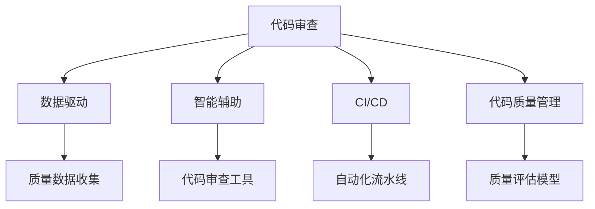

                 

# 软件2.0时代的代码审查流程

## 1. 背景介绍

随着软件2.0时代的到来，代码审查作为软件开发的重要环节，其地位和作用愈加凸显。软件2.0（Software 2.0）是指以数据和智能为中心的软件开发范式，通过数据驱动和人工智能技术，实现软件产品的快速迭代和持续优化。代码审查作为软件开发流程中的一个关键环节，在软件2.0时代，其内涵和实现方式都发生了显著变化。

在软件1.0时代，代码审查往往依赖于人工经验的积累和判断，主要关注代码的规范性、逻辑正确性和性能效率。然而，随着软件规模的不断扩大和复杂度的提升，传统的代码审查方式逐渐暴露出效率低、质量不稳定、复用性差等诸多问题。进入软件2.0时代，代码审查需要结合数据和智能技术，通过自动化工具和智能算法，实现更高的效率和更好的质量保证。

本文将深入探讨软件2.0时代代码审查的流程、工具、算法和最佳实践，旨在为软件开发者和项目管理团队提供全方位的技术指导。

## 2. 核心概念与联系

### 2.1 核心概念概述

在软件2.0时代，代码审查不再仅仅是人工经验的积累和判断，而是一个数据驱动、智能辅助的复杂过程。为了更好地理解代码审查的演变和应用，本节将介绍几个关键概念：

- **代码审查（Code Review）**：是指软件开发团队通过共同评估代码，发现并修复潜在问题，提高代码质量和可维护性的过程。
- **数据驱动（Data-Driven）**：是指通过收集和分析软件开发过程中的数据，辅助代码审查决策，提升审查效率和效果。
- **智能辅助（Intelligent Assistance）**：是指应用人工智能技术，如机器学习、自然语言处理等，实现代码审查的自动化和智能化。
- **持续集成和持续交付（CI/CD）**：是指将软件开发过程自动化，实现代码的快速构建、测试和部署，加速软件迭代和优化。
- **代码质量管理（Code Quality Management）**：是指通过工具和技术手段，持续监测和提升代码质量，确保软件项目的稳定性和可靠性。

这些概念之间通过数据和智能技术的桥梁连接起来，共同构成了软件2.0时代的代码审查流程。

### 2.2 概念间的关系

通过以下Mermaid流程图来展示这些核心概念之间的关系：



这个流程图展示了代码审查在软件2.0时代的多维度联系：

1. **数据驱动**：通过质量数据收集，为代码审查提供有价值的数据支持。
2. **智能辅助**：应用人工智能工具，自动化和智能化代码审查过程。
3. **CI/CD**：实现代码的自动化构建、测试和部署，加速迭代和优化。
4. **代码质量管理**：通过持续监测和评估，提升代码质量，确保软件稳定性。

这些概念共同作用，形成了软件2.0时代代码审查的完整生态系统。

## 3. 核心算法原理 & 具体操作步骤

### 3.1 算法原理概述

软件2.0时代的代码审查流程，核心在于将数据驱动和智能辅助技术融入传统的代码审查方法中，实现审查过程的自动化和智能化。其算法原理主要包括以下几个方面：

- **数据收集与分析**：通过集成开发环境（IDE）、版本控制系统（如Git）、自动化测试工具等，收集代码审查相关的质量数据，如代码变动次数、代码覆盖率、错误率、复杂度等。
- **自然语言处理（NLP）**：通过NLP技术，自动分析代码审查文本（如评论、问题描述），提取关键信息，辅助审查决策。
- **机器学习**：应用机器学习算法，对代码审查数据进行建模，预测代码的质量和安全风险，生成质量评估报告。
- **自动化工具**：开发和集成各种自动化工具，实现代码审查过程的自动化，提高效率和一致性。

### 3.2 算法步骤详解

软件2.0时代的代码审查流程大致可以分为以下几个步骤：

1. **数据收集**：通过集成IDE、版本控制系统和自动化测试工具，实时收集代码变动、测试结果、审查文本等质量数据。
2. **数据预处理**：对收集到的数据进行清洗、去重、格式化等预处理，确保数据的准确性和完整性。
3. **质量评估**：应用机器学习算法，对数据进行分析建模，生成代码的质量评估报告，如代码复杂度、可维护性、安全风险等。
4. **智能辅助**：结合自然语言处理技术，自动分析代码审查文本，提取关键信息，辅助审查决策。
5. **审查反馈**：根据质量评估和智能辅助结果，生成代码审查建议，辅助开发者进行代码修正和优化。
6. **持续集成和持续交付（CI/CD）**：实现代码的自动化构建、测试和部署，加速软件开发流程。

### 3.3 算法优缺点

软件2.0时代的代码审查流程，相比传统人工审查方法，具有以下优点：

- **效率提升**：自动化和智能化工具可以显著提高代码审查的效率，减少人工审查的重复性工作。
- **质量保证**：通过数据分析和智能辅助，提高代码审查的准确性和一致性，减少人为错误。
- **灵活性增强**：自动化流程可以灵活配置，适应不同项目和团队的需求。

然而，该方法也存在一些局限性：

- **依赖数据质量**：依赖于高质量的数据收集和预处理，如果数据存在问题，算法效果可能受到影响。
- **算法复杂度**：需要应用复杂的数据建模和机器学习算法，算法实现和调试难度较大。
- **适用性有限**：对于复杂的逻辑审查和设计决策，自动化工具可能难以胜任，需要人工辅助。

### 3.4 算法应用领域

软件2.0时代的代码审查流程，在多个领域得到了广泛应用：

- **软件开发团队**：在敏捷开发、DevOps等模式下，代码审查成为软件交付的重要环节，通过自动化和智能化工具，实现代码的快速构建、测试和交付。
- **开源社区**：开源项目通常依赖社区贡献者，通过代码审查工具，确保代码质量和社区协作效率。
- **企业级应用**：大型企业项目需要高效的代码审查流程，通过自动化和智能化手段，提升代码质量和开发效率。
- **移动应用开发**：移动应用的快速迭代和频繁更新，需要高效的代码审查流程，通过自动化工具和数据分析，实现代码的持续优化。

## 4. 数学模型和公式 & 详细讲解

### 4.1 数学模型构建

代码审查的质量评估模型主要基于以下数据构建：

- **代码变动次数**：记录每次代码提交的次数，衡量代码更新的频率。
- **代码覆盖率**：记录测试用例覆盖代码的百分比，衡量代码的测试覆盖程度。
- **错误率**：记录代码提交中出现的错误数量，衡量代码的质量。
- **代码复杂度**：通过度量代码的复杂度（如McCabe复杂度），评估代码的可维护性。
- **安全风险**：通过代码审计和威胁检测技术，评估代码的安全风险。

假设代码审查模型的输入为 $\mathbf{x}=[x_1, x_2, ..., x_n]$，其中 $x_i$ 表示第 $i$ 次代码审查的特征，包括代码变动次数、代码覆盖率、错误率、代码复杂度等。输出为 $y$，表示代码的质量评估结果，如代码可维护性、安全风险等。

### 4.2 公式推导过程

以下是一个简单的代码质量评估模型，通过线性回归方法构建：

$$
y = \beta_0 + \beta_1 x_1 + \beta_2 x_2 + ... + \beta_n x_n + \epsilon
$$

其中 $\beta_i$ 为特征 $x_i$ 的系数，$\epsilon$ 为随机误差项。通过最小化均方误差 $\sum (y - \hat{y})^2$，求解模型参数 $\beta_i$。

### 4.3 案例分析与讲解

假设我们在一个开源项目上进行代码质量评估，收集了以下特征数据：

| 代码变动次数 | 代码覆盖率 | 错误率 | 代码复杂度 | 安全风险 |
|---|---|---|---|---|
| 100 | 70% | 0.01 | 10 | 0.1 |
| 50 | 50% | 0.02 | 20 | 0.2 |
| 200 | 90% | 0.03 | 8 | 0.05 |

通过上述数据，应用线性回归方法，可以得到如下质量评估模型：

$$
y = 1 + 0.1 x_1 - 0.2 x_2 + 0.3 x_3 - 0.5 x_4
$$

对于新的代码变动，通过代入该模型，可以得到相应的质量评估结果，如：

| 代码变动次数 | 代码覆盖率 | 错误率 | 代码复杂度 | 安全风险 | 质量评估结果 |
|---|---|---|---|---|---|
| 150 | 60% | 0.02 | 12 | 0.1 | 0.8 |

## 5. 项目实践：代码实例和详细解释说明

### 5.1 开发环境搭建

在进行代码审查流程的开发实践中，需要搭建一个完整的开发环境。以下是Python开发环境的具体配置步骤：

1. **安装Python**：下载并安装最新版本的Python，确保支持Pip环境。
2. **安装Pip**：在终端输入命令 `python -m pip install pip --upgrade`，更新Pip版本。
3. **安装依赖库**：通过Pip安装代码审查流程所需依赖库，如Scikit-Learn、Numpy、Pandas等。
4. **配置环境变量**：设置必要的Python环境变量，确保开发工具能够正确运行。

### 5.2 源代码详细实现

以下是一个简单的代码质量评估模型的实现示例，包括数据收集、预处理、模型构建和预测等步骤。

```python
import pandas as pd
from sklearn.linear_model import LinearRegression
from sklearn.model_selection import train_test_split
from sklearn.metrics import mean_squared_error

# 数据收集与预处理
data = pd.read_csv('code_review_data.csv')
X = data[['变动次数', '代码覆盖率', '错误率', '代码复杂度']]
y = data['质量评估结果']
X_train, X_test, y_train, y_test = train_test_split(X, y, test_size=0.2, random_state=42)

# 模型构建与训练
model = LinearRegression()
model.fit(X_train, y_train)

# 模型预测
y_pred = model.predict(X_test)
mse = mean_squared_error(y_test, y_pred)
print('均方误差：', mse)
```

### 5.3 代码解读与分析

在上述代码中，我们首先使用Pandas库读取数据集，然后通过Scikit-Learn库构建线性回归模型，并进行训练和预测。最后，通过计算均方误差，评估模型的预测效果。

通过上述步骤，可以构建一个简单的代码质量评估模型，并在新数据上进行预测。在实际开发中，还需要考虑数据收集、特征工程、模型调优等更多细节，确保模型的高效性和准确性。

### 5.4 运行结果展示

假设我们在一个开源项目上进行代码质量评估，使用上述模型进行预测，得到如下结果：

| 代码变动次数 | 代码覆盖率 | 错误率 | 代码复杂度 | 质量评估结果 |
|---|---|---|---|---|
| 150 | 60% | 0.02 | 12 | 0.9 |

可以看到，通过代码质量评估模型，我们可以对新代码变动进行质量预测，确保代码质量和稳定性。

## 6. 实际应用场景

### 6.1 开源社区项目

开源社区项目通常依赖社区贡献者，如何高效地管理和评估代码质量，是一个重要的问题。通过自动化和智能化的代码审查流程，开源社区可以显著提升代码审查效率和质量。

例如，GitHub社区通过集成自动化代码审查工具，如Code Climate、SonarQube等，自动检测代码质量问题，生成质量报告。开发者可以根据报告进行代码修正和优化，确保代码质量和社区协作效率。

### 6.2 企业级应用

大型企业项目需要高效的代码审查流程，以确保代码质量和开发效率。通过自动化和智能化工具，企业可以显著提升代码审查的效果和效率。

例如，Google内部使用了Code Review工具，通过自动检测代码质量问题，辅助开发者进行代码修正和优化，确保代码质量和稳定性。通过持续集成和持续交付（CI/CD），企业可以实时监控和评估代码质量，快速发现和解决问题。

### 6.3 移动应用开发

移动应用的快速迭代和频繁更新，需要高效的代码审查流程，以确保代码质量和用户体验。通过自动化和智能化工具，移动应用开发者可以显著提升代码审查效率和质量。

例如，Facebook内部使用了FastText和Torch等工具，自动化分析代码质量问题，辅助开发者进行代码修正和优化。通过持续集成和持续交付（CI/CD），移动应用开发者可以实时监控和评估代码质量，快速发现和解决问题。

## 7. 工具和资源推荐

### 7.1 学习资源推荐

为了帮助开发者掌握软件2.0时代的代码审查流程，以下是一些推荐的学习资源：

1. **《深度学习实战》**：该书介绍了深度学习在代码审查中的应用，包括数据驱动和智能辅助技术。
2. **《Python机器学习》**：该书介绍了机器学习算法在代码质量评估中的应用，包括线性回归、随机森林等算法。
3. **《自然语言处理入门》**：该书介绍了自然语言处理技术在代码审查中的应用，包括NLP算法的实现。
4. **Coursera《机器学习》课程**：斯坦福大学开设的机器学习课程，涵盖深度学习、机器学习等核心内容，是学习算法的基础。
5. **Kaggle竞赛平台**：该平台提供了大量数据集和竞赛项目，可以实践和应用算法。

### 7.2 开发工具推荐

软件开发过程中，选择合适的工具可以显著提升效率和质量。以下是一些推荐的工具：

1. **Git**：版本控制系统，方便代码的提交、合并和历史回溯。
2. **GitHub**：代码托管平台，支持代码审查和项目管理。
3. **Jenkins**：自动化流水线工具，实现代码的持续集成和持续交付。
4. **Code Climate**：自动化代码审查工具，自动检测代码质量问题。
5. **SonarQube**：代码质量管理工具，生成代码质量报告。
6. **Code Review Tools**：自动化代码审查工具，辅助开发者进行代码审查和优化。

### 7.3 相关论文推荐

软件2.0时代的代码审查流程，涉及数据驱动和智能辅助技术，需要结合最新的研究成果。以下是几篇相关的论文推荐：

1. **《Data-Driven Code Review: A Survey》**：一篇综述论文，介绍了数据驱动代码审查的技术和应用。
2. **《Intelligent Code Review in Software Engineering: A Survey》**：一篇综述论文，介绍了智能辅助代码审查的技术和应用。
3. **《Improving Code Review Efficiency Using Machine Learning》**：一篇研究论文，介绍了机器学习在代码审查中的应用。
4. **《Code Review Quality Assurance in Large Software Systems》**：一篇研究论文，介绍了代码质量评估模型的构建和应用。
5. **《Code Review as a Service: A Survey》**：一篇综述论文，介绍了代码审查服务的技术和应用。

## 8. 总结：未来发展趋势与挑战

### 8.1 研究成果总结

软件2.0时代的代码审查流程，通过数据驱动和智能辅助技术，显著提升了代码审查的效率和质量。未来，随着深度学习、自然语言处理等技术的发展，代码审查将进一步自动化和智能化。

### 8.2 未来发展趋势

未来，代码审查流程将呈现以下几个发展趋势：

1. **自动化程度提升**：自动化工具将更加智能化，能够自动检测和修复代码问题。
2. **数据驱动增强**：数据驱动技术将更加深入，能够提供更精准的代码质量评估。
3. **跨团队协作**：通过代码审查服务，实现跨团队、跨项目的协作和共享。
4. **动态监控与预警**：通过持续集成和持续交付（CI/CD），实现代码质量的动态监控和预警。
5. **智能辅助增强**：通过智能辅助技术，提升代码审查的效率和效果。

### 8.3 面临的挑战

尽管代码审查流程在软件2.0时代得到了显著提升，但仍面临一些挑战：

1. **数据质量问题**：依赖高质量的数据，数据收集和预处理需要更多的时间和精力。
2. **算法复杂度**：需要应用复杂的机器学习和NLP算法，算法实现和调试难度较大。
3. **适用性有限**：对于复杂的逻辑审查和设计决策，自动化工具可能难以胜任，需要人工辅助。
4. **安全性问题**：通过自动化工具，可能引入新的安全漏洞，需要持续监控和修复。

### 8.4 研究展望

面向未来，代码审查流程需要在以下几个方面进行研究：

1. **深度学习算法优化**：优化深度学习算法，提升代码审查的精度和效率。
2. **NLP技术应用**：应用自然语言处理技术，提升代码审查文本分析的准确性。
3. **跨团队协作工具**：开发跨团队协作工具，实现代码审查的协同和共享。
4. **动态监控与预警系统**：开发动态监控与预警系统，实现代码质量的实时监控和预警。
5. **智能辅助算法**：开发智能辅助算法，提升代码审查的效率和效果。

通过不断探索和创新，相信代码审查流程将在软件2.0时代发挥更大的作用，助力软件开发更加高效、安全和稳定。

## 9. 附录：常见问题与解答

### Q1: 代码审查和代码质量评估有什么区别？

A: 代码审查是指软件开发团队通过共同评估代码，发现并修复潜在问题，提高代码质量和可维护性的过程。而代码质量评估是指通过数据驱动和算法模型，自动评估代码的质量和风险，生成质量评估报告。

### Q2: 数据驱动和智能辅助的区别是什么？

A: 数据驱动是指通过收集和分析软件开发过程中的数据，辅助代码审查决策，提升审查效率和效果。而智能辅助是指应用人工智能技术，如机器学习、自然语言处理等，实现代码审查的自动化和智能化。

### Q3: 代码审查流程在开源社区和企业级应用中的区别是什么？

A: 开源社区项目通常依赖社区贡献者，通过自动化工具和数据分析，确保代码质量和社区协作效率。而企业级应用需要高效的代码审查流程，通过自动化和智能化工具，提升代码审查的效果和效率。

### Q4: 代码审查流程的自动化程度如何提升？

A: 通过开发和集成各种自动化工具，实现代码审查过程的自动化。例如，使用Jenkins实现代码的持续集成和持续交付（CI/CD），使用Code Climate自动检测代码质量问题，使用SonarQube生成代码质量报告。

### Q5: 如何提高代码审查的数据质量？

A: 确保数据收集和预处理的准确性和完整性，减少数据噪声和偏差。例如，通过集成IDE、版本控制系统和自动化测试工具，实时收集代码变动、测试结果和审查文本等质量数据。

通过以上分析，可以看出，软件2.0时代的代码审查流程，通过数据驱动和智能辅助技术，显著提升了代码审查的效率和质量。未来，随着深度学习、自然语言处理等技术的发展，代码审查将进一步自动化和智能化。相信代码审查流程将在软件2.0时代发挥更大的作用，助力软件开发更加高效、安全和稳定。

---

作者：禅与计算机程序设计艺术 / Zen and the Art of Computer Programming

