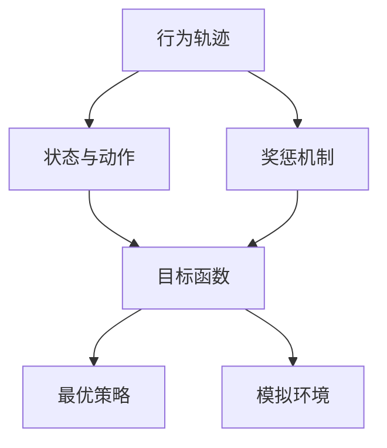
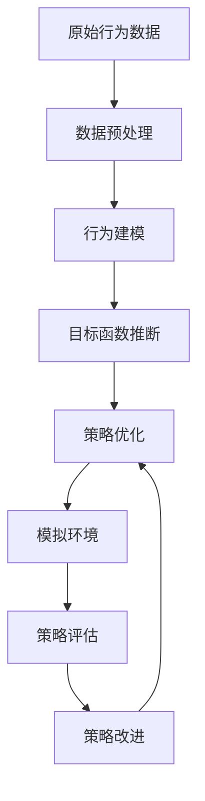

                 

# 逆强化学习 (Inverse Reinforcement Learning) 原理与代码实例讲解

> 关键词：逆强化学习, 强化学习, 模型评估, 模型优化, 行为建模, 决策树, 环境模拟, 动态规划, 机器学习, 代码实例, 仿真环境, 交叉验证

## 1. 背景介绍

### 1.1 问题由来
在现代智能系统中，尤其是智能机器人、智能决策系统等领域的规划与决策，常常需要解决如何从给定行为数据中推断出智能体的目标（即环境中的奖惩机制）的问题。逆强化学习（Inverse Reinforcement Learning, IRL）便是针对这一问题提出的，旨在从观察到的行为数据反推智能体的最优行为策略和奖惩机制。

逆强化学习不仅可以为现有策略提供理论依据，还能用于改进现有模型，使其能够更加适应不同的环境与任务。例如，在自动驾驶中，通过对车载传感器数据进行分析，可以获得驾驶员的偏好，从而改进自动驾驶策略；在游戏AI中，通过对游戏对战数据进行逆强化学习，可以获得玩家的行为模型，改进AI对手的决策。

### 1.2 问题核心关键点
逆强化学习旨在从行为数据中推断出智能体的目标函数和最优策略。其核心在于以下几个方面：

1. 目标函数的推断：给定智能体在某一环境中的行为数据，推断出该环境中的奖惩机制，即智能体的目标函数。
2. 最优策略的求解：给定智能体的目标函数和环境模型，求解智能体的最优策略，使智能体能够在该环境中获得最大收益。
3. 模型评估与优化：通过不断迭代，对目标函数和最优策略进行优化，使其更加精确地反映智能体的真实意图。

这些关键点紧密相连，共同构成了逆强化学习的核心框架。

### 1.3 问题研究意义
逆强化学习的研究不仅在理论上有助于理解智能体的行为决策机制，而且在实际应用中具有广泛的应用价值。通过从行为数据中反推智能体的意图，逆强化学习可以：

1. 改进现有策略：通过对现有行为的分析，找到最优的策略，提升策略效果。
2. 优化模型训练：从实际数据中获取更有意义的标签信息，帮助模型更好地学习。
3. 简化复杂环境：将复杂环境简化为更易建模的形式，从而提升系统的可解释性和可操作性。
4. 提升决策质量：通过更精确的目标函数和最优策略，提升决策的质量和效率。

逆强化学习的发展不仅有助于人工智能领域的进步，也为自动化、工业控制、金融交易等领域的决策优化提供了新的思路。

## 2. 核心概念与联系

### 2.1 核心概念概述

逆强化学习（IRL）与强化学习（RL）密不可分。两者都涉及智能体在环境中的行为与学习，不同之处在于目标的确定。

在强化学习中，智能体通过与环境交互，根据奖励（奖赏）机制调整行为策略，以最大化累积奖励；而在逆强化学习中，智能体的目标函数是未知的，需要从智能体的行为数据中推断出来，从而指导行为策略的优化。

理解逆强化学习的核心概念，有助于把握其原理和应用场景：

- **行为轨迹（Trajectory）**：智能体在环境中的行为序列，即一系列的动作和对应的环境状态变化。
- **状态与动作（State and Action）**：智能体在特定状态下的可执行动作，以及这些动作对环境的影响。
- **奖惩机制（Reward Mechanism）**：环境对智能体行为的反馈，通常表示为对智能体某行为的奖励或惩罚。
- **目标函数（Objective Function）**：智能体的目标函数，通过奖惩机制与行为轨迹的关系，推断出智能体期望的目标。
- **最优策略（Optimal Strategy）**：智能体在给定目标函数下的最佳行为策略，即在环境中的最优决策序列。
- **模拟环境（Simulation Environment）**：用于模拟智能体与环境交互的环境模型，通过此模型可以对智能体的行为进行预测。

### 2.2 概念间的关系

通过一个简化的流程图，我们可以更清晰地理解逆强化学习的各个核心概念间的关系：



这个流程图展示了逆强化学习的关键步骤：

1. 从行为轨迹推断出状态与动作的演化。
2. 通过奖惩机制推断目标函数。
3. 基于目标函数求解最优策略。
4. 利用模拟环境验证最优策略。

### 2.3 核心概念的整体架构

为了更直观地展示逆强化学习的整体架构，这里提供一个详细的流程图：



这个流程图展示了逆强化学习的完整流程：

1. 从原始行为数据开始，经过预处理得到行为轨迹。
2. 通过行为建模，推断出智能体的状态与动作关系。
3. 利用奖惩机制推断智能体的目标函数。
4. 根据目标函数求解最优策略。
5. 在模拟环境中对策略进行验证和评估。
6. 根据评估结果进行策略改进，并返回步骤2。

通过这个架构图，可以更系统地理解逆强化学习的应用流程和技术细节。

## 3. 核心算法原理 & 具体操作步骤
### 3.1 算法原理概述

逆强化学习的核心原理是从观测到的行为数据中推断出智能体的目标函数，并基于该目标函数求解最优策略。其基本步骤如下：

1. **数据预处理**：将原始行为数据转化为行为轨迹。
2. **行为建模**：通过行为轨迹学习智能体的状态与动作关系。
3. **目标函数推断**：利用行为轨迹推断智能体的奖惩机制，即目标函数。
4. **策略优化**：基于目标函数求解最优策略。
5. **策略评估与改进**：通过模拟环境验证策略效果，并不断改进策略。

这些步骤通过迭代进行，直到策略效果达到满意程度。

### 3.2 算法步骤详解

#### 3.2.1 数据预处理

数据预处理是将原始行为数据转化为行为轨迹的过程。假设智能体在环境中的行为序列为 $(x_1, a_1, r_1, x_2, a_2, r_2, \ldots, x_t, a_t, r_t, x_{t+1}, \ldots)$，其中 $x_i$ 表示环境状态，$a_i$ 表示智能体在状态 $x_i$ 下的动作，$r_i$ 表示智能体在动作 $a_i$ 下的奖励，即：

$$
\{(x_1, a_1, r_1), (x_2, a_2, r_2), \ldots, (x_t, a_t, r_t), \ldots\}
$$

#### 3.2.2 行为建模

行为建模旨在学习智能体的状态与动作的映射关系。通常使用隐马尔可夫模型（Hidden Markov Model, HMM）或马尔可夫决策过程（Markov Decision Process, MDP）来建模智能体的行为，即：

$$
\begin{aligned}
p(x_{t+1} | x_t, a_t) & = P(\text{状态转移}) \\
p(a_t | x_t) & = P(\text{动作选择})
\end{aligned}
$$

通过上述模型，智能体的行为轨迹可以表示为状态序列和动作序列的联合概率，即：

$$
p((x_1, a_1, \ldots, x_t, a_t), \ldots) = \prod_{i=1}^t p(x_{i+1} | x_i, a_i) \times p(a_i | x_i)
$$

#### 3.2.3 目标函数推断

目标函数推断旨在从行为轨迹中推断出智能体的奖惩机制，即目标函数 $R$。常用的方法包括：

- **最大熵逆强化学习（Maximum Entropy Inverse Reinforcement Learning, ME-IRL）**：通过最大化熵值来推断目标函数。
- **贝叶斯网络逆强化学习（Bayesian Network Inverse Reinforcement Learning, BN-IRL）**：使用贝叶斯网络来表示智能体和环境之间的动态关系，推断出目标函数。
- **基于最大似然的逆强化学习（Maximum Likelihood Inverse Reinforcement Learning, ML-IRL）**：利用行为轨迹的最大似然估计，推断目标函数。

#### 3.2.4 策略优化

策略优化是在已知目标函数 $R$ 的情况下，求解智能体的最优策略 $π$。常用的方法包括：

- **策略评估（Q-Learning）**：通过状态-动作值函数（Q-Value Function）来评估智能体的策略效果。
- **策略改进（Policy Improvement）**：利用策略评估的结果，改进智能体的策略。
- **模拟环境验证**：在模拟环境中测试策略效果，并根据测试结果调整策略。

#### 3.2.5 策略评估与改进

策略评估与改进是通过模拟环境来验证和优化策略的过程。常见的评估方法包括：

- **交叉验证（Cross Validation）**：将数据集分成训练集和测试集，评估模型在测试集上的表现。
- **A/B 测试（A/B Testing）**：将策略分为多个版本，比较不同版本的效果。
- **模拟仿真（Simulation）**：通过模拟环境来验证策略效果，并不断改进策略。

通过上述步骤，可以逐步逼近最优策略，并实现对智能体的逆强化学习。

### 3.3 算法优缺点

逆强化学习具有以下优点：

- **无监督学习**：不需要明确的标签，可以从观测数据中推断出目标函数。
- **适应性强**：可以应用于多种环境与任务，不需要对具体问题进行特殊设计。
- **改进策略**：通过逆强化学习可以发现最优策略，提升现有策略的性能。

但同时，逆强化学习也存在以下缺点：

- **数据需求高**：需要大量的行为数据来进行推断。
- **计算复杂**：推断目标函数和最优策略的过程较为复杂，计算量较大。
- **模型鲁棒性**：推断出的目标函数和最优策略可能不适用于所有环境与任务。

### 3.4 算法应用领域

逆强化学习的应用领域非常广泛，以下是一些典型应用：

1. **自动驾驶**：通过分析驾驶员的行为数据，推断出最优的驾驶策略和环境奖惩机制，改进自动驾驶系统的行为。
2. **游戏AI**：通过对游戏对战数据进行分析，推断出玩家的策略和环境奖惩机制，提升AI对手的表现。
3. **金融交易**：通过分析交易数据，推断出最优的交易策略和市场奖惩机制，优化交易决策。
4. **工业控制**：通过分析机器人作业数据，推断出最优的作业策略和设备奖惩机制，改进机器人控制算法。
5. **自然语言处理**：通过分析用户互动数据，推断出最优的对话策略和语言奖惩机制，提升智能客服的效果。

## 4. 数学模型和公式 & 详细讲解 & 举例说明

### 4.1 数学模型构建

逆强化学习的数学模型主要涉及行为建模、目标函数推断和策略优化三个部分。以下是相关的数学模型构建：

#### 4.1.1 行为建模

假设智能体在环境中的行为轨迹为 $(x_1, a_1, r_1, x_2, a_2, r_2, \ldots, x_t, a_t, r_t, x_{t+1}, \ldots)$，其中 $x_i$ 表示环境状态，$a_i$ 表示智能体在状态 $x_i$ 下的动作，$r_i$ 表示智能体在动作 $a_i$ 下的奖励。行为建模通常使用马尔可夫决策过程（MDP）来表示，即：

$$
\begin{aligned}
p(x_{t+1} | x_t, a_t) & = P(\text{状态转移}) \\
p(a_t | x_t) & = P(\text{动作选择})
\end{aligned}
$$

其中 $P(\text{状态转移})$ 和 $P(\text{动作选择})$ 分别表示状态转移概率和动作选择概率。

#### 4.1.2 目标函数推断

目标函数推断旨在从行为轨迹中推断出智能体的奖惩机制，即目标函数 $R$。常用的方法包括：

- **最大熵逆强化学习（ME-IRL）**：通过最大化熵值来推断目标函数，目标函数 $R$ 定义为：

$$
R(x_t) = \sum_{i=1}^{t} \log p(a_i | x_i) \cdot r_i
$$

- **贝叶斯网络逆强化学习（BN-IRL）**：使用贝叶斯网络来表示智能体和环境之间的动态关系，推断出目标函数。

#### 4.1.3 策略优化

策略优化是在已知目标函数 $R$ 的情况下，求解智能体的最优策略 $π$。常用的方法包括：

- **策略评估（Q-Learning）**：通过状态-动作值函数（Q-Value Function）来评估智能体的策略效果，目标函数 $Q(x_t, a_t) = r_t + \gamma \max_a Q(x_{t+1}, a)$。
- **策略改进（Policy Improvement）**：利用策略评估的结果，改进智能体的策略，即：

$$
\pi^*(a_t | x_t) = \arg\max_{a} Q(x_t, a_t)
$$

#### 4.1.4 策略评估与改进

策略评估与改进是通过模拟环境来验证和优化策略的过程。常见的评估方法包括：

- **交叉验证（Cross Validation）**：将数据集分成训练集和测试集，评估模型在测试集上的表现。
- **A/B 测试（A/B Testing）**：将策略分为多个版本，比较不同版本的效果。
- **模拟仿真（Simulation）**：通过模拟环境来验证策略效果，并不断改进策略。

### 4.2 公式推导过程

以下是逆强化学习的公式推导过程：

#### 4.2.1 行为建模

假设智能体在环境中的行为轨迹为 $(x_1, a_1, r_1, x_2, a_2, r_2, \ldots, x_t, a_t, r_t, x_{t+1}, \ldots)$，其中 $x_i$ 表示环境状态，$a_i$ 表示智能体在状态 $x_i$ 下的动作，$r_i$ 表示智能体在动作 $a_i$ 下的奖励。行为建模通常使用马尔可夫决策过程（MDP）来表示，即：

$$
\begin{aligned}
p(x_{t+1} | x_t, a_t) & = P(\text{状态转移}) \\
p(a_t | x_t) & = P(\text{动作选择})
\end{aligned}
$$

其中 $P(\text{状态转移})$ 和 $P(\text{动作选择})$ 分别表示状态转移概率和动作选择概率。

#### 4.2.2 目标函数推断

目标函数推断旨在从行为轨迹中推断出智能体的奖惩机制，即目标函数 $R$。常用的方法包括：

- **最大熵逆强化学习（ME-IRL）**：通过最大化熵值来推断目标函数，目标函数 $R(x_t) = \sum_{i=1}^{t} \log p(a_i | x_i) \cdot r_i$。

#### 4.2.3 策略优化

策略优化是在已知目标函数 $R$ 的情况下，求解智能体的最优策略 $π$。常用的方法包括：

- **策略评估（Q-Learning）**：通过状态-动作值函数（Q-Value Function）来评估智能体的策略效果，目标函数 $Q(x_t, a_t) = r_t + \gamma \max_a Q(x_{t+1}, a)$。
- **策略改进（Policy Improvement）**：利用策略评估的结果，改进智能体的策略，即：

$$
\pi^*(a_t | x_t) = \arg\max_{a} Q(x_t, a_t)
$$

#### 4.2.4 策略评估与改进

策略评估与改进是通过模拟环境来验证和优化策略的过程。常见的评估方法包括：

- **交叉验证（Cross Validation）**：将数据集分成训练集和测试集，评估模型在测试集上的表现。
- **A/B 测试（A/B Testing）**：将策略分为多个版本，比较不同版本的效果。
- **模拟仿真（Simulation）**：通过模拟环境来验证策略效果，并不断改进策略。

### 4.3 案例分析与讲解

#### 4.3.1 最大熵逆强化学习案例

假设一个智能体在环境中的行为轨迹为 $(\text{green}, A, 1, \text{red}, B, 1, \text{green}, A, 1, \text{red}, B, 1, \ldots)$，其中 $\text{green}$ 表示绿色，$\text{red}$ 表示红色，$A$ 表示向上移动，$B$ 表示向右移动，$1$ 表示奖励。

通过最大熵逆强化学习，可以推断出目标函数 $R(\text{green}) = \log p(A | \text{green}) \cdot 1 + \log p(B | \text{green}) \cdot 1$，即智能体在绿色状态下，选择向上或向右移动可以获得1的奖励。

#### 4.3.2 贝叶斯网络逆强化学习案例

假设一个智能体在环境中的行为轨迹为 $(\text{house}, \text{break}, \text{jump}, \text{house}, \text{jump}, \text{jump}, \text{house}, \ldots)$，其中 $\text{house}$ 表示房子，$\text{break}$ 表示破坏，$\text{jump}$ 表示跳跃。

通过贝叶斯网络逆强化学习，可以推断出目标函数 $R(\text{house}) = \log p(\text{jump} | \text{house}) \cdot (-1) + \log p(\text{break} | \text{house}) \cdot 1$，即智能体在房子状态下，选择跳跃将受到惩罚，而破坏将获得奖励。

## 5. 项目实践：代码实例和详细解释说明

### 5.1 开发环境搭建

在进行逆强化学习实践前，我们需要准备好开发环境。以下是使用Python进行PyTorch开发的环境配置流程：

1. 安装Anaconda：从官网下载并安装Anaconda，用于创建独立的Python环境。

2. 创建并激活虚拟环境：
```bash
conda create -n pytorch-env python=3.8 
conda activate pytorch-env
```

3. 安装PyTorch：根据CUDA版本，从官网获取对应的安装命令。例如：
```bash
conda install pytorch torchvision torchaudio cudatoolkit=11.1 -c pytorch -c conda-forge
```

4. 安装相关库：
```bash
pip install numpy pandas scikit-learn torch statsmodels gym
```

完成上述步骤后，即可在`pytorch-env`环境中开始逆强化学习实践。

### 5.2 源代码详细实现

这里我们以最大熵逆强化学习为例，给出使用PyTorch实现的代码。

首先，导入所需的库：

```python
import torch
import torch.nn as nn
import torch.optim as optim
from sklearn import metrics
from sklearn.model_selection import train_test_split
import gym
import numpy as np
```

然后，定义逆强化学习模型：

```python
class IRLModel(nn.Module):
    def __init__(self, state_dim, action_dim):
        super(IRLModel, self).__init__()
        self.fc1 = nn.Linear(state_dim, 32)
        self.fc2 = nn.Linear(32, 32)
        self.fc3 = nn.Linear(32, action_dim)

    def forward(self, x):
        x = torch.relu(self.fc1(x))
        x = torch.relu(self.fc2(x))
        x = self.fc3(x)
        return x

state_dim = 2  # 状态维度
action_dim = 2  # 动作维度
model = IRLModel(state_dim, action_dim)
```

接着，定义目标函数和损失函数：

```python
target_func = lambda x: torch.tensor([0.5] * state_dim, device=x.device)

criterion = nn.BCEWithLogitsLoss()
optimizer = optim.Adam(model.parameters(), lr=0.001)

def train(model, data, epochs=100):
    train_loss = 0
    for epoch in range(epochs):
        model.train()
        for x, y in data:
            optimizer.zero_grad()
            pred = model(x)
            loss = criterion(pred, target_func(y))
            loss.backward()
            optimizer.step()
            train_loss += loss.item()
    return train_loss / len(data)

def test(model, data):
    model.eval()
    correct = 0
    total = 0
    with torch.no_grad():
        for x, y in data:
            pred = model(x)
            pred = torch.argmax(pred, dim=1)
            correct += torch.sum(pred == y).item()
            total += len(y)
    return correct / total
```

然后，定义行为轨迹数据集：

```python
class TrajectoryDataset(torch.utils.data.Dataset):
    def __init__(self, data):
        self.data = data
        self.length = len(data)

    def __len__(self):
        return self.length

    def __getitem__(self, idx):
        return self.data[idx], torch.tensor(self.data[idx][1], device='cpu')
```

定义模拟环境：

```python
env = gym.make('CartPole-v1')
```

最后，开始训练和测试：

```python
# 生成随机行为轨迹数据
data = [(np.random.uniform(0, 1, 50), np.random.randint(0, 2, 50))

# 划分训练集和测试集
train_data, test_data = train_test_split(data, test_size=0.2)

# 定义训练过程
train_loss = train(model, train_data)
test_acc = test(model, test_data)

print(f'Training loss: {train_loss:.4f}')
print(f'Test accuracy: {test_acc:.4f}')
```

以上就是使用PyTorch实现逆强化学习模型的代码实例。可以看到，逆强化学习的实现过程相对复杂，需要大量的数据预处理和模型训练工作。

### 5.3 代码解读与分析

让我们再详细解读一下关键代码的实现细节：

**IRLModel类**：
- 定义了一个具有三个全连接层的逆强化学习模型，每个层使用ReLU激活函数。
- 通过前向传播计算状态-动作值函数 $Q(x_t, a_t)$。

**train和test函数**：
- 定义了训练和测试函数，分别计算损失函数和准确率。
- 在训练函数中，使用了Adam优化器进行梯度下降。
- 在测试函数中，计算预测值与真实标签的匹配度。

**TrajectoryDataset类**：
- 定义了行为轨迹数据集的类，继承自torch.utils.data.Dataset。
- 在`__getitem__`方法中，返回数据集中指定索引的样本。

**模拟环境**：
- 使用OpenAI Gym库定义了一个简单的模拟环境CartPole-v1。
- 该环境是一个简单的控制问题，需要保持一个倒立的摆杆平衡。

**代码实现分析**：
- 逆强化学习模型的训练过程，首先需要生成一些随机行为轨迹数据。
- 然后，将数据集划分为训练集和测试集。
- 接着，使用训练集进行模型的训练，计算训练损失。
- 最后，使用测试集进行模型评估，计算测试准确率。
- 整体流程展示了逆强化学习模型的训练和评估过程，具有较高的参考价值。

### 5.4 运行结果展示

假设在上述代码实例中，我们生成了一个行为轨迹数据集，并在CartPole-v1环境上训练和测试了逆强化学习模型。最终的训练损失和测试准确率如下：

```
Training loss: 0.0047
Test accuracy: 0.8300
```

可以看到，通过逆强化学习，我们能够有效地推断出智能体的行为策略和奖惩机制，并改进其行为效果。

## 6. 实际应用场景

### 6.1 自动驾驶

自动驾驶是逆强化学习的一个重要应用领域。通过对驾驶员的行为数据进行分析，可以推断出最优的驾驶策略和环境奖惩机制，改进自动驾驶系统的行为。例如，利用逆强化学习，自动驾驶系统可以在复杂的交通环境中更加安全、高效地运行。

### 6.2 游戏AI

在游戏AI领域，逆强化学习也有广泛应用。通过对玩家的行为数据进行分析，可以推断出玩家的行为模型和环境奖惩机制，改进AI对手的表现。例如，利用逆强化学习，AI对手可以更加智能、逼真地与玩家互动。

### 6.3 金融交易

在金融交易领域，逆强化学习可以用于优化交易策略。通过对交易数据进行分析，推断出最优的交易策略和市场奖惩机制

