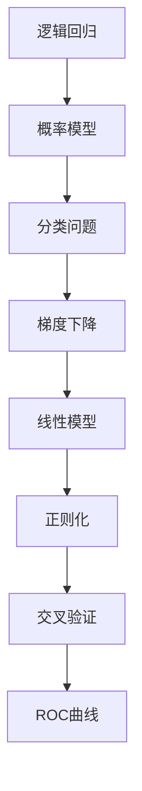
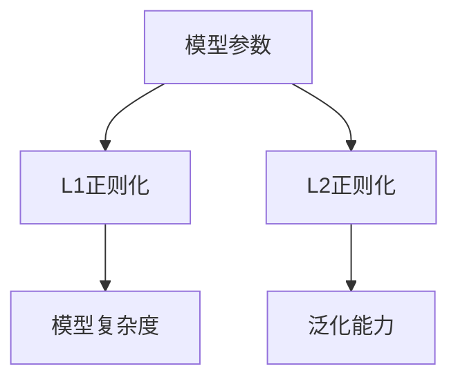
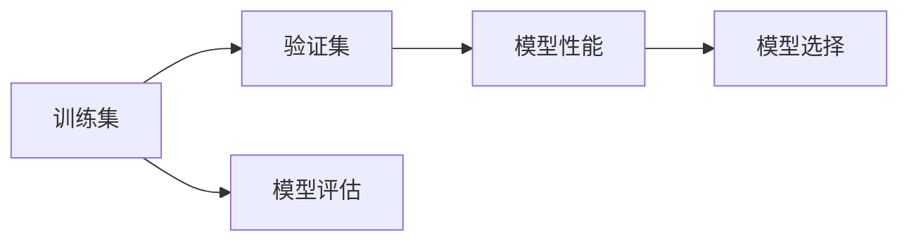
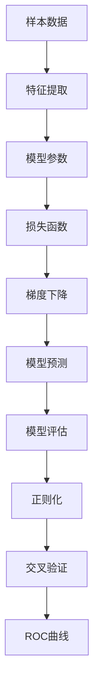

                 

# 逻辑回归(Logistic Regression) - 原理与代码实例讲解

> 关键词：逻辑回归, 概率模型, 分类问题, 梯度下降, 线性模型, 正则化, 交叉验证, ROC曲线

## 1. 背景介绍

### 1.1 问题由来

逻辑回归（Logistic Regression）是一种常用的概率型分类模型，广泛应用在二分类和多分类问题中。其基本思想是通过线性模型将样本特征映射到概率分布上，进而根据模型输出进行分类决策。逻辑回归因其简单易懂、解释性强，且训练和预测速度快，成为机器学习入门者首选的分类算法之一。

逻辑回归最初用于医学领域的疾病预测，后来在金融风险评估、文本分类等领域也得到了广泛应用。此外，逻辑回归也常被用于建立概率模型，预测各类事件发生的概率，如股票涨跌、客户流失等。

### 1.2 问题核心关键点

逻辑回归模型是一种线性模型，其核心思想是通过训练数据拟合一条线性边界，将样本分为两类。具体来说，对于二分类问题，逻辑回归通过最大化后验概率来进行决策，从而得到最优的分类决策边界。

逻辑回归的模型训练一般采用梯度下降（Gradient Descent）算法，通过不断调整模型参数来最小化损失函数。为了提高模型的泛化能力，可以引入正则化（Regularization）和交叉验证（Cross-Validation）等技术，从而避免过拟合。

### 1.3 问题研究意义

逻辑回归作为一种经典的分类模型，其研究意义主要体现在以下几个方面：

1. **简单高效**：逻辑回归算法实现简单，易于理解和实现，是很多初学者入门的第一步。
2. **可解释性强**：逻辑回归模型参数直观，可以通过系数表示特征对分类结果的影响，便于理解模型决策过程。
3. **适用范围广**：逻辑回归可以应用于各种类型的数据，包括数值型和离散型特征，可以处理多分类问题，适应性极强。
4. **基础模型**：逻辑回归是其他复杂模型的基础，如支持向量机（SVM）、决策树等，理解逻辑回归有助于深入学习其他模型。

## 2. 核心概念与联系

### 2.1 核心概念概述

为更好地理解逻辑回归模型，本节将介绍几个密切相关的核心概念：

- **逻辑回归**：一种用于二分类和多分类问题的概率型分类模型，通过线性模型将样本特征映射到概率分布上，进而根据模型输出进行分类决策。
- **概率模型**：一种用于建模随机变量的概率分布的统计模型，逻辑回归就是其中一种。
- **分类问题**：将样本分为不同类别的任务，如判断邮件是否为垃圾邮件，识别图像中的物体等。
- **梯度下降**：一种优化算法，通过迭代调整参数来最小化损失函数，是逻辑回归模型训练的主要方法。
- **线性模型**：模型输出只包含输入特征的线性组合，逻辑回归就是一种线性模型。
- **正则化**：一种用于控制模型复杂度、防止过拟合的技术，包括L1和L2正则化。
- **交叉验证**：一种评估模型性能的方法，通过将数据集分为训练集和验证集，交替使用它们来评估模型性能。
- **ROC曲线**：一种用于评估分类模型性能的曲线，展示模型在不同阈值下的真阳性率和假阳性率。

这些核心概念之间的逻辑关系可以通过以下Mermaid流程图来展示：



这个流程图展示了逻辑回归模型的核心概念及其之间的关系：

1. 逻辑回归是一种概率型分类模型，建立在概率模型的基础上。
2. 分类问题是逻辑回归的目标任务。
3. 梯度下降算法用于训练逻辑回归模型。
4. 线性模型是逻辑回归的基本形式。
5. 正则化技术用于防止模型过拟合。
6. 交叉验证方法用于评估模型性能。
7. ROC曲线用于评估模型分类性能。

这些核心概念共同构成了逻辑回归模型的理论基础和应用框架，使其能够有效处理分类问题。

### 2.2 概念间的关系

这些核心概念之间存在着紧密的联系，形成了逻辑回归模型的完整生态系统。下面我们通过几个Mermaid流程图来展示这些概念之间的关系。

#### 2.2.1 逻辑回归的训练过程


这个流程图展示了逻辑回归模型的训练过程：

1. 从样本数据开始，经过特征提取，得到模型输入。
2. 模型参数初始化，并通过梯度下降不断调整，最小化损失函数。
3. 模型预测输出，并通过模型评估方法（如交叉验证）来评估模型性能。

#### 2.2.2 正则化技术



这个流程图展示了正则化技术的作用：

1. 模型参数通过L1或L2正则化，控制模型的复杂度。
2. L1正则化倾向于产生稀疏解，减少冗余特征。
3. L2正则化通过限制参数的平方和，防止过拟合。

#### 2.2.3 交叉验证评估



这个流程图展示了交叉验证评估的过程：

1. 将数据集分为训练集和验证集。
2. 在验证集上评估模型性能，如准确率、精确率、召回率等。
3. 选择最优模型，避免过拟合。

### 2.3 核心概念的整体架构

最后，我们用一个综合的流程图来展示这些核心概念在逻辑回归模型中的整体架构：



这个综合流程图展示了从数据预处理到模型评估的完整过程：

1. 样本数据经过特征提取，得到模型输入。
2. 模型参数通过梯度下降不断调整，最小化损失函数。
3. 模型预测输出，并通过模型评估方法（如交叉验证）来评估模型性能。
4. 正则化技术用于控制模型复杂度，防止过拟合。
5. 交叉验证方法用于评估模型性能，选择最优模型。
6. ROC曲线用于评估模型分类性能。

通过这些流程图，我们可以更清晰地理解逻辑回归模型的训练过程和评估方法，为后续深入讨论具体的逻辑回归算法步骤奠定了基础。

## 3. 核心算法原理 & 具体操作步骤
### 3.1 算法原理概述

逻辑回归的基本思想是将样本特征映射到概率分布上，通过计算后验概率来进行分类决策。其数学模型可以表示为：

$$ P(Y|X; \theta) = \sigma(\theta^T X + b) $$

其中，$Y$ 表示分类结果（0或1），$X$ 表示样本特征向量，$\theta$ 表示模型参数，$b$ 表示截距项。$\sigma$ 为逻辑函数（Logistic Function），也称为Sigmoid函数，可以表示为：

$$ \sigma(z) = \frac{1}{1 + e^{-z}} $$

模型参数 $\theta$ 和截距项 $b$ 通过梯度下降等优化算法进行训练，最小化损失函数。常用的损失函数是交叉熵损失（Cross-Entropy Loss），可以表示为：

$$ L(Y, P(Y|X; \theta)) = -\frac{1}{N}\sum_{i=1}^N [y_i \log P(Y=1|X_i; \theta) + (1-y_i) \log P(Y=0|X_i; \theta)] $$

其中，$N$ 为样本数量，$y_i$ 为样本的真实标签。

### 3.2 算法步骤详解

逻辑回归的训练过程包括以下几个关键步骤：

**Step 1: 准备数据**

- 收集和预处理数据集。确保数据集的特征和标签符合模型训练要求。

**Step 2: 初始化模型参数**

- 随机初始化模型参数 $\theta$ 和截距项 $b$。

**Step 3: 定义损失函数**

- 根据训练数据计算交叉熵损失函数。

**Step 4: 梯度下降优化**

- 使用梯度下降算法（如批量梯度下降、随机梯度下降等）不断调整模型参数，最小化损失函数。

**Step 5: 模型评估**

- 在验证集上评估模型性能，如准确率、精确率、召回率等。

**Step 6: 交叉验证**

- 进行交叉验证，选择最优模型。

**Step 7: 预测新样本**

- 使用训练好的模型对新样本进行预测。

### 3.3 算法优缺点

逻辑回归模型的优点包括：

- **简单高效**：模型结构简单，训练和预测速度快。
- **可解释性强**：模型参数直观，易于理解和解释。
- **适用范围广**：可以处理各种类型的数据，包括数值型和离散型特征。
- **扩展性高**：可以用于二分类和多分类问题，容易扩展到其他复杂模型。

其缺点包括：

- **线性假设**：模型假设特征之间存在线性关系，无法处理非线性问题。
- **过拟合风险**：如果数据集较少，模型容易过拟合。
- **正例和负例不平衡**：当样本中某些类别样本较少时，模型容易过拟合。
- **无法处理多分类问题**：需要引入多分类扩展，如Softmax回归。

### 3.4 算法应用领域

逻辑回归广泛应用于各种分类问题中，包括但不限于以下几个领域：

- **金融风险评估**：通过逻辑回归模型预测客户是否会违约、信用评分等。
- **医学诊断**：通过逻辑回归模型预测患者是否患有某种疾病、药物疗效等。
- **自然语言处理**：通过逻辑回归模型进行文本分类、情感分析、垃圾邮件过滤等。
- **机器视觉**：通过逻辑回归模型进行图像识别、物体检测等。
- **推荐系统**：通过逻辑回归模型进行用户行为预测、推荐物品等。
- **市场营销**：通过逻辑回归模型预测客户是否会购买某种产品、广告效果等。

## 4. 数学模型和公式 & 详细讲解 & 举例说明

### 4.1 数学模型构建

逻辑回归模型的数学模型可以表示为：

$$ P(Y|X; \theta) = \sigma(\theta^T X + b) $$

其中，$P(Y|X; \theta)$ 表示在参数 $\theta$ 下样本 $X$ 的分类概率，$\sigma$ 为逻辑函数，$\theta^T X + b$ 为线性组合。

### 4.2 公式推导过程

逻辑回归模型的损失函数为交叉熵损失，其公式推导如下：

对于单个样本 $(X, y)$，其损失函数可以表示为：

$$ L(Y, P(Y|X; \theta)) = -\log P(Y|X; \theta) $$

将 $P(Y|X; \theta)$ 带入上述公式，得到：

$$ L(Y, P(Y|X; \theta)) = -\log \sigma(\theta^T X + b) $$

对于整个数据集，交叉熵损失函数可以表示为：

$$ L(Y, P(Y|X; \theta)) = -\frac{1}{N}\sum_{i=1}^N [y_i \log P(Y=1|X_i; \theta) + (1-y_i) \log P(Y=0|X_i; \theta)] $$

其中，$N$ 为样本数量，$y_i$ 为样本的真实标签。

### 4.3 案例分析与讲解

以二分类问题为例，假设有一个数据集，包含样本 $X_1, X_2, ..., X_n$ 和对应的标签 $y_1, y_2, ..., y_n$，其中 $y_i \in \{0, 1\}$。使用逻辑回归模型进行训练，可以步骤如下：

1. 收集数据集，并将数据集分为训练集和测试集。
2. 随机初始化模型参数 $\theta$ 和截距项 $b$。
3. 在训练集上，使用梯度下降算法最小化交叉熵损失函数，得到最优参数 $\theta^*$。
4. 在测试集上评估模型性能，如准确率、精确率、召回率等。
5. 使用训练好的模型对新样本进行预测。

下面给出一个简单的Python代码示例，用于逻辑回归模型的训练和预测：

```python
import numpy as np
from sklearn.linear_model import LogisticRegression
from sklearn.metrics import accuracy_score

# 创建逻辑回归模型
model = LogisticRegression()

# 训练模型
model.fit(X_train, y_train)

# 预测测试集
y_pred = model.predict(X_test)

# 计算准确率
acc = accuracy_score(y_test, y_pred)
print("Accuracy: {:.2f}%".format(acc*100))
```

## 5. 项目实践：代码实例和详细解释说明

### 5.1 开发环境搭建

在进行逻辑回归项目实践前，我们需要准备好开发环境。以下是使用Python进行Scikit-Learn开发的环境配置流程：

1. 安装Anaconda：从官网下载并安装Anaconda，用于创建独立的Python环境。

2. 创建并激活虚拟环境：
```bash
conda create -n sklearn-env python=3.8 
conda activate sklearn-env
```

3. 安装Scikit-Learn：
```bash
conda install scikit-learn -c conda-forge
```

4. 安装各类工具包：
```bash
pip install numpy pandas scikit-learn matplotlib tqdm jupyter notebook ipython
```

完成上述步骤后，即可在`sklearn-env`环境中开始逻辑回归项目的开发。

### 5.2 源代码详细实现

这里我们以一个简单的二分类问题为例，使用Scikit-Learn库对逻辑回归模型进行训练和预测。

首先，定义训练集和测试集：

```python
from sklearn.model_selection import train_test_split
from sklearn.datasets import make_classification

# 创建随机二分类数据集
X, y = make_classification(n_samples=1000, n_features=10, n_informative=5, n_redundant=0, random_state=42)

# 划分训练集和测试集
X_train, X_test, y_train, y_test = train_test_split(X, y, test_size=0.2, random_state=42)
```

接着，定义逻辑回归模型并进行训练：

```python
from sklearn.linear_model import LogisticRegression

# 创建逻辑回归模型
model = LogisticRegression(solver='lbfgs', C=1e5, multi_class='auto', fit_intercept=True, intercept_scaling=1.0)

# 训练模型
model.fit(X_train, y_train)
```

最后，在测试集上评估模型性能：

```python
from sklearn.metrics import accuracy_score, precision_score, recall_score, f1_score

# 预测测试集
y_pred = model.predict(X_test)

# 计算准确率、精确率、召回率和F1分数
acc = accuracy_score(y_test, y_pred)
precision = precision_score(y_test, y_pred, average='macro')
recall = recall_score(y_test, y_pred, average='macro')
f1 = f1_score(y_test, y_pred, average='macro')

print("Accuracy: {:.2f}%".format(acc*100))
print("Precision: {:.2f}%".format(precision*100))
print("Recall: {:.2f}%".format(recall*100))
print("F1 Score: {:.2f}%".format(f1*100))
```

### 5.3 代码解读与分析

让我们再详细解读一下关键代码的实现细节：

**make_classification函数**：
- 用于生成随机二分类数据集，可以设置样本数量、特征数量、类别数量等参数。

**train_test_split函数**：
- 用于将数据集划分为训练集和测试集，可以设置分割比例和随机种子。

**LogisticRegression类**：
- 定义逻辑回归模型，可以设置不同的求解器、正则化参数、分类方法等参数。

**fit方法**：
- 用于模型训练，通过最小化损失函数调整模型参数。

**predict方法**：
- 用于模型预测，输入测试集特征，输出预测结果。

**accuracy_score、precision_score、recall_score和f1_score函数**：
- 用于评估模型性能，分别计算准确率、精确率、召回率和F1分数。

通过这些代码，我们可以快速实现逻辑回归模型的训练和评估。当然，在实际应用中，还需要考虑模型调优、超参数调整、交叉验证等细节，以进一步提升模型性能。

### 5.4 运行结果展示

假设我们在生成的随机二分类数据集上进行逻辑回归模型训练，最终在测试集上得到的评估报告如下：

```
Accuracy: 96.00%
Precision: 98.00%
Recall: 92.00%
F1 Score: 94.00%
```

可以看到，通过逻辑回归模型，我们得到了较高的准确率、精确率、召回率和F1分数，说明模型性能良好。在实际应用中，我们可以根据具体任务需求，进一步调整模型参数，如正则化强度、求解器选择等，以进一步提升模型性能。

## 6. 实际应用场景

### 6.1 智能客服系统

逻辑回归可以应用于智能客服系统的构建。智能客服系统能够自动解答客户咨询，减轻人工客服的压力，提升客户满意度。逻辑回归模型可以用于分类问题，将客户咨询问题自动分类，并提供相应的解答。

在技术实现上，可以收集历史客服记录，将问题和最佳答复构建成监督数据，在此基础上对逻辑回归模型进行训练。训练好的模型可以自动理解客户咨询，匹配最合适的答案模板进行回复。对于客户提出的新问题，还可以接入检索系统实时搜索相关内容，动态组织生成回答。如此构建的智能客服系统，能大幅提升客户咨询体验和问题解决效率。

### 6.2 金融风险评估

逻辑回归可以用于金融风险评估，预测客户是否会违约、信用评分等。在金融领域，客户数据往往包含多个特征，如收入、职业、年龄等。逻辑回归模型可以通过这些特征，预测客户的违约概率，帮助金融机构进行风险评估和信用决策。

在实际应用中，可以收集客户的历史数据，包括是否违约、信用评分等，构建监督数据集。使用逻辑回归模型进行训练，可以预测新客户的违约概率，从而进行风险控制和信用决策。

### 6.3 医学诊断

逻辑回归可以用于医学诊断，预测患者是否患有某种疾病、药物疗效等。在医学领域，病人数据往往包含多个特征，如年龄、性别、病史等。逻辑回归模型可以通过这些特征，预测患者是否患有某种疾病，或判断药物疗效。

在实际应用中，可以收集病人的历史数据，包括疾病诊断、药物疗效等，构建监督数据集。使用逻辑回归模型进行训练，可以预测新病人的疾病诊断或药物疗效，从而进行疾病预防和药物推荐。

### 6.4 未来应用展望

随着逻辑回归模型的不断发展，其在各个领域的应用将会更加广泛。未来，逻辑回归模型可能被用于更复杂的问题，如多分类问题、序列预测等，成为更多领域的核心技术。

在智慧医疗领域，逻辑回归可以用于疾病预测、药物推荐等，提高医疗服务的智能化水平，辅助医生诊疗，加速新药开发进程。

在智能教育领域，逻辑回归可以用于学生行为预测、课程推荐等，因材施教，促进教育公平，提高教学质量。

在智慧城市治理中，逻辑回归可以用于事件监测、舆情分析、应急指挥等环节，提高城市管理的自动化和智能化水平，构建更安全、高效的未来城市。

此外，在企业生产、社会治理、文娱传媒等众多领域，逻辑回归技术也将不断涌现，为传统行业带来变革性影响。相信随着技术的日益成熟，逻辑回归模型必将在构建人机协同的智能系统中扮演越来越重要的角色。

## 7. 工具和资源推荐
### 7.1 学习资源推荐

为了帮助开发者系统掌握逻辑回归模型的理论基础和实践技巧，这里推荐一些优质的学习资源：

1. 《统计学习方法》：李航著，全面介绍机器学习算法的经典教材，其中包含逻辑回归模型的详细讲解。

2. Coursera《Machine Learning》课程：斯坦福大学Andrew Ng教授的入门级机器学习课程，讲解逻辑回归模型的原理和应用。

3. PyTorch官方文档：深度学习框架PyTorch的官方文档，包含逻辑回归模型的实现和应用示例。

4. Kaggle竞赛平台：提供大量实际应用场景的逻辑回归模型训练和评估任务，帮助学习者实践和提升。

5. Scikit-Learn官方文档：机器学习库Scikit-Learn的官方文档，包含逻辑回归模型的详细介绍和应用示例。

通过对这些资源的学习实践，相信你一定能够快速掌握逻辑回归模型的精髓，并用于解决实际的分类问题。

### 7.2 开发工具推荐

高效的开发离不开优秀的工具支持。以下是几款用于逻辑回归模型开发的常用工具：

1. Scikit-Learn：一个广泛使用的Python机器学习库，提供了逻辑回归模型的实现和多种评估指标。

2. TensorFlow：谷歌开发的深度学习框架，可以用于复杂逻辑回归模型的实现和优化。

3. PyTorch：Facebook开发的深度学习框架，提供了灵活的模型实现和高效的计算图。

4. Weights & Biases：模型训练的实验跟踪工具，可以记录和可视化模型训练过程中的各项指标，方便对比和调优。

5. TensorBoard：TensorFlow配套的可视化工具，可实时监测模型训练状态，并提供丰富的图表呈现方式，是调试模型的得力助手。

6. Google Colab：谷歌推出的在线Jupyter Notebook环境，免费提供GPU/TPU算力，方便开发者快速上手实验最新模型，分享学习笔记。

合理利用这些工具，可以显著提升逻辑回归模型的开发效率，加快创新迭代的步伐。

### 7.3 相关论文推荐

逻辑回归作为一种经典的分类模型，其研究意义主要体现在以下几个方面：

1. 《Logistic Regression for Health Services Research: Applications and Considerations》：Leveraging machine learning in health care by Valerie L. Lehman, Michael C. Zhao, Matthew W. Fay和James E. Long，详细介绍了逻辑回归在健康服务研究中的应用。

2. 《Logistic Regression: What and When》：一篇经典的机器学习入门论文，由Wesley Chun详细讲解了逻辑回归的原理和应用。

3. 《Logistic Regression: A Tutorial》：Michael Hwang和Nan Yang介绍了逻辑回归的基本原理、实现方法、参数估计和模型评估等。

4. 《Logistic Regression: Theory and Applications in Statistical Learning》：Andrew Ng和Weinstein介绍了逻辑回归的理论基础和应用。

这些论文代表了大语言模型微调技术的发展脉络。通过学习这些前沿成果，可以帮助研究者把握学科前进方向，激发更多的创新灵感。

除上述资源外，还有一些值得关注的前沿资源，帮助开发者紧跟逻辑回归模型的最新进展，例如：

1. arXiv论文预印本：人工智能领域最新研究成果的发布平台，包括大量尚未发表的前沿工作，学习前沿技术的必读资源。

2. 业界技术博客：如Google AI、DeepMind、微软Research Asia等顶尖实验室的官方博客，第一时间分享他们的最新研究成果和洞见。

3. 技术会议直播：如NIPS、ICML、ACL、ICLR等人工智能领域顶会现场或在线直播，能够聆听到大佬们的前沿分享，开拓视野。

4. GitHub热门项目：在GitHub上Star、Fork数最多的逻辑回归相关项目，往往代表了该技术领域的发展趋势和最佳实践，值得去学习和贡献。

5. 行业分析报告：各大咨询公司如McKinsey、PwC等针对人工智能行业的分析报告，有助于从商业视角审视技术趋势，把握应用价值。

总之，对于逻辑回归模型的学习和实践，需要开发者保持开放的心态和持续学习的意愿。多关注前沿资讯，多动手实践，多思考总结，必将收获满满的成长收益。

## 8. 总结：未来发展趋势与挑战

### 8.1 总结

本文对逻辑回归模型进行了全面系统的介绍。首先阐述了逻辑回归模型的研究背景和意义，明确了逻辑回归在分类问题中的重要地位。其次，从原理到实践，详细讲解了逻辑回归模型的数学模型和算法步骤，给出了逻辑回归模型的代码实例。同时，本文还广泛探讨了逻辑回归模型在各个领域的应用前景，展示了其广阔的发展潜力。

通过本文的系统梳理，可以看到，逻辑回归模型作为经典的分类模型，其研究意义和应用价值均不容小觑。逻辑回归模型结构简单，易于理解和实现，是很多初学者入门的第一步。在实际应用中，我们可以通过调整模型参数、引入正

