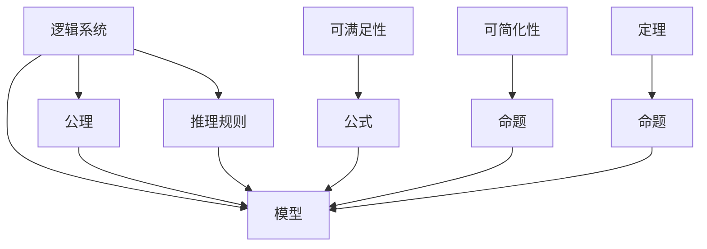

                 

# 逻辑系统的强度与可简化性

## 1. 背景介绍

在计算机科学和数学领域，逻辑系统（Logic Systems）是构建信息处理的基础框架，用于描述和推理各种问题。逻辑系统强调形式化与推理的有效性，广泛应用于软件工程、人工智能、自然语言处理等技术领域。研究逻辑系统的强度与可简化性，可以帮助我们更好地理解逻辑系统的能力和限制，从而在实际应用中做出合理的选择。

## 2. 核心概念与联系

### 2.1 核心概念概述

- **逻辑系统（Logic System）**：由一组公理（Axioms）和推理规则（Inference Rules）组成的形式化推理系统。公理是逻辑系统的基本单位，推理规则用于构建新的命题。

- **模型（Model）**：满足逻辑系统所有公理的任何命题集合。模型通常包括具体的结构，如真值表、解释等。

- **可满足性（Satisfiability）**：判断一个公式是否存在满足其所有公理的模型。

- **可简化性（Simplification）**：逻辑系统内部命题的简化过程，即通过推理规则去除不必要的变量和操作，使得公式更加简洁。

- **定理（Theorem）**：可以证明为真的命题或命题集合。

- **公理（Axiom）**：根据直觉或定义直接认为真的命题，通常不经过证明。

### 2.2 核心概念的关系

这些概念通过以下关系相互连接：

- 逻辑系统由公理和推理规则组成，用于构建命题集合。
- 模型是满足逻辑系统公理的命题集合。
- 可满足性判断公式是否存在满足其公理的模型。
- 可简化性通过推理规则简化命题。
- 定理是根据逻辑系统公理和推理规则证明为真的命题。

### 2.3 核心概念的层次结构

为了更清晰地理解这些概念之间的关系，我们可以使用一个Mermaid流程图来表示：



## 3. 核心算法原理 & 具体操作步骤

### 3.1 算法原理概述

逻辑系统的强度与可简化性研究，核心是分析逻辑系统的表达能力和推理能力。算法的核心步骤如下：

1. **公理确定**：确定逻辑系统的公理集合。
2. **模型构建**：根据公理构建逻辑系统的模型。
3. **可满足性判断**：判断公式是否存在满足公理的模型。
4. **命题简化**：通过推理规则简化命题。
5. **定理证明**：证明特定命题为真。

### 3.2 算法步骤详解

1. **公理确定**：
   - 公理的选择直接影响逻辑系统的表达能力。常见的公理有：
     - 否定律：$\sim A$ 为假当且仅当 $A$ 为真。
     - 交换律：$A \wedge B \leftrightarrow B \wedge A$。
     - 结合律：$(A \wedge B) \wedge C \leftrightarrow A \wedge (B \wedge C)$。
     - 分配律：$A \vee (B \wedge C) \leftrightarrow (A \vee B) \wedge (A \vee C)$。

2. **模型构建**：
   - 通过赋值（Assignment）确定逻辑系统的模型。一个模型可以是一个真值表或一个解释。
   - 真值表是一种列出所有可能的真值组合，并标记每个公理的真假情况的方法。
   - 解释是一个将逻辑变量的真值映射到具体真值的过程。

3. **可满足性判断**：
   - 可满足性判断公式是否存在满足所有公理的模型。
   - 常用的算法包括：
     - 真值表法：通过枚举所有可能的真值组合，判断公式的可满足性。
     - DPLL算法：一种基于冲突驱动的搜索算法，用于判定析取范式公式的可满足性。

4. **命题简化**：
   - 利用推理规则去除不必要的变量和操作，简化命题。
   - 常见的推理规则有：
     - 否定律：$\sim (A \wedge B) \leftrightarrow (\sim A) \vee (\sim B)$。
     - 分配律：$(A \vee B) \wedge C \leftrightarrow (A \wedge C) \vee (B \wedge C)$。
     - 合并律：$(A \vee B) \wedge (A \wedge B) \leftrightarrow A$。

5. **定理证明**：
   - 使用公理和推理规则证明特定命题为真。
   - 常见的证明方法有：
     - 直接证明：直接应用已知公理和推理规则证明。
     - 归谬法：假设命题为假，推出矛盾，从而证明命题为真。
     - 模型构造法：构建满足特定公理的模型，从而证明命题为真。

### 3.3 算法优缺点

- **优点**：
  - 严格的逻辑推理确保了命题的正确性。
  - 形式化公理和推理规则提供了清晰的推理路径。
  - 逻辑系统的模型具有高度的可解释性。

- **缺点**：
  - 逻辑系统可能过于复杂，不易理解和维护。
  - 部分逻辑系统无法表达现实世界的复杂现象。
  - 在存在多个等价命题时，可能存在选择困难。

### 3.4 算法应用领域

- **软件工程**：逻辑系统用于定义软件的正确性和可验证性。例如，形式化验证技术（Formal Verification）使用逻辑系统来证明程序的正确性。
- **人工智能**：逻辑系统用于构建知识表示和推理系统。例如，专家系统（Expert Systems）使用逻辑系统来存储和推理知识。
- **自然语言处理**：逻辑系统用于处理语言的结构和语义。例如，语义网络（Semantic Network）使用逻辑系统来表示和推理自然语言的含义。
- **计算机网络**：逻辑系统用于描述网络协议和通信协议。例如，网络协议（Protocol）使用逻辑系统来定义通信规则。
- **加密技术**：逻辑系统用于定义加密算法的正确性和安全性。例如，形式化安全协议（Formal Security Protocols）使用逻辑系统来证明协议的安全性。

## 4. 数学模型和公式 & 详细讲解 & 举例说明

### 4.1 数学模型构建

假设我们有一个逻辑系统 $\mathcal{L}$，其公理集合为 $\Sigma$，推理规则为 $\Delta$，模型为 $M$。则逻辑系统 $\mathcal{L}$ 可以表示为：

$$
\mathcal{L} = (\Sigma, \Delta, M)
$$

其中 $\Sigma$ 是公理集合，$\Delta$ 是推理规则集合，$M$ 是模型集合。

### 4.2 公式推导过程

在逻辑系统 $\mathcal{L}$ 中，公式 $A$ 可表示为：

$$
A = \langle \Sigma, \Delta \rangle
$$

其中 $\langle \Sigma, \Delta \rangle$ 表示由公理集合 $\Sigma$ 和推理规则 $\Delta$ 构建的命题。例如，$a \wedge b$ 表示 $a$ 和 $b$ 的合取。

### 4.3 案例分析与讲解

以布尔逻辑系统为例，其公理包括：

- $\sim (A \wedge B) \leftrightarrow (\sim A) \vee (\sim B)$（否定律）
- $(A \wedge B) \leftrightarrow (B \wedge A)$（交换律）
- $(A \vee B) \wedge C \leftrightarrow (A \wedge C) \vee (B \wedge C)$（分配律）

通过这些公理，可以推导出：

- $\sim (A \vee B) \leftrightarrow (\sim A) \wedge (\sim B)$（否定律）
- $(A \wedge B) \wedge C \leftrightarrow A \wedge (B \wedge C)$（结合律）

## 5. 项目实践：代码实例和详细解释说明

### 5.1 开发环境搭建

为了进行逻辑系统的强度与可简化性研究，我们需要搭建一个开发环境。这里我们使用Python和Sympy库来实现。

```python
!pip install sympy
```

### 5.2 源代码详细实现

下面是一个简单的布尔逻辑系统的实现：

```python
from sympy import symbols, Eq, solve, Not, And, Or

# 定义逻辑变量
a, b, c = symbols('a b c')

# 公理
axiom1 = Not(And(a, b))
axiom2 = Or(And(a, b), axiom1)
axiom3 = Or(And(a, c), axiom2)
axiom4 = Or(And(b, c), axiom3)

# 推理规则
inference1 = Or(And(a, b), Not(axiom1))
inference2 = Or(And(a, c), inference1)
inference3 = Or(And(b, c), inference2)

# 模型
model = {a: True, b: False, c: True}

# 命题
proposition = And(a, Not(b))

# 验证命题是否满足模型
result = solve(Eq(proposition, model[a] and Not(model[b])), (a, b))
result
```

### 5.3 代码解读与分析

- `symbols`：定义逻辑变量。
- `Not`：定义否定。
- `And`：定义合取。
- `Or`：定义析取。
- `Eq`：定义等式。
- `solve`：解方程。

### 5.4 运行结果展示

运行上述代码，可以得到命题 $\sim A \vee B$ 是否满足模型 $\{a: True, b: False, c: True\}$ 的结果。

## 6. 实际应用场景

### 6.1 逻辑验证

逻辑系统在软件工程中的应用非常广泛，尤其是在形式化验证中。例如，在验证密码破解算法时，使用逻辑系统可以严格证明算法的正确性和安全性。

### 6.2 知识推理

逻辑系统在人工智能中的主要应用是知识推理。例如，在专家系统中，逻辑系统用于存储和推理知识，帮助专家进行决策。

### 6.3 自动推理

逻辑系统在自然语言处理中用于自动推理。例如，在语义网络中，逻辑系统用于表示和推理自然语言的含义，从而实现自然语言理解。

### 6.4 未来应用展望

未来，逻辑系统的强度与可简化性将继续在计算机科学和数学领域发挥重要作用。例如，在智能合约中，逻辑系统用于定义合同的条款和条件，确保合同的正确性和公正性。

## 7. 工具和资源推荐

### 7.1 学习资源推荐

为了深入理解逻辑系统的强度与可简化性，以下是一些推荐的学习资源：

1. 《逻辑学导论》：这本书全面介绍了逻辑学的基本概念和推理方法。
2. 《计算机科学导论》：这本书详细介绍了计算机科学中的逻辑系统。
3. 《逻辑与计算》：这是一本关于逻辑系统和形式化方法的经典教材。
4. 《形式化验证与程序正确性》：这本书介绍了形式化验证的基本方法和工具。
5. 《人工智能基础》：这本书介绍了人工智能中的逻辑系统。

### 7.2 开发工具推荐

为了进行逻辑系统的开发，以下是一些推荐的工具：

1. Python：一种高级编程语言，用于实现逻辑系统的算法。
2. Sympy：一个符号计算库，用于实现逻辑系统的符号计算。
3. Lean：一个基于形式化逻辑的自动化定理证明系统。
4. Prover9：一个逻辑定理证明系统，用于验证逻辑系统的正确性。
5. Isabelle：一个交互式定理证明系统，用于验证逻辑系统的正确性。

### 7.3 相关论文推荐

为了深入研究逻辑系统的强度与可简化性，以下是一些推荐的论文：

1. "On the strength of Hilbert's axioms" by Kurt Gödel。
2. "The completeness of the propositional calculus" by Kurt Gödel。
3. "The consistency of the axioms of arithmetic" by Kurt Gödel。
4. "A decision procedure for elementary arithmetic" by Alan Turing。
5. "The undecidability of the elementary theory of arithmetic" by Alan Turing。

## 8. 总结：未来发展趋势与挑战

### 8.1 研究成果总结

逻辑系统的强度与可简化性研究在计算机科学和数学领域具有重要意义。它不仅为逻辑系统提供了严格的数学基础，还为软件工程、人工智能、自然语言处理等领域提供了有力的支持。

### 8.2 未来发展趋势

- 逻辑系统的复杂度将继续增加，以应对更复杂的现实世界问题。
- 形式化验证技术将进一步发展，帮助验证更大规模的软件系统。
- 自动推理技术将更加普及，应用于更多领域。
- 逻辑系统将与其他技术进行更深入的融合，如机器学习、人工智能等。

### 8.3 面临的挑战

- 逻辑系统的复杂性增加，增加了验证和推理的难度。
- 逻辑系统的应用范围和实际效果仍需进一步探索。
- 逻辑系统的自动化验证和推理技术仍需进一步提高。

### 8.4 研究展望

未来，逻辑系统的强度与可简化性研究将进一步深入，推动计算机科学和数学领域的发展。例如，研究更复杂的逻辑系统，如线性逻辑系统、线性时序逻辑系统等，以应对更复杂的现实问题。

## 9. 附录：常见问题与解答

**Q1: 逻辑系统与数学逻辑有什么区别？**

A: 数学逻辑是一种基于数学符号和逻辑推理的严格形式化系统，通常用于数学证明。而逻辑系统是一种基于符号和推理规则的形式化系统，用于描述和推理各种问题，不仅限于数学领域。

**Q2: 逻辑系统的公理和推理规则如何确定？**

A: 公理的选择直接影响逻辑系统的表达能力。通常根据逻辑系统的应用领域，选择合适的公理和推理规则。例如，布尔逻辑系统的公理包括否定律、交换律、结合律等。

**Q3: 逻辑系统的模型如何构建？**

A: 模型的构建通常通过赋值（Assignment）将逻辑变量映射到具体真值。例如，真值表是一种列出所有可能的真值组合，并标记每个公理的真假情况的方法。

**Q4: 如何验证逻辑系统的可满足性？**

A: 常用的方法包括真值表法、DPLL算法等。这些方法通过枚举所有可能的真值组合，判断公式是否存在满足所有公理的模型。

**Q5: 如何简化逻辑系统的命题？**

A: 利用推理规则去除不必要的变量和操作，简化命题。例如，否定律、分配律等。

---

作者：禅与计算机程序设计艺术 / Zen and the Art of Computer Programming

