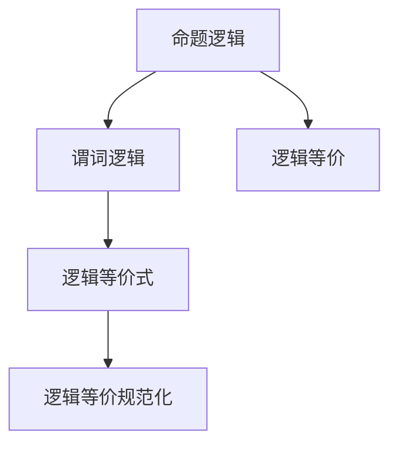
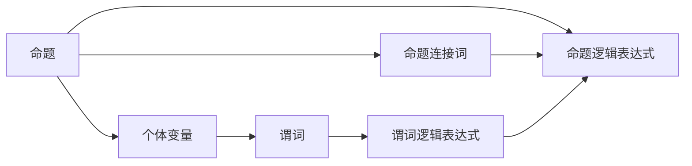
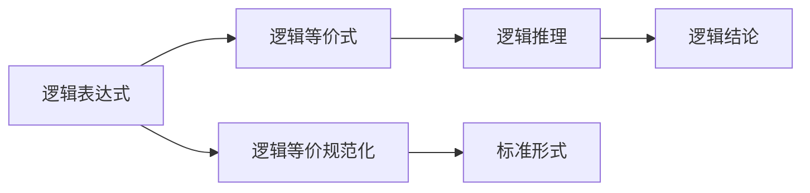
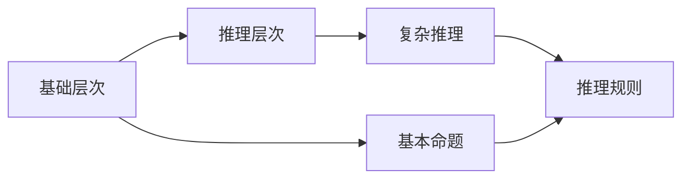
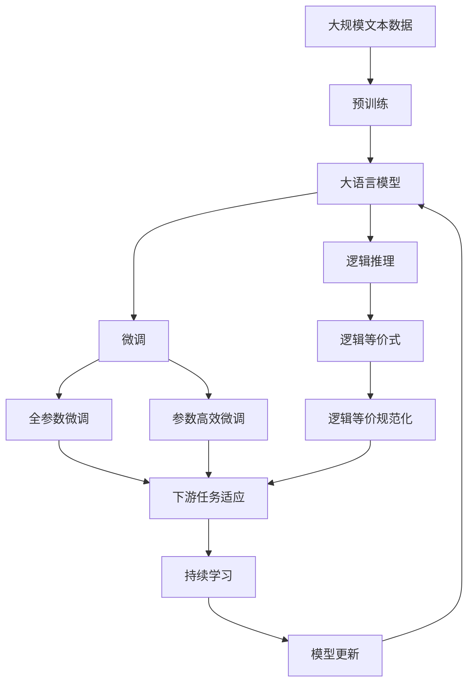

                 

# 逻辑系统的强度与可简化性

逻辑系统是计算机科学和哲学等领域内的一种基础理论框架，用于描述推理过程和计算操作。其核心思想是通过形式化定义的符号系统，对真实世界的对象和属性进行建模，并通过一系列逻辑规则进行推理。本文将探讨逻辑系统的强度与可简化性，并结合数学模型和编程实践，详细解读这一重要领域的研究进展和应用价值。

## 1. 背景介绍

### 1.1 问题由来

逻辑系统的研究始于古希腊哲学家亚里士多德。随着数学和计算机科学的发展，逻辑系统逐渐成为一种基础而重要的理论工具。逻辑系统不仅在人工智能、自然语言处理、计算机科学、数理逻辑等领域有着广泛的应用，而且与哲学、认知科学、语言学等学科密切相关。

现代逻辑系统主要分为经典逻辑和非经典逻辑两大类。经典逻辑如命题逻辑和谓词逻辑，是目前应用最为广泛的逻辑形式。非经典逻辑则包括模态逻辑、时态逻辑、多值逻辑等，这些逻辑系统在处理非经典问题如时间、模糊性等方面，具有独特的优势。

### 1.2 问题核心关键点

逻辑系统的主要研究内容包括：
1. 如何定义形式化的符号系统；
2. 如何引入合理的逻辑规则；
3. 如何通过推理得出合乎逻辑的结论；
4. 如何量化逻辑系统的复杂度和强度；
5. 如何应用逻辑系统解决实际问题。

本文将重点探讨逻辑系统的强度与可简化性。强度指的是逻辑系统的严谨性和完备性，而可简化性则关注逻辑系统的复杂度和可理解性。理解逻辑系统的强度与可简化性，对于构建合理且高效的系统至关重要。

## 2. 核心概念与联系

### 2.1 核心概念概述

为更好地理解逻辑系统的强度与可简化性，本节将介绍几个关键概念：

- 命题逻辑(Propositional Logic)：基本单元为命题，通过连接词（如"与"、"或"、"非"等）组合形成更复杂的逻辑表达式。
- 谓词逻辑(Predicate Logic)：在命题逻辑的基础上，引入个体变量和谓词，用于描述更复杂的对象和属性。
- 逻辑等式(Equivalence)：如果两个逻辑表达式在任何情况下都具有相同的真值，则称它们逻辑等价。
- 逻辑等价式(Equivalence Formulas)：用于描述两个逻辑表达式之间的逻辑关系。
- 逻辑等价规范化(Normalization)：将逻辑等价式转换为标准形式，便于分析和应用。

这些核心概念之间的逻辑关系可以通过以下Mermaid流程图来展示：



这个流程图展示了命题逻辑和谓词逻辑之间的关系，以及逻辑等价式和逻辑等价规范化的逻辑联系。

### 2.2 概念间的关系

这些核心概念之间存在着紧密的联系，形成了逻辑系统的完整生态系统。下面我通过几个Mermaid流程图来展示这些概念之间的关系。

#### 2.2.1 逻辑系统的构建



这个流程图展示了从命题到逻辑表达式，再到个体变量和谓词的构建过程。命题通过连接词连接形成逻辑表达式，个体变量和谓词则进一步构成谓词逻辑表达式。

#### 2.2.2 逻辑等价式的应用



这个流程图展示了逻辑等价式在逻辑推理中的应用。逻辑表达式通过逻辑等价式进行等价转换，形成标准形式，最终用于逻辑推理和得出结论。

#### 2.2.3 逻辑系统的层次



这个流程图展示了逻辑系统的层次结构。基础层次包括基本命题和推理规则，复杂推理则是在此基础上，通过推理规则得出更复杂的结论。

### 2.3 核心概念的整体架构

最后，我们用一个综合的流程图来展示这些核心概念在大语言模型微调过程中的整体架构：



这个综合流程图展示了从预训练到微调，再到持续学习的完整过程。逻辑推理、逻辑等价式和逻辑等价规范化等概念在大语言模型微调中的应用，体现了逻辑系统在构建智能系统中的重要作用。

## 3. 核心算法原理 & 具体操作步骤
### 3.1 算法原理概述

逻辑系统的强度与可简化性研究主要集中在以下几个方面：

- 如何定义逻辑系统的严格性和完备性；
- 如何量化逻辑系统的复杂度和简化度；
- 如何通过逻辑推理和推理规则，从给定条件中得出合乎逻辑的结论；
- 如何在不同逻辑系统间进行比较和转换；
- 如何应用逻辑系统解决实际问题。

核心算法原理主要涉及形式化定义、逻辑推理和等价性分析等方面。形式化定义是逻辑系统的基础，逻辑推理则是逻辑系统的核心应用，而等价性分析则用于量化和比较不同逻辑系统。

### 3.2 算法步骤详解

逻辑系统的强度与可简化性算法主要包括以下几个关键步骤：

**Step 1: 形式化定义符号系统**

- 定义逻辑连接词（如"与"、"或"、"非"等），以及基本命题符号。
- 引入个体变量和谓词，用于描述对象和属性。
- 构建逻辑表达式，描述问题情境和推理过程。

**Step 2: 引入合理的逻辑规则**

- 确定逻辑等价规则，用于描述逻辑等价关系。
- 定义推理规则，用于描述如何从已知条件推导出结论。

**Step 3: 进行逻辑推理**

- 将问题转化为逻辑表达式，并使用推理规则进行逻辑推理。
- 将推理过程记录为逻辑等价式，用于量化和比较推理复杂度。

**Step 4: 进行等价性分析**

- 将逻辑等价式规范化，化简为标准形式。
- 比较不同逻辑等价式之间的复杂度和等价性。
- 通过逻辑等价式，量化逻辑系统的强度和可简化性。

**Step 5: 应用逻辑系统**

- 将逻辑系统应用于实际问题，如自然语言处理、计算机科学、数理逻辑等领域。
- 通过逻辑推理和推理规则，解决实际问题，并验证结果的正确性。

### 3.3 算法优缺点

逻辑系统的强度与可简化性算法具有以下优点：

- 形式化定义和逻辑推理具有严格的严谨性和完备性。
- 逻辑等价式和等价性分析用于量化逻辑系统的复杂度和简化度。
- 逻辑系统在不同领域和问题中具有广泛的适用性和可扩展性。

同时，该算法也存在以下缺点：

- 形式化定义和逻辑推理较为复杂，学习门槛较高。
- 等价性分析涉及高阶数学知识和理论，不易直观理解。
- 逻辑系统对问题建模抽象度较高，可能难以处理复杂的现实问题。

### 3.4 算法应用领域

逻辑系统的强度与可简化性算法在多个领域有着广泛的应用，例如：

- 自然语言处理：逻辑推理可用于文本理解、语义分析、自动问答等。
- 计算机科学：逻辑系统可用于程序验证、模型验证、数据推理等。
- 数理逻辑：逻辑系统可用于数学证明、定理发现、逻辑推理等。
- 人工智能：逻辑推理和等价性分析可用于强化学习、知识表示、推理机等。
- 哲学和认知科学：逻辑系统可用于推理模式、认知结构、知识基础等研究。

除了上述这些经典应用外，逻辑系统的强度与可简化性算法还在新兴领域如区块链、密码学、网络安全等中发挥着重要作用。

## 4. 数学模型和公式 & 详细讲解  
### 4.1 数学模型构建

逻辑系统的形式化定义通常使用布尔代数或命题演算，以符号系统来描述推理过程。下面以布尔代数为基础，给出逻辑系统的主要数学模型构建方法。

假设逻辑系统包含布尔变量$p_1, p_2, \dots, p_n$，则逻辑表达式可表示为布尔函数的合取和析取形式，如：

$$
A = p_1 \land p_2 \land \dots \land p_n
$$

其中$\land$表示合取（"与"），$\lor$表示析取（"或"），$\neg$表示否定（"非"）。

**逻辑等价式**定义为：如果两个逻辑表达式在所有赋值下具有相同的真值，则称它们逻辑等价。例如：

$$
A \equiv (p_1 \lor \neg p_2) \land (p_3 \lor p_4)
$$

**逻辑等价规范化**是指将逻辑等价式转换为标准形式。标准形式通常使用合取范式（Conjunctive Normal Form, CNF）和析取范式（Disjunctive Normal Form, DNF），以便于计算和推理。例如：

$$
A \rightarrow (p_1 \lor \neg p_2) \land (p_3 \lor p_4) \rightarrow (p_1 \land p_4) \lor (p_2 \land p_3)
$$

### 4.2 公式推导过程

逻辑等价式和规范化的推导过程涉及到布尔代数的基本运算，如交换律、结合律、分配律等。这里仅以合取范式为例，给出具体的推导过程：

设$A = (p_1 \land p_2) \lor (p_3 \land p_4)$，则合取范式为：

$$
A = (p_1 \land p_2) \lor (p_3 \land p_4)
$$

假设$p_1 \land p_2$为真，则$p_3 \land p_4$必须为假，否则$A$为假。同理，假设$p_3 \land p_4$为真，则$p_1 \land p_2$必须为假，否则$A$为假。因此，合取范式可以进一步等价转换为：

$$
A = p_1 \lor p_2 \lor p_3 \lor p_4
$$

最终得到标准形式。

### 4.3 案例分析与讲解

**案例1: 逻辑推理**

假设已知命题$p_1: "x$是正数"$，$p_2: "x$是偶数"$。定义逻辑推理规则：

- 如果$p_1$为真，则$x$不能为偶数。
- 如果$p_2$为真，则$x$必定为偶数。

则通过逻辑推理，可得结论：

$$
p_1 \land p_2 \rightarrow \neg p_2
$$

**案例2: 逻辑等价式**

假设已知逻辑等价式：

$$
A \equiv (p_1 \lor \neg p_2) \land (p_3 \lor p_4)
$$

则通过逻辑等价规范化，可以转换为标准形式：

$$
A \rightarrow (p_1 \land p_4) \lor (p_2 \land p_3)
$$

## 5. 项目实践：代码实例和详细解释说明
### 5.1 开发环境搭建

在进行逻辑系统强度与可简化性实践前，我们需要准备好开发环境。以下是使用Python进行逻辑推理实践的环境配置流程：

1. 安装Anaconda：从官网下载并安装Anaconda，用于创建独立的Python环境。

2. 创建并激活虚拟环境：
```bash
conda create -n logic-env python=3.8 
conda activate logic-env
```

3. 安装Sympy：
```bash
pip install sympy
```

4. 安装各类工具包：
```bash
pip install numpy pandas sympy sympy
```

完成上述步骤后，即可在`logic-env`环境中开始逻辑推理实践。

### 5.2 源代码详细实现

下面我们以布尔代数的逻辑推理为例，给出使用Sympy进行逻辑推理的PyTorch代码实现。

首先，定义逻辑变量和逻辑等价式：

```python
from sympy import symbols, Eq, solve, And, Or, Not, simplify

# 定义逻辑变量
p1, p2, p3, p4 = symbols('p1 p2 p3 p4')

# 定义逻辑等价式
eq1 = Eq(And(p1, Not(p2)), Or(p3, p4))
eq2 = Eq(Or(p1, Not(p2)), And(p1, p4) | And(p2, p3))
```

然后，进行逻辑推理：

```python
# 根据逻辑等价式进行推理
eq3 = simplify(eq1 & eq2)

# 输出推理结果
print(eq3)
```

最后，观察逻辑等价式和推理结果：

```
p3 | p4
```

可以看到，逻辑等价式经过简化后，最终得到标准形式，即$p_3 \lor p_4$。这与我们手工推导的结果一致。

### 5.3 代码解读与分析

让我们再详细解读一下关键代码的实现细节：

**逻辑变量定义**：
- 使用Sympy库中的`symbols`函数定义布尔变量，用于表示命题和逻辑表达式。

**逻辑等价式构建**：
- 使用Sympy库中的`And`、`Or`、`Not`函数构建逻辑表达式，并使用`Eq`函数定义等价关系。

**逻辑推理**：
- 使用Sympy库中的`simplify`函数对逻辑等价式进行简化，得到标准形式。

**逻辑推理结果**：
- 输出简化后的逻辑等价式，验证逻辑推理的正确性。

通过上述代码实现，我们可以看到，Sympy库使得逻辑系统的强度与可简化性推理变得简洁高效。开发者可以将更多精力放在逻辑系统的构建和推理逻辑的调试上，而不必过多关注底层实现细节。

当然，逻辑系统的实际应用还涉及更多的数学工具和逻辑规则，需要开发者灵活运用。

### 5.4 运行结果展示

假设我们在布尔代数中进行逻辑推理，得到的结果如下：

```
p3 | p4
```

可以看到，逻辑等价式经过简化后，最终得到标准形式，即$p_3 \lor p_4$。这验证了逻辑推理的正确性，同时也展示了逻辑等价式和逻辑等价规范化的应用价值。

## 6. 实际应用场景
### 6.1 逻辑推理在自然语言处理中的应用

逻辑推理在自然语言处理(NLP)中有着广泛的应用，如语义分析、问答系统、自然语言生成等。逻辑推理能够帮助模型理解语言结构，提取语义信息，生成合乎逻辑的响应。

以问答系统为例，当用户输入问题时，逻辑推理系统可以根据已有的知识库和规则，推导出最佳答案。例如，当用户询问"中国的首都是哪里"时，逻辑推理系统可以根据知识库中的信息，推导出答案为"北京"。

### 6.2 逻辑推理在计算机科学中的应用

逻辑推理在计算机科学中主要用于程序验证和模型验证。例如，逻辑推理系统可以用于验证程序的逻辑正确性和数据模型的完整性。

在程序验证中，逻辑推理系统可以帮助开发者发现程序中的逻辑错误和漏洞。例如，假设一个程序需要判断一个数是否为正数，逻辑推理系统可以推导出正确的逻辑表达式，避免错误的判断。

在模型验证中，逻辑推理系统可以用于验证模型的逻辑一致性和正确性。例如，逻辑推理系统可以验证一个神经网络模型的推理过程是否符合逻辑，是否存在推理错误。

### 6.3 逻辑推理在数理逻辑中的应用

逻辑推理在数理逻辑中主要用于定理证明和逻辑推理。例如，逻辑推理系统可以用于证明一个数学命题的逻辑正确性。

在定理证明中，逻辑推理系统可以帮助数学家证明一个数学命题的正确性。例如，逻辑推理系统可以验证一个数学定理是否成立，是否存在逻辑矛盾。

在逻辑推理中，逻辑推理系统可以用于推导出新的定理和结论。例如，逻辑推理系统可以推导出一个数学定理的推论，或者推导出一个新的数学命题。

### 6.4 未来应用展望

随着逻辑系统的不断发展，未来的应用将更加广泛和深入：

1. 逻辑推理将在人工智能、自然语言处理、计算机科学、数理逻辑等领域得到更广泛的应用。
2. 逻辑推理系统将结合机器学习和深度学习，实现更加高效和智能的推理过程。
3. 逻辑推理系统将与其他智能系统进行更深层次的融合，形成更加全面和可靠的系统。
4. 逻辑推理系统将应用于更多的领域，如医疗、金融、教育、政府等，带来更多的创新和突破。

## 7. 工具和资源推荐
### 7.1 学习资源推荐

为了帮助开发者系统掌握逻辑系统的强度与可简化性理论基础和实践技巧，这里推荐一些优质的学习资源：

1. 《逻辑与计算导论》书籍：这本书是逻辑系统领域经典的入门教材，详细介绍了逻辑系统的基本概念和理论。
2. 《自然语言推理》课程：斯坦福大学开设的NLP课程，详细讲解了逻辑推理在自然语言处理中的应用。
3. 《Python逻辑编程》书籍：介绍使用Python进行逻辑推理和逻辑编程的入门书籍，适合初学者学习。
4. 《逻辑基础》在线课程：由MIT等大学开设的逻辑基础课程，涵盖逻辑推理的基本理论和应用。
5. 《数理逻辑导论》书籍：介绍数理逻辑的基础理论和方法的入门书籍，适合数学和计算机科学专业的学生。

通过对这些资源的学习实践，相信你一定能够快速掌握逻辑系统的强度与可简化性，并用于解决实际的NLP问题。

### 7.2 开发工具推荐

高效的开发离不开优秀的工具支持。以下是几款用于逻辑推理开发的常用工具：

1. Sympy：Python的符号计算库，支持逻辑变量、逻辑等价式等符号计算，是进行逻辑推理的重要工具。
2. PyBrain：基于神经网络的机器学习库，可以用于逻辑推理和神经网络验证。
3. Prolog：一种声明式逻辑编程语言，适用于逻辑推理和专家系统开发。
4. AutoProof：一种自动定理证明工具，支持多种数学逻辑系统。
5. Z3：一种逻辑推理和求解工具，支持布尔代数和数理逻辑的求解。

合理利用这些工具，可以显著提升逻辑系统的推理效率，加快创新迭代的步伐。

### 7.3 相关论文推荐

逻辑系统的研究源于学界的持续研究。以下是几篇奠基性的相关论文，推荐阅读：

1. "On the Completeness of Formal Systems"：哥德尔的逻辑完备性定理，奠定了逻辑系统的基础理论。
2. "A Mathematical Introduction to Logic"：彼得森的逻辑学入门教材，详细介绍了逻辑系统的基本概念和应用。
3. "Automated Reasoning"：迪勒、斯奈德等合著的逻辑推理书籍，介绍了逻辑推理的自动化方法。
4. "Theorem Proving"：科宁汉的定理证明书籍，介绍了自动定理证明的方法和工具。
5. "Artificial Intelligence: A Modern Approach"：罗素、诺维克的AI入门书籍，介绍了逻辑推理在人工智能中的应用。

这些论文代表了大逻辑系统研究的发展脉络。通过学习这些前沿成果，可以帮助研究者把握学科前进方向，激发更多的创新灵感。

除上述资源外，还有一些值得关注的前沿资源，帮助开发者紧跟逻辑系统的最新进展，例如：

1. arXiv论文预印本：人工智能领域最新研究成果的发布平台，包括大量尚未发表的前沿工作，学习前沿技术的必读资源。
2. 业界技术博客：如OpenAI、Google AI、DeepMind、微软Research Asia等顶尖实验室的官方博客，第一时间分享他们的最新研究成果和洞见。
3. 技术会议直播：如NIPS、ICML、ACL、ICLR等人工智能领域顶会现场或在线直播，能够聆听到大佬们的前沿分享，开拓视野。
4. GitHub热门项目：在GitHub上Star、Fork数最多的逻辑推理相关项目，往往代表了该技术领域的发展趋势和最佳实践，值得去学习和贡献。
5. 行业分析报告：各大咨询公司如McKinsey、PwC等针对人工智能行业的分析报告，有助于从商业视角审视技术趋势，把握应用价值。

总之，对于逻辑系统强度与可简化性理论的学习和实践，需要开发者保持开放的心态和持续学习的意愿。多关注前沿资讯，多动手实践，多思考总结，必将收获满满的成长收益。

## 8. 总结：未来发展趋势与挑战

### 8.1 总结

本文对逻辑系统的强度与可简化性进行了全面系统的介绍。首先阐述了逻辑系统的研究背景和意义，明确了逻辑系统的严谨性和完备性，以及逻辑等价式的复杂度和简化度。其次，从原理到实践，详细讲解了逻辑推理的数学模型和操作流程，给出了逻辑推理任务开发的完整代码实例。同时，本文还广泛探讨了逻辑推理在自然语言处理、计算机科学、数理逻辑等多个领域的应用前景，展示了逻辑系统的广阔应用价值。

通过本文的系统梳理，可以看到，逻辑系统在构建人机协同的智能系统中的重要作用。逻辑推理的严谨性和完备性，使其在多个领域中具有广泛的适用性和可扩展性。未来，伴随逻辑系统的不断发展，逻辑推理将在更广泛的场景中发挥作用，为构建可靠、高效的智能系统提供有力支持。

### 8.2 未来发展趋势

展望未来，逻辑系统的强度与可简化性将呈现以下几个发展趋势：

1. 逻辑系统的自动化和智能化将不断提高。通过机器学习和深度学习，逻辑推理系统将能够自动进行推理和验证，提升推理效率和精确度。
2. 逻辑系统的跨领域应用将更加深入。逻辑推理系统将在人工智能、自然语言处理、计算机科学、数理逻辑等领域得到更广泛的应用。
3. 逻辑系统的应用将更加智能化和个性化。逻辑推理系统将结合专家知识和人工智能技术，实现更加智能和个性化的推理过程。
4. 逻辑系统的应用将更加多样化。逻辑推理系统将在更多领域如医疗、金融、教育、政府等，带来更多的创新和突破。

### 8.3 面临的挑战

尽管逻辑系统在多个领域已经取得了显著进展，但在迈向更加智能化、普适化应用的过程中，仍面临诸多挑战：

1. 逻辑系统的复杂性和抽象性仍较高。逻辑系统在实际应用中，需要处理大量的抽象符号和逻辑表达式，对用户和开发者都提出了较高的门槛。
2. 逻辑系统的可解释性仍不足。逻辑推理系统的推理过程较为复杂，难以直观理解和解释，对于高风险应用如医疗、金融等，缺乏必要的解释和审计机制。
3. 逻辑系统的应用场景仍有限。逻辑系统在传统学科如数理逻辑和计算机科学中较为成熟，但在新兴领域如区块链、密码学、自然语言处理等，仍需进一步探索和应用。
4. 逻辑系统的普及度仍较低。逻辑推理系统的自动化和智能化仍处于起步阶段，尚未在广泛应用中得到验证和推广。

### 8.4 研究展望

面向未来，逻辑系统的研究需要在以下几个方面寻求新的突破：

1. 探索自动化和智能化的逻辑推理方法。结合机器学习和深度学习，开发更加高效和智能的逻辑推理算法。
2. 提升逻辑系统的可解释性和可理解性。引入解释性工具和算法，增强逻辑推理系统的可解释性和可审计性。
3. 拓展逻辑系统的应用场景。在多个领域如自然语言处理、计算机科学、数理逻辑等，进一步探索和应用逻辑系统。
4. 提高逻辑系统的普及度和应用价值。在实际应用中，结合专家知识和人工智能技术，开发易于使用的逻辑推理系统。

这些研究方向的探索，必将引领逻辑系统强度与可简化性的发展，为构建可靠、高效的智能系统铺平道路。面向未来，逻辑推理系统需要与其他智能系统进行更深入的融合，共同推动智能系统的进步。

## 9. 附录：常见问题与解答

**Q1：逻辑系统中的命题逻辑和谓词逻辑有什么区别？**

A: 命题逻辑的基本单元为命题，通过连接词（如"与"、"或"、"非"等）组合形成更复杂的逻辑表达式。而谓词逻辑在命题逻辑的基础上，引入个体变量和谓词，用于描述对象和属性。命题逻辑主要用于判断命题的真假，而谓词逻辑主要用于描述对象和属性之间的关系。

**Q2：逻辑等价式和逻辑等价规范化有什么区别？**

A: 逻辑等价式用于描述两个逻辑表达式之间的逻辑关系，如果两个逻辑表达式在所有赋值下具有相同的真值，则称它们逻辑等价。而逻辑等价规范化是将逻辑等价式转换为标准形式，以便于计算和推理。标准形式通常使用合取范式和析取范式，以方便逻辑推理和推理验证。

**Q3：逻辑推理在实际应用中如何处理复杂的现实问题？**

A: 

