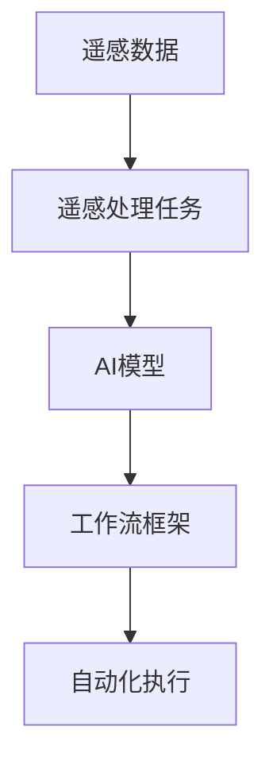

                 

# 遥感数据处理的AI代理工作流技术

在遥感数据处理领域，传统的流程通常是使用复杂的软件工具链进行数据处理、分析、存储和共享。这些工具往往需要大量的人力资源，容易出错，且难以集成到其他工作流程中。随着人工智能技术的快速发展，越来越多的研究者和产业界人士开始探索利用AI技术来加速和自动化遥感数据处理工作流。本文将详细探讨遥感数据处理的AI代理工作流技术，包括其核心概念、算法原理、操作步骤、实际应用场景以及未来发展趋势与挑战。

## 1. 背景介绍

### 1.1 问题由来

遥感数据处理是遥感技术中的一个关键环节，主要涉及数据的预处理、特征提取、分类和识别等任务。传统的遥感数据处理依赖于人工操作和专用软件工具，如ERDAS、ENVI、ArcGIS等。然而，这些工具通常功能冗余，用户需要耗费大量时间进行学习，并且难以与其他数据处理和分析工作流集成。此外，遥感数据处理过程中容易出现人为误差和效率低下等问题。

为了解决这些问题，研究者们开始探索利用人工智能技术来自动化遥感数据处理流程。AI代理工作流技术通过将数据处理任务转化为可自动化执行的AI模型，能够显著提高遥感数据处理的效率和精度。

### 1.2 问题核心关键点

遥感数据处理的AI代理工作流技术主要涉及以下几个核心问题：

- 如何构建能够自动化执行数据处理任务的AI模型？
- 如何集成AI模型到遥感数据处理工作流中？
- 如何确保AI模型的精度和可靠性？
- 如何处理遥感数据处理过程中可能出现的错误和异常？

这些问题需要通过构建高效、可靠的AI模型，以及灵活、易用的工作流框架来解决。

### 1.3 问题研究意义

遥感数据处理的AI代理工作流技术具有重要研究意义，主要体现在以下几个方面：

- 提高遥感数据处理的效率和精度，减少人工操作的时间和成本。
- 集成到现有的遥感数据处理工作流中，提高工作效率和系统灵活性。
- 利用AI模型处理大规模遥感数据，实现自动化的、大规模的数据分析和识别。
- 为遥感技术在其他领域的集成应用提供参考，推动遥感技术的广泛应用。

## 2. 核心概念与联系

### 2.1 核心概念概述

在遥感数据处理的AI代理工作流技术中，涉及多个关键概念，包括遥感数据、遥感处理任务、AI模型、工作流框架和自动化执行等。

- 遥感数据：包括遥感卫星获取的影像、波段数据等。
- 遥感处理任务：包括数据预处理、特征提取、分类、识别等任务。
- AI模型：用于自动化执行遥感处理任务的人工智能模型。
- 工作流框架：用于集成AI模型到遥感数据处理工作流中的框架。
- 自动化执行：指AI模型自动执行遥感处理任务，无需人工干预。

### 2.2 概念间的关系

这些核心概念之间的联系可以用以下Mermaid流程图表示：



该流程图展示了遥感数据处理AI代理工作流的整体流程：遥感数据首先进入遥感处理任务，然后通过AI模型进行自动化执行，最终集成到工作流框架中。

## 3. 核心算法原理 & 具体操作步骤

### 3.1 算法原理概述

遥感数据处理的AI代理工作流技术的核心算法原理是通过构建AI模型来自动化执行遥感处理任务。其主要流程如下：

1. 收集遥感数据并标注数据，构建数据集。
2. 训练AI模型，使其能够自动执行遥感处理任务。
3. 集成AI模型到遥感数据处理工作流中，实现自动化执行。

### 3.2 算法步骤详解

#### 3.2.1 数据收集与标注

数据收集和标注是构建AI模型的第一步。遥感数据通常需要包含时间、空间、波段等属性，因此需要收集大量高分辨率的遥感影像。标注则是指给定遥感数据，人工标注出需要处理的目标，如植被、水体、建筑物等。

#### 3.2.2 模型训练

模型训练的目的是构建能够自动化执行遥感处理任务的AI模型。常用的AI模型包括卷积神经网络（CNN）、递归神经网络（RNN）、深度学习（DL）等。训练过程中，需要选择合适的优化算法（如Adam、SGD等）和损失函数（如交叉熵、均方误差等）。

#### 3.2.3 工作流集成

工作流框架通常采用可视化工具，如Jupyter Notebook、Airflow等。通过将AI模型集成到工作流框架中，可以方便地调度和执行AI模型，实现自动化执行。

### 3.3 算法优缺点

遥感数据处理的AI代理工作流技术的优点包括：

- 自动化执行：减少了人工操作的成本和时间，提高了工作效率。
- 高精度：利用AI模型的自动化执行，能够提高遥感数据处理的精度。
- 灵活性：可以方便地集成到现有的遥感数据处理工作流中。

缺点包括：

- 数据质量依赖：AI模型的性能高度依赖于标注数据的质量。
- 模型构建复杂：构建高效、可靠的AI模型需要专业知识和技术支持。
- 成本较高：需要大量的计算资源和时间进行模型训练和调试。

### 3.4 算法应用领域

遥感数据处理的AI代理工作流技术可以应用于多个领域，包括：

- 农业：用于监测农田、作物生长、病虫害等情况。
- 环境监测：用于监测环境污染、森林火灾等事件。
- 城市规划：用于监测城市建设、土地利用等情况。
- 地质灾害监测：用于监测地震、滑坡等地质灾害。

## 4. 数学模型和公式 & 详细讲解  
### 4.1 数学模型构建

遥感数据处理的AI代理工作流技术通常使用深度学习模型来进行构建。以卷积神经网络（CNN）为例，其数学模型构建如下：

- 输入层：遥感影像数据。
- 卷积层：用于提取遥感影像的特征。
- 池化层：用于降维和特征选择。
- 全连接层：用于分类和识别。
- 输出层：输出分类或识别结果。

### 4.2 公式推导过程

以CNN为例，其公式推导过程如下：

设输入为 $x$，输出为 $y$，卷积核为 $k$，卷积操作为 $C$，则有：

$$ y = C(x,k) $$

其中，$C$ 为卷积操作，$k$ 为卷积核。卷积操作的公式如下：

$$ C(x,k) = \sum_{i=0}^{n-1} \sum_{j=0}^{m-1} k_{ij} \cdot x_{i,j} $$

其中，$n$ 和 $m$ 分别为卷积核的大小。

### 4.3 案例分析与讲解

以遥感影像分类为例，使用CNN进行分类任务。首先，将遥感影像数据作为输入，通过卷积层提取特征，通过池化层进行特征降维和选择，最后通过全连接层进行分类。输出层的公式如下：

$$ y = sigmoid(W*x + b) $$

其中，$W$ 和 $b$ 分别为全连接层的权重和偏置。

## 5. 项目实践：代码实例和详细解释说明

### 5.1 开发环境搭建

在开发遥感数据处理的AI代理工作流技术时，需要搭建Python开发环境，包括Python、TensorFlow、Keras等库。具体步骤如下：

1. 安装Anaconda，创建虚拟环境。
2. 安装Python、TensorFlow、Keras等库。
3. 配置Jupyter Notebook环境。

### 5.2 源代码详细实现

以下是一个使用TensorFlow和Keras库进行遥感影像分类的代码实现：

```python
import tensorflow as tf
from tensorflow.keras import layers, models

# 定义卷积神经网络模型
model = models.Sequential()
model.add(layers.Conv2D(32, (3, 3), activation='relu', input_shape=(256, 256, 3)))
model.add(layers.MaxPooling2D((2, 2)))
model.add(layers.Conv2D(64, (3, 3), activation='relu'))
model.add(layers.MaxPooling2D((2, 2)))
model.add(layers.Conv2D(64, (3, 3), activation='relu'))
model.add(layers.Flatten())
model.add(layers.Dense(64, activation='relu'))
model.add(layers.Dense(2, activation='softmax'))

# 编译模型
model.compile(optimizer='adam', loss='categorical_crossentropy', metrics=['accuracy'])

# 训练模型
model.fit(X_train, y_train, epochs=10, validation_data=(X_test, y_test))
```

### 5.3 代码解读与分析

上述代码中，首先定义了一个简单的卷积神经网络模型，包括卷积层、池化层、全连接层等。然后编译模型，选择Adam优化器和交叉熵损失函数。最后使用训练数据进行模型训练，并在验证集上进行性能评估。

### 5.4 运行结果展示

训练完成后，可以计算模型在测试集上的准确率：

```python
test_loss, test_acc = model.evaluate(X_test, y_test, verbose=2)
print(f'Test accuracy: {test_acc}')
```

## 6. 实际应用场景

### 6.1 农业应用

遥感数据处理的AI代理工作流技术在农业领域有着广泛的应用。例如，通过监测农田植被的生长情况，可以及时发现病虫害、缺水等问题，并采取相应的措施。

### 6.2 环境监测

遥感数据处理的AI代理工作流技术可以用于环境监测，如监测森林火灾、水体污染等事件。通过实时监测和分析遥感数据，可以及时发现环境问题，并采取相应的措施。

### 6.3 城市规划

遥感数据处理的AI代理工作流技术可以用于城市规划，如监测城市建设、土地利用等情况。通过分析遥感数据，可以评估城市规划的合理性，优化城市资源配置。

### 6.4 地质灾害监测

遥感数据处理的AI代理工作流技术可以用于地质灾害监测，如监测地震、滑坡等地质灾害。通过实时监测和分析遥感数据，可以及时发现地质灾害，并采取相应的措施。

## 7. 工具和资源推荐

### 7.1 学习资源推荐

1. 《深度学习》（Ian Goodfellow等著）：系统介绍深度学习的理论和应用，包括卷积神经网络、递归神经网络等。
2. TensorFlow官方文档：提供详细的TensorFlow库使用指南，包括模型构建、训练和评估等。
3. Keras官方文档：提供详细的Keras库使用指南，包括模型构建和训练等。
4. Jupyter Notebook官方文档：提供详细的Jupyter Notebook使用指南，包括环境搭建和数据处理等。

### 7.2 开发工具推荐

1. Python：作为遥感数据处理的常用编程语言，Python提供了丰富的数据处理和科学计算库。
2. TensorFlow：作为深度学习框架，TensorFlow提供了强大的模型构建和训练功能。
3. Keras：作为高级深度学习库，Keras提供了简单易用的API，方便构建和训练模型。
4. Jupyter Notebook：作为交互式编程环境，Jupyter Notebook方便进行模型调试和分析。

### 7.3 相关论文推荐

1. "Deep Learning for Earth Observation Applications"（Deep Learning for Earth Observation Applications）：介绍遥感数据处理中的深度学习方法。
2. "A Survey of Computer Vision and Pattern Recognition Technologies in Geographic Information Systems"（A Survey of Computer Vision and Pattern Recognition Technologies in Geographic Information Systems）：介绍遥感数据处理中的计算机视觉技术。
3. "Automated Geospatial Analysis Using Deep Learning Models"（Automated Geospatial Analysis Using Deep Learning Models）：介绍遥感数据处理中的自动化分析方法。

## 8. 总结：未来发展趋势与挑战

### 8.1 研究成果总结

遥感数据处理的AI代理工作流技术已经在多个领域取得了显著的进展，但仍面临诸多挑战：

- 数据质量和标注数据：高质量的数据和标注数据是构建AI模型的基础。
- 模型复杂性和成本：构建高效、可靠的AI模型需要大量的计算资源和时间。
- 自动化执行和可靠性：自动化执行过程中可能会出现错误和异常，需要有效的异常处理机制。

### 8.2 未来发展趋势

遥感数据处理的AI代理工作流技术的未来发展趋势包括：

- 模型自动化构建：通过自动化构建模型，减少人工干预，提高模型的效率和精度。
- 多模态数据融合：利用多模态数据（如遥感数据、气象数据等）进行综合分析，提高模型的应用范围和精度。
- 实时数据处理：通过实时处理遥感数据，提高模型的实时性，满足实际应用的需求。

### 8.3 面临的挑战

遥感数据处理的AI代理工作流技术面临的挑战包括：

- 数据质量和标注数据：高质量的数据和标注数据是构建AI模型的基础，但获取这些数据需要大量的时间和成本。
- 模型复杂性和成本：构建高效、可靠的AI模型需要大量的计算资源和时间，但模型的成本较高。
- 自动化执行和可靠性：自动化执行过程中可能会出现错误和异常，需要有效的异常处理机制。

### 8.4 研究展望

遥感数据处理的AI代理工作流技术的研究展望包括：

- 自动化构建模型：通过自动化构建模型，减少人工干预，提高模型的效率和精度。
- 多模态数据融合：利用多模态数据（如遥感数据、气象数据等）进行综合分析，提高模型的应用范围和精度。
- 实时数据处理：通过实时处理遥感数据，提高模型的实时性，满足实际应用的需求。

## 9. 附录：常见问题与解答

**Q1：遥感数据处理的AI代理工作流技术是否适用于所有遥感应用？**

A: 遥感数据处理的AI代理工作流技术在大多数遥感应用中都可以使用，但需要根据具体应用场景进行适当的调整和优化。

**Q2：如何使用遥感数据处理的AI代理工作流技术进行实时数据处理？**

A: 利用分布式计算框架（如Hadoop、Spark等）进行实时数据处理，可以实现对遥感数据的实时分析和监测。

**Q3：遥感数据处理的AI代理工作流技术是否适用于大规模数据处理？**

A: 遥感数据处理的AI代理工作流技术适用于大规模数据处理，但在处理过程中需要注意数据质量和模型优化，以确保处理效果。

**Q4：遥感数据处理的AI代理工作流技术是否适用于多模态数据融合？**

A: 遥感数据处理的AI代理工作流技术可以用于多模态数据融合，但需要根据具体应用场景选择合适的数据融合方法和模型。

**Q5：遥感数据处理的AI代理工作流技术是否适用于自动化构建模型？**

A: 遥感数据处理的AI代理工作流技术可以用于自动化构建模型，但需要根据具体应用场景选择合适的自动化构建工具和方法。

---

作者：禅与计算机程序设计艺术 / Zen and the Art of Computer Programming

