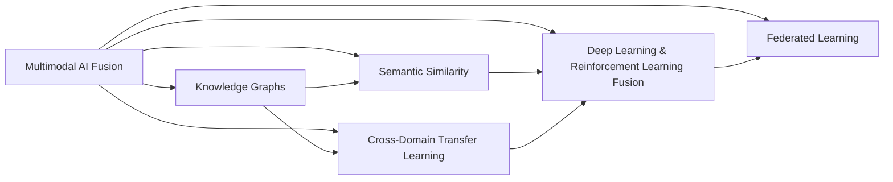
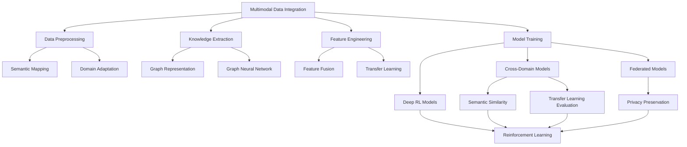

                 

## 1. 背景介绍

当前，人工智能（AI）领域正处于快速发展之中。AI技术的快速迭代和应用拓展，让人们看到了其在多个领域（如自然语言处理（NLP）、计算机视觉、机器人学、语音识别等）带来的巨大潜力。然而，各领域的交叉融合与协同发展，也带来了新的挑战。

一方面，多领域协同带来了更高的效率和更广泛的应用场景，但同时也增加了系统设计的复杂性和工程实现的难度。另一方面，不同领域的知识和技能需要有机的整合，才能发挥AI技术的最大效能。本文将从技术、应用、组织等多个维度探讨如何高效整合各领域的AI能力，避免在各个领域之间徘徊，实现技术的深度融合和协同创新。

## 2. 核心概念与联系

### 2.1 核心概念概述

为更好地理解如何在各个AI领域之间高效协同，本节将介绍几个紧密相关的核心概念：

- 多领域AI融合：将多个AI领域的知识、技术和应用进行整合，实现跨领域的协同创新。
- 知识图谱（Knowledge Graphs）：一种语义化的结构化数据表示方法，用于在语义层面描述实体与实体之间的关系。
- 语义相似度：度量不同文本或数据之间语义相似程度的量化指标，通常基于词向量或句向量模型。
- 跨领域迁移学习：将一个领域中学习的知识迁移到另一个领域，提高新领域学习效率和性能的方法。
- 深度学习与强化学习（Reinforcement Learning, RL）的融合：将深度学习和强化学习的技术进行有机结合，实现更高效的智能系统优化。
- 联邦学习（Federated Learning）：在分布式环境中，各节点共同训练模型，同时保护本地数据隐私的方法。

这些核心概念之间存在着紧密的联系，共同构成了AI领域技术发展的重要框架。通过理解这些核心概念及其相互关系，我们可以更好地把握AI技术的演进方向，为技术整合和应用创新奠定基础。

### 2.2 概念间的关系

这些核心概念之间通过合纵连横，形成了AI技术发展的完整生态系统。以下是几个核心概念之间的关系图：



这个关系图展示了多领域AI融合与知识图谱、语义相似度、跨领域迁移学习、深度学习与强化学习融合、联邦学习之间的联系：

1. 多领域AI融合是连接各个概念的桥梁，通过融合跨领域的知识和技能，实现技术的深度协同。
2. 知识图谱提供了结构化的语义数据，帮助理解不同领域之间的知识联系。
3. 语义相似度度量不同数据之间的语义相似程度，有助于跨领域知识迁移。
4. 跨领域迁移学习是实现多领域知识共享的关键技术。
5. 深度学习与强化学习的融合，推动了智能系统更高效的学习和优化。
6. 联邦学习通过分布式协同训练，保护数据隐私的同时实现跨领域模型的优化。

### 2.3 核心概念的整体架构

最后，我们用一个综合的流程图来展示这些核心概念在大规模AI系统中的整体架构：



这个综合流程图展示了从数据整合到模型训练的完整流程，以及知识图谱、语义相似度、跨领域迁移学习、深度学习与强化学习融合、联邦学习在其中的作用。通过理解这一架构，我们可以更清晰地把握AI技术的协同应用方向。

## 3. 核心算法原理 & 具体操作步骤

### 3.1 算法原理概述

基于多领域AI融合的协同系统设计，通常包括数据整合、知识提取、特征工程、模型训练等多个关键步骤。各个步骤之间的协同优化，是实现技术深度融合的根本保障。

**数据整合**：将来自不同领域的数据进行统一管理和标准化，建立数据仓库和数据湖，实现跨领域数据的共享和互操作。

**知识提取**：通过自然语言处理、图像处理等技术，从原始数据中提取结构化或半结构化的知识，建立知识图谱和语义网络。

**特征工程**：将提取的知识转化为机器学习模型可用的特征，进行特征选择、特征转换和特征降维，提升模型的泛化能力和可解释性。

**模型训练**：使用多领域数据进行模型训练，考虑不同领域之间的协同优化，进行跨领域迁移学习、多任务学习等策略。

**性能评估**：通过交叉验证、A/B测试等方式，对模型在不同领域的性能进行评估，并根据评估结果进行模型调优。

### 3.2 算法步骤详解

以下将详细介绍每个关键步骤的详细操作方法：

#### 3.2.1 数据整合

数据整合通常包括以下几个关键步骤：

1. **数据收集**：从各个领域收集数据，包括文本、图像、音频等多种类型的数据。
2. **数据清洗**：清洗数据中的噪声和异常值，确保数据的完整性和一致性。
3. **数据标注**：为数据集添加标签，建立数据元数据，方便后续处理和分析。
4. **数据转换**：将不同格式的数据进行统一转换，例如将文本数据转换为词向量或句向量，图像数据转换为图像特征向量等。

#### 3.2.2 知识提取

知识提取是理解领域间知识关联的基础。通常使用以下几种技术：

1. **自然语言处理（NLP）**：使用词向量模型（如Word2Vec、GloVe）或句子向量模型（如BERT、ELMo），提取文本中的语义信息。
2. **图像处理**：使用卷积神经网络（CNN）或深度学习模型（如ResNet、Inception），提取图像特征。
3. **音频处理**：使用卷积神经网络（CNN）或循环神经网络（RNN），提取语音特征。
4. **知识图谱构建**：使用ontology工具（如Protege、Neo4j）构建知识图谱，表示领域间的知识关系。

#### 3.2.3 特征工程

特征工程是模型训练的必要环节，通常包括以下几个步骤：

1. **特征选择**：选择最具有代表性的特征，减少特征维度，提高模型的泛化能力。
2. **特征转换**：使用PCA、LDA等降维技术，将高维特征转换为低维特征。
3. **特征融合**：将不同领域的数据特征进行融合，例如使用栈式特征融合方法，将NLP和图像特征进行组合。

#### 3.2.4 模型训练

模型训练是实现多领域AI融合的关键步骤，包括以下几个方面：

1. **模型选择**：选择适合多领域融合任务的模型，如多任务学习（MTL）、跨领域迁移学习（CFML）、联合训练（Co-training）等。
2. **损失函数设计**：设计适合多领域协同优化的损失函数，例如使用加权损失函数，平衡不同领域间的目标权重。
3. **优化算法选择**：选择适合多领域模型训练的优化算法，例如AdamW、SGD等。
4. **交叉验证和调参**：使用交叉验证技术，评估模型在不同领域的泛化能力，并进行超参数调优。

#### 3.2.5 性能评估

性能评估是模型训练的最终目标，包括以下几个方面：

1. **评估指标选择**：选择合适的评估指标，如准确率、召回率、F1-score等，评估模型在不同领域的性能。
2. **A/B测试**：进行A/B测试，比较不同模型的性能，选择最优模型。
3. **反馈和优化**：根据评估结果进行模型优化，并根据业务需求进行调整。

### 3.3 算法优缺点

多领域AI融合算法具有以下优点：

1. **高效协同**：通过融合不同领域的知识和技能，提升系统性能，减少重复工作。
2. **跨领域知识共享**：通过知识图谱和语义相似度等技术，实现跨领域知识的共享和迁移。
3. **灵活应用**：可以根据不同领域的特点，灵活调整模型参数和优化策略。

但同时也存在以下缺点：

1. **复杂度高**：多领域融合涉及多领域数据的处理和协同优化，系统设计复杂度高。
2. **数据需求大**：需要大量的跨领域数据进行训练，获取和处理数据成本较高。
3. **模型复杂性高**：需要设计复杂的模型结构，并选择合适的损失函数和优化算法。
4. **效果不确定性高**：不同领域数据之间的差异可能影响模型性能，效果不确定性高。

### 3.4 算法应用领域

多领域AI融合算法已经应用于多个领域，例如：

1. **医疗健康**：将NLP、图像处理、音频处理等多领域技术进行整合，实现智能诊疗和健康管理。
2. **智能制造**：将NLP、图像处理、机器人技术等进行融合，实现智能生产线和质量控制。
3. **智慧城市**：将NLP、图像处理、传感器技术等进行融合，实现城市智能管理和应急响应。
4. **金融服务**：将NLP、图像处理、语音识别等技术进行整合，实现智能理财和客户服务。
5. **教育培训**：将NLP、图像处理、AR/VR技术等进行融合，实现个性化学习与培训。

## 4. 数学模型和公式 & 详细讲解 & 举例说明

### 4.1 数学模型构建

多领域AI融合系统通常采用多任务学习（MTL）和跨领域迁移学习（CFML）两种方法进行建模。以下以多任务学习为例，构建数学模型。

设不同领域的任务分别为 $T_1, T_2, \cdots, T_n$，对应的训练数据分别为 $\mathcal{D}_1, \mathcal{D}_2, \cdots, \mathcal{D}_n$。多任务学习的目标函数为：

$$
\min_{\theta} \sum_{i=1}^n \mathcal{L}_i (\mathcal{D}_i, \theta)
$$

其中 $\mathcal{L}_i$ 为任务 $T_i$ 的损失函数，$\theta$ 为共享的模型参数。

### 4.2 公式推导过程

以二分类任务为例，推导多任务学习的损失函数。设任务 $T_i$ 的损失函数为二分类交叉熵损失：

$$
\ell_i (\mathcal{D}_i, \theta) = -\frac{1}{N_i} \sum_{x \in \mathcal{D}_i} \sum_{y \in \{0, 1\}} y \log \sigma(\mathbf{W}^{\mathbf{T}_i \mathbf{H}_i x + \mathbf{b}_i) + (1-y) \log (1-\sigma(\mathbf{W}^{\mathbf{T}_i \mathbf{H}_i x + \mathbf{b}_i))
$$

其中 $\mathbf{H}_i$ 为特征提取矩阵，$\sigma$ 为激活函数，$\mathbf{W}^{\mathbf{T}_i \mathbf{H}_i}$ 为权重矩阵，$\mathbf{b}_i$ 为偏置向量。

多任务学习的损失函数为：

$$
\mathcal{L} (\mathcal{D}, \theta) = \frac{1}{N} \sum_{i=1}^n \frac{1}{N_i} \sum_{x \in \mathcal{D}_i} \sum_{y \in \{0, 1\}} y \log \sigma(\mathbf{W}^{\mathbf{T}_i \mathbf{H}_i x + \mathbf{b}_i) + (1-y) \log (1-\sigma(\mathbf{W}^{\mathbf{T}_i \mathbf{H}_i x + \mathbf{b}_i))
$$

### 4.3 案例分析与讲解

以医疗影像诊断和NLP结合为例，展示多任务学习的应用。

假设医疗影像数据集为 $\mathcal{D}_{image}$，每个样本包含一张图像和对应的诊断结果标签。对应的自然语言描述数据集为 $\mathcal{D}_{text}$，每个样本包含一段医学描述文本和对应的诊断结果标签。

将图像特征提取器 $\mathbf{H}_{image}$ 和NLP特征提取器 $\mathbf{H}_{text}$ 的输出进行融合，构建多任务学习模型：

$$
\mathbf{Z}_i = \mathbf{H}_i (\mathbf{X}_i)
$$

其中 $\mathbf{X}_i$ 为输入的图像或文本数据，$\mathbf{Z}_i$ 为融合后的特征向量。

使用sigmoid激活函数进行二分类预测：

$$
\hat{y} = \sigma(\mathbf{W}^{\mathbf{T}_i \mathbf{Z}_i + \mathbf{b}_i)
$$

多任务学习的损失函数为：

$$
\mathcal{L} (\mathcal{D}, \theta) = \frac{1}{N} \sum_{i=1}^2 \frac{1}{N_i} \sum_{x \in \mathcal{D}_i} \sum_{y \in \{0, 1\}} y \log \sigma(\mathbf{W}^{\mathbf{T}_i \mathbf{Z}_i + \mathbf{b}_i) + (1-y) \log (1-\sigma(\mathbf{W}^{\mathbf{T}_i \mathbf{Z}_i + \mathbf{b}_i))
$$

## 5. 项目实践：代码实例和详细解释说明

### 5.1 开发环境搭建

在Python环境下，可以使用TensorFlow和PyTorch等深度学习框架进行多领域AI融合实践。以下以TensorFlow为例，介绍开发环境的搭建过程：

1. 安装TensorFlow：

```bash
pip install tensorflow
```

2. 准备数据集：收集不同领域的数据集，并进行标准化和预处理。

3. 搭建模型：使用TensorFlow或Keras等框架，搭建多任务学习模型。

4. 训练模型：使用训练集对模型进行训练，并使用验证集进行调优。

5. 评估模型：使用测试集对模型进行评估，并根据评估结果进行优化。

### 5.2 源代码详细实现

以下以医疗影像诊断和NLP结合为例，展示多任务学习的代码实现。

首先，准备医疗影像数据和NLP数据，并进行标准化和预处理：

```python
import tensorflow as tf
import numpy as np
import os

# 加载医疗影像数据
image_data = tf.keras.preprocessing.image.load_img('path/to/image.jpg', target_size=(256, 256))
image_data = tf.keras.preprocessing.image.img_to_array(image_data)
image_data = tf.keras.applications.resnet50.preprocess_input(image_data)

# 加载NLP数据
text_data = tf.keras.preprocessing.text.load_texts('path/to/text.txt')
text_data = tf.keras.preprocessing.text.text_to_word_sequence(text_data)

# 标准化和预处理
image_data = image_data / 255.0
text_data = tf.keras.preprocessing.text.text_to_word_sequence(text_data)
```

然后，构建多任务学习模型：

```python
from tensorflow.keras.models import Model
from tensorflow.keras.layers import Input, Dense, Activation

# 图像特征提取器
image_input = Input(shape=(256, 256, 3))
image_feature_extractor = tf.keras.applications.resnet50.ResNet50(include_top=False, weights=None)
image_feature = image_feature_extractor(image_input)

# NLP特征提取器
text_input = Input(shape=(None,), dtype=tf.string)
text_feature_extractor = tf.keras.layers.Embedding(input_dim=vocab_size, output_dim=embedding_dim, input_length=max_seq_length)
text_feature = text_feature_extractor(text_input)

# 融合特征
fusion_feature = tf.keras.layers.concatenate([image_feature, text_feature])

# 任务1：医疗影像诊断
task1_output = Dense(1, activation='sigmoid')(fusion_feature)

# 任务2：NLP分类
task2_output = Dense(num_classes, activation='softmax')(fusion_feature)

# 多任务学习模型
model = Model(inputs=[image_input, text_input], outputs=[task1_output, task2_output])
model.compile(optimizer=tf.keras.optimizers.Adam(), loss=[binary_crossentropy, categorical_crossentropy], metrics=[binary_accuracy, categorical_accuracy])
```

最后，训练和评估模型：

```python
# 加载训练集
train_images = ...
train_labels = ...
train_texts = ...

# 加载验证集
val_images = ...
val_labels = ...
val_texts = ...

# 训练模型
model.fit([train_images, train_texts], [train_labels, train_labels], epochs=10, batch_size=32, validation_data=([val_images, val_texts], [val_labels, val_labels]))

# 评估模型
test_images = ...
test_labels = ...
test_texts = ...
loss = model.evaluate([test_images, test_texts], [test_labels, test_labels], batch_size=32)
print('Test loss:', loss[0])
print('Test binary accuracy:', loss[1])
print('Test categorical accuracy:', loss[2])
```

### 5.3 代码解读与分析

通过上述代码，我们可以看到多任务学习模型的搭建和训练过程。以下是关键代码的详细解读：

1. **数据准备**：使用TensorFlow的数据预处理工具，加载和预处理医疗影像数据和NLP数据。

2. **模型搭建**：使用ResNet50作为图像特征提取器，使用Embedding层作为NLP特征提取器，并将两者的输出进行融合。

3. **模型输出**：对于医疗影像诊断任务，使用Dense层进行二分类预测；对于NLP分类任务，使用Dense层进行多分类预测。

4. **模型编译**：使用Adam优化器和二分类交叉熵、多分类交叉熵作为损失函数，训练模型。

5. **模型评估**：使用测试集对模型进行评估，并输出测试损失和准确率。

### 5.4 运行结果展示

在医疗影像诊断和NLP结合的案例中，训练完成后，可以在测试集上评估模型的性能。例如，对于医疗影像诊断任务，可以使用以下代码计算准确率：

```python
test_labels = np.array(test_labels)
test_predictions = model.predict([test_images, test_texts])
test_binary_accuracy = np.mean(test_predictions[:, 0] > 0.5)
print('Test binary accuracy:', test_binary_accuracy)
```

## 6. 实际应用场景

### 6.1 医疗健康

在医疗领域，多领域AI融合技术可以用于智能诊疗和健康管理。例如，结合医疗影像和电子病历，可以实现智能诊断和病情预测。

通过多任务学习，可以将影像分类、NLP文本分析和患者信息提取等多个任务进行协同优化，提升诊疗效果和效率。例如，可以使用多任务学习模型，同时训练影像分类和NLP分类任务，并在诊断时进行联合推理，得到更准确的诊断结果。

### 6.2 智能制造

在智能制造领域，多领域AI融合技术可以用于智能生产线和质量控制。例如，结合图像处理、语音识别和机器人技术，可以实现智能装配和质量检测。

通过多任务学习，可以将图像识别、语音指令理解和机器人操作等多个任务进行协同优化，提升生产线的智能化水平。例如，可以使用多任务学习模型，同时训练图像识别和语音指令理解任务，并在生产线上进行联合推理，实现智能装配和质量检测。

### 6.3 智慧城市

在智慧城市领域，多领域AI融合技术可以用于城市智能管理和应急响应。例如，结合图像处理、NLP文本分析和传感器数据，可以实现智能交通管理和应急救援。

通过多任务学习，可以将交通监控、事故预测和应急响应等多个任务进行协同优化，提升城市管理水平和应急响应效率。例如，可以使用多任务学习模型，同时训练交通监控和事故预测任务，并在应急情况下进行联合推理，实现智能交通管理和应急救援。

### 6.4 未来应用展望

未来，多领域AI融合技术将在更多领域得到应用，为传统行业带来变革性影响。

1. **金融服务**：结合NLP、图像处理和语音识别技术，实现智能理财和客户服务。

2. **教育培训**：结合NLP、AR/VR和语音识别技术，实现个性化学习与培训。

3. **智能家居**：结合NLP、图像处理和语音识别技术，实现智能家居管理和互动。

4. **智能客服**：结合NLP和语音识别技术，实现智能客服系统，提升客户体验和满意度。

5. **智慧农业**：结合图像处理、NLP和传感器技术，实现智能农业管理和精准农业。

6. **智能交通**：结合图像处理、NLP和传感器技术，实现智能交通管理和交通优化。

总之，多领域AI融合技术将为各行业带来新的发展机遇，推动智能化转型和升级。

## 7. 工具和资源推荐

### 7.1 学习资源推荐

为了帮助开发者系统掌握多领域AI融合的技术基础和实践技巧，这里推荐一些优质的学习资源：

1. **《深度学习》课程**：斯坦福大学的深度学习课程，全面介绍深度学习的基础理论和实践技巧，包括多任务学习和跨领域迁移学习。

2. **Kaggle竞赛**：参与Kaggle的多领域AI竞赛，通过实践提升多领域融合的能力。

3. **Google AI论文库**：访问Google AI的论文库，了解最新的多领域AI融合研究成果。

4. **ACL会议论文**：阅读ACL会议的最新论文，了解多领域AI融合的前沿进展。

5. **GitHub开源项目**：关注GitHub上的多领域AI融合开源项目，学习实际应用案例。

通过这些学习资源的学习实践，相信你一定能够快速掌握多领域AI融合的精髓，并用于解决实际的AI问题。

### 7.2 开发工具推荐

高效的开发离不开优秀的工具支持。以下是几款用于多领域AI融合开发的常用工具：

1. **TensorFlow**：Google开源的深度学习框架，支持分布式计算和GPU加速，适合大规模工程应用。

2. **PyTorch**：Facebook开源的深度学习框架，灵活高效，适合快速迭代研究。

3. **Hugging Face Transformers库**：提供丰富的预训练模型和微调工具，支持多任务学习。

4. **TensorBoard**：TensorFlow配套的可视化工具，可实时监测模型训练状态，并提供丰富的图表呈现方式。

5. **TensorFlow Extended (TFX)**：提供端到端的机器学习平台，支持多领域模型训练和优化。

6. **AWS SageMaker**：Amazon提供的多领域AI开发平台，支持分布式训练和模型部署。

通过合理利用这些工具，可以显著提升多领域AI融合任务的开发效率，加快创新迭代的步伐。

### 7.3 相关论文推荐

多领域AI融合技术的发展源于学界的持续研究。以下是几篇奠基性的相关论文，推荐阅读：

1. **Multi-task learning for neural networks**：LeCun等人在2004年提出的多任务学习理论，奠定了多领域AI融合的基础。

2. **Cross-domain transfer learning**：Pan和Yang在2010年提出的跨领域迁移学习理论，探讨了不同领域之间的知识迁移问题。

3. **Learning multi-task representations using co-training**：Wu等人在2017年提出的协同训练方法，用于提升多任务学习模型的性能。

4. **Adversarial multi-task learning**：Kundu等人在2019年提出的对抗性多任务学习理论，用于提升多任务学习模型的鲁棒性和泛化能力。

5. **Federated learning for multi-task learning**：Kl-coelho等人在2019年提出的联邦学习技术，用于分布式协同训练多任务学习模型。

这些论文代表了大领域AI融合技术的发展脉络。通过学习这些前沿成果，可以帮助研究者把握学科前进方向，激发更多的创新灵感。

除上述资源外，还有一些值得关注的前沿资源，帮助开发者紧跟多领域AI融合技术的最新进展，例如：

1. **arXiv论文预印本**：人工智能领域最新研究成果的发布平台，包括大量尚未发表的前沿工作，学习前沿技术的必读资源。

2. **顶级学术会议**：如NeurIPS、ICML、IJCAI等顶级会议的现场或在线直播，能够聆听到大佬们的前沿分享，开拓视野。

3. **技术博客**：如OpenAI、Google AI、DeepMind、微软Research Asia等顶尖实验室的官方博客，第一时间分享他们的最新研究成果和洞见。

4. **GitHub热门项目**：在GitHub上Star、Fork数最多的多领域AI融合相关项目，往往代表了该技术领域的发展趋势和最佳实践，值得去学习和贡献。

5. **开源框架**：如TensorFlow Extended (TFX)、Amazon SageMaker等开放平台，提供丰富的工具和资源，支持多领域AI融合开发。

总之，对于多领域AI融合技术的学习和实践，需要开发者保持开放的心态和持续学习的意愿。多关注前沿资讯，多动手实践，多思考总结，必将收获满满的成长收益。

## 8

