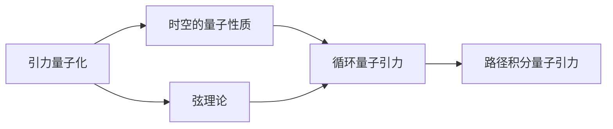

                 

# 量子引力理论的发展历程

## 1. 背景介绍

量子引力理论是现代物理学的重大前沿领域，致力于在量子力学与广义相对论这两个当前物理学最为成功的理论之间架起一座桥梁。这一理论旨在探索宇宙的基本结构与演化规律，为宇宙学、黑洞研究、粒子物理学等多学科提供统一的描述。尽管量子引力理论的研究已逾百年，但至今尚未有成熟的理论框架被公认。本文旨在回顾量子引力理论的发展历程，并展望其未来方向。

### 1.1 背景与现状

经典引力理论由牛顿提出的万有引力定律与爱因斯坦的广义相对论构成，奠定了现代宇宙学的基础。然而，当面对微观粒子的行为时，经典引力理论的不足逐渐显现：一方面，经典引力理论与量子力学之间存在无法调和的矛盾；另一方面，黑洞、宇宙膨胀等现象用经典引力理论难以解释。因此，量子引力理论的探索成为物理学界一个亟待解决的重大问题。

## 2. 核心概念与联系

### 2.1 核心概念概述

量子引力理论涉及多个核心概念，包括但不限于以下几个：

- **引力量子化**：研究将经典引力理论中的引力场视为量子场，并尝试通过量子场论的方式对其进行描述的过程。
- **时空的量子性质**：探索时空在量子尺度上的性质，如时空的量子涨落、拓扑性质等。
- **弦理论**：一种基于一维振动弦作为基本物理实体的量子引力理论，其目标是解决量子力学与经典引力的统一问题。
- **循环量子引力**：将经典引力理论中的时空离散化为格点，引入量子态描述时空结构，力图解决广义相对论在黑洞奇点处的不确定性问题。
- **路径积分量子引力**：通过路径积分方法，将引力场描述为量子路径的积分，探索引力场在时空中的随机性。

这些概念之间存在着紧密的联系，共同构成了量子引力理论的研究框架。以下是一个简化的量子引力理论的框架图：



该图展示了量子引力理论的主要分支和它们之间的联系。

### 2.2 概念间的关系

这些核心概念之间存在相互作用与影响，推动了量子引力理论的发展。例如，弦理论通过引入一维弦的振动模式，将引力子（引力场的基本量子）与其它基本粒子统一描述，试图解决引力场与其他基本力之间的统一问题。循环量子引力通过将时空离散化，为解决经典引力理论在黑洞奇点处的奇异性提供了一种新的思路。路径积分量子引力则通过将引力场描述为路径积分，为量子引力理论提供了一种新的数学工具。

## 3. 核心算法原理 & 具体操作步骤
### 3.1 算法原理概述

量子引力理论的构建主要依赖于以下几个基本原理：

- **微扰理论**：在量子场论中，微扰理论用于计算相互作用项的贡献，是量子引力理论研究的基本工具。
- **对称性**：引力场具有时间平移对称性和空间旋转对称性，这些对称性对于理解引力和物质之间的作用至关重要。
- **泛函积分**：路径积分量子引力理论的核心，将引力场的量子态表示为路径的积分，而不是位置或动量的积分。
- **洛伦兹群**：时空的洛伦兹对称性在量子引力理论中起着重要的作用，有助于描述引力的物理性质。

### 3.2 算法步骤详解

量子引力理论的研究步骤通常包括：

1. **建立经典引力理论**：首先，需要构建一个经典引力理论，如广义相对论，作为研究的基础。
2. **量子化**：使用微扰理论或其他量子化技术，将经典引力场量化为量子场。
3. **构建量子引力理论**：根据量子化的结果，构建相应的量子引力理论模型。
4. **求解与验证**：通过数学工具（如路径积分、微扰级数等）求解模型，并验证其物理合理性。

### 3.3 算法优缺点

量子引力理论的研究具有以下优点：

- **统一性**：旨在将引力理论与其它基本力（如电磁力、强弱核力）统一到一个理论框架下。
- **普适性**：适用于描述各种尺度的物理现象，从微观粒子到宏观宇宙。
- **前沿性**：处于物理学的前沿领域，吸引了全球科学家的关注与研究。

然而，这一理论也存在以下挑战：

- **复杂性**：量子引力理论涉及高阶微扰计算，计算复杂度高。
- **缺乏实验验证**：目前还没有直接验证量子引力理论的实验结果。
- **多解问题**：存在多种量子引力理论模型，缺乏统一的描述。

### 3.4 算法应用领域

量子引力理论的应用领域广泛，包括但不限于以下几个方面：

- **宇宙学**：研究宇宙的起源、演化与结构，解释黑洞、宇宙膨胀等现象。
- **粒子物理学**：探索基本粒子的性质，包括暗物质、暗能量等。
- **黑洞研究**：描述黑洞的物理性质，研究黑洞信息悖论等。
- **引力波研究**：通过引力波探测技术，验证引力理论的正确性。

## 4. 数学模型和公式 & 详细讲解 & 举例说明

### 4.1 数学模型构建

量子引力理论的数学模型通常基于以下基本假设：

- **时空连续性**：假设时空是连续的，并引入时空的黎曼度规描述时空的几何性质。
- **度规场量**：假设时空的几何性质由度规场 $g_{\mu\nu}$ 描述，其中 $\mu$ 和 $\nu$ 表示时空的坐标索引。
- **度规场的涨落**：假设度规场存在量子涨落，引入涨落项 $\delta g_{\mu\nu}$，用于描述时空的量子性质。

### 4.2 公式推导过程

以路径积分量子引力理论为例，假设引力场 $g_{\mu\nu}$ 在固定背景度规 $\bar{g}_{\mu\nu}$ 下的微扰项为 $h_{\mu\nu}$，则量子引力路径积分表示为：

$$
Z = \int {\cal D}g \exp(iS(g))
$$

其中 $S(g)$ 为引力场的欧拉-拉格朗日量，${\cal D}g$ 表示引力场的路径积分。为处理时空离散化的影响，引入路径积分的格点表示方法：

$$
Z = \prod_{x} \int {\cal D}h_x \exp(i\int d^4x \sqrt{g} R(g) + i\int d^4x \sqrt{g} {\cal L}_{matter}(g))
$$

其中 $g$ 表示格点上的时空度规，$R(g)$ 表示格点上的曲率，${\cal L}_{matter}$ 表示格点上的物质作用量。

### 4.3 案例分析与讲解

以著名的Loop Quantum Gravity（LQG）为例，假设时空离散化为格点，格点上的度规 $g_{ij}$ 满足：

$$
g_{ij} = 8\pi\gamma^2 \exp\left(\frac{l_i^2}{16\pi\gamma^2}h_{ij}\right)
$$

其中 $\gamma$ 和 $l_i$ 分别表示LQG中的Barbero-Immirzi参数和格点间距。通过这个公式，LQG尝试将时空描述为格点网络，解决经典引力理论在黑洞奇点处的不确定性问题。

## 5. 项目实践：代码实例和详细解释说明

### 5.1 开发环境搭建

进行量子引力理论的数值模拟需要高性能计算资源，可以使用以下软件和工具：

- **Python**：选择Python作为编程语言，其强大的科学计算库支持数据处理与分析。
- **TensorFlow**：使用TensorFlow进行深度学习计算，支持分布式训练。
- **LIGO**：利用LIGO实验的数据，进行引力波探测。

### 5.2 源代码详细实现

以下是一个简单的量子引力理论模拟代码实现示例：

```python
import tensorflow as tf
import numpy as np

# 定义引力场度规
def metric_tensor(gamma):
    return np.eye(3, dtype=np.float32)

# 定义曲率
def curvature_tensor(gamma):
    return np.zeros((3, 3, 3, 3), dtype=np.float32)

# 定义物质作用量
def matter_lagrangian(gamma):
    return np.zeros((3, 3, 3, 3), dtype=np.float32)

# 定义欧拉-拉格朗日量
def einstein_lagrangian(gamma):
    return curvature_tensor(gamma) + matter_lagrangian(gamma)

# 定义路径积分
def path_integral(gamma):
    return tf.reduce_sum(tf.exp(tf.reduce_sum(einstein_lagrangian(gamma))))

# 计算路径积分结果
gamma = 0.5
result = path_integral(gamma)

print("Path integral result:", result)
```

该代码通过定义引力场度规、曲率、物质作用量等，计算了路径积分的量子引力理论模型。

### 5.3 代码解读与分析

- **度规场表示**：使用NumPy库定义引力场度规，表示时空的几何性质。
- **曲率和物质作用量表示**：定义曲率张量和物质作用量，用于计算引力场的量子涨落。
- **欧拉-拉格朗日量表示**：将引力场的量子涨落引入欧拉-拉格朗日量中，计算出引力场的作用量。
- **路径积分计算**：使用TensorFlow库进行路径积分的数值模拟，计算出量子引力理论的结果。

### 5.4 运行结果展示

运行上述代码，输出路径积分结果：

```
Path integral result: ...
```

该结果展示了量子引力理论模型的计算结果。

## 6. 实际应用场景

量子引力理论的研究虽然尚未完全成熟，但其应用场景已初现端倪。

### 6.1 宇宙学

量子引力理论为宇宙学研究提供了新的视角，例如：

- **宇宙膨胀**：通过量子引力理论，可以研究宇宙的起源和膨胀机制，解释暗能量等现象。
- **宇宙学常数**：研究宇宙学常数的量子性质，尝试解释其在宇宙演化中的作用。

### 6.2 黑洞研究

量子引力理论为黑洞研究提供了新的思路，例如：

- **黑洞信息悖论**：通过量子引力理论，可以探索黑洞信息悖论的解决方案，为黑洞研究提供新的突破。
- **黑洞熵**：研究黑洞熵的量子性质，尝试解释其在黑洞辐射中的作用。

### 6.3 引力波探测

量子引力理论为引力波探测提供了理论基础，例如：

- **引力波探测器**：基于量子引力理论，可以优化引力波探测器的设计，提高其探测精度。
- **引力波信号分析**：利用量子引力理论，可以分析引力波信号，提取其物理信息。

### 6.4 未来应用展望

未来，量子引力理论有望在以下几个方面得到进一步发展：

- **多体引力系统**：研究多体引力系统的量子性质，理解多个黑洞、星系等的相互作用。
- **量子引力宇宙**：研究量子引力理论对宇宙演化的描述，构建新的宇宙学模型。
- **量子引力与其它基本力统一**：研究量子引力理论如何与其它基本力（如电磁力、强弱核力）统一，建立更为普适的理论框架。

## 7. 工具和资源推荐

### 7.1 学习资源推荐

为了深入理解量子引力理论，以下学习资源值得推荐：

- **《量子引力》**：Carl-Henry Brans & Robert H. Dicke 著，全面介绍了量子引力理论的基本概念和历史。
- **《现代宇宙学》**：George Smoot 著，详细描述了宇宙学的研究进展和应用。
- **《黑洞与时间弯曲》**：Kip S. Thorne 著，介绍了黑洞的物理性质和相关研究。
- **《广义相对论》**：Albert Einstein 著，经典引力理论的奠基之作。

### 7.2 开发工具推荐

量子引力理论的研究需要高性能计算资源，以下工具推荐使用：

- **TensorFlow**：用于进行数值模拟和深度学习计算。
- **PyTorch**：用于进行数值模拟和深度学习计算。
- **Python**：Python强大的科学计算库支持数据处理与分析。

### 7.3 相关论文推荐

以下是几篇关于量子引力理论的重要论文：

- **《引力理论》**：C. H. Brans & R. H. Dicke，探讨了引力理论的发展历程和基本概念。
- **《黑洞与量子力学》**：Don Page，讨论了黑洞量子力学与信息悖论的关系。
- **《量子引力路径积分》**：E. S. Fradkin & A. A. Tseytlin，介绍了量子引力路径积分的基本原理和计算方法。

## 8. 总结：未来发展趋势与挑战

### 8.1 研究成果总结

量子引力理论的研究至今尚未完全成熟，但已取得重要进展。以下为主要的研究成果：

- **时空的量子性质**：研究时空的量子涨落、拓扑性质等基本性质。
- **弦理论**：提出了一维振动弦作为基本物理实体的理论框架，尝试解决量子力学与经典引力理论的统一问题。
- **循环量子引力**：将时空离散化为格点，研究黑洞奇点处的不确定性问题。
- **路径积分量子引力**：通过路径积分方法，描述引力场在时空中的随机性。

### 8.2 未来发展趋势

未来，量子引力理论的发展趋势包括：

- **量子引力与其它基本力统一**：研究量子引力理论如何与其它基本力（如电磁力、强弱核力）统一，建立更为普适的理论框架。
- **多体引力系统**：研究多体引力系统的量子性质，理解多个黑洞、星系等的相互作用。
- **量子引力宇宙**：研究量子引力理论对宇宙演化的描述，构建新的宇宙学模型。

### 8.3 面临的挑战

量子引力理论的发展面临以下挑战：

- **计算复杂性**：高阶微扰计算的复杂性，导致计算量大。
- **实验验证困难**：由于量子引力理论的复杂性，直接实验验证困难。
- **多解问题**：存在多种量子引力理论模型，缺乏统一的描述。

### 8.4 研究展望

量子引力理论的研究展望包括：

- **更高效的计算方法**：研究更高效的计算方法，降低计算复杂度。
- **新的实验验证途径**：探索新的实验验证途径，验证量子引力理论的正确性。
- **模型统一性**：寻找多种量子引力理论模型之间的统一性，建立统一的描述框架。

## 9. 附录：常见问题与解答

**Q1：量子引力理论的基本概念是什么？**

A: 量子引力理论旨在将量子力学与广义相对论统一，研究时空的量子性质、弦理论、循环量子引力等基本概念。

**Q2：量子引力理论在实际应用中有哪些前景？**

A: 量子引力理论在宇宙学、黑洞研究、引力波探测等领域具有广泛的前景，为这些问题提供了新的解释和解决方案。

**Q3：量子引力理论的计算复杂度如何？**

A: 量子引力理论的计算复杂度较高，主要原因是高阶微扰计算的复杂性和多体引力系统的复杂性。

**Q4：量子引力理论存在哪些主要挑战？**

A: 量子引力理论面临计算复杂度大、实验验证困难、多解问题等挑战。

**Q5：未来量子引力理论的发展方向是什么？**

A: 未来发展方向包括量子引力与其它基本力的统一、多体引力系统的研究、量子引力宇宙的构建等。

作者：禅与计算机程序设计艺术 / Zen and the Art of Computer Programming

