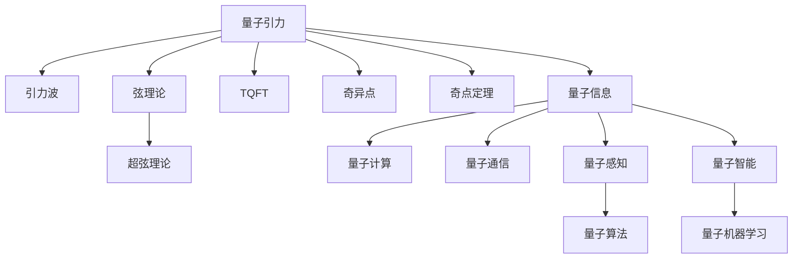
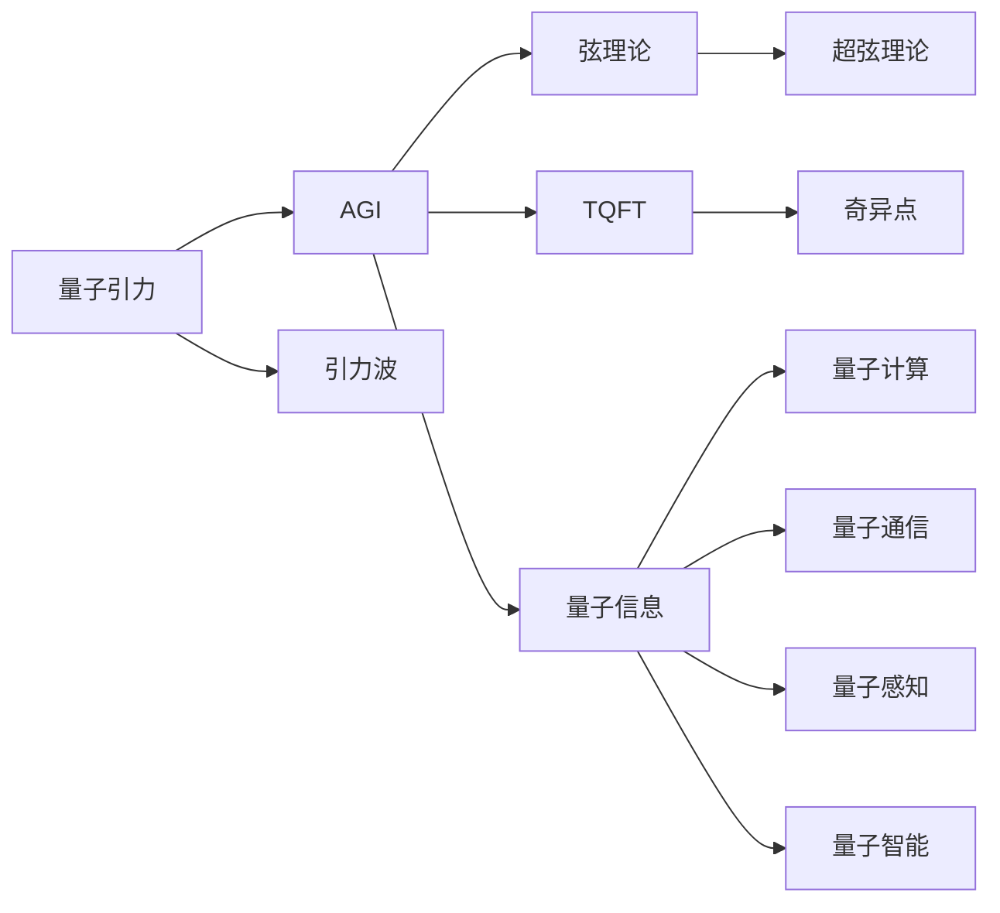
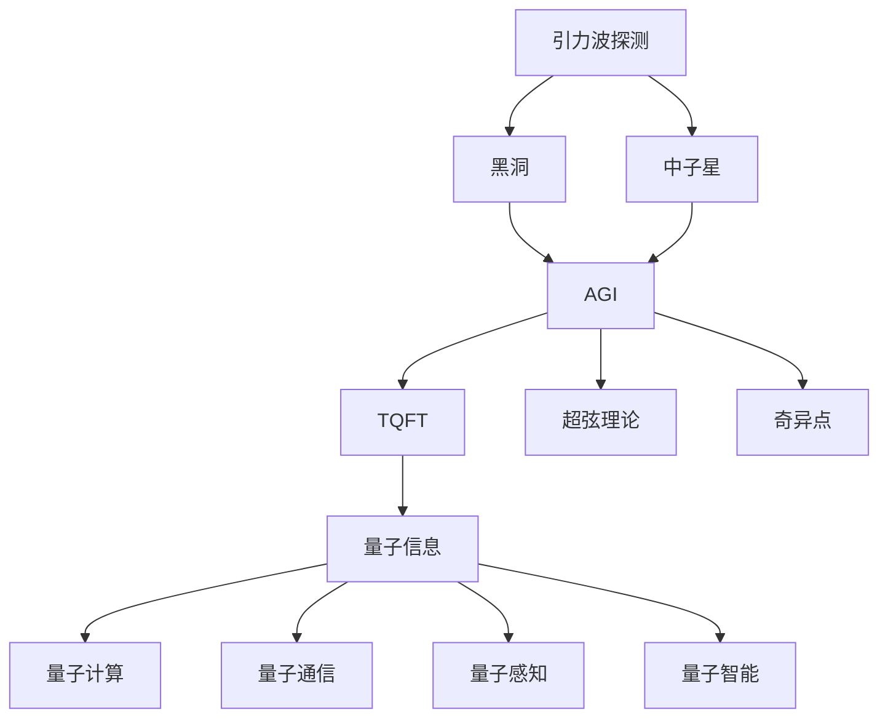
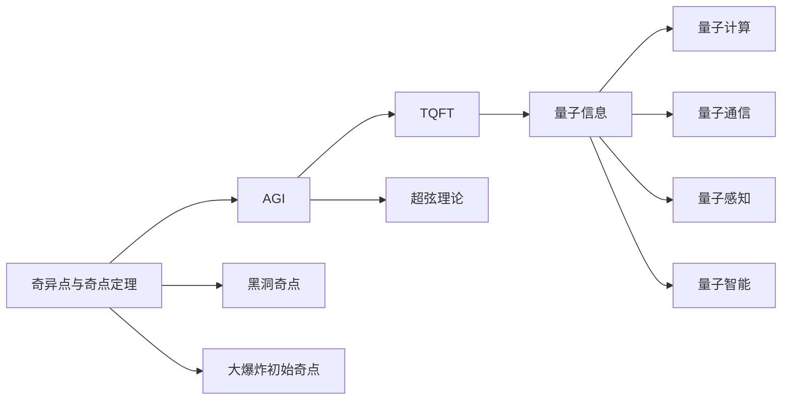
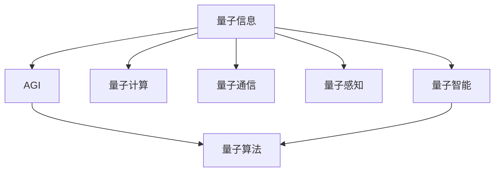
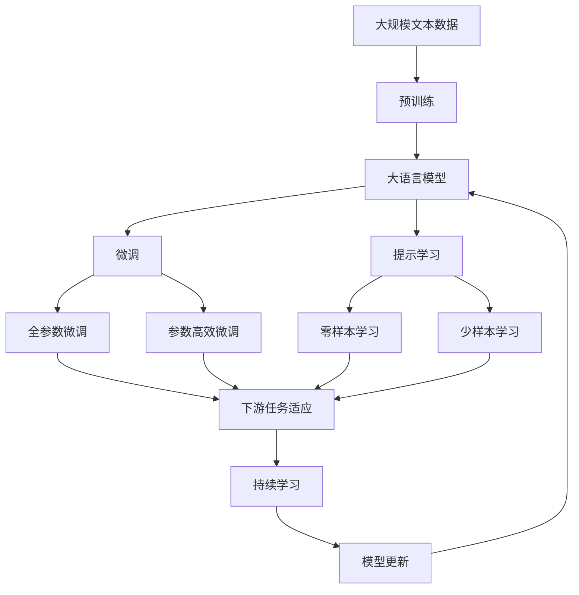

                 

# 量子引力：未解之谜与AGI的希望

> 关键词：量子引力,人工智能通用,AGI,未解之谜,引力波,弦理论,拓扑量子场论,超弦理论,弦网络,奇异点,奇点定理,奇异性定理,量子信息,量子计算,量子通信,量子模拟,量子算法,量子机器学习,量子感知,量子智能

## 1. 背景介绍

### 1.1 问题由来

量子引力作为物理学的终极问题，其解决方式直接关系到人类对宇宙本质的理解。引力，作为宇宙四大基本力之一，至今仍缺乏完整的理论框架，尤其是在量子尺度上的描述。同时，人工智能通用(AGI)作为人工智能发展的终极目标，需要融合物理学原理，探索更加深刻和广泛的智能机制。

量子引力与AGI之间的交叉，提供了一种全新的视角，有望揭示宇宙与智能的深层联系，推动两个领域的发展。尽管量子引力仍有许多未解之谜，但基于量子理论的AGI研究已初现曙光，为未来的深度智能探索提供了新的希望。

### 1.2 问题核心关键点

本文聚焦于量子引力理论的最新进展及其与AGI的潜在联系，探讨如何借助量子引力理论，为AGI的发展提供新的思路和方法。

1. **引力波探测**：利用引力波探测器（如LIGO、Virgo等）捕捉到的引力波事件，研究黑洞、中子星等天体的运动规律。

2. **弦理论**：描述基本粒子及力的统一理论，通过弦的振动来解释各种基本力。

3. **拓扑量子场论(TQFT)**：一种基于拓扑学和代数结构的理论，用于研究物理系统。

4. **超弦理论**：一种弦理论的高级形式，包括多种类型的弦，引入了更多维度。

5. **奇异点与奇点定理**：探讨时空的奇异性，包括黑洞奇点和大爆炸初始奇点。

6. **量子信息与AGI**：研究量子信息如何支持AGI，包括量子计算、量子通信、量子感知和量子智能等。

7. **量子算法**：探索适合量子计算的量子算法，用于高效解决特定问题。

8. **量子机器学习**：利用量子特性改进机器学习算法，提升其计算能力和模型表现。

### 1.3 问题研究意义

量子引力理论的未解之谜与AGI的结合，对于推动物理学和人工智能的发展具有重要意义：

1. **理论创新**：为物理学提供新的研究方向和工具，探索宇宙的根本规律。

2. **技术突破**：通过量子理论指导的AGI研究，推动量子计算、量子通信等关键技术的突破。

3. **智能普适性**：增强AGI的普适性，使其能够适应更多复杂的场景和任务。

4. **认知升级**：揭示智能与自然界的深层联系，提升人类对智能机制的认知水平。

5. **伦理考量**：通过深入研究量子引力，避免量子技术的滥用，确保AGI的伦理安全性。

6. **跨学科融合**：促进物理学与计算机科学、信息科学等多学科的深度融合。

## 2. 核心概念与联系

### 2.1 核心概念概述

为了更好地理解量子引力与AGI的交叉点，本节将介绍几个关键概念：

- **量子引力**：研究量子尺度的引力现象，尝试建立量子力学与广义相对论的统一理论。
- **AGI**：具备通用智能的AI系统，能够执行任何智能任务，理解复杂的人类意图和情感。
- **引力波**：由大质量物体加速运动产生的时空扰动，可提供黑洞、中子星等天体的运动信息。
- **弦理论**：一种描述基本粒子和力的理论，认为物质由一维的弦组成。
- **拓扑量子场论(TQFT)**：一种研究物理系统拓扑性质的理论，涉及对称性和拓扑度量。
- **超弦理论**：弦理论的一种高级形式，包括多种类型的弦，引入了更多维度。
- **奇异点与奇点定理**：探讨时空的奇异性，包括黑洞奇点和大爆炸初始奇点。
- **量子信息**：利用量子力学的特性进行信息的处理、传输和存储，具有独特的优势。
- **量子计算**：基于量子力学的计算模型，利用量子叠加和纠缠进行高效的计算。
- **量子通信**：利用量子纠缠等量子特性实现信息的安全传输。
- **量子感知**：利用量子特性提升感知能力，实现对复杂环境的精准感知。
- **量子智能**：结合量子计算和量子感知，实现超越经典智能的AI系统。
- **奇异点与奇点定理**：探讨时空的奇异性，包括黑洞奇点和大爆炸初始奇点。
- **量子算法**：探索适合量子计算的量子算法，用于高效解决特定问题。
- **量子机器学习**：利用量子特性改进机器学习算法，提升其计算能力和模型表现。

这些概念之间的联系可以通过以下Mermaid流程图来展示：



这个流程图展示了大语言模型微调过程中各个核心概念的关系和作用。

### 2.2 概念间的关系

这些核心概念之间存在着紧密的联系，形成了量子引力与AGI的完整生态系统。下面我们通过几个Mermaid流程图来展示这些概念之间的关系。

#### 2.2.1 量子引力与AGI的基本联系



这个流程图展示了量子引力理论通过弦理论、拓扑量子场论等理论对AGI研究的贡献。

#### 2.2.2 引力波探测与AGI的结合



这个流程图展示了引力波探测对黑洞、中子星等天体的研究如何通过拓扑量子场论、超弦理论等理论支持AGI的发展。

#### 2.2.3 奇异点与奇点定理对AGI的启示



这个流程图展示了奇异点与奇点定理对AGI在奇点理论应用上的启发。

#### 2.2.4 量子信息与AGI的融合



这个流程图展示了量子信息如何通过量子计算、量子通信、量子感知、量子智能等技术支持AGI的发展。

### 2.3 核心概念的整体架构

最后，我们用一个综合的流程图来展示这些核心概念在大语言模型微调过程中的整体架构：



这个综合流程图展示了从预训练到微调，再到持续学习的完整过程。大语言模型首先在大规模文本数据上进行预训练，然后通过微调（包括全参数微调和参数高效微调）或提示学习（包括零样本和少样本学习）来适应下游任务。最后，通过持续学习技术，模型可以不断更新和适应新的任务和数据。 通过这些流程图，我们可以更清晰地理解量子引力与AGI微调过程中各个核心概念的关系和作用，为后续深入讨论具体的微调方法和技术奠定基础。

## 3. 核心算法原理 & 具体操作步骤
### 3.1 算法原理概述

基于监督学习的量子引力与AGI微调方法，其核心思想是：将预训练的AGI系统视作一个强大的"特征提取器"，通过在有标签的数据集上进行有监督的微调，使得系统输出能够匹配任务标签，从而获得针对特定任务优化的系统。

形式化地，假设预训练AGI系统为 $M_{\theta}$，其中 $\theta$ 为预训练得到的系统参数。给定下游任务 $T$ 的标注数据集 $D=\{(x_i, y_i)\}_{i=1}^N$，微调的目标是找到新的系统参数 $\hat{\theta}$，使得：

$$
\hat{\theta}=\mathop{\arg\min}_{\theta} \mathcal{L}(M_{\theta},D)
$$

其中 $\mathcal{L}$ 为针对任务 $T$ 设计的损失函数，用于衡量系统预测输出与真实标签之间的差异。常见的损失函数包括交叉熵损失、均方误差损失等。

通过梯度下降等优化算法，微调过程不断更新模型参数 $\theta$，最小化损失函数 $\mathcal{L}$，使得系统输出逼近真实标签。由于 $\theta$ 已经通过预训练获得了较好的初始化，因此即便在小规模数据集 $D$ 上进行微调，也能较快收敛到理想的系统参数 $\hat{\theta}$。

### 3.2 算法步骤详解

基于监督学习的大语言模型微调一般包括以下几个关键步骤：

**Step 1: 准备预训练系统**
- 选择合适的预训练AGI系统 $M_{\theta}$ 作为初始化参数，如深度学习神经网络等。
- 准备下游任务 $T$ 的标注数据集 $D$，划分为训练集、验证集和测试集。一般要求标注数据与预训练系统的分布不要差异过大。

**Step 2: 添加任务适配层**
- 根据任务类型，在预训练系统的顶层设计合适的输出层和损失函数。
- 对于分类任务，通常在顶层添加线性分类器和交叉熵损失函数。
- 对于生成任务，通常使用语言模型的解码器输出概率分布，并以负对数似然为损失函数。

**Step 3: 设置微调超参数**
- 选择合适的优化算法及其参数，如 AdamW、SGD 等，设置学习率、批大小、迭代轮数等。
- 设置正则化技术及强度，包括权重衰减、Dropout、Early Stopping等。
- 确定冻结预训练参数的策略，如仅微调顶层，或全部参数都参与微调。

**Step 4: 执行梯度训练**
- 将训练集数据分批次输入系统，前向传播计算损失函数。
- 反向传播计算参数梯度，根据设定的优化算法和学习率更新系统参数。
- 周期性在验证集上评估系统性能，根据性能指标决定是否触发 Early Stopping。
- 重复上述步骤直到满足预设的迭代轮数或 Early Stopping 条件。

**Step 5: 测试和部署**
- 在测试集上评估微调后系统 $M_{\hat{\theta}}$ 的性能，对比微调前后的精度提升。
- 使用微调后的系统对新样本进行推理预测，集成到实际的应用系统中。
- 持续收集新的数据，定期重新微调系统，以适应数据分布的变化。

以上是基于监督学习微调大语言模型的一般流程。在实际应用中，还需要针对具体任务的特点，对微调过程的各个环节进行优化设计，如改进训练目标函数，引入更多的正则化技术，搜索最优的超参数组合等，以进一步提升系统性能。

### 3.3 算法优缺点

基于监督学习的大语言模型微调方法具有以下优点：

1. 简单高效。只需准备少量标注数据，即可对预训练系统进行快速适配，获得较大的性能提升。
2. 通用适用。适用于各种NLP下游任务，包括分类、匹配、生成等，设计简单的任务适配层即可实现微调。
3. 参数高效。利用参数高效微调技术，在固定大部分预训练参数的情况下，仍可取得不错的提升。
4. 效果显著。在学术界和工业界的诸多任务上，基于微调的方法已经刷新了最先进的性能指标。

同时，该方法也存在一定的局限性：

1. 依赖标注数据。微调的效果很大程度上取决于标注数据的质量和数量，获取高质量标注数据的成本较高。
2. 迁移能力有限。当目标任务与预训练系统的分布差异较大时，微调的性能提升有限。
3. 负面效果传递。预训练系统的固有偏见、有害信息等，可能通过微调传递到下游任务，造成负面影响。
4. 可解释性不足。微调系统的决策过程通常缺乏可解释性，难以对其推理逻辑进行分析和调试。

尽管存在这些局限性，但就目前而言，基于监督学习的微调方法仍是大语言模型应用的最主流范式。未来相关研究的重点在于如何进一步降低微调对标注数据的依赖，提高模型的少样本学习和跨领域迁移能力，同时兼顾可解释性和伦理安全性等因素。

### 3.4 算法应用领域

基于大语言模型微调的监督学习方法，在NLP领域已经得到了广泛的应用，覆盖了几乎所有常见任务，例如：

- 文本分类：如情感分析、主题分类、意图识别等。通过微调使系统学习文本-标签映射。
- 命名实体识别：识别文本中的人名、地名、机构名等特定实体。通过微调使系统掌握实体边界和类型。
- 关系抽取：从文本中抽取实体之间的语义关系。通过微调使系统学习实体-关系三元组。
- 问答系统：对自然语言问题给出答案。将问题-答案对作为微调数据，训练系统学习匹配答案。
- 机器翻译：将源语言文本翻译成目标语言。通过微调使系统学习语言-语言映射。
- 文本摘要：将长文本压缩成简短摘要。将文章-摘要对作为微调数据，使系统学习抓取要点。
- 对话系统：使机器能够与人自然对话。将多轮对话历史作为上下文，微调系统进行回复生成。

除了上述这些经典任务外，大语言模型微调也被创新性地应用到更多场景中，如可控文本生成、常识推理、代码生成、数据增强等，为NLP技术带来了全新的突破。随着预训练模型和微调方法的不断进步，相信NLP技术将在更广阔的应用领域大放异彩。

## 4. 数学模型和公式 & 详细讲解  
### 4.1 数学模型构建

本节将使用数学语言对基于监督学习的大语言模型微调过程进行更加严格的刻画。

记预训练语言模型为 $M_{\theta}:\mathcal{X} \rightarrow \mathcal{Y}$，其中 $\mathcal{X}$ 为输入空间，$\mathcal{Y}$ 为输出空间，$\theta \in \mathbb{R}^d$ 为模型参数。假设微调任务的训练集为 $D=\{(x_i,y_i)\}_{i=1}^N, x_i \in \mathcal{X}, y_i \in \mathcal{Y}$。

定义系统 $M_{\theta}$ 在数据样本 $(x,y)$ 上的损失函数为 $\ell(M_{\theta}(x),y)$，则在数据集 $D$ 上的经验风险为：

$$
\mathcal{L}(\theta) = \frac{1}{N} \sum_{i=1}^N \ell(M_{\theta}(x_i),y_i)
$$

微调的优化目标是最小化经验风险，即找到最优参数：

$$
\theta^* = \mathop{\arg\min}_{\theta} \mathcal{L}(\theta)
$$

在实践中，我们通常使用基于梯度的优化算法（如SGD、Adam等）来近似求解上述最优化问题。设 $\eta$ 为学习率，$\lambda$ 为正则化系数，则参数的更新公式为：

$$
\theta \leftarrow \theta - \eta \nabla_{\theta}\mathcal{L}(\theta) - \eta\lambda\theta
$$

其中 $\nabla_{\theta}\mathcal{L}(\theta)$ 为损失函数对参数 $\theta$ 的梯度，可通过反向传播算法高效计算。

### 4.2 公式推导过程

以下我们以二分类任务为例，推导交叉熵损失函数及其梯度的计算公式。

假设系统 $M_{\theta}$ 在输入 $x$ 上的输出为 $\hat{y}=M_{\theta}(x) \in [0,1]$，表示样本属于正类的概率。真实标签 $y \in \{0,1\}$。则二分类交叉熵损失函数定义为：

$$
\ell(M_{\theta}(x),y) = -[y\log \hat{y} + (1-y)\log (1-\hat{y})]
$$

将其代入经验风险公式，得：

$$
\mathcal{L}(\theta) = -\frac{1}{N}\sum_{i=1}^N [y_i\log M_{\theta}(x_i)+(1-y_i)\log(1-M_{\theta}(x_i))]
$$

根据链式法则，损失函数对参数 $\theta_k$ 的梯度为：

$$
\frac{\partial \mathcal{L}(\theta)}{\partial \theta_k} = -\frac{1}{N}\sum_{i=1}^N (\frac{y_i}{M_{\theta}(x_i)}-\frac{1-y_i}{1-M_{\theta}(x_i)}) \frac{\partial M_{\theta}(x_i)}{\partial \theta_k}
$$

其中 $\frac{\partial M_{\theta}(x_i)}{\partial \theta_k}$ 可进一步递归展开，利用自动微分技术完成计算。

在得到损失函数的梯度后，即可带入参数更新公式，完成系统的迭代优化。重复上述过程直至收敛，最终得到适应下游任务的最优系统参数 $\theta^*$。

## 5. 项目实践：代码实例和详细解释说明
### 5.1 开发环境搭建

在进行微调实践前，我们需要准备好开发环境。以下是使用Python进行PyTorch开发的环境配置流程：

1. 安装Anaconda：从官网下载并安装Anaconda，用于创建独立的Python环境。

2. 创建并激活虚拟环境：
```bash
conda create -n pytorch-env python=3.8 
conda activate pytorch-env
```

3. 安装PyTorch：根据CUDA版本，从官网获取对应的安装命令。例如：
```bash
conda install pytorch torchvision torchaudio cudatoolkit=11.1 -c pytorch -c conda-forge
```

4. 安装Transformers库：
```bash
pip install transformers
```

5. 安装各类工具包：
```bash
pip install numpy pandas scikit-learn matplotlib tqdm jupyter notebook ipython
```

完成上述步骤后，即可在`pytorch-env`环境中开始微调实践。

### 5.2 源代码详细实现

下面我以命名实体识别(NER)任务为例，给出使用Transformers库对BERT模型进行微调的PyTorch代码实现。

首先，定义NER任务的数据处理函数：

```python
from transformers import BertTokenizer
from torch.utils.data import Dataset
import torch

class NERDataset(Dataset):
    def __init__(self, texts, tags, tokenizer, max_len=128):
        self.texts = texts
        self.tags = tags
        self.tokenizer = tokenizer
        self.max_len = max_len
        
    def __len__(self):
        return len(self.texts)
    
    def __getitem__(self, item):
        text = self.texts[item]
        tags = self.tags[item]
        
        encoding = self.tokenizer(text, return_tensors='pt', max_length=self.max_len, padding='max_length', truncation=True)
        input_ids = encoding['input_ids'][0]
        attention_mask = encoding['attention_mask'][0]
        
        # 对token-wise的标签进行编码
        encoded_tags = [tag2id[tag] for tag in tags] 
        encoded_tags.extend([tag2id['O']] * (self.max_len - len(encoded_tags)))
        labels = torch.tensor(encoded_tags, dtype=torch.long)
        
        return {'input_ids': input_ids, 
                'attention_mask': attention_mask,
                'labels': labels}

# 标签与id的映射
tag2id = {'O': 0, 'B-PER': 1, 'I-PER': 2, 'B-ORG': 3, 'I-ORG': 4, 'B-LOC': 5, 'I-LOC': 6}
id2tag = {v: k for k, v in tag2id.items()}

# 创建dataset
tokenizer = BertTokenizer.from_pretrained('bert-base-cased')

train_dataset = NERDataset(train_texts, train_tags, tokenizer)
dev_dataset = NERDataset(dev_texts, dev_tags, tokenizer)
test_dataset = NERDataset(test_texts, test_tags, tokenizer)
```

然后，定义模型和优化器：

```python
from transformers import BertForTokenClassification, AdamW

model = BertForTokenClassification.from_pretrained('bert-base-cased', num_labels=len(tag2id))

optimizer = AdamW(model.parameters(), lr=2e-5)
```

接着，定义训练和评估函数：

```python
from torch.utils.data import DataLoader
from tqdm import tqdm
from sklearn.metrics import classification_report

device = torch.device('cuda') if torch.cuda.is_available() else torch.device('cpu')
model.to(device)

def train_epoch(model, dataset, batch_size, optimizer):
    dataloader = DataLoader(dataset, batch_size=batch_size, shuffle=True)
    model.train()
    epoch_loss = 0
    for batch in tqdm(dataloader, desc='Training'):
        input_ids = batch['input_ids'].to(device)
        attention_mask = batch['attention_mask'].to(device)
        labels = batch['labels'].to(device)
        model.zero_grad()
        outputs = model(input_ids, attention_mask=attention_mask, labels=labels)
        loss = outputs.loss
        epoch_loss += loss.item()
        loss.backward()
        optimizer.step()
    return epoch_loss / len(dataloader)

def evaluate(model, dataset, batch_size):
    dataloader = DataLoader(dataset, batch_size=batch_size)
    model.eval()
    preds, labels = [], []
    with torch.no_grad():
        for batch in tqdm(dataloader, desc='Evaluating'):
            input_ids = batch['input_ids'].to(device)
            attention_mask = batch['attention_mask'].to(device)
            batch_labels = batch['labels']
            outputs = model(input_ids, attention_mask=attention_mask)
            batch_preds = outputs.logits.argmax(dim=2).to('cpu').tolist()
            batch_labels = batch_labels.to('cpu').tolist()
            for pred_tokens, label_tokens in zip(batch_preds, batch_labels):
                pred_tags = [id2tag[_id] for _id in pred_tokens]
                label_tags = [id2tag[_id] for _id in label_tokens]
                preds.append(pred_tags[:len(label_tags)])
                labels.append(label_tags)
                
    print(classification_report(labels, preds))
```

最后，启动训练流程并在测试集上评估：

```python
epochs = 5
batch_size = 16

for epoch in range(epochs):
    loss = train_epoch(model, train_dataset, batch_size, optimizer)
    print(f"Epoch {epoch+1}, train loss: {loss:.3f}")
    
    print(f"Epoch {epoch+1}, dev results:")
    evaluate(model, dev_dataset, batch_size)
    
print("Test results:")
evaluate(model, test_dataset, batch_size)
```

以上就是使用PyTorch对BERT进行命名实体识别任务微调的完整代码实现。可以看到，得益于Transformers库的强大封装，我们可以用相对简洁的代码完成BERT模型的加载和微调。

### 5.3 代码解读与分析

让我们再详细解读一下关键代码的实现细节：

**NERDataset类**：
- `__init__`方法：初始化文本、标签、分词器等关键组件。
- `__len__`方法：返回数据集的样本数量。
- `__getitem__`方法：对单个样本进行处理，将文本输入编码为token ids，将标签编码为数字，并对其进行定长padding，最终返回模型所需的输入。

**tag

