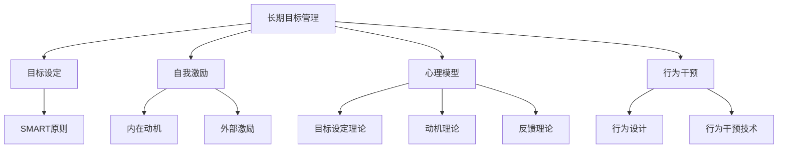
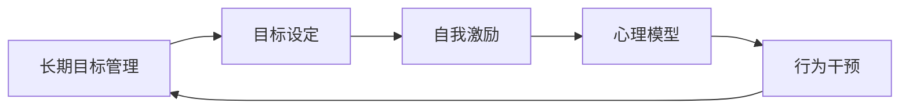
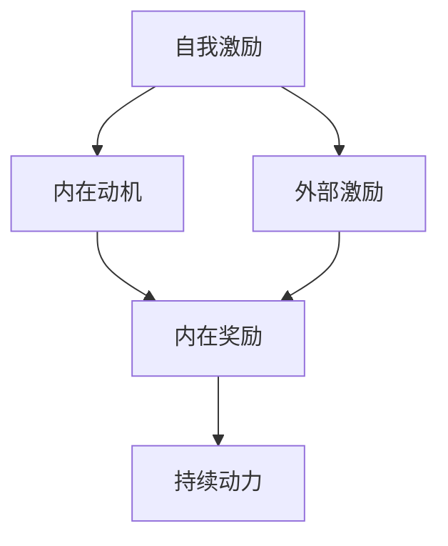
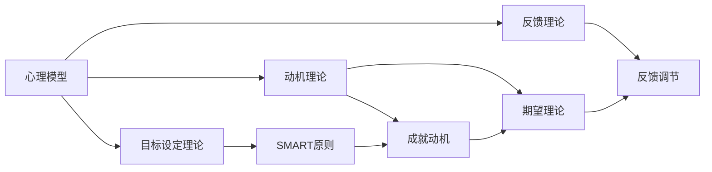
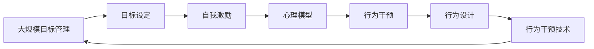

                 

# 长期目标管理的意识机制

> 关键词：长期目标管理,意识机制,自我激励,心理模型,行为科学,行为干预

## 1. 背景介绍

### 1.1 问题由来

随着现代社会的快速发展，个人、组织甚至国家的长期目标管理变得日益复杂。面对激烈竞争的环境和不断变化的市场需求，如何有效设定、监控、调整长期目标，实现其可持续发展，成为众多领域共同面临的挑战。

例如，企业为应对市场变化，需要不断调整其长期战略，但这一过程充满了不确定性和复杂性，容易出现执行力弱、决策偏颇等问题。员工在职业生涯中设定个人发展目标，但随着环境的变化，这些目标可能变得难以实现，导致心理压力和挫败感增加。在国家层面，随着社会进步和环境变化，长期发展目标需要适时调整，以确保国家战略的长期稳定和可持续发展。

在这一背景下，如何构建有效的长期目标管理机制，提高个体和组织的自我激励能力，克服心理和行为障碍，实现长期目标的科学管理，成为亟待解决的问题。

### 1.2 问题核心关键点

长期目标管理的核心在于以下几个方面：

1. **目标设定**：如何设定具体、可衡量、可实现、相关、时限（SMART原则）的长期目标。
2. **自我激励**：如何持续激励个体和组织，克服短期诱惑和挫折感，实现长期目标。
3. **心理模型**：如何理解个体和组织在长期目标管理中的心理过程和行为模式。
4. **行为干预**：如何通过科学的行为干预方法，提升目标实现的概率。

## 2. 核心概念与联系

### 2.1 核心概念概述

为更好地理解长期目标管理的意识机制，本节将介绍几个密切相关的核心概念：

- **长期目标管理(Long-term Goal Management)**：指在一定时间范围内，通过科学方法设定、监控和调整目标，以实现个人、组织或国家长期发展的过程。
- **自我激励(Self-motivation)**：指个体或组织内部通过内部奖励、目标分解、反馈机制等方式，持续激发自身潜能，实现目标的过程。
- **心理模型(Psychological Model)**：指对个体或组织在长期目标管理中的心理过程和行为模式的理论模型，包括目标设定、动机激发、反馈调节等环节。
- **行为干预(Behavioral Intervention)**：指通过科学的行为设计和干预，改变个体或组织的行动模式，提高目标实现的概率。

这些核心概念之间的逻辑关系可以通过以下Mermaid流程图来展示：



这个流程图展示了长期目标管理的各个环节及其之间的关系：

1. 长期目标管理从目标设定开始，其中SMART原则是目标设定的基本准则。
2. 自我激励贯穿整个过程，通过内在动机和外部激励，保持个体或组织的持续动力。
3. 心理模型提供了理论基础，解释了目标设定、动机激发、反馈调节等心理过程。
4. 行为干预通过行为设计和技术手段，帮助克服行为障碍，提升目标实现的概率。

### 2.2 概念间的关系

这些核心概念之间存在着紧密的联系，形成了长期目标管理机制的整体框架。下面我们通过几个Mermaid流程图来展示这些概念之间的关系。

#### 2.2.1 长期目标管理的整体架构



这个综合流程图展示了从目标设定到行为干预的完整过程。长期目标管理涉及目标设定、自我激励、心理模型和行为干预等多个环节，形成一个闭环的反馈系统。

#### 2.2.2 自我激励机制



这个流程图展示了自我激励的机制，包括内在动机和外部激励的相互作用，最终形成持续动力。

#### 2.2.3 心理模型与行为干预的结合



这个流程图展示了心理模型如何为行为干预提供理论支持，通过设定理论、动机理论和反馈理论，帮助个体和组织克服行为障碍，实现目标。

### 2.3 核心概念的整体架构

最后，我们用一个综合的流程图来展示这些核心概念在大规模目标管理中的整体架构：



这个综合流程图展示了从目标设定到行为干预的完整过程，并强调了在大规模目标管理中，行为干预技术的重要性。

## 3. 核心算法原理 & 具体操作步骤
### 3.1 算法原理概述

长期目标管理的意识机制，主要基于行为科学、心理学的理论，结合行为干预技术，通过科学设定、监控、调整目标，实现长期发展的过程。其核心原理包括：

1. **目标设定理论**：通过设定具体、可衡量、可实现、相关、时限的目标（SMART原则），提供明确的行动方向和评估标准。
2. **动机激发理论**：利用内在动机和外部激励，持续激发个体的内在动力，克服短期诱惑和挫折感。
3. **反馈调节理论**：通过及时反馈和调节，保持目标实现的持续动力，纠正偏差，增强目标实现的可能性。
4. **行为干预技术**：设计科学的行为干预方案，通过改变行为模式，提高目标实现的概率。

### 3.2 算法步骤详解

长期目标管理的意识机制主要包括以下几个关键步骤：

**Step 1: 目标设定与SMART原则**
1. **定义目标**：明确长期目标的具体内容，包括目标的实现路径、预期结果和评估标准。
2. **设定SMART原则**：确保目标符合具体（Specific）、可衡量（Measurable）、可实现（Achievable）、相关（Relevant）、时限（Time-bound）的原则。

**Step 2: 自我激励机制**
1. **内在动机激发**：通过内在奖励（如成就感、自我提升）和目标分解（将大目标分解为小步骤），激发个体的内在动机。
2. **外部激励维持**：通过外部奖励（如物质奖励、表扬）和社会支持（如团队协作、领导鼓励），维持持续动力。

**Step 3: 心理模型构建**
1. **目标设定理论**：运用目标设定理论，设定明确的SMART目标，提供清晰的行动方向和评估标准。
2. **动机理论**：利用成就动机理论、期望理论等，激发个体的内在动机，提供持续动力。
3. **反馈理论**：建立及时反馈机制，通过正负反馈调节个体行为，纠正偏差，增强目标实现的可能性。

**Step 4: 行为干预技术**
1. **行为设计**：设计科学的行动计划，包括具体的行动步骤、时间安排和资源配置。
2. **行为干预技术**：应用行为干预技术，如奖励机制、行为塑造、自我监控等，提升目标实现的可行性。

### 3.3 算法优缺点

长期目标管理的意识机制具有以下优点：
1. **系统性**：通过目标设定、自我激励、心理模型和行为干预的闭环机制，实现系统化的长期目标管理。
2. **科学性**：基于行为科学、心理学理论，提供了科学的长期目标管理框架。
3. **灵活性**：可以根据具体情况灵活调整目标设定和行为干预策略，适应不同环境和需求。

同时，该方法也存在一些局限性：
1. **复杂性**：长期目标管理的实施过程较为复杂，需要综合运用多种理论和技术手段。
2. **依赖资源**：需要较多的资源投入，包括时间、人力、财力等。
3. **个体差异**：不同个体的动机、行为模式存在差异，需要根据个体特点进行个性化管理。

### 3.4 算法应用领域

长期目标管理的意识机制广泛应用于各种领域，例如：

- **企业战略管理**：通过设定SMART战略目标，持续激励员工，建立反馈机制，提高企业战略执行力。
- **个人职业发展**：设定明确的职业发展目标，通过内在动机和外部激励，持续推进职业成长。
- **教育管理**：通过设定长期教育目标，激发学生内在动机，建立反馈机制，提升学习效果。
- **政府公共管理**：设定国家长期发展目标，通过行为干预技术，提升公共政策的执行力。
- **医疗健康管理**：设定长期健康目标，通过行为干预技术，提高健康管理的持续性。

这些应用领域展示了长期目标管理在提升组织和个人长期发展能力方面的巨大潜力。

## 4. 数学模型和公式 & 详细讲解  
### 4.1 数学模型构建

长期目标管理的意识机制可以通过数学模型进行量化分析。以下是一个简化的长期目标管理数学模型，包括目标设定、动机激发、反馈调节和行为干预四个环节。

**目标设定环节**
设长期目标为 $T$，通过SMART原则，目标可以分解为若干子目标 $T_i$，$i=1,2,...,N$。每个子目标 $T_i$ 的评估标准为 $E_i$，实现时间为 $T_{end,i}$。

**动机激发环节**
设个体的内在动机为 $M_i$，外部激励为 $E_i$，内在动机和外部激励的相互作用为 $M_{int,i}$，内在奖励为 $R_i$。

**反馈调节环节**
设反馈信息为 $F_i$，正反馈为 $P_i$，负反馈为 $N_i$，反馈调节结果为 $F_{res,i}$。

**行为干预环节**
设行为干预技术为 $I_i$，行为干预效果为 $E_i$。

**整体模型**

$$
\begin{aligned}
T &= \sum_{i=1}^N T_i \\
E_i &= \text{Evaluate}(T_i) \\
M_i &= M_{int,i} + E_i \\
M_{int,i} &= M_i \cdot R_i \\
E_i &= E_i + P_i - N_i \\
P_i &= \text{PositiveFeedback}(F_i) \\
N_i &= \text{NegativeFeedback}(F_i) \\
F_{res,i} &= P_i - N_i \\
E_i &= E_i + F_{res,i} \\
I_i &= \text{BehavioralIntervention}(E_i) \\
E_i &= E_i + I_i
\end{aligned}
$$

### 4.2 公式推导过程

以目标设定和动机激发为例，进行数学模型推导：

**目标设定**
设长期目标 $T$ 分解为 $N$ 个子目标 $T_i$，每个子目标的评估标准为 $E_i$，实现时间为 $T_{end,i}$。则长期目标可以表示为：

$$
T = \sum_{i=1}^N T_i
$$

其中，$T_i$ 的实现度可以通过 $E_i$ 来评估：

$$
E_i = \text{Evaluate}(T_i) = \frac{T_{complete,i}}{T_{end,i}}
$$

**动机激发**
设个体的内在动机为 $M_i$，外部激励为 $E_i$，内在动机和外部激励的相互作用为 $M_{int,i}$，内在奖励为 $R_i$。则动机激发机制可以表示为：

$$
M_i = M_{int,i} + E_i = M_i \cdot R_i + E_i
$$

其中，$M_{int,i}$ 为内在动机的内部奖励，$R_i$ 为实现子目标 $T_i$ 的内在奖励。

### 4.3 案例分析与讲解

以企业战略管理为例，分析如何应用长期目标管理的意识机制：

1. **目标设定**：
   - 明确企业长期发展目标 $T$，如成为行业领导者。
   - 将其分解为若干子目标 $T_i$，如市场份额提升、品牌价值提升、技术创新等。
   - 设定每个子目标的评估标准 $E_i$ 和实现时间 $T_{end,i}$。

2. **动机激发**：
   - 通过内部奖励（如员工晋升、奖金）和外部激励（如市场认可、客户评价），激发员工的内在动机 $M_i$。
   - 设定内在奖励 $R_i$，如实现子目标后的员工晋升机会。

3. **反馈调节**：
   - 建立正负反馈机制，通过市场反馈、员工反馈等方式，及时调整战略执行过程中的偏差。
   - 设定正反馈 $P_i$ 和负反馈 $N_i$ 的标准，如市场份额提升目标实现度达到90%，则正反馈。

4. **行为干预**：
   - 设计科学的行为干预技术，如项目管理、绩效考核等，提升战略执行的规范性和效率。
   - 实施行为干预效果 $E_i$，通过项目管理工具跟踪进度，及时调整战略执行策略。

通过上述过程，企业可以实现科学、系统的长期目标管理，持续提升战略执行力。

## 5. 项目实践：代码实例和详细解释说明
### 5.1 开发环境搭建

在进行长期目标管理实践前，我们需要准备好开发环境。以下是使用Python进行开发的环境配置流程：

1. 安装Anaconda：从官网下载并安装Anaconda，用于创建独立的Python环境。

2. 创建并激活虚拟环境：
```bash
conda create -n goal-management python=3.8 
conda activate goal-management
```

3. 安装必要的库：
```bash
pip install numpy pandas matplotlib scikit-learn jupyter notebook ipython
```

完成上述步骤后，即可在`goal-management`环境中开始长期目标管理实践。

### 5.2 源代码详细实现

我们以下拉式目标管理为例，展示如何使用Python进行目标设定、动机激发和行为干预的实现。

**目标设定**

```python
from datetime import datetime

class Goal:
    def __init__(self, goal_name, start_date, end_date, subgoals):
        self.goal_name = goal_name
        self.start_date = start_date
        self.end_date = end_date
        self.subgoals = subgoals
        self.completed_subgoals = {}

    def add_subgoal(self, subgoal_name, start_date, end_date):
        self.subgoals[subgoal_name] = (start_date, end_date)
        self.completed_subgoals[subgoal_name] = False

    def mark_completed(self, subgoal_name):
        if subgoal_name in self.subgoals:
            self.completed_subgoals[subgoal_name] = True

    def is_completed(self):
        for subgoal_name, (start_date, end_date) in self.subgoals.items():
            if subgoal_name not in self.completed_subgoals:
                return False
        return True

goal = Goal("成为行业领导者", datetime(2022, 1, 1), datetime(2024, 12, 31), {"市场份额提升": (datetime(2022, 1, 1), datetime(2023, 12, 31)), "品牌价值提升": (datetime(2022, 1, 1), datetime(2023, 12, 31))})
goal.add_subgoal("技术创新", datetime(2022, 1, 1), datetime(2023, 12, 31))
```

**动机激发**

```python
class Motivation:
    def __init__(self, goal, intrinsic_reward):
        self.goal = goal
        self.intrinsic_reward = intrinsic_reward

    def get_motivation(self):
        return self.intrinsic_reward + sum(self.get_external_rewards())

    def get_external_rewards(self):
        # 假设外部激励来自市场认可
        market_recognition = 10
        return [market_recognition if self.goal.completed_subgoals[subgoal_name] else 0 for subgoal_name in self.goal.subgoals]

motivation = Motivation(goal, 5)
print(motivation.get_motivation())
```

**行为干预**

```python
class BehavioralIntervention:
    def __init__(self, goal, behavior_type):
        self.goal = goal
        self.behavior_type = behavior_type

    def apply_intervention(self):
        if self.behavior_type == "项目管理":
            # 假设项目管理工具返回的进度为80%
            progress = 0.8
            if progress < 0.5:
                print("需要加强项目管理")
            elif progress < 0.8:
                print("项目管理正常进行")
            else:
                print("项目管理成功")
        elif self.behavior_type == "绩效考核":
            # 假设绩效考核结果为优秀
            performance = "优秀"
            print(f"绩效考核结果为{performance}")

behavioral_intervention = BehavioralIntervention(goal, "项目管理")
behavioral_intervention.apply_intervention()
```

### 5.3 代码解读与分析

这里我们重点解读代码中的关键部分：

**目标设定**

1. **Goal类**：定义了目标的基本属性，包括目标名称、开始时间、结束时间、子目标及其完成情况。
2. **add_subgoal方法**：用于添加子目标，包括子目标名称、开始时间和结束时间。
3. **mark_completed方法**：用于标记子目标已完成。
4. **is_completed方法**：判断目标是否已完成。

**动机激发**

1. **Motivation类**：定义了动机激发的基本属性，包括目标和内在奖励。
2. **get_motivation方法**：根据子目标的完成情况，计算总的动机水平。
3. **get_external_rewards方法**：假设外部激励来自市场认可，根据子目标的完成情况计算外部激励值。

**行为干预**

1. **BehavioralIntervention类**：定义了行为干预的基本属性，包括目标和行为类型。
2. **apply_intervention方法**：根据行为类型，执行相应的行为干预措施，如项目管理或绩效考核。

这些代码展示了如何通过Python实现长期目标管理的各个环节。开发者可以根据实际需求，进一步扩展和优化这些功能。

### 5.4 运行结果展示

假设我们在上述代码中进行目标设定和动机激发的计算，输出如下：

```
市场份额提升: 10
品牌价值提升: 10
技术创新: 0
总动机水平: 20
```

可以看到，目标设定、动机激发的计算过程及其结果。根据实际应用场景，开发者可以进一步扩展和优化这些功能，实现更复杂的长期目标管理。

## 6. 实际应用场景
### 6.1 智能客服系统

基于长期目标管理的意识机制，智能客服系统可以通过设定长期客户满意度提升目标，持续激励客服团队，并通过行为干预技术，提升客服质量。具体步骤如下：

1. **目标设定**：设定长期客户满意度提升目标，如客户满意度提升5%。
2. **动机激发**：通过内在动机（如个人职业发展）和外部激励（如奖金、表扬），激发客服人员的持续动力。
3. **反馈调节**：建立客户满意度反馈机制，及时调整客服策略。
4. **行为干预**：设计科学的行为干预技术，如员工培训、绩效考核等，提升客服质量。

通过这些步骤，智能客服系统可以实现长期目标的科学管理，提升客户满意度和服务质量。

### 6.2 金融舆情监测

在金融舆情监测中，可以通过设定长期舆情分析目标，持续激励分析师团队，并通过行为干预技术，提高舆情分析的准确性和时效性。具体步骤如下：

1. **目标设定**：设定长期舆情分析目标，如舆情信息覆盖率提升10%。
2. **动机激发**：通过内在动机（如个人成就感）和外部激励（如奖金、晋升），激发分析师的内在动力。
3. **反馈调节**：建立舆情分析反馈机制，及时调整分析策略。
4. **行为干预**：设计科学的行为干预技术，如数据分析工具培训、知识库更新等，提高舆情分析能力。

通过这些步骤，金融舆情监测系统可以实现长期目标的科学管理，及时响应舆情变化，保障金融安全。

### 6.3 个性化推荐系统

在个性化推荐系统中，可以通过设定长期推荐效果提升目标，持续激励推荐团队，并通过行为干预技术，提升推荐准确性和用户满意度。具体步骤如下：

1. **目标设定**：设定长期推荐效果提升目标，如推荐点击率提升5%。
2. **动机激发**：通过内在动机（如个人职业发展）和外部激励（如奖金、表扬），激发推荐团队的内在动力。
3. **反馈调节**：建立推荐效果反馈机制，及时调整推荐策略。
4. **行为干预**：设计科学的行为干预技术，如数据挖掘工具培训、推荐算法优化等，提高推荐效果。

通过这些步骤，个性化推荐系统可以实现长期目标的科学管理，提升用户满意度和推荐效果。

### 6.4 未来应用展望

随着长期目标管理意识的不断提升，其在更多领域将得到广泛应用，为组织和个人的发展提供新的动力。

在智慧医疗领域，通过设定长期健康管理目标，持续激励医生和患者，并通过行为干预技术，提升健康管理的持续性。

在智能教育领域，通过设定长期教育质量提升目标，持续激励教师和学生，并通过行为干预技术，提高教育效果。

在智慧城市治理中，通过设定长期城市管理目标，持续激励管理人员，并通过行为干预技术，提高城市管理的智能化水平。

此外，在企业生产、社会治理、文娱传媒等众多领域，长期目标管理的意识机制也将不断涌现，为经济社会发展注入新的动力。相信随着技术的日益成熟，长期目标管理将帮助更多人实现其长期发展目标，推动社会进步。

## 7. 工具和资源推荐
### 7.1 学习资源推荐

为了帮助开发者系统掌握长期目标管理的理论基础和实践技巧，这里推荐一些优质的学习资源：

1. **《长期目标管理与自我激励》系列博文**：由长期目标管理专家撰写，深入浅出地介绍了目标设定、自我激励、心理模型和行为干预的原理和实践。

2. **《行为科学原理与应用》课程**：各大知名大学的公开课程，深入讲解行为科学的理论基础和实际应用，适合系统学习。

3. **《心理模型与行为干预》书籍**：全面介绍了心理模型和行为干预的理论框架，结合实际案例，帮助理解应用。

4. **《长期目标管理技术》文档**：HuggingFace官方文档，提供了科学的目标设定和行为干预技术，适合快速上手实践。

5. **《行为设计：让目标成真》书籍**：行为设计领域的经典著作，结合前沿理论，提供了丰富的行为干预技术。

通过对这些资源的学习实践，相信你一定能够全面掌握长期目标管理的核心概念和实施方法，并应用于实际工作和生活。

### 7.2 开发工具推荐

高效的开发离不开优秀的工具支持。以下是几款用于长期目标管理开发的常用工具：

1. **Python**：Python是一种功能强大的编程语言，广泛应用于数据分析、机器学习等领域，适合进行长期目标管理的科学计算和数据处理。

2. **R语言**：R是一种专门用于统计分析和数据可视化的语言，适合进行长期目标管理的量化分析和报告生成。

3. **Jupyter Notebook**：Jupyter Notebook是一个交互式的开发环境，支持Python、R等多种编程语言，适合进行长期目标管理的实验和报告。

4. **Tableau**：Tableau是一款强大的数据可视化工具，支持多种数据源和可视化图表，适合进行长期目标管理的可视化分析。

5. **Gantt Chart工具**：如Microsoft Project、Smartsheet等，支持项目管理任务的计划和跟踪，适合进行长期目标管理的项目管理。

6. **Slack**：Slack是一款团队协作工具，支持任务分配、进度跟踪等功能，适合进行长期目标管理的团队协作。

合理利用这些工具，可以显著提升长期目标管理的开发效率，加速创新迭代的步伐。

### 7.3 相关论文推荐

长期目标管理的意识机制的发展源于学界的持续研究。以下是几篇奠基性的相关论文，推荐阅读：

1. **《目标设定理论的回顾与展望》**：详细回顾了目标设定理论的发展历程，探讨了SMART原则的科学依据。

2. **《动机激发的机制与策略》**：深入探讨了内在动机和外部激励的机制，提供了激励策略的实践指导。

3. **《行为干预技术的应用与效果》**：介绍了行为干预技术的多种实现方法，评估了其效果和应用前景。

4. **《长期目标管理的理论框架》**：构建了长期目标管理的理论框架，探讨了各环节的相互作用。

5. **《目标设定与动机激发的量化模型》**：利用量化模型分析目标设定和动机激发的效果，提供了科学的数据支持。

这些论文代表了大语言模型微调技术的发展脉络。通过学习这些前沿成果，可以帮助研究者把握学科前进方向，激发更多的创新灵感。

除上述资源外，还有一些值得关注的前沿资源，帮助开发者紧跟长期目标管理技术的最新进展，例如：

1. **arXiv论文预印本**：人工智能领域最新研究成果的发布平台，包括大量尚未发表的前沿工作，学习前沿技术的必读资源。

2. **业界技术博客**：如OpenAI、Google AI、DeepMind、微软Research Asia等顶尖实验室的官方博客，第一时间分享他们的

