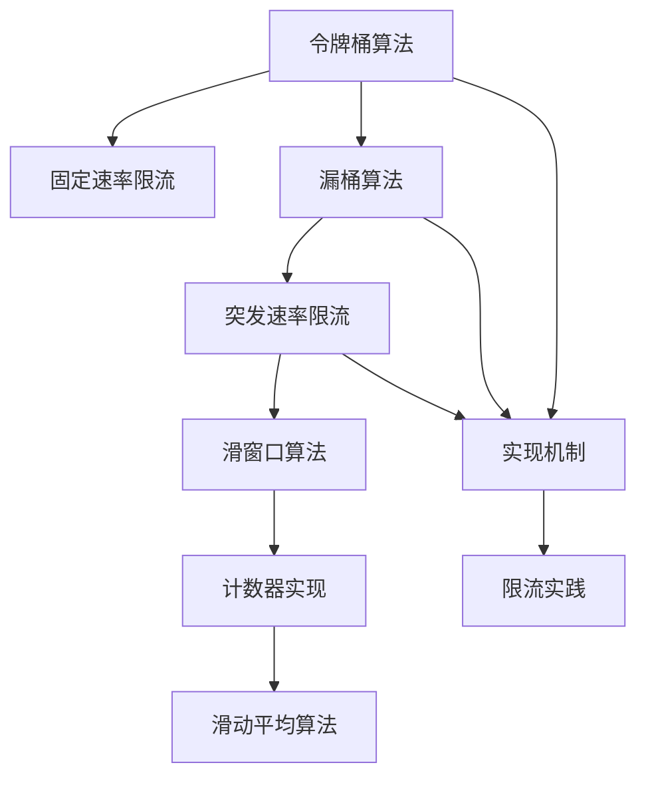

                 

# 限流：防止 DDos 攻击和系统过载

在互联网时代，DDoS（分布式拒绝服务攻击）和系统过载是常见的安全威胁，它们会导致系统崩溃、服务中断、数据泄露等一系列严重后果。限流作为一种基础且有效的防御机制，能够有效应对这些攻击和过载问题，保护系统的稳定运行。本文将深入探讨限流技术的原理、算法、实践，以及未来的发展趋势和挑战。

## 1. 背景介绍

### 1.1 问题由来

随着互联网的快速发展，网络攻击手段也在不断进化。DDoS攻击利用大量伪造请求淹没服务器，使其无法正常响应合法请求，导致服务中断。系统过载则是因为负载过大，如请求暴增、系统故障等，使得服务器无法处理请求，同样导致服务中断。这两种威胁都会严重影响用户体验和业务运营，因此限流技术显得尤为重要。

### 1.2 问题核心关键点

限流技术通过控制请求速率，防止系统过载和DDoS攻击。具体来说，限流分为令牌桶和漏桶两种算法，分别用于固定速率限流和突发速率限流。限流的核心在于如何设计和实现限流算法，以及如何根据业务场景灵活调整参数。

## 2. 核心概念与联系

### 2.1 核心概念概述

为更好地理解限流技术的原理，本文将介绍几个密切相关的核心概念：

- **令牌桶算法(Token Bucket)**：一种固定速率限流算法，通过维护一个固定大小的令牌桶，每次请求都需要从桶中获取一个令牌，若桶为空则请求被拒绝。令牌生成速率与限流速率相同。

- **漏桶算法(Leaky Bucket)**：一种突发速率限流算法，通过维护一个固定大小的桶，每次请求都将令桶容量减少一部分，若桶为空则请求被拒绝。漏桶的减小速率控制了限流速率。

- **滑窗口算法(Sliding Window)**：一种高效的计数器实现方式，通过维护一个固定大小的窗口，记录单位时间内通过的请求数。

- **滑动平均算法(Moving Average)**：一种平滑的平均计算方式，通过加权平均消除短时波动，给出更稳定的速率估计。

这些核心概念之间的逻辑关系可以通过以下Mermaid流程图来展示：



这个流程图展示了大语言模型的核心概念及其之间的关系：

1. 令牌桶和漏桶是两种主要的限流算法。
2. 滑窗口和滑动平均用于计算速率。
3. 实现机制包括计数器和滑动平均。
4. 这些算法和机制被广泛应用于限流实践。

### 2.2 概念间的关系

这些核心概念之间存在着紧密的联系，形成了限流技术的完整生态系统。

- 令牌桶和漏桶是限流算法的基础，它们根据实际业务场景选择使用。
- 滑窗口和滑动平均用于精确计算请求速率。
- 计数器和滑动平均提供了实现的机制。
- 这些算法和机制被集成到具体的限流实践过程中。

## 3. 核心算法原理 & 具体操作步骤

### 3.1 算法原理概述

限流算法的主要目的是控制请求速率，防止系统过载和DDoS攻击。算法的核心在于维护一个速率计数器，当计数器超过阈值时拒绝新请求。

令牌桶算法通过维护一个固定大小的令牌桶，每次请求都需要从桶中获取一个令牌。如果桶为空，则请求被拒绝。令牌生成速率与限流速率相同。

漏桶算法通过维护一个固定大小的桶，每次请求都将令桶容量减少一部分。如果桶为空，则请求被拒绝。漏桶的减小速率控制了限流速率。

### 3.2 算法步骤详解

以令牌桶算法为例，其具体步骤如下：

1. 初始化令牌桶容量为$C$，令牌生成速率为$T$。
2. 每次请求到来时，先检查令牌桶中是否有令牌。
3. 若令牌桶中有令牌，则将令牌移除并处理请求。
4. 若令牌桶中无令牌，则请求被拒绝。
5. 每隔时间$T$，向令牌桶中加入一个令牌。

### 3.3 算法优缺点

令牌桶算法的主要优点在于简单高效，适用于固定速率的请求流。但其缺点在于无法处理突发请求，可能导致请求堆积。

漏桶算法的主要优点在于可以处理突发请求，适用于突发速率的请求流。但其缺点在于需要维护桶容量，增加了实现复杂度。

### 3.4 算法应用领域

限流算法广泛应用于各种业务场景，如Web服务器、API接口、数据库访问等。尤其在高并发、高流量的场景下，限流能够有效保护系统稳定运行。

## 4. 数学模型和公式 & 详细讲解 & 举例说明

### 4.1 数学模型构建

令牌桶算法可以形式化地表示为以下模型：

- 令牌桶容量：$C$
- 令牌生成速率：$T$
- 请求速率：$R$

令牌桶中的令牌数量$T$随时间$t$的变化如下：

$$
T(t) = C + \sum_{i=1}^{t} (R - T)
$$

其中$i$为时间步长。

### 4.2 公式推导过程

令牌桶的平均令牌数$E[T]$为：

$$
E[T] = \frac{C}{T}
$$

令牌桶的方差$Var[T]$为：

$$
Var[T] = \frac{C}{T^2}
$$

令牌桶的概率密度函数为：

$$
f(t) = \frac{1}{\sqrt{Var[T]}} e^{-\frac{(t - \frac{C}{T})^2}{2Var[T]}}
$$

### 4.3 案例分析与讲解

假设令牌桶容量$C=10$，令牌生成速率$T=1$，请求速率$R=2$。令牌桶中令牌数随时间变化如下：

| 时间 | 令牌数 | 请求处理 |
| --- | --- | --- |
| 0 | 10 | 处理 |
| 1 | 9 | 处理 |
| 2 | 8 | 处理 |
| 3 | 7 | 处理 |
| 4 | 6 | 处理 |
| 5 | 5 | 处理 |
| 6 | 4 | 处理 |
| 7 | 3 | 处理 |
| 8 | 2 | 处理 |
| 9 | 1 | 处理 |
| 10 | 0 | 请求被拒绝 |
| 11 | 1 | 处理 |
| 12 | 2 | 处理 |

从上述案例可以看出，令牌桶算法能够有效控制请求速率，防止系统过载。同时，由于令牌生成速率固定，请求速率超过令牌生成速率时，请求被拒绝。

## 5. 项目实践：代码实例和详细解释说明

### 5.1 开发环境搭建

在进行限流实践前，我们需要准备好开发环境。以下是使用Python进行开发的环境配置流程：

1. 安装Anaconda：从官网下载并安装Anaconda，用于创建独立的Python环境。

2. 创建并激活虚拟环境：
```bash
conda create -n limit-env python=3.8 
conda activate limit-env
```

3. 安装必要的库：
```bash
pip install flask gunicorn requests
```

4. 安装限流工具：
```bash
pip install flask-limiter
```

完成上述步骤后，即可在`limit-env`环境中开始限流实践。

### 5.2 源代码详细实现

下面是一个简单的Python Flask应用，使用Flask-Limiter实现令牌桶限流：

```python
from flask import Flask, request
from flask_limiter import Limiter
from flask_limiter.util import get_remote_address

app = Flask(__name__)

limiter = Limiter(app, key_func=get_remote_address)

@app.route('/')
def hello():
    limiter.limit('10/minute')  # 每秒限流10个请求
    return 'Hello, World!'

if __name__ == '__main__':
    app.run(host='0.0.0.0', port=5000)
```

在这个例子中，Flask-Limiter提供了简单易用的装饰器，用于实现限流功能。`limiter.limit()`方法用于指定限流规则，`key_func`用于指定限流规则的key函数，通常为请求IP地址。

### 5.3 代码解读与分析

让我们再详细解读一下关键代码的实现细节：

- `Flask-Limiter`：用于实现限流的Python库，提供了简单易用的装饰器，用于指定限流规则。
- `limiter.limit()`：指定限流规则，其中参数`'10/minute'`表示每秒限流10个请求。
- `key_func`：用于指定限流规则的key函数，通常为请求IP地址。
- `get_remote_address()`：返回请求的IP地址。

### 5.4 运行结果展示

假设我们在测试环境中运行上述代码，可以使用`curl`命令进行测试：

```bash
curl http://localhost:5000/
```

由于限流规则为每秒10个请求，第一次请求会返回`Hello, World!`，但随后的请求会被拒绝，输出`429 Too Many Requests`。

## 6. 实际应用场景

### 6.1 流量控制

在大规模Web应用中，流量控制是限流技术的重要应用场景。如电商网站的促销活动、视频网站的直播频道等，都会面临流量暴增的挑战。通过限流技术，可以有效控制流量，防止系统过载。

在电商网站促销活动中，限流可以防止恶意刷单行为，保护商家利益。视频网站直播频道可以限制用户同时观看的人数，保证用户体验。

### 6.2 资源保护

限流技术可以保护系统资源，防止过度消耗。如数据库连接池、缓存系统、消息队列等。

数据库连接池限制连接数，防止过多的数据库请求导致连接资源耗尽。缓存系统限制缓存的命中率，防止过多的缓存占用内存。消息队列限制队列长度，防止队列爆满。

### 6.3 服务安全

限流技术可以保护服务安全，防止DDoS攻击。限流规则可以根据业务场景灵活设置，防止恶意请求导致服务中断。

在Web服务器中，限流规则可以限制特定IP地址的请求频率。在API接口中，限流规则可以限制特定用户的请求频率。在数据库访问中，限流规则可以限制特定应用或用户的访问频率。

## 7. 工具和资源推荐

### 7.1 学习资源推荐

为了帮助开发者系统掌握限流技术的理论基础和实践技巧，这里推荐一些优质的学习资源：

1. 《计算机网络：自顶向下方法》：这本书详细讲解了网络流量控制和拥塞控制的原理和算法。
2. 《网络安全与隐私》课程：斯坦福大学开设的计算机网络课程，涵盖流量控制和拥塞控制等内容。
3. 《网络编程实战》书籍：讲解了网络编程中的流量控制和拥塞控制。
4. 网络流量控制在线课程：如Coursera、Udacity等平台提供的流量控制课程，讲解流量控制和拥塞控制的原理和算法。

通过对这些资源的学习实践，相信你一定能够快速掌握限流技术的精髓，并用于解决实际的流量控制问题。

### 7.2 开发工具推荐

高效的开发离不开优秀的工具支持。以下是几款用于限流开发的常用工具：

1. Flask-Limiter：用于Flask应用的限流工具，提供了简单易用的装饰器，用于指定限流规则。
2. Nginx：高性能的Web服务器，支持多种限流算法，如令牌桶、漏桶等。
3. HAProxy：高可用性代理服务器，支持多种限流算法，如令牌桶、漏桶等。
4. Google Cloud Armor：Google提供的DDoS防护服务，支持多种限流算法，如令牌桶、漏桶等。

合理利用这些工具，可以显著提升限流任务的开发效率，加快创新迭代的步伐。

### 7.3 相关论文推荐

限流技术的发展源于学界的持续研究。以下是几篇奠基性的相关论文，推荐阅读：

1. ACM-TOC's on Computer Communications Review：一本关于计算机网络的期刊，涵盖流量控制和拥塞控制的经典论文。
2. IEEE Transactions on Networking：一本关于网络流量的期刊，涵盖流量控制和拥塞控制的经典论文。
3. Network Queuing Systems：一本关于网络流量的书籍，涵盖流量控制和拥塞控制的经典理论。
4. Google's Story of Congestion Control：谷歌的拥塞控制论文，详细讲解了Google的拥塞控制算法。
5. Netflix's Akka Streams Congestion Control：Netflix的流量控制论文，详细讲解了Netflix的流量控制算法。

这些论文代表了大语言模型微调技术的发展脉络。通过学习这些前沿成果，可以帮助研究者把握学科前进方向，激发更多的创新灵感。

除上述资源外，还有一些值得关注的前沿资源，帮助开发者紧跟限流技术的最新进展，例如：

1. arXiv论文预印本：人工智能领域最新研究成果的发布平台，包括大量尚未发表的前沿工作，学习前沿技术的必读资源。
2. 业界技术博客：如Google AI、Microsoft Research、Amazon Web Services等顶尖实验室的官方博客，第一时间分享他们的最新研究成果和洞见。
3. 技术会议直播：如SIGCOMM、INFOCOM、ACM SIGCOMM等网络会议现场或在线直播，能够聆听到大佬们的前沿分享，开拓视野。
4. GitHub热门项目：在GitHub上Star、Fork数最多的限流相关项目，往往代表了该技术领域的发展趋势和最佳实践，值得去学习和贡献。
5. 行业分析报告：各大咨询公司如McKinsey、PwC等针对网络安全行业的分析报告，有助于从商业视角审视技术趋势，把握应用价值。

总之，对于限流技术的学习和实践，需要开发者保持开放的心态和持续学习的意愿。多关注前沿资讯，多动手实践，多思考总结，必将收获满满的成长收益。

## 8. 总结：未来发展趋势与挑战

### 8.1 总结

本文对限流技术的原理、算法、实践进行了全面系统的介绍。首先阐述了限流技术的背景和意义，明确了限流在流量控制、资源保护、服务安全等方面的独特价值。其次，从原理到实践，详细讲解了限流数学模型和核心算法，给出了限流任务开发的完整代码实例。同时，本文还广泛探讨了限流技术在Web服务器、数据库、API接口等众多领域的应用前景，展示了限流范式的巨大潜力。最后，本文精选了限流技术的各类学习资源，力求为读者提供全方位的技术指引。

通过本文的系统梳理，可以看到，限流技术在大规模网络应用中具有重要的作用，能有效应对DDoS攻击和系统过载问题，保障系统的稳定运行。未来，伴随限流技术的不懈探索和持续优化，必将在更多场景中发挥关键作用，成为网络安全的重要防线。

### 8.2 未来发展趋势

展望未来，限流技术将呈现以下几个发展趋势：

1. 自动化部署：限流规则的自动生成和部署，减少人工干预，提高效率。
2. 分布式限流：在大规模分布式系统中，限流规则的分布式实现，提高系统鲁棒性。
3. 自适应限流：根据系统负载动态调整限流规则，提高系统稳定性。
4. 多维度限流：根据业务场景和需求，实现多维度限流，如流量、带宽、请求速率等。
5. 高可用性限流：限流规则的高可用性实现，提高系统可靠性。
6. 安全防护限流：引入安全防护机制，防止DDoS攻击和恶意请求。

以上趋势凸显了限流技术的广阔前景。这些方向的探索发展，必将进一步提升网络系统的稳定性和安全性，为构建安全、可靠的网络环境提供有力保障。

### 8.3 面临的挑战

尽管限流技术已经取得了显著成效，但在迈向更加智能化、普适化应用的过程中，它仍面临着诸多挑战：

1. 复杂性增加：随着业务场景的多样化和复杂化，限流规则的制定和调整变得更加困难。
2. 资源消耗：限流规则的实现需要占用大量计算资源，可能影响系统性能。
3. 系统可扩展性：限流规则的实现需要支持大规模分布式系统，可能带来系统可扩展性问题。
4. 动态性不足：限流规则的调整和更新需要人工干预，无法实现动态自适应。
5. 用户体验影响：限流规则的实现可能影响用户体验，需要平衡系统安全和用户体验。

正视限流面临的这些挑战，积极应对并寻求突破，将是限流技术不断优化和发展的必由之路。相信随着学界和产业界的共同努力，这些挑战终将一一被克服，限流技术必将在构建安全、可靠的网络环境中扮演越来越重要的角色。

### 8.4 研究展望

面向未来，限流技术的研究需要在以下几个方面寻求新的突破：

1. 引入机器学习和人工智能技术：通过学习用户行为和请求特征，实现更加智能化的限流规则。
2. 引入大数据和分析技术：通过分析历史流量数据，实现更精确的限流规则。
3. 引入区块链技术：通过区块链的不可篡改性和分布式记账机制，实现更加安全和透明化的限流规则。
4. 引入跨领域技术：通过与其他领域技术的结合，如物联网、云计算等，实现更加全面和高效的限流规则。

这些研究方向的探索，必将引领限流技术迈向更高的台阶，为构建更加安全、可靠的网络环境提供新的技术路径。

## 9. 附录：常见问题与解答

**Q1：限流算法的核心是什么？**

A: 限流算法的核心在于维护一个速率计数器，当计数器超过阈值时拒绝新请求。具体来说，令牌桶算法通过维护一个固定大小的令牌桶，每次请求都需要从桶中获取一个令牌。漏桶算法通过维护一个固定大小的桶，每次请求都将令桶容量减少一部分。

**Q2：如何选择合适的限流算法？**

A: 选择合适的限流算法需要根据业务场景和需求灵活选择。固定速率的请求流适合使用令牌桶算法，突发速率的请求流适合使用漏桶算法。滑窗口算法和滑动平均算法可以用于更精确的速率计算，但实现复杂度较高。

**Q3：限流算法有哪些优缺点？**

A: 令牌桶算法的主要优点在于简单高效，适用于固定速率的请求流。但其缺点在于无法处理突发请求，可能导致请求堆积。漏桶算法的主要优点在于可以处理突发请求，适用于突发速率的请求流。但其缺点在于需要维护桶容量，增加了实现复杂度。

**Q4：限流算法如何应对DDoS攻击？**

A: 限流算法可以通过设置限流规则，防止DDoS攻击。如限制特定IP地址或应用的请求频率，防止大量恶意请求。同时，引入安全防护机制，如IP封锁、流量清洗等，进一步增强系统的安全防护能力。

**Q5：限流算法如何处理系统过载？**

A: 限流算法可以通过设置限流规则，防止系统过载。如限制系统的连接数、数据库请求数、缓存命中率等。同时，引入动态调整机制，根据系统负载动态调整限流规则，提高系统的鲁棒性和稳定性。

总之，限流技术在网络应用中具有重要的作用，能有效应对DDoS攻击和系统过载问题，保障系统的稳定运行。通过不断优化和探索，限流技术必将不断发展和进步，为构建安全、可靠的网络环境提供有力保障。

