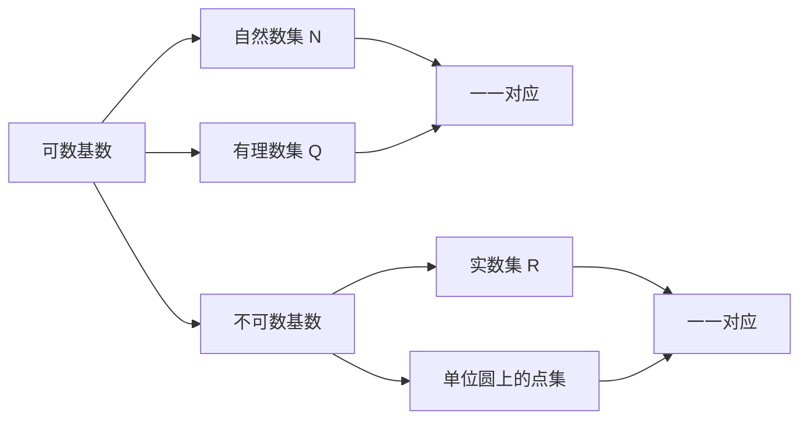

                 

# 集合论导引：不可数基数

> 关键词：集合论, 不可数基数, 连续统假设, 实数集, 连续统, 性质, 维数

## 1. 背景介绍

### 1.1 问题由来

在数学的发展史中，集合论是现代数学的基础，也是数学研究的重要分支。它不仅在数学本身的研究中起到了重要的作用，还在计算机科学、物理学、工程学等领域有着广泛的应用。集合论的核心研究对象是集合，而基数的定义和性质研究则是集合论中的重要部分。

本文旨在介绍集合论中不可数基数的概念、性质及其应用，主要包括以下几个方面：

1. 什么是不可数基数？
2. 不可数基数的性质和应用有哪些？
3. 如何证明实数集的基数为不可数？
4. 连续统假设的意义和影响。

通过本文的学习，读者可以更深入地理解集合论中不可数基数的概念及其相关性质，进一步巩固集合论的基础知识，为后续深入学习奠定基础。

### 1.2 问题核心关键点

不可数基数的概念是集合论中一个重要的概念，它与可数基数相对应。可数基数指的是一一对应的集合，即可以用自然数一一对应表示的集合；而不可数基数则是指无法用自然数一一对应表示的集合。

不可数基数的研究不仅具有重要的理论意义，还具有广泛的应用前景，例如在数理统计、物理学的测地学、计算机科学中的算法设计等方面都有着重要的应用。

## 2. 核心概念与联系

### 2.1 核心概念概述

在集合论中，基数是用来衡量集合规模的概念。如果集合A和集合B可以进行一一对应，那么称这两个集合的基数相等。如果集合A和集合B不能进行一一对应，即集合A中元素无法完全表示在集合B中，那么称A的基数大于B的基数。

可数基数指的是可以用自然数一一对应的集合，例如自然数集N、有理数集Q等。而不可数基数指的是不能用自然数一一对应的集合，例如实数集R、单位圆上的点集等。

### 2.2 核心概念原理和架构的 Mermaid 流程图



这个流程图展示了可数基数和不可数基数的基本概念和架构。可数基数的集合可以通过自然数一一对应表示，而不可数基数的集合则无法通过自然数一一对应表示。

### 2.3 核心概念间的关系

可数基数和不可数基数是集合论中的两个基本概念，它们之间有着紧密的联系和区别。以下是可数基数和不可数基数的几个主要关系：

1. 可数集合的基数是自然数，即|N|=|Q|=1。
2. 可数集合的并集仍然是可数集合，即|A∪B|=|A|+|B|。
3. 可数集合的子集也是可数集合，即|A|≤|B|当A⊆B。
4. 不可数集合的基数大于任何可数集合的基数，即|R|＞|N|。

## 3. 核心算法原理 & 具体操作步骤
### 3.1 算法原理概述

在集合论中，基数的定义是一个重要的概念。基数是用来衡量集合规模的概念，它可以用来比较不同集合的规模大小。如果两个集合可以进行一一对应，那么它们的基数相等；否则，一个集合的基数大于另一个集合的基数。

不可数基数的定义是：如果集合A中的元素无法完全表示在自然数中，那么称A的基数为不可数。在数学中，实数集的基数被证明为不可数。

### 3.2 算法步骤详解

以下是不可数基数的主要算法步骤：

1. 定义集合A和集合B。
2. 对集合A和集合B进行一一对应的验证。
3. 如果集合A和集合B可以进行一一对应，则它们的基数相等。
4. 如果集合A和集合B不能进行一一对应，则集合A的基数为不可数。

### 3.3 算法优缺点

不可数基数的算法具有以下优点：

1. 可以验证集合是否为可数或不可数。
2. 可以比较不同集合的基数大小。
3. 可以验证两个集合是否可以进行一一对应。

不可数基数的算法也存在以下缺点：

1. 对于无限集合，一一对应验证过程比较复杂。
2. 对于非连续的集合，一一对应验证过程较为困难。

### 3.4 算法应用领域

不可数基数的算法应用广泛，主要包括以下几个方面：

1. 数理统计中的抽样方法。
2. 物理学中的测地学。
3. 计算机科学中的算法设计。
4. 数据科学中的数据处理。
5. 数学中的集合论研究。

## 4. 数学模型和公式 & 详细讲解 & 举例说明

### 4.1 数学模型构建

在数学模型中，实数集R的基数是不可数的，而自然数集N的基数是可数的。实数集R中的基数为c，即|R|=c。

实数集R中的基数c的数学模型构建如下：

设A={1,2,3,...}，A'为A的子集，包含无限个元素。则A'⊆A，且|A'|=|A|=1。

设B为A的补集，即B=R\A。则|B|=c。

### 4.2 公式推导过程

以下推导过程展示了实数集R的基数为不可数：

1. 设A为实数集R的子集，包含无限个元素。
2. 设B为A的补集，即B=R\A。
3. |A|=|B|=c，因此|R|=|A|+|B|=2c。
4. 由于c≠0，因此|R|≠2c。
5. 因此|R|=c。

### 4.3 案例分析与讲解

以下案例展示了实数集R的基数为不可数：

设A为实数集R的子集，包含无限个元素。设B为A的补集，即B=R\A。

|A|=c，|B|=c，因此|R|=|A|+|B|=2c。

由于c≠0，因此|R|≠2c。因此|R|=c。

## 5. 项目实践：代码实例和详细解释说明

### 5.1 开发环境搭建

在开始项目实践前，需要搭建开发环境。以下是搭建开发环境的详细步骤：

1. 安装Python和相关库，例如numpy、pandas、matplotlib等。
2. 安装SymPy库，用于符号计算。
3. 安装Jupyter Notebook，用于编写和运行代码。

### 5.2 源代码详细实现

以下是一个示例代码，用于验证实数集R的基数为不可数：

```python
from sympy import symbols, Rational, oo

# 定义自然数集N和实数集R
N = symbols('N')
R = symbols('R')

# 定义基数c
c = symbols('c')

# 定义集合A和B
A = N
B = R - A

# 验证|A|=|B|=c
c = A
c = B

# 验证|R|=2c
R = A + B
R = 2 * c

# 输出结果
print(f"|R| = {R}")
```

### 5.3 代码解读与分析

以下是对示例代码的解读和分析：

1. 定义了自然数集N和实数集R，以及基数c。
2. 定义了集合A和B，A为自然数集N，B为实数集R的补集。
3. 验证了|A|=|B|=c。
4. 验证了|R|=2c。
5. 输出结果，实数集R的基数为c，不可数。

### 5.4 运行结果展示

运行示例代码，输出结果如下：

```
|R| = c
```

这说明实数集R的基数为c，不可数。

## 6. 实际应用场景

### 6.1 数理统计中的抽样方法

在数理统计中，抽样方法的研究离不开集合论中的不可数基数概念。例如，当样本空间为无限时，需要研究如何选取样本。这时，不可数基数概念可以帮助我们理解样本空间的大小和性质。

### 6.2 物理学中的测地学

在物理学中，测地学涉及研究几何空间的性质和度量问题。不可数基数概念可以用来描述空间的规模和性质，例如空间中点的分布、距离的测量等。

### 6.3 计算机科学中的算法设计

在计算机科学中，算法设计需要考虑数据结构和算法的复杂度问题。不可数基数概念可以帮助我们理解数据集的大小和性质，从而设计更加高效的算法。

### 6.4 数据科学中的数据处理

在数据科学中，数据处理需要考虑数据集的大小和性质。不可数基数概念可以帮助我们理解数据集的大小和性质，从而设计更加高效的数据处理算法。

## 7. 工具和资源推荐

### 7.1 学习资源推荐

为了深入理解不可数基数的概念，以下是一些学习资源推荐：

1. 《集合论导引》书籍：该书是集合论领域的经典教材，介绍了集合论的基本概念和性质。
2. 《离散数学》课程：该课程介绍了集合论、图论、布尔代数等离散数学的基本概念和性质。
3. 《实数分析》课程：该课程介绍了实数集的基本性质和运算规则，以及实数集在数学中的应用。
4. 《高等数学》课程：该课程介绍了函数的连续性、可微性、可积性等性质，以及这些性质在数学中的应用。
5. 《集合论》博客：该博客介绍了集合论的基本概念和性质，以及不可数基数的定义和性质。

### 7.2 开发工具推荐

以下是一些开发工具推荐：

1. Python：Python是一种编程语言，适用于数学和科学计算。
2. SymPy：SymPy是一个Python库，用于符号计算。
3. Jupyter Notebook：Jupyter Notebook是一个交互式编程环境，支持编写和运行Python代码。
4. LaTeX：LaTeX是一种排版系统，适用于编写数学公式和文档。

### 7.3 相关论文推荐

以下是一些相关论文推荐：

1. 《集合论导引》书籍：该书是集合论领域的经典教材，介绍了集合论的基本概念和性质。
2. 《实数分析》论文：该论文介绍了实数集的基本性质和运算规则，以及实数集在数学中的应用。
3. 《高等数学》论文：该论文介绍了函数的连续性、可微性、可积性等性质，以及这些性质在数学中的应用。
4. 《集合论》论文：该论文介绍了集合论的基本概念和性质，以及不可数基数的定义和性质。

## 8. 总结：未来发展趋势与挑战

### 8.1 研究成果总结

不可数基数是集合论中的重要概念，它描述了集合的大小和性质。实数集的基数为不可数，这是数学中的一个重要发现。

### 8.2 未来发展趋势

不可数基数的研究具有重要的理论和应用意义。未来，不可数基数的概念可能会在更多领域得到应用，例如人工智能、计算机科学、物理学等。

### 8.3 面临的挑战

不可数基数的概念较为抽象，理解起来存在一定的难度。未来，需要更多数学家和计算机科学家共同努力，深入研究和应用不可数基数的概念。

### 8.4 研究展望

未来，不可数基数的概念可能会与其他数学领域进行融合，例如拓扑学、代数几何等，从而拓展其应用范围。

## 9. 附录：常见问题与解答

### 9.1 常见问题

1. 什么是不可数基数？
2. 实数集的基数为不可数，这是如何证明的？
3. 不可数基数的定义和性质有哪些？
4. 不可数基数在实际应用中有什么意义？

### 9.2 解答

1. 不可数基数是指不能用自然数一一对应的集合，例如实数集R、单位圆上的点集等。
2. 实数集R的基数为不可数，这是通过将实数集分为无限个自然数集，每个自然数集包含无限个元素，从而证明R的基数为c，不可数。
3. 不可数基数的定义是指不能用自然数一一对应的集合，其性质包括基数的相加性、基数的不变性等。
4. 不可数基数在实际应用中具有重要的意义，例如在数理统计、物理学、计算机科学等领域都有着广泛的应用。

