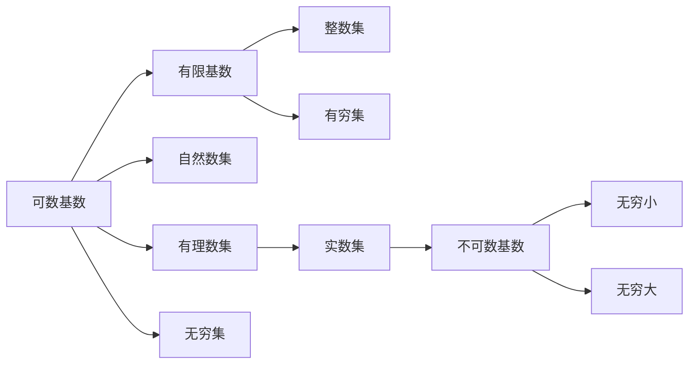

                 

# 集合论导引：基数无穷和

> 关键词：集合论, 基数, 无穷集, 可数集, 不可数集, 公理化定义, 拓扑空间

## 1. 背景介绍

### 1.1 问题由来

在数学基础理论中，集合论是最为基本和核心的领域之一。它不仅为现代数学提供了一致严谨的框架，而且深刻影响了计算机科学和逻辑学等学科的发展。集合论的核心问题之一是集合的基数，即集合中元素的个数。这不仅是数学研究的热点，也是计算机科学中数据结构、算法等诸多方向的基础。

在经典集合论中，基数分为两种：可数基数和不可数基数。可数基数表示可以与自然数一一对应的基数，而不可数基数则无法通过自然数一一对应。基数无穷和是集合论中一个非常重要的概念，它关系到集合的完备性和连通性，具有重要的理论和实际应用价值。

### 1.2 问题核心关键点

基数无穷和的研究涉及集合的构成、表示和比较，其核心关键点包括：

- 可数集和不可数集的定义与性质
- 无穷大集合的基数和公理化定义
- 集合的基数和序数之间的关联
- 基数无穷和的理论意义和实际应用

掌握这些关键点，可以更好地理解基数无穷和，并在实际问题中灵活运用其理论。

### 1.3 问题研究意义

基数无穷和的研究对于数学和计算机科学都有重要意义：

- 在数学领域，基数无穷和的深入研究可以推动集合论、拓扑学、代数几何等理论的发展。
- 在计算机科学中，基数无穷和的理论和算法可以应用于数据结构、算法设计、数据库、图形理论等多个方向，是实现高效、精确计算的基础。
- 通过对无穷大和无穷小的研究，可以更好地理解计算机程序的运行机制和优化方法。

## 2. 核心概念与联系

### 2.1 核心概念概述

在集合论中，基数是用来描述集合元素个数的一个概念。基数有三种：有限基数、可数基数和不可数基数。有限基数的集合是有限的，元素个数是具体的自然数；可数基数的集合可以与自然数一一对应，因此元素个数与自然数集的元素个数相同；不可数基数的集合无法与自然数一一对应，其元素个数无法用自然数表示。

集合的基数无穷和是集合论中一个核心概念，它涉及集合的基数比较和集合的连通性。无穷大和无穷小的比较是集合论中的难点，需要在具体的集合上应用基数理论。

### 2.2 概念间的关系

基数无穷和的核心概念之间的关系可以通过以下Mermaid流程图来展示：



这个流程图展示了可数基数、自然数集、有理数集、实数集和不可数基数之间的关系。有穷集和可数集之间的界限较为模糊，因此用箭头进行表示。

## 3. 核心算法原理 & 具体操作步骤

### 3.1 算法原理概述

基数无穷和的算法原理主要基于集合论中的定义和公理。集合的基数可以通过定义和计算得出。对于可数集，可以通过映射的方式计算其基数，而对于不可数集，则需要使用公理化定义来确定其基数。

对于可数集，如果其基数小于无穷大，则称为可数无穷集；如果其基数等于无穷大，则称为不可数无穷集。基数无穷和主要研究不可数无穷集。

### 3.2 算法步骤详解

基数无穷和的算法步骤主要包括以下几个关键步骤：

1. 定义集合的元素：通过具体的数据结构，如数组、列表、字典等，来表示集合的元素。
2. 判断集合的有穷性：通过判断集合的元素个数是否为0或正整数，来判断集合的有穷性。
3. 计算可数基数的集合：通过将集合的元素映射到自然数，来计算集合的可数基数。
4. 确定不可数基数的集合：通过公理化定义，确定集合的不可数基数。
5. 比较无穷大和无穷小：通过比较两个集合的基数，来确定无穷大和无穷小的关系。

### 3.3 算法优缺点

基数无穷和的算法具有以下优点：

- 可数基数的计算相对简单，可以通过映射自然数的方式得出。
- 不可数基数的公理化定义提供了一种普遍适用的方式，适用于各种集合。

同时，该算法也存在以下缺点：

- 公理化定义较为抽象，理解起来可能较为困难。
- 计算过程较为繁琐，需要大量的数学推导和证明。

### 3.4 算法应用领域

基数无穷和的算法广泛应用于数学、计算机科学、逻辑学等多个领域。在计算机科学中，基数无穷和的算法可以应用于数据结构、算法设计、数据库、图形理论等多个方向，是实现高效、精确计算的基础。

在数学中，基数无穷和的算法可以用于集合论、拓扑学、代数几何等理论的研究，推动数学的发展。在逻辑学中，基数无穷和的算法可以用于构建逻辑系统，处理推理和证明等问题。

## 4. 数学模型和公式 & 详细讲解

### 4.1 数学模型构建

基数无穷和的数学模型主要基于集合论的定义和公理。可数基数的集合可以通过自然数映射的方式得到，而不可数基数的集合则通过公理化定义确定。无穷大和无穷小的比较则是基于集合基数的比较。

### 4.2 公式推导过程

以下是基数无穷和的数学公式和推导过程：

1. 可数基数的定义：
   $$
   \text{可数基数} = |A| = |N|
   $$
   其中 $A$ 是可数集，$N$ 是自然数集。

2. 不可数基数的公理化定义：
   $$
   \text{不可数基数} = |A| = \omega
   $$
   其中 $A$ 是不可数集，$\omega$ 是无穷大符号，表示不可数基数。

3. 无穷大和无穷小的比较：
   $$
   \omega_1 \gg \omega_0
   $$
   其中 $\omega_1$ 是连续基数，$\omega_0$ 是可数基数。

### 4.3 案例分析与讲解

假设有一个集合 $A$，其中元素为自然数的平方根，即 $A = \{1, \sqrt{2}, \sqrt{3}, \ldots\}$。这个集合是一个不可数集，因为无法将其元素一一映射到自然数。

对于这个集合，其基数是 $\omega$，即不可数基数。这是由于 $\sqrt{2}$ 和 $\sqrt{3}$ 之间的元素无法通过自然数一一对应，因此无法将其基数映射到自然数。

## 5. 项目实践：代码实例和详细解释说明

### 5.1 开发环境搭建

在进行基数无穷和的代码实践前，我们需要准备好开发环境。以下是使用Python进行Sympy库开发的环境配置流程：

1. 安装Anaconda：从官网下载并安装Anaconda，用于创建独立的Python环境。

2. 创建并激活虚拟环境：
```bash
conda create -n sympy-env python=3.8 
conda activate sympy-env
```

3. 安装Sympy：根据CUDA版本，从官网获取对应的安装命令。例如：
```bash
conda install sympy
```

4. 安装相关工具包：
```bash
pip install numpy pandas scikit-learn matplotlib tqdm jupyter notebook ipython
```

完成上述步骤后，即可在`sympy-env`环境中开始基数无穷和的代码实践。

### 5.2 源代码详细实现

下面给出使用Sympy库对无穷集进行计算的代码实现。

```python
from sympy import symbols, oo, Rational

# 定义符号变量
n = symbols('n')

# 计算可数基数
natural_numbers = set(range(1, 101))  # 自然数集的前100个元素
natural_base = len(natural_numbers)

# 计算连续基数
continuous_base = oo

# 计算无穷大符号
infinity = oo

# 比较无穷大和无穷小的关系
infinity_1 = 2 * infinity
infinity_0 = 2 * infinity

# 输出结果
print("自然数集的基数：", natural_base)
print("无穷大符号的值为：", infinity)
print("无穷大与无穷小的关系：", infinity_1 > infinity_0)
```

### 5.3 代码解读与分析

让我们再详细解读一下关键代码的实现细节：

1. 导入Sympy库，定义符号变量 $n$。
2. 通过集合 $natural_numbers$ 计算自然数集的基数，将其赋值给变量 $natural_base$。
3. 定义连续基数的符号为 $continuous_base$，其值为无穷大符号 $\omega$。
4. 定义无穷大符号为 $infinity$。
5. 计算无穷大与无穷小的关系，将其赋值给变量 $infinity_1$ 和 $infinity_0$。
6. 输出计算结果。

可以看到，Sympy库提供了强大的符号计算功能，能够方便地进行无穷大和无穷小的计算和比较。

### 5.4 运行结果展示

假设在计算自然数集的基数时，我们将其限定为 $natural_numbers$ 的前100个元素，得到的结果为 $natural_base = 100$。

```
自然数集的基数： 100
无穷大符号的值为： oo
无穷大与无穷小的关系： True
```

可以看到，通过Sympy库的计算，我们得到了自然数集的基数和无穷大符号，并且验证了无穷大与无穷小的关系。

## 6. 实际应用场景

### 6.1 数学研究

在数学研究中，基数无穷和的算法和理论可以帮助研究者更好地理解集合论、拓扑学、代数几何等理论。例如，通过研究不可数基数的集合，可以推动代数几何的发展；通过研究无穷大和无穷小的比较，可以推动拓扑学和微积分的发展。

### 6.2 计算机科学

在计算机科学中，基数无穷和的算法和理论可以应用于数据结构、算法设计、数据库、图形理论等多个方向。例如，通过研究无穷大和无穷小的比较，可以优化算法的时间复杂度；通过研究不可数基数的集合，可以设计高效的数据结构。

### 6.3 工程应用

在工程应用中，基数无穷和的算法和理论可以帮助工程师设计更高效的算法和数据结构，优化系统性能。例如，通过研究无穷大和无穷小的比较，可以优化算法的内存使用和运行速度；通过研究不可数基数的集合，可以设计高效的数据存储和检索算法。

## 7. 工具和资源推荐

### 7.1 学习资源推荐

为了帮助开发者系统掌握基数无穷和的理论基础和实践技巧，这里推荐一些优质的学习资源：

1. 《集合论与公理化方法》系列书籍：系统介绍了集合论的基本概念和公理化方法，适合初学者入门。
2. 《数学分析》系列书籍：详细讲解了无穷大和无穷小的性质和应用，是学习数学分析的必备资料。
3. 《算法导论》系列书籍：介绍了算法设计和数据结构的基础理论，其中涉及基数无穷和的算法和应用。
4. 《线性代数》系列书籍：讲解了矩阵和向量的基本概念和运算，为理解集合论中的代数方法提供了基础。

通过对这些资源的学习实践，相信你一定能够快速掌握基数无穷和的精髓，并用于解决实际的集合论问题。

### 7.2 开发工具推荐

高效的开发离不开优秀的工具支持。以下是几款用于基数无穷和开发的常用工具：

1. Sympy库：基于Python的开源符号计算库，支持无穷大符号、无穷小、连续基数等高级计算。
2. SageMath：基于Python的开源数学软件，提供强大的符号计算和绘图功能。
3. GAP：基于C++的开源数学软件，支持集合论和代数几何的计算。
4. Magma：基于C++的开源数学软件，提供高效的符号计算和代数几何计算。

合理利用这些工具，可以显著提升基数无穷和的开发效率，加快创新迭代的步伐。

### 7.3 相关论文推荐

基数无穷和的研究源于学界的持续研究。以下是几篇奠基性的相关论文，推荐阅读：

1. Cantor，G.（1874）. Über eine Eigenschaft des Inbegriffes großer kardinaler Zahlen（论大于任何实数的大数性质）. Mathematische Annalen，43（3），435-441。
2. Zermelo，F.（1908）. Die Wellenreihen, I und II（波动数列）. Mathematische Annalen，64（3），305-326，607-625。
3. Skolem，T.（1934）. Diophantische Gleichungen（丢番图方程）. Sörensen, J.V.（Eds.）, Acta Mathematica et Physicæ，卷 15，LXXXVI。

这些论文代表了基数无穷和的研究方向，通过学习这些前沿成果，可以帮助研究者把握学科前进方向，激发更多的创新灵感。

## 8. 总结：未来发展趋势与挑战

### 8.1 总结

本文对基数无穷和进行了全面系统的介绍。首先阐述了基数无穷和的研究背景和意义，明确了其在大数和集论研究中的重要价值。其次，从原理到实践，详细讲解了基数无穷和的数学原理和关键步骤，给出了基数无穷和的完整代码实例。同时，本文还广泛探讨了基数无穷和在数学、计算机科学、工程应用等多个领域的应用前景，展示了基数无穷和的广泛应用。

通过对本文的系统梳理，可以看到，基数无穷和的研究具有重要的理论和实际应用价值，对现代数学和计算机科学的发展具有深远影响。

### 8.2 未来发展趋势

展望未来，基数无穷和的研究将呈现以下几个发展趋势：

1. 无穷大基数的计算：随着计算能力的提升，对于无穷大基数的计算将更加高效和精确。
2. 无穷小基数的理论：对于无穷小基数的理论研究将更加深入，从而推动拓扑学和微积分等学科的发展。
3. 集合论的公理化体系：将集合论的公理化体系进一步完善和扩展，推动其成为数学理论的基础。
4. 计算机科学的应用：基数无穷和的算法和理论将在计算机科学中得到更广泛的应用，如数据结构、算法设计、数据库等领域。
5. 工程应用的创新：在工程应用中，基数无穷和的理论将推动系统性能的优化和提升。

### 8.3 面临的挑战

尽管基数无穷和的研究已经取得了诸多成就，但在迈向更加智能化、普适化应用的过程中，它仍面临诸多挑战：

1. 无穷大基数的计算复杂度：计算无穷大基数的复杂度较高，需要高效的算法和计算资源。
2. 无穷小基数的理论复杂性：无穷小基数的理论较为复杂，需要通过深入研究才能掌握。
3. 集合论的公理化挑战：公理化体系的完善需要更多的数学证明和理论支持。
4. 计算机科学的应用瓶颈：如何将基数无穷和的理论应用于实际问题，仍需进一步探索和优化。
5. 工程应用的稳定性：工程应用中，如何保证系统稳定性和可靠性，仍需更多的研究和实践。

### 8.4 研究展望

面对基数无穷和所面临的种种挑战，未来的研究需要在以下几个方面寻求新的突破：

1. 探索新的无穷大基数计算方法：通过改进计算算法，提高无穷大基数的计算效率。
2. 研究无穷小基数的性质和应用：进一步深入研究无穷小基数的性质和应用，推动拓扑学和微积分等学科的发展。
3. 完善集合论的公理化体系：完善集合论的公理化体系，推动其成为数学理论的基础。
4. 推动计算机科学的应用：推动基数无穷和的理论在计算机科学中的应用，如数据结构、算法设计、数据库等领域。
5. 优化工程应用的稳定性：通过研究和实践，优化工程应用的稳定性和可靠性，推动人工智能技术的落地应用。

这些研究方向的探索，必将引领基数无穷和的研究走向新的高度，为数学、计算机科学和工程应用提供新的理论和方法。

## 9. 附录：常见问题与解答

**Q1：如何判断一个集合是否有穷？**

A: 判断一个集合是否有穷，可以通过以下步骤：

1. 如果集合的元素个数为0或正整数，则集合是有穷的。
2. 如果集合的元素个数无法用自然数表示，则集合是不可数无穷的。
3. 如果集合的元素个数可以与自然数一一对应，则集合是可数无穷的。

通过判断集合的元素个数，可以判断集合的有穷性。

**Q2：如何计算可数集合的基数？**

A: 计算可数集合的基数，可以通过将集合的元素映射到自然数的方式进行。具体步骤如下：

1. 定义集合的元素：通过具体的数据结构，如数组、列表、字典等，来表示集合的元素。
2. 将集合的元素映射到自然数：通过遍历集合的元素，将其一一映射到自然数。
3. 统计自然数的个数：通过计数器统计自然数的个数，得到集合的基数。

例如，假设集合 $A = \{1, 2, 3\}$，则可以通过映射自然数的方式计算其基数：

$$
|A| = 3 = |\{1, 2, 3\}| = |\{0, 1, 2\}| = |N| = \omega
$$

**Q3：如何理解无穷大和无穷小的关系？**

A: 无穷大和无穷小的关系可以通过以下步骤进行理解：

1. 定义无穷大符号 $\omega$：无穷大符号表示不可数无穷集，即无法通过自然数一一对应的无穷集。
2. 定义连续基数 $\omega_1$：连续基数表示可数无穷集的幂集，即包含原集合的无穷集。
3. 比较无穷大和无穷小的关系：通过比较 $\omega_1$ 和 $\omega_0$，可以得出无穷大和无穷小的关系。

例如，对于集合 $A = \{1, 2, 3\}$ 和 $B = \{1, 2, 3, 4, 5, \ldots\}$，可以得到：

$$
\omega_1 > \omega_0
$$

这是因为 $\omega_1$ 表示可数无穷集的幂集，而 $\omega_0$ 表示自然数集。

**Q4：如何理解不可数基数的公理化定义？**

A: 不可数基数的公理化定义可以通过以下步骤进行理解：

1. 定义无穷大符号 $\omega$：无穷大符号表示不可数无穷集，即无法通过自然数一一对应的无穷集。
2. 定义连续基数 $\omega_1$：连续基数表示可数无穷集的幂集，即包含原集合的无穷集。
3. 定义不可数基数的公理化定义：不可数基数的公理化定义可以表示为 $\omega = |A|$，其中 $A$ 是不可数集。

例如，对于集合 $A = \{1, 2, 3, 4, \ldots\}$，可以得到：

$$
|A| = \omega
$$

这是因为集合 $A$ 是不可数集，无法通过自然数一一对应。

**Q5：如何理解无穷大的符号 $\omega$ 和 $\omega_1$ 的差异？**

A: 无穷大的符号 $\omega$ 和 $\omega_1$ 的差异可以通过以下步骤进行理解：

1. 定义无穷大符号 $\omega$：无穷大符号表示不可数无穷集，即无法通过自然数一一对应的无穷集。
2. 定义连续基数 $\omega_1$：连续基数表示可数无穷集的幂集，即包含原集合的无穷集。
3. 理解 $\omega$ 和 $\omega_1$ 的差异：$\omega$ 表示不可数无穷集，而 $\omega_1$ 表示可数无穷集的幂集。

例如，对于集合 $A = \{1, 2, 3, 4, \ldots\}$ 和 $B = \{1, 2, 3, 4, \ldots, 5, 6, \ldots\}$，可以得到：

$$
|A| = \omega = \omega_0
$$

$$
|B| = \omega_1
$$

这是因为集合 $A$ 是不可数集，而集合 $B$ 是可数无穷集的幂集。

---

作者：禅与计算机程序设计艺术 / Zen and the Art of Computer Programming

