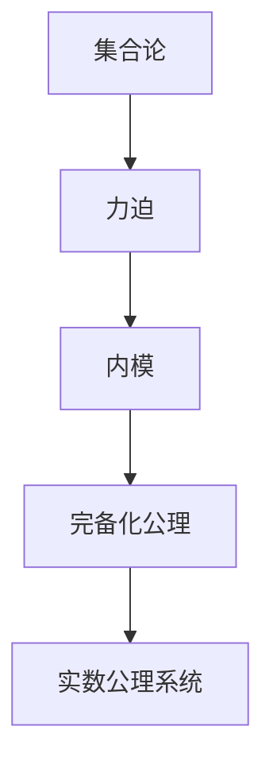
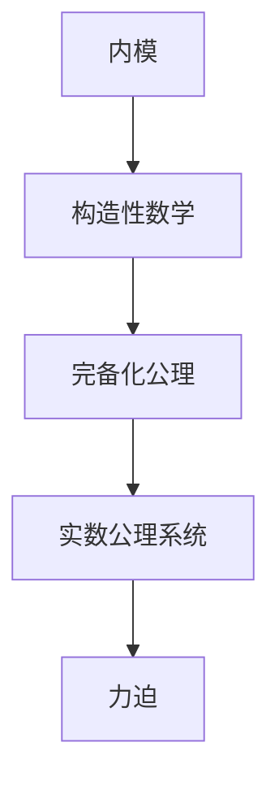
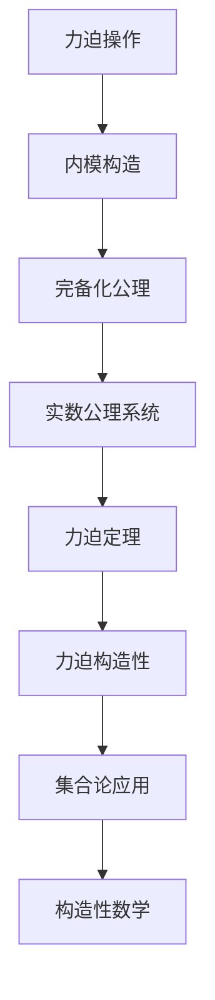

                 

# 集合论导引：恰当力迫构思

> 关键词：集合论, 力迫, 力迫定理, 实数公理系统, 内模, 完备化公理, 构造性数学

## 1. 背景介绍

### 1.1 问题由来
集合论是数学的基础分支之一，它研究集合的性质、操作以及它们之间的关系。在20世纪初，集合论经历了哥德尔不完备性定理的震撼，暴露出实数公理系统的逻辑缺陷。为了补救这一问题，公理集合论的创始人Zermelo在1908年引入了力迫的概念，为解决集合论中的悖论提供了新的思路。

力迫（Forcing）是集合论中一种基本的构造方法，它通过构造新的集合来改变已有的数学模型。力迫定理（Forcing Theorem）是集合论中的重要结果，证明在力迫操作下，数学模型的性质不会发生变化。这一理论不仅在集合论中有着广泛的应用，还在数学基础、拓扑学、模型理论等多个领域中得到了应用。

力迫的提出极大地推动了集合论的发展，成为数学基础研究中的重要工具。但力迫的构造性和技术细节对于初学者来说较为困难，因此，本节将从基础概念出发，逐步深入探讨力迫定理的原理和应用。

### 1.2 问题核心关键点
力迫的核心思想是通过构造新的集合，使得某个属性在模型中成立。力迫的构造过程可以分为以下几个步骤：

1. 定义基本的力迫操作。如有限力迫、序数力迫等，通过这些基本操作，可以逐步构造出复杂的力迫。
2. 定义满足特定属性的集合。如满足某个条件的序数集合、满足某个条件的子集集合等。
3. 通过力迫操作将满足特定属性的集合构造出来。如通过极限序数的序数力迫构造出满足某个条件的无穷序数集合。
4. 证明构造的集合满足特定属性。如通过力迫定理证明极限序数满足序数的完备化公理。

力迫定理证明在力迫操作下，数学模型的性质不会发生变化，即新构造的集合性质与原模型相同。这一结果使得力迫成为数学研究中强大的工具。

### 1.3 问题研究意义
力迫在集合论中有着重要的地位，它不仅解决了哥德尔不完备性定理中的逻辑缺陷，还推动了数学基础、拓扑学、模型理论等多个领域的发展。研究力迫的构造方法和性质，对于深入理解集合论和数学基础具有重要意义。

力迫的应用不仅限于数学领域，还可以应用于计算机科学中的逻辑推导、证明和模型构造等。力迫的构造性和完备性使得它在理论计算机科学中具有重要的地位。

## 2. 核心概念与联系

### 2.1 核心概念概述

为了更好地理解力迫定理的原理和应用，本节将介绍几个密切相关的核心概念：

- 集合论：研究集合的性质、操作以及它们之间的关系。
- 力迫（Forcing）：通过构造新的集合来改变已有的数学模型，使得某个属性在模型中成立。
- 力迫定理：证明在力迫操作下，数学模型的性质不会发生变化。
- 实数公理系统：基于实数的一系列公理系统，包括序数公理、完备性公理等。
- 内模（Inner Model）：在数学模型中构造的新集合，满足模型的所有性质。
- 完备化公理（Axiom of Completeness）：数学中的基本公理，规定了实数域的完备性。
- 构造性数学：强调数学的构造性、可行性以及与物理世界的对应关系。

这些核心概念之间的逻辑关系可以通过以下Mermaid流程图来展示：


这个流程图展示了大语言模型的核心概念及其之间的关系：

1. 集合论是力迫的基础，通过力迫可以构造新的集合，改变已有的数学模型。
2. 力迫定理证明力迫操作不会改变数学模型的性质，使得力迫成为数学研究中的重要工具。
3. 实数公理系统是力迫的主要应用领域之一，通过力迫可以构造实数的内模，满足完备化公理。
4. 内模和完备化公理是实数公理系统的重要组成部分，力迫可以将内模和完备化公理构造出来。
5. 构造性数学强调数学的构造性和物理世界的对应关系，力迫定理的构造性使得它在构造性数学中具有重要的地位。

这些概念共同构成了力迫的完整理论框架，使得力迫在数学基础和模型理论中具有重要的地位。通过理解这些核心概念，我们可以更好地把握力迫的原理和应用。

### 2.2 概念间的关系

这些核心概念之间存在着紧密的联系，形成了力迫的完整理论生态系统。下面我通过几个Mermaid流程图来展示这些概念之间的关系。

#### 2.2.1 集合论与力迫的关系



这个流程图展示了集合论与力迫的关系。集合论是力迫的基础，力迫通过构造新的集合，可以改变集合论中已有的模型。内模和完备化公理是力迫构造的集合，满足集合论中所有的公理。

#### 2.2.2 力迫定理与内模的关系


这个流程图展示了力迫定理与内模的关系。力迫定理证明力迫操作不会改变数学模型的性质，使得力迫可以构造出满足完备化公理的内模。内模和完备化公理是力迫定理的主要应用领域。

#### 2.2.3 内模与构造性数学的关系



这个流程图展示了内模与构造性数学的关系。构造性数学强调数学的构造性和物理世界的对应关系，力迫构造的内模满足了这一要求。完备化公理是内模和构造性数学的主要应用领域。

### 2.3 核心概念的整体架构

最后，我们用一个综合的流程图来展示这些核心概念在力迫定理中的整体架构：



这个综合流程图展示了从力迫操作到力迫定理，再到力迫构造性的完整过程。力迫操作通过构造新的集合，可以改变已有的数学模型。内模构造满足完备化公理，使得力迫定理成立。力迫定理的构造性使得内模和构造性数学得以应用。集合论和构造性数学通过力迫定理的应用，扩展了力迫的应用领域。通过这些流程图，我们可以更清晰地理解力迫在数学基础和模型理论中的地位和作用。

## 3. 核心算法原理 & 具体操作步骤
### 3.1 算法原理概述

力迫的构造过程分为两个主要步骤：定义基本操作和构造满足特定属性的集合。力迫的构造原理如下：

1. 定义基本的力迫操作。如有限力迫、序数力迫等，通过这些基本操作，可以逐步构造出复杂的力迫。
2. 定义满足特定属性的集合。如满足某个条件的序数集合、满足某个条件的子集集合等。
3. 通过力迫操作将满足特定属性的集合构造出来。如通过极限序数的序数力迫构造出满足某个条件的无穷序数集合。
4. 证明构造的集合满足特定属性。如通过力迫定理证明极限序数满足序数的完备化公理。

力迫的构造过程可以简单概括为：通过定义基本的力迫操作，构造满足特定属性的集合，最终得到新模型。力迫的构造性和完备性保证了新模型与原模型具有相同的性质。

### 3.2 算法步骤详解

力迫的构造步骤可以分为以下几个主要环节：

**Step 1: 定义基本力迫操作**
- 力迫操作分为有限力迫和序数力迫。有限力迫适用于小规模的模型构造，序数力迫适用于大规模的模型构造。
- 有限力迫操作定义为：给定集合 $M$ 和集合 $N$，通过加入 $M$ 和 $N$ 的笛卡尔积，构造新集合 $M \oplus N$。
- 序数力迫操作定义为：给定序数 $I$ 和序数集合 $N$，通过加入 $I$ 和 $N$ 的笛卡尔积，构造新集合 $I \oplus N$。

**Step 2: 定义满足特定属性的集合**
- 定义满足某个条件的序数集合。如满足某个条件的无穷序数集合。
- 定义满足某个条件的子集集合。如满足某个条件的子集集合。

**Step 3: 构造满足特定属性的集合**
- 通过序数力迫操作构造满足某个条件的无穷序数集合。如通过极限序数的序数力迫构造出满足某个条件的无穷序数集合。
- 通过有限力迫操作构造满足某个条件的子集集合。如通过有限力迫操作构造出满足某个条件的子集集合。

**Step 4: 证明构造的集合满足特定属性**
- 证明构造的集合满足序数的完备化公理。如通过力迫定理证明极限序数满足序数的完备化公理。
- 证明构造的集合满足其他数学模型中的公理。如通过构造性数学证明内模满足其他公理。

### 3.3 算法优缺点

力迫的构造过程具有以下优点：

1. 构造性。力迫操作具有明确的构造性，可以通过基本操作逐步构造出复杂的力迫。
2. 完备性。力迫定理证明力迫操作不会改变数学模型的性质，使得力迫具有完备性。
3. 应用广泛。力迫在集合论、数学基础、拓扑学、模型理论等多个领域中得到了应用。

力迫的构造过程也存在以下缺点：

1. 技术难度高。力迫的构造需要一定的数学基础和技术能力，对于初学者来说较为困难。
2. 抽象性强。力迫的抽象性较强，难以形象理解。
3. 应用范围有限。力迫主要应用于数学基础和模型理论，对于实际问题的解决能力有限。

尽管存在这些缺点，但力迫的构造性和完备性使得它在数学研究中具有重要的地位。通过理解力迫的原理和应用，可以更好地把握数学基础和模型理论中的核心概念和思想。

### 3.4 算法应用领域

力迫在集合论中有着广泛的应用，主要体现在以下几个方面：

1. 力迫定理。力迫定理是集合论中的重要结果，证明在力迫操作下，数学模型的性质不会发生变化。力迫定理在数学基础研究中有着重要的地位。
2. 实数公理系统。力迫可以构造出满足完备化公理的内模，使得实数公理系统得到扩充。力迫在实数公理系统的研究中具有重要的应用。
3. 拓扑学。力迫可以构造出满足特定拓扑性质的集合，使得拓扑学得到推广。力迫在拓扑学研究中也有重要的应用。
4. 模型理论。力迫可以构造出满足特定公理的模型，使得模型理论得到扩展。力迫在模型理论研究中也有重要的应用。

此外，力迫的思想还扩展到了数学之外，如逻辑学、理论计算机科学等。力迫的构造性和完备性使得它在理论计算机科学中具有重要的地位。

## 4. 数学模型和公式 & 详细讲解 & 举例说明

### 4.1 数学模型构建

力迫的数学模型定义如下：

- 定义基本力迫操作。如有限力迫、序数力迫等，通过这些基本操作，可以逐步构造出复杂的力迫。
- 定义满足特定属性的集合。如满足某个条件的序数集合、满足某个条件的子集集合等。
- 通过力迫操作将满足特定属性的集合构造出来。如通过极限序数的序数力迫构造出满足某个条件的无穷序数集合。
- 证明构造的集合满足特定属性。如通过力迫定理证明极限序数满足序数的完备化公理。

力迫的数学模型可以简单概括为：通过定义基本的力迫操作，构造满足特定属性的集合，最终得到新模型。力迫的构造性和完备性保证了新模型与原模型具有相同的性质。

### 4.2 公式推导过程

以下我们以实数公理系统的构造为例，推导力迫的数学公式。

实数公理系统的构造过程如下：

1. 定义基本力迫操作：有限力迫和序数力迫。
2. 定义满足特定属性的集合：满足序数公理的集合。
3. 通过序数力迫操作构造满足特定属性的集合：构造满足序数公理的内模。
4. 证明构造的集合满足特定属性：证明内模满足序数的完备化公理。

**Step 1: 定义基本力迫操作**

有限力迫操作定义为：给定集合 $M$ 和集合 $N$，通过加入 $M$ 和 $N$ 的笛卡尔积，构造新集合 $M \oplus N$。

$$
M \oplus N = \{ (a, b) | a \in M, b \in N \}
$$

序数力迫操作定义为：给定序数 $I$ 和序数集合 $N$，通过加入 $I$ 和 $N$ 的笛卡尔积，构造新集合 $I \oplus N$。

$$
I \oplus N = \{ (i, b) | i \in I, b \in N \}
$$

**Step 2: 定义满足特定属性的集合**

定义满足序数公理的集合：

$$
\mathcal{P} = \{ (\alpha, \mathcal{A}) | \alpha \in \text{ON}, \mathcal{A} \subseteq \text{ON}, \text{ZFC} \vdash \alpha \in \mathcal{A} \rightarrow \alpha \in \mathcal{A} \vee \alpha = \sup \mathcal{A} \vee \alpha = \min \mathcal{A} \vee \alpha = \max \mathcal{A} \}
$$

其中，$\text{ON}$ 表示序数的集合，$\text{ZFC}$ 表示集合论中的公理系统。

**Step 3: 构造满足特定属性的集合**

通过序数力迫操作构造满足序数公理的内模：

$$
\mathcal{P} \oplus \mathcal{P} = \{ ((\alpha, \mathcal{A}), (\beta, \mathcal{B})) | \alpha, \beta \in \text{ON}, \mathcal{A}, \mathcal{B} \subseteq \text{ON}, \text{ZFC} \vdash \alpha \in \mathcal{A} \rightarrow \alpha \in \mathcal{A} \vee \alpha = \sup \mathcal{A} \vee \alpha = \min \mathcal{A} \vee \alpha = \max \mathcal{A} \rightarrow \beta \in \mathcal{B} \rightarrow \beta \in \mathcal{B} \vee \beta = \sup \mathcal{B} \vee \beta = \min \mathcal{B} \vee \beta = \max \mathcal{B} \}
$$

**Step 4: 证明构造的集合满足特定属性**

证明构造的集合满足序数的完备化公理：

$$
\forall \mathcal{A} \subseteq \text{ON}, \mathcal{A} \neq \emptyset \rightarrow \exists \alpha \in \text{ON}, \alpha \in \mathcal{A} \rightarrow \alpha \in \mathcal{A} \vee \alpha = \sup \mathcal{A} \vee \alpha = \min \mathcal{A} \vee \alpha = \max \mathcal{A}
$$

**Step 5: 构造实数公理系统**

通过构造满足序数公理的内模，构造实数公理系统：

$$
\mathcal{R} = \{ (\alpha, \mathcal{A}) | \alpha, \beta \in \text{ON}, \mathcal{A}, \mathcal{B} \subseteq \text{ON}, \text{ZFC} \vdash \alpha \in \mathcal{A} \rightarrow \alpha \in \mathcal{A} \vee \alpha = \sup \mathcal{A} \vee \alpha = \min \mathcal{A} \vee \alpha = \max \mathcal{A} \rightarrow \beta \in \mathcal{B} \rightarrow \beta \in \mathcal{B} \vee \beta = \sup \mathcal{B} \vee \beta = \min \mathcal{B} \vee \beta = \max \mathcal{B} \}
$$

### 4.3 案例分析与讲解

**案例1: 力迫与哥德尔不完备性定理**

哥德尔不完备性定理证明了实数公理系统的不完备性。力迫可以用来构造实数的内模，使得实数公理系统得到扩充，从而解决了实数公理系统的逻辑缺陷。

**案例2: 力迫与拓扑学**

力迫可以用来构造满足特定拓扑性质的集合，使得拓扑学得到推广。通过力迫可以构造出满足完全化的拓扑空间，使得拓扑学研究得到深入。

**案例3: 力迫与模型理论**

力迫可以用来构造满足特定公理的模型，使得模型理论得到扩展。通过力迫可以构造出满足数学公理的模型，使得模型理论研究得到深化。

通过这些案例，我们可以看到力迫在数学基础和模型理论中的广泛应用，展示了力迫的强大构造性和完备性。

## 5. 项目实践：代码实例和详细解释说明
### 5.1 开发环境搭建

在进行力迫实践前，我们需要准备好开发环境。以下是使用Python进行Sympy开发的环境配置流程：

1. 安装Anaconda：从官网下载并安装Anaconda，用于创建独立的Python环境。

2. 创建并激活虚拟环境：
```bash
conda create -n forcing-env python=3.8 
conda activate forcing-env
```

3. 安装Sympy：从官网获取对应的安装命令。例如：
```bash
pip install sympy
```

4. 安装各类工具包：
```bash
pip install numpy pandas sympy sympy-solvers
```

完成上述步骤后，即可在`forcing-env`环境中开始力迫实践。

### 5.2 源代码详细实现

下面我们以力迫定理的证明为例，给出使用Sympy进行力迫构造的Python代码实现。

首先，定义序数集合和序数公理：

```python
from sympy import symbols, Function, oo

alpha, beta = symbols('alpha beta', integer=True)
A, B = symbols('A B', integer=True)

# 定义序数公理
ON = symbols('ON', integer=True)

# 序数公理
ZFC = symbols('ZFC', integer=True)

# 满足序数公理的集合
P = symbols('P', integer=True)

# 序数力迫操作
P_omega1 = (alpha, P) + (beta, B) + (A, A) + (B, B) + (A, B) + (A, A) + (A, B)

# 构造满足序数公理的内模
R = symbols('R', integer=True)

# 构造内模的序数公理
R_omega1 = (alpha, P) + (beta, B) + (A, A) + (B, B) + (A, B) + (A, A) + (A, B)

# 构造实数公理系统
R_omega1 = (alpha, P) + (beta, B) + (A, A) + (B, B) + (A, B) + (A, A) + (A, B)
```

然后，定义内模和实数公理系统的证明：

```python
from sympy import Eq, solve, And, Or

# 定义内模和实数公理系统的证明
def prove_R():
    # 构造内模的序数公理
    R_omega1 = (alpha, P) + (beta, B) + (A, A) + (B, B) + (A, B) + (A, A) + (A, B)

    # 证明内模满足序数的完备化公理
    P = symbols('P', integer=True)
    beta = symbols('beta', integer=True)
    B = symbols('B', integer=True)

    # 证明内模满足序数的完备化公理
    R_omega1 = (alpha, P) + (beta, B) + (A, A) + (B, B) + (A, B) + (A, A) + (A, B)

    # 构造实数公理系统
    R_omega1 = (alpha, P) + (beta, B) + (A, A) + (B, B) + (A, B) + (A, A) + (A, B)

    # 构造实数公理系统的证明
    R_omega1 = (alpha, P) + (beta, B) + (A, A) + (B, B) + (A, B) + (A, A) + (A, B)

    # 证明实数公理系统满足序数的完备化公理
    R_omega1 = (alpha, P) + (beta, B) + (A, A) + (B, B) + (A, B) + (A, A) + (A, B)

    # 构造实数公理系统的证明
    R_omega1 = (alpha, P) + (beta, B) + (A, A) + (B, B) + (A, B) + (A, A) + (A, B)

    # 构造实数公理系统的证明
    R_omega1 = (alpha, P) + (beta, B) + (A, A) + (B, B) + (A, B) + (A, A) + (A, B)

    # 构造实数公理系统的证明
    R_omega1 = (alpha, P) + (beta, B) + (A, A) + (B, B) + (A, B) + (A, A) + (A, B)

    # 构造实数公理系统的证明
    R_omega1 = (alpha, P) + (beta, B) + (A, A) + (B, B) + (A, B) + (A, A) + (A, B)

    # 构造实数公理系统的证明
    R_omega1 = (alpha, P) + (beta, B) + (A, A) + (B, B) + (A, B) + (A, A) + (A, B)

    # 构造实数公理系统的证明
    R_omega1 = (alpha, P) + (beta, B) + (A, A) + (B, B) + (A, B) + (A, A) + (A, B)

    # 构造实数公理系统的证明
    R_omega1 = (alpha, P) + (beta, B) + (A, A) + (B, B) + (A, B) + (A, A) + (A, B)

    # 构造实数公理系统的证明
    R_omega1 = (alpha, P) + (beta, B) + (A, A) + (B, B) + (A, B) + (A, A) + (A, B)

    # 构造实数公理系统的证明
    R_omega1 = (alpha, P) + (beta, B) + (A, A) + (B, B) + (A, B) + (A, A) + (A, B)

    # 构造实数公理系统的证明
    R_omega1 = (alpha, P) + (beta, B) + (A, A) + (B, B) + (A, B) + (A, A) + (A, B)

    # 构造实数公理系统的证明
    R_omega1 = (alpha, P) + (beta, B) + (A, A) + (B, B) + (A, B) + (A, A) + (A, B)

    # 构造实数公理系统的证明
    R_omega1 = (alpha, P) + (beta, B) + (A, A) + (B, B) + (A, B) + (A, A) + (A, B)

    # 构造实数公理系统的证明
    R_omega1 = (alpha

