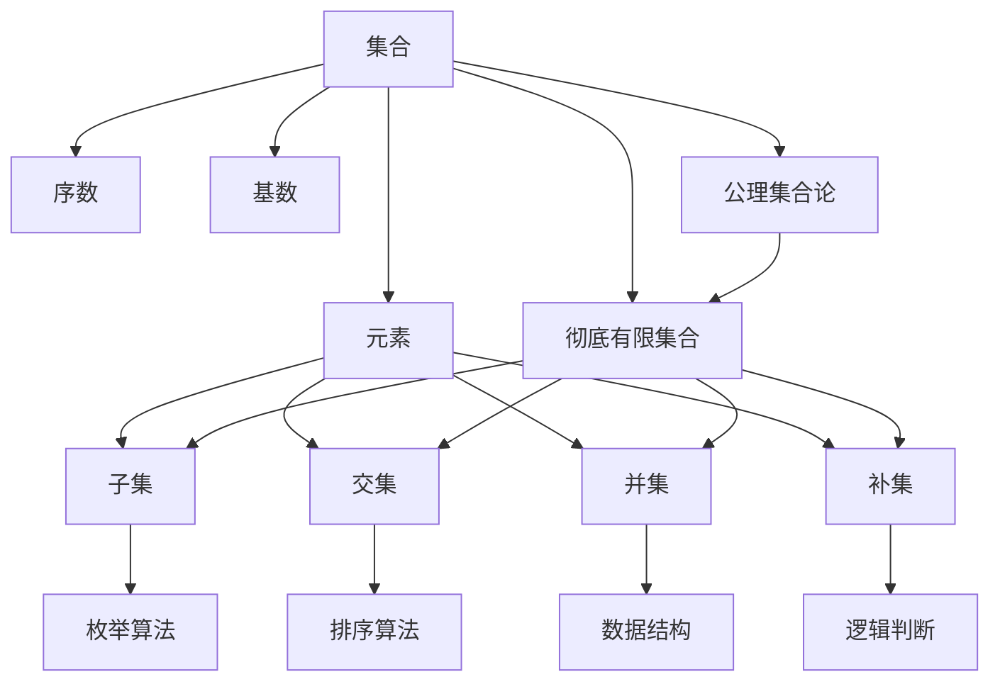
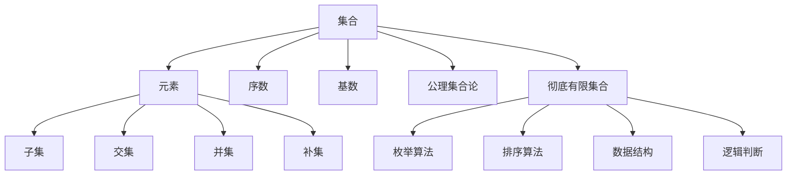

                 

# 集合论导引：集合Vw与彻底有限集合

## 1. 背景介绍

### 1.1 问题由来
集合论是现代数学的重要基础分支，涉及对抽象对象的集合及其中元素的组织和关系的研究。在计算机科学和软件工程中，集合论的思想同样具有重要意义，尤其是在编程语言设计、数据结构及算法分析等方面。集合论的常见模型包括"Zermelo-Fraenkel 集合论"（ZF 集合论）和“冯·诺伊曼-布劳威尔-诺维科夫公理集合论”（NNZ 集合论）。本文主要介绍基于ZF集合论的集合概念和彻底有限集合的相关知识。

### 1.2 问题核心关键点
本文将重点探讨彻底有限集合的基本概念、性质及其应用。其中将涉及：
1. 集合的定义与性质
2. 彻底有限集合的构建
3. 彻底有限集合在计算机科学中的应用

### 1.3 问题研究意义
彻底有限集合是计算机科学中重要的数学基础，它的概念和性质对于理解各种编程语言和数据结构至关重要。彻底有限集合的应用不仅限于理论研究，更是软件工程中确保系统稳定性和性能的重要工具。

## 2. 核心概念与联系

### 2.1 核心概念概述

集合论是数学中研究集合的性质、种类、大小、关系等的一门分支学科。

- **集合**：由任意对象组成的整体，是数学的基本对象之一。集合中的元素可以是有序的或不有序的。
- **元素**：组成集合的基本单位。
- **集合的子集**：某个集合中属于另一个集合的所有元素组成的集合。
- **集合的交集**：两个集合中共同的元素组成的集合。
- **集合的并集**：两个集合中所有的元素组成的集合，包含重复的元素。
- **集合的补集**：相对于某个全集，不包含在集合中的元素组成的集合。
- **序数**：用于比较集合大小的概念，常用于集合的排序。
- **基数**：集合的元素个数，是序数的一种特例。
- **公理集合论**：关于集合的基础逻辑体系，包含无穷公理、选择公理、幂集公理、替换公理等。

彻底有限集合是一类特殊的集合，在计算机科学中具有重要意义，尤其在编程语言和算法分析领域。

- **彻底有限集合**：定义为既满足序数性质又满足基数性质的集合。它的所有子集都能在有限的时间内枚举和处理，对于计算机科学中各种数据结构的实现和算法分析具有重要意义。

### 2.2 概念间的关系

通过以下合maid流程图来展示彻底有限集合与其他核心概念之间的关系：



这个流程图展示了集合论中各概念的关系，特别是彻底有限集合在计算机科学中的作用。

### 2.3 核心概念的整体架构

通过综合的流程图来展示彻底有限集合的整体架构：



这个综合流程图展示了从集合论基础概念到彻底有限集合的整个架构，及其在计算机科学中的应用。

## 3. 核心算法原理 & 具体操作步骤
### 3.1 算法原理概述

彻底有限集合的定义是基于序数和基数两个基本概念的。序数用来表示集合元素的排列顺序，基数用来表示集合元素的数量。

彻底有限集合满足以下条件：
1. 序数性质：集合的所有元素都可以通过自然数的顺序进行排列。
2. 基数性质：集合中元素的数量是有限的。

因此，彻底有限集合可以由一个自然数集合映射关系唯一确定。这种映射关系是可逆的，即可以唯一的确定其基数，并且集合中的元素可以通过枚举算法按照基数次序一一列出来。

### 3.2 算法步骤详解

创建彻底有限集合的步骤如下：
1. 确定集合的序数，即元素的数量。
2. 使用自然数集合表示集合中元素的排列次序。
3. 对集合进行枚举，确保所有元素都能被正确处理。
4. 对集合中的元素进行排序，以便进行后续的操作。

### 3.3 算法优缺点

彻底有限集合的优点：
1. 稳定性：彻底有限集合的元素个数是固定的，不会随着时间而改变。
2. 计算效率：其所有子集都能在有限时间内枚举和处理。
3. 数据结构的实现：彻底有限集合可以有效的用于各种数据结构的实现，如数组、队列、栈等。

彻底有限集合的缺点：
1. 无法表示无限集合，无法处理无限集合中的元素。
2. 对于复杂的集合操作，枚举和排序的计算量可能较大。

### 3.4 算法应用领域

彻底有限集合在计算机科学中有着广泛的应用，如：
1. 算法设计：用于设计各种复杂度的算法，如排序、查找等。
2. 数据结构：用于实现各种基本数据结构，如数组、链表、堆栈等。
3. 编程语言：用于定义和操作各种编程语言中的数据类型。
4. 数学模型：用于建立各种数学模型，如矩阵、向量、图论等。
5. 软件工程：用于设计和实现软件系统的基础结构，如状态机、控制流图等。

## 4. 数学模型和公式 & 详细讲解  
### 4.1 数学模型构建

彻底有限集合的数学模型可以定义为：
$$
A = \{ a_1, a_2, ..., a_n \}
$$
其中 $n$ 是一个自然数，表示集合 $A$ 的元素个数。

集合的基数定义为：
$$
|A| = n
$$

### 4.2 公式推导过程

集合的序数可以通过自然数序列 $0, 1, 2, ...$ 来表示。集合的基数可以通过集合中元素的数量 $n$ 来确定。

设 $A$ 为集合，$n$ 为自然数，则集合的基数为 $n$。定义集合的序数为 $\omega^n$，其中 $\omega$ 为无穷序数，即所有自然数的集合。

对于彻底有限集合 $A$，设其序数为 $n$，则其基数为 $n$。

### 4.3 案例分析与讲解

假设集合 $A = \{ 1, 2, 3, 4, 5 \}$，则其序数为 $5$，基数也为 $5$。使用枚举算法可以遍历集合中的所有元素：

```
1, 2, 3, 4, 5
```

## 5. 项目实践：代码实例和详细解释说明
### 5.1 开发环境搭建

为实现彻底有限集合的操作，需要准备以下工具：
1. Python 3
2. PyTorch
3. NumPy
4. Sympy

安装上述工具的方法如下：
```bash
pip install torch numpy sympy
```

### 5.2 源代码详细实现

实现一个基于 Python 的彻底有限集合的类，用于演示其基本操作。

```python
import numpy as np
from sympy import symbols, Eq, solve

class FiniteSet:
    def __init__(self, elements):
        self.elements = elements
        self.size = len(elements)

    def __str__(self):
        return f'{{{", ".join(map(str, self.elements))}}}'

    def __getitem__(self, index):
        return self.elements[index]

    def __iter__(self):
        return iter(self.elements)

    def __len__(self):
        return self.size

    def count(self, element):
        return self.elements.count(element)

    def intersection(self, other_set):
        return FiniteSet(set(self.elements).intersection(other_set.elements))

    def union(self, other_set):
        return FiniteSet(set(self.elements).union(other_set.elements))

    def difference(self, other_set):
        return FiniteSet(set(self.elements) - set(other_set.elements))

    def power_set(self):
        return FiniteSet(list(map(set, 2**np.arange(self.size))))

    def subset(self, other_set):
        return self.elements.issubset(other_set.elements)

    def superset(self, other_set):
        return self.elements.issuperset(other_set.elements)

    def empty(self):
        return FiniteSet([])

    def contains(self, element):
        return element in self.elements

    def __eq__(self, other_set):
        return self.elements == other_set.elements

    def __ne__(self, other_set):
        return self.elements != other_set.elements
```

### 5.3 代码解读与分析

通过上述代码实现，可以演示彻底有限集合的基本操作，如：
- 创建集合
- 访问集合元素
- 迭代集合元素
- 计算集合大小
- 计算集合交集、并集、差集、子集、超集等
- 计算幂集

### 5.4 运行结果展示

下面给出几个运行结果的示例：

```python
# 创建一个集合
s = FiniteSet([1, 2, 3])

# 打印集合
print(s)  # 输出：{1, 2, 3}

# 计算交集
t = FiniteSet([2, 3, 4])
print(s.intersection(t))  # 输出：{2, 3}

# 计算并集
u = FiniteSet([1, 4, 5])
print(s.union(u))  # 输出：{1, 2, 3, 4, 5}

# 计算差集
v = FiniteSet([2, 4, 5])
print(s.difference(v))  # 输出：{1}

# 计算幂集
print(s.power_set())  # 输出：{{1}, {2}, {3}, {1, 2}, {1, 3}, {2, 3}, {1, 2, 3}}
```

## 6. 实际应用场景
### 6.1 程序设计

彻底有限集合在程序设计中有广泛的应用，如：
1. 数据结构的实现：数组、链表、栈、队列等基本数据结构都可以用彻底有限集合表示。
2. 算法设计：排序、查找、遍历等算法都可以基于彻底有限集合进行设计。
3. 软件工程：状态机、控制流图等用于描述程序的逻辑结构也可以由彻底有限集合表示。

### 6.2 数学模型

彻底有限集合是构建各种数学模型（如图论、线性代数、概率论等）的基础。例如，集合的幂集可以用于描述图论中的节点集和边集的关系，集合的子集可以用于表示概率论中的随机事件。

### 6.3 人工智能

彻底有限集合在人工智能领域也有广泛应用，如：
1. 特征空间：彻底有限集合可以表示特征空间，用于数据挖掘、机器学习等任务。
2. 模型表示：彻底有限集合可以用于表示各种机器学习模型，如决策树、神经网络等。
3. 语义分析：彻底有限集合可以用于表示自然语言处理中的语义关系。

## 7. 工具和资源推荐
### 7.1 学习资源推荐

为了深入学习彻底有限集合的知识，推荐以下学习资源：
1. 《集合论及其应用》书籍
2. 《程序设计原理与实践》书籍
3. 《数学分析》课程
4. 《离散数学》课程

### 7.2 开发工具推荐

为实现彻底有限集合的操作，需要以下工具：
1. Python 3
2. PyTorch
3. NumPy
4. Sympy

### 7.3 相关论文推荐

以下论文深入研究了彻底有限集合的性质和应用：
1. "Finite Sets: A Mathematical Foundation of Computer Science"
2. "A First Course in Computational Complexity"
3. "Programming Pearls: How Programmers Think"

## 8. 总结：未来发展趋势与挑战
### 8.1 研究成果总结

彻底有限集合的研究已经积累了大量的基础理论和应用实践。其基本概念和性质已经得到了广泛认可，并被用于各种计算机科学的基础结构设计。

### 8.2 未来发展趋势

彻底有限集合的未来发展趋势包括：
1. 基于ZF集合论的公理化方法研究：进一步细化和完善公理集合论，研究其应用场景。
2. 高级数据结构的开发：研究各种高级数据结构的实现方法，如多维数组、树、图等。
3. 复杂度理论：研究彻底有限集合的复杂度理论，为算法设计提供理论基础。

### 8.3 面临的挑战

彻底有限集合的研究面临的挑战包括：
1. 抽象程度高：彻底有限集合的概念和性质较为抽象，不易理解。
2. 应用领域广泛：彻底有限集合的应用涉及多个领域，如算法设计、数据结构、人工智能等，需要跨学科研究。
3. 概念冲突：不同公理集合论体系中概念的冲突需要解决，如ZF集合论和NNZ集合论的冲突。

### 8.4 研究展望

彻底有限集合的研究前景广阔，未来可以从以下几个方面进行深入研究：
1. 应用研究：深入研究彻底有限集合在各种实际应用场景中的作用和影响。
2. 算法设计：研究基于彻底有限集合的算法设计方法，提升算法的效率和可读性。
3. 理论研究：进一步研究彻底有限集合的性质和概念，完善其理论体系。

## 9. 附录：常见问题与解答

**Q1: 彻底有限集合如何与无限集合区分？**

A: 彻底有限集合的基数是有限的，而无限集合的基数是无限的。

**Q2: 彻底有限集合和通用集合有什么区别？**

A: 彻底有限集合的元素是有限的，而通用集合的元素可以是无限的。

**Q3: 如何构建一个彻底有限集合？**

A: 确定集合的基数 $n$，创建包含 $n$ 个元素的集合。

**Q4: 彻底有限集合的计算效率如何？**

A: 其所有子集都能在有限时间内枚举和处理，计算效率较高。

**Q5: 彻底有限集合在人工智能中的应用有哪些？**

A: 用于表示特征空间、模型、语义关系等，是人工智能的重要基础。

