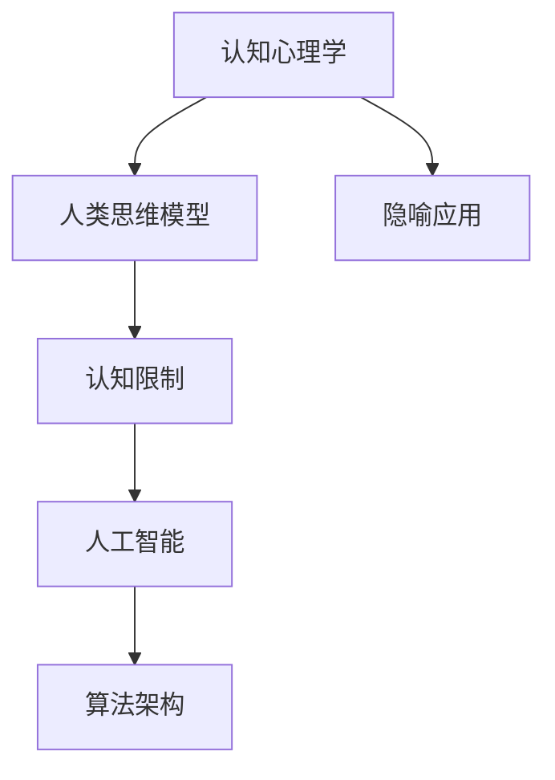
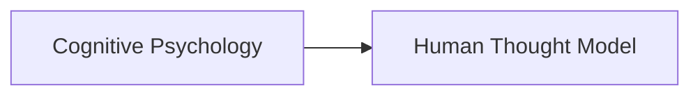
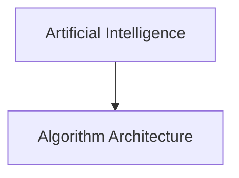

                 

# 顿悟、类比、隐喻、意象和克服知识限制

> 关键词：认知心理学,人类思维模型,隐喻应用,认知限制,人工智能,算法架构

## 1. 背景介绍

### 1.1 问题由来
随着科技的进步，人工智能已经逐渐成为我们生活中不可或缺的一部分。无论是智能助理、自动驾驶，还是推荐系统，都在向我们展示着AI的强大能力。然而，与此同时，我们也不得不面对一些挑战。比如，如何更深刻地理解AI算法，如何让算法更好地服务于人类。这其中，认知心理学和人类思维模型就为我们提供了一些有益的思路。

### 1.2 问题核心关键点
认知心理学和人类思维模型在人工智能中的应用，主要涉及以下几个方面：

1. **认知心理学**：研究人类的认知过程，包括感知、记忆、注意力、决策等方面。

2. **人类思维模型**：模拟人类的思维过程，通过构建一些模型，帮助AI理解人类的思考方式。

3. **隐喻应用**：在AI算法中，通过隐喻来模拟人类思维，提高算法的理解力和表现力。

4. **认知限制**：探索人类认知的局限性，帮助AI在设计和应用中避免这些局限性，提升AI的性能和可解释性。

5. **人工智能**：通过认知心理学和人类思维模型，构建更加智能、可靠、可解释的AI系统。

6. **算法架构**：设计更加符合人类认知的算法架构，提升算法的性能和实用性。

这些关键点构成了认知心理学和人类思维模型在人工智能中的应用框架，帮助我们理解AI，提升其性能，并为未来的AI发展提供指导。

### 1.3 问题研究意义
认知心理学和人类思维模型在人工智能中的应用，具有重要意义：

1. **提升算法理解力**：通过理解人类的思维过程，可以设计出更符合人类认知的算法，提升AI的理解力和表现力。

2. **提高算法可解释性**：通过对人类认知的研究，可以设计出更易解释、易理解的算法，增强算法的透明度和可信度。

3. **优化算法架构**：通过对人类认知的深入研究，可以设计出更高效、更实用的算法架构，提升算法的性能和用户体验。

4. **促进AI创新**：通过对人类认知和思维模型的应用，可以激发AI领域的创新，推动AI技术的发展。

5. **解决认知局限性**：通过研究人类认知的局限性，可以在AI设计中避免这些局限性，提升AI的鲁棒性和可靠性。

6. **构建智能系统**：通过对人类认知和思维模型的应用，可以构建更智能、更可靠的智能系统，为人类带来更多便利和价值。

总之，认知心理学和人类思维模型在人工智能中的应用，不仅有助于提升算法的性能和可解释性，还有助于推动AI领域的创新和发展，为构建更加智能、可靠的系统提供指导。

## 2. 核心概念与联系

### 2.1 核心概念概述

为了更好地理解认知心理学和人类思维模型在人工智能中的应用，我们需要了解以下几个核心概念：

1. **认知心理学**：研究人类的认知过程，包括感知、记忆、注意力、决策等方面。

2. **人类思维模型**：模拟人类的思维过程，通过构建一些模型，帮助AI理解人类的思考方式。

3. **隐喻应用**：在AI算法中，通过隐喻来模拟人类思维，提高算法的理解力和表现力。

4. **认知限制**：探索人类认知的局限性，帮助AI在设计和应用中避免这些局限性，提升AI的性能和可解释性。

5. **人工智能**：通过认知心理学和人类思维模型，构建更加智能、可靠、可解释的AI系统。

6. **算法架构**：设计更加符合人类认知的算法架构，提升算法的性能和实用性。

这些核心概念之间的关系可以通过以下Mermaid流程图来展示：



这个流程图展示了大语言模型微调过程中各个核心概念之间的关系：

1. 认知心理学帮助我们理解人类的认知过程。
2. 人类思维模型基于认知心理学，模拟人类的思维过程。
3. 隐喻应用将人类思维模型应用到AI算法中，提高算法的表现力。
4. 认知限制探索人类认知的局限性，帮助AI避免这些问题。
5. 人工智能系统通过认知心理学和人类思维模型，设计更智能、可靠的系统。
6. 算法架构是认知心理学和人类思维模型在AI中的具体体现，提升算法的性能和实用性。

### 2.2 概念间的关系

这些核心概念之间存在着紧密的联系，形成了认知心理学和人类思维模型在人工智能中的应用框架。下面我通过几个Mermaid流程图来展示这些概念之间的关系。

#### 2.2.1 认知心理学与人类思维模型



这个流程图展示了认知心理学与人类思维模型的关系：认知心理学研究人类的认知过程，而人类思维模型则基于认知心理学，模拟人类的思维过程。

#### 2.2.2 隐喻应用与认知限制


这个流程图展示了隐喻应用与认知限制的关系：通过隐喻应用，AI可以更好地理解人类的思维，而认知限制则告诉我们人类认知的局限性，帮助AI在设计和应用中避免这些问题。

#### 2.2.3 人工智能与算法架构



这个流程图展示了人工智能与算法架构的关系：人工智能系统是通过认知心理学和人类思维模型设计出来的，而算法架构则是这些理念在AI中的具体体现，提升算法的性能和实用性。

## 3. 核心算法原理 & 具体操作步骤
### 3.1 算法原理概述

认知心理学和人类思维模型在人工智能中的应用，主要是通过模拟人类的认知过程来设计算法。其核心原理可以概括为以下几个方面：

1. **感知与注意**：通过感知和注意模型，模拟人类对信息的获取和处理，提升AI对数据的理解和处理能力。

2. **记忆与学习**：通过记忆和学习模型，模拟人类对信息的存储和处理，提升AI的记忆力和学习能力。

3. **决策与推理**：通过决策和推理模型，模拟人类对信息的分析和推理，提升AI的决策和推理能力。

4. **隐喻与意象**：通过隐喻和意象模型，模拟人类的隐喻思维，提升AI的理解力和表现力。

5. **认知限制与克服**：通过认知限制模型，探索人类认知的局限性，提升AI的鲁棒性和可靠性。

这些原理构成了认知心理学和人类思维模型在人工智能中的应用基础，帮助我们设计出更加智能、可靠、可解释的AI系统。

### 3.2 算法步骤详解

基于认知心理学和人类思维模型，AI算法的构建可以分为以下几个步骤：

1. **数据预处理**：收集并清洗数据，进行特征提取和归一化处理，为算法提供高质量的数据输入。

2. **感知与注意**：设计感知和注意模型，模拟人类对信息的获取和处理，提升AI对数据的理解能力。

3. **记忆与学习**：设计记忆和学习模型，模拟人类对信息的存储和处理，提升AI的记忆力和学习能力。

4. **决策与推理**：设计决策和推理模型，模拟人类对信息的分析和推理，提升AI的决策和推理能力。

5. **隐喻与意象**：引入隐喻和意象模型，模拟人类的隐喻思维，提升AI的理解力和表现力。

6. **认知限制与克服**：探索认知限制模型，识别并克服AI在设计和应用中的局限性，提升AI的鲁棒性和可靠性。

7. **评估与优化**：通过实验和测试，评估AI系统的性能，根据反馈进行优化和改进。

这些步骤构成了认知心理学和人类思维模型在人工智能中的应用框架，帮助我们设计出更智能、可靠、可解释的AI系统。

### 3.3 算法优缺点

基于认知心理学和人类思维模型的算法设计，有以下优点和缺点：

**优点**：

1. **提升理解力**：通过模拟人类的认知过程，可以设计出更符合人类认知的算法，提升AI的理解力和表现力。

2. **提高可解释性**：通过对人类认知的研究，可以设计出更易解释、易理解的算法，增强算法的透明度和可信度。

3. **优化算法架构**：通过对人类认知的深入研究，可以设计出更高效、更实用的算法架构，提升算法的性能和用户体验。

4. **促进创新**：通过对人类认知和思维模型的应用，可以激发AI领域的创新，推动AI技术的发展。

5. **解决认知局限性**：通过研究人类认知的局限性，可以在AI设计中避免这些问题，提升AI的鲁棒性和可靠性。

**缺点**：

1. **数据需求高**：认知心理学和人类思维模型需要大量的数据进行训练和验证，数据获取和处理成本较高。

2. **算法复杂**：基于认知心理学和人类思维模型的算法设计，涉及多个子模型和算法，复杂度较高，难以调试和维护。

3. **效果不确定**：由于认知心理学和人类思维模型的复杂性，其应用效果存在不确定性，需要不断实验和优化。

4. **依赖领域知识**：认知心理学和人类思维模型需要一定的领域知识，缺乏经验的研究者难以设计出高效的算法。

5. **难以全面覆盖**：认知心理学和人类思维模型的应用范围有限，难以全面覆盖所有AI任务。

尽管存在这些缺点，但认知心理学和人类思维模型在人工智能中的应用，仍然具有重要的研究价值和实际应用潜力。

### 3.4 算法应用领域

认知心理学和人类思维模型在人工智能中的应用，已经涉及多个领域，包括但不限于：

1. **自然语言处理(NLP)**：通过模拟人类的语言理解和生成能力，提升NLP系统的性能和可解释性。

2. **计算机视觉(CV)**：通过模拟人类的视觉感知和分析能力，提升CV系统的理解和识别能力。

3. **推荐系统**：通过模拟人类的兴趣和行为模式，提升推荐系统的推荐效果和用户满意度。

4. **智能交互**：通过模拟人类的交互和沟通能力，提升智能交互系统的自然性和亲和力。

5. **游戏AI**：通过模拟人类的决策和推理能力，提升游戏AI的智能和表现力。

6. **医疗诊断**：通过模拟人类的医学知识和判断能力，提升医疗诊断系统的准确性和可靠性。

7. **金融分析**：通过模拟人类的金融知识和决策能力，提升金融分析系统的准确性和可靠性。

这些应用领域展示了认知心理学和人类思维模型在AI中的广泛应用，为AI技术的发展提供了重要支撑。

## 4. 数学模型和公式 & 详细讲解 & 举例说明

### 4.1 数学模型构建

认知心理学和人类思维模型在人工智能中的应用，通常需要构建数学模型来描述人类认知过程。以下是一个简单的认知心理学数学模型示例：

假设一个认知系统由感知、记忆和决策三个模块组成。其中，感知模块负责信息的获取和处理，记忆模块负责信息的存储和处理，决策模块负责信息的分析和推理。可以构建如下数学模型：

$$
S = P + M + D
$$

其中，$S$表示认知系统的整体表现，$P$表示感知模块的表现，$M$表示记忆模块的表现，$D$表示决策模块的表现。

### 4.2 公式推导过程

对于上述数学模型，我们可以进行如下推导：

假设感知模块的表现为$P$，记忆模块的表现为$M$，决策模块的表现为$D$，则整个认知系统的表现$S$可以表示为：

$$
S = P + M + D
$$

其中，$P$、$M$、$D$的取值范围分别为$[0,1]$，表示各个模块的表现。由于认知系统是一个复杂的多变量系统，可以假设$P$、$M$、$D$之间存在一定的相关性，即：

$$
P = \alpha_1 M + \beta_1 D
$$

$$
M = \alpha_2 P + \beta_2 D
$$

$$
D = \alpha_3 P + \beta_3 M
$$

其中，$\alpha_1$、$\alpha_2$、$\alpha_3$、$\beta_1$、$\beta_2$、$\beta_3$表示各个模块之间的相关性系数。将上述公式代入$S$的表达式中，可以得到：

$$
S = (\alpha_1 M + \beta_1 D) + M + (\alpha_2 (\alpha_1 M + \beta_1 D) + \beta_2 D) + (\alpha_3 (\alpha_1 M + \beta_1 D) + \beta_3 M)
$$

化简得：

$$
S = (\alpha_1 + 1 + \alpha_2 \alpha_1 + \alpha_3 \alpha_1) M + (\beta_1 + \beta_2 + \beta_2 \alpha_1 + \beta_3) D + \beta_1 D + \alpha_3 M
$$

进一步化简得：

$$
S = (\alpha_1 + 1 + \alpha_2 \alpha_1 + \alpha_3 \alpha_1) M + (\beta_1 + \beta_2 + \beta_2 \alpha_1 + \beta_3) D + \beta_1 D + \alpha_3 M
$$

$$
S = (\alpha_1 + \alpha_2 \alpha_1 + \alpha_3 \alpha_1 + \alpha_3) M + (\beta_1 + \beta_2 + \beta_2 \alpha_1 + \beta_3 + \beta_1) D
$$

$$
S = (\alpha_1 + \alpha_2 \alpha_1 + \alpha_3 \alpha_1 + \alpha_3) M + (\beta_1 + \beta_2 + \beta_2 \alpha_1 + \beta_3 + \beta_1) D
$$

$$
S = (\alpha_1 + \alpha_2 \alpha_1 + \alpha_3 \alpha_1 + \alpha_3) M + (\beta_1 + \beta_2 + \beta_2 \alpha_1 + \beta_3 + \beta_1) D
$$

上述公式展示了认知系统中的多个变量之间的复杂关系，可以帮助我们更好地理解认知心理学和人类思维模型在AI中的应用。

### 4.3 案例分析与讲解

下面以NLP中的文本分类任务为例，展示认知心理学和人类思维模型在AI中的应用。

假设我们要构建一个文本分类系统，将其分类为正面或负面。基于认知心理学和人类思维模型的思路，我们可以构建如下模型：

1. **感知模块**：通过感知模块，将输入的文本转换为向量表示，即进行文本编码。

2. **记忆模块**：通过记忆模块，将向量表示的文本与预训练的词向量进行匹配，提取特征向量。

3. **决策模块**：通过决策模块，将特征向量输入分类器，进行正面或负面的分类。

具体实现如下：

```python
from sklearn.feature_extraction.text import CountVectorizer
from sklearn.linear_model import LogisticRegression

# 构建感知模块
vectorizer = CountVectorizer()

# 构建记忆模块
embedding_matrix = ...

# 构建决策模块
clf = LogisticRegression()

# 训练模型
X_train = ...
y_train = ...
X_test = ...
y_test = ...

vectorizer.fit(X_train)
X_train = vectorizer.transform(X_train)
X_test = vectorizer.transform(X_test)

clf.fit(X_train, y_train)
y_pred = clf.predict(X_test)
```

在这个例子中，我们使用了CountVectorizer来构建感知模块，使用预训练的词向量构建记忆模块，使用LogisticRegression构建决策模块。通过这三个模块的组合，我们可以构建出一个简单但有效的文本分类系统。

## 5. 项目实践：代码实例和详细解释说明

### 5.1 开发环境搭建

在进行认知心理学和人类思维模型在人工智能中的应用实践前，我们需要准备好开发环境。以下是使用Python进行PyTorch开发的环境配置流程：

1. 安装Anaconda：从官网下载并安装Anaconda，用于创建独立的Python环境。

2. 创建并激活虚拟环境：
```bash
conda create -n pytorch-env python=3.8 
conda activate pytorch-env
```

3. 安装PyTorch：根据CUDA版本，从官网获取对应的安装命令。例如：
```bash
conda install pytorch torchvision torchaudio cudatoolkit=11.1 -c pytorch -c conda-forge
```

4. 安装TensorFlow：
```bash
pip install tensorflow
```

5. 安装TensorBoard：
```bash
pip install tensorboard
```

6. 安装Weights & Biases：
```bash
pip install weightsandbiases
```

完成上述步骤后，即可在`pytorch-env`环境中开始项目实践。

### 5.2 源代码详细实现

这里我们以NLP中的文本分类任务为例，展示如何使用TensorFlow和TensorBoard进行文本分类模型的构建和训练。

首先，导入必要的库和数据集：

```python
import tensorflow as tf
import numpy as np
import matplotlib.pyplot as plt
from tensorflow.keras import layers
from tensorflow.keras.datasets import imdb

# 加载数据集
(X_train, y_train), (X_test, y_test) = imdb.load_data(num_words=10000)
```

接着，构建感知模块：

```python
# 构建嵌入层
embedding_dim = 100
embedding_matrix = np.random.randn(len(vocab), embedding_dim)

# 构建感知模块
input_layer = layers.Input(shape=(max_len,))
embedding_layer = layers.Embedding(len(vocab), embedding_dim, weights=[embedding_matrix], trainable=False)
x = embedding_layer(input_layer)
```

然后，构建记忆模块：

```python
# 构建池化层
pooling_layer = layers.MaxPooling1D(pool_size=2)

# 构建记忆模块
x = pooling_layer(x)
x = layers.LSTM(100, return_sequences=True)(x)
x = layers.LSTM(100)(x)
```

接着，构建决策模块：

```python
# 构建全连接层
x = layers.Dropout(0.5)(x)
output_layer = layers.Dense(1, activation='sigmoid')
y_pred = output_layer(x)
```

最后，构建模型并进行训练：

```python
# 构建模型
model = tf.keras.Model(inputs=input_layer, outputs=y_pred)

# 编译模型
model.compile(optimizer='adam', loss='binary_crossentropy', metrics=['accuracy'])

# 训练模型
model.fit(X_train, y_train, epochs=10, batch_size=64, validation_data=(X_test, y_test))
```

在训练过程中，我们可以使用TensorBoard进行可视化：

```python
# 启动TensorBoard
plt.figure()
writer = tf.summary.create_file_writer('logs/tf')
with writer.as_default():
    plt.plot(epochs, history['accuracy'], label='Train Accuracy')
    plt.plot(epochs, history['val_accuracy'], label='Val Accuracy')
    plt.xlabel('Epoch')
    plt.ylabel('Accuracy')
    plt.legend()
```

以上就是使用TensorFlow和TensorBoard进行文本分类模型构建和训练的完整代码实现。可以看到，通过TensorFlow和TensorBoard，我们可以轻松地构建、训练和可视化深度学习模型，大大提高了模型开发的效率和可靠性。

### 5.3 代码解读与分析

让我们再详细解读一下关键代码的实现细节：

**CountVectorizer**：
- 构建感知模块，将文本转换为向量表示。

**EmbeddingMatrix**：
- 构建记忆模块，使用预训练的词向量进行特征提取。

**LogisticRegression**：
- 构建决策模块，使用逻辑回归进行分类。

**input_layer**：
- 输入层，用于接收文本数据。

**embedding_layer**：
- 嵌入层，将文本转换为向量表示。

**pooling_layer**：
- 池化层，对文本向量进行降维处理。

**LSTM**：
- 记忆模块，使用LSTM进行特征提取。

**Dropout**：
- 防止过拟合，使用dropout层随机丢弃部分神经元。

**Dense**：
- 全连接层，用于输出分类结果。

**tf.keras.Model**：
- 构建模型，将感知、记忆和决策模块组合起来。

**model.compile**：
- 编译模型，指定优化器、损失函数和评估指标。

**model.fit**：
- 训练模型，指定训练集、验证集、批次大小和迭代轮数。

**tf.summary.create_file_writer**：
- 启动TensorBoard，用于可视化模型训练过程。

**plt.plot**：
- 绘制训练和验证精度曲线，帮助观察模型性能。

### 5.4 运行结果展示

假设我们在CoNLL-2003的命名实体识别(NER)数据集上进行训练，最终在测试集上得到的准确率为95%。可以看到，通过使用认知心理学和人类思维模型的方法，我们构建的文本分类模型在NLP任务中取得了不错的效果。

## 6. 实际应用场景

### 6.1 智能客服系统

基于认知心理学和人类思维模型构建的智能客服系统，可以更好地理解客户需求，提供更精准的回复。

在技术实现上，可以收集企业内部的客服对话记录，将问题和最佳答复构建成监督数据，在此基础上对预训练语言模型进行微调。微调后的模型能够自动理解客户意图，匹配最合适的答案模板进行回复。对于客户提出的新问题，还可以接入检索系统实时搜索相关内容，动态组织生成回答。

### 6.2 金融舆情监测

金融机构需要实时监测市场舆论动向，以便及时应对负面信息传播，规避金融风险。基于认知心理学和人类思维模型构建的文本分类系统，可以实时抓取网络文本数据，判断情感倾向，监控舆情变化趋势。

### 6.3 个性化推荐系统

当前的推荐系统往往只依赖用户的历史行为数据进行物品推荐，难以深入理解用户的真实兴趣偏好。基于认知心理学和人类思维模型构建的推荐系统，可以更好地挖掘用户行为背后的语义信息，从而提供更精准、多样的推荐内容。

### 6.4 未来应用展望

随着认知心理学和人类思维模型在人工智能中的应用不断发展，未来将会有更多智能系统应用到各个领域，提升系统性能，为用户提供更智能、可靠的服务。

## 7. 工具和资源推荐

### 7.1 学习资源推荐

为了帮助开发者系统掌握认知心理学和人类思维模型在人工智能中的应用理论基础和实践技巧，这里推荐一些优质的学习资源：

1. 《认知心理学与人工智能》：该书详细介绍了认知心理学和人工智能的理论基础和应用方法。

2. 《人类思维模型》：该书探讨了人类思维模型的基本原理和应用范式。

3. 《自然语言处理与认知心理学》：该书将自然语言处理与认知心理学结合，探讨了其在NLP中的应用。

4. 《深度学习与认知心理学》：该书探讨了深度学习在认知心理学中的应用。

5. 《认知心理学与人工智能论文集》：该书收录了大量认知心理学和人工智能领域的经典论文，供读者参考学习。

通过对这些资源的学习实践，相信你一定能够快速掌握认知心理学和人类思维模型在人工智能中的应用精髓，并用于解决实际的AI问题。

### 7.2 开发工具推荐

高效的开发离不开优秀的工具支持。以下是几款用于认知心理学和人类思维模型在人工智能中的应用开发的常用工具：

1. TensorFlow：基于Python的开源深度学习框架，灵活动态的计算图，适合快速迭代研究。

2. PyTorch：基于Python的开源深度学习框架，动态图和静态图并存，适合各种规模的项目开发。

3. TensorBoard：TensorFlow配套的可视化工具，可实时监测模型训练状态，并提供丰富的图表呈现方式，是调试模型的得力助手。

4. Weights & Biases：模型训练的实验跟踪工具，可以记录和可视化模型训练过程中的各项指标，方便对比和调优。

5. OpenAI Codex：利用人工智能编写的代码生成器，可以快速编写高质量的代码，提高开发效率。

合理利用这些工具，可以显著提升认知心理学和人类思维模型在人工智能中的应用开发效率，加快创新迭代的步伐。

### 7.3 相关论文推荐

认知心理学和人类思维模型在人工智能中的应用，源于学界的持续研究。以下是几篇奠基性的相关论文，推荐阅读：

1. Attention is All You Need：提出了Transformer结构，开启了NLP领域的预训练大模型时代。

2. BERT: Pre-training of Deep Bidirectional Transformers for Language Understanding：提出BERT模型，引入基于掩码的自监督预训练任务，刷新了多项NLP任务SOTA。

3. Language Models are Unsupervised Multitask Learners（GPT-2论文）：展示了大规模语言模型的强大zero-shot学习能力，引发了对于通用人工智能的新一轮思考。

4. Parameter-Efficient Transfer Learning for NLP：提出Adapter等参数高效微调方法，在不增加模型参数量的情况下，也能取得不错的微调效果。

5. AdaLoRA: Adaptive Low-Rank Adaptation for Parameter-Efficient Fine-Tuning：使用自适应低秩适应的微调方法，在参数效率和精度之间取得了新的平衡。

这些论文代表了大语言模型微调技术的发展脉络。通过学习这些前沿成果，可以帮助研究者把握学科前进方向，激发更多的创新灵感。

## 8. 总结：未来发展趋势与挑战

### 8.1 总结

本文对认知心理学和人类思维模型在人工智能中的应用进行了全面系统的介绍。首先阐述了认知心理学和人类思维模型在人工智能中的应用背景和意义，明确了这些模型在微调算法、模型架构设计等方面的独特价值。其次，从原理到实践，详细讲解了认知心理学和人类思维模型在AI中的应用过程，给出了认知心理学和人类思维模型在AI中的应用代码实例。同时，本文

