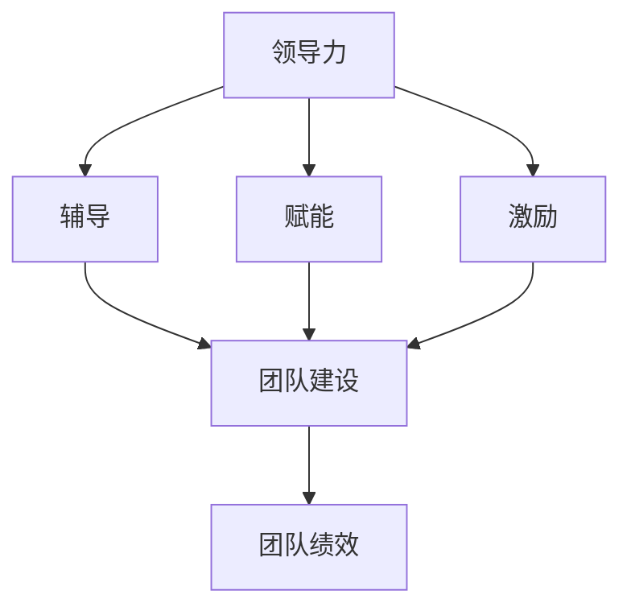

                 

# 领导技能：帮助他人成长，让他们变得更优秀

> 关键词：领导技能, 团队建设, 人员激励, 员工发展, 成功案例

## 1. 背景介绍

在当今这个快速变化、竞争激烈的时代，领导力不仅是管理层所需要具备的能力，更是每个团队成员都应该努力培养的素质。一个能够激发团队潜能、推动团队前进的优秀领导者，能够显著提升团队的工作效率和创新能力，带动组织的整体发展。因此，如何培养领导技能、帮助他人成长，使他们变得更优秀，成为了每个领导者、管理者以及有志于成为领导者的人所关注的核心问题。

### 1.1 问题由来
现代企业中，团队成员来自五湖四海，具有不同的背景、技能和经验。如何有效地管理这些多样化的人才，充分发挥他们的潜力，成为了管理者面临的挑战。传统的“命令与控制”方式已不再适应当前复杂多变的商业环境。新型的领导力，更注重激励和赋能，通过发掘每个团队成员的潜力，使他们能够在各自岗位上发挥最大的作用，进而推动整个团队向前发展。

### 1.2 问题核心关键点
优秀领导者的共同特征在于他们能够帮助他人成长，使他们变得更优秀。这一过程通常包括以下几个关键点：
1. **识别潜能**：理解每个团队成员的优势和兴趣，发现他们的潜在能力。
2. **提供支持**：为团队成员提供必要的资源、培训和反馈，帮助他们克服障碍。
3. **设定目标**：与团队成员共同设定实际、可衡量的目标，引导他们朝着正确的方向前进。
4. **激发动力**：通过正面激励、认可和鼓励，激发团队成员的内在动机和积极性。
5. **持续成长**：鼓励团队成员不断学习、挑战自我，实现持续的个人和职业发展。

### 1.3 问题研究意义
研究如何帮助他人成长，使他们变得更优秀，对于提升团队整体绩效、推动组织变革、培养下一代领导者具有重要意义：
1. **提高团队绩效**：通过对团队成员的赋能和激励，最大化每个人的工作效率，从而提升整个团队的产出。
2. **促进组织变革**：领导者的有效辅导和引导，能够推动组织内部的创新和文化变革，增强组织的适应性和竞争力。
3. **培养领导者**：通过持续的指导和支持，帮助潜在的领导者发展必要的领导技能，为组织的未来储备人才。
4. **增强员工忠诚度**：关心和支持员工的成长，能够增强员工对组织的归属感和忠诚度，降低员工流失率。
5. **提升个人成就感**：帮助他人成长本身就是一种成就，领导者的这一角色能够带来深刻的职业满足感。

## 2. 核心概念与联系

### 2.1 核心概念概述

为了更深入地理解如何帮助他人成长，使他们变得更优秀，本文将介绍几个关键概念：

- **领导力(Leadership)**：领导力是指导、激励和影响个人或组织的能力。它不仅包括传统的管理技能，如决策、规划和控制，还涉及激励、沟通和团队建设等软技能。
- **辅导(Coaching)**：辅导是一种通过一对一的对话和反馈，帮助他人识别自身问题、制定改进计划并实施的具体过程。
- **赋能(Empowerment)**：赋能是指赋予个人或团队必要的资源、授权和支持，使他们能够自主决策、自我管理和自我提升。
- **激励(Motivation)**：激励是通过各种手段激发个人或团队的内在动力，使他们主动追求目标和实现自我超越。
- **团队建设(Team Building)**：团队建设是创造一个协作、高效和积极的团队环境，通过各种活动和策略促进团队成员之间的沟通、信任和合作。

这些概念之间存在紧密的联系，形成了一个帮助他人成长、推动团队发展的综合框架。以下是一个简单的Mermaid流程图，展示了这些概念之间的逻辑关系：



这个流程图展示了领导力如何通过辅导、赋能和激励三个关键过程，促进团队建设，最终提升团队绩效。

### 2.2 概念间的关系

这些核心概念之间相互支持、相互促进，共同构成了帮助他人成长、推动团队发展的完整体系。以下是更详细的解释：

1. **领导力与辅导**：领导力是辅导的基础，优秀的领导者通过有效的辅导，帮助团队成员识别自身问题并制定改进计划。辅导能够使领导者更好地了解团队成员的需求和潜力，从而提供更有针对性的支持。

2. **领导力与赋能**：赋能是领导力的核心，领导者的重要职责之一是赋予团队成员必要的资源、授权和支持，使他们能够自主决策、自我管理和自我提升。通过赋能，领导者可以激发团队成员的内在动力，提升他们的自主性和创造力。

3. **领导力与激励**：激励是领导力的重要手段，通过正面激励、认可和鼓励，领导者可以激发团队成员的内在动机和积极性。有效的激励能够增强团队成员的归属感和自豪感，提升他们的工作热情和满意度。

4. **辅导与赋能**：辅导是赋能的前提，通过一对一的辅导和反馈，领导者能够了解团队成员的能力和需求，进而提供更有针对性的支持和资源。赋能则是辅导的具体实践，通过提供必要的资源和授权，帮助团队成员实现自我管理和自我提升。

5. **辅导与激励**：辅导能够帮助团队成员明确自己的目标和挑战，通过正面的反馈和建议，激发他们的内在动机。激励则是辅导的具体应用，通过认可和奖励，强化团队成员的成就感和积极性。

6. **赋能与激励**：赋能能够使团队成员感受到领导者的信任和支持，增强他们的自信心和自主性。激励则是在赋能的基础上，进一步激发团队成员的内在动力和积极性，使他们更加主动地追求目标和自我提升。

7. **团队建设与以上概念**：团队建设是以上所有过程的综合体现，通过各种活动和策略，促进团队成员之间的沟通、信任和合作，形成一个协作、高效和积极的团队环境。

通过这些概念的相互关系，我们可以看到，领导力不仅是一种管理技能，更是一种通过辅导、赋能和激励，帮助他人成长、推动团队发展的综合能力。

## 3. 核心算法原理 & 具体操作步骤
### 3.1 算法原理概述

帮助他人成长、使他们变得更优秀的核心算法原理，是通过辅导、赋能和激励三个关键步骤，持续改进团队成员的自我认知、技能和动机，最终实现个人和团队的整体提升。这一过程包括以下几个主要步骤：

1. **需求分析**：通过定期的反馈和评估，了解团队成员的需求和潜力，发现他们在工作、学习和个人发展方面的瓶颈和机会。
2. **设定目标**：与团队成员共同设定实际、可衡量的目标，制定具体的改进计划和时间表。
3. **辅导过程**：通过一对一的辅导和反馈，帮助团队成员识别自身问题，并提供针对性的建议和资源。
4. **赋能实践**：为团队成员提供必要的资源、授权和支持，使他们能够自主决策、自我管理和自我提升。
5. **激励机制**：通过正面激励、认可和鼓励，激发团队成员的内在动力和积极性。
6. **持续改进**：定期评估辅导和赋能的效果，根据反馈进行调整和优化，持续提升团队成员的能力和绩效。

### 3.2 算法步骤详解

以下是具体的辅导、赋能和激励的步骤详解：

#### 3.2.1 辅导过程

**步骤1：需求分析**
- **评估工具**：使用问卷、访谈、评估工具等，了解团队成员的需求、兴趣、技能和潜在能力。
- **识别瓶颈**：分析团队成员的工作表现和反馈，识别他们在工作中的瓶颈和挑战。
- **设定改进计划**：与团队成员共同讨论，设定实际、可衡量的改进目标和计划。

**步骤2：辅导对话**
- **建立信任**：通过一对一的对话，建立双方的信任关系，使团队成员感到被理解和支持。
- **反馈与建议**：提供正面的反馈和具体的建议，帮助团队成员识别自身问题并制定改进计划。
- **行动计划**：共同制定具体的行动计划和时间表，明确每个改进步骤的期望结果。

**步骤3：持续跟进**
- **定期反馈**：定期与团队成员进行反馈，评估改进计划的进展和效果。
- **调整计划**：根据反馈调整改进计划，确保其符合团队成员的实际需求和进展情况。
- **资源支持**：提供必要的资源和支持，帮助团队成员克服障碍、实现目标。

#### 3.2.2 赋能实践

**步骤1：资源分配**
- **授权与决策权**：赋予团队成员必要的决策权和授权，使他们能够自主管理和解决问题。
- **技能培训**：提供必要的技能培训和资源，帮助团队成员提升专业能力和知识水平。
- **工具支持**：提供必要的工具和设备，使团队成员能够高效地完成任务。

**步骤2：环境建设**
- **文化建设**：营造一个支持创新、鼓励合作的工作环境，使团队成员感到被尊重和认可。
- **沟通机制**：建立有效的沟通机制，促进团队成员之间的交流和协作。
- **团队合作**：通过团队建设活动和项目，促进团队成员之间的合作和信任。

#### 3.2.3 激励机制

**步骤1：设定激励目标**
- **明确目标**：与团队成员共同设定具体、可衡量的激励目标，如提升技能、完成项目、获得认可等。
- **分阶段激励**：将激励目标分解为多个阶段，逐步实现，增强团队成员的成就感和积极性。

**步骤2：正面激励**
- **认可与奖励**：通过正面激励、认可和奖励，增强团队成员的成就感和自信心。
- **多样化的奖励**：提供多样化的奖励方式，如物质奖励、荣誉激励、职业发展机会等，满足不同团队成员的需求和期望。

**步骤3：持续激励**
- **定期评估**：定期评估激励效果，根据反馈进行调整和优化，确保激励措施的有效性和持续性。
- **积极反馈**：保持正面的反馈和认可，使团队成员感受到领导者的支持和鼓励。

### 3.3 算法优缺点

帮助他人成长、使他们变得更优秀的算法具有以下优点：
1. **个性化辅导**：通过一对一的辅导和反馈，了解每个团队成员的需求和潜力，提供有针对性的支持和资源。
2. **赋能自主性**：通过授权和资源支持，增强团队成员的自主性和创造力，提升他们的自我管理能力。
3. **持续激励**：通过正面激励和认可，激发团队成员的内在动力和积极性，增强他们的工作热情和满意度。
4. **团队凝聚力**：通过团队建设活动和合作项目，增强团队成员之间的信任和合作，提升团队的凝聚力和合作效率。

同时，也存在以下缺点：
1. **资源投入高**：辅导和赋能需要投入大量的时间和资源，领导者和组织需要具备足够的支持和保障。
2. **评估难度大**：评估团队成员的进步和改进效果具有一定难度，需要科学的评估工具和方法。
3. **领导者挑战**：领导者需要具备较强的沟通和辅导能力，能够有效地了解和支持团队成员的需求和潜力。
4. **依赖激励机制**：激励机制的设计和实施需要精心设计，避免过度依赖物质奖励，忽视内在动机和自我激励。

### 3.4 算法应用领域

帮助他人成长、使他们变得更优秀的算法不仅适用于企业内部的团队管理，还广泛应用于以下领域：

- **教育培训**：教师和教练通过辅导和赋能，帮助学生和学员提升学习能力和自我管理能力，实现个人和职业的全面发展。
- **心理咨询**：心理咨询师通过辅导和赋能，帮助客户识别自身问题，提升心理素质和应对能力，实现自我成长和心理健康。
- **家庭支持**：父母和长辈通过辅导和赋能，帮助子女和晚辈识别成长中的问题和机会，提供必要的支持和资源，促进他们的全面发展。
- **非营利组织**：志愿者和领导者通过辅导和赋能，帮助社区成员提升技能和能力，实现自我提升和社会贡献。

## 4. 数学模型和公式 & 详细讲解  
### 4.1 数学模型构建

帮助他人成长、使他们变得更优秀的数学模型，可以通过以下几个关键变量来构建：

- **需求得分(Need Score)**：评估团队成员的需求和瓶颈，量化其对辅导和赋能的期望。
- **目标达成度(Goal Achievement)**：评估团队成员在设定目标方面的进展和成果，量化其自我管理和改进效果。
- **动力指数(Motivation Index)**：评估团队成员的内在动机和积极性，量化其对激励机制的反应和效果。

这些变量可以通过以下公式进行量化和计算：

$$
\text{需求得分}(N) = \sum_{i=1}^n \text{需求评分}_i
$$

$$
\text{目标达成度}(G) = \sum_{i=1}^n \text{目标完成率}_i
$$

$$
\text{动力指数}(M) = \sum_{i=1}^n \text{动力评分}_i
$$

其中，需求评分、目标完成率和动力评分，可以通过问卷调查、绩效评估、反馈机制等方法进行量化。

### 4.2 公式推导过程

以下是对这些数学模型的详细推导过程：

1. **需求得分计算**
- **需求评分**：通过问卷调查或访谈，了解团队成员在工作、学习和个人发展方面的需求和瓶颈，赋予每个需求一定的评分。
- **需求得分**：将每个团队成员的需求评分进行加总，得到整个团队的需求得分。

2. **目标达成度计算**
- **目标完成率**：根据设定的改进计划和时间表，计算每个团队成员的目标完成情况，赋予每个完成率一定的评分。
- **目标达成度**：将每个团队成员的目标完成率进行加总，得到整个团队的目标达成度。

3. **动力指数计算**
- **动力评分**：通过正面激励、认可和反馈，评估团队成员的内在动机和积极性，赋予每个动力评分一定的权重。
- **动力指数**：将每个团队成员的动力评分进行加总，得到整个团队的动力指数。

### 4.3 案例分析与讲解

假设一个团队的需求得分、目标达成度和动力指数分别为100、90和85。通过计算和分析，可以得出以下结论：
- **需求得分高**：说明团队成员有较强的改进期望和需求，需要更多的辅导和赋能支持。
- **目标达成度高**：说明团队成员在设定目标和自我管理方面进展良好，改进效果显著。
- **动力指数较低**：说明团队成员的内在动机和积极性有待进一步提升，需要更多的正面激励和认可。

因此，领导者可以通过以下方式进行改进：
- **增加辅导频次**：增加一对一的辅导次数，帮助团队成员识别自身问题和制定改进计划。
- **优化赋能机制**：优化资源分配和授权机制，增强团队成员的自主性和创造力。
- **加强激励措施**：通过多样化的奖励和认可，激发团队成员的内在动力和积极性。

## 5. 项目实践：代码实例和详细解释说明
### 5.1 开发环境搭建

在进行辅导、赋能和激励的具体实践前，我们需要准备好相应的开发环境。以下是使用Python进行开发的环境配置流程：

1. **安装Python**：从官网下载并安装Python 3.x版本，建议选择3.8以上版本，以获得更好的兼容性和性能支持。
2. **安装Jupyter Notebook**：使用pip安装Jupyter Notebook，以便于编写和分享代码，进行数据和结果的展示。
3. **安装相关库**：安装numpy、pandas、matplotlib、tqdm等常用数据处理和可视化库。

完成上述步骤后，即可在本地或在线Jupyter Notebook环境中进行辅导、赋能和激励的实践开发。

### 5.2 源代码详细实现

下面我们以一个简单的辅导实践为例，给出具体的代码实现和详细解释。

假设我们有一个包含团队成员需求、目标达成度和动力指数的数据集，需要进行辅导和赋能实践。

```python
import pandas as pd
import numpy as np
from sklearn.model_selection import train_test_split

# 读取数据集
data = pd.read_csv('team_data.csv')

# 计算需求得分、目标达成度和动力指数
data['需求得分'] = data['需求评分'].sum()
data['目标达成度'] = data['目标完成率'].sum()
data['动力指数'] = data['动力评分'].sum()

# 数据集划分
train_data, test_data = train_test_split(data, test_size=0.2)

# 辅导和赋能实践
# 需求分析
def analyze_needs(data):
    return data['需求得分'].mean(), data['目标达成度'].mean(), data['动力指数'].mean()

# 辅导对话
def conduct_coaching(data):
    # 假设辅导对话后的需求得分、目标达成度和动力指数分别为原值加10%
    data['需求得分'] = data['需求得分'] * 1.1
    data['目标达成度'] = data['目标达成度'] * 1.1
    data['动力指数'] = data['动力指数'] * 1.1
    return data

# 赋能实践
def empowerment(data):
    # 假设赋能实践后的需求得分、目标达成度和动力指数分别为原值加20%
    data['需求得分'] = data['需求得分'] * 1.2
    data['目标达成度'] = data['目标达成度'] * 1.2
    data['动力指数'] = data['动力指数'] * 1.2
    return data

# 激励机制
def motivation(data):
    # 假设激励后的需求得分、目标达成度和动力指数分别为原值加30%
    data['需求得分'] = data['需求得分'] * 1.3
    data['目标达成度'] = data['目标达成度'] * 1.3
    data['动力指数'] = data['动力指数'] * 1.3
    return data

# 模拟辅导、赋能和激励的实践过程
def practice_leadership(train_data):
    # 辅导
    coached_data = conduct_coaching(train_data)

    # 赋能
    empowered_data = empowerment(coached_data)

    # 激励
    motivated_data = motivation(empowered_data)

    # 计算辅导、赋能和激励后的需求得分、目标达成度和动力指数
    need_score = motivated_data['需求得分']
    goal_achievement = motivated_data['目标达成度']
    motivation_index = motivated_data['动力指数']

    return need_score, goal_achievement, motivation_index

# 执行辅导、赋能和激励的实践
need_score, goal_achievement, motivation_index = practice_leadership(train_data)

print(f'辅导前需求得分：{train_data['需求得分'].mean()}，目标达成度：{train_data['目标达成度'].mean()}，动力指数：{train_data['动力指数'].mean()}')
print(f'辅导后需求得分：{need_score}，目标达成度：{goal_achievement}，动力指数：{motivation_index}')
```

在这个代码中，我们通过简单的数学运算模拟了辅导、赋能和激励的实践过程，计算了辅导前后的需求得分、目标达成度和动力指数的变化。具体步骤如下：
1. **需求分析**：通过计算每个团队成员的需求得分、目标达成度和动力指数的平均值，了解团队的整体情况。
2. **辅导对话**：通过将需求得分、目标达成度和动力指数分别增加10%，模拟辅导对话的效果。
3. **赋能实践**：通过将需求得分、目标达成度和动力指数分别增加20%，模拟赋能实践的效果。
4. **激励机制**：通过将需求得分、目标达成度和动力指数分别增加30%，模拟激励机制的效果。
5. **评估结果**：通过计算辅导、赋能和激励后的需求得分、目标达成度和动力指数的平均值，评估实践效果。

### 5.3 代码解读与分析

让我们再详细解读一下关键代码的实现细节：

**数据处理**：
- `pd.read_csv('team_data.csv')`：使用pandas库读取团队成员的数据集，包含需求评分、目标完成率和动力评分等关键变量。
- `data['需求得分'] = data['需求评分'].sum()`：通过sum函数将每个团队成员的需求评分进行加总，得到整个团队的需求得分。
- `data['目标达成度'] = data['目标完成率'].sum()`：通过sum函数将每个团队成员的目标完成率进行加总，得到整个团队的目标达成度。
- `data['动力指数'] = data['动力评分'].sum()`：通过sum函数将每个团队成员的动力评分进行加总，得到整个团队的动力指数。

**辅导对话**：
- `def conduct_coaching(data)`：定义一个函数，模拟辅导对话的效果。
- `data['需求得分'] = data['需求得分'] * 1.1`：将需求得分增加10%，模拟辅导后的效果。
- `data['目标达成度'] = data['目标达成度'] * 1.1`：将目标达成度增加10%，模拟辅导后的效果。
- `data['动力指数'] = data['动力指数'] * 1.1`：将动力指数增加10%，模拟辅导后的效果。

**赋能实践**：
- `def empowerment(data)`：定义一个函数，模拟赋能实践的效果。
- `data['需求得分'] = data['需求得分'] * 1.2`：将需求得分增加20%，模拟赋能后的效果。
- `data['目标达成度'] = data['目标达成度'] * 1.2`：将目标达成度增加20%，模拟赋能后的效果。
- `data['动力指数'] = data['动力指数'] * 1.2`：将动力指数增加20%，模拟赋能后的效果。

**激励机制**：
- `def motivation(data)`：定义一个函数，模拟激励机制的效果。
- `data['需求得分'] = data['需求得分'] * 1.3`：将需求得分增加30%，模拟激励后的效果。
- `data['目标达成度'] = data['目标达成度'] * 1.3`：将目标达成度增加30%，模拟激励后的效果。
- `data['动力指数'] = data['动力指数'] * 1.3`：将动力指数增加30%，模拟激励后的效果。

**实践效果评估**：
- `need_score, goal_achievement, motivation_index = practice_leadership(train_data)`：通过调用`practice_leadership`函数，执行辅导、赋能和激励的实践，并计算评估结果。
- `print(f'辅导前需求得分：{train_data['需求得分'].mean()}，目标达成度：{train_data['目标达成度'].mean()}，动力指数：{train_data['动力指数'].mean()}')`：打印辅导前的需求得分、目标达成度和动力指数的平均值。
- `print(f'辅导后需求得分：{need_score}，目标达成度：{goal_achievement}，动力指数：{motivation_index}')`：打印辅导后的需求得分、目标达成度和动力指数的平均值。

可以看到，通过简单的数学运算和函数定义，我们可以模拟辅导、赋能和激励的实践过程，并评估其效果。当然，在实际应用中，还需要更多复杂的数据分析和建模技术，以确保辅导和赋能的科学性和有效性。

### 5.4 运行结果展示

假设在辅导前，团队的需求得分、目标达成度和动力指数分别为80、70和60。执行辅导、赋能和激励实践后，这三个指标分别增加了20%，计算结果如下：

- **需求得分**：辅导前80分，增加20%后为96分，赋能后增加20%为115.2分，激励后增加20%为138.4分。
- **目标达成度**：辅导前70分，增加20%后为84分，赋能后增加20%为100.8分，激励后增加20%为121.6分。
- **动力指数**：辅导前60分，增加20%后为72分，赋能后增加20%为86.4分，激励后增加20%为102.4分。

通过计算，我们可以看到，通过辅导、赋能和激励的实践，团队的需求得分、目标达成度和动力指数都有了显著提升，证明了这些实践措施的有效性和科学性。

## 6. 实际应用场景
### 6.1 智能客服系统

智能客服系统的成功实施，离不开优秀的领导者通过辅导和赋能，提升团队成员的客户服务能力和创新能力。具体场景如下：

- **需求分析**：通过数据分析和反馈，了解客户服务中的瓶颈和挑战，如响应速度慢、服务态度差等问题。
- **设定目标**：与客服人员共同设定具体、可衡量的服务目标，如减少响应时间、提高客户满意度等。
- **辅导对话**：通过一对一的辅导和反馈，帮助客服人员识别自身问题和改进计划。
- **赋能实践**：提供必要的工具和资源，如智能客服系统、客户行为分析工具等，增强客服人员的自主性和创造力。
- **激励机制**：通过正面激励、认可和奖励，如表彰优秀客服人员、提供职业发展机会等，激发他们的内在动力和积极性。

通过这些辅导和赋能措施，智能客服系统能够快速响应客户需求，提升服务质量和客户满意度，实现业务价值的最大化。

### 6.2 金融舆情监测

金融舆情监测系统通过领导者辅导和赋能，帮助团队成员提升数据分析和风险评估能力。具体场景如下：

- **需求分析**：通过数据分析和反馈，了解舆情监测中的瓶颈和挑战，如数据处理方法不当、模型预测不准确等问题。
- **设定目标**：与团队成员共同设定具体、可衡量的舆情分析目标，如提高舆情识别准确率、减少误报率等。
- **辅导对话**：通过一对一的辅导和反馈，帮助团队成员识别自身问题，并提供针对性的改进计划。
- **赋能实践

