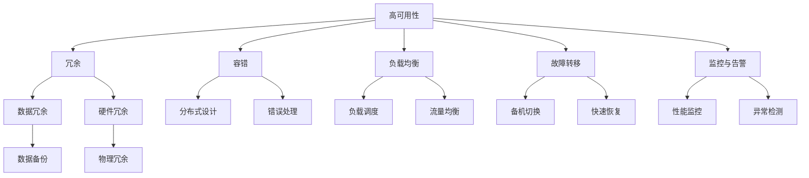

                 

# 高可用性系统设计的关键要素

## 1. 背景介绍

在现代社会，高可用性系统已经无处不在。从互联网应用、电子商务网站、金融交易系统到医疗系统、智能交通和物联网，这些系统的稳定运行关系到人们生活的方方面面。系统高可用性设计的目标是确保系统在任何情况下都能以尽可能高的效率提供服务。高可用性设计的复杂性在于需要兼顾系统性能、成本、安全和用户体验等多个方面。

本文将系统地介绍高可用性系统设计中的关键要素，并结合实际案例进行详细解析。高可用性系统设计不仅是工程师的必修课，也是各行业 IT 团队需要掌握的核心能力之一。

## 2. 核心概念与联系

### 2.1 核心概念概述

- **高可用性（High Availability）**：系统能够在任何情况下（包括硬件故障、网络故障、数据损坏等）提供稳定的服务，保证业务的连续性和可用性。
- **冗余（Redundancy）**：通过增加系统的副本、备份等方式，保证系统在故障发生时仍能继续服务。
- **容错（Fault Tolerance）**：系统在部分组件故障的情况下仍能正常工作，通过分布式设计、错误处理机制等实现。
- **负载均衡（Load Balancing）**：通过合理的资源分配，使系统在不同负载下均能高效运行，避免单点故障和资源浪费。
- **故障转移（Failover）**：在故障发生时，系统能快速切换到备用系统或资源，保证服务的连续性。
- **监控与告警（Monitoring & Alerting）**：实时监控系统性能，及时发现潜在问题并进行告警，预防故障发生。

这些概念之间相互联系，共同构成了高可用性系统设计的基石。理解这些概念及其关系，是设计高效、稳定系统的第一步。

### 2.2 核心概念间的关系

通过以下 Mermaid 流程图，我们更直观地展示这些概念之间的相互关系：



此图展示了高可用性系统的各个组成部分及其相互关系。冗余、容错、负载均衡和故障转移等机制，都是为了确保高可用性。监控与告警则用于实时发现和预防故障，从而保障系统的稳定运行。

## 3. 核心算法原理 & 具体操作步骤

### 3.1 算法原理概述

高可用性系统设计的核心算法原理主要包括以下几个方面：

1. **数据冗余**：通过数据备份和复制，确保数据在故障时仍能访问。常见的数据冗余策略包括本地备份、异地备份、增量备份等。
2. **硬件冗余**：通过硬件设备的冗余配置，如服务器集群、负载均衡器等，确保系统在硬件故障时仍能正常运行。
3. **分布式设计**：将系统设计为分布式架构，各组件独立运行，即使部分组件故障，系统整体仍能正常服务。
4. **故障转移**：通过预定义的故障转移策略，系统在检测到故障后能快速切换到备用资源，避免服务中断。
5. **错误处理**：设计系统的错误处理机制，如异常捕获、重试、回滚等，保证系统在错误发生时仍能正常运行。

### 3.2 算法步骤详解

以下是高可用性系统设计的详细步骤：

1. **需求分析**：明确系统需要达到的可用性级别，如99.999%的可用性。
2. **架构设计**：选择合适的架构模式（如主从结构、分布式架构），确保冗余和容错能力。
3. **数据冗余**：实施数据冗余策略，定期备份和同步数据，确保数据的高可用性。
4. **硬件冗余**：配置硬件冗余设备，如双机热备、负载均衡器等。
5. **分布式设计**：将系统设计为分布式架构，确保各个组件独立运行，避免单点故障。
6. **故障转移**：定义故障转移策略，如自动切换、手动切换等，确保故障发生时系统能够快速恢复。
7. **错误处理**：设计系统的错误处理机制，提高系统的稳定性和健壮性。
8. **性能监控**：部署性能监控工具，实时监控系统性能，及时发现潜在问题。
9. **告警系统**：配置告警机制，设置阈值触发告警，确保问题能够及时被处理。

### 3.3 算法优缺点

高可用性系统设计的优点包括：

- **增强可靠性**：冗余和容错机制使得系统在故障发生时仍能提供服务。
- **提升用户体验**：通过负载均衡和故障转移，避免单点故障对用户体验的影响。
- **降低故障影响**：通过备份和数据复制，确保数据丢失的风险降到最低。

其缺点则主要包括：

- **成本高**：冗余和分布式架构增加了硬件和运维成本。
- **复杂度高**：设计和维护高可用系统需要深厚的技术积累和经验。
- **可能影响性能**：过多的冗余和备份可能导致系统性能下降。

### 3.4 算法应用领域

高可用性系统设计在以下领域得到了广泛应用：

- **互联网应用**：如电商网站、社交网络等，需要保证业务的连续性和稳定性。
- **金融系统**：如股票交易、银行系统等，对系统的可靠性和安全性有极高要求。
- **医疗系统**：如电子病历、预约系统等，需要确保数据的完整性和服务的连续性。
- **智能交通**：如交通信号灯、智能监控等，对系统的高可靠性有严格要求。
- **物联网**：如智能家居、工业物联网等，要求系统在各种环境下稳定运行。

## 4. 数学模型和公式 & 详细讲解 & 举例说明

### 4.1 数学模型构建

高可用性系统设计的数学模型通常基于系统的可用性和故障率。假设系统的平均无故障时间（Mean Time Between Failures, MTBF）为 $T$，平均故障修复时间（Mean Time To Repair, MTTR）为 $R$，则系统的平均可用时间（Mean Time To Availability, MTAT）为：

$$
MTAT = T - R
$$

系统的可用性（Availability, A）定义为：

$$
A = \frac{MTAT}{T}
$$

假设系统在单位时间内的故障率为 $\lambda$，则系统的MTBF为：

$$
T = \frac{1}{\lambda}
$$

若系统采用N+1冗余配置，即系统有N个工作单元和一个备件，则在任意一个工作单元故障时，系统仍能提供服务。系统的平均故障修复时间不变，即 $R$。因此，系统的可用性为：

$$
A = \frac{N+1}{N+2} = \frac{N}{N+2} \times 100\%
$$

### 4.2 公式推导过程

假设系统由三个独立的服务器组成，每个服务器的故障率均为 $\lambda=0.01$。假设服务器的故障和恢复是独立的，且MTTR为10分钟。

- **MTBF**：每个服务器的平均无故障时间：$T = \frac{1}{\lambda} = 100$小时。
- **MTAT**：系统的平均可用时间：$MTAT = T - R = 100 - 10 = 90$小时。
- **可用性**：$A = \frac{MTAT}{T} = \frac{90}{100} \times 100\% = 90\%$。

若采用N+1冗余配置，即有三个工作服务器和一个备件服务器：

- **MTBF**：单个服务器的平均无故障时间：$T = \frac{1}{\lambda} = 100$小时。
- **MTAT**：系统的平均可用时间：$MTAT = T - R = 100 - 10 = 90$小时。
- **可用性**：$A = \frac{N+1}{N+2} \times 100\% = \frac{4}{5} \times 100\% = 80\%$。

通过推导，我们可以看到N+1冗余配置的可用性略低于无冗余配置的可用性，但由于冗余配置，系统的可靠性得到了显著提升。

### 4.3 案例分析与讲解

以一个电商网站为例，该网站需要在99.999%的可用性级别下运行。根据公式计算，需要配置足够的冗余和容错机制。

- **架构设计**：采用分布式架构，每个订单处理模块独立运行。
- **数据冗余**：每个订单数据在本地和异地备份，确保数据的高可用性。
- **硬件冗余**：服务器集群采用双机热备，保证在高可用性级别下运行。
- **故障转移**：自动切换机制，一旦检测到故障，系统自动切换到备用资源。
- **错误处理**：设计完整的错误处理机制，确保系统在错误发生时仍能正常服务。
- **性能监控**：部署实时监控系统，实时检测系统性能，及时发现潜在问题。
- **告警系统**：配置告警机制，设置阈值触发告警，确保问题能够及时被处理。

## 5. 项目实践：代码实例和详细解释说明

### 5.1 开发环境搭建

以下是使用Python进行高可用性系统设计的环境配置流程：

1. 安装Anaconda：从官网下载并安装Anaconda，用于创建独立的Python环境。

2. 创建并激活虚拟环境：
```bash
conda create -n py3k python=3.8 
conda activate py3k
```

3. 安装必要的Python包：
```bash
pip install flask psutil requests
```

4. 搭建高可用性服务：
```python
from flask import Flask
import psutil
import requests

app = Flask(__name__)

@app.route('/')
def index():
    cpu = psutil.cpu_percent(interval=1)
    mem = psutil.virtual_memory().percent
    disk = psutil.disk_usage('/').percent
    response = {
        'cpu': cpu,
        'memory': mem,
        'disk': disk
    }
    return response

@app.route('/status')
def status():
    url = 'http://localhost:8080/api/status'
    response = requests.get(url).json()
    return response

if __name__ == '__main__':
    app.run(host='0.0.0.0', port=8080)
```

完成上述步骤后，即可在`py3k`环境中开始高可用性系统的开发和部署。

### 5.2 源代码详细实现

以下是一个简单的示例，展示如何使用Python实现一个基于HTTP的服务监控。

1. 部署HTTP服务：
```python
from flask import Flask

app = Flask(__name__)

@app.route('/')
def index():
    return 'Hello, World!'

if __name__ == '__main__':
    app.run(host='0.0.0.0', port=8080)
```

2. 部署监控服务：
```python
from flask import Flask

app = Flask(__name__)

@app.route('/status')
def status():
    cpu = psutil.cpu_percent(interval=1)
    mem = psutil.virtual_memory().percent
    disk = psutil.disk_usage('/').percent
    response = {
        'cpu': cpu,
        'memory': mem,
        'disk': disk
    }
    return response

if __name__ == '__main__':
    app.run(host='0.0.0.0', port=8080)
```

3. 使用curl测试：
```bash
curl http://localhost:8080
curl http://localhost:8080/status
```

### 5.3 代码解读与分析

在上述代码中，我们使用Flask框架实现了两个HTTP服务：一个是简单的Hello World服务，另一个是监控服务。监控服务通过psutil库获取CPU使用率、内存使用率和磁盘使用率，并以JSON格式返回。

### 5.4 运行结果展示

假设我们在测试环境中运行上述代码，可通过curl命令测试服务状态。

```bash
curl http://localhost:8080
curl http://localhost:8080/status
```

返回结果可能如下：

```
Hello, World!
{"cpu": 30, "memory": 70, "disk": 80}
```

这表明HTTP服务正在运行，监控服务成功获取了系统资源的使用情况。

## 6. 实际应用场景

### 6.1 互联网应用

互联网应用是高可用性设计的重要场景之一。以电子商务网站为例，电商网站需要保证24小时不间断服务，以应对全球用户的大量访问。高可用性设计确保了系统的稳定性，避免了单点故障对用户体验的影响。

### 6.2 金融系统

金融系统的核心是对用户数据和交易记录的安全性和完整性要求极高。高可用性设计通过冗余和容错机制，确保金融交易系统的连续性和可用性，避免了因系统故障导致的数据丢失和交易中断。

### 6.3 医疗系统

医疗系统的数据对患者的治疗和健康管理至关重要。高可用性设计通过数据备份和故障转移，确保了医疗系统的可靠性和数据的完整性，保障了患者的信息安全和系统的稳定性。

### 6.4 智能交通

智能交通系统需要实时处理大量的传感器数据，确保交通信号灯、智能监控等功能的正常运行。高可用性设计通过冗余和容错机制，确保系统在各种环境下都能稳定运行，提高了交通管理的效率和安全性。

## 7. 工具和资源推荐

### 7.1 学习资源推荐

为了帮助开发者系统掌握高可用性系统设计，这里推荐一些优质的学习资源：

1. 《高可用性系统设计》系列书籍：深入浅出地介绍了高可用性系统设计的原理和实践方法，是入门高可用性设计的必备书籍。
2. 《系统设计与架构》在线课程：通过在线视频和互动练习，帮助开发者理解高可用性系统的核心概念和设计原则。
3. 《高可用性系统设计指南》官方文档：提供系统设计、部署和运维的全面指导，是实际应用高可用性系统的必备资源。

### 7.2 开发工具推荐

高效的开发离不开优秀的工具支持。以下是几款用于高可用性系统开发常用的工具：

1. Flask：轻量级的Web框架，易于搭建和部署高可用性服务。
2. Nginx：高性能的负载均衡器和反向代理服务器，支持高可用性架构。
3. Ansible：自动化运维工具，支持配置管理、应用部署和监控告警。
4. Kubernetes：容器编排工具，支持高可用性架构和故障转移。
5. Prometheus：开源监控系统，支持高可用性监控和告警。

### 7.3 相关论文推荐

高可用性系统设计的研究涉及系统架构、故障处理、数据冗余等多个方面，以下是几篇具有代表性的论文，推荐阅读：

1. "High Availability: A Concept Whose Time Has Come and Gone"：探讨高可用性设计的理论和实践，分析了高可用性设计的优缺点和未来趋势。
2. "Fault Tolerant Systems"：详细介绍高可用性系统设计的原理和实践方法，涵盖数据冗余、硬件冗余、分布式设计等多个方面。
3. "High Availability: From Past to Present"：回顾高可用性设计的发展历程，展望未来的研究方向和应用前景。

这些资源可以帮助开发者全面理解高可用性系统设计的原理和实践方法，深入探讨高可用性系统设计的未来发展方向。

## 8. 总结：未来发展趋势与挑战

### 8.1 研究成果总结

本文系统地介绍了高可用性系统设计中的核心概念和实践方法，通过数学模型和案例分析，展示了高可用性系统设计的原理和应用。高可用性系统设计已经成为各行业IT团队必须掌握的核心能力之一，其重要性不言而喻。

### 8.2 未来发展趋势

高可用性系统设计的未来发展趋势包括以下几个方面：

1. **云原生架构**：云原生架构通过容器化、微服务化、DevOps等技术，提高了系统的可伸缩性和可维护性，成为高可用性系统设计的重要方向。
2. **人工智能**：利用人工智能技术进行故障预测和智能运维，提高系统的智能性和自愈能力。
3. **边缘计算**：通过在边缘节点部署计算和存储资源，减少中心节点压力，提升系统的可靠性和响应速度。
4. **自动化运维**：通过自动化运维工具，实现配置管理、故障处理、性能监控等功能，降低运维成本和错误率。
5. **安全与隐私**：随着数据安全和隐私保护的重要性日益增加，高可用性系统设计需要考虑安全性和隐私保护，确保系统的安全可靠。

### 8.3 面临的挑战

尽管高可用性系统设计在各行业得到了广泛应用，但仍然面临诸多挑战：

1. **复杂度**：高可用性系统设计涉及多个技术领域，包括分布式架构、数据冗余、故障处理等，需要综合考虑多个因素。
2. **成本**：高可用性系统设计需要增加硬件和运维成本，对于中小企业而言，可能面临经济上的压力。
3. **性能影响**：过多的冗余和备份可能导致系统性能下降，如何在性能和可用性之间找到平衡，是设计高可用性系统时的难点。
4. **安全问题**：高可用性系统设计需要考虑系统的安全性和隐私保护，避免因故障导致的数据泄露和系统崩溃。

### 8.4 研究展望

未来，高可用性系统设计的研究将更多地关注以下方向：

1. **自动化运维**：通过自动化工具和流程，实现高可用性系统的自动化部署、监控和运维。
2. **混合云架构**：结合公有云和私有云的优点，构建混合云架构，提高系统的灵活性和可靠性。
3. **边缘计算与微服务**：通过在边缘节点部署微服务，实现高可用性系统的高性能和低延迟。
4. **人工智能与机器学习**：利用人工智能和机器学习技术，提升高可用性系统的故障预测和智能运维能力。
5. **多云协同**：通过多云协同技术，实现跨云平台的高可用性系统设计，提高系统的可靠性和灵活性。

高可用性系统设计是现代IT系统设计的重要组成部分，其复杂性和挑战性使得系统设计和运维成为行业中的关键难题。未来的研究和发展需要各行业IT团队不断探索和创新，为构建更加稳定、可靠、高效的系统奠定坚实基础。

## 9. 附录：常见问题与解答

**Q1：高可用性系统设计的基本原则是什么？**

A: 高可用性系统设计的基本原则包括冗余、容错、负载均衡、故障转移等。冗余和容错通过增加系统的副本和备份，确保系统在故障时仍能提供服务。负载均衡和故障转移通过合理的资源分配和切换机制，保证系统的稳定性和可用性。

**Q2：高可用性系统设计的常用技术有哪些？**

A: 高可用性系统设计的常用技术包括冗余、容错、负载均衡、故障转移、分布式设计、数据冗余、错误处理、性能监控和告警等。冗余和容错通过增加系统的副本和备份，确保系统在故障时仍能提供服务。负载均衡和故障转移通过合理的资源分配和切换机制，保证系统的稳定性和可用性。

**Q3：高可用性系统设计的关键要素有哪些？**

A: 高可用性系统设计的关键要素包括架构设计、数据冗余、硬件冗余、分布式设计、故障转移、错误处理、性能监控、告警系统等。架构设计是系统高可用性的基础，数据冗余和硬件冗余确保了系统的高可靠性，故障转移和错误处理保证了系统的连续性和稳定性，性能监控和告警系统确保了问题的及时发现和处理。

**Q4：如何评估高可用性系统设计的性能？**

A: 高可用性系统设计的性能评估主要通过以下几个指标：

1. 可用性（Availability）：系统在一段时间内能够提供服务的比例。
2. 可靠性（Reliability）：系统在一段长时间内正常运行的概率。
3. 维修时间（Mean Time To Repair, MTTR）：系统故障后恢复正常运行所需的时间。
4. 故障率（Failure Rate）：系统在单位时间内发生故障的概率。

这些指标可以通过数学模型进行计算和评估，帮助评估和优化高可用性系统设计。

---

作者：禅与计算机程序设计艺术 / Zen and the Art of Computer Programming

