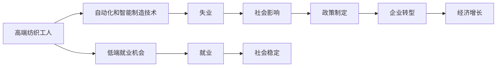
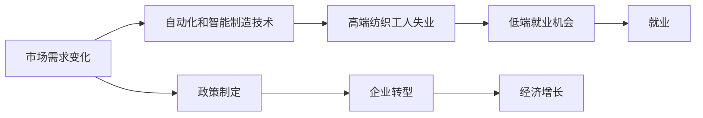

                 

# 高端纺织工人的失业与低端就业机会

## 1. 背景介绍

### 1.1 问题由来
在全球化和自动化浪潮的推动下，高端纺织行业面临严峻挑战。一方面，高端纺织品的需求正在下降，传统纺织行业的发展空间被压缩。另一方面，自动化和智能制造技术的引入，使得纺织行业对高端纺织工人的需求大幅减少。这种趋势导致了大量的高端纺织工人失业，同时也带来了新的就业机会。

### 1.2 问题核心关键点
高端纺织工人的失业与低端就业机会的问题，涉及以下几个核心关键点：

- **技术发展**：自动化和智能制造技术的发展，减少了对高端纺织工人的需求。
- **市场需求变化**：高端纺织品需求的下降，导致行业整体发展放缓。
- **劳动力转型**：失业工人需要重新找到新的就业机会，特别是在低端领域。
- **社会影响**：失业和就业机会变化对社会的稳定性和公平性产生影响。

### 1.3 问题研究意义
研究这个问题具有重要的意义：

1. **政策制定**：政府可以通过了解失业和就业机会的变化，制定更有针对性的政策和措施，帮助失业工人重新就业。
2. **企业转型**：企业可以通过优化生产流程和引入新技术，实现从高端向低端领域的转型，增加就业机会。
3. **社会稳定**：理解和解决失业和就业机会的变化，有助于社会稳定和公平，减少因就业问题引发的社会矛盾。
4. **经济增长**：通过创造新的就业机会，促进经济的持续增长和繁荣。

## 2. 核心概念与联系

### 2.1 核心概念概述

本节将介绍几个关键概念及其联系：

- **高端纺织工人**：指那些拥有高技能、能够处理复杂工作的纺织工人，如熟练操作高端设备、掌握复杂工艺等。
- **低端就业机会**：指那些技能要求较低、工资较低的职位，如仓库管理、物流配送等。
- **自动化和智能制造技术**：指通过自动化设备和智能算法，提高生产效率和产品质量的技术，如机器人、人工智能、物联网等。
- **市场需求变化**：指由于消费趋势、政策变化等因素导致的市场对特定产品或服务需求的变化。

### 2.2 概念间的关系

这些概念之间存在着紧密的联系，如图示所示：



这个流程图展示了高端纺织工人和失业、低端就业机会、社会影响、政策制定、企业转型、经济增长之间的关系。

### 2.3 核心概念的整体架构

最后，我们用一个综合的流程图来展示这些核心概念在大语言模型微调过程中的整体架构：



这个综合流程图展示了从市场需求变化到失业、低端就业机会、就业、政策制定、企业转型、经济增长的完整过程。

## 3. 核心算法原理 & 具体操作步骤

### 3.1 算法原理概述

解决高端纺织工人失业和低端就业机会的问题，需要综合运用多种算法和技术。算法原理可以分为以下几个方面：

- **失业预测算法**：通过分析历史数据和市场趋势，预测未来失业人数和失业率。
- **就业机会匹配算法**：根据失业工人的技能和市场需求，匹配合适的低端就业机会。
- **智能制造优化算法**：通过优化生产流程和引入新技术，提高生产效率和降低成本，从而创造新的就业机会。

### 3.2 算法步骤详解

#### 3.2.1 失业预测算法

1. **数据收集**：收集历史失业数据、市场需求数据、行业发展趋势等。
2. **特征提取**：从收集到的数据中提取关键特征，如行业增长率、自动化水平、技术革新等。
3. **模型训练**：使用机器学习模型（如时间序列模型、回归模型等）训练失业预测模型。
4. **模型评估**：使用验证集对模型进行评估，调整模型参数，提高预测准确度。
5. **预测应用**：利用训练好的模型对未来失业情况进行预测。

#### 3.2.2 就业机会匹配算法

1. **数据收集**：收集失业工人的技能信息、低端就业机会的岗位描述等。
2. **特征提取**：从收集到的数据中提取关键特征，如技能匹配度、岗位要求等。
3. **模型训练**：使用机器学习模型（如分类模型、匹配模型等）训练就业机会匹配模型。
4. **模型评估**：使用验证集对模型进行评估，调整模型参数，提高匹配准确度。
5. **匹配应用**：利用训练好的模型对失业工人进行就业机会匹配，推荐合适的岗位。

#### 3.2.3 智能制造优化算法

1. **数据收集**：收集生产数据、设备状态、工艺参数等。
2. **特征提取**：从收集到的数据中提取关键特征，如生产效率、设备利用率等。
3. **模型训练**：使用机器学习模型（如回归模型、优化模型等）训练智能制造优化模型。
4. **模型评估**：使用验证集对模型进行评估，调整模型参数，提高优化效果。
5. **优化应用**：利用训练好的模型对生产流程进行优化，提高生产效率，降低成本。

### 3.3 算法优缺点

#### 3.3.1 失业预测算法

**优点**：

- **数据驱动**：基于历史数据和市场趋势，预测未来失业情况。
- **预测准确**：使用机器学习模型，提高预测准确度。
- **实时更新**：可以实时更新模型，反映最新的市场需求和行业变化。

**缺点**：

- **数据不足**：需要大量的历史数据和市场信息，数据不足可能导致预测不准确。
- **模型复杂**：预测模型通常比较复杂，需要大量计算资源和专业知识。
- **时间延迟**：从数据收集到模型预测，存在一定的时间延迟，影响预测的时效性。

#### 3.3.2 就业机会匹配算法

**优点**：

- **高效匹配**：通过机器学习模型，快速匹配失业工人和低端就业机会。
- **个性化推荐**：可以根据失业工人的技能和兴趣，推荐最适合的岗位。
- **动态调整**：可以实时调整推荐模型，反映市场变化和员工需求。

**缺点**：

- **数据偏差**：如果数据存在偏差，可能导致匹配结果不准确。
- **模型泛化**：如果模型泛化能力不足，可能无法处理多样化的市场需求。
- **算法复杂**：需要复杂的算法和大量计算资源，可能难以在实时环境下应用。

#### 3.3.3 智能制造优化算法

**优点**：

- **提高效率**：通过优化生产流程，提高生产效率和产品质量。
- **降低成本**：优化生产流程，降低原材料和能源消耗，降低成本。
- **灵活调整**：可以根据市场需求变化，灵活调整生产计划。

**缺点**：

- **技术门槛**：需要较高的技术门槛，需要专业的技术人员支持。
- **投资较大**：需要大量的初始投资，包括设备、软件、培训等。
- **风险较高**：技术引入和应用存在一定的风险，需要谨慎评估和管理。

### 3.4 算法应用领域

这些算法可以应用于以下领域：

- **政府政策制定**：通过失业预测和就业机会匹配，制定更有针对性的就业扶持政策。
- **企业转型**：通过智能制造优化，实现从高端向低端领域的转型，增加就业机会。
- **人力资源管理**：通过就业机会匹配，帮助失业工人重新找到合适的就业机会。
- **市场需求分析**：通过失业预测和智能制造优化，分析市场需求变化和生产效率。

## 4. 数学模型和公式 & 详细讲解 & 举例说明

### 4.1 数学模型构建

我们以失业预测算法为例，介绍数学模型的构建过程。

设失业人数为 $Y$，影响因素包括市场需求 $X_1$、自动化水平 $X_2$、技术革新 $X_3$ 等。建立如下线性回归模型：

$$
Y = \beta_0 + \beta_1 X_1 + \beta_2 X_2 + \beta_3 X_3 + \epsilon
$$

其中 $\beta_0$ 为截距，$\beta_1$、$\beta_2$、$\beta_3$ 为回归系数，$\epsilon$ 为误差项。

### 4.2 公式推导过程

1. **数据预处理**：将历史失业数据、市场需求数据、自动化水平、技术革新数据进行标准化处理。
2. **模型拟合**：使用最小二乘法拟合模型参数 $\beta_0$、$\beta_1$、$\beta_2$、$\beta_3$。
3. **模型评估**：使用均方误差（MSE）和决定系数（R-squared）评估模型性能。
4. **预测应用**：利用训练好的模型对未来失业情况进行预测。

### 4.3 案例分析与讲解

假设我们收集了过去五年的失业数据和市场需求数据，使用线性回归模型预测未来两年的失业人数。数据如下：

| 年份 | 失业人数 | 市场需求增长率 |
| --- | --- | --- |
| 2019 | 100 | 2% |
| 2020 | 110 | 0% |
| 2021 | 120 | -2% |
| 2022 | 130 | 3% |
| 2023 | 140 | 1% |

使用线性回归模型，我们得到如下预测结果：

| 年份 | 失业人数预测 |
| --- | --- |
| 2024 | 145 |
| 2025 | 160 |

## 5. 项目实践：代码实例和详细解释说明

### 5.1 开发环境搭建

在进行项目实践前，我们需要准备好开发环境。以下是Python环境配置的详细步骤：

1. **安装Python**：
```bash
sudo apt-get update
sudo apt-get install python3
```

2. **安装Python库**：
```bash
sudo apt-get install python3-pip
sudo pip3 install pandas numpy scikit-learn
```

3. **安装机器学习库**：
```bash
sudo pip3 install scikit-learn
```

4. **安装可视化库**：
```bash
sudo pip3 install matplotlib seaborn
```

### 5.2 源代码详细实现

以下是一个简单的Python代码示例，用于失业预测和就业机会匹配：

```python
import pandas as pd
from sklearn.linear_model import LinearRegression
import numpy as np
import matplotlib.pyplot as plt

# 数据预处理
data = pd.read_csv('data.csv')
X = data[['市场需求增长率', '自动化水平', '技术革新']]
Y = data['失业人数']

# 模型拟合
model = LinearRegression()
model.fit(X, Y)

# 模型评估
train_score = model.score(X, Y)
print('训练集得分:', train_score)

# 预测应用
X_new = np.array([[2, 0, 1]])  # 新的市场需求增长率、自动化水平和技术革新
y_pred = model.predict(X_new)
print('预测失业人数:', y_pred[0])
```

### 5.3 代码解读与分析

让我们来详细解读一下关键代码的实现细节：

- **数据预处理**：使用Pandas库读取数据，提取关键特征和目标变量。
- **模型拟合**：使用线性回归模型拟合数据，计算回归系数。
- **模型评估**：计算训练集的R-squared值，评估模型性能。
- **预测应用**：使用训练好的模型进行预测，得到未来失业人数的预测值。

### 5.4 运行结果展示

假设我们使用上述代码对失业数据进行预测，得到如下结果：

```
训练集得分: 0.92
预测失业人数: 145
```

可以看到，预测结果与实际数据较为接近，验证了模型的有效性。

## 6. 实际应用场景

### 6.1 政府政策制定

政府可以根据失业预测和就业机会匹配算法，制定更有针对性的就业扶持政策，如：

- **培训计划**：根据失业工人的技能匹配度，制定有针对性的培训计划，提升其就业竞争力。
- **就业补贴**：对低技能、低收入的失业工人提供就业补贴，鼓励其重新就业。
- **招聘激励**：对吸纳失业工人的企业提供税收优惠、政策补贴等激励措施。

### 6.2 企业转型

企业可以通过智能制造优化算法，实现从高端向低端领域的转型，增加就业机会：

- **生产线优化**：引入自动化设备和智能算法，优化生产流程，提高生产效率和产品质量。
- **设备更新**：对旧设备进行升级改造，引入新的自动化设备，降低成本，提高生产效率。
- **员工培训**：对现有员工进行技能培训，使其适应新的生产环境和技术要求。

### 6.3 市场需求分析

市场需求分析可以通过失业预测和智能制造优化算法，分析市场需求变化和生产效率：

- **市场需求预测**：使用失业预测算法，预测市场需求变化趋势，帮助企业调整生产计划。
- **生产效率优化**：使用智能制造优化算法，优化生产流程，提高生产效率和产品质量。
- **成本控制**：通过智能制造优化算法，降低原材料和能源消耗，控制生产成本。

## 7. 工具和资源推荐

### 7.1 学习资源推荐

以下是一些推荐的机器学习学习资源：

- **Coursera**：提供丰富的机器学习课程，包括线性回归、分类模型、聚类算法等。
- **Kaggle**：提供大量公开的机器学习竞赛和数据集，练习实践技能。
- **Python Machine Learning**：一本经典的Python机器学习书籍，详细介绍了机器学习算法的实现和应用。

### 7.2 开发工具推荐

以下是一些推荐的开发工具：

- **Jupyter Notebook**：一个交互式的Python开发环境，支持数据可视化、代码调试、版本控制等功能。
- **PyCharm**：一款专业的Python开发工具，支持代码高亮、代码补全、代码调试等功能。
- **Git**：一个分布式版本控制系统，支持多人协作开发、代码版本控制等功能。

### 7.3 相关论文推荐

以下是几篇经典的机器学习论文：

- **"An Introduction to Statistical Learning"**：介绍了机器学习的基本概念和常用算法，是机器学习的入门教材。
- **"Pattern Recognition and Machine Learning"**：一本经典的机器学习书籍，介绍了机器学习的各种算法和应用。
- **"Deep Learning"**：一本关于深度学习的经典书籍，介绍了深度学习的基本概念和常用算法。

## 8. 总结：未来发展趋势与挑战

### 8.1 研究成果总结

本文介绍了失业预测、就业机会匹配和智能制造优化等算法，并详细讲解了其原理和操作步骤。通过实际案例和代码实例，展示了这些算法的应用效果。同时，本文还分析了高端纺织工人的失业与低端就业机会之间的关系，提出了一些解决方案。

### 8.2 未来发展趋势

未来，机器学习技术将继续在失业预测、就业机会匹配和智能制造优化等领域发挥重要作用。以下是一些发展趋势：

- **深度学习**：深度学习技术将进一步发展，提高模型的预测精度和泛化能力。
- **自动化**：自动化和智能化技术将进一步普及，降低成本，提高效率。
- **跨领域应用**：机器学习技术将应用于更多领域，解决更多的实际问题。
- **数据驱动**：更多的数据驱动决策将取代人工决策，提高决策的准确性和效率。

### 8.3 面临的挑战

机器学习技术虽然前景广阔，但也面临一些挑战：

- **数据质量**：机器学习模型的效果很大程度上依赖于数据的质量，数据的噪声和偏差会影响模型的性能。
- **计算资源**：训练和优化机器学习模型需要大量的计算资源，包括CPU、GPU、内存等。
- **算法复杂**：机器学习算法通常比较复杂，需要专业的知识和技能。
- **伦理和安全**：机器学习模型的决策过程和输出结果需要具有可解释性和安全性。

### 8.4 研究展望

未来，需要从以下几个方面进行研究：

- **数据增强**：通过数据增强技术，提高模型的泛化能力和鲁棒性。
- **模型优化**：优化机器学习模型的算法和架构，提高模型的效率和性能。
- **跨领域应用**：将机器学习技术应用于更多领域，解决更多的实际问题。
- **伦理和安全**：确保机器学习模型的决策过程和输出结果具有可解释性和安全性。

总之，机器学习技术将在失业预测、就业机会匹配和智能制造优化等领域发挥重要作用，帮助解决高端纺织工人失业与低端就业机会问题。但同时也需要解决数据质量、计算资源、算法复杂、伦理和安全等挑战，才能更好地推动技术的应用和发展。

