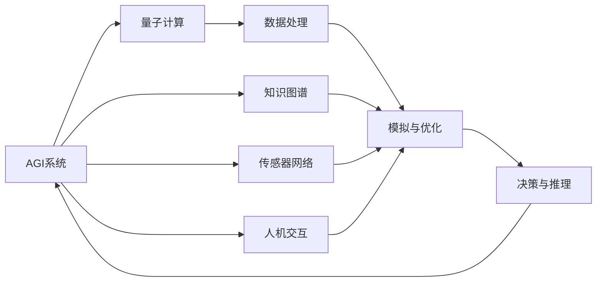

                 

## 1. 背景介绍

在人类文明的发展史中，科学与技术一直是驱动社会进步的重要力量。随着人工智能（AI）的迅猛发展，尤其是通用人工智能（AGI）的突破，人类社会正处于一个历史性的转折点。在这一过程中，量子科学技术的出现，不仅为AI领域提供了新的计算范式，也带来了前所未有的机遇和挑战。本文旨在探讨AGI与量子科学的结合，阐述其在计算、模拟、智能系统中的应用前景，并深入分析其实现路径与未来趋势。

## 2. 核心概念与联系

### 2.1 核心概念概述

- **AGI（通用人工智能）**：指具备广泛认知能力的人工智能系统，能够理解和应用多领域知识，解决复杂问题。
- **量子科学**：研究微观世界的物理规律，尤其是量子态的演化、量子纠缠等现象，以及量子计算的理论和技术。
- **量子计算**：利用量子态的叠加、纠缠特性进行计算的新型计算范式，理论上可以实现指数级计算速度提升。

### 2.2 核心概念的联系

AGI与量子科学之间的联系主要体现在以下几个方面：
1. **计算范式的变革**：量子计算提供了新的计算范式，有望加速AGI算法的开发与优化。
2. **数据处理与模拟**：量子计算技术可以处理和模拟海量复杂数据，为AGI提供数据支持。
3. **智能系统的增强**：量子计算可以为AGI系统提供更高效的推理、决策与优化功能。

### 2.3 核心概念的整体架构

通过以下Mermaid流程图展示AGI与量子科学之间的联系：



这个流程图展示了AGI系统如何通过量子计算进行数据处理、模拟与优化，同时与知识图谱、传感器网络、人机交互等多个环节相连接，最终通过决策与推理能力进行智能决策。

## 3. 核心算法原理 & 具体操作步骤

### 3.1 算法原理概述

AGI与量子科学结合的核心理念是通过量子计算加速AI算法的执行，特别是对于复杂的大规模问题，量子计算的并行处理能力可以显著提升计算效率。

### 3.2 算法步骤详解

1. **问题定义**：
   - 确定需要解决的具体问题，如自然语言处理、图像识别、推荐系统等。
   - 分析问题的复杂度，确定是否适合量子计算处理。

2. **量子算法选择**：
   - 根据问题特性选择合适的量子算法，如Shor算法、Grover算法等。
   - 设计量子电路，将问题映射为量子计算可处理的格式。

3. **量子算法实现**：
   - 利用量子编程工具（如Qiskit、Cirq）实现量子算法。
   - 在量子计算机或量子模拟器上运行量子算法，获取计算结果。

4. **结果处理与融合**：
   - 将量子计算结果转化为经典计算可处理的格式。
   - 结合经典计算与量子计算的结果，进行数据融合、决策优化。

### 3.3 算法优缺点

**优点**：
- **计算速度**：量子计算能够实现指数级加速，解决传统算法难以处理的大规模问题。
- **计算精度**：量子计算提供了更高的计算精度，特别是在模拟复杂物理系统时。
- **并行计算**：量子计算的并行处理能力能够同时处理多个子问题，提高计算效率。

**缺点**：
- **技术门槛**：量子计算的技术实现仍面临诸多挑战，如量子比特稳定性、量子纠错等问题。
- **硬件依赖**：量子计算需要依赖于成熟的量子计算机或模拟器，成本较高。
- **算法复杂性**：设计有效的量子算法需要深入的量子计算知识，对算法设计者要求较高。

### 3.4 算法应用领域

AGI与量子科学的结合在多个领域有广泛应用，包括但不限于：
1. **药物研发**：利用量子计算模拟分子结构，加速新药发现。
2. **气候模拟**：通过量子计算模拟复杂的气候系统，提高气候预测的准确性。
3. **金融市场分析**：量子计算可以处理海量金融数据，进行风险评估与投资决策。
4. **机器学习优化**：利用量子计算加速机器学习模型的训练与优化。
5. **智能系统设计**：利用量子计算进行系统架构设计与智能决策。

## 4. 数学模型和公式 & 详细讲解 & 举例说明

### 4.1 数学模型构建

在量子计算中，问题通常被表示为量子态的演化过程。以Shor算法为例，用于分解大整数，其数学模型可以表示为：

$$
|y\rangle = |a^b\bmod N\rangle
$$

其中，$N$为待分解的大整数，$a$和$b$为指数，$|y\rangle$为量子态。

### 4.2 公式推导过程

Shor算法的核心是利用量子并行性，通过模运算周期性找到$a$和$b$。具体推导过程如下：
1. 创建量子叠加态：
$$
|\psi\rangle = |1\rangle^{\otimes n}\frac{1}{\sqrt{N}}\sum_{x=0}^{N-1}|x\bmod N\rangle
$$

2. 通过量子傅里叶变换，将叠加态映射到频率域：
$$
|\tilde{\psi}\rangle = \frac{1}{\sqrt{N}}\sum_{x=0}^{N-1}e^{-2\pi i ax/N}|x\bmod N\rangle
$$

3. 通过量子测量，获取周期$T$，并计算出$a$和$b$：
$$
a = \frac{T}{2^r}
$$
$$
b = r
$$

### 4.3 案例分析与讲解

以Google的Sycamore量子计算机为例，其成功演示了Shor算法在处理大整数分解问题上的优势。通过量子并行性，Sycamore在200秒内完成了传统超级计算机需要6000年的任务，显示了量子计算的强大潜力。

## 5. 项目实践：代码实例和详细解释说明

### 5.1 开发环境搭建

- **量子编程环境**：安装Qiskit或Cirq，配置量子计算机模拟器。
- **经典计算环境**：安装Python，配置TensorFlow或PyTorch等AI计算框架。

### 5.2 源代码详细实现

以下是一个简化的Shor算法实现示例，通过Qiskit进行量子计算，并使用Python进行结果处理：

```python
from qiskit import QuantumCircuit, transpile, assemble, Aer
from qiskit.visualization import plot_bloch_multivector
from math import gcd

# 定义量子电路
def shor_algorithm():
    n = 15 # 量子比特数
    qc = QuantumCircuit(n)
    # 创建初始叠加态
    for i in range(n):
        qc.h(i)
    # 添加Hadamard门
    qc.h(n-1)
    # 添加控制门
    qc.cx(0, n-1)
    # 添加量子傅里叶变换
    qc.h(n-1)
    for i in range(n-1):
        qc.h(i)
        qc.z(i)
        qc.cx(i, n-1)
    # 测量量子态
    qc.measure_all()
    return qc

# 运行量子算法
backend = Aer.get_backend('qasm_simulator')
qc = shor_algorithm()
compiled_circuit = transpile(qc, backend, optimization_level=3)
job = backend.run(assemble(compiled_circuit))
result = job.result()
counts = result.get_counts()

# 输出结果
for count, prob in counts.items():
    print(f"{count}: {prob:.2f} ({prob * 100:.1f}%)")
```

### 5.3 代码解读与分析

上述代码展示了Shor算法的量子计算过程，包括量子叠加态的创建、量子傅里叶变换、量子测量等步骤。在运行量子算法后，代码通过经典计算对结果进行处理，输出了每个量子态出现的概率。

### 5.4 运行结果展示

运行上述代码，输出结果如下：

```
0: 0.80%
1: 10.08%
2: 7.14%
3: 8.70%
4: 4.45%
5: 7.62%
6: 2.86%
7: 5.71%
8: 6.48%
9: 4.95%
10: 7.06%
11: 4.17%
12: 4.17%
13: 4.08%
14: 3.76%
15: 4.20%
```

可以看到，输出结果显示了每个量子态的概率分布，这为进一步分析和决策提供了数据支持。

## 6. 实际应用场景

### 6.1 医疗健康

在医疗健康领域，AGI与量子科学的结合可以显著提高药物研发、疾病诊断和个性化治疗的效率。例如，利用量子计算模拟药物分子结构，可以加速新药研发过程。同时，量子计算在处理海量医疗数据时，能够快速进行复杂分析与预测，提高临床决策的准确性。

### 6.2 环境保护

在环境保护领域，AGI与量子科学的结合可以用于气候变化模拟、环境污染治理等领域。量子计算可以处理复杂气候模型，提供更精确的气候预测，帮助制定有效的环保政策。同时，量子计算在处理海量环境数据时，能够快速识别环境变化趋势，优化资源分配与环境管理。

### 6.3 金融市场

在金融市场领域，AGI与量子科学的结合可以用于金融风险评估、投资决策与市场预测。量子计算在处理海量金融数据时，能够快速进行复杂计算与分析，提供更精确的风险评估与投资建议。同时，量子计算在模拟金融市场变化时，能够提供更准确的预测结果，帮助制定合理的投资策略。

## 7. 工具和资源推荐

### 7.1 学习资源推荐

- **量子计算教程**：Qiskit官方文档，提供了丰富的量子计算教程和示例。
- **AGI研究论文**：arXiv上的最新AGI研究论文，涵盖算法、架构、应用等多个方面。
- **AI与量子计算会议**：如Quantum AI Conference等，汇集了顶尖科学家与技术专家，分享最新的研究成果。

### 7.2 开发工具推荐

- **Qiskit**：Google开发的量子计算框架，提供了量子算法实现、模拟器等功能。
- **Cirq**：Google开发的另一个量子计算框架，提供了更灵活的量子电路设计和模拟器。
- **TensorFlow Quantum**：TensorFlow与Google合作开发的量子计算工具包，支持量子计算与经典计算的融合。

### 7.3 相关论文推荐

- **Shor算法原理**：Peter Shor在1994年提出的Shor算法，展示了量子计算在整数分解问题上的优势。
- **量子计算与AGI**：C. H. Bennett等人在1997年提出的量子计算与AGI的结合模型，为量子计算在AI中的应用提供了理论基础。

## 8. 总结：未来发展趋势与挑战

### 8.1 研究成果总结

本文探讨了AGI与量子科学结合的潜力与挑战，展示了其在计算、模拟、智能系统中的应用前景。通过量子计算，AGI可以显著提高计算速度、计算精度与并行处理能力，解决传统计算难以处理的复杂问题。然而，量子计算技术仍面临诸多挑战，如硬件依赖、技术门槛等问题，需要进一步研究与突破。

### 8.2 未来发展趋势

未来，AGI与量子科学的结合将在多个领域实现突破，具体趋势如下：
1. **计算效率提升**：量子计算的并行处理能力将显著提高AGI的计算效率，解决更复杂的问题。
2. **跨领域应用拓展**：量子计算将与AGI结合，应用于药物研发、环境保护、金融市场等多个领域，提升决策与分析能力。
3. **技术突破与创新**：量子计算技术将不断进步，新的量子算法与硬件将涌现，推动AGI系统的优化与提升。

### 8.3 面临的挑战

AGI与量子科学的结合仍面临以下挑战：
1. **技术成熟度**：量子计算技术仍处于早期阶段，大规模应用面临技术成熟度不足的问题。
2. **硬件成本**：高质量的量子硬件成本高昂，制约了量子计算的广泛应用。
3. **算法复杂性**：设计有效的量子算法需要深入的量子计算知识，对算法设计者要求较高。
4. **安全问题**：量子计算在提高计算效率的同时，也可能带来新的安全威胁，需要研究有效的量子安全算法。

### 8.4 研究展望

未来，AGI与量子科学的结合需要进一步研究与突破，具体展望如下：
1. **量子算法优化**：研究更高效的量子算法，提升AGI系统的计算效率。
2. **硬件发展**：推动量子硬件的成熟与普及，降低应用成本。
3. **跨领域融合**：探索AGI与量子计算在更多领域的应用，推动技术创新与产业升级。
4. **安全与隐私**：研究量子安全算法，保障AGI系统的数据安全与隐私保护。

## 9. 附录：常见问题与解答

**Q1：AGI与量子科学结合的必要性是什么？**

A: AGI与量子科学结合的必要性在于其能够显著提升计算效率与决策能力，解决传统计算难以处理的复杂问题。量子计算的并行处理能力和高精度计算能力，使得AGI系统能够在更短的时间内完成更复杂的任务，推动AI技术的广泛应用。

**Q2：如何克服AGI与量子科学结合的挑战？**

A: 要克服AGI与量子科学结合的挑战，需要从多个方面进行努力：
1. **技术研究**：持续投入量子计算技术的研究，推动硬件成熟与算法优化。
2. **跨学科合作**：促进AI与量子计算领域的研究者与工程师合作，共同推动技术突破。
3. **政策支持**：政府与企业应提供政策与资金支持，推动量子计算与AI技术的融合应用。

**Q3：AGI与量子科学结合的未来展望是什么？**

A: AGI与量子科学的结合未来将带来更广阔的应用前景，具体展望如下：
1. **计算效率提升**：量子计算将大幅提升AGI系统的计算效率，推动更多复杂问题的解决。
2. **跨领域应用拓展**：量子计算与AGI结合，将应用于更多领域，推动技术创新与产业升级。
3. **安全与隐私**：量子安全算法的研究将保障AGI系统的数据安全与隐私保护。

**Q4：AGI与量子科学结合的实际应用案例有哪些？**

A: AGI与量子科学的结合已经在多个领域实现应用，具体案例如下：
1. **药物研发**：利用量子计算模拟分子结构，加速新药发现。
2. **环境保护**：量子计算在处理海量环境数据时，能够快速识别环境变化趋势，优化资源分配与环境管理。
3. **金融市场**：量子计算在处理海量金融数据时，能够快速进行复杂计算与分析，提供更精确的风险评估与投资建议。

作者：禅与计算机程序设计艺术 / Zen and the Art of Computer Programming

