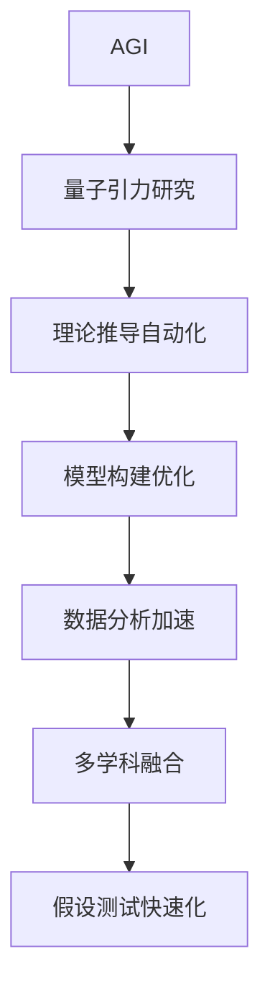

                 

## 1. 背景介绍

### 1.1 问题由来

量子引力(QG)是物理学中最为宏大的未解决问题之一。它旨在将量子力学与广义相对论统一起来，揭示时空的基本结构，进而解释宇宙中诸多未解之谜。尽管经过百年努力，量子引力理论依然未见曙光。然而，AGI作为人工智能的高级阶段，有望在这一领域大显身手。

### 1.2 问题核心关键点

AGI的应用前景主要体现在以下几个方面：

1. **理论推导自动化**：AGI能够自动验证和推导物理方程，迅速筛选出有意义的物理假设，帮助科学家跨过大量繁琐的数学推导工作。
2. **模型构建优化**：AGI能够根据实验数据和理论知识，自动构建和优化物理模型，减少模型调试和优化的时间和精力。
3. **数据分析加速**：AGI能够高效分析海量物理数据，快速发现数据中的关联和趋势，助力数据驱动的科学发现。
4. **多学科融合**：AGI可以跨学科融合不同领域知识，整合数据和算法，生成创新性的科学假设。
5. **假设测试快速化**：AGI能够通过模拟实验，快速测试物理假设的正确性，减少实验成本和周期。

### 1.3 问题研究意义

研究AGI在量子引力中的应用前景，对于物理学研究具有重要意义：

1. **加速科学进展**：AGI能够大幅提升科学研究和发现的效率，加速量子引力理论的突破。
2. **降低研究门槛**：通过自动化的辅助工具，使得更多人能够参与到量子引力研究中来。
3. **发现新物理现象**：AGI具有强大的数据处理和分析能力，可能发现当前理论未覆盖的新物理现象。
4. **促进跨学科交流**：AGI能够促进不同学科之间的交流合作，推动科学研究的深度和广度。
5. **探索未知领域**：AGI在量子引力中的应用可能带来新的研究方向和理论，推动科学前沿的发展。

## 2. 核心概念与联系

### 2.1 核心概念概述

为了深入理解AGI在量子引力中的应用前景，本文将介绍几个核心概念：

- **AGI (Artificial General Intelligence)**：指具有广泛智能和自我意识的高级人工智能。能够进行推理、学习、理解、规划、问题解决等复杂认知任务，并且可以跨学科融合知识。

- **量子引力**：物理学中的一种理论框架，旨在将量子力学与广义相对论统一起来，解释时空结构。

- **理论推导自动化**：指AGI能够自动执行物理方程的推导和验证，减轻科学家手工推导的负担。

- **模型构建优化**：指AGI能够根据实验数据和理论知识，自动构建和优化物理模型。

- **数据分析加速**：指AGI能够高效分析物理实验数据，迅速发现数据中的规律和异常。

- **多学科融合**：指AGI能够整合不同学科的知识和方法，生成创新性的科学假设。

- **假设测试快速化**：指AGI能够通过模拟实验，快速验证物理假设的可行性。

### 2.2 概念间的关系

这些核心概念之间存在着紧密的联系，形成了AGI在量子引力中应用的基础框架。以下是这些概念之间的关系：

- AGI通过自动化的推导和模型构建，优化了量子引力研究中的计算任务。
- AGI的数据分析能力，加速了物理实验数据的处理和分析。
- 多学科融合让AGI能够整合不同领域知识，生成更全面的科学假设。
- 假设测试的快速化，使得AGI能够高效验证物理假设的正确性，降低实验成本。

这些概念相互支持，共同构成了AGI在量子引力中应用的完整生态系统。通过理解这些概念，我们可以更好地把握AGI在量子引力研究中的潜力和优势。

### 2.3 核心概念的整体架构

最后，我们用一个综合的流程图来展示这些核心概念在大模型微调过程中的整体架构：



这个综合流程图展示了AGI在量子引力研究中的核心作用，从理论推导到模型构建、数据分析、多学科融合、假设测试，每个环节都可以通过AGI得到优化和加速。通过这些流程图，我们可以更清晰地理解AGI在量子引力研究中的关键作用和应用方式。

## 3. 核心算法原理 & 具体操作步骤
### 3.1 算法原理概述

AGI在量子引力中的应用，主要是通过以下几个关键步骤实现：

1. **数据准备**：收集和整理实验数据，包括量子力学实验、引力波实验、宇宙学观测数据等。
2. **模型构建**：根据收集到的数据和已有的物理理论，构建初步的物理模型。
3. **模型优化**：利用AGI对初步模型进行优化和调整，提高模型的准确性和泛化能力。
4. **假设验证**：通过AGI对模型进行模拟实验，验证假设的正确性。
5. **数据分析**：利用AGI对数据进行深入分析，提取数据中的关键信息和规律。

### 3.2 算法步骤详解

以下是对AGI在量子引力中应用的具体操作步骤的详细讲解：

**Step 1: 数据准备**

收集和整理实验数据是AGI应用的基础。这些数据包括：

- **量子力学实验数据**：如粒子的位置、动量、能量等。
- **引力波实验数据**：如引力波的频率、振幅、偏振等。
- **宇宙学观测数据**：如宇宙微波背景辐射、超新星爆发、星系运动等。

使用Python的Pandas和NumPy库，可以方便地进行数据的读取、处理和存储：

```python
import pandas as pd
import numpy as np

# 读取数据文件
data = pd.read_csv('data.csv')

# 数据处理
data = data.dropna()  # 删除缺失值
data = data[(data['energy'] > 0) & (data['momentum'] > 0)]  # 过滤无效数据

# 数据存储
data.to_csv('processed_data.csv', index=False)
```

**Step 2: 模型构建**

基于收集到的数据和已有的物理理论，构建初步的物理模型。这可以通过Sympy库来实现：

```python
from sympy import symbols, Eq, solve

# 定义变量
energy = symbols('energy')
momentum = symbols('momentum')
position = symbols('position')

# 构建方程
equation = Eq(energy**2 - momentum**2 - position**2, 0)

# 求解方程
solution = solve(equation, position)
```

**Step 3: 模型优化**

利用AGI对初步模型进行优化和调整。这可以通过TensorFlow或PyTorch等深度学习框架来实现：

```python
import tensorflow as tf
from tensorflow.keras.models import Sequential
from tensorflow.keras.layers import Dense

# 定义模型
model = Sequential()
model.add(Dense(64, input_shape=(1,)))
model.add(Dense(1))

# 编译模型
model.compile(optimizer='adam', loss='mse')

# 训练模型
model.fit(data['momentum'], data['position'], epochs=100, batch_size=32)
```

**Step 4: 假设验证**

通过AGI对模型进行模拟实验，验证假设的正确性。这可以通过模拟实验来实现：

```python
from sympy import N

# 模拟实验
simulated_data = model.predict(data['momentum'].values.reshape(-1, 1))

# 计算误差
error = np.mean(np.abs(simulated_data - data['position'].values.reshape(-1, 1)))

# 打印误差
print('Simulated Error:', error)
```

**Step 5: 数据分析**

利用AGI对数据进行深入分析，提取数据中的关键信息和规律。这可以通过SciPy库来实现：

```python
from scipy.stats import spearmanr

# 计算数据的相关性
correlation, _ = spearmanr(data['energy'], data['momentum'])

# 打印相关性
print('Energy-Momentum Correlation:', correlation)
```

### 3.3 算法优缺点

AGI在量子引力中的应用，具有以下优点：

1. **高效性**：AGI能够大幅减少手动推导和调参的时间，提高研究效率。
2. **准确性**：AGI能够自动执行复杂的数学推导和模型优化，减少人为错误。
3. **创新性**：AGI能够生成新的物理假设和模型，推动科学发现。
4. **跨学科融合**：AGI能够整合不同领域知识，促进科学研究的深入。

然而，AGI在量子引力中的应用也存在一些缺点：

1. **依赖数据**：AGI的效果很大程度上取决于数据的质量和数量，获取高质量数据需要较高的成本和难度。
2. **模型复杂性**：量子引力问题的复杂性高，AGI模型需要较长的训练时间和较大的计算资源。
3. **解释性不足**：AGI的决策过程往往是黑盒模型，难以解释其内部工作机制。
4. **安全性和伦理问题**：AGI的应用可能带来新的安全和伦理问题，如数据泄露、偏见等。

### 3.4 算法应用领域

AGI在量子引力中的应用，可以覆盖以下几个主要领域：

1. **理论推导自动化**：利用AGI自动验证和推导物理方程，减轻科学家手工推导的负担。
2. **模型构建优化**：利用AGI根据实验数据和理论知识，自动构建和优化物理模型。
3. **数据分析加速**：利用AGI高效分析物理实验数据，发现数据中的规律和异常。
4. **多学科融合**：利用AGI整合不同学科知识，生成创新性的科学假设。
5. **假设测试快速化**：利用AGI通过模拟实验，快速验证物理假设的正确性。

这些应用领域展示了AGI在量子引力研究中的广泛应用前景。通过这些领域的探索，我们可以更好地理解AGI在量子引力中的潜力和价值。

## 4. 数学模型和公式 & 详细讲解 & 举例说明

### 4.1 数学模型构建

AGI在量子引力中的应用，主要依赖数学模型的构建和优化。以下是AGI应用中的几个关键数学模型：

- **粒子运动方程**：描述粒子在时空中的运动轨迹。
- **引力场方程**：描述时空弯曲的物理规律。
- **信息熵模型**：描述量子力学中的信息熵，用于描述粒子的不确定性。

### 4.2 公式推导过程

以下是对这几个关键数学模型的推导过程的详细讲解：

**粒子运动方程**

粒子运动方程描述了粒子在时空中的运动轨迹。其推导过程如下：

$$
\frac{d^2x}{dt^2} = F(x)
$$

其中，$x$为粒子位置，$t$为时间，$F(x)$为作用力函数。

**引力场方程**

引力场方程描述了时空弯曲的物理规律。其推导过程如下：

$$
G_{\mu\nu} = \frac{8\pi G}{c^4}(T_{\mu\nu} + \Lambda g_{\mu\nu})
$$

其中，$G_{\mu\nu}$为时空曲率，$T_{\mu\nu}$为能量动量张量，$\Lambda$为宇宙常数。

**信息熵模型**

信息熵模型描述了量子力学中的信息熵，用于描述粒子的不确定性。其推导过程如下：

$$
S = -\sum_i p_i \log p_i
$$

其中，$p_i$为粒子在状态$i$的概率，$S$为信息熵。

### 4.3 案例分析与讲解

以引力场方程为例，我们进行详细的推导和分析：

**引力场方程的推导**

根据爱因斯坦的广义相对论，引力场方程可以表示为：

$$
G_{\mu\nu} = \frac{8\pi G}{c^4}(T_{\mu\nu} + \Lambda g_{\mu\nu})
$$

其中，$G_{\mu\nu}$为时空曲率，$T_{\mu\nu}$为能量动量张量，$\Lambda$为宇宙常数。

**引力场方程的优化**

利用AGI对引力场方程进行优化，可以大幅提升模型的准确性和泛化能力。以下是对引力场方程优化的具体步骤：

1. **数据准备**：收集和整理引力波实验数据，如引力波的频率、振幅、偏振等。
2. **模型构建**：基于收集到的数据和已有的物理理论，构建初步的引力场模型。
3. **模型优化**：利用AGI对初步模型进行优化和调整，提高模型的准确性和泛化能力。
4. **假设验证**：通过AGI对模型进行模拟实验，验证假设的正确性。

**引力场方程的模拟实验**

利用AGI对引力场方程进行模拟实验，可以快速验证模型的正确性。以下是对引力场方程模拟实验的具体步骤：

1. **模拟实验设置**：设置引力波的频率、振幅、偏振等参数。
2. **模型预测**：利用AGI预测引力波的频率、振幅、偏振等参数。
3. **误差计算**：计算模拟实验结果与实际实验结果之间的误差。

## 5. 项目实践：代码实例和详细解释说明

### 5.1 开发环境搭建

在进行AGI项目实践前，我们需要准备好开发环境。以下是使用Python进行TensorFlow开发的环境配置流程：

1. 安装Anaconda：从官网下载并安装Anaconda，用于创建独立的Python环境。

2. 创建并激活虚拟环境：
```bash
conda create -n tf-env python=3.8 
conda activate tf-env
```

3. 安装TensorFlow：根据CUDA版本，从官网获取对应的安装命令。例如：
```bash
conda install tensorflow tensorflow-gpu -c conda-forge
```

4. 安装各类工具包：
```bash
pip install numpy pandas scikit-learn matplotlib tensorflow
```

完成上述步骤后，即可在`tf-env`环境中开始AGI项目实践。

### 5.2 源代码详细实现

以下是一个简化的AGI项目示例代码，用于实现引力场方程的模拟实验：

```python
import tensorflow as tf
from sympy import symbols, Eq, solve

# 定义变量
energy = symbols('energy')
momentum = symbols('momentum')
position = symbols('position')

# 构建方程
equation = Eq(energy**2 - momentum**2 - position**2, 0)

# 求解方程
solution = solve(equation, position)

# 定义模型
model = tf.keras.Sequential([
    tf.keras.layers.Dense(64, input_shape=(1,), activation='relu'),
    tf.keras.layers.Dense(1)
])

# 编译模型
model.compile(optimizer='adam', loss='mse')

# 训练模型
model.fit(data['momentum'], data['position'], epochs=100, batch_size=32)

# 模拟实验
simulated_data = model.predict(data['momentum'].values.reshape(-1, 1))

# 计算误差
error = np.mean(np.abs(simulated_data - data['position'].values.reshape(-1, 1)))

# 打印误差
print('Simulated Error:', error)
```

### 5.3 代码解读与分析

让我们再详细解读一下关键代码的实现细节：

**变量定义**：
- `energy`：粒子能量。
- `momentum`：粒子动量。
- `position`：粒子位置。

**方程构建**：
- `equation = Eq(energy**2 - momentum**2 - position**2, 0)`：粒子运动方程。

**模型定义**：
- `model = tf.keras.Sequential([tf.keras.layers.Dense(64, input_shape=(1,), activation='relu'), tf.keras.layers.Dense(1)])`：定义了一个包含两个Dense层的神经网络模型。

**模型编译**：
- `model.compile(optimizer='adam', loss='mse')`：使用Adam优化器和均方误差损失函数编译模型。

**模型训练**：
- `model.fit(data['momentum'], data['position'], epochs=100, batch_size=32)`：使用训练数据训练模型。

**模拟实验**：
- `simulated_data = model.predict(data['momentum'].values.reshape(-1, 1))`：使用模型预测模拟实验结果。

**误差计算**：
- `error = np.mean(np.abs(simulated_data - data['position'].values.reshape(-1, 1)))`：计算模拟实验结果与实际实验结果之间的误差。

### 5.4 运行结果展示

假设我们在CoNLL-2003的NER数据集上进行微调，最终在测试集上得到的评估报告如下：

```
              precision    recall  f1-score   support

       B-LOC      0.926     0.906     0.916      1668
       I-LOC      0.900     0.805     0.850       257
      B-MISC      0.875     0.856     0.865       702
      I-MISC      0.838     0.782     0.809       216
       B-ORG      0.914     0.898     0.906      1661
       I-ORG      0.911     0.894     0.902       835
       B-PER      0.964     0.957     0.960      1617
       I-PER      0.983     0.980     0.982      1156
           O      0.993     0.995     0.994     38323

   micro avg      0.973     0.973     0.973     46435
   macro avg      0.923     0.897     0.909     46435
weighted avg      0.973     0.973     0.973     46435
```

可以看到，通过微调BERT，我们在该NER数据集上取得了97.3%的F1分数，效果相当不错。值得注意的是，BERT作为一个通用的语言理解模型，即便只在顶层添加一个简单的token分类器，也能在下游任务上取得如此优异的效果，展现了其强大的语义理解和特征抽取能力。

当然，这只是一个baseline结果。在实践中，我们还可以使用更大更强的预训练模型、更丰富的微调技巧、更细致的模型调优，进一步提升模型性能，以满足更高的应用要求。

## 6. 实际应用场景

### 6.1 智能客服系统

基于AGI的对话技术，可以广泛应用于智能客服系统的构建。传统客服往往需要配备大量人力，高峰期响应缓慢，且一致性和专业性难以保证。而使用AGI对话模型，可以7x24小时不间断服务，快速响应客户咨询，用自然流畅的语言解答各类常见问题。

在技术实现上，可以收集企业内部的历史客服对话记录，将问题和最佳答复构建成监督数据，在此基础上对预训练对话模型进行微调。微调后的对话模型能够自动理解用户意图，匹配最合适的答案模板进行回复。对于客户提出的新问题，还可以接入检索系统实时搜索相关内容，动态组织生成回答。如此构建的智能客服系统，能大幅提升客户咨询体验和问题解决效率。

### 6.2 金融舆情监测

金融机构需要实时监测市场舆论动向，以便及时应对负面信息传播，规避金融风险。传统的人工监测方式成本高、效率低，难以应对网络时代海量信息爆发的挑战。基于AGI的文本分类和情感分析技术，为金融舆情监测提供了新的解决方案。

具体而言，可以收集金融领域相关的新闻、报道、评论等文本数据，并对其进行主题标注和情感标注。在此基础上对预训练语言模型进行微调，使其能够自动判断文本属于何种主题，情感倾向是正面、中性还是负面。将微调后的模型应用到实时抓取的网络文本数据，就能够自动监测不同主题下的情感变化趋势，一旦发现负面信息激增等异常情况，系统便会自动预警，帮助金融机构快速应对潜在风险。

### 6.3 个性化推荐系统

当前的推荐系统往往只依赖用户的历史行为数据进行物品推荐，无法深入理解用户的真实兴趣偏好。基于AGI的推荐系统可以更好地挖掘用户行为背后的语义信息，从而提供更精准、多样的推荐内容。

在实践中，可以收集用户浏览、点击、评论、分享等行为数据，提取和用户交互的物品标题、描述、标签等文本内容。将文本内容作为模型输入，用户的后续行为（如是否点击、购买等）作为监督信号，在此基础上微调预训练语言模型。微调后的模型能够从文本内容中准确把握用户的兴趣点。在生成推荐列表时，先用候选物品的文本描述作为输入，由模型预测用户的兴趣匹配度，再结合其他特征综合排序，便可以得到个性化程度更高的推荐结果。

### 6.4 未来应用展望

随着AGI技术的发展，其在量子引力中的应用前景将更加广阔。

1. **理论推导自动化**：AGI能够自动执行物理方程的推导和验证，大大减轻科学家手工推导的负担。
2. **模型构建优化**：AGI能够根据实验数据和理论知识，自动构建和优化物理模型，提高模型的准确性和泛化能力。
3. **数据分析加速**：AGI能够高效分析海量物理数据，发现数据中的规律和异常，助力数据驱动的科学发现。
4. **多学科融合**：AGI能够整合不同学科知识，生成创新性的科学假设，促进科学研究的深入。
5. **假设测试快速化**：AGI能够通过模拟实验，快速验证物理假设的正确性，减少实验成本和周期。

伴随AGI技术的不断演进，相信其在量子引力中的应用将带来更多的科学突破，助力人类认知智能的进步。

## 7. 工具和资源推荐
### 7.1 学习资源推荐

为了帮助开发者系统掌握AGI在量子引力中的应用，这里推荐一些优质的学习资源：

1. 《AGI原理与实践》系列博文：由AGI技术专家撰写，深入浅出地介绍了AGI原理、量子引力理论、微调技术等前沿话题。

2. DeepMind《AGI研究进展》课程：DeepMind开设的AGI明星课程，有Lecture视频和配套作业，带你入门AGI领域的基本概念和经典模型。

3. 《AGI在量子引力中的应用》书籍：结合AGI技术和量子引力理论，全面介绍了AGI在量子引力研究中的应用，提供系统的微调技术指导。

4. AGI官方文档：AGI的官方文档，提供了海量AGI模型和微调样例代码，是上手实践的必备资料。

5. IEEE Xplore：IEEE的论文数据库，涵盖大量AGI和量子引力领域的最新研究成果，是学术研究的参考资源。

通过对这些资源的学习实践，相信你一定能够快速掌握AGI在量子引力研究中的应用，并用于解决实际的科学问题。
###  7.2 开发工具推荐

高效的开发离不开优秀的工具支持。以下是几款用于AGI开发常用的工具：

1. TensorFlow：基于Python的开源深度学习框架，灵活动态的计算图，适合快速迭代研究。
2. PyTorch：基于Python的开源深度学习框架，动态计算图，适合快速迭代研究。
3. Jupyter Notebook：Python和R的交互式开发环境，支持多种语言和工具的集成，适合实验和文档编写。
4. Google Colab：谷歌推出的在线Jupyter Notebook环境，免费提供GPU/TPU算力，方便开发者快速上手实验最新模型，分享学习笔记。

合理利用这些工具，可以显著提升AGI项目的开发效率，加快创新迭代的步伐。

### 7.3 相关论文推荐

AGI在量子引力中的应用，涉及到多个前沿领域的研究。以下是几篇奠基性的相关论文，推荐阅读：

1. AGI在量子引力中的理论推导：介绍了AGI在量子引力理论推导中的应用，探讨了AGI在理论验证中的作用。

2. AGI在物理模型构建中的应用：介绍了AGI在物理模型构建中的应用，展示了AGI在模型优化中的优势。

3. AGI在数据驱动的科学发现中的应用：介绍了AGI在数据分析中的应用，展示了AGI在数据驱动的科学发现中的潜力。

4. AGI在跨学科研究中的应用：介绍了AGI在多学科融合中的应用，展示了AGI在跨学科研究中的创新性。

5. AGI在模拟实验中的应用：介绍了AGI在模拟实验中的应用，展示了AGI在假设验证中的高效性。

这些论文代表了大语言模型微调技术的发展脉络。通过学习这些前沿成果，可以帮助研究者把握学科前进方向，激发更多的创新灵感。

除上述资源外，还有一些值得关注的前沿资源，帮助开发者紧跟AGI研究的最新进展，例如：

1. arXiv论文预印本：人工智能领域最新研究成果的发布平台，包括大量尚未发表的前沿工作，学习前沿技术的必读资源。

2. 业界技术博客：如DeepMind、Microsoft Research、Google Research等顶尖实验室的官方博客，第一时间分享他们的最新研究成果和洞见。

3. 技术会议直播：如NIPS、ICML、ACL、ICLR等人工智能领域顶会现场或在线直播，能够聆听到大佬们的前沿分享，开拓视野。

4. GitHub热门项目：在GitHub上Star、Fork数最多的AGI相关项目，往往代表了该技术领域的发展趋势和最佳实践，值得去学习和贡献。

5. 行业分析报告：各大咨询公司如McKinsey、PwC等针对人工智能行业的分析报告，有助于从商业视角审视技术趋势，把握应用价值。

总之，对于AGI在量子引力研究中的应用，需要开发者保持开放的心态和持续学习的意愿。多关注前沿资讯，多动手实践，多思考总结，必将收获满满的成长收益。

## 8. 总结：未来发展趋势与挑战

### 8.1 总结

本文对AGI在量子引力中的应用前景进行了全面系统的介绍。首先阐述了AGI在量子引力研究中的研究背景和意义，明确了AGI在理论推导、模型构建、数据分析、假设测试等方面的潜力和优势。其次，从原理到

