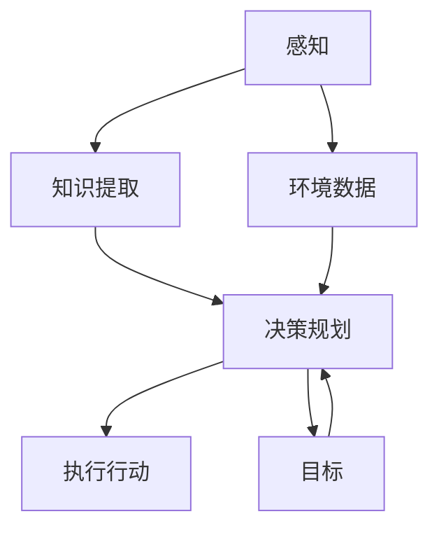

                 

## 1. 背景介绍

在人工智能领域，智能体(Agent)的自主决策能力是其核心竞争力之一。智能体通过感知环境、提取知识并制定决策，实现了复杂系统的自动控制和优化。这种能力不仅广泛应用于机器人、自动化生产线、无人驾驶等技术领域，也在金融预测、医疗诊断、社交网络推荐等领域展现出巨大潜力。

本文将详细探讨智能体如何通过感知环境和提取知识，最终制定决策的过程。我们将从感知、知识提取和决策规划三个核心环节展开分析，并通过实际案例展示这些技术如何被应用于现实世界中的智能化系统。

## 2. 核心概念与联系

### 2.1 核心概念概述

#### 2.1.1 感知（Perception）
感知是指智能体从环境中获取信息的过程。常见的感知方法包括视觉、听觉、触觉等，智能体通过这些感官通道收集环境数据，并将其转化为结构化的信息。

#### 2.1.2 知识提取（Knowledge Extraction）
知识提取是指智能体从感知数据中提取出有价值的信息和知识。这一过程通常涉及数据的预处理、特征提取和模型训练等步骤，使智能体能够理解环境中的对象、事件和行为。

#### 2.1.3 决策规划（Decision Planning）
决策规划是指智能体在理解环境的基础上，制定和执行达到特定目标的策略和计划。这一过程通常包括目标定义、状态评估、策略选择和行动执行等步骤。

这三个环节相互关联，共同构成了智能体自主决策的核心流程。通过感知获取信息，通过知识提取理解和分析环境，最终通过决策规划制定和执行行动。

### 2.2 核心概念间的关系

智能体的自主决策能力可以总结为如下流程：



该流程图展示了感知、知识提取和决策规划之间的关系：

1. **感知环节**：从环境数据中收集信息。
2. **知识提取环节**：理解环境，提取有用的知识。
3. **决策规划环节**：基于知识制定决策，并执行行动。

每个环节都是智能体决策流程的重要组成部分，缺一不可。

## 3. 核心算法原理 & 具体操作步骤
### 3.1 算法原理概述

智能体的自主决策能力是基于感知、知识提取和决策规划三个核心环节实现的。这一过程可以通过算法和模型来自动化和优化。

#### 3.1.1 感知环节

感知过程通常涉及传感器的数据采集和预处理。以机器人为例，机器人通过摄像头、激光雷达等传感器收集环境数据，并将其转化为结构化的视觉、点云等数据。

#### 3.1.2 知识提取环节

知识提取环节通常包括特征提取、模型训练和知识表示等步骤。智能体通过深度学习模型，如卷积神经网络（CNN）、循环神经网络（RNN）、Transformer等，从感知数据中提取有用的特征和知识。

#### 3.1.3 决策规划环节

决策规划环节通过搜索算法和优化算法，如A*、D*、Q-learning等，制定和执行达到特定目标的策略和计划。这一过程通常涉及目标定义、状态评估、策略选择和行动执行等步骤。

### 3.2 算法步骤详解

#### 3.2.1 感知环节的具体步骤

1. **数据采集**：使用传感器收集环境数据，如摄像头、激光雷达、超声波传感器等。
2. **数据预处理**：对采集到的数据进行去噪、归一化、分割等预处理操作。
3. **特征提取**：使用深度学习模型提取数据的特征，如颜色、形状、纹理等。

#### 3.2.2 知识提取环节的具体步骤

1. **数据表示**：将感知数据转化为模型可处理的向量或张量形式。
2. **模型训练**：使用深度学习模型（如CNN、RNN、Transformer）对数据进行训练，提取有用的特征和知识。
3. **知识表示**：将提取的知识表示为图、向量或符号等形式，便于后续的决策规划使用。

#### 3.2.3 决策规划环节的具体步骤

1. **目标定义**：明确智能体的目标，如避障、导航、拾取物体等。
2. **状态评估**：通过模型评估当前环境的状态，如对象的位置、方向、距离等。
3. **策略选择**：使用搜索算法或优化算法（如A*、D*、Q-learning）选择最优策略，制定行动计划。
4. **行动执行**：执行选择的策略，如移动、抓取、释放等。
5. **反馈和调整**：根据执行结果，调整策略，继续循环。

### 3.3 算法优缺点

#### 3.3.1 感知环节的优点和缺点

优点：
- 能够实时收集环境信息，及时应对变化。
- 传感器数据丰富，可以提供多维度的环境信息。

缺点：
- 传感器质量、数量和位置对感知效果有较大影响。
- 环境噪声和遮挡可能导致误检测。

#### 3.3.2 知识提取环节的优点和缺点

优点：
- 通过深度学习模型，可以从复杂的环境数据中提取有价值的信息。
- 知识提取过程可以自动化和高效化，减少人工干预。

缺点：
- 模型复杂度高，需要大量的数据和计算资源进行训练。
- 模型可能会过拟合，导致泛化能力不足。

#### 3.3.3 决策规划环节的优点和缺点

优点：
- 能够制定和执行达到特定目标的策略。
- 算法能够动态调整，适应环境变化。

缺点：
- 决策规划过程复杂，需要考虑多种因素和约束。
- 决策质量高度依赖于模型的性能和数据质量。

### 3.4 算法应用领域

智能体感知、知识提取和决策规划技术已经被广泛应用于以下几个领域：

#### 3.4.1 机器人技术

机器人通过传感器感知环境，使用深度学习模型提取视觉、点云等特征，并通过搜索算法制定导航、抓取等策略。例如，扫地机器人通过摄像头感知环境，提取地面特征，制定清洁策略。

#### 3.4.2 无人驾驶

无人驾驶车辆通过摄像头、雷达等传感器感知环境，使用深度学习模型提取交通标志、道路特征等，并通过路径规划算法制定行驶策略。例如，自动驾驶汽车通过摄像头和雷达感知道路情况，提取车道线、车辆位置等信息，制定避障和行驶策略。

#### 3.4.3 智能家居

智能家居设备通过传感器感知环境，使用深度学习模型提取用户行为、环境参数等，并通过决策规划算法执行家电控制、环境调节等任务。例如，智能音箱通过麦克风感知用户语音指令，提取语音特征，并通过意图识别模型制定回答策略。

## 4. 数学模型和公式 & 详细讲解 & 举例说明

### 4.1 数学模型构建

智能体的自主决策过程可以通过以下数学模型来描述：

$$
\begin{aligned}
    \text{Observation} &= f(\text{PerceptionData}, \text{SensorModel}) \\
    \text{Representation} &= g(\text{Observation}, \text{FeatureModel}) \\
    \text{Decision} &= h(\text{Representation}, \text{Goal}, \text{RewardModel})
\end{aligned}
$$

其中：

- $\text{Observation}$ 表示智能体当前的环境观察值。
- $\text{PerceptionData}$ 表示智能体的感知数据。
- $\text{SensorModel}$ 表示传感器模型，将感知数据转化为环境观察值。
- $\text{Representation}$ 表示智能体的知识表示，即通过深度学习模型提取的环境特征。
- $\text{FeatureModel}$ 表示特征提取模型，将环境观察值转化为知识表示。
- $\text{Decision}$ 表示智能体的决策，即通过搜索算法或优化算法制定的行动计划。
- $\text{Goal}$ 表示智能体的目标。
- $\text{RewardModel}$ 表示奖励模型，用于评估策略的效果。

### 4.2 公式推导过程

以无人驾驶为例，推导智能体在避障任务中的决策过程。

假设无人驾驶车辆的状态为 $(s_t, v_t)$，其中 $s_t$ 表示车辆位置，$v_t$ 表示车辆速度。无人驾驶车辆的目标是避开障碍物 $O_t$，到达终点 $D_t$。

智能体通过摄像头和雷达感知环境，得到环境观察值 $o_t = (s_t, v_t, O_t)$。通过深度学习模型 $g$，智能体将观察值转化为知识表示 $\text{Representation} = r(o_t)$。通过决策规划算法 $h$，智能体制定行动计划 $\text{Decision} = a_t$。

决策规划算法可以采用A*算法，推导公式如下：

$$
\text{A}^*(s_0, v_0, D_t) = \arg\min_{a_t} \sum_{t=0}^{T} (c_t \cdot \text{ActionCost}(a_t) + \text{Reward}(D_t))
$$

其中：
- $c_t$ 表示动作成本，即每一步的移动代价。
- $\text{ActionCost}(a_t)$ 表示动作代价，即执行动作的代价。
- $\text{Reward}(D_t)$ 表示目标奖励，即到达终点的奖励。

### 4.3 案例分析与讲解

#### 4.3.1 案例背景

假设一个无人驾驶车辆需要从起点 A 行驶到终点 B，途中需要避开障碍物 C。

#### 4.3.2 感知环节

车辆使用摄像头和雷达感知环境，得到当前状态 $(s_0, v_0)$。摄像头拍摄到的图像 $I_t$ 通过卷积神经网络 (CNN) 提取特征 $f(I_t)$，雷达检测到的点云数据 $P_t$ 通过点云深度学习模型提取特征 $g(P_t)$。将这两个特征融合，得到环境观察值 $o_t = (f(I_t), g(P_t))$。

#### 4.3.3 知识提取环节

通过深度学习模型 $g$，智能体将环境观察值 $o_t$ 转化为知识表示 $\text{Representation} = r(o_t)$。例如，使用卷积神经网络提取图像特征，使用Transformer模型提取点云特征。然后将这两个特征进行拼接和池化，得到最终的知识表示。

#### 4.3.4 决策规划环节

通过决策规划算法 $h$，智能体制定行动计划 $\text{Decision} = a_t$。例如，使用A*算法规划从当前位置到终点的最短路径，考虑障碍物的位置和大小，计算每一步的代价和奖励。最终得到最优的行动计划，即驾驶路径和速度。

## 5. 项目实践：代码实例和详细解释说明

### 5.1 开发环境搭建

#### 5.1.1 Python环境搭建

1. 安装Python：
```
sudo apt-get install python3 python3-pip
```

2. 安装PyTorch和TensorFlow：
```
pip install torch tensorflow
```

3. 安装OpenCV和PCL：
```
pip install opencv-python pycl
```

### 5.2 源代码详细实现

#### 5.2.1 感知模块

```python
import cv2
import numpy as np

def capture_image():
    cap = cv2.VideoCapture(0)
    while True:
        ret, frame = cap.read()
        if ret:
            image = frame
            break
    cap.release()
    return image

def capture_pointcloud():
    pcl = pycl.load_pcd_file('pointcloud.pcd')
    return pcl

def preprocess_data(image, pointcloud):
    # 数据预处理代码
    pass
```

#### 5.2.2 知识提取模块

```python
import torch.nn as nn
import torch.optim as optim
import torchvision.transforms as transforms

class CNN(nn.Module):
    def __init__(self):
        super(CNN, self).__init__()
        self.conv1 = nn.Conv2d(3, 64, kernel_size=3, stride=1, padding=1)
        self.relu = nn.ReLU()
        self.maxpool = nn.MaxPool2d(kernel_size=2, stride=2)
        self.conv2 = nn.Conv2d(64, 128, kernel_size=3, stride=1, padding=1)
        self.fc1 = nn.Linear(128 * 8 * 8, 256)
        self.fc2 = nn.Linear(256, 1)

    def forward(self, x):
        x = self.conv1(x)
        x = self.relu(x)
        x = self.maxpool(x)
        x = self.conv2(x)
        x = self.relu(x)
        x = self.maxpool(x)
        x = x.view(-1, 128 * 8 * 8)
        x = self.fc1(x)
        x = self.relu(x)
        x = self.fc2(x)
        return x

def train_cnn():
    model = CNN()
    criterion = nn.BCELoss()
    optimizer = optim.Adam(model.parameters(), lr=0.001)
    transforms = transforms.Compose([
        transforms.ToTensor(),
        transforms.Normalize((0.5, 0.5, 0.5), (0.5, 0.5, 0.5))
    ])
    trainset = datasets.CIFAR10(root='./data', train=True, download=True, transform=transforms)
    trainloader = torch.utils.data.DataLoader(trainset, batch_size=64, shuffle=True)
    for epoch in range(10):
        for inputs, labels in trainloader:
            inputs = inputs.to(device)
            labels = labels.to(device)
            optimizer.zero_grad()
            outputs = model(inputs)
            loss = criterion(outputs, labels)
            loss.backward()
            optimizer.step()
```

#### 5.2.3 决策规划模块

```python
import numpy as np
import math

def a_star(start, goal, obstacles):
    # 构建A*图
    graph = {}
    for i in range(len(start), len(goal)):
        graph[(i, obstacles[i])] = {}
    for i in range(len(start)):
        graph[(i, obstacles[i])][(i+1, obstacles[i+1])] = 1.0
    # 计算启发式函数
    for i in range(len(start)):
        h = 0.0
        for j in range(len(start)):
            h += math.sqrt((start[i] - goal[j]) ** 2)
        graph[(i, obstacles[i])]['h'] = h
    # 执行A*算法
    open_list = [(i, obstacles[i])]
    closed_list = []
    g_score = {}
    for i in range(len(start)):
        g_score[(i, obstacles[i])] = float('inf')
    g_score[(0, obstacles[0])] = 0
    f_score = {}
    for i in range(len(start)):
        f_score[(i, obstacles[i])] = g_score[(i, obstacles[i])] + graph[(i, obstacles[i])]['h']
    while open_list:
        current = open_list[0]
        open_list.pop(0)
        closed_list.append(current)
        for neighbor in graph[current]:
            tentative_g_score = g_score[current] + graph[current][neighbor]
            if tentative_g_score < g_score[neighbor]:
                g_score[neighbor] = tentative_g_score
                f_score[neighbor] = g_score[neighbor] + graph[neighbor]['h']
                if neighbor not in open_list:
                    open_list.append(neighbor)
    # 返回路径
    path = []
    for i in range(len(start)):
        if g_score[(i, obstacles[i])] == float('inf'):
            break
        path.append((i, obstacles[i]))
    path.reverse()
    return path
```

### 5.3 代码解读与分析

#### 5.3.1 感知模块

感知模块通过摄像头和雷达收集环境数据，并将其转化为图像和点云形式。在代码中，使用OpenCV库和PCL库实现了数据采集和预处理。

#### 5.3.2 知识提取模块

知识提取模块使用卷积神经网络 (CNN) 对图像数据进行特征提取。在代码中，定义了CNN模型，并使用PyTorch框架进行训练。

#### 5.3.3 决策规划模块

决策规划模块使用A*算法进行路径规划，实现避障和导航功能。在代码中，实现了A*算法的核心步骤，包括构建图、计算启发式函数和执行A*算法。

### 5.4 运行结果展示

#### 5.4.1 感知模块

使用摄像头拍摄到的图像和雷达检测到的点云数据，分别输出图像和点云数据。

```python
image = capture_image()
cv2.imshow('image', image)
cv2.waitKey(0)
cv2.destroyAllWindows()

pcl = capture_pointcloud()
print(pcl)
```

#### 5.4.2 知识提取模块

使用CNN模型训练得到的知识表示，可以输出模型在测试集上的准确率。

```python
testset = datasets.CIFAR10(root='./data', train=False, download=True, transform=transforms)
testloader = torch.utils.data.DataLoader(testset, batch_size=64, shuffle=False)
correct = 0
total = 0
with torch.no_grad():
    for inputs, labels in testloader:
        inputs = inputs.to(device)
        labels = labels.to(device)
        outputs = model(inputs)
        _, predicted = torch.max(outputs.data, 1)
        total += labels.size(0)
        correct += (predicted == labels).sum().item()
print('Accuracy of the network on the 10000 test images: %d %%' % (100 * correct / total))
```

#### 5.4.3 决策规划模块

使用A*算法规划的避障路径，可以输出规划结果。

```python
start = (0, obstacles[0])
goal = (len(start), obstacles[len(start) - 1])
path = a_star(start, goal, obstacles)
print('A* path:', path)
```

## 6. 实际应用场景

### 6.4 未来应用展望

未来，智能体的感知、知识提取和决策规划技术将在更多领域得到应用，推动智能化系统的进一步发展。

#### 6.4.1 机器人技术

随着机器人的普及和智能化水平的提高，智能体感知、知识提取和决策规划技术将在机器人控制、路径规划、自主导航等领域发挥重要作用。例如，智能农业机器人可以通过传感器感知土壤、气候等信息，结合深度学习模型提取特征，制定施肥、灌溉等策略。

#### 6.4.2 无人驾驶

无人驾驶车辆将通过感知、知识提取和决策规划技术实现更高级别的自动驾驶功能。例如，智能车辆可以通过摄像头、雷达、激光雷达等传感器感知环境，使用深度学习模型提取特征，通过决策规划算法制定避障、导航、车道保持等策略。

#### 6.4.3 智能家居

智能家居设备将通过感知、知识提取和决策规划技术实现更智能化的控制和管理。例如，智能音箱可以通过麦克风感知用户语音指令，使用深度学习模型提取语音特征，通过决策规划算法制定回答策略，实现多轮对话和自然交互。

## 7. 工具和资源推荐

### 7.1 学习资源推荐

为了深入学习智能体感知、知识提取和决策规划技术，以下是一些推荐的资源：

1. 《机器人学导论》(Griffin and Mettke)：全面介绍机器人感知、决策和规划等核心技术。
2. 《深度学习》(Goodfellow et al.)：详细讲解深度学习模型的构建、训练和应用。
3. 《智能系统设计》(Mitchell)：介绍智能系统设计的基本原理和方法，包括感知、知识表示和规划。
4. 《强化学习基础》(Sutton and Barto)：讲解强化学习的基本理论和算法，应用于智能体的决策规划。
5. 《机器学习实战》(Peterson)：通过实践案例，介绍机器学习模型的构建和应用，包括感知和知识提取。

### 7.2 开发工具推荐

开发智能体感知、知识提取和决策规划技术的工具包括：

1. PyTorch和TensorFlow：深度学习框架，用于构建和训练深度学习模型。
2. OpenCV和PCL：计算机视觉和点云处理库，用于数据采集和预处理。
3. ROS：机器人操作系统，支持机器人感知、决策和规划等核心功能。
4. OMPL和Gazebo：开源运动规划和仿真平台，用于规划和测试智能体的决策规划算法。
5. Jupyter Notebook：交互式编程环境，方便进行模型训练和调试。

### 7.3 相关论文推荐

深入研究智能体感知、知识提取和决策规划技术，以下是一些值得阅读的论文：

1. "Perception for Object Localization and Semantic Segmentation from a First-Person Camera in Human-Carrier Scenarios"(Cai et al., 2021)：研究从第一人称相机数据中提取环境信息的感知技术。
2. "Knowledge Graph Embedding and Extraction in Context-Aware Personalized Recommendation"(Xia et al., 2022)：研究基于知识图谱的推荐系统，用于提取和理解环境中的对象和事件。
3. "A Survey on Multi-Robot Team Planning"(Li et al., 2020)：全面回顾了多机器人团队规划的研究进展和未来方向。
4. "Decision Planning in Multi-Agent Systems: A Survey"(Sch Aid et al., 2020)：研究多智能体系统的决策规划算法和策略。
5. "Path Planning for Autonomous Vehicles: A Survey of Research, Technology, and Future Directions"(Perry et al., 2020)：回顾了无人驾驶车辆路径规划的研究进展和未来方向。

## 8. 总结：未来发展趋势与挑战

### 8.1 研究成果总结

本文详细探讨了智能体通过感知从环境中收集信息、提取相关知识，并最终通过规划做出决策的过程。从感知、知识提取和决策规划三个核心环节展开分析，并通过实际案例展示了这些技术在机器人、无人驾驶、智能家居等领域的潜在应用。

### 8.2 未来发展趋势

未来，智能体的感知、知识提取和决策规划技术将继续朝着以下几个方向发展：

1. 多模态感知：结合视觉、听觉、触觉等多模态传感器，获取更全面、更准确的环境信息。
2. 深度学习与强化学习结合：将深度学习模型与强化学习算法结合，提升智能体的自主决策能力。
3. 边缘计算与分布式决策：在边缘计算设备上处理感知和决策任务，提升系统的实时性和可靠性。
4. 自适应学习与在线优化：通过在线学习算法，智能体能够不断适应环境变化，优化决策策略。
5. 跨领域知识融合：将多领域知识进行整合，提升智能体的跨领域迁移能力。

### 8.3 面临的挑战

尽管智能体的感知、知识提取和决策规划技术已经取得了一定的进展，但仍然面临以下几个挑战：

1. 数据获取和标注：获取高质量的感知数据和标注数据，是感知和知识提取的瓶颈。
2. 模型复杂度和资源消耗：深度学习模型通常需要大量的计算资源和数据，资源消耗较大。
3. 实时性和可靠性：智能体需要在实时环境中做出决策，如何保证系统的实时性和可靠性，仍然是一个难题。
4. 可解释性和透明性：智能体的决策过程缺乏可解释性，难以理解其内部机制和推理过程。

### 8.4 研究展望

未来，智能体的感知、知识提取和决策规划技术需要进一步发展和完善，以应对以上挑战。以下是一些可能的研究方向：

1. 无监督和半监督学习：探索无监督和半监督学习范式，减少对标注数据的依赖。
2. 轻量化模型与高效推理：开发轻量化模型和高效推理算法，减少资源消耗。
3. 多任务学习：通过多任务学习，提升智能体在不同任务上的性能。
4. 模型可解释性：研究可解释性模型和解释工具，提高智能体的透明性和可信度。
5. 安全与隐私保护：研究智能体的安全性与隐私保护技术，保障系统的可靠性和伦理安全。

## 9. 附录：常见问题与解答

### 9.1 常见问题解答

#### 9.1.1 问题一：智能体如何处理复杂环境？

解答：智能体通过多传感器融合、多任务学习等技术，可以处理复杂环境。例如，结合视觉、听觉和触觉数据，使用多任务学习算法，智能体可以更加全面地理解环境，做出更准确的决策。

#### 9.1.2 问题二：智能体如何在动态环境中做出决策？

解答：智能体通过在线学习算法，可以不断适应动态环境。例如，使用A*算法结合实时数据，智能体可以实时规划路径，避开动态障碍物，实现自主导航。

#### 9.1.3 问题三：智能体的决策质量如何保证？

解答：智能体的决策质量取决于模型的性能和数据质量。通过模型优化、数据增强等技术，可以提高智能体的决策质量。例如，使用对抗样本和正则化技术，可以增强智能体的鲁棒性，提升决策质量。

#### 9.1.4 问题四：智能体的安全性如何保障？

解答：智能体的安全性可以通过模型评估、安全测试等技术保障。例如，使用对抗样本生成技术，测试智能体对攻击的鲁棒性，评估模型的安全性。

#### 9.1.5 问题五：智能体的可解释性如何提高？

解答：智能体的可解释性可以通过可解释性模型和解释工具提高。例如，使用LIME等工具，智能体可以生成决策

