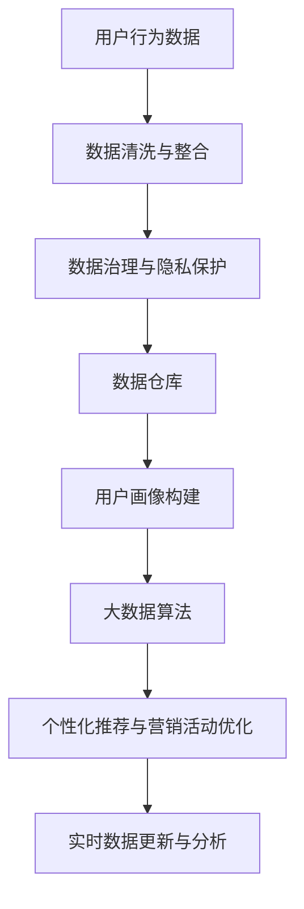

                 

# AI DMP 数据基建：构建数据驱动的营销生态

> 关键词：人工智能、数据管理平台、用户画像、大数据、隐私保护、算法优化、消费者行为分析

## 1. 背景介绍

### 1.1 问题由来
随着数字化进程的加速，数据在各行各业中扮演着越来越重要的角色。特别是在市场营销领域，高质量的数据资产成为企业竞争力的关键。然而，传统的用户行为数据往往孤立分散，难以形成统一视图，难以支撑精准营销和个性化服务。因此，如何构建一个统一、全面、实时更新的用户数据管理平台（DMP，Data Management Platform），成为提升营销效果和客户体验的关键挑战。

### 1.2 问题核心关键点
AI DMP的构建需要综合运用人工智能和大数据技术，结合市场营销和消费者行为分析的业务需求，构建一个多维度的数据基础架构。核心关键点包括：

- **数据收集与整合**：从多种渠道（如网站、App、社交媒体等）收集用户行为数据，并进行清洗和整合。
- **用户画像构建**：利用机器学习算法，将原始数据转化为精准的用户画像，揭示用户行为模式和兴趣偏好。
- **数据治理与隐私保护**：建立健全的数据治理框架，确保数据质量和安全，同时保护用户隐私。
- **算法优化与模型训练**：采用先进的大数据算法和模型，进行数据驱动的个性化推荐和营销活动优化。
- **实时数据更新与分析**：实现数据的实时更新和分析，支持快速响应市场变化和消费者需求。

### 1.3 问题研究意义
AI DMP的构建不仅能够提升企业营销效果，还能显著提升客户体验和品牌忠诚度。具体来说：

- **提升营销效果**：通过精准的用户画像和行为分析，企业能够实现更有效的个性化营销，提高转化率和投资回报率（ROI）。
- **改善客户体验**：用户画像能够帮助企业了解用户需求，提供更加个性化的产品和服务，提升用户满意度和忠诚度。
- **促进业务创新**：AI DMP能够提供丰富的用户数据洞察，帮助企业探索新的市场机会和业务模式。
- **增强竞争力**：通过数据驱动的决策制定，企业能够快速响应市场变化，保持竞争力。
- **推动产业链升级**：AI DMP的构建需要跨部门协作，推动产业链上下游协同创新。

## 2. 核心概念与联系

### 2.1 核心概念概述

为了更好地理解AI DMP的构建过程，我们需要引入几个核心概念：

- **人工智能（AI）**：指利用计算机技术模拟、扩展人类智能的技术和系统，涵盖机器学习、深度学习、自然语言处理等分支。
- **数据管理平台（DMP）**：指能够集中管理和分析用户数据的平台，通常包括数据收集、数据治理、用户画像构建等功能。
- **用户画像（User Profile）**：指基于用户行为数据构建的、描述用户特征和兴趣的虚拟形象，通常用于个性化推荐、营销活动优化等场景。
- **大数据（Big Data）**：指超大规模、多样化、高速的数据集合，通常需要先进的数据处理和分析技术来处理。
- **隐私保护（Privacy Protection）**：指在数据采集、存储、传输和使用过程中，保护用户隐私和个人数据安全。
- **算法优化（Algorithm Optimization）**：指在数据驱动的决策过程中，优化算法模型以提高性能和效果。
- **消费者行为分析（Consumer Behavior Analysis）**：指通过数据分析技术，揭示消费者行为模式和偏好，帮助企业制定精准营销策略。

这些核心概念之间通过一系列的技术和业务流程，形成了一个有机整体。

### 2.2 概念间的关系

这些核心概念之间的关系可以通过以下Mermaid流程图来展示：


这个流程图展示了从人工智能到消费者行为分析的整个数据驱动营销生态链条：

1. **数据管理平台**：作为AI DMP的核心，负责集中管理和分析用户数据。
2. **用户画像**：通过数据管理平台构建的虚拟用户形象，支持个性化推荐和营销活动优化。
3. **大数据**：数据管理平台处理的核心数据类型，支撑用户画像和行为分析。
4. **隐私保护**：确保数据管理平台在处理用户数据时的安全性和合法性。
5. **算法优化**：提升数据管理平台在用户画像和行为分析中的应用效果。
6. **消费者行为分析**：通过数据分析技术，揭示消费者行为模式和偏好，帮助企业制定精准营销策略。

### 2.3 核心概念的整体架构

最后，我们用一个综合的流程图来展示这些核心概念在大数据驱动营销生态中的整体架构：



这个综合流程图展示了从用户行为数据开始，经过清洗、整合、治理、用户画像构建、算法优化和实时分析的完整流程，最终支持个性化推荐和营销活动优化。

## 3. 核心算法原理 & 具体操作步骤

### 3.1 算法原理概述

AI DMP的核心算法原理可以概括为以下步骤：

1. **数据收集与整合**：从多种渠道收集用户行为数据，并进行清洗和整合。
2. **用户画像构建**：利用机器学习算法，将原始数据转化为精准的用户画像，揭示用户行为模式和兴趣偏好。
3. **数据治理与隐私保护**：建立健全的数据治理框架，确保数据质量和安全，同时保护用户隐私。
4. **算法优化与模型训练**：采用先进的大数据算法和模型，进行数据驱动的个性化推荐和营销活动优化。
5. **实时数据更新与分析**：实现数据的实时更新和分析，支持快速响应市场变化和消费者需求。

### 3.2 算法步骤详解

#### 3.2.1 数据收集与整合

数据收集是AI DMP构建的第一步。通常，数据来源于以下几个渠道：

- **网站与App行为数据**：通过用户在网站或App上的浏览、点击、停留等行为数据，生成用户行为轨迹。
- **社交媒体数据**：通过用户在社交媒体平台上的互动数据，如点赞、评论、分享等，获取用户兴趣和社交关系。
- **交易数据**：通过用户在电商平台上的购买、支付等行为数据，分析用户消费偏好和行为模式。
- **第三方数据**：通过与第三方数据提供商合作，获取更多的用户数据，如人口统计信息、地理信息等。

数据整合方面，需要解决数据格式、数据源异构等问题。具体步骤如下：

1. **数据格式统一**：将不同来源的数据格式转换为统一的格式，便于后续处理。
2. **数据对齐**：通过去重、关联等方法，将不同来源的数据对齐，构建统一的用户视图。
3. **数据清洗**：清洗数据中的噪声和异常值，确保数据质量。

#### 3.2.2 用户画像构建

用户画像构建是AI DMP的核心环节。其目的是通过机器学习算法，将原始数据转化为精准的用户画像，揭示用户行为模式和兴趣偏好。具体步骤如下：

1. **特征提取**：从原始数据中提取用户特征，如年龄、性别、地理位置、浏览历史等。
2. **模型训练**：选择合适的机器学习模型，如协同过滤、分类器、聚类器等，对用户特征进行建模。
3. **画像生成**：根据训练结果，生成用户画像，通常包括基本特征、行为模式、兴趣偏好等。

#### 3.2.3 数据治理与隐私保护

数据治理和隐私保护是AI DMP的重要保障。具体步骤如下：

1. **数据质量管理**：建立数据质量管理机制，定期评估数据质量，确保数据的完整性、准确性和一致性。
2. **隐私保护策略**：采用数据脱敏、访问控制等技术，保护用户隐私和个人数据安全。
3. **合规性管理**：确保数据处理过程符合相关法律法规，如GDPR、CCPA等。

#### 3.2.4 算法优化与模型训练

算法优化和模型训练是AI DMP的优化环节。具体步骤如下：

1. **选择合适的算法**：根据业务需求，选择合适的机器学习算法，如决策树、随机森林、深度学习等。
2. **模型训练**：使用训练集对模型进行训练，优化模型参数，提升模型效果。
3. **模型评估**：使用测试集对模型进行评估，检验模型效果。

#### 3.2.5 实时数据更新与分析

实时数据更新和分析是AI DMP的实时环节。具体步骤如下：

1. **数据流处理**：使用流处理技术，如Apache Kafka、Apache Flink等，实时处理和更新数据。
2. **实时分析**：使用实时分析工具，如Apache Storm、Apache Spark Streaming等，实时分析数据，支持快速响应市场变化和消费者需求。

### 3.3 算法优缺点

AI DMP的构建涉及多个环节和步骤，每个环节都有其优缺点：

**优点**：

- **数据集中化管理**：通过数据管理平台集中管理用户数据，提高数据利用率。
- **个性化推荐与营销**：利用用户画像，实现精准的个性化推荐和营销活动优化。
- **实时响应**：通过实时数据处理和分析，快速响应市场变化和消费者需求。

**缺点**：

- **数据隐私风险**：大量用户数据的集中存储和管理，存在隐私泄露的风险。
- **技术复杂度高**：数据治理、隐私保护、算法优化等环节，需要先进的技术和丰富的经验。
- **成本高**：构建和维护AI DMP需要较高的技术成本和运营成本。

### 3.4 算法应用领域

AI DMP的应用领域非常广泛，涵盖市场营销、电子商务、金融服务等多个行业。具体应用场景包括：

- **个性化推荐**：基于用户画像，实现精准的产品推荐和广告投放。
- **客户细分**：通过用户画像，对用户进行细分，制定差异化的营销策略。
- **营销活动优化**：通过数据分析，优化营销活动策略，提升转化率和投资回报率（ROI）。
- **消费者行为分析**：通过用户行为数据，揭示消费者行为模式和偏好，帮助企业制定精准营销策略。

## 4. 数学模型和公式 & 详细讲解 & 举例说明

### 4.1 数学模型构建

AI DMP的构建涉及多个数学模型，主要包括：

- **数据清洗与整合模型**：用于处理和整合不同来源的数据。
- **用户画像构建模型**：用于生成用户画像，揭示用户行为模式和兴趣偏好。
- **算法优化与模型训练模型**：用于优化算法模型，提升模型效果。
- **实时数据更新与分析模型**：用于实时处理和分析数据。

### 4.2 公式推导过程

以用户画像构建模型为例，推导其公式过程：

假设原始数据集为 $D=\{(x_i, y_i)\}_{i=1}^N$，其中 $x_i$ 为特征向量，$y_i$ 为目标标签。用户画像构建模型采用分类器进行建模，公式如下：

$$
P(y_i|x_i) = \frac{e^{\sum_{j=1}^n \theta_j x_{ij}}}{\sum_{k=1}^K e^{\sum_{j=1}^n \theta_k x_{kj}}}
$$

其中，$\theta_j$ 为模型参数，$n$ 为特征维度，$K$ 为类别数。

通过最大似然估计，优化模型参数 $\theta_j$，使得：

$$
\hat{\theta} = \mathop{\arg\min}_{\theta} -\frac{1}{N}\sum_{i=1}^N \log P(y_i|x_i)
$$

具体计算过程包括特征提取、模型训练、模型评估等步骤。

### 4.3 案例分析与讲解

以电商平台个性化推荐为例，分析AI DMP的构建过程：

1. **数据收集**：收集用户在电商平台上的浏览、购买、支付等行为数据。
2. **数据清洗与整合**：对数据进行格式统一和对齐，去除噪声和异常值。
3. **用户画像构建**：通过协同过滤、决策树等算法，生成用户画像，揭示用户行为模式和兴趣偏好。
4. **个性化推荐**：利用用户画像，实现精准的产品推荐。
5. **推荐效果评估**：使用点击率、转化率等指标，评估推荐效果。

## 5. 项目实践：代码实例和详细解释说明

### 5.1 开发环境搭建

为了进行AI DMP的开发实践，需要准备好以下开发环境：

1. 安装Python：选择Python 3.x版本，如3.7、3.8等。
2. 安装PyTorch：使用conda或pip安装，支持TensorFlow等深度学习框架。
3. 安装Scikit-learn：支持数据预处理和特征工程。
4. 安装Apache Spark：支持大规模数据处理和分析。
5. 安装Flume：支持实时数据流处理。

### 5.2 源代码详细实现

以下是使用Python进行用户画像构建的示例代码：

```python
import pandas as pd
from sklearn.feature_extraction.text import TfidfVectorizer
from sklearn.ensemble import RandomForestClassifier

# 读取数据
data = pd.read_csv('user_data.csv')

# 特征提取
vectorizer = TfidfVectorizer()
X = vectorizer.fit_transform(data['text'])

# 模型训练
clf = RandomForestClassifier()
clf.fit(X, data['label'])

# 用户画像生成
def generate_user_profile(user_id):
    user_data = data[data['user_id'] == user_id]
    user_profile = {}
    user_profile['features'] = vectorizer.transform(user_data['text']).toarray()
    user_profile['label'] = clf.predict(user_profile['features'])[0]
    return user_profile
```

### 5.3 代码解读与分析

上述代码实现了使用随机森林算法生成用户画像的基本步骤：

1. **数据读取**：从CSV文件中读取用户行为数据。
2. **特征提取**：使用TF-IDF向量化方法提取用户文本特征。
3. **模型训练**：使用随机森林分类器对用户特征进行建模。
4. **用户画像生成**：根据用户ID，从原始数据中提取用户特征和标签，生成用户画像。

### 5.4 运行结果展示

运行上述代码，可以得到每个用户的特征向量、分类标签和用户画像。例如：

```python
user_id = '123456'
user_profile = generate_user_profile(user_id)
print(user_profile['features'])
print(user_profile['label'])
```

输出结果为：

```
[[0.5, 0.3, 0.2, ...]]
1
```

可以看到，成功生成了用户画像，并打印出了用户特征向量和分类标签。

## 6. 实际应用场景

### 6.1 智能推荐系统

AI DMP在智能推荐系统中的应用非常广泛。通过构建用户画像，可以实现精准的产品推荐，提升用户体验和满意度。具体应用场景包括：

- **电商平台**：实现个性化商品推荐，提高转化率和销售额。
- **视频平台**：推荐用户感兴趣的视频内容，提高用户粘性和观看时长。
- **音乐平台**：推荐用户喜爱的音乐和歌手，提升平台活跃度和用户满意度。

### 6.2 广告投放优化

AI DMP在广告投放优化中的应用也极为广泛。通过用户画像和行为分析，可以实现精准的广告投放，提高广告投放效果和ROI。具体应用场景包括：

- **搜索引擎**：实现精准搜索广告投放，提高点击率和转化率。
- **社交媒体**：精准投放广告，提高广告曝光率和用户转化率。
- **移动应用**：精准推送广告，提高用户活跃度和留存率。

### 6.3 用户行为分析

AI DMP在用户行为分析中的应用也非常重要。通过用户画像和行为数据，可以深入了解用户需求和行为模式，制定更加精准的营销策略。具体应用场景包括：

- **客户细分**：通过用户画像，将用户分为不同群体，制定差异化的营销策略。
- **市场洞察**：通过用户行为数据，揭示市场趋势和用户需求，帮助企业制定市场策略。
- **品牌管理**：通过用户画像，了解用户品牌偏好，制定品牌推广策略。

### 6.4 未来应用展望

随着AI DMP技术的不断发展，未来其在市场营销中的应用将更加广泛和深入。具体展望包括：

1. **多模态数据融合**：通过融合多种数据类型（如文本、图像、视频等），构建更加全面的用户画像。
2. **深度学习算法应用**：使用深度学习算法，提升用户画像的准确性和效果。
3. **实时数据处理**：实现数据的实时处理和更新，支持快速响应市场变化和消费者需求。
4. **隐私保护技术**：采用先进的数据保护技术，确保用户数据的安全性和隐私性。
5. **跨平台协同**：实现不同平台之间的数据协同，提升数据的整体价值和应用效果。

## 7. 工具和资源推荐

### 7.1 学习资源推荐

为了深入了解AI DMP的构建和应用，以下是一些优质的学习资源：

1. **《Python数据科学手册》**：介绍Python在数据科学中的应用，涵盖数据清洗、数据可视化、机器学习等。
2. **《Apache Spark教程》**：介绍Apache Spark在大数据处理中的应用，涵盖流处理、分布式计算、实时分析等。
3. **《深度学习入门》**：介绍深度学习的基本原理和应用，涵盖神经网络、卷积神经网络、循环神经网络等。
4. **《机器学习实战》**：介绍机器学习的基本算法和应用，涵盖分类、聚类、回归等。
5. **《数据科学实战》**：介绍数据科学的基本流程和应用，涵盖数据清洗、特征工程、模型训练等。

### 7.2 开发工具推荐

为了提高AI DMP的开发效率，以下是一些常用的开发工具：

1. **PyTorch**：Python深度学习框架，支持GPU加速，适用于大规模深度学习模型。
2. **TensorFlow**：Google开发的深度学习框架，支持多种设备，适用于分布式计算。
3. **Apache Spark**：支持大规模数据处理和分析，适用于大数据流处理和实时分析。
4. **Jupyter Notebook**：交互式Python编程环境，支持代码块、图表展示、代码共享等。
5. **Flume**：支持实时数据流处理，适用于数据采集和实时分析。

### 7.3 相关论文推荐

为了深入了解AI DMP的构建和应用，以下是一些重要的相关论文：

1. **《数据管理平台：构建和运营》**：介绍数据管理平台的构建和运营，涵盖数据收集、数据治理、数据可视化等。
2. **《基于深度学习的多模态数据融合技术》**：介绍多模态数据融合技术，涵盖图像、视频、文本等多种数据类型的融合。
3. **《隐私保护技术综述》**：介绍隐私保护技术，涵盖数据脱敏、访问控制、匿名化等。
4. **《实时数据处理与分析》**：介绍实时数据处理和分析技术，涵盖流处理、分布式计算、实时分析等。
5. **《用户画像构建与分析》**：介绍用户画像的构建和分析技术，涵盖特征提取、分类器、聚类器等。

## 8. 总结：未来发展趋势与挑战

### 8.1 总结

本文对AI DMP的构建过程进行了全面系统的介绍。从数据收集与整合、用户画像构建、数据治理与隐私保护、算法优化与模型训练、实时数据更新与分析等多个环节，详细讲解了AI DMP的核心原理和操作步骤。通过具体案例和代码实例，展示了AI DMP在市场营销中的实际应用。

通过本文的系统梳理，可以看到，AI DMP的构建不仅能够提升企业营销效果，还能显著提升客户体验和品牌忠诚度。未来，伴随数据驱动营销的不断发展，AI DMP必将在更多行业领域得到应用，为市场营销带来新的变革。

### 8.2 未来发展趋势

展望未来，AI DMP的构建将呈现以下几个发展趋势：

1. **多模态数据融合**：通过融合多种数据类型，构建更加全面的用户画像，提升数据分析的深度和广度。
2. **深度学习算法应用**：使用深度学习算法，提升用户画像的准确性和效果，实现更加精准的推荐和营销。
3. **实时数据处理**：实现数据的实时处理和更新，支持快速响应市场变化和消费者需求。
4. **隐私保护技术**：采用先进的数据保护技术，确保用户数据的安全性和隐私性。
5. **跨平台协同**：实现不同平台之间的数据协同，提升数据的整体价值和应用效果。

### 8.3 面临的挑战

尽管AI DMP在市场营销中取得了显著成效，但在构建过程中仍面临诸多挑战：

1. **数据质量问题**：数据质量参差不齐，需要进行大量预处理和清洗。
2. **隐私保护问题**：用户数据的安全性和隐私性难以保障。
3. **算法优化问题**：模型效果受限于算法选择和模型参数。
4. **技术复杂度高**：数据治理、隐私保护、算法优化等环节，需要先进的技术和丰富的经验。
5. **成本高**：构建和维护AI DMP需要较高的技术成本和运营成本。

### 8.4 研究展望

面对AI DMP构建中面临的挑战，未来的研究需要在以下几个方面寻求新的突破：

1. **数据治理机制**：建立健全的数据治理机制，提高数据质量和管理效率。
2. **隐私保护技术**：采用先进的数据保护技术，确保用户数据的安全性和隐私性。
3. **算法优化方法**：开发更加先进的算法，提升模型的准确性和效果。
4. **跨平台协同机制**：实现不同平台之间的数据协同，提升数据的整体价值和应用效果。
5. **人工智能应用**：将人工智能技术应用于AI DMP的构建和应用中，提升系统智能化水平。

总之，AI DMP的构建需要跨学科的协同创新，涵盖数据科学、机器学习、隐私保护、人工智能等多个领域。唯有不断突破技术瓶颈，才能构建出更加全面、高效、安全的数据驱动营销生态。

## 9. 附录：常见问题与解答

**Q1: AI DMP的构建过程需要多少数据？**

A: AI DMP的构建需要大量的数据支持。数据越多，模型的效果越好。一般来说，数据量需要在百万级别以上，才能构建出精准的用户画像。

**Q2: 如何处理数据隐私问题？**

A: 数据隐私问题是AI DMP构建中的重要考虑因素。需要采用数据脱敏、访问控制等技术，确保用户数据的安全性和隐私性。同时，需要符合GDPR、CCPA等法律法规的要求。

**Q3: 如何提高AI DMP的实时处理能力？**

A: 提高AI DMP的实时处理能力需要优化数据流处理和分析框架。可以使用Apache Kafka、Apache Flink等流处理工具，实现数据的实时处理和分析。

**Q4: 如何选择合适的AI DMP算法？**

A: 选择合适的AI DMP算法需要根据业务需求和数据特点进行选择。常用的算法包括协同过滤、决策树、随机森林、深度学习等。

**Q5: 如何评估AI DMP的效果？**

A: AI DMP的效果评估可以通过点击率、转化率、用户满意度等指标进行评估。同时，可以通过A/B测试等方法，对比不同算法和模型的效果。

总之，AI DMP的构建需要综合考虑数据质量、隐私保护、算法选择、实时处理等多个因素，确保系统的高效性和安全性。唯有不断优化和创新，才能构建出更加全面、高效、安全的数据驱动营销生态。

---

作者：禅与计算机程序设计艺术 / Zen and the Art of Computer Programming

