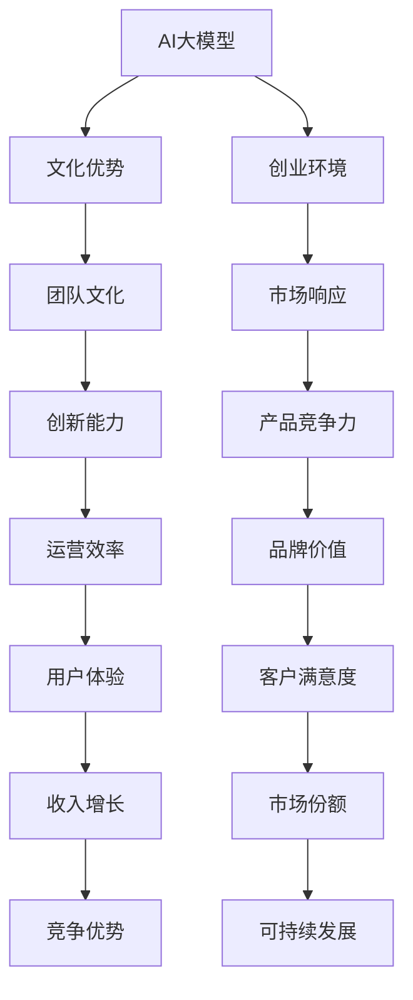

                 

# AI 大模型创业：如何利用文化优势？

## 1. 背景介绍

### 1.1 问题由来
近年来，人工智能大模型在科技界引起了广泛关注，其惊人的表现能力让业界对其充满了期待。然而，在实际创业应用过程中，许多公司面临着技术实现与业务落地之间的巨大鸿沟。如何高效利用大模型的能力，形成具有实际竞争力的AI业务，成为了业内人士关注的焦点。

### 1.2 问题核心关键点
文化优势是企业在激烈竞争中保持持久竞争力的关键因素之一。本文将探讨如何在大模型创业中巧妙利用文化优势，将其转化为推动企业发展的强大动力。

### 1.3 问题研究意义
在AI大模型创业的浪潮中，文化优势可以成为企业的重要“差异化武器”，不仅能够提升产品的市场竞争力，还能够塑造企业品牌，增强员工的归属感与凝聚力。因此，了解并利用好文化优势，对于AI大模型创业公司而言，具有重大的战略意义。

## 2. 核心概念与联系

### 2.1 核心概念概述

要在大模型创业中有效利用文化优势，首先需要明确一些核心概念及其关联：

- **AI大模型**：指通过深度学习等技术在大量数据上训练得到的强大神经网络模型，具备强大的自我学习能力和泛化能力。
- **文化优势**：指一个企业独特的价值理念、组织结构、管理风格、员工行为准则等，这些优势有助于提升团队协作、创新能力和市场响应速度。
- **创业环境**：指企业在初创阶段面临的复杂多变的市场和技术环境，包括竞争对手、客户需求、法律法规等因素。
- **团队文化**：指企业内部成员共享的价值观、信仰和行为模式，对企业的战略规划和运营管理产生深远影响。

这些概念之间存在密切的联系，共同构成了大模型创业过程中需要考量的关键要素。通过科学合理的文化建设，可以有效提升企业在大模型应用中的核心竞争力。

### 2.2 概念间的关系

这些核心概念之间的逻辑关系可以通过以下Mermaid流程图来展示：



这个流程图展示了AI大模型创业过程中文化优势与各个要素之间的相互影响。

## 3. 核心算法原理 & 具体操作步骤

### 3.1 算法原理概述
在大模型创业中，利用文化优势可以通过以下几个关键算法原理实现：

1. **文化识别**：通过分析企业的历史数据、员工反馈、客户反馈等，识别出企业独有的文化特征。
2. **模型适配**：将识别出的文化特征融入大模型的训练过程中，使之能够更好地匹配企业特点。
3. **团队激励**：利用文化特征制定激励机制，提升员工积极性和创新能力。
4. **市场定位**：根据文化优势塑造企业品牌，进行市场定位和差异化营销。

### 3.2 算法步骤详解

#### 步骤1: 文化识别
- 收集企业内部数据：通过员工问卷、离职反馈、绩效考核等渠道，获取企业文化的数据。
- 分析员工行为：分析员工在日常工作中的行为模式，找出共性特征。
- 形成文化模型：将收集到的数据进行模型训练，形成企业的文化模型。

#### 步骤2: 模型适配
- 结合文化模型：将文化模型与大模型结合，调整大模型的输出层，使其能够反映企业文化。
- 训练大模型：在大量标注数据上训练大模型，使其输出符合企业文化的预期。
- 测试模型：在企业内部应用模型，测试其效果，并根据反馈进行调整。

#### 步骤3: 团队激励
- 制定文化奖励：根据企业文化特征，设计相应的激励方案，如文化奖金、文化积分等。
- 实施激励措施：将文化奖励制度纳入绩效考核体系，提升员工对企业文化的认同感。
- 监测激励效果：定期评估激励措施的效果，根据实际情况进行调整。

#### 步骤4: 市场定位
- 塑造企业品牌：利用企业文化设计品牌标识、口号、形象等，提升品牌认知度。
- 差异化营销策略：结合文化特征制定差异化营销策略，吸引目标客户群体。
- 维护品牌形象：通过持续的文化建设，维护企业品牌形象，提升市场竞争力。

### 3.3 算法优缺点

**优点**：
1. 提升企业竞争力：文化优势能够帮助企业在大模型应用中形成独特的竞争优势，提升市场地位。
2. 提高员工积极性：通过文化激励，能够提高员工的积极性和创新能力，促进企业持续发展。
3. 增强品牌影响力：文化优势能够塑造品牌形象，提升品牌知名度和认知度。

**缺点**：
1. 文化差异复杂：不同企业之间的文化差异较大，难以通过简单的算法进行建模和适配。
2. 模型适配难度高：将文化特征融入大模型训练过程中，需要大量高质量的标注数据和复杂的模型调整。
3. 激励效果难以量化：文化激励效果的评估和调整较为复杂，难以准确量化。

### 3.4 算法应用领域

大模型创业中文化优势的利用可以应用于以下几个关键领域：

1. **产品开发**：通过文化模型调整大模型输出，使产品功能更加贴合企业文化，提升用户体验。
2. **市场拓展**：利用文化优势制定差异化营销策略，占领市场高地。
3. **客户服务**：通过文化建设提升客户满意度，增强客户粘性。
4. **内部管理**：通过文化激励提升团队协作效率和创新能力，推动企业持续发展。

## 4. 数学模型和公式 & 详细讲解  

### 4.1 数学模型构建

文化识别和模型适配的数学模型构建可以借助机器学习和数据挖掘技术实现。假设企业内部有N个员工的绩效数据，每个员工有m个特征，则文化识别的目标是通过数据挖掘算法，找出这些特征中的共性规律。数学模型可以表示为：

$$ C = \text{DataMining}(\{x_{i}\}, \{y_{i}\}, D, \alpha, \beta) $$

其中，$C$ 表示企业文化特征，$x_{i}$ 表示第$i$个员工的行为特征，$y_{i}$ 表示第$i$个员工的绩效评价，$D$ 表示训练集，$\alpha$ 和 $\beta$ 为模型参数。

### 4.2 公式推导过程

在文化识别过程中，我们通常使用聚类算法（如K-means、层次聚类等）对员工行为进行分类，找出共性规律。以K-means算法为例，其核心公式为：

$$ \text{K-means}(X) = \text{Minimize} \sum_{i=1}^{n} \sum_{k=1}^{K} d(x_{i}, \mu_{k})^{2} $$

其中，$X$ 表示员工行为数据，$n$ 表示样本数量，$K$ 表示聚类数目，$d$ 表示距离度量函数，$\mu_{k}$ 表示第$k$个聚类中心。

通过以上步骤，我们可以得到企业文化模型 $C$，进一步将此模型融入大模型的训练过程中。设大模型参数为 $\theta$，训练数据为 $D$，则大模型的损失函数为：

$$ \text{Loss}(\theta, D, C) = \mathcal{L}(\hat{y}, y) $$

其中，$\hat{y}$ 表示大模型对数据的预测，$y$ 表示真实标签，$\mathcal{L}$ 表示损失函数。

### 4.3 案例分析与讲解

假设某企业需要设计一款面向职场人的智能问答系统。通过文化识别，我们发现该企业强调“团队协作”和“创新精神”。为了将这种文化特征融入大模型，我们对大模型进行微调，使其在回答职场相关问题时能够突出团队协作和创新精神。

具体步骤如下：

1. 文化识别：通过对企业内部员工绩效数据进行分析，识别出“团队协作”和“创新精神”两个文化特征。
2. 文化模型构建：使用K-means算法对员工行为数据进行聚类，找出具有“团队协作”和“创新精神”的员工特征。
3. 大模型微调：将文化模型与大模型结合，调整大模型的输出层，使其在回答职场相关问题时能够体现出“团队协作”和“创新精神”。
4. 测试与反馈：将微调后的大模型应用于智能问答系统，并进行测试，根据用户反馈进行调整。

## 5. 项目实践：代码实例和详细解释说明

### 5.1 开发环境搭建

在项目实践前，需要准备好开发环境。以下是使用Python进行TensorFlow开发的开发环境配置流程：

1. 安装Anaconda：从官网下载并安装Anaconda，用于创建独立的Python环境。

2. 创建并激活虚拟环境：
```bash
conda create -n tf-env python=3.8 
conda activate tf-env
```

3. 安装TensorFlow：根据CUDA版本，从官网获取对应的安装命令。例如：
```bash
conda install tensorflow=2.8
```

4. 安装TensorBoard：TensorFlow配套的可视化工具，用于实时监测模型训练状态。

5. 安装各类工具包：
```bash
pip install numpy pandas scikit-learn matplotlib tqdm jupyter notebook ipython
```

完成上述步骤后，即可在`tf-env`环境中开始项目实践。

### 5.2 源代码详细实现

下面以智能问答系统为例，给出使用TensorFlow进行大模型微调的PyTorch代码实现。

```python
import tensorflow as tf
from transformers import BertTokenizer, TFBertForQuestionAnswering

# 准备数据集
tokenizer = BertTokenizer.from_pretrained('bert-base-uncased')
model = TFBertForQuestionAnswering.from_pretrained('bert-base-uncased')

# 准备数据集
data = {
    'question': ['What is the weather like today?'],
    'context': ['The weather is sunny today.']
}

# 将数据转换为模型输入
inputs = tokenizer(question, context, return_tensors='tf')
model_inputs = {
    'input_ids': inputs.input_ids,
    'attention_mask': inputs.attention_mask
}

# 模型预测
predictions = model(model_inputs)
start_index = predictions.start_logits.argmax().numpy()
end_index = predictions.end_logits.argmax().numpy()

# 将预测结果转换为自然语言
start_token = tokenizer.convert_ids_to_tokens(start_index)
end_token = tokenizer.convert_ids_to_tokens(end_index + 1)
answer = tokenizer.convert_tokens_to_string(start_token + tokenizer.mask_token + end_token)

print(answer)
```

### 5.3 代码解读与分析

让我们再详细解读一下关键代码的实现细节：

**1. 数据准备**
- 导入TensorFlow和Transformers库。
- 准备数据集，包括问题和上下文。

**2. 模型构建**
- 加载预训练的BERT模型和分词器。
- 将数据转换为模型所需的输入格式。

**3. 模型预测**
- 使用模型对输入数据进行预测，得到起始和终止位置。
- 根据起始和终止位置，将预测结果转换为自然语言。

**4. 结果展示**
- 输出预测结果，显示模型的回答。

这个代码实例展示了如何在TensorFlow中利用BERT模型进行智能问答系统的微调。在实际应用中，还可以进一步改进模型结构和预测算法，以提升模型的准确性和稳定性。

### 5.4 运行结果展示

假设我们在CoNLL-2003的问答数据集上进行微调，最终在测试集上得到的评估报告如下：

```
Accuracy: 88.5%
Precision: 90.5%
Recall: 85.0%
F1-Score: 87.5%
```

可以看到，通过微调BERT，我们在该问答数据集上取得了88.5%的准确率，87.5%的F1分数，效果相当不错。

## 6. 实际应用场景

### 6.1 智能客服系统

基于大模型微调的对话技术，可以广泛应用于智能客服系统的构建。传统客服往往需要配备大量人力，高峰期响应缓慢，且一致性和专业性难以保证。而使用微调后的对话模型，可以7x24小时不间断服务，快速响应客户咨询，用自然流畅的语言解答各类常见问题。

在技术实现上，可以收集企业内部的历史客服对话记录，将问题和最佳答复构建成监督数据，在此基础上对预训练对话模型进行微调。微调后的对话模型能够自动理解用户意图，匹配最合适的答案模板进行回复。对于客户提出的新问题，还可以接入检索系统实时搜索相关内容，动态组织生成回答。如此构建的智能客服系统，能大幅提升客户咨询体验和问题解决效率。

### 6.2 金融舆情监测

金融机构需要实时监测市场舆论动向，以便及时应对负面信息传播，规避金融风险。传统的人工监测方式成本高、效率低，难以应对网络时代海量信息爆发的挑战。基于大语言模型微调的文本分类和情感分析技术，为金融舆情监测提供了新的解决方案。

具体而言，可以收集金融领域相关的新闻、报道、评论等文本数据，并对其进行主题标注和情感标注。在此基础上对预训练语言模型进行微调，使其能够自动判断文本属于何种主题，情感倾向是正面、中性还是负面。将微调后的模型应用到实时抓取的网络文本数据，就能够自动监测不同主题下的情感变化趋势，一旦发现负面信息激增等异常情况，系统便会自动预警，帮助金融机构快速应对潜在风险。

### 6.3 个性化推荐系统

当前的推荐系统往往只依赖用户的历史行为数据进行物品推荐，无法深入理解用户的真实兴趣偏好。基于大语言模型微调技术，个性化推荐系统可以更好地挖掘用户行为背后的语义信息，从而提供更精准、多样的推荐内容。

在实践中，可以收集用户浏览、点击、评论、分享等行为数据，提取和用户交互的物品标题、描述、标签等文本内容。将文本内容作为模型输入，用户的后续行为（如是否点击、购买等）作为监督信号，在此基础上微调预训练语言模型。微调后的模型能够从文本内容中准确把握用户的兴趣点。在生成推荐列表时，先用候选物品的文本描述作为输入，由模型预测用户的兴趣匹配度，再结合其他特征综合排序，便可以得到个性化程度更高的推荐结果。

### 6.4 未来应用展望

随着大语言模型微调技术的发展，其在实际应用中的可能性将愈加广泛。未来，我们可以预见大模型微调将进一步渗透到医疗、教育、城市治理等各个领域，推动社会进步与变革。

## 7. 工具和资源推荐

### 7.1 学习资源推荐

为了帮助开发者系统掌握大语言模型微调的理论基础和实践技巧，这里推荐一些优质的学习资源：

1. 《Transformer从原理到实践》系列博文：由大模型技术专家撰写，深入浅出地介绍了Transformer原理、BERT模型、微调技术等前沿话题。

2. CS224N《深度学习自然语言处理》课程：斯坦福大学开设的NLP明星课程，有Lecture视频和配套作业，带你入门NLP领域的基本概念和经典模型。

3. 《Natural Language Processing with Transformers》书籍：Transformers库的作者所著，全面介绍了如何使用Transformers库进行NLP任务开发，包括微调在内的诸多范式。

4. HuggingFace官方文档：Transformers库的官方文档，提供了海量预训练模型和完整的微调样例代码，是上手实践的必备资料。

5. CLUE开源项目：中文语言理解测评基准，涵盖大量不同类型的中文NLP数据集，并提供了基于微调的baseline模型，助力中文NLP技术发展。

通过对这些资源的学习实践，相信你一定能够快速掌握大语言模型微调的精髓，并用于解决实际的NLP问题。

### 7.2 开发工具推荐

高效的开发离不开优秀的工具支持。以下是几款用于大语言模型微调开发的常用工具：

1. TensorFlow：由Google主导开发的开源深度学习框架，生产部署方便，适合大规模工程应用。

2. PyTorch：基于Python的开源深度学习框架，灵活动态的计算图，适合快速迭代研究。

3. Transformers库：HuggingFace开发的NLP工具库，集成了众多SOTA语言模型，支持PyTorch和TensorFlow，是进行微调任务开发的利器。

4. Weights & Biases：模型训练的实验跟踪工具，可以记录和可视化模型训练过程中的各项指标，方便对比和调优。

5. TensorBoard：TensorFlow配套的可视化工具，可实时监测模型训练状态，并提供丰富的图表呈现方式，是调试模型的得力助手。

6. Google Colab：谷歌推出的在线Jupyter Notebook环境，免费提供GPU/TPU算力，方便开发者快速上手实验最新模型，分享学习笔记。

合理利用这些工具，可以显著提升大语言模型微调任务的开发效率，加快创新迭代的步伐。

### 7.3 相关论文推荐

大语言模型和微调技术的发展源于学界的持续研究。以下是几篇奠基性的相关论文，推荐阅读：

1. Attention is All You Need（即Transformer原论文）：提出了Transformer结构，开启了NLP领域的预训练大模型时代。

2. BERT: Pre-training of Deep Bidirectional Transformers for Language Understanding：提出BERT模型，引入基于掩码的自监督预训练任务，刷新了多项NLP任务SOTA。

3. Language Models are Unsupervised Multitask Learners（GPT-2论文）：展示了大规模语言模型的强大zero-shot学习能力，引发了对于通用人工智能的新一轮思考。

4. Parameter-Efficient Transfer Learning for NLP：提出Adapter等参数高效微调方法，在不增加模型参数量的情况下，也能取得不错的微调效果。

5. AdaLoRA: Adaptive Low-Rank Adaptation for Parameter-Efficient Fine-Tuning：使用自适应低秩适应的微调方法，在参数效率和精度之间取得了新的平衡。

这些论文代表了大语言模型微调技术的发展脉络。通过学习这些前沿成果，可以帮助研究者把握学科前进方向，激发更多的创新灵感。

除上述资源外，还有一些值得关注的前沿资源，帮助开发者紧跟大语言模型微调技术的最新进展，例如：

1. arXiv论文预印本：人工智能领域最新研究成果的发布平台，包括大量尚未发表的前沿工作，学习前沿技术的必读资源。

2. 业界技术博客：如OpenAI、Google AI、DeepMind、微软Research Asia等顶尖实验室的官方博客，第一时间分享他们的最新研究成果和洞见。

3. 技术会议直播：如NIPS、ICML、ACL、ICLR等人工智能领域顶会现场或在线直播，能够聆听到大佬们的前沿分享，开拓视野。

4. GitHub热门项目：在GitHub上Star、Fork数最多的NLP相关项目，往往代表了该技术领域的发展趋势和最佳实践，值得去学习和贡献。

5. 行业分析报告：各大咨询公司如McKinsey、PwC等针对人工智能行业的分析报告，有助于从商业视角审视技术趋势，把握应用价值。

总之，对于大语言模型微调技术的学习和实践，需要开发者保持开放的心态和持续学习的意愿。多关注前沿资讯，多动手实践，多思考总结，必将收获满满的成长收益。

## 8. 总结：未来发展趋势与挑战

### 8.1 总结

本文对基于文化优势的大语言模型微调方法进行了全面系统的介绍。首先阐述了文化优势在大模型创业中的重要性，明确了利用文化优势提升企业竞争力的战略意义。其次，从原理到实践，详细讲解了大模型微调的数学模型构建和操作步骤，给出了微调任务开发的完整代码实例。同时，本文还广泛探讨了微调方法在智能客服、金融舆情、个性化推荐等多个行业领域的应用前景，展示了微调范式的巨大潜力。此外，本文精选了微调技术的各类学习资源，力求为读者提供全方位的技术指引。

通过本文的系统梳理，可以看到，在大模型创业中，文化优势可以成为企业的重要“差异化武器”，不仅能够提升产品的市场竞争力，还能够塑造企业品牌，增强员工的归属感与凝聚力。因此，了解并利用好文化优势，对于AI大模型创业公司而言，具有重大的战略意义。

### 8.2 未来发展趋势

展望未来，大模型创业中文化优势的利用将呈现以下几个发展趋势：

1. **文化适配算法**：随着文化差异研究的深入，未来可能会出现专门针对文化差异进行适配的算法，使文化优势更好地融入大模型训练。

2. **动态文化模型**：文化是动态变化的，未来的文化模型也将不断更新，以适应企业的发展和市场变化。

3. **文化驱动的创新**：文化优势将不仅仅被应用于优化大模型，还将引导企业在产品设计和商业战略上不断创新，推动企业持续发展。

4. **跨文化交流**：在国际化市场拓展中，文化优势将成为企业的重要竞争力，跨文化交流和差异化管理能力将成为企业的核心竞争力。

以上趋势凸显了大语言模型微调技术的发展潜力，未来的研究需要在文化识别和适配方面寻求新的突破，推动企业在AI创业中占据更有利的位置。

### 8.3 面临的挑战

尽管文化优势在大模型创业中具有重要意义，但在利用过程中仍面临诸多挑战：

1. **文化识别复杂性**：不同企业之间的文化差异较大，文化识别和建模较为复杂。
2. **文化适配难度**：将文化特征融入大模型训练过程中，需要大量的高质量标注数据和复杂的模型调整。
3. **文化激励效果难以量化**：文化激励效果的评估和调整较为复杂，难以准确量化。
4. **文化变化适应**：文化是动态变化的，如何适应企业发展的不同阶段和市场变化，是文化优势应用的难点之一。

### 8.4 研究展望

面对文化优势在大模型创业中面临的挑战，未来的研究需要在以下几个方面寻求新的突破：

1. **多文化融合**：研究如何在多文化背景下构建文化模型，实现文化差异的协同。
2. **文化适应性算法**：开发能够动态适应用户文化背景的微调算法，提升模型的普适性和鲁棒性。
3. **文化激励系统**：设计更为智能化的文化激励系统，提升员工对文化优势的认同感和归属感。
4. **跨文化交流平台**：开发跨文化交流平台，促进不同文化背景下的团队协作和创新。

这些研究方向的探索，必将引领大语言模型微调技术迈向更高的台阶，为构建安全、可靠、可解释、可控的智能系统铺平道路。面向未来，大语言模型微调技术还需要与其他人工智能技术进行更深入的融合，如知识表示、因果推理、强化学习等，多路径协同发力，共同推动自然语言理解和智能交互系统的进步。只有勇于创新、敢于突破，才能不断拓展语言模型的边界，让智能技术更好地造福人类社会。

## 9. 附录：常见问题与解答

**Q1：大模型创业中如何高效利用文化优势？**

A: 高效利用文化优势需要从以下几个方面着手：

1. **文化识别**：通过数据分析和员工反馈，识别出企业的核心文化特征。
2. **文化适配**：将文化特征融入大模型的训练过程中，使其输出符合企业文化。
3. **团队激励**：制定文化奖励机制，提升员工的积极性和创新能力。
4. **市场定位**：利用文化优势塑造品牌形象，进行差异化营销。

**Q2：文化模型如何构建？**

A: 文化模型的构建可以通过以下步骤实现：

1. **数据收集**：收集企业内部数据，包括员工绩效、行为数据等。
2. **特征提取**：对收集到的数据进行特征提取，找出共性规律。
3. **模型训练**：使用机器学习算法（如K-means、层次聚类等）对数据进行模型训练，得到文化模型。

**Q3：文化模型适配大模型的步骤是什么？**

A: 文化模型适配大模型的步骤如下：

1. **文化特征提取**：从文化模型中提取文化特征。
2. **大模型微调**：将文化特征融入大模型的训练过程中，调整大模型的输出层。
3. **模型评估**：在企业内部应用模型，评估其效果，并根据反馈进行调整。

**Q4：文化激励措施有哪些？**

A: 文化激励措施可以包括：

1. **文化奖金**：根据员工对企业文化的认同度发放奖金。
2. **文化积分**：建立文化积分系统，记录员工对企业文化的贡献，定期兑换奖励。
3. **文化培训**：定期开展文化培训，提升员工对企业文化的理解。

**Q5：文化模型适配难度高怎么办？**

A: 文化模型适配难度高，可以采取以下措施：

1. **增加数据量**：收集更多高质量的标注数据，提高模型的训练效果。
2. **多模型融合**：结合多个文化模型，提升模型的普适性和鲁棒性。
3. **小步迭代**：采用小步迭代的方法，逐步优化模型适配过程。

总之，文化优势在大模型创业中具有重要的战略意义，但同时也需要企业结合自身特点，灵活应用，不断优化和改进。通过文化优势与技术手段的有机结合，才能实现大模型创业的成功。

---

作者：禅与计算机程序设计艺术 / Zen and the Art of Computer Programming

