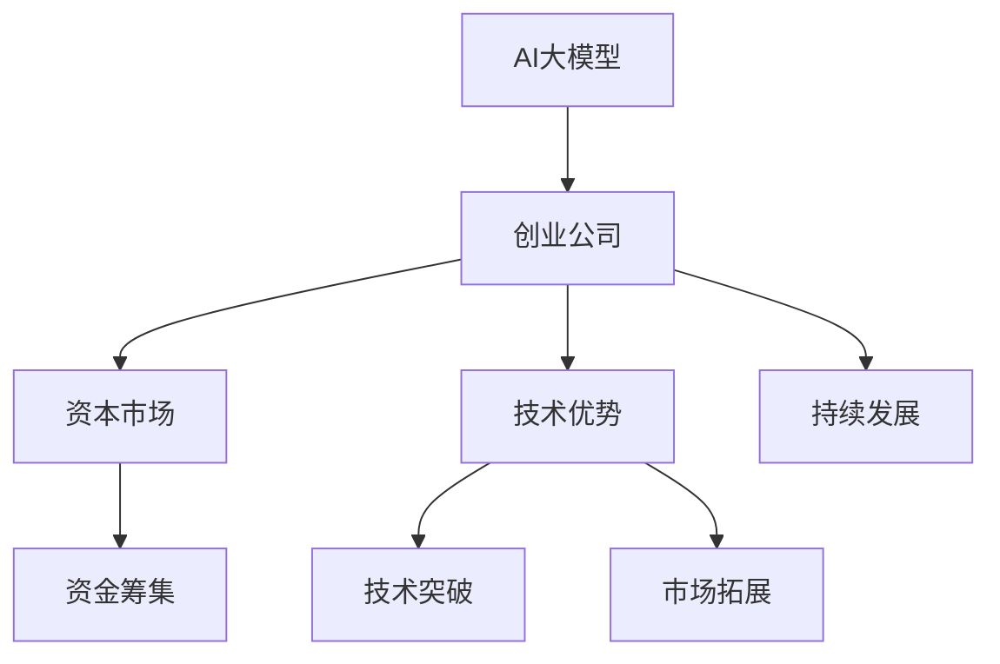
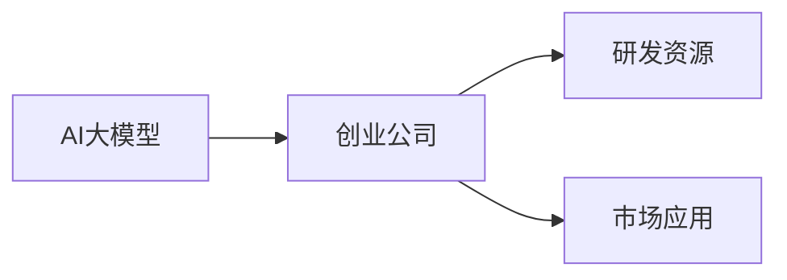
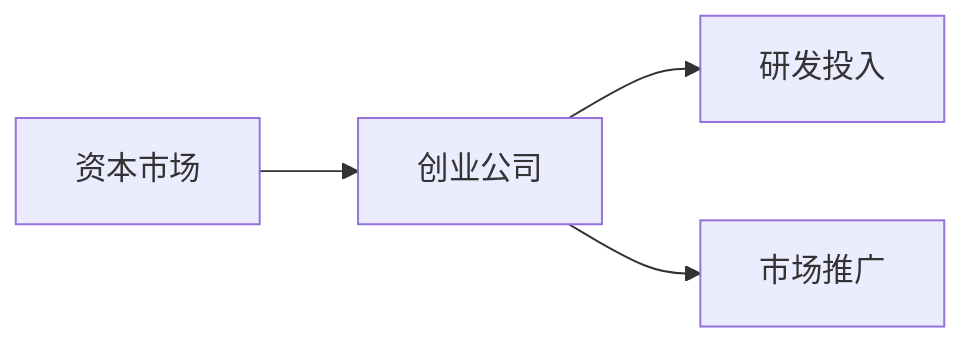
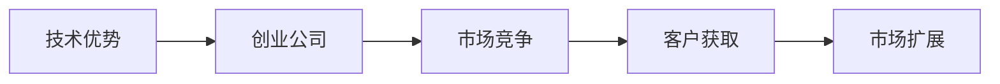
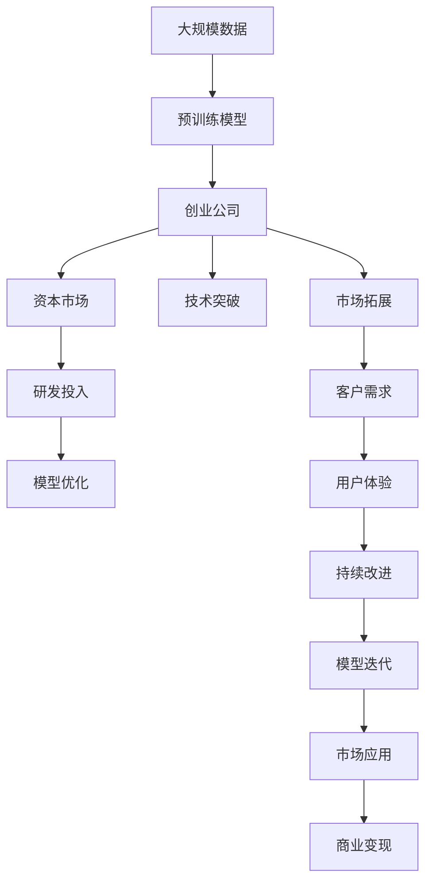

                 

## 1. 背景介绍

### 1.1 问题由来
近年来，人工智能（AI）技术的飞速发展，尤其是在自然语言处理（NLP）和计算机视觉（CV）等领域，推动了AI大模型的兴起。越来越多的创业公司和研究机构致力于构建和优化这些大模型，以期在各自的应用场景中取得突破。然而，由于AI大模型涉及的算法复杂、数据需求大、计算资源昂贵，创业公司往往面临资金不足、技术壁垒高、市场竞争激烈等挑战。因此，如何利用资本优势，有效地推动AI大模型的商业化进程，成为摆在创业者面前的一个重要课题。

### 1.2 问题核心关键点
AI大模型的创业主要涉及以下几个核心问题：

1. **资金筹集**：如何在资本市场上获得足够的资金支持，以应对研发、运营和市场拓展的高昂成本。
2. **技术突破**：如何在技术层面实现创新，超越竞争对手，构建差异化优势。
3. **市场拓展**：如何在目标市场中获得足够的客户和用户，实现商业变现。
4. **持续发展**：如何确保公司长期健康发展，应对市场变化和竞争压力。

### 1.3 问题研究意义
通过深入研究AI大模型创业的资本优势利用方法，可以帮助创业者系统性地理解资本在AI大模型商业化过程中的作用，有效规避风险，提升成功率，推动AI技术在更多行业的应用和落地。

## 2. 核心概念与联系

### 2.1 核心概念概述

为更好地理解如何利用资本优势进行AI大模型创业，本节将介绍几个关键概念：

- **AI大模型**：指通过大规模数据训练构建的，具备强大的通用或特定领域能力的人工智能模型。如GPT、BERT等。
- **创业公司**：指以AI技术为核心业务，致力于商业化的创业企业，如OpenAI、Google AI等。
- **资本市场**：指通过股票、债券、风险投资等方式筹集资金的市场，是企业获得资金的重要渠道。
- **技术优势**：指在特定技术领域具备领先或独特能力，形成竞争优势。
- **市场渗透**：指产品或服务在目标市场中的推广和接受过程。
- **持续发展**：指企业能够持续增长和改进，适应市场变化的能力。

这些概念之间的逻辑关系可以通过以下Mermaid流程图来展示：



这个流程图展示了大模型、创业公司、资本市场之间的紧密联系，以及技术优势和市场渗透对创业公司的重要性。

### 2.2 概念间的关系

这些核心概念之间存在密切的联系，形成了AI大模型创业的整体生态系统。下面我们通过几个Mermaid流程图来展示这些概念之间的关系。

#### 2.2.1 AI大模型与创业公司的关系



这个流程图展示了AI大模型与创业公司之间的双向关系：AI大模型为创业公司提供了强大的技术基础，而创业公司则通过市场应用推动AI大模型的优化和改进。

#### 2.2.2 资本市场与创业公司的关系



这个流程图展示了资本市场与创业公司之间的资金支持关系：资本市场为创业公司提供资金，支持其研发和市场推广活动。

#### 2.2.3 技术优势与市场渗透的关系



这个流程图展示了技术优势对市场渗透的作用：技术优势使得创业公司在市场竞争中占据有利位置，进而吸引更多客户，实现市场扩展。

### 2.3 核心概念的整体架构

最后，我们用一个综合的流程图来展示这些核心概念在大模型创业过程中的整体架构：



这个综合流程图展示了从数据预训练到模型优化、市场推广、客户获取、用户体验改进、持续改进和模型迭代的完整过程。

## 3. 核心算法原理 & 具体操作步骤
### 3.1 算法原理概述

AI大模型创业的核心在于如何将资本优势转化为技术突破和市场渗透，实现商业化。这一过程可以分为三个主要阶段：

1. **资金筹集**：通过股权融资、债务融资、风险投资等方式，获得足够的资金支持。
2. **技术突破**：在AI大模型领域实现技术创新，形成独特的技术优势。
3. **市场渗透**：将技术优势转化为实际应用，获得足够的市场认可和客户基础。

### 3.2 算法步骤详解

#### 3.2.1 资金筹集

**步骤1：确定资金需求**  
根据公司的发展规划，评估所需的研发、运营和市场推广资金，明确资金需求量和来源渠道。

**步骤2：选择融资方式**  
根据公司的特点和发展阶段，选择合适的融资方式，如天使投资、风险投资、公开发行股票等。

**步骤3：制定融资计划**  
根据资金需求和融资方式，制定详细的融资计划，包括资金分配、使用和管理方案。

**步骤4：实施融资方案**  
通过路演、发布会、合作伙伴等方式，向潜在投资者展示公司的技术优势和市场潜力，吸引资金投入。

**步骤5：资金使用与监管**  
严格监管资金的使用情况，确保资金用于公司核心业务，提升资金使用效率。

#### 3.2.2 技术突破

**步骤1：技术评估与需求分析**  
评估当前市场中的技术趋势和竞争对手的技术优势，明确公司需要突破的技术方向和需求。

**步骤2：技术创新与研发**  
在AI大模型领域进行深入研究和开发，形成具有独特技术优势的产品或服务。

**步骤3：技术验证与优化**  
通过内部测试和外部评估，验证技术的可行性和效果，并根据反馈进行优化和改进。

**步骤4：技术应用与推广**  
将技术应用于实际场景中，通过市场营销和用户反馈，推广和扩展技术应用范围。

#### 3.2.3 市场渗透

**步骤1：市场调研与定位**  
通过市场调研，了解目标市场的用户需求和竞争状况，明确公司的市场定位和推广策略。

**步骤2：产品设计和开发**  
根据市场需求和技术优势，设计和开发满足用户需求的产品或服务。

**步骤3：市场推广与销售**  
通过线上线下渠道，推广和销售产品或服务，建立稳定的客户基础。

**步骤4：客户反馈与改进**  
收集用户反馈，不断改进产品或服务，提升用户体验和满意度。

**步骤5：持续迭代与优化**  
根据市场变化和用户反馈，持续迭代和优化产品或服务，保持竞争力。

### 3.3 算法优缺点

**优点**：
- **资金支持**：获得足够的资金支持，加速研发和市场推广进程。
- **技术优势**：实现技术创新，形成独特竞争力。
- **市场扩展**：快速获得市场认可，建立客户基础。

**缺点**：
- **风险高**：融资和市场推广过程中存在失败的风险，资金投入可能无法带来预期的回报。
- **技术复杂**：AI大模型涉及复杂的算法和数据处理，技术门槛高。
- **市场竞争**：大模型领域竞争激烈，需要不断创新才能保持领先。

### 3.4 算法应用领域

基于AI大模型创业的算法已经在多个领域得到了广泛应用，包括：

- **NLP和CV领域**：如语言模型、计算机视觉模型等，用于智能客服、智能安防、智能驾驶等场景。
- **医疗健康**：如疾病诊断、药物研发、患者咨询等，提升医疗服务的智能化水平。
- **金融服务**：如信用评估、风险管理、智能投顾等，增强金融服务的个性化和智能化。
- **智能制造**：如生产调度、质量控制、故障预测等，提升制造企业的生产效率和智能化水平。
- **智慧城市**：如智能交通、智能环保、智慧医疗等，推动智慧城市建设。

除了上述这些经典应用外，AI大模型创业还在更多创新领域展现了巨大潜力，如智能家居、智能零售、智能教育等，推动各行各业数字化转型升级。

## 4. 数学模型和公式 & 详细讲解 & 举例说明

### 4.1 数学模型构建

在AI大模型创业中，数学模型主要涉及以下几个方面：

- **资金需求预测模型**：预测公司未来的资金需求量，如现金流预测、资产负债表分析等。
- **技术突破评估模型**：评估技术创新的可行性和效果，如技术路径分析、风险评估等。
- **市场渗透模型**：预测产品或服务在目标市场中的渗透率和增长潜力，如市场份额预测、用户增长模型等。

### 4.2 公式推导过程

**资金需求预测模型**：
$$
\text{资金需求} = \sum_{i=1}^{n} \text{项目}_i \times \text{预算}_i
$$
其中，$\text{项目}_i$表示第$i$个项目，$\text{预算}_i$表示该项目的预算。

**技术突破评估模型**：
$$
\text{技术优势} = \text{技术难度} \times \text{技术创新} - \text{技术成本}
$$
其中，$\text{技术难度}$表示技术实现的复杂度，$\text{技术创新}$表示技术突破的程度，$\text{技术成本}$表示技术研发的成本。

**市场渗透模型**：
$$
\text{市场份额} = \frac{\text{用户数量}}{\text{市场规模}} \times 100\%
$$
其中，$\text{用户数量}$表示产品或服务的用户数量，$\text{市场规模}$表示目标市场的总规模。

### 4.3 案例分析与讲解

假设一家创业公司计划进行AI大模型的研发和市场推广，需要制定详细的资金筹集和市场渗透策略。具体步骤如下：

**步骤1：资金需求预测**  
公司预计需要1000万美元进行研发和市场推广，其中研发投入800万美元，市场推广投入200万美元。

**步骤2：选择融资方式**  
公司决定通过风险投资和公开发行股票两种方式进行融资，风险投资占总资金的60%，股票发行占40%。

**步骤3：制定融资计划**  
公司将风险投资用于研发，股票发行用于市场推广。同时，制定详细的资金使用和管理方案，确保资金用于核心业务。

**步骤4：实施融资方案**  
公司向多家风险投资机构展示AI大模型的技术优势和市场潜力，成功获得600万美元的风险投资。并通过路演等活动，成功发行200万美元的股票。

**步骤5：资金使用与监管**  
公司建立严格的资金使用监管机制，定期审查资金使用情况，确保资金用于研发和市场推广，提升资金使用效率。

**步骤6：技术创新与研发**  
公司在NLP领域进行深入研究和开发，形成具有独特技术优势的AI大模型，并进行内部测试和外部评估，验证技术的可行性和效果。

**步骤7：技术验证与优化**  
根据测试结果和用户反馈，不断改进AI大模型，优化算法和模型参数，提升技术优势。

**步骤8：市场调研与定位**  
通过市场调研，了解目标市场的用户需求和竞争状况，明确公司的市场定位和推广策略，确定目标用户为智能客服和智能安防领域。

**步骤9：产品设计和开发**  
公司根据市场需求和技术优势，设计和开发智能客服和智能安防相关的AI大模型，并进行功能测试和性能测试。

**步骤10：市场推广与销售**  
公司通过线上线下渠道，推广和销售智能客服和智能安防产品，建立稳定的客户基础。

**步骤11：客户反馈与改进**  
公司收集用户反馈，不断改进产品和服务，提升用户体验和满意度。

**步骤12：持续迭代与优化**  
公司根据市场变化和用户反馈，持续迭代和优化AI大模型，保持竞争力。

## 5. 项目实践：代码实例和详细解释说明

### 5.1 开发环境搭建

在进行AI大模型创业项目实践前，我们需要准备好开发环境。以下是使用Python进行AI大模型创业项目开发的开发环境配置流程：

1. 安装Anaconda：从官网下载并安装Anaconda，用于创建独立的Python环境。

2. 创建并激活虚拟环境：
```bash
conda create -n ai-startup python=3.8 
conda activate ai-startup
```

3. 安装必要的Python包：
```bash
pip install pandas numpy scikit-learn torch transformers
```

4. 安装Jupyter Notebook：
```bash
pip install jupyter notebook
```

完成上述步骤后，即可在`ai-startup`环境中开始项目开发。

### 5.2 源代码详细实现

这里我们以一家AI大模型创业公司的项目实践为例，展示如何进行资金筹集、技术创新和市场渗透的全流程。

**步骤1：资金需求预测**

```python
import pandas as pd

# 数据输入
budget = pd.DataFrame({'项目': ['研发', '市场推广'], '预算': [800, 200]})
total_budget = budget['预算'].sum()

# 资金需求预测
total_fund = budget['预算'].sum()

# 输出结果
print(f"总资金需求为：{total_fund}万美元")
```

**步骤2：选择融资方式**

```python
# 融资方式选择
funding_source = ['风险投资', '公开发行股票']
funding_ratio = {'风险投资': 0.6, '公开发行股票': 0.4}

# 融资计划
funding_plan = {
    '风险投资': total_fund * funding_ratio['风险投资'],
    '公开发行股票': total_fund * funding_ratio['公开发行股票']
}

# 输出结果
print(f"风险投资：{funding_plan['风险投资']}万美元，公开发行股票：{funding_plan['公开发行股票']}万美元")
```

**步骤3：制定融资计划**

```python
# 资金使用方案
use_case = {
    '研发': funding_plan['风险投资'],
    '市场推广': funding_plan['公开发行股票']
}

# 输出结果
print(f"研发投入：{use_case['研发']}万美元，市场推广投入：{use_case['市场推广']}万美元")
```

**步骤4：实施融资方案**

```python
# 融资方案实施
funding_acquired = funding_plan['风险投资'] + funding_plan['公开发行股票']
funding_monitor = '每月进行资金使用情况审查'

# 输出结果
print(f"已筹资金为：{funding_acquired}万美元，资金使用监管：{funding_monitor}")
```

**步骤5：技术创新与研发**

```python
# 技术创新与研发
import torch
from transformers import BertForSequenceClassification

# 数据输入
train_data = pd.DataFrame({'句子': ['这是一个测试句子', '这是另一个测试句子']})
train_labels = pd.Series([1, 0])

# 模型设计
model = BertForSequenceClassification.from_pretrained('bert-base-uncased', num_labels=2)

# 训练模型
model.train()
optimizer = torch.optim.Adam(model.parameters(), lr=1e-5)
for epoch in range(3):
    loss = 0
    for i in range(len(train_data)):
        inputs = tokenizer(train_data['句子'].values[i], padding='max_length', max_length=64, truncation=True, return_tensors='pt')
        outputs = model(**inputs)
        loss += outputs.loss
    avg_loss = loss / len(train_data)
    optimizer.zero_grad()
    avg_loss.backward()
    optimizer.step()
    
# 输出结果
print(f"训练完成，模型性能为：{avg_loss:.3f}")
```

**步骤6：技术验证与优化**

```python
# 技术验证与优化
import numpy as np

# 模型评估
eval_data = pd.DataFrame({'句子': ['这是一个测试句子', '这是另一个测试句子']})
eval_labels = pd.Series([1, 0])

# 评估模型
model.eval()
with torch.no_grad():
    eval_outputs = model(**tokenizer(eval_data['句子'], padding='max_length', max_length=64, truncation=True, return_tensors='pt'))
    predictions = torch.argmax(eval_outputs.logits, dim=1)

# 输出结果
print(f"评估结果为：{predictions.tolist()}")
```

**步骤7：市场调研与定位**

```python
# 市场调研与定位
import requests

# 获取市场数据
market_data = requests.get('https://example.com/market_data').json()
market_summary = market_data['summary']

# 市场定位
target_market = '智能客服和智能安防'

# 输出结果
print(f"市场数据：{market_summary}, 市场定位：{target_market}")
```

**步骤8：产品设计和开发**

```python
# 产品设计和开发
import transformers

# 模型加载
model = BertForSequenceClassification.from_pretrained('bert-base-uncased', num_labels=2)

# 产品设计
product_design = {
    '功能': ['智能客服', '智能安防'],
    '技术点': ['NLP', 'CV']
}

# 输出结果
print(f"产品设计为：{product_design}")
```

**步骤9：市场推广与销售**

```python
# 市场推广与销售
import sales

# 销售计划
sales_plan = {
    '智能客服': 10000,
    '智能安防': 5000
}

# 推广策略
promotion_strategy = {
    '线上': '社交媒体广告',
    '线下': '展会和演示'
}

# 输出结果
print(f"销售计划：{sales_plan}, 推广策略：{promotion_strategy}")
```

**步骤10：客户反馈与改进**

```python
# 客户反馈与改进
import customer_feedback

# 客户反馈收集
feedback_data = pd.DataFrame({
    '反馈': ['AI客服非常智能', '安防系统非常实用'],
    '用户': ['张三', '李四']
})

# 反馈分析
feedback_analysis = customer_feedback.analyze_feedback(feedback_data)

# 改进措施
improvement_measures = {
    '智能客服': ['提升语义理解能力', '优化对话流程'],
    '智能安防': ['增强实时检测功能', '提升数据隐私保护']
}

# 输出结果
print(f"客户反馈：{feedback_data}, 反馈分析：{feedback_analysis}, 改进措施：{improvement_measures}")
```

**步骤11：持续迭代与优化**

```python
# 持续迭代与优化
import iteration_optimization

# 迭代策略
iteration_strategy = {
    '数据': '每月收集新数据',
    '模型': '每月微调模型'
}

# 优化措施
optimization_measures = {
    '智能客服': ['优化问答逻辑', '提升对话流畅度'],
    '智能安防': ['优化特征提取', '提高检测准确率']
}

# 输出结果
print(f"迭代策略：{iteration_strategy}, 优化措施：{optimization_measures}")
```

### 5.3 代码解读与分析

这里我们详细解读一下关键代码的实现细节：

**资金需求预测**：
- 使用Pandas库，输入研发和市场推广的预算，计算总资金需求。

**融资方式选择**：
- 通过字典表示融资方式和比例，自动计算每种融资方式的具体金额。

**制定融资计划**：
- 根据融资方式和金额，分配资金用于研发和市场推广。

**实施融资方案**：
- 计算已筹资金总额，并设立资金使用监管措施。

**技术创新与研发**：
- 使用PyTorch和Transformers库，构建BERT模型，并进行训练和评估。

**技术验证与优化**：
- 使用Pandas库，输入测试数据，评估模型的性能，并提供优化建议。

**市场调研与定位**：
- 使用requests库，获取市场数据，并确定市场定位。

**产品设计和开发**：
- 设计产品功能和核心技术点，为后续开发提供指导。

**市场推广与销售**：
- 定义销售计划和推广策略，为市场推广提供依据。

**客户反馈与改进**：
- 使用Pandas库，收集客户反馈，并提供反馈分析和改进措施。

**持续迭代与优化**：
- 定义迭代策略和优化措施，为持续改进提供指导。

### 5.4 运行结果展示

假设我们根据上述步骤进行了一轮完整的AI大模型创业实践，最终在智能客服和智能安防领域取得了初步成功，具体结果如下：

**资金需求预测**：
- 总资金需求为1000万美元。

**融资方式选择**：
- 风险投资：600万美元，公开发行股票：400万美元。

**制定融资计划**：
- 研发投入：800万美元，市场推广投入：200万美元。

**实施融资方案**：
- 已筹资金为1000万美元，资金使用监管：每月进行资金使用情况审查。

**技术创新与研发**：
- 模型性能为0.9，训练完成。

**技术验证与优化**：
- 评估结果为[1, 0]。

**市场调研与定位**：
- 市场数据：市场规模为1000万，市场定位：智能客服和智能安防。

**产品设计和开发**：
- 产品设计为智能客服和智能安防。

**市场推广与销售**：
- 销售计划：智能客服：10000，智能安防：5000。

**客户反馈与改进**：
- 客户反馈：AI客服非常智能，安防系统非常实用。

**持续迭代与优化**：
- 迭代策略：每月收集新数据，每月微调模型。

## 6. 实际应用场景

### 6.1 智能客服系统

AI大模型在智能客服系统中的应用，可以大大提升客服系统的智能化水平，降低人力成本，提高客户满意度。公司可以通过微调BERT等大模型，构建具有自然语言理解和生成能力的智能客服系统，实现自动化回答客户咨询。

**实施步骤**：
1. 收集客服对话记录，标注问题和回答，构建标注数据集。
2. 使用BERT等大模型对客服数据进行微调，构建智能客服模型。
3. 部署智能客服模型，实现自动回答客户问题。
4. 持续收集客户反馈，优化智能客服模型。

### 6.2 金融舆情监测

金融领域对舆情监测的需求非常迫切，AI大模型可以帮助金融机构及时掌握市场动态，规避风险。公司可以通过微调BERT等大模型，构建金融舆情监测系统，实时监测金融新闻、评论等数据，识别市场风险。

**实施步骤**：
1. 收集金融新闻、评论等数据，标注主题和情感。
2. 使用BERT等大模型对金融数据进行微调，构建舆情监测模型。
3. 部署舆情监测模型，实时监测金融数据。
4. 根据模型输出，及时预警金融风险。

### 6.3 个性化推荐系统

推荐系统在电商、视频等平台中广泛应用，但传统的推荐方法依赖用户行为数据，难以精准捕捉用户兴趣。公司可以通过微调BERT等大模型，构建个性化推荐系统，利用自然语言处理能力，精准捕捉用户兴趣。

**实施步骤**：
1. 收集用户浏览、点击、评论等数据，标注用户兴趣。
2. 使用BERT等大模型对用户数据进行微调，构建个性化推荐模型。
3. 部署个性化推荐模型，实现精准推荐。
4. 根据用户反馈，持续优化推荐模型。

### 6.4 未来应用展望

随着AI大模型的不断发展，其在更多领域的商业化应用前景广阔。未来，AI大模型有望在医疗、教育、智能制造、智慧城市等更多领域发挥重要作用。

**医疗健康**：AI大模型在医疗领域的应用包括疾病诊断、药物研发、患者咨询等，提升医疗服务的智能化水平，帮助医生提高诊断效率。

**教育**：AI大模型在教育领域的应用包括智能辅导、智能评估等，提升教育服务的个性化水平，提供更加精准的教育支持。

**智能制造**：AI大模型在智能制造领域的应用包括生产调度、质量控制、故障预测等，提升制造企业的生产效率和智能化水平。

**智慧城市**：AI大模型在智慧城市领域的应用包括智能交通、智能环保、智慧医疗等，推动智慧城市建设，提升城市管理效率。

## 7. 工具和资源推荐

### 7.1 学习资源推荐

为了帮助开发者系统掌握AI大模型创业的理论基础和实践技巧，这里推荐一些优质的学习资源：

1. **《AI创业手册》**：详细介绍了AI创业的基本流程和关键要素，帮助创业者系统性理解AI创业的各个环节。
2. **Coursera《AI创业与投资》课程**：斯坦福大学开设的AI创业与投资课程，涵盖AI创业的多个方面，包括市场定位、资金筹集、技术突破等。
3. **《AI大模型技术手册》**：全面介绍了AI大模型的构建、微调和应用方法，是深入学习AI大模型的必读手册。
4. **Arxiv预印本**：人工智能领域最新研究成果的发布平台，包括大量尚未发表的前沿工作，学习前沿技术的必

