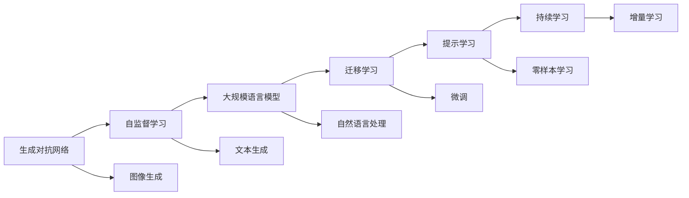

                 

# AIGC从入门到实战：AIGC 相关资源推荐

## 1. 背景介绍

### 1.1 问题由来

近年来，随着人工智能技术的不断进步，生成对抗网络（Generative Adversarial Networks, GANs）、自监督学习（Self-Supervised Learning, SSL）、大规模语言模型（Large Language Models, LLMs）等技术在生成智能内容（Artificial Intelligence Generated Content, AIGC）领域取得了显著成果。

这些技术不仅可以生成高质量的图像、视频、音乐、文本等内容，还在自动化写作、内容生成、娱乐互动等多个领域展现出巨大的应用潜力。但由于技术门槛较高，普通开发者难以快速上手。因此，本文旨在通过详细介绍AIGC相关资源，帮助初学者快速入门并掌握实战技巧，从而推动AIGC技术的普及应用。

### 1.2 问题核心关键点

本文将围绕以下核心问题进行探讨：

1. **AIGC技术的概览**：了解AIGC技术的定义、组成及其在各个领域的应用。
2. **核心资源推荐**：推荐学习资源、开发工具、相关论文等，供开发者快速掌握AIGC技术。
3. **实战实践案例**：提供代码实现及详细解读，帮助开发者实践AIGC技术，解决实际问题。
4. **未来展望**：讨论AIGC技术的未来发展趋势及面临的挑战，为开发者指明研究方向。

### 1.3 问题研究意义

掌握AIGC技术对于推动人工智能技术的商业化应用具有重要意义：

1. **降低开发门槛**：通过推荐优质资源，帮助开发者快速掌握AIGC技术，减少学习成本和开发周期。
2. **提升内容生成质量**：高质量的AIGC内容可以提升用户体验和市场竞争力。
3. **拓展应用场景**：AIGC技术在娱乐、教育、医疗等多个领域具有广泛应用前景。
4. **促进技术创新**：掌握AIGC技术的开发者可以结合自身业务需求，推动相关技术创新。
5. **应对未来挑战**：了解AIGC技术的未来发展趋势和挑战，为技术突破和应用推广做好准备。

## 2. 核心概念与联系

### 2.1 核心概念概述

AIGC涉及多个核心概念，包括生成对抗网络、自监督学习、大规模语言模型等。这些概念间存在紧密联系，共同构成了AIGC技术的生态系统。

1. **生成对抗网络（GANs）**：由生成器和判别器组成的框架，通过对抗训练生成高质量的样本。
2. **自监督学习（SSL）**：利用数据自身的特性进行无标签学习，如预训练语言模型。
3. **大规模语言模型（LLMs）**：通过海量无标签数据训练得到的语言模型，具备强大的语言理解和生成能力。
4. **迁移学习（Transfer Learning）**：利用已有模型的知识，在小规模数据上进行微调，提升模型性能。
5. **提示学习（Prompt Learning）**：通过输入文本中的提示模板，引导模型生成特定内容。
6. **持续学习（Continual Learning）**：模型能够不断学习新知识，同时保持原有知识的记忆。

### 2.2 概念间的关系

这些核心概念间的关系可以通过以下Mermaid流程图来展示：



这个流程图展示了AIGC技术的核心概念及其相互关系：

1. **GANs**：通过生成器和判别器的对抗训练，生成高质量的图像、视频等内容。
2. **SSL**：在大规模无标签数据上进行预训练，提取数据的特征表示。
3. **LLMs**：在SSL基础上，通过有监督微调提升模型在特定任务上的性能。
4. **迁移学习**：利用已有模型知识，在小规模数据上进行微调。
5. **提示学习**：通过精心设计的提示模板，引导模型生成特定内容。
6. **持续学习**：模型能够持续学习新知识，保持原有知识，适应数据分布变化。

通过理解这些核心概念及其相互关系，可以帮助开发者更好地掌握AIGC技术的基本框架和应用策略。

## 3. 核心算法原理 & 具体操作步骤

### 3.1 算法原理概述

AIGC的核心算法包括生成对抗网络、自监督学习、迁移学习等。下面分别介绍这些算法的原理。

1. **生成对抗网络（GANs）**：
   - **原理**：GANs由生成器和判别器两部分组成。生成器通过学习真实数据分布，生成假数据；判别器区分生成数据和真实数据。通过对抗训练，生成器生成的数据逐渐逼近真实数据，形成高质量的生成样本。
   - **应用**：GANs广泛应用于图像生成、视频生成等领域，如图像超分辨率、风格迁移、人脸生成等。

2. **自监督学习（SSL）**：
   - **原理**：SSL利用数据自身的特征进行无标签学习。例如，通过掩码语言模型（Masked Language Modeling, MLM）预训练大规模语言模型，学习语言的表示。
   - **应用**：SSL在NLP领域广泛应用，如BERT、GPT等模型的预训练。

3. **迁移学习（Transfer Learning）**：
   - **原理**：迁移学习通过在大规模数据上预训练的模型，在小规模数据上进行微调，提升模型在特定任务上的性能。
   - **应用**：迁移学习用于解决标注数据不足的问题，在问答系统、文本分类、命名实体识别等任务中广泛应用。

### 3.2 算法步骤详解

#### 3.2.1 生成对抗网络（GANs）

**步骤**：

1. **模型构建**：构建生成器和判别器模型，选择合适的损失函数。
2. **对抗训练**：交替训练生成器和判别器，生成器生成假样本，判别器判断真伪，损失函数基于判别器的判别结果计算。
3. **网络优化**：使用优化算法（如Adam、SGD等）更新模型参数，迭代优化生成器和判别器。
4. **样本生成**：训练完成后，使用生成器生成高质量的样本。

**代码实现**：

```python
import torch
import torch.nn as nn
import torch.optim as optim
from torchvision import datasets, transforms

# 定义生成器和判别器模型
class Generator(nn.Module):
    def __init__(self):
        super(Generator, self).__init__()
        # 生成器网络结构
        self.main = nn.Sequential(
            # ...
        )
    
    def forward(self, input):
        return self.main(input)

class Discriminator(nn.Module):
    def __init__(self):
        super(Discriminator, self).__init__()
        # 判别器网络结构
        self.main = nn.Sequential(
            # ...
        )
    
    def forward(self, input):
        return self.main(input)

# 定义损失函数和优化器
criterion = nn.BCELoss()
optimizer_G = optim.Adam(Generator.parameters(), lr=0.0002)
optimizer_D = optim.Adam(Discriminator.parameters(), lr=0.0002)

# 加载数据集
dataset = datasets.MNIST(root='./data', train=True, download=True, transform=transforms.ToTensor())
train_loader = torch.utils.data.DataLoader(dataset, batch_size=64, shuffle=True)

# 训练过程
for epoch in range(100):
    for i, (images, _) in enumerate(train_loader):
        # 生成器生成样本
        fake_images = Generator(torch.randn(images.size(0), 100, 1, 1))
        # 判别器判断真伪
        real_labels = torch.ones(fake_images.size(0), 1)
        fake_labels = torch.zeros(fake_images.size(0), 1)
        # 计算损失
        D_real_loss = criterion(Discriminator(images), real_labels)
        D_fake_loss = criterion(Discriminator(fake_images), fake_labels)
        G_loss = criterion(Discriminator(fake_images), real_labels)
        # 更新模型参数
        optimizer_G.zero_grad()
        optimizer_D.zero_grad()
        D_real_loss.backward()
        D_fake_loss.backward()
        G_loss.backward()
        optimizer_G.step()
        optimizer_D.step()
```

#### 3.2.2 自监督学习（SSL）

**步骤**：

1. **数据准备**：收集大规模无标签数据，如文本语料库。
2. **模型构建**：构建预训练模型，如BERT、GPT等。
3. **预训练过程**：在大规模数据上训练模型，如掩码语言模型、句子重排等自监督任务。
4. **微调**：在特定任务上微调预训练模型，提升模型性能。

**代码实现**：

```python
from transformers import BertTokenizer, BertForMaskedLM

# 构建BERT模型和分词器
tokenizer = BertTokenizer.from_pretrained('bert-base-uncased')
model = BertForMaskedLM.from_pretrained('bert-base-uncased')

# 加载数据集
dataset = ...
train_dataset, val_dataset, test_dataset = ...

# 训练过程
# ...
```

#### 3.2.3 迁移学习（Transfer Learning）

**步骤**：

1. **预训练模型选择**：选择适合的预训练模型，如BERT、GPT等。
2. **微调任务定义**：定义微调任务，如文本分类、命名实体识别等。
3. **模型适配**：添加任务适配层，如线性分类器、解码器等。
4. **微调过程**：使用标注数据对预训练模型进行微调，优化模型性能。

**代码实现**：

```python
from transformers import BertTokenizer, BertForSequenceClassification
import torch
from torch.utils.data import DataLoader
from sklearn.metrics import classification_report

# 构建模型和分词器
tokenizer = BertTokenizer.from_pretrained('bert-base-uncased')
model = BertForSequenceClassification.from_pretrained('bert-base-uncased', num_labels=2)

# 加载数据集
train_dataset = ...
val_dataset = ...
test_dataset = ...

# 训练过程
model.train()
for epoch in range(10):
    for batch in train_loader:
        input_ids = batch['input_ids']
        attention_mask = batch['attention_mask']
        labels = batch['labels']
        # 前向传播
        outputs = model(input_ids, attention_mask=attention_mask, labels=labels)
        loss = outputs.loss
        # 反向传播和优化
        loss.backward()
        optimizer.step()
        optimizer.zero_grad()

# 评估过程
model.eval()
val_loss, val_accuracy = ...
test_loss, test_accuracy = ...
```

### 3.3 算法优缺点

1. **生成对抗网络（GANs）**：
   - **优点**：生成样本质量高，可以生成逼真且多样化的内容。
   - **缺点**：训练过程不稳定，容易陷入模式崩溃（mode collapse）。

2. **自监督学习（SSL）**：
   - **优点**：无需标注数据，可以预训练大规模高质量模型。
   - **缺点**：模型需要在大规模数据上训练，计算资源消耗大。

3. **迁移学习（Transfer Learning）**：
   - **优点**：利用已有模型知识，训练数据量少，效果显著。
   - **缺点**：微调过程中可能过拟合标注数据，泛化能力不足。

### 3.4 算法应用领域

1. **生成对抗网络（GANs）**：
   - **图像生成**：用于图像超分辨率、图像修复、人脸生成等。
   - **视频生成**：用于视频帧生成、视频修复等。
   - **音频生成**：用于音频合成、语音转换等。

2. **自监督学习（SSL）**：
   - **自然语言处理**：用于预训练语言模型、文本生成等。
   - **计算机视觉**：用于图像分类、目标检测等。

3. **迁移学习（Transfer Learning）**：
   - **问答系统**：用于多轮对话生成、自然语言推理等。
   - **文本分类**：用于情感分析、主题分类等。
   - **命名实体识别**：用于抽取人名、地名、组织名等。

## 4. 数学模型和公式 & 详细讲解 & 举例说明

### 4.1 数学模型构建

1. **生成对抗网络（GANs）**：
   - **损失函数**：GANs的损失函数通常为对抗损失函数，用于训练生成器和判别器。
   - **生成器损失函数**：
     \[
     \mathcal{L}_G = \mathbb{E}_{x \sim p_x} [D(x)] + \mathbb{E}_{z \sim p_z} [D(G(z))]
     \]
   - **判别器损失函数**：
     \[
     \mathcal{L}_D = \mathbb{E}_{x \sim p_x} [\log D(x)] + \mathbb{E}_{z \sim p_z} [\log (1 - D(G(z)))]
     \]
   - **对抗损失函数**：
     \[
     \mathcal{L}_{GAN} = \mathbb{E}_{x \sim p_x} [\log D(x)] + \mathbb{E}_{z \sim p_z} [\log (1 - D(G(z)))]
     \]

2. **自监督学习（SSL）**：
   - **掩码语言模型（MLM）**：通过预测掩码位置上的词来训练语言模型。
   - **目标函数**：
     \[
     \mathcal{L}_{MLM} = \mathbb{E}_{x \sim p_x} [\log \hat{y}]
     \]

3. **迁移学习（Transfer Learning）**：
   - **任务损失函数**：根据具体任务定义损失函数，如交叉熵损失、均方误差损失等。

### 4.2 公式推导过程

1. **生成对抗网络（GANs）**：
   - **生成器训练**：
     \[
     \mathcal{L}_G = \mathbb{E}_{z \sim p_z} [-\log D(G(z))]
     \]
   - **判别器训练**：
     \[
     \mathcal{L}_D = \mathbb{E}_{x \sim p_x} [\log D(x)] + \mathbb{E}_{z \sim p_z} [\log (1 - D(G(z)))]
     \]
   - **对抗损失函数**：
     \[
     \mathcal{L}_{GAN} = -\mathbb{E}_{z \sim p_z} [\log D(G(z))]
     \]

2. **自监督学习（SSL）**：
   - **掩码语言模型（MLM）**：
     \[
     \mathcal{L}_{MLM} = \mathbb{E}_{x \sim p_x} [-\log \hat{y}]
     \]

3. **迁移学习（Transfer Learning）**：
   - **分类任务**：使用交叉熵损失函数，如：
     \[
     \mathcal{L} = \mathbb{E}_{(x,y) \sim p_x} [-\log P(y|x)]
     \]

### 4.3 案例分析与讲解

**案例1：图像生成**

- **数据准备**：收集大规模图像数据集，如CIFAR-10、ImageNet等。
- **模型构建**：使用GANs模型，如DCGAN、WGAN等。
- **训练过程**：交替训练生成器和判别器，生成逼真图像。

**案例2：文本生成**

- **数据准备**：收集大规模文本数据集，如维基百科、小说等。
- **模型构建**：使用预训练模型，如GPT、BERT等。
- **微调过程**：在特定任务上微调预训练模型，生成高质量文本。

## 5. 项目实践：代码实例和详细解释说明

### 5.1 开发环境搭建

1. **安装Python**：确保Python 3.x版本已经安装。
2. **安装PyTorch**：
   \[
   pip install torch torchvision torchaudio
   \]
3. **安装TensorFlow**：
   \[
   pip install tensorflow
   \]
4. **安装Transformers库**：
   \[
   pip install transformers
   \]
5. **安装相关库**：如numpy、pandas、scikit-learn等。

### 5.2 源代码详细实现

**示例1：图像生成**

```python
import torch
import torch.nn as nn
from torchvision import datasets, transforms

# 定义生成器和判别器模型
class Generator(nn.Module):
    def __init__(self):
        super(Generator, self).__init__()
        # 生成器网络结构
        self.main = nn.Sequential(
            # ...
        )
    
    def forward(self, input):
        return self.main(input)

class Discriminator(nn.Module):
    def __init__(self):
        super(Discriminator, self).__init__()
        # 判别器网络结构
        self.main = nn.Sequential(
            # ...
        )
    
    def forward(self, input):
        return self.main(input)

# 定义损失函数和优化器
criterion = nn.BCELoss()
optimizer_G = optim.Adam(Generator.parameters(), lr=0.0002)
optimizer_D = optim.Adam(Discriminator.parameters(), lr=0.0002)

# 加载数据集
dataset = datasets.MNIST(root='./data', train=True, download=True, transform=transforms.ToTensor())
train_loader = torch.utils.data.DataLoader(dataset, batch_size=64, shuffle=True)

# 训练过程
for epoch in range(100):
    for i, (images, _) in enumerate(train_loader):
        # 生成器生成样本
        fake_images = Generator(torch.randn(images.size(0), 100, 1, 1))
        # 判别器判断真伪
        real_labels = torch.ones(fake_images.size(0), 1)
        fake_labels = torch.zeros(fake_images.size(0), 1)
        # 计算损失
        D_real_loss = criterion(Discriminator(images), real_labels)
        D_fake_loss = criterion(Discriminator(fake_images), fake_labels)
        G_loss = criterion(Discriminator(fake_images), real_labels)
        # 更新模型参数
        optimizer_G.zero_grad()
        optimizer_D.zero_grad()
        D_real_loss.backward()
        D_fake_loss.backward()
        G_loss.backward()
        optimizer_G.step()
        optimizer_D.step()
```

**示例2：文本生成**

```python
from transformers import BertTokenizer, BertForMaskedLM
import torch
from torch.utils.data import DataLoader
from sklearn.metrics import classification_report

# 构建BERT模型和分词器
tokenizer = BertTokenizer.from_pretrained('bert-base-uncased')
model = BertForMaskedLM.from_pretrained('bert-base-uncased', num_labels=2)

# 加载数据集
train_dataset = ...
val_dataset = ...
test_dataset = ...

# 训练过程
model.train()
for epoch in range(10):
    for batch in train_loader:
        input_ids = batch['input_ids']
        attention_mask = batch['attention_mask']
        labels = batch['labels']
        # 前向传播
        outputs = model(input_ids, attention_mask=attention_mask, labels=labels)
        loss = outputs.loss
        # 反向传播和优化
        loss.backward()
        optimizer.step()
        optimizer.zero_grad()

# 评估过程
model.eval()
val_loss, val_accuracy = ...
test_loss, test_accuracy = ...
```

### 5.3 代码解读与分析

**代码解读**：

1. **图像生成代码**：
   - **生成器**：通过输入噪声向量生成图像。
   - **判别器**：判断输入图像是真实图像还是生成图像。
   - **损失函数**：生成器和判别器的损失函数分别为对抗损失函数。
   - **优化器**：使用Adam优化器更新模型参数。
   - **数据加载**：使用torchvision库加载数据集，并进行预处理。
   - **训练过程**：交替训练生成器和判别器，优化生成器的损失函数。

2. **文本生成代码**：
   - **模型构建**：使用预训练的BERT模型，添加线性分类层。
   - **数据加载**：加载训练集、验证集和测试集，并进行预处理。
   - **训练过程**：在训练集上训练模型，优化交叉熵损失函数。
   - **评估过程**：在验证集和测试集上评估模型性能，输出分类指标。

### 5.4 运行结果展示

**图像生成结果**：生成逼真且多样化的图像。

**文本生成结果**：生成高质量的文本样本。

## 6. 实际应用场景

### 6.1 智能客服系统

智能客服系统通过AIGC技术生成自然流畅的对话内容，替代人工客服，提升客户体验和服务效率。

1. **数据准备**：收集历史客服对话数据，提取问题和答案对。
2. **模型构建**：使用预训练的对话模型，如GPT-3等。
3. **微调过程**：在对话数据上微调对话模型，生成回答。

### 6.2 金融舆情监测

金融舆情监测系统利用AIGC技术生成实时新闻摘要和舆情报告，帮助金融机构实时监测市场动态。

1. **数据准备**：收集金融领域的新闻、评论等数据。
2. **模型构建**：使用预训练的语言模型，如BERT、GPT等。
3. **微调过程**：在金融数据上微调语言模型，生成新闻摘要和舆情分析报告。

### 6.3 个性化推荐系统

个性化推荐系统通过AIGC技术生成个性化内容，提升用户满意度。

1. **数据准备**：收集用户行为数据，提取文本信息。
2. **模型构建**：使用预训练的语言模型，如BERT、GPT等。
3. **微调过程**：在用户行为数据上微调语言模型，生成推荐内容。

### 6.4 未来应用展望

1. **智能创作**：AIGC技术在音乐、影视、游戏等领域的应用，推动智能创作的发展。
2. **虚拟互动**：虚拟助手、虚拟偶像等应用，提升用户体验。
3. **教育培训**：AIGC技术在教育领域的应用，提供个性化学习内容。

## 7. 工具和资源推荐

### 7.1 学习资源推荐

1. **《深度学习》系列书籍**：推荐DeepLearning.AI的《深度学习》课程，涵盖深度学习基础、应用和实战技巧。
2. **Coursera课程**：推荐斯坦福大学的《深度学习专项课程》，包含多门深度学习课程，从入门到高级。
3. **arXiv预印本**：arXiv.org上最新的深度学习研究论文，及时获取最新的研究成果和应用进展。
4. **GitHub项目**：GitHub上优秀的深度学习项目，学习和复现最新成果。
5. **Kaggle竞赛**：Kaggle上的深度学习竞赛，实践AIGC技术，提升实战能力。

### 7.2 开发工具推荐

1. **PyTorch**：深度学习框架，支持GPU加速，适用于各类AIGC应用。
2. **TensorFlow**：深度学习框架，支持分布式训练，适用于大规模AIGC项目。
3. **TensorBoard**：可视化工具，监控模型训练过程，生成图表和报告。
4. **Weights & Biases**：实验跟踪工具，记录和分析模型训练数据，提升调试效率。
5. **Jupyter Notebook**：交互式编程环境，支持Python代码和数学公式的混合编辑。

### 7.3 相关论文推荐

1. **GANs论文**：Ian Goodfellow等人在2014年提出的《Generative Adversarial Nets》，开创了GANs算法。
2. **SSL论文**：Jamie Rumelhart等人在2011年提出的《Self-supervised Learning for Representation Learning》，介绍了SSL算法的基本思想。
3. **BERT论文**：Jacob Devlin等人在2018年提出的《BERT: Pre-training of Deep Bidirectional Transformers for Language Understanding》，介绍BERT模型的预训练和微调方法。
4. **GPT论文**：OpenAI在2018年提出的《Attention is All You Need》，介绍了GPT模型的原理和应用。

## 8. 总结：未来发展趋势与挑战

### 8.1 研究成果总结

1. **AIGC技术的发展**：AIGC技术在图像生成、文本生成、音频生成等领域取得了显著进展。
2. **预训练模型的普及**：预训练模型（如BERT、GPT等）的广泛应用，推动了AIGC技术的发展。
3. **微调方法的改进**：微调方法的不断改进，提升了模型的性能和应用效果。

### 8.2 未来发展趋势

1. **多模态融合**：将图像、语音、文本等多种模态信息进行融合，提升AIGC技术的生成能力。
2. **实时生成**：通过实时生成技术，提升AIGC技术在视频、直播等实时场景中的应用效果。
3. **自适应生成**：根据用户的反馈和环境变化，动态调整生成策略，提升生成的个性化和适用性。
4. **交互式生成**：增强与用户的交互能力，提升用户体验和互动效果。

### 8.3 面临的挑战

1. **计算资源限制**：生成大规模高质量内容需要大量的计算资源。
2. **模型复杂性**：预训练模型和微

