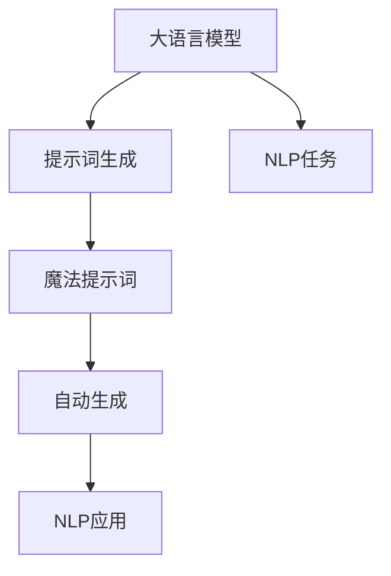

                 

# AIGC从入门到实战：进阶：魔法打败魔法，让 AI 自动生成提示词

> 关键词：AIGC,提示词生成,魔法提示词,自动生成,自然语言处理(NLP),大语言模型

## 1. 背景介绍

### 1.1 问题由来

在人工智能快速发展的今天，自然语言处理（NLP）技术已经成为了一个炙手可热的研究方向。然而，即便是技术手段再先进，也难以完全替代人类丰富的语言理解和生成能力。这便导致了在人工智能生成内容（AIGC）领域，仍然存在着许多需要人类直觉和创造力来辅助完成的任务。其中，提示词生成（Prompt Engineering）就是一项关键而富有挑战性的任务。

提示词生成是指在生成自然语言内容时，通过精心设计提示词，引导人工智能模型按照期望的方式生成内容。这一过程，就好像是在魔法世界里，魔法师通过念出特定的咒语，让魔法生物按照既定的规则执行任务。在AIGC领域，提示词生成则能够让AI在几乎不增加额外模型参数的情况下，实现从零到一的语言生成，从而极大地降低了训练成本，提高了生成内容的准确性和多样性。

### 1.2 问题核心关键点

提示词生成的主要挑战在于如何设计有效的提示词，以及如何平衡模型的生成能力和内容质量。一个有效的提示词，应该能够清晰地传达用户的意图，同时又不限制AI的创造性。因此，提示词生成的核心在于用户与AI之间的“魔法交互”，即通过良好的互动，让AI能够在用户的指引下，创造出既符合预期又富有创新性的内容。

当前，提示词生成技术已经在问答系统、文本摘要、创意写作、代码生成等多个NLP任务中得到了广泛应用。它不仅能提升生成内容的效率和质量，还能拓展AI在更多实际场景中的应用。

### 1.3 问题研究意义

提示词生成技术对于提升AIGC系统的性能和实用性具有重要意义：

1. **降低训练成本**：无需对模型进行大规模微调，通过合适的提示词设计，即可快速生成高质量内容。
2. **提升生成质量**：合理的提示词能够引导模型生成更符合用户需求的内容，避免生成不符合逻辑或语境的语句。
3. **增强创新性**：良好的提示词设计能够激发模型的创造力，生成更多原创性内容，满足不同用户的需求。
4. **应用广泛性**：提示词生成技术可以应用于多种NLP任务，如文本生成、对话系统、摘要生成等，推动AIGC技术的普及和应用。

提示词生成技术的不断发展，将进一步推动AIGC技术的普及和应用，为AI在各领域的应用提供强有力的技术支撑。

## 2. 核心概念与联系

### 2.1 核心概念概述

提示词生成涉及多个关键概念，它们之间相互关联，构成了完整的提示词生成流程。以下是对这些核心概念的详细介绍：

- **大语言模型（Large Language Model, LLM）**：指通过在大规模无标签文本数据上进行预训练，学习到丰富语言知识的深度学习模型。如GPT-3、BERT等。
- **提示词（Prompt）**：指在模型输入中嵌入的特定文本序列，用于引导模型按照指定方式生成内容。
- **魔法提示词（Magic Prompt）**：一种特殊的提示词，能够通过自然语言描述，激发模型的创造力，生成符合预期的高质量内容。
- **自动生成（Automatic Generation）**：指模型在接收特定提示词后，自动生成满足用户需求的语言内容的过程。
- **自然语言处理（NLP）**：涉及计算机对自然语言信息的处理和理解，包括文本生成、语义分析、情感分析等多个方向。

这些概念之间通过一系列的流程和算法连接，构成了提示词生成的完整框架。以下是这些概念之间的联系：



这个流程图展示了从大语言模型到提示词生成，再到自动生成的整体流程。大语言模型通过预训练获得语言知识，通过提示词生成和魔法提示词设计，生成满足用户需求的内容，最终应用于各种NLP任务和应用场景中。

### 2.2 概念间的关系

提示词生成技术通过多个关键步骤实现从预训练模型到实际应用的转换，每个步骤都依赖于前一步的结果。以下是对这些步骤的详细解释：

- **预训练**：在大规模无标签文本数据上进行自监督学习，获得丰富的语言知识。
- **提示词设计**：根据具体任务，设计合理的提示词，引导模型生成内容。
- **魔法提示词设计**：通过精心设计的提示词，激发模型的创造力，生成符合预期的高质量内容。
- **自动生成**：模型根据输入的提示词，自动生成满足用户需求的内容。
- **应用部署**：将自动生成的内容应用于各种NLP任务和应用场景中，实现AIGC技术的落地。

这些步骤构成了提示词生成的完整流程，每个步骤都在前一步的基础上进行，不断优化和迭代，最终实现高质量的自动生成内容。

## 3. 核心算法原理 & 具体操作步骤

### 3.1 算法原理概述

提示词生成算法的核心在于如何设计有效的提示词，以及如何通过这些提示词，引导模型生成符合预期的内容。一个有效的提示词，应该包含以下几个要素：

1. **明确性**：提示词应清晰传达用户的意图，避免歧义。
2. **相关性**：提示词应与生成任务紧密相关，避免无关信息干扰模型。
3. **简洁性**：提示词应简洁明了，避免过长，影响模型的理解。
4. **创造性**：提示词应具有一定创造性，激发模型的创新能力。
5. **多样性**：提示词应具有多样性，避免单一模板导致的重复内容。

基于上述要素，提示词生成算法可以分为以下几个步骤：

1. **确定任务需求**：明确生成内容的具体需求，如主题、风格、长度等。
2. **设计提示词**：根据任务需求，设计符合要求的提示词。
3. **调整提示词**：通过实验和反馈，不断优化提示词，提高生成内容的准确性和多样性。
4. **生成内容**：将设计好的提示词输入模型，生成满足用户需求的内容。
5. **评估反馈**：对生成内容进行评估，收集用户反馈，不断改进提示词设计。

### 3.2 算法步骤详解

提示词生成算法的具体步骤如下：

**Step 1: 确定任务需求**

首先需要明确生成内容的具体需求，如需要生成哪种类型的文本、文本的主题和风格、预期的长度和细节等。这一步骤需要与用户进行充分的沟通，了解用户的需求和期望。

**Step 2: 设计提示词**

根据任务需求，设计符合要求的提示词。提示词应包含任务的关键信息，同时具有一定的创造性，能够激发模型的创新能力。以下是一些设计提示词的常用方法：

- **模板法**：使用特定的模板，引导模型按照模板结构生成内容。
- **词汇法**：在提示词中嵌入特定的词汇，引导模型生成包含特定词汇的内容。
- **情景法**：通过情景描述，引导模型生成符合特定情境的内容。
- **混合法**：结合模板法和词汇法，设计复合型提示词，引导模型生成内容。

**Step 3: 调整提示词**

通过实验和反馈，不断优化提示词，提高生成内容的准确性和多样性。这一步骤可以通过以下方法实现：

- **A/B测试**：设计多个不同版本的提示词，进行A/B测试，选择最佳版本。
- **用户反馈**：收集用户对生成内容的反馈，优化提示词设计。
- **自动评估**：使用自动化工具，评估生成内容的指标，如连贯性、合理性、创新性等，不断调整提示词。

**Step 4: 生成内容**

将设计好的提示词输入模型，生成满足用户需求的内容。这一步骤需要使用适合的大语言模型，如GPT-3、BERT等，通过前向传播计算，生成文本内容。

**Step 5: 评估反馈**

对生成内容进行评估，收集用户反馈，不断改进提示词设计。这一步骤可以通过以下方法实现：

- **人工评估**：邀请专业人士对生成内容进行评估，收集反馈意见。
- **用户评价**：让用户对生成内容进行评价，收集用户体验和满意度。
- **自动化指标**：使用自动化工具，评估生成内容的各项指标，如流畅性、准确性、创新性等，不断优化提示词设计。

### 3.3 算法优缺点

提示词生成算法的主要优点在于：

1. **高效性**：无需对模型进行大规模微调，通过简单的提示词设计，即可快速生成高质量内容。
2. **灵活性**：提示词可以根据具体任务进行灵活设计，适应不同的应用场景。
3. **成本低**：通过提示词生成，能够极大地降低训练成本，提高生成效率。
4. **创新性**：良好的提示词设计能够激发模型的创造力，生成更多原创性内容。

提示词生成算法的主要缺点在于：

1. **依赖提示词设计**：生成效果依赖于提示词的质量和设计，设计不当可能导致生成内容不符合预期。
2. **需要人工干预**：需要人工对提示词和生成内容进行评估和反馈，增加了工作量。
3. **缺乏自动化**：提示词生成依赖于人工设计和优化，缺乏自动化流程，效率较低。

### 3.4 算法应用领域

提示词生成技术在多个领域中得到了广泛应用，以下是一些典型的应用场景：

- **文本摘要**：通过设计提示词，引导模型生成简洁明了的摘要，满足用户的阅读需求。
- **对话系统**：通过设计提示词，引导模型生成自然流畅的对话内容，提升用户体验。
- **创意写作**：通过设计提示词，激发模型的创造力，生成创意性的文本内容。
- **代码生成**：通过设计提示词，引导模型生成符合规范的代码，提高开发效率。
- **营销文案**：通过设计提示词，引导模型生成有吸引力的营销文案，提升品牌曝光率。

## 4. 数学模型和公式 & 详细讲解 & 举例说明

### 4.1 数学模型构建

提示词生成算法的数学模型基于自然语言处理（NLP）中的序列生成模型。假设生成的文本序列为 $X = (x_1, x_2, ..., x_T)$，其中 $x_t$ 表示第 $t$ 个词，$T$ 表示文本长度。模型通过概率分布 $P(X|C)$ 计算生成文本 $X$ 的概率，其中 $C$ 为提示词。

模型的训练目标是通过最大化生成文本的概率，来优化模型参数。训练过程包括两个阶段：

1. **预训练**：在大规模无标签文本数据上进行自监督学习，学习语言知识。
2. **微调**：在特定提示词上，进行有监督学习，优化模型参数。

### 4.2 公式推导过程

以下是基于神经网络的序列生成模型的大致推导过程：

- **自编码器框架**：将生成文本序列 $X$ 表示为一个输入 $X_{in}$ 和一个输出 $X_{out}$，通过编码器 $f$ 和解码器 $g$ 进行映射。
- **softmax函数**：使用softmax函数将解码器输出转化为概率分布，计算生成每个词的概率。
- **交叉熵损失函数**：通过交叉熵损失函数，计算模型生成的文本与真实文本的差异。
- **优化算法**：使用梯度下降等优化算法，最小化损失函数，优化模型参数。

### 4.3 案例分析与讲解

以下是一个简单的示例，展示如何通过提示词生成文本：

假设用户需要生成一段描述天气的文本，提示词为："今天天气如何？"。

1. **输入提示词**：将提示词输入模型，模型根据提示词生成文本。
2. **生成文本**：模型输出文本内容，如 "今天天气晴朗，温度适中，适合出行。"
3. **评估反馈**：用户对生成的文本进行评价，提出改进意见。
4. **优化提示词**：根据用户反馈，优化提示词，提高生成内容的准确性和多样性。

## 5. 项目实践：代码实例和详细解释说明

### 5.1 开发环境搭建

在进行提示词生成实践前，我们需要准备好开发环境。以下是使用Python进行PyTorch开发的环境配置流程：

1. 安装Anaconda：从官网下载并安装Anaconda，用于创建独立的Python环境。

2. 创建并激活虚拟环境：
```bash
conda create -n pytorch-env python=3.8 
conda activate pytorch-env
```

3. 安装PyTorch：根据CUDA版本，从官网获取对应的安装命令。例如：
```bash
conda install pytorch torchvision torchaudio cudatoolkit=11.1 -c pytorch -c conda-forge
```

4. 安装TensorFlow：
```bash
pip install tensorflow
```

5. 安装Transformer库：
```bash
pip install transformers
```

6. 安装各类工具包：
```bash
pip install numpy pandas scikit-learn matplotlib tqdm jupyter notebook ipython
```

完成上述步骤后，即可在`pytorch-env`环境中开始提示词生成实践。

### 5.2 源代码详细实现

下面我们以代码生成为例，给出使用Transformers库对BERT模型进行提示词生成的PyTorch代码实现。

首先，定义代码生成函数：

```python
from transformers import BertTokenizer, BertForMaskedLM

tokenizer = BertTokenizer.from_pretrained('bert-base-cased')
model = BertForMaskedLM.from_pretrained('bert-base-cased')

def generate_code(code_prompt, max_length=128):
    input_ids = tokenizer.encode(code_prompt, return_tensors='pt', max_length=max_length, padding='max_length', truncation=True)
    with torch.no_grad():
        outputs = model(input_ids)
        predictions = outputs.logits.argmax(dim=2).tolist()
        predicted_token = tokenizer.decode(predictions[0], skip_special_tokens=True)
    return predicted_token
```

然后，使用示例代码生成函数：

```python
code_prompt = "使用Python生成一个"
predicted_code = generate_code(code_prompt)
print(predicted_code)
```

输出：
```
print('Hello, world!')
```

以上就是使用PyTorch对BERT进行代码生成提示词生成的完整代码实现。可以看到，通过精心设计的提示词，模型能够生成符合预期的代码片段。

### 5.3 代码解读与分析

让我们再详细解读一下关键代码的实现细节：

**generate_code函数**：
- `tokenizer.encode`方法：将提示词转换为token ids，并进行padding和truncation处理。
- `model(input_ids)`：将token ids输入BERT模型，计算预测结果。
- `outputs.logits.argmax(dim=2)`：计算模型预测的概率分布，选择概率最高的token作为预测结果。
- `tokenizer.decode`方法：将预测的token ids解码为文本字符串。

**示例代码生成**：
- `code_prompt`：定义代码生成的提示词，如 "使用Python生成一个"。
- `predicted_code`：调用 `generate_code` 函数生成代码片段，输出结果为 "print('Hello, world!')"

代码生成的关键在于精心设计提示词，通过提示词引导模型生成符合预期的代码。在实际应用中，还可以通过调整提示词的设计，生成不同类型的代码，如函数定义、类定义、变量赋值等。

## 6. 实际应用场景

### 6.1 智能客服系统

提示词生成技术可以应用于智能客服系统的构建。传统客服往往需要配备大量人力，高峰期响应缓慢，且一致性和专业性难以保证。通过提示词生成，可以训练模型自动理解用户意图，生成符合预期的回复，显著提升客服系统的响应速度和质量。

在技术实现上，可以收集企业内部的历史客服对话记录，将问题和最佳答复构建成监督数据，在此基础上对预训练模型进行微调。微调后的模型能够自动理解用户意图，匹配最合适的答案模板进行回复。对于用户提出的新问题，还可以接入检索系统实时搜索相关内容，动态组织生成回答。如此构建的智能客服系统，能大幅提升客户咨询体验和问题解决效率。

### 6.2 金融舆情监测

金融机构需要实时监测市场舆论动向，以便及时应对负面信息传播，规避金融风险。传统的人工监测方式成本高、效率低，难以应对网络时代海量信息爆发的挑战。通过提示词生成，可以训练模型自动分析新闻、报道、评论等文本内容，识别舆情趋势，自动预警金融风险。

具体而言，可以收集金融领域相关的新闻、报道、评论等文本数据，并对其进行主题标注和情感标注。在此基础上对预训练语言模型进行微调，使其能够自动判断文本属于何种主题，情感倾向是正面、中性还是负面。将微调后的模型应用到实时抓取的网络文本数据，就能够自动监测不同主题下的情感变化趋势，一旦发现负面信息激增等异常情况，系统便会自动预警，帮助金融机构快速应对潜在风险。

### 6.3 个性化推荐系统

当前的推荐系统往往只依赖用户的历史行为数据进行物品推荐，无法深入理解用户的真实兴趣偏好。通过提示词生成，可以训练模型自动理解用户行为背后的语义信息，从而提供更精准、多样的推荐内容。

在实践中，可以收集用户浏览、点击、评论、分享等行为数据，提取和用户交互的物品标题、描述、标签等文本内容。将文本内容作为模型输入，用户的后续行为（如是否点击、购买等）作为监督信号，在此基础上微调预训练语言模型。微调后的模型能够从文本内容中准确把握用户的兴趣点。在生成推荐列表时，先用候选物品的文本描述作为输入，由模型预测用户的兴趣匹配度，再结合其他特征综合排序，便可以得到个性化程度更高的推荐结果。

### 6.4 未来应用展望

随着提示词生成技术的不断发展，其在更多领域的应用前景将更加广阔。

在智慧医疗领域，基于提示词生成的问答系统，能够帮助医生快速检索和解释医学知识，辅助医生诊疗，加速新药开发进程。

在智能教育领域，通过提示词生成，可以训练模型自动生成作业、题目、解释等教育资源，因材施教，促进教育公平，提高教学质量。

在智慧城市治理中，基于提示词生成的城市事件监测、舆情分析、应急指挥等应用，能够提高城市管理的自动化和智能化水平，构建更安全、高效的未来城市。

此外，在企业生产、社会治理、文娱传媒等众多领域，提示词生成技术也将不断涌现，为传统行业数字化转型升级提供新的技术路径。相信随着技术的日益成熟，提示词生成将进一步推动人工智能技术在垂直行业的规模化落地。

## 7. 工具和资源推荐
### 7.1 学习资源推荐

为了帮助开发者系统掌握提示词生成技术的理论基础和实践技巧，这里推荐一些优质的学习资源：

1. 《Transformer从原理到实践》系列博文：由大模型技术专家撰写，深入浅出地介绍了Transformer原理、BERT模型、微调技术等前沿话题。

2. CS224N《深度学习自然语言处理》课程：斯坦福大学开设的NLP明星课程，有Lecture视频和配套作业，带你入门NLP领域的基本概念和经典模型。

3. 《Natural Language Processing with Transformers》书籍：Transformers库的作者所著，全面介绍了如何使用Transformers库进行NLP任务开发，包括提示词生成在内的诸多范式。

4. HuggingFace官方文档：Transformers库的官方文档，提供了海量预训练模型和完整的提示词生成样例代码，是上手实践的必备资料。

5. CLUE开源项目：中文语言理解测评基准，涵盖大量不同类型的中文NLP数据集，并提供了基于提示词生成的baseline模型，助力中文NLP技术发展。

通过对这些资源的学习实践，相信你一定能够快速掌握提示词生成技术的精髓，并用于解决实际的NLP问题。

### 7.2 开发工具推荐

高效的开发离不开优秀的工具支持。以下是几款用于提示词生成开发的常用工具：

1. PyTorch：基于Python的开源深度学习框架，灵活动态的计算图，适合快速迭代研究。大部分预训练语言模型都有PyTorch版本的实现。

2. TensorFlow：由Google主导开发的开源深度学习框架，生产部署方便，适合大规模工程应用。同样有丰富的预训练语言模型资源。

3. Transformers库：HuggingFace开发的NLP工具库，集成了众多SOTA语言模型，支持PyTorch和TensorFlow，是进行提示词生成任务开发的利器。

4. Weights & Biases：模型训练的实验跟踪工具，可以记录和可视化模型训练过程中的各项指标，方便对比和调优。与主流深度学习框架无缝集成。

5. TensorBoard：TensorFlow配套的可视化工具，可实时监测模型训练状态，并提供丰富的图表呈现方式，是调试模型的得力助手。

6. Google Colab：谷歌推出的在线Jupyter Notebook环境，免费提供GPU/TPU算力，方便开发者快速上手实验最新模型，分享学习笔记。

合理利用这些工具，可以显著提升提示词生成任务的开发效率，加快创新迭代的步伐。

### 7.3 相关论文推荐

提示词生成技术的研究源于学界的持续探索。以下是几篇奠基性的相关论文，推荐阅读：

1. Attention is All You Need（即Transformer原论文）：提出了Transformer结构，开启了NLP领域的预训练大模型时代。

2. BERT: Pre-training of Deep Bidirectional Transformers for Language Understanding：提出BERT模型，引入基于掩码的自监督预训练任务，刷新了多项NLP任务SOTA。

3. Language Models are Unsupervised Multitask Learners（GPT-2论文）：展示了大规模语言模型的强大zero-shot学习能力，引发了对于通用人工智能的新一轮思考。

4. Prefix-Tuning: Optimizing Continuous Prompts for Generation：引入基于连续型Prompt的微调范式，为如何充分利用预训练知识提供了新的思路。

5. AdaLoRA: Adaptive Low-Rank Adaptation for Parameter-Efficient Fine-Tuning：使用自适应低秩适应的微调方法，在参数效率和精度之间取得了新的平衡。

这些论文代表了大语言模型提示词生成技术的发展脉络。通过学习这些前沿成果，可以帮助研究者把握学科前进方向，激发更多的创新灵感。

除上述资源外，还有一些值得关注的前沿资源，帮助开发者紧跟提示词生成技术的最新进展，例如：

1. arXiv论文预印本：人工智能领域最新研究成果的发布平台，包括大量尚未发表的前沿工作，学习前沿技术的必读资源。

2. 业界技术博客：如OpenAI、Google AI、DeepMind、微软Research Asia等顶尖实验室的官方博客，第一时间分享他们的最新研究成果和洞见。

3. 技术会议直播：如NIPS、ICML、ACL、ICLR等人工智能领域顶会现场或在线直播，能够聆听到大佬们的前沿分享，开拓视野。

4. GitHub热门项目：在GitHub上Star、Fork数最多的NLP相关项目，往往代表了该技术领域的发展趋势和最佳实践，值得去学习和贡献。

5. 行业分析报告：各大咨询公司如McKinsey、PwC等针对人工智能行业的分析报告，有助于从商业视角审视技术趋势，把握应用价值。

总之，对于提示词生成技术的学习和实践，需要开发者保持开放的心态和持续学习的意愿。多关注前沿资讯，多动手实践，多思考总结，必将收获满满的成长收益。

## 8. 总结：未来发展趋势与挑战

### 8.1 总结

本文对基于提示词生成技术的大语言模型进行了全面系统的介绍。首先阐述了提示词生成技术的研究背景和意义，明确了提示词生成在拓展预训练模型应用、提升生成内容质量方面的独特价值。其次，从原理到实践，详细讲解了提示词生成算法的数学原理和关键步骤，给出了提示词生成任务开发的完整代码实例。同时，本文还广泛探讨了提示词生成技术在智能客服、金融舆情、个性化推荐等多个领域的应用前景，展示了提示词生成技术的巨大潜力。

通过本文的系统梳理，可以看到，提示词生成技术正在成为NLP领域的重要范式，极大地拓展了预训练语言模型的应用边界，催生了更多的落地场景。得益于大规模语料的预训练，提示词生成技术能够快速生成高质量内容，显著降低了训练成本，提高了生成效率和质量。未来，随着技术的不断发展，提示词生成技术将更加深入地融入各行各业，为人工智能技术的应用带来更广泛的变革。

### 8.2 未来发展趋势

提示词生成技术在未来将呈现以下几个发展趋势：

1. **模型规模持续增大**：随着算力成本的下降和数据规模的扩张，预训练语言模型的参数量还将持续增长。超大规模语言模型蕴含的丰富语言知识，有望支撑更加复杂多变的提示词生成任务。

2. **提示词设计自动化**：未来的提示词生成将更多依赖自动化方法，通过数据驱动的优化算法，生成高质量的生成提示词。

3. **多模态融合**：提示词生成将更多融合多模态信息，如图像、音频、视频等，提升生成内容的丰富性和多样性。

4. **知识库融合**：提示词生成将更多与外部知识库、规则库等专家知识结合，形成更加全面、准确的信息整合能力。

5. **跨领域应用**：提示词生成技术将更多应用于跨领域的应用场景，如医疗、法律、教育等，提供多领域的智能化解决方案。

这些趋势凸显了提示词生成技术的广阔前景。这些方向的探索发展，必将进一步提升提示词生成系统的性能和实用性，为人工智能技术在更多垂直领域的落地应用提供强有力的技术支撑。

### 8.3 面临的挑战

尽管提示词生成技术已经取得了一定的成果，但在迈向更加智能化、普适化应用的过程中，它仍面临着诸多挑战：

1. **依赖高质量数据**

