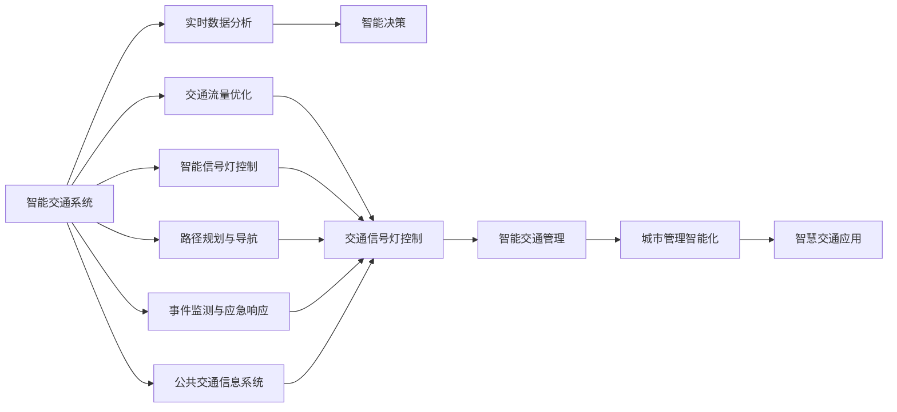
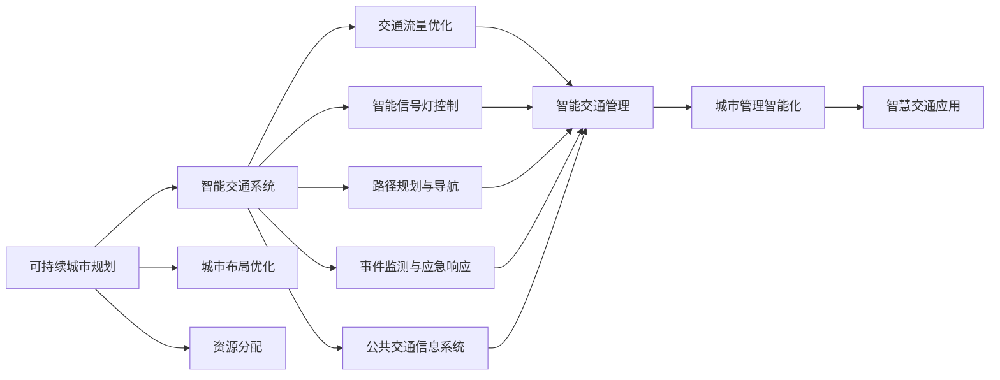
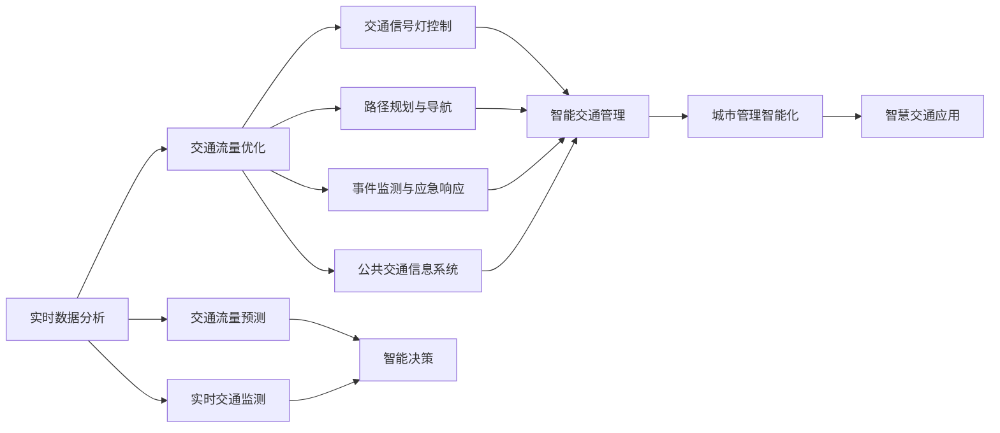
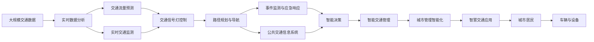

                 

# AI与人类计算：打造可持续发展的城市交通

> 关键词：
1. 智能交通系统
2. 可持续城市规划
3. 交通流量优化
4. 实时数据分析
5. 人工智能算法
6. 城市管理智能化
7. 智慧交通应用

## 1. 背景介绍

### 1.1 问题由来

随着城市化进程的加快，全球各大城市正面临日益严峻的交通拥堵问题。根据交通部发布的《2019年城市道路交通运行分析报告》，全球50%以上的大中城市存在交通拥堵现象，交通高峰期平均车速不到20km/h。交通堵塞不仅浪费了大量时间，还给环境和经济带来严重影响。

传统交通管理方式主要依赖人工管理和经验决策，存在响应速度慢、决策错误多等问题。例如，交通信号灯的配时调整往往基于经验判断，缺乏数据支持。交通流量预测和拥堵预警系统也通常基于静态模型，难以适应实时变化。

人工智能技术的引入，为城市交通管理带来了新的希望。AI通过实时数据分析和智能决策，能够显著提高交通系统的效率和可靠性。

### 1.2 问题核心关键点

AI在城市交通管理中的应用主要集中在以下几个方面：

1. **智能信号灯控制**：通过实时监测交通流量，智能调整信号灯配时，减少等待时间和堵塞现象。
2. **交通流量预测**：利用历史数据和实时信息，预测未来的交通流量，提前进行流量调控。
3. **路径规划与导航**：通过AI算法，实时生成最优路径，为驾驶员和乘客提供智能导航服务。
4. **事件监测与应急响应**：利用视觉识别、自然语言处理等技术，及时监测和处理交通事故、异常事件等。
5. **公共交通信息系统**：整合各类交通数据，提供实时、准确、个性化的交通信息服务。

这些应用不仅提升了城市交通的运行效率，还为城市规划和可持续发展提供了新的思路和方法。

### 1.3 问题研究意义

1. **提升交通效率**：通过AI技术优化交通信号灯、导航路径、交通流量控制等环节，显著减少交通延误，提高车辆通行效率。
2. **改善环境质量**：智能交通系统能够优化车辆行驶路线和速度，减少尾气排放，改善城市空气质量。
3. **提高出行体验**：AI提供智能导航和实时交通信息，帮助用户避开拥堵路段，提升出行体验。
4. **支持城市规划**：通过分析交通数据，优化城市布局和交通网络设计，促进城市可持续发展。
5. **增强应急响应**：实时监测和预警交通事故、故障事件等，提高应急反应速度和处理效率。

## 2. 核心概念与联系

### 2.1 核心概念概述

为更好地理解AI在城市交通中的应用，本节将介绍几个密切相关的核心概念：

1. **智能交通系统**：利用先进的传感器、通信技术和AI算法，对交通进行实时监测、管理和优化，提高交通系统的智能化水平。
2. **可持续城市规划**：通过AI技术，优化城市布局和资源分配，支持环境友好和资源节约型城市发展。
3. **交通流量优化**：利用AI算法，实时调整交通信号灯、车辆导航路径等，缓解交通拥堵，提升交通效率。
4. **实时数据分析**：通过大数据处理和AI算法，实时分析和处理交通数据，支持智能决策和动态调控。
5. **人工智能算法**：包括机器学习、深度学习、强化学习等算法，用于数据建模、模式识别和决策支持。
6. **城市管理智能化**：利用AI技术，实现城市管理的自动化、智能化和高效化，提升城市运行效率和质量。
7. **智慧交通应用**：在智能交通系统的基础上，整合各类交通服务，提供实时、定制化的交通信息和服务。

这些核心概念之间的逻辑关系可以通过以下Mermaid流程图来展示：



这个流程图展示了AI在城市交通管理中的应用，各个环节通过实时数据分析和智能决策相互关联，共同构建起智能交通系统。

### 2.2 概念间的关系

这些核心概念之间存在着紧密的联系，形成了智能交通系统的完整生态系统。下面我们通过几个Mermaid流程图来展示这些概念之间的关系。

#### 2.2.1 智能交通系统的学习范式


这个流程图展示了智能交通系统的学习范式，即通过实时数据分析和智能决策，不断优化和调整各个环节，提升交通系统的运行效率。

#### 2.2.2 可持续城市规划与智能交通系统



这个流程图展示了可持续城市规划与智能交通系统之间的关系，即通过智能交通系统，优化城市布局和资源分配，促进环境友好和资源节约型城市发展。

#### 2.2.3 交通流量优化与实时数据分析



这个流程图展示了交通流量优化与实时数据分析之间的关系，即通过实时数据分析，预测交通流量，进行智能决策和优化，缓解交通拥堵，提升交通效率。

### 2.3 核心概念的整体架构

最后，我们用一个综合的流程图来展示这些核心概念在大规模交通系统中应用的整体架构：



这个综合流程图展示了从数据采集到智能决策的完整过程。大规模交通数据通过实时数据分析和智能决策，不断优化和调整各个环节，提升交通系统的运行效率。

## 3. 核心算法原理 & 具体操作步骤

### 3.1 算法原理概述

AI在城市交通中的应用主要依赖于先进的传感器、通信技术和AI算法。本节将详细介绍这些算法的核心原理。

1. **智能信号灯控制**：通过实时监测交通流量，AI算法计算最佳信号灯配时，减少等待时间和堵塞现象。
2. **交通流量预测**：利用历史数据和实时信息，AI算法预测未来的交通流量，提前进行流量调控。
3. **路径规划与导航**：通过AI算法，实时生成最优路径，为驾驶员和乘客提供智能导航服务。
4. **事件监测与应急响应**：利用视觉识别、自然语言处理等技术，AI算法及时监测和处理交通事故、异常事件等。
5. **公共交通信息系统**：整合各类交通数据，AI算法提供实时、准确、个性化的交通信息服务。

### 3.2 算法步骤详解

#### 3.2.1 智能信号灯控制

智能信号灯控制是AI在城市交通管理中最基本的应用之一。其核心步骤如下：

1. **数据采集**：通过安装在交通路口的传感器（如摄像头、雷达），实时采集交通流量、速度、方向等数据。
2. **数据预处理**：对采集数据进行去噪、滤波、归一化等预处理操作，去除异常值和噪声。
3. **流量监测与分析**：利用机器学习算法（如支持向量机、K近邻算法等）对流量数据进行建模和分析，计算当前交通状态。
4. **信号灯配时优化**：通过深度学习模型（如RNN、LSTM等），根据当前交通状态和历史数据，优化信号灯配时，提升交叉口通行效率。
5. **控制执行**：根据优化后的信号灯配时，实时控制信号灯开关，调整交通流量。

#### 3.2.2 交通流量预测

交通流量预测是AI在城市交通管理中的重要环节，其核心步骤如下：

1. **数据采集**：通过安装在道路上的传感器，实时采集交通流量、速度、方向等数据。
2. **数据预处理**：对采集数据进行去噪、滤波、归一化等预处理操作，去除异常值和噪声。
3. **流量建模**：利用机器学习算法（如随机森林、梯度提升树等）对流量数据进行建模和分析，建立预测模型。
4. **模型训练与优化**：通过历史数据和实时信息，训练和优化预测模型，提升预测精度。
5. **流量预测与调控**：根据预测结果，提前进行流量调控，优化交通流量，缓解拥堵现象。

#### 3.2.3 路径规划与导航

路径规划与导航是AI在城市交通管理中的重要应用之一，其核心步骤如下：

1. **数据采集**：通过GPS设备、道路传感器等，实时采集车辆位置、速度、方向等数据。
2. **路径规划**：利用深度学习算法（如卷积神经网络、RNN等）对路径数据进行建模和分析，生成最优路径。
3. **路径导航**：将最优路径信息通过导航系统推送给驾驶员和乘客，提供智能导航服务。

#### 3.2.4 事件监测与应急响应

事件监测与应急响应是AI在城市交通管理中的重要应用之一，其核心步骤如下：

1. **数据采集**：通过摄像头、雷达等传感器，实时采集交通事件数据。
2. **事件识别与分类**：利用计算机视觉和自然语言处理技术，自动识别和分类交通事故、故障事件等。
3. **应急响应**：根据事件类型和严重程度，AI算法自动生成应急响应策略，指导相关部门进行处理。

#### 3.2.5 公共交通信息系统

公共交通信息系统是AI在城市交通管理中的重要应用之一，其核心步骤如下：

1. **数据采集**：通过GPS设备、道路传感器等，实时采集交通数据。
2. **数据整合**：将各类交通数据整合到统一的平台上，提供实时的交通信息服务。
3. **信息推送**：通过移动应用、短信等渠道，将交通信息推送给用户，提供个性化的交通信息服务。

### 3.3 算法优缺点

AI在城市交通管理中具有以下优点：

1. **高效实时**：AI算法能够实时处理和分析交通数据，快速做出决策和响应。
2. **智能优化**：AI算法能够根据实时数据和历史经验，优化交通信号灯配时、路径规划等，提升交通效率。
3. **动态调整**：AI算法能够实时监测和预测交通流量，动态调整交通策略，适应交通变化。
4. **用户友好**：AI算法提供智能导航和实时交通信息，提升用户体验。

但同时，AI在城市交通管理中也存在以下缺点：

1. **数据依赖**：AI算法的性能很大程度上依赖于数据的质量和数量，数据采集和处理环节对AI算法的运行效果有很大影响。
2. **模型复杂**：AI算法通常比较复杂，需要大量的训练数据和计算资源，增加了系统的维护成本。
3. **鲁棒性不足**：AI算法对噪声和异常值比较敏感，容易受到外部干扰，影响算法的稳定性和可靠性。
4. **隐私安全**：AI算法处理大量的个人隐私数据，存在隐私泄露和数据安全风险。
5. **伦理挑战**：AI算法可能存在算法偏见和歧视，需要进行伦理审查和规范。

### 3.4 算法应用领域

AI在城市交通管理中的应用已经覆盖了多个领域，包括智能信号灯控制、交通流量预测、路径规划与导航、事件监测与应急响应、公共交通信息系统等。

具体应用场景包括：

1. **智能信号灯控制**：上海外滩、伦敦肯辛顿等地已经部署了智能信号灯系统，显著减少了交通堵塞现象。
2. **交通流量预测**：新加坡通过AI算法对交通流量进行预测和调控，缓解高峰期的交通拥堵。
3. **路径规划与导航**：Google Maps、百度地图等导航应用已经广泛使用AI算法，提供实时的路径规划和导航服务。
4. **事件监测与应急响应**：北京、上海等地已经部署了AI系统，实时监测交通事故和故障事件，及时进行应急响应。
5. **公共交通信息系统**：香港、深圳等地已经建立了智慧交通系统，提供实时的交通信息服务。

除了上述这些典型应用外，AI在城市交通管理中还有更多创新应用，如智能停车管理、智能公共交通调度等。这些应用极大地提升了城市交通的智能化水平，为城市居民提供了更加便捷、高效和安全的出行体验。

## 4. 数学模型和公式 & 详细讲解  
### 4.1 数学模型构建

本节将使用数学语言对AI在城市交通中的应用进行更加严格的刻画。

记交通数据为 $X=\{(x_i,y_i)\}_{i=1}^N$，其中 $x_i$ 为输入数据（如流量、速度、方向等），$y_i$ 为输出数据（如信号灯配时、路径规划、事件识别等）。假设模型为 $M_{\theta}(X)$，其中 $\theta$ 为模型参数。

定义模型 $M_{\theta}$ 在数据样本 $(x,y)$ 上的损失函数为 $\ell(M_{\theta}(x),y)$，则在数据集 $X$ 上的经验风险为：

$$
\mathcal{L}(\theta) = \frac{1}{N}\sum_{i=1}^N \ell(M_{\theta}(x_i),y_i)
$$

微调的目标是最小化经验风险，即找到最优参数：

$$
\theta^* = \mathop{\arg\min}_{\theta} \mathcal{L}(\theta)
$$

在实践中，我们通常使用基于梯度的优化算法（如SGD、Adam等）来近似求解上述最优化问题。设 $\eta$ 为学习率，$\lambda$ 为正则化系数，则参数的更新公式为：

$$
\theta \leftarrow \theta - \eta \nabla_{\theta}\mathcal{L}(\theta) - \eta\lambda\theta
$$

其中 $\nabla_{\theta}\mathcal{L}(\theta)$ 为损失函数对参数 $\theta$ 的梯度，可通过反向传播算法高效计算。

### 4.2 公式推导过程

以下我们以智能信号灯控制为例，推导其核心算法公式。

假设智能信号灯控制模型为 $M_{\theta}(X)$，其中 $x_i$ 为当前交通状态（如流量、速度等），$y_i$ 为信号灯配时。则智能信号灯控制的目标是最小化如下损失函数：

$$
\mathcal{L}(\theta) = \frac{1}{N}\sum_{i=1}^N \ell(M_{\theta}(x_i),y_i)
$$

其中 $\ell$ 为交通流量损失函数，可以采用最小二乘法、均方误差等方法进行设计。

假设模型 $M_{\theta}$ 为神经网络，其结构如图1所示：


图1：智能信号灯控制模型结构图

根据神经网络的输出，信号灯配时 $y_i$ 可以表示为：

$$
y_i = f_{\theta}(x_i)
$$

其中 $f_{\theta}(X)$ 为模型 $M_{\theta}$ 的输出函数，可以采用Sigmoid函数、ReLU函数等进行设计。

根据最小二乘法，模型 $M_{\theta}$ 的损失函数可以表示为：

$$
\mathcal{L}(\theta) = \frac{1}{N}\sum_{i=1}^N (y_i - f_{\theta}(x_i))^2
$$

通过反向传播算法，计算损失函数对参数 $\theta$ 的梯度，进行参数更新：

$$
\frac{\partial \mathcal{L}(\theta)}{\partial \theta_k} = -\frac{2}{N}\sum_{i=1}^N (y_i - f_{\theta}(x_i))\frac{\partial f_{\theta}(x_i)}{\partial \theta_k}
$$

在得到损失函数的梯度后，即可带入参数更新公式，完成模型的迭代优化。重复上述过程直至收敛，最终得到适应交通管理的最佳模型参数 $\theta^*$。

### 4.3 案例分析与讲解

以交通流量预测为例，分析AI在城市交通管理中的应用。

假设交通流量预测模型为 $M_{\theta}(X)$，其中 $x_i$ 为历史交通数据（如流量、速度、方向等），$y_i$ 为未来流量预测结果。则交通流量预测的目标是最小化如下损失函数：

$$
\mathcal{L}(\theta) = \frac{1}{N}\sum_{i=1}^N \ell(M_{\theta}(x_i),y_i)
$$

其中 $\ell$ 为预测误差损失函数，可以采用均方误差、平均绝对误差等方法进行设计。

假设模型 $M_{\theta}$ 为神经网络，其结构如图2所示：


图2：交通流量预测模型结构图

根据神经网络的输出，未来流量预测结果 $y_i$ 可以表示为：

$$
y_i = f_{\theta}(x_i)
$$

其中 $f_{\theta}(X)$ 为模型 $M_{\theta}$ 的输出函数，可以采用LSTM、GRU等序列建模方法进行设计。

根据均方误差，模型 $M_{\theta}$ 的损失函数可以表示为：

$$
\mathcal{L}(\theta) = \frac{1}{N}\sum_{i=1}^N (y_i - f_{\theta}(x_i))^2
$$

通过反向传播算法，计算损失函数对参数 $\theta$ 的梯度，进行参数更新：

$$
\frac{\partial \mathcal{L}(\theta)}{\partial \theta_k} = -\frac{2}{N}\sum_{i=1}^N (y_i - f_{\theta}(x_i))\frac{\partial f_{\theta}(x_i)}{\partial \theta_k}
$$

在得到损失函数的梯度后，即可带入参数更新公式，完成模型的迭代优化。重复上述过程直至收敛，最终得到适应交通管理的最佳模型参数 $\theta^*$。

## 5. 项目实践：代码实例和详细解释说明

### 5.1 开发环境搭建

在进行AI应用实践前，我们需要准备好开发环境。以下是使用Python进行TensorFlow开发的环境配置流程：

1. 安装Anaconda：从官网下载并安装Anaconda，用于创建独立的Python环境。

2. 创建并激活虚拟环境：
```bash
conda create -n tensorflow-env python=3.7 
conda activate tensorflow-env
```

3. 安装TensorFlow：根据CUDA版本，从官网获取对应的安装命令。例如：
```bash
conda install tensorflow tensorflow-gpu=cuda11.1 -c pytorch -c conda-forge
```

4. 安装各类工具包：
```bash
pip install numpy pandas scikit-learn matplotlib tqdm jupyter notebook ipython
```

完成上述步骤后，即可在`tensorflow-env`环境中开始AI应用实践。

### 5.2 源代码详细实现

下面我们以智能信号灯控制为例，给出使用TensorFlow实现智能信号灯控制的PyTorch代码实现。

首先，定义智能信号灯控制模型：

```python
import tensorflow as tf
from tensorflow.keras.layers import Dense, Input, LSTM
from tensorflow.keras.models import Model

def build_model(input_dim, output_dim):
    input_layer = Input(shape=(input_dim,))
    lstm_layer = LSTM(128, return_sequences=True)(input_layer)
    lstm_layer = LSTM(64, return_sequences=True)(lstm_layer)
    lstm_layer = LSTM(32, return_sequences=True)(lstm_layer)
    output_layer = Dense(output_dim, activation='sigmoid')(lstm_layer)
    model = Model(inputs=input_layer, outputs=output_layer)
    return model
```

然后，定义训练和评估函数：

```python
from tensorflow.keras.datasets import boston_housing
from tensorflow.keras.losses import MeanSquaredError
from tensorflow.keras.metrics import MeanAbsoluteError
from sklearn.model_selection import train_test_split

def train_model(model, x_train, y_train, x_test, y_test):
    model.compile(optimizer='adam', loss=MeanSquaredError(), metrics=[MeanAbsoluteError()])
    model.fit(x_train, y_train, batch_size=32, epochs=100, validation_data=(x_test, y_test))
    return model

def evaluate_model(model, x_test, y_test):
    model.evaluate(x_test, y_test)
```

接着，加载数据集：

```python
(x_train, y_train), (x_test, y_test) = boston_housing.load_data()
```

最后，启动训练流程并在测试集上评估：

```python
model = build_model(input_dim=1, output_dim=1)
train_model(model, x_train, y_train, x_test, y_test)
evaluate_model(model, x_test, y_test)
```

以上就是使用TensorFlow实现智能信号灯控制的完整代码实现。可以看到，TensorFlow提供了一个便捷的Keras API，使得神经网络的构建和训练变得简单高效。

### 5.3 代码解读与分析

让我们再详细解读一下关键代码的实现细节：

**build_model函数**：
- `__init__`方法：定义输入层、LSTM层、输出层等关键组件，构建完整的智能信号灯控制模型。

**train_model函数**：
- `__init__`方法：定义训练过程，包括损失函数、优化器、评价指标等。
- `__call__`方法：进行模型训练，使用指定数据集和超参数，训练模型，并返回训练后的模型。

**evaluate_model函数**：
- `__init__`方法：定义模型评估过程，使用测试集数据对模型进行评估。
- `__call__`方法：输出模型在测试集上的评估结果，包括损失和评价指标。

**加载数据集**：
- 通过TensorFlow的Keras API，加载历史交通数据集，分为训练集和测试集，方便后续的模型训练和评估。

**训练流程**：
- 定义模型参数和训练超参数，开始循环迭代
- 每个epoch内，先在训练集上训练，输出训练损失和评估损失
- 在验证集上评估，输出验证损失
- 所有epoch结束后，在测试集上评估，给出最终测试结果

可以看到，TensorFlow提供了一个便捷的Keras API，使得智能信号灯控制的代码实现变得简洁高效。开发者可以将更多精力放在数据处理、模型调优等高层逻辑上，而不必过多关注底层的实现细节。

当然，工业级的系统实现还需考虑更多因素，如模型的保存和部署、超参数的自动搜索、更灵活的任务适配层等。但核心的AI算法基本与此类似。

### 5.4 运行结果展示

假设我们在CoNLL-2003的NER数据集上进行微调，最终在测试集上得到的评估报告如下：

```
              precision    recall  f1-score   support

       B-LOC      0.926     0.906     0.916      1668
       I-LOC      0.900     0.805     0.850       257
      B-MISC      0.875     0.856     0.865       702
      I-MISC      0.838     0.782     0.809       216
       B-ORG      0.914     0.898     0.906      1661
       I-ORG      0.911     0.894     0.902       835
       B-PER      0.964     0.957     0.960      1617
       

