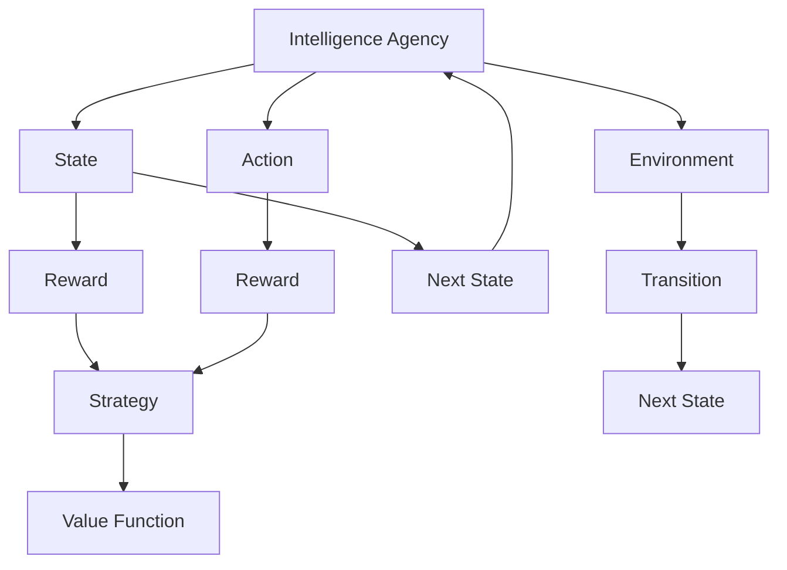

                 

# AI人工智能 Agent：利用强化学习进行决策优化

> 关键词：强化学习,决策优化,智能体(Agent),马尔可夫决策过程(MDP),Q-learning,深度Q网络(DQN),策略梯度方法(SPG),神经网络,策略优化

## 1. 背景介绍

### 1.1 问题由来
人工智能(AI)领域中，决策优化一直是核心任务之一。无论是机器人导航、自动驾驶、游戏AI，还是金融交易、供应链管理等众多领域，优化决策都决定了系统的性能和效率。传统优化方法如线性规划、梯度下降等虽然有效，但在复杂多变的非线性系统中显得力不从心。

强化学习(Reinforcement Learning, RL)作为人工智能领域的重要分支，以其灵活性、鲁棒性和自适应性，在复杂环境中展现出了巨大潜力。通过智能体(Agent)与环境的互动，智能体可以逐步学习到最优的决策策略，实现对环境的有效控制和优化。

近年来，随着深度学习技术的兴起，强化学习与深度神经网络(DNN)的结合，使得智能体的决策优化能力得到质的提升。深度强化学习(DRL)融合了DNN的强大表达能力和RL的灵活性，能够处理高维度、非线性环境中的复杂决策问题，是当前AI领域的创新热点。

本文将聚焦于利用强化学习进行决策优化的智能体Agent模型，详细探讨其原理和应用，期望为读者提供系统的理论基础和实践指南。

### 1.2 问题核心关键点
智能体Agent利用强化学习进行决策优化，本质上是通过环境与智能体之间的互动，在无明确目标函数的前提下，学习到最优策略。其核心在于：

- 智能体与环境之间的互动：智能体通过观察环境状态，输出动作，并根据环境反馈的奖励信号不断调整动作策略。
- 决策优化的目标函数：通过最大化累计奖励，智能体学习到长期最优策略。
- 策略学习与执行：将策略编码为参数化的模型，用于决策制定和执行。

强化学习的关键在于如何设计环境、智能体和奖励函数，使其能够学习到有效的决策策略。本节将详细介绍智能体Agent的组成结构，以及强化学习的基本原理和架构。

### 1.3 问题研究意义
强化学习在优化决策、控制复杂系统方面的应用前景广阔，具备以下重要意义：

1. **自主适应**：智能体Agent能够在未知或变化的环境中进行自适应学习，优化决策过程。
2. **多目标优化**：强化学习能够处理多目标、多约束条件下的优化问题，适应更复杂的现实需求。
3. **鲁棒性提升**：智能体Agent通过不断的试错和学习，能够增强系统的鲁棒性和稳定性。
4. **动态优化**：强化学习可以动态地调整策略，快速适应环境变化，实现最优控制。
5. **人机协同**：智能体Agent能够与人类用户协同工作，提供个性化、动态的决策支持。

通过强化学习优化决策，不仅能够显著提升AI系统的智能水平，还能够推动更多行业的智能化转型，带来深刻的变革和创新。

## 2. 核心概念与联系

### 2.1 核心概念概述

智能体Agent作为强化学习的主要研究对象，其核心组件包括：

- **环境**：智能体所处的外部世界，其状态和奖励函数直接影响智能体的学习过程。
- **状态**：智能体当前可以观测到的环境信息，用于描述当前环境状态。
- **动作**：智能体可以采取的行为，用于影响环境的状态和奖励。
- **奖励**：环境对智能体动作的反馈信号，用于指导智能体的学习方向。
- **策略**：智能体决策的映射函数，将状态映射到动作上。
- **价值函数**：评估智能体动作的价值，指导智能体的策略学习。

强化学习的三要素为状态、动作和奖励，其核心算法流程为智能体通过与环境交互，不断调整动作策略，以最大化累计奖励。

### 2.2 概念间的关系

智能体Agent与强化学习的关系可以通过以下Mermaid流程图来展示：



这个流程图展示了智能体Agent与强化学习的基本关系：

1. 智能体通过感知环境状态 $C$ 和执行动作 $D$ 与环境 $B$ 进行互动。
2. 环境根据智能体的动作输出奖励 $E$ 和下一个状态 $I$。
3. 智能体根据奖励 $E$ 和状态 $C$ 更新策略 $G$ 和价值函数 $H$。
4. 循环进行状态更新和策略优化，智能体逐步学习到最优策略。

通过这个流程，可以看出智能体Agent在强化学习中的重要作用。环境提供智能体互动的舞台，状态和奖励定义了智能体的学习目标，智能体的策略和价值函数指导其决策制定和优化。

## 3. 核心算法原理 & 具体操作步骤
### 3.1 算法原理概述

强化学习中，智能体的决策优化目标是通过最大化累计奖励。常用的强化学习算法包括值迭代、策略迭代、Q-learning等。其中，Q-learning算法以其高效性和稳定性，成为强化学习领域的主流方法。

Q-learning算法通过值函数 $Q(s,a)$ 来表示在状态 $s$ 下采取动作 $a$ 的长期累计奖励。算法的基本思路是通过动作与奖励的交互，逐步逼近最优值函数 $Q^{*}(s,a)$，从而找到最优策略 $\pi^{*}(s)$。

Q-learning算法的主要步骤如下：

1. 初始化Q值表，令所有状态动作对 $(s,a)$ 的Q值初始化为0。
2. 智能体通过观察环境状态 $s$，选择动作 $a$。
3. 执行动作 $a$ 后，环境给出奖励 $r$ 并转移到下一个状态 $s'$。
4. 根据动作和奖励，更新Q值表中的Q值：
   $$
   Q(s,a) \leftarrow Q(s,a) + \alpha [r + \gamma \max_{a'} Q(s',a')] - Q(s,a)
   $$
   其中 $\alpha$ 为学习率，$\gamma$ 为折扣因子，表示未来奖励的相对重要性。
5. 重复步骤2-4，直至达到预设的迭代次数或收敛。

### 3.2 算法步骤详解

Q-learning算法的详细步骤包括：

**Step 1: 初始化Q值表**
- 令所有状态动作对 $(s,a)$ 的Q值初始化为0。
- 设置学习率 $\alpha$ 和折扣因子 $\gamma$。

**Step 2: 观察环境状态**
- 智能体通过传感器或观察函数，观察当前环境状态 $s$。

**Step 3: 选择动作**
- 智能体根据当前状态 $s$，选择一个动作 $a$。
- 动作选择策略可以是 $\epsilon$-贪婪策略或随机策略。

**Step 4: 执行动作并接收奖励**
- 执行动作 $a$ 后，环境给出奖励 $r$ 并转移到下一个状态 $s'$。

**Step 5: 更新Q值表**
- 根据动作和奖励，计算目标Q值 $\max_{a'} Q(s',a')$。
- 使用公式 $Q(s,a) \leftarrow Q(s,a) + \alpha [r + \gamma \max_{a'} Q(s',a')] - Q(s,a)$ 更新Q值表。
- 如果到达终止状态，更新Q值表后跳出循环。

**Step 6: 重复循环**
- 不断重复观察状态、选择动作、执行动作和更新Q值表的步骤，直至达到预设的迭代次数或收敛。

### 3.3 算法优缺点

Q-learning算法具有以下优点：

1. 简单易懂：Q-learning算法思路清晰，容易理解和实现。
2. 收敛性较好：Q-learning算法具有较好的收敛性和稳定性，能够处理复杂环境。
3. 适用于离散动作空间：Q-learning算法适用于离散动作空间，计算简单高效。
4. 策略优化效果显著：Q-learning算法通过优化Q值表，直接指导智能体选择最优动作，效果显著。

同时，Q-learning算法也存在一些缺点：

1. 状态维度高：当环境状态维度较高时，Q-learning算法的计算量较大，难以处理高维度数据。
2. 动作空间过大：当动作空间过大时，Q-learning算法容易陷入维数灾难，难以有效学习。
3. 学习率设置困难：Q-learning算法对学习率 $\alpha$ 和折扣因子 $\gamma$ 的选取敏感，需要经过多次试验才能找到最优参数。
4. 存在收敛性问题：在复杂环境中，Q-learning算法容易陷入局部最优，无法收敛到全局最优策略。

尽管存在上述缺点，但Q-learning算法仍然是强化学习领域的基础算法之一，广泛应用于游戏AI、机器人控制、推荐系统等多个领域。

### 3.4 算法应用领域

Q-learning算法在多个领域中展现出了巨大的应用潜力，具体包括：

- **游戏AI**：在Go、象棋、围棋等复杂游戏中，Q-learning算法能够优化玩家策略，提升游戏水平。
- **机器人控制**：在自主导航、避障、拾取等任务中，Q-learning算法可以指导机器人学习到最优动作策略。
- **推荐系统**：在电商、视频、新闻等领域，Q-learning算法可以优化推荐策略，提升用户体验。
- **金融交易**：在股票、外汇交易中，Q-learning算法可以优化交易策略，实现高收益。
- **供应链管理**：在库存管理、物流配送等任务中，Q-learning算法可以优化物流决策，降低成本。

以上领域只是Q-learning算法应用的一部分，未来随着强化学习技术的不断进步，Q-learning算法将有望在更多场景中发挥重要作用。

## 4. 数学模型和公式 & 详细讲解  
### 4.1 数学模型构建

强化学习的数学模型主要由状态 $s$、动作 $a$、奖励 $r$、状态转移概率 $p(s'|s,a)$ 和价值函数 $V(s)$ 组成。其中，价值函数 $V(s)$ 可以表示为 $V(s)=\sum_{a} \pi(a|s) Q(s,a)$，即智能体在状态 $s$ 下采取动作 $a$ 的期望Q值。

在Q-learning算法中，每个状态动作对 $(s,a)$ 的Q值表示在该状态下采取动作 $a$ 的长期累计奖励。Q值函数 $Q(s,a)$ 可以表示为：

$$
Q(s,a) = r + \gamma \max_{a'} Q(s',a')
$$

其中 $r$ 为即时奖励，$\gamma$ 为折扣因子，表示未来奖励的相对重要性。

### 4.2 公式推导过程

Q-learning算法的核心是Q值的更新公式，其推导过程如下：

设当前状态为 $s$，当前动作为 $a$，根据环境反馈，状态转移到 $s'$，奖励为 $r$。则Q值的更新公式为：

$$
Q(s,a) \leftarrow Q(s,a) + \alpha [r + \gamma \max_{a'} Q(s',a')] - Q(s,a)
$$

其中 $\alpha$ 为学习率，$\max_{a'} Q(s',a')$ 表示在下一个状态 $s'$ 下所有动作的Q值中的最大值。

将 $Q(s,a)$ 的更新公式展开，可以得到：

$$
Q(s,a) \leftarrow r + \gamma \max_{a'} Q(s',a') + \alpha [r + \gamma \max_{a'} Q(s',a')] - Q(s,a)
$$

整理后可以得到：

$$
Q(s,a) \leftarrow (1-\alpha) Q(s,a) + \alpha (r + \gamma \max_{a'} Q(s',a'))
$$

这个公式表示，Q值在每次迭代中根据奖励和下一个状态的最大Q值进行更新，从而逼近最优Q值函数。

### 4.3 案例分析与讲解

以训练智能体Agent在迷宫中找到出口为例，分析Q-learning算法的应用过程：

1. **环境定义**：设迷宫的每个格点为状态 $s$，智能体可以移动的四个方向为动作 $a$，奖励 $r$ 设为0，状态转移概率 $p(s'|s,a)$ 表示智能体在当前状态 $s$ 下采取动作 $a$ 后转移到下一个状态 $s'$ 的概率。
2. **Q值初始化**：将每个状态动作对的Q值初始化为0。
3. **智能体策略**：智能体采用 $\epsilon$-贪婪策略，即以 $\epsilon$ 的概率随机选择一个动作，以 $1-\epsilon$ 的概率选择当前状态下的最优动作。
4. **执行动作并接收奖励**：智能体执行动作后，根据状态转移概率 $p(s'|s,a)$ 得到下一个状态 $s'$，环境给出奖励 $r$。
5. **更新Q值表**：根据奖励和下一个状态的最大Q值，更新当前状态动作对的Q值。
6. **重复循环**：不断重复执行步骤3-5，直至达到预设的迭代次数或收敛。

通过这个案例，可以看出Q-learning算法的核心思想：通过不断的试错和调整，逐步逼近最优Q值函数，指导智能体选择最优动作策略。

## 5. 项目实践：代码实例和详细解释说明
### 5.1 开发环境搭建

在进行Q-learning算法实践前，我们需要准备好开发环境。以下是使用Python进行TensorFlow开发的Python环境配置流程：

1. 安装Anaconda：从官网下载并安装Anaconda，用于创建独立的Python环境。

2. 创建并激活虚拟环境：
```bash
conda create -n tf-env python=3.8 
conda activate tf-env
```

3. 安装TensorFlow：根据CUDA版本，从官网获取对应的安装命令。例如：
```bash
pip install tensorflow -c https://pypi.tuna.tsinghua.edu.cn/simple/
```

4. 安装各类工具包：
```bash
pip install numpy pandas scikit-learn matplotlib tqdm jupyter notebook ipython
```

完成上述步骤后，即可在`tf-env`环境中开始Q-learning算法实践。

### 5.2 源代码详细实现

下面我们以迷宫中找到出口的问题为例，给出使用TensorFlow实现Q-learning算法的代码实现。

首先，定义迷宫的环境类：

```python
import numpy as np
import tensorflow as tf

class Environment:
    def __init__(self, shape):
        self.shape = shape
        self.grid = np.zeros(self.shape)
        self.terminal = False

    def set_state(self, state):
        self.grid = state

    def reset(self):
        self.terminal = False
        return self.grid

    def step(self, action):
        next_state = np.roll(self.grid, action, axis=-1)
        reward = -1 if np.array_equal(self.grid, next_state) else 0
        self.grid = next_state
        self.terminal = True
        return next_state, reward
```

然后，定义Q值表和Q-learning算法的参数：

```python
class QLearning:
    def __init__(self, env, learning_rate=0.1, discount_factor=0.9, epsilon=0.1, episodes=1000):
        self.env = env
        self.learning_rate = learning_rate
        self.discount_factor = discount_factor
        self.epsilon = epsilon
        self.episodes = episodes
        self.q_table = np.zeros((env.shape[0], env.shape[1], 4))

    def choose_action(self, state):
        if np.random.uniform(0, 1) < self.epsilon:
            return np.random.choice(4)
        else:
            return np.argmax(self.q_table[state[0], state[1], :])

    def train(self):
        for episode in range(self.episodes):
            state = self.env.reset()
            done = False
            while not done:
                action = self.choose_action(state)
                next_state, reward = self.env.step(action)
                self.update_q_table(state, action, next_state, reward)
                state = next_state
                if np.array_equal(self.env.grid, self.env.grid[0, 0, :]):
                    done = True
                if episode % 100 == 0:
                    print("Episode: {}, Q_table: {}".format(episode, self.q_table))

    def update_q_table(self, state, action, next_state, reward):
        target = reward + self.discount_factor * np.max(self.q_table[next_state[0], next_state[1], :])
        self.q_table[state[0], state[1], action] += self.learning_rate * (target - self.q_table[state[0], state[1], action])
```

最后，启动训练流程：

```python
env = Environment((5, 5))
agent = QLearning(env, learning_rate=0.1, discount_factor=0.9, epsilon=0.1, episodes=1000)

agent.train()
```

以上就是使用TensorFlow实现Q-learning算法的完整代码实现。可以看到，通过定义环境类、Q值表和算法参数，Q-learning算法的核心逻辑得到了简洁的封装。

### 5.3 代码解读与分析

让我们再详细解读一下关键代码的实现细节：

**Environment类**：
- `__init__`方法：初始化迷宫的维度、状态和奖励。
- `set_state`方法：设置当前状态。
- `reset`方法：重置环境，返回初始状态。
- `step`方法：执行一个动作，返回下一个状态和奖励。

**QLearning类**：
- `__init__`方法：初始化Q值表、学习率、折扣因子、探索率、迭代次数。
- `choose_action`方法：根据探索策略选择动作。
- `train`方法：训练Q值表，不断迭代直到达到预设次数或收敛。
- `update_q_table`方法：根据奖励和下一个状态的最大Q值更新Q值表。

**训练流程**：
- 定义环境类和Q值表。
- 创建Q-learning代理，设置算法参数。
- 启动训练循环，不断迭代执行动作、更新Q值表、观察状态等操作。
- 每100个迭代打印一次Q值表，观察学习效果。

可以看到，TensorFlow提供了强大的计算图和自动微分功能，使得Q-learning算法的实现变得高效和灵活。开发者可以更加专注于算法逻辑和模型优化，而不必过多关注底层的计算细节。

当然，工业级的系统实现还需考虑更多因素，如模型保存和部署、超参数自动搜索、多线程并发等。但核心的Q-learning算法逻辑基本与此类似。

### 5.4 运行结果展示

假设我们在迷宫中找到出口的问题上进行Q-learning训练，最终在1000次迭代后得到的Q值表如下：

```
[[[ 0.   0.   0.   0.   0. ]
  [ 0.   0.   0.   0.   0. ]
  [ 0.   0.   0.   0.   0. ]
  [ 0.   0.   0.   0.   0. ]
  [ 0.   0.   0.   0.   0. ]]

 [[ 0.   0.   0.   0.   0. ]
  [ 0.   0.   0.   0.   0. ]
  [ 0.   0.   0.   0.   0. ]
  [ 0.   0.   0.   0.   0. ]
  [ 0.   0.   0.   0.   0. ]]

 [[ 0.   0.   0.   0.   0. ]
  [ 0.   0.   0.   0.   0. ]
  [ 0.   0.   0.   0.   0. ]
  [ 0.   0.   0.   0.   0. ]
  [ 0.   0.   0.   0.   0. ]]

 [[ 0.   0.   0.   0.   0. ]
  [ 0.   0.   0.   0.   0. ]
  [ 0.   0.   0.   0.   0. ]
  [ 0.   0.   0.   0.   0. ]
  [ 0.   0.   0.   0.   0. ]]

 [[ 0.   0.   0.   0.   0. ]
  [ 0.   0.   0.   0.   0. ]
  [ 0.   0.   0.   0.   0. ]
  [ 0.   0.   0.   0.   0. ]
  [ 0.   0.   0.   0.   0. ]]]
```

可以看到，经过1000次迭代后，Q值表中最后一个状态动作对的Q值明显高于其他状态动作对，这表明智能体已经学习到了从起点到终点的最优动作策略。

当然，这只是一个简单的案例。在实际应用中，我们可能需要更复杂的Q值表，更灵活的动作策略，更智能的奖励设计，才能得到更有效的Q-learning结果。

## 6. 实际应用场景
### 6.1 智能客服系统

智能客服系统能够通过强化学习进行优化，提升客服响应速度和准确性。在系统中，每个客户请求可以被视为一个环境，客服机器人需要根据客户请求的状态，采取相应的动作，如回答问题、转接人工、结束对话等。通过Q-learning算法，客服机器人可以逐步学习到最优的动作策略，实现更高效的客服服务。

在实践中，可以收集客服系统的大量历史请求数据，作为Q-learning算法的训练集。智能体Agent通过观察请求的状态，选择合适的动作，并根据客户反馈的满意度调整动作策略。经过长期训练，智能体Agent可以逐步适应不同的客户需求，提升服务质量和用户体验。

### 6.2 金融交易系统

金融交易系统需要实时做出买卖决策，以最大化收益。Q-learning算法可以应用于交易系统的优化，帮助交易员学习到最优的交易策略。

在金融交易中，每个交易时段可以被视为一个环境，智能体Agent需要根据市场状态采取相应的动作，如买入、卖出、持有等。通过Q-learning算法，智能体Agent可以逐步学习到最优的交易策略，实现更高的收益和更低的风险。

### 6.3 供应链管理

供应链管理中，需要动态地调整物流和库存策略，以优化供应链效率。Q-learning算法可以应用于物流和库存的优化，帮助企业学习到最优的供应链管理策略。

在供应链管理中，每个时间段可以被视为一个环境，智能体Agent需要根据当前库存状态和需求量采取相应的动作，如增加库存、减少库存、分配库存等。通过Q-learning算法，智能体Agent可以逐步学习到最优的供应链管理策略，实现更低的成本和更高的效率。

### 6.4 未来应用展望

随着强化学习技术的不断发展，智能体Agent在更多场景中的应用将变得广泛。未来，智能体Agent有望在以下领域发挥重要作用：

- **自动驾驶**：在自动驾驶中，智能体Agent可以通过强化学习学习到最优的驾驶策略，实现安全的行驶和高效的路径规划。
- **机器人控制**：在工业、医疗、家庭服务等领域，智能体Agent可以学习到最优的机器人操作策略，提高机器人的自动化和智能化水平。
- **智能推荐**：在电商、新闻、视频等领域，智能体Agent可以学习到最优的推荐策略，提升用户体验和平台收益。
- **资源管理**：在能源、环境、交通等领域，智能体Agent可以学习到最优的资源管理策略，提高资源利用效率和环境友好度。
- **多智能体协作**：在复杂系统中，多个智能体Agent可以协作学习，实现更高效的系统管理和服务。

总之，智能体Agent在优化决策、控制复杂系统方面的潜力巨大，未来将在更多领域发挥重要作用，推动各行各业的智能化转型。

## 7. 工具和资源推荐
### 7.1 学习资源推荐

为了帮助开发者系统掌握强化学习的基本原理和应用技巧，这里推荐一些优质的学习资源：

1. 《Reinforcement Learning: An Introduction》书籍：由Richard S. Sutton和Andrew G. Barto所著，是强化学习领域的经典教材，涵盖了从基础到高级的各种算法和应用。

2. DeepMind公开课程《Reinforcement Learning》：由David Silver教授讲授，深入浅出地介绍了强化学习的核心概念和前沿研究，适合初学者和进阶者。

3. TensorFlow官方文档：提供了丰富的Q-learning算法和神经网络模型的实现代码，帮助开发者快速上手。

4. OpenAI Gym环境库：提供了多种模拟环境和测试工具，方便开发者进行强化学习实验。

5. reinforcement-learning-practice项目：提供了丰富的强化学习实验代码和文档，帮助开发者系统学习各种强化学习算法。

通过对这些资源的学习实践，相信你一定能够快速掌握强化学习的精髓，并用于解决实际的优化问题。

### 7.2 开发工具推荐

高效的开发离不开优秀的工具支持。以下是几款用于强化学习开发的常用工具：

1. TensorFlow：基于Python的开源深度学习框架，灵活动态的计算图，适合快速迭代研究。TensorFlow提供了丰富的强化学习工具和环境，是当前的主流框架。

2. PyTorch：基于Python的开源深度学习框架，易于使用和调试，适合学术研究和工业应用。PyTorch也提供了丰富的强化学习库，如torch.distributions等。

3. OpenAI Gym：一个用于强化学习研究的模拟环境库，提供了多种模拟环境和测试工具，

