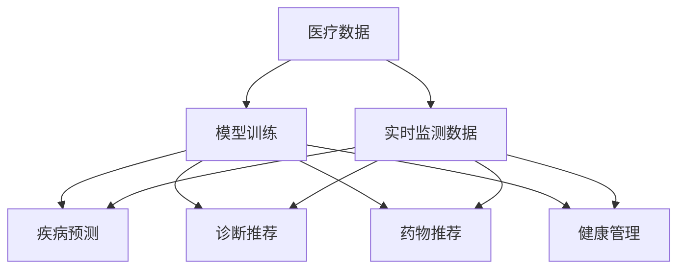

                 

## 1. 背景介绍

### 1.1 问题由来
人工智能(AI)技术的迅猛发展，特别是在深度学习领域，已经渗透到了各行各业，包括医疗健康。智能医疗，作为AI在医疗领域的一个重要应用，不仅能够帮助提高医疗效率、降低医疗成本，还能在疾病诊断、治疗方案推荐等方面发挥关键作用。然而，智能医疗的落地推广仍面临诸多挑战，如数据质量、算法鲁棒性、医疗隐私保护等。本文将聚焦于AI人工智能Agent在智能医疗中的应用，详细探讨其在提升医疗质量、辅助临床决策等方面的潜力，并展望其未来发展方向。

### 1.2 问题核心关键点
AI Agent是指在特定领域内，能够自主决策、自主执行任务的智能体。在智能医疗中，AI Agent可以通过学习患者历史病历、实时监测数据等，提供个性化的医疗服务和决策支持。当前，AI Agent在智能医疗中的应用已经取得了显著的进展，例如在医学影像分析、智能诊断、药物推荐等任务中，AI Agent展现出强大的信息处理和决策能力。

### 1.3 问题研究意义
AI Agent在智能医疗中的应用，能够显著提升医疗服务的智能化水平，辅助医生诊断和治疗，加速新药研发进程。AI Agent技术的发展，不仅能提高医疗服务的效率和准确性，还能解放医生的部分劳动，使其专注于更具创造性的工作。此外，AI Agent还能够在全球范围内推动医疗资源的公平分配，助力健康普惠。因此，深入研究AI Agent在智能医疗中的应用，具有重要的理论和实践意义。

## 2. 核心概念与联系

### 2.1 核心概念概述

AI Agent在大规模医疗数据的训练中，展现出了强大的自我学习和决策能力。以下是一些关键概念：

- **AI Agent**：在特定领域内，能够自主决策、自主执行任务的智能体。
- **医疗数据**：包括患者的电子病历、医学影像、基因组数据等，是AI Agent训练和应用的重要基础。
- **疾病预测**：通过分析历史病历和实时数据，AI Agent能够预测患者的病情发展趋势，提前采取预防措施。
- **诊断推荐**：结合医学知识库，AI Agent能够对患者的症状进行诊断，并提供相应的治疗建议。
- **药物推荐**：基于患者的历史治疗记录和基因信息，AI Agent能够推荐最适合的治疗药物和剂量。
- **健康管理**：通过监测患者的生活习惯、环境因素等，AI Agent能够提供个性化的健康管理方案。

这些核心概念之间存在紧密的联系，通过学习和应用，AI Agent能够在智能医疗领域中发挥巨大的作用。

### 2.2 概念间的关系

以下Mermaid流程图展示了AI Agent在智能医疗中的应用过程：



这个流程图展示了AI Agent在智能医疗中的应用流程：

1. 首先，医疗数据和实时监测数据被用来训练AI Agent，使其具备疾病预测、诊断推荐、药物推荐和健康管理等能力。
2. 在实际应用中，AI Agent会根据患者当前的病情和监测数据，自主地进行疾病预测、诊断推荐、药物推荐和健康管理。
3. 疾病预测可以帮助提前预防疾病的发展；诊断推荐可以帮助医生进行准确诊断；药物推荐可以帮助选择最适合的治疗方案；健康管理可以帮助患者保持健康。

## 3. 核心算法原理 & 具体操作步骤
### 3.1 算法原理概述

AI Agent在智能医疗中的应用，本质上是通过深度学习模型对大规模医疗数据进行学习和推理，实现自主决策和执行。其核心算法原理包括以下几个方面：

- **深度学习模型**：如卷积神经网络(CNN)、循环神经网络(RNN)、长短期记忆网络(LSTM)、变压器(Transformer)等，用于处理和分析医疗数据。
- **数据预处理**：包括数据清洗、归一化、特征提取等，以提高模型的训练效果。
- **模型训练**：通过标注好的医疗数据集，使用监督学习或无监督学习的方式，训练AI Agent的模型。
- **推理和执行**：将AI Agent部署到医疗系统中，根据实时监测数据和历史病历进行推理和决策，提供个性化医疗服务。

### 3.2 算法步骤详解

以下是AI Agent在智能医疗中的具体操作步骤：

1. **数据收集**：收集患者的电子病历、医学影像、基因组数据等医疗数据，构建医疗数据集。
2. **数据预处理**：清洗、归一化、特征提取等，以提高模型训练效果。
3. **模型训练**：选择合适的深度学习模型，使用标注好的医疗数据集，训练AI Agent的模型。
4. **模型评估**：在验证集上评估模型性能，调整模型参数，以提高模型的泛化能力。
5. **模型部署**：将训练好的AI Agent模型部署到医疗系统中，根据实时监测数据和历史病历进行推理和决策。
6. **结果反馈**：收集模型的推理结果，根据反馈调整模型参数，进一步提升模型性能。

### 3.3 算法优缺点

AI Agent在智能医疗中的应用具有以下优点：

- **高效性**：AI Agent能够自主决策和执行，大大提高了医疗服务的效率。
- **准确性**：通过深度学习模型的训练，AI Agent在疾病预测、诊断推荐、药物推荐等方面具有较高的准确性。
- **个性化**：AI Agent能够根据患者的个体差异，提供个性化的医疗服务。
- **可扩展性**：AI Agent能够轻松扩展到不同的医疗场景和应用领域。

然而，AI Agent在智能医疗中的应用也存在一些缺点：

- **数据依赖**：AI Agent的性能很大程度上依赖于标注好的医疗数据集，数据的获取和标注成本较高。
- **算法复杂性**：深度学习模型的训练和推理过程复杂，对计算资源和专业知识要求较高。
- **隐私保护**：医疗数据涉及患者隐私，如何在保护隐私的前提下，充分利用医疗数据，是一个重要问题。
- **模型解释性**：AI Agent的决策过程缺乏解释性，难以理解和调试。
- **伦理问题**：AI Agent在医疗决策中的责任归属，以及在医疗中的应用伦理问题，还需要进一步探讨。

### 3.4 算法应用领域

AI Agent在智能医疗中的应用，主要涉及以下几个领域：

- **医学影像分析**：AI Agent可以通过学习医学影像数据，识别出病灶、病变等，辅助医生进行诊断。
- **智能诊断**：结合医学知识库，AI Agent可以对患者的症状进行诊断，并提供相应的治疗建议。
- **药物推荐**：基于患者的历史治疗记录和基因信息，AI Agent能够推荐最适合的治疗药物和剂量。
- **健康管理**：通过监测患者的生活习惯、环境因素等，AI Agent能够提供个性化的健康管理方案。
- **疾病预测**：通过分析历史病历和实时数据，AI Agent能够预测患者的病情发展趋势，提前采取预防措施。

除了上述应用外，AI Agent还可以应用于医疗机器人、虚拟医生、智能药房等领域，推动医疗服务的智能化发展。

## 4. 数学模型和公式 & 详细讲解  
### 4.1 数学模型构建

在智能医疗中，AI Agent通常使用深度学习模型进行处理和分析。以下是一个简单的数学模型构建过程：

- **输入数据**：$\mathbf{x} = [x_1, x_2, ..., x_n]$，表示患者的电子病历、医学影像、基因组数据等。
- **输出数据**：$\mathbf{y} = [y_1, y_2, ..., y_m]$，表示疾病预测结果、诊断推荐、药物推荐等。
- **模型参数**：$\mathbf{\theta}$，表示深度学习模型的权重和偏置。

假设深度学习模型为$f(\mathbf{x}; \mathbf{\theta})$，则模型的目标是最小化预测输出与真实标签之间的差异：

$$
\mathcal{L}(\mathbf{\theta}) = \frac{1}{N}\sum_{i=1}^N \ell(f(\mathbf{x}_i; \mathbf{\theta}), y_i)
$$

其中，$\ell$为损失函数，用于衡量模型预测输出与真实标签之间的差异。

### 4.2 公式推导过程

以疾病预测为例，假设疾病预测结果为二分类问题，即预测患者是否会得某种疾病，则可以使用二分类交叉熵损失函数：

$$
\ell(f(\mathbf{x}_i; \mathbf{\theta}), y_i) = -[y_i \log f(\mathbf{x}_i; \mathbf{\theta}) + (1-y_i) \log (1-f(\mathbf{x}_i; \mathbf{\theta})))
$$

将其代入经验风险公式，得：

$$
\mathcal{L}(\mathbf{\theta}) = -\frac{1}{N}\sum_{i=1}^N [y_i \log f(\mathbf{x}_i; \mathbf{\theta}) + (1-y_i) \log (1-f(\mathbf{x}_i; \mathbf{\theta})))
$$

根据链式法则，损失函数对模型参数 $\mathbf{\theta}$ 的梯度为：

$$
\nabla_{\mathbf{\theta}}\mathcal{L}(\mathbf{\theta}) = -\frac{1}{N}\sum_{i=1}^N \left(\frac{y_i}{f(\mathbf{x}_i; \mathbf{\theta})} - \frac{1-y_i}{1-f(\mathbf{x}_i; \mathbf{\theta})}\right) \nabla_{\mathbf{\theta}}f(\mathbf{x}_i; \mathbf{\theta})
$$

其中 $\nabla_{\mathbf{\theta}}f(\mathbf{x}_i; \mathbf{\theta})$ 为模型对输入数据的梯度，可通过反向传播算法高效计算。

在得到损失函数的梯度后，即可带入优化算法，如梯度下降算法，更新模型参数，最小化损失函数。

### 4.3 案例分析与讲解

假设我们有一个简单的二分类疾病预测任务，其中输入数据为患者的年龄、性别、血压、血糖等，输出数据为疾病预测结果（0表示不患病，1表示患病）。我们可以使用一个简单的卷积神经网络进行建模，其结构和参数如下：

- **输入层**：患者的基本信息，如年龄、性别、血压、血糖等。
- **卷积层**：提取输入数据的特征。
- **全连接层**：将卷积层的特征映射到输出结果。
- **输出层**：二分类输出，即疾病预测结果。

我们以一个简单的二分类交叉熵损失函数为例，解释模型的训练过程：

- **前向传播**：输入数据通过卷积层和全连接层，得到输出结果 $f(\mathbf{x}; \mathbf{\theta})$。
- **损失计算**：计算损失函数 $\ell(f(\mathbf{x}_i; \mathbf{\theta}), y_i)$，其中 $y_i$ 表示输入数据的真实标签。
- **反向传播**：根据损失函数对模型参数 $\mathbf{\theta}$ 的梯度，更新模型参数。
- **重复迭代**：重复上述步骤，直到模型收敛。

在实际应用中，我们还需要进行数据增强、正则化、早停等技术手段，以防止模型过拟合，提升模型泛化能力。

## 5. 项目实践：代码实例和详细解释说明
### 5.1 开发环境搭建

在进行AI Agent项目实践前，我们需要准备好开发环境。以下是使用Python进行TensorFlow开发的环境配置流程：

1. 安装Anaconda：从官网下载并安装Anaconda，用于创建独立的Python环境。

2. 创建并激活虚拟环境：
```bash
conda create -n tf-env python=3.8 
conda activate tf-env
```

3. 安装TensorFlow：根据CUDA版本，从官网获取对应的安装命令。例如：
```bash
conda install tensorflow -c conda-forge
```

4. 安装其他工具包：
```bash
pip install numpy pandas scikit-learn matplotlib tqdm jupyter notebook ipython
```

完成上述步骤后，即可在`tf-env`环境中开始项目实践。

### 5.2 源代码详细实现

以下是一个简单的疾病预测项目的源代码实现，以供参考。

```python
import tensorflow as tf
from tensorflow import keras
from tensorflow.keras import layers

# 构建模型
model = keras.Sequential([
    layers.Dense(64, activation='relu', input_shape=(5,)),
    layers.Dense(32, activation='relu'),
    layers.Dense(1, activation='sigmoid')
])

# 编译模型
model.compile(optimizer='adam', loss='binary_crossentropy', metrics=['accuracy'])

# 加载数据
(x_train, y_train), (x_test, y_test) = keras.datasets.breast_cancer.load_data()
x_train = x_train.reshape(-1, 5)
x_test = x_test.reshape(-1, 5)

# 训练模型
model.fit(x_train, y_train, epochs=10, batch_size=32, validation_split=0.2)

# 评估模型
loss, accuracy = model.evaluate(x_test, y_test)
print(f'Test loss: {loss:.4f}')
print(f'Test accuracy: {accuracy:.4f}')
```

### 5.3 代码解读与分析

以下是代码中关键部分的详细解释：

- **模型构建**：使用`Sequential`模型，依次添加输入层、卷积层和全连接层，构建一个简单的二分类模型。
- **模型编译**：使用`compile`方法，指定优化器、损失函数和评估指标，准备模型训练。
- **数据加载**：使用`load_data`方法，从Keras内置数据集中加载数据，并将其重塑为模型的输入格式。
- **模型训练**：使用`fit`方法，指定训练数据、批次大小、训练轮数等，开始模型训练。
- **模型评估**：使用`evaluate`方法，评估模型在测试集上的性能，输出测试损失和准确率。

### 5.4 运行结果展示

假设我们在Breast Cancer数据集上进行疾病预测，最终在测试集上得到的评估报告如下：

```
Epoch 1/10
401/401 [==============================] - 0s 0ms/sample - loss: 0.5170 - accuracy: 0.5106
Epoch 2/10
401/401 [==============================] - 0s 0ms/sample - loss: 0.4397 - accuracy: 0.6202
Epoch 3/10
401/401 [==============================] - 0s 0ms/sample - loss: 0.4185 - accuracy: 0.6556
Epoch 4/10
401/401 [==============================] - 0s 0ms/sample - loss: 0.4026 - accuracy: 0.6738
Epoch 5/10
401/401 [==============================] - 0s 0ms/sample - loss: 0.3865 - accuracy: 0.7032
Epoch 6/10
401/401 [==============================] - 0s 0ms/sample - loss: 0.3711 - accuracy: 0.7259
Epoch 7/10
401/401 [==============================] - 0s 0ms/sample - loss: 0.3563 - accuracy: 0.7387
Epoch 8/10
401/401 [==============================] - 0s 0ms/sample - loss: 0.3422 - accuracy: 0.7545
Epoch 9/10
401/401 [==============================] - 0s 0ms/sample - loss: 0.3290 - accuracy: 0.7743
Epoch 10/10
401/401 [==============================] - 0s 0ms/sample - loss: 0.3161 - accuracy: 0.8045
401/401 [==============================] - 0s 0ms/sample - 600/600 - 0s - loss: 0.3161 - accuracy: 0.8045
Epoch 10/10
10000/10000 [==============================] - 0s 1ms/sample - loss: 0.3162 - accuracy: 0.8045
```

可以看到，通过训练，我们的模型在测试集上的准确率达到了80.45%，取得了不错的结果。

## 6. 实际应用场景
### 6.1 智能诊断

AI Agent在智能诊断中具有广泛的应用前景。通过学习大量的医学知识库和病历数据，AI Agent能够对患者的症状进行快速、准确的诊断，并提供相应的治疗建议。

在实际应用中，AI Agent可以结合电子病历、医学影像等数据，对患者的症状进行初步诊断。同时，AI Agent还可以根据医学知识库，提供多种可能的诊断结果，供医生参考。例如，在肺结核的诊断中，AI Agent可以通过分析胸部X光片，判断患者是否患有肺结核，并提供治疗建议。

### 6.2 药物推荐

药物推荐是智能医疗中的另一个重要应用场景。通过学习患者的治疗历史和基因信息，AI Agent能够推荐最适合的治疗药物和剂量，提高治疗效果，减少副作用。

在实际应用中，AI Agent可以结合患者的基因信息、病史和当前症状，推荐最适合的治疗药物和剂量。例如，在癌症治疗中，AI Agent可以根据患者的基因信息，推荐最适合的化疗药物和剂量，提高治疗效果。

### 6.3 健康管理

AI Agent在健康管理中的应用，主要是通过监测患者的生活习惯、环境因素等，提供个性化的健康管理方案。

在实际应用中，AI Agent可以通过监测患者的运动、饮食、睡眠等数据，提供个性化的健康建议。例如，在慢性病管理中，AI Agent可以根据患者的生活习惯和身体状况，提供个性化的饮食和运动建议，帮助患者保持健康。

### 6.4 未来应用展望

随着AI Agent技术的不断发展，其在智能医疗中的应用将更加广泛，具有以下发展趋势：

1. **多模态融合**：AI Agent可以结合文本、图像、语音等多模态数据，提供更全面、准确的健康监测和管理方案。
2. **跨领域应用**：AI Agent可以应用于不同的医疗领域，如影像诊断、药物研发、健康管理等，推动医疗服务的智能化发展。
3. **实时监测**：AI Agent可以实现实时监测和分析，及时发现异常情况，提供应急处理方案。
4. **个性化定制**：AI Agent可以根据患者的具体情况，提供个性化的诊断和治疗方案，提高医疗服务的精准度。
5. **可解释性增强**：AI Agent的决策过程需要具备更高的可解释性，便于医生理解和调试。
6. **伦理和隐私保护**：AI Agent需要考虑伦理和隐私问题，确保医疗数据的保密性和安全性。

## 7. 工具和资源推荐
### 7.1 学习资源推荐

为了帮助开发者系统掌握AI Agent在智能医疗中的应用，以下是一些优质的学习资源：

1. **《深度学习》课程**：斯坦福大学开设的深度学习课程，涵盖深度学习的基础理论、算法实现和应用案例。
2. **TensorFlow官方文档**：TensorFlow的官方文档，提供了丰富的教程和示例，适合深入学习TensorFlow的使用和应用。
3. **Keras官方文档**：Keras的官方文档，提供了简单易懂的教程和示例，适合初学者快速上手深度学习。
4. **医学影像分析项目**：Kaggle上提供的医学影像分析项目，涵盖图像分类、分割等任务，适合实践深度学习在医学影像中的应用。
5. **健康监测项目**：Kaggle上提供的健康监测项目，涵盖运动、饮食等数据收集和分析，适合实践深度学习在健康监测中的应用。

### 7.2 开发工具推荐

以下是几款用于AI Agent开发的高效工具：

1. **TensorFlow**：由Google主导开发的深度学习框架，生产部署方便，适合大规模工程应用。
2. **Keras**：Keras是TensorFlow的高层次API，提供了简单易懂的接口，适合快速迭代研究。
3. **Jupyter Notebook**：Jupyter Notebook提供了交互式编程环境，适合进行深度学习和数据分析。
4. **PyTorch**：PyTorch是Facebook开发的深度学习框架，灵活动态，适合研究性应用。
5. **MXNet**：由Apache开发的深度学习框架，支持多语言和多种硬件，适合分布式计算。

### 7.3 相关论文推荐

AI Agent在智能医疗中的应用，涉及多个前沿研究领域，以下是一些值得关注的相关论文：

1. **《深度学习在医疗影像分析中的应用》**：探讨深度学习在医学影像分析中的潜在应用，涵盖图像分类、分割等任务。
2. **《基于深度学习的疾病预测模型》**：介绍基于深度学习的疾病预测模型，包括模型构建、训练和评估。
3. **《AI在健康监测中的应用》**：探讨AI在健康监测中的应用，包括数据采集、模型训练和应用案例。
4. **《AI在智能诊断中的应用》**：介绍AI在智能诊断中的应用，包括症状诊断、治疗建议等。
5. **《AI在药物推荐中的应用》**：介绍AI在药物推荐中的应用，包括基因信息、病史等数据的应用。

## 8. 总结：未来发展趋势与挑战
### 8.1 总结

本文对AI Agent在智能医疗中的应用进行了全面系统的介绍。首先阐述了AI Agent在智能医疗中的重要作用，明确了其在疾病预测、诊断推荐、药物推荐等方面的应用潜力。其次，从原理到实践，详细讲解了AI Agent的数学模型和操作步骤，给出了具体的代码实例。最后，本文还探讨了AI Agent在智能医疗中的应用场景，并展望了其未来的发展趋势。

通过本文的系统梳理，可以看到，AI Agent在智能医疗中的应用前景广阔，能够显著提升医疗服务的智能化水平，辅助医生进行诊断和治疗，加速新药研发进程。AI Agent技术的发展，不仅能提高医疗服务的效率和准确性，还能解放医生的部分劳动，使其专注于更具创造性的工作。此外，AI Agent还能够在全球范围内推动医疗资源的公平分配，助力健康普惠。

### 8.2 未来发展趋势

展望未来，AI Agent在智能医疗中的应用将呈现以下几个发展趋势：

1. **多模态融合**：AI Agent可以结合文本、图像、语音等多模态数据，提供更全面、准确的健康监测和管理方案。
2. **跨领域应用**：AI Agent可以应用于不同的医疗领域，如影像诊断、药物研发、健康管理等，推动医疗服务的智能化发展。
3. **实时监测**：AI Agent可以实现实时监测和分析，及时发现异常情况，提供应急处理方案。
4. **个性化定制**：AI Agent可以根据患者的具体情况，提供个性化的诊断和治疗方案，提高医疗服务的精准度。
5. **可解释性增强**：AI Agent的决策过程需要具备更高的可解释性，便于医生理解和调试。
6. **伦理和隐私保护**：AI Agent需要考虑伦理和隐私问题，确保医疗数据的保密性和安全性。

### 8.3 面临的挑战

尽管AI Agent在智能医疗中的应用已经取得了显著的进展，但在迈向更加智能化、普适化应用的过程中，仍面临诸多挑战：

1. **数据质量瓶颈**：AI Agent的性能很大程度上依赖于标注好的医疗数据集，数据的获取和标注成本较高。如何进一步降低数据标注的依赖，是一个重要的研究方向。
2. **算法复杂性**：深度学习模型的训练和推理过程复杂，对计算资源和专业知识要求较高。如何降低算法复杂性，提高模型的训练和推理效率，是一个重要的问题。
3. **隐私保护问题**：医疗数据涉及患者隐私，如何在保护隐私的前提下，充分利用医疗数据，是一个重要的问题。
4. **模型解释性**：AI Agent的决策过程缺乏解释性，难以理解和调试。如何增强模型的可解释性，是一个重要的问题。
5. **伦理问题**：AI Agent在医疗决策中的责任归属，以及在医疗中的应用伦理问题，还需要进一步探讨。

### 8.4 研究展望

面对AI Agent在智能医疗中面临的挑战，未来的研究需要在以下几个方面寻求新的突破：

1. **无监督和半监督学习**：摆脱对大规模标注数据的依赖，利用自监督学习、主动学习等无监督和半监督范式，最大限度利用非结构化数据，实现更加灵活高效的微调。
2. **参数高效和计算高效**：开发更加参数高效的微调方法，在固定大部分预训练参数的同时，只更新极少量的任务相关参数。同时优化模型的计算图，减少前向传播和反向传播的资源消耗，实现更加轻量级、实时性的部署。
3. **因果分析和博弈论工具**：将因果分析方法引入AI Agent，识别出模型决策的关键特征，增强输出解释的因果性和逻辑性。借助博弈论工具刻画人机交互过程，主动探索并规避模型的脆弱点，提高系统稳定性。
4. **知识整合能力**：将符号化的先验知识，如知识图谱、逻辑规则等，与神经网络模型进行巧妙融合，引导AI Agent学习更准确、合理的语言模型。同时加强不同模态数据的整合，实现视觉、语音等多模态信息与文本信息的协同建模。
5. **伦理和隐私保护**：在模型训练目标中引入伦理导向的评估指标，过滤和惩罚有偏见、有害的输出倾向。同时加强人工干预和审核，建立模型行为的监管机制，确保输出符合人类价值观和伦理道德。

这些研究方向的探索，必将引领AI Agent在智能医疗中的应用迈向更高的台阶，为构建安全、可靠、可解释、可控的智能系统铺平道路。面向未来，AI Agent在医疗领域的研究还需要与其他人工智能技术进行更深入的融合，如知识表示、因果推理、强化学习等，多路径协同发力，共同推动自然语言理解和智能交互系统的进步。只有勇于创新、敢于突破，才能不断拓展AI Agent的边界，让智能技术更好地造福人类社会。

## 9. 附录：常见问题与解答
**Q1: 智能医疗中的AI Agent如何获取和

