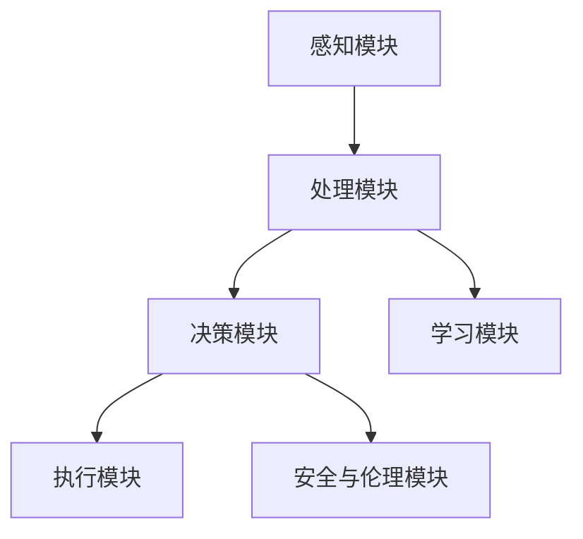
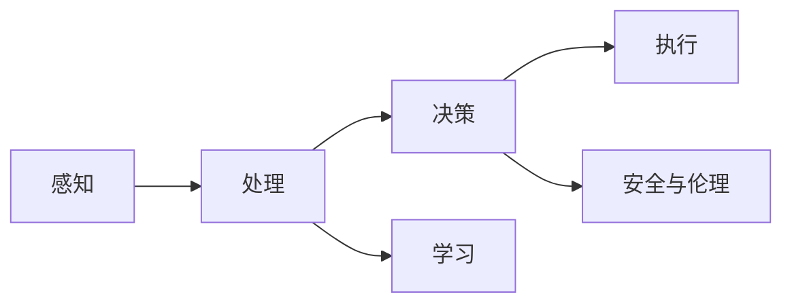
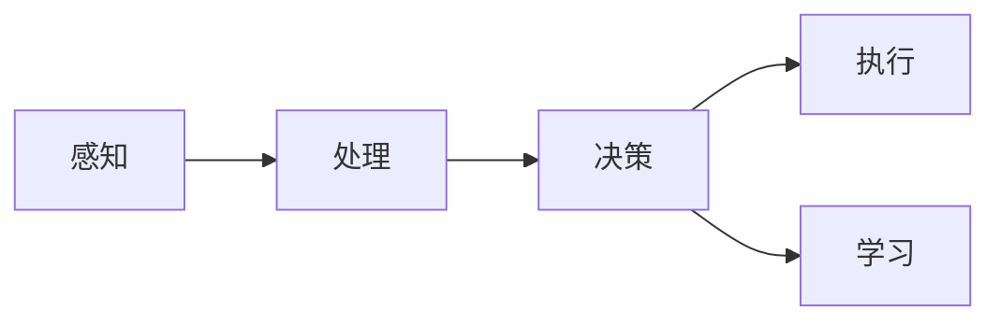
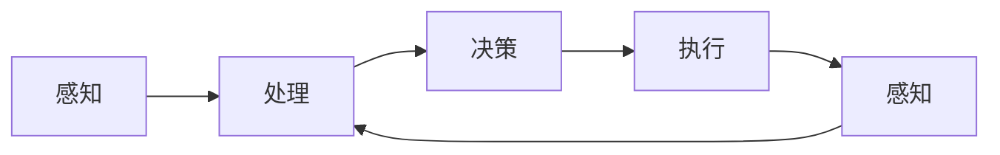
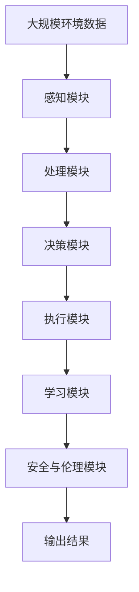

                 

## 1. 背景介绍

### 1.1 问题由来

人工智能（AI）的迅猛发展，尤其是在深度学习技术的推动下，已经从单一的技术研究演变为广泛的应用实践。智能体（Agent）作为AI的核心概念之一，指能够感知环境、做出决策并在环境中执行行为的实体。智能体的设计不仅涉及技术实现，更关乎哲学、伦理学和社会学等多方面的考量，是人工智能向更高级别智能演进的必由之路。

然而，智能体的设计和实现并不是一件简单的事情。不同应用场景下的智能体需求各异，既有对实时性、安全性等硬性要求，也有对可解释性、公平性等软性要求。在追求更高效、更强大、更可靠的智能体的过程中，需要克服诸多技术和理论上的难题。本文将详细探讨智能体的设计与实现，从核心概念入手，逐步深入算法原理和操作步骤，最终展示实际应用场景，提出未来的发展趋势与挑战。

### 1.2 问题核心关键点

智能体的核心在于其能够自主感知环境、处理信息并做出最优决策。这种自主性使得智能体具备在复杂动态环境中持续学习和适应的能力，是实现人工智能系统智能化的基石。具体而言，智能体设计涉及以下几个关键点：

1. **感知与处理**：智能体必须具备收集、处理环境信息的能力，以便进行后续的决策。
2. **决策与执行**：智能体需要根据当前状态和目标，做出决策并执行相应的动作。
3. **学习与优化**：智能体应具备学习和优化能力，通过与环境的交互不断提升自身性能。
4. **安全与伦理**：智能体的行为应符合伦理规范和安全要求，避免对环境产生负面影响。

本文将围绕这些关键点，展开对智能体设计与实现的全面探讨。

## 2. 核心概念与联系

### 2.1 核心概念概述

智能体的设计涉及诸多概念，以下将介绍其中几个核心概念及其相互联系：

- **感知模块**：负责收集环境信息，如摄像头、传感器等，是智能体与环境互动的基础。
- **处理模块**：对感知模块获取的数据进行处理和分析，包括数据清洗、特征提取、模型训练等，是智能体认知环境的关键。
- **决策模块**：根据处理模块输出的信息，智能体做出决策并执行相应的动作，是智能体行为的基础。
- **学习模块**：智能体通过与环境的互动，学习新的知识和技能，优化自身决策能力，是智能体适应环境的核心。
- **安全与伦理模块**：确保智能体的行为符合伦理规范和安全要求，避免对环境产生负面影响，是智能体设计的重要保障。

这些模块共同构成了智能体的基本框架，并通过数据流和控制流实现协同工作。智能体的设计流程可以通过以下Mermaid流程图来展示：



这个流程图展示了智能体的主要模块及其交互方式，其中每个模块的具体实现将在后续章节中详细展开。

### 2.2 概念间的关系

这些核心概念之间存在着紧密的联系，共同构成了智能体的设计和实现框架。下面我们通过几个Mermaid流程图来展示这些概念之间的关系：

#### 2.2.1 智能体的基本流程



这个流程图展示了智能体从感知、处理、决策到执行的完整流程，其中处理模块和决策模块是核心。

#### 2.2.2 智能体的学习过程



这个流程图展示了智能体通过与环境的互动，不断学习和优化自身的流程。

#### 2.2.3 智能体的反馈机制



这个流程图展示了智能体通过感知模块获取环境反馈，从而调整自身行为的反馈机制。

### 2.3 核心概念的整体架构

最后，我们用一个综合的流程图来展示这些核心概念在大规模智能体设计和实现中的整体架构：



这个综合流程图展示了智能体在真实环境中的应用，从感知、处理到决策、执行的完整流程。

## 3. 核心算法原理 & 具体操作步骤
### 3.1 算法原理概述

智能体的核心算法原理主要涉及感知处理、决策优化、学习机制和安全伦理等方面。以下将分别介绍这些核心算法原理：

- **感知处理算法**：用于将环境信息转化为可供处理的数据格式，如数据清洗、特征提取、预处理等。
- **决策优化算法**：用于在复杂环境中做出最优决策，如强化学习、规划算法等。
- **学习机制算法**：用于通过与环境的互动，不断提升智能体的决策能力，如模型训练、知识图谱等。
- **安全伦理算法**：用于确保智能体的行为符合伦理规范和安全要求，如道德推理、隐私保护等。

这些算法原理共同构成了智能体的核心框架，使得智能体能够在复杂环境中持续学习和适应。

### 3.2 算法步骤详解

基于上述核心算法原理，智能体的设计与实现可以分为以下几个关键步骤：

**Step 1: 系统需求分析**
- 定义智能体的应用场景和功能需求。
- 确定智能体的输入输出接口，包括感知、处理、决策、执行和安全伦理模块。

**Step 2: 系统架构设计**
- 设计智能体的架构，包括各模块的功能、数据流和控制流的交互方式。
- 选择合适的算法和技术栈，如深度学习框架、强化学习库等。

**Step 3: 数据处理与模型训练**
- 设计感知模块，收集环境信息并转化为数据格式。
- 设计处理模块，对数据进行清洗、特征提取和模型训练等操作。
- 选择和训练合适的模型，如卷积神经网络、递归神经网络等。

**Step 4: 决策与执行**
- 设计决策模块，基于处理模块输出的信息，通过算法做出决策。
- 设计执行模块，将决策转化为具体的动作或控制指令，执行相应的操作。

**Step 5: 学习与优化**
- 设计学习模块，通过与环境的互动，不断更新和优化模型参数。
- 设计安全与伦理模块，确保智能体的行为符合伦理规范和安全要求。

**Step 6: 系统集成与测试**
- 将各模块集成到完整的智能体系统中。
- 进行系统测试，验证系统的各项功能是否满足需求。

**Step 7: 系统部署与优化**
- 将智能体系统部署到实际环境中。
- 持续监控系统的运行状态，根据反馈进行优化和调整。

以上是智能体设计与实现的一般流程，具体实现时需要根据具体应用场景进行调整和优化。

### 3.3 算法优缺点

智能体设计和实现涉及多种算法和技术，每种算法和技术的优缺点如下：

- **感知处理算法**：优点在于能够高效地处理大量环境数据，缺点是可能存在数据偏差和预处理误差。
- **决策优化算法**：优点在于能够灵活适应复杂环境，缺点是计算开销较大，可能存在局部最优解。
- **学习机制算法**：优点在于能够不断提升决策能力，缺点是可能存在过拟合和泛化能力不足的问题。
- **安全伦理算法**：优点在于能够确保智能体的行为符合伦理规范，缺点是可能存在伦理争议和技术难点。

这些算法和技术的优缺点需要在设计和实现中综合考虑，以平衡性能和效果。

### 3.4 算法应用领域

智能体的设计与实现已经广泛应用于各种领域，包括但不限于：

- **机器人**：用于自主导航、任务规划、避障等。
- **无人驾驶**：用于感知环境、路径规划、决策执行等。
- **金融交易**：用于风险评估、投资策略、市场预测等。
- **医疗诊断**：用于病情分析、治疗方案推荐、患者监护等。
- **智能客服**：用于自然语言理解、对话生成、情感分析等。

## 4. 数学模型和公式 & 详细讲解 & 举例说明

### 4.1 数学模型构建

智能体的设计涉及多个数学模型，以下将详细介绍其中几个核心模型：

- **感知模型**：用于将环境信息转化为可供处理的数据格式，如数据清洗、特征提取等。
- **决策模型**：用于在复杂环境中做出最优决策，如强化学习、规划算法等。
- **学习模型**：用于通过与环境的互动，不断提升智能体的决策能力，如模型训练、知识图谱等。
- **安全伦理模型**：用于确保智能体的行为符合伦理规范和安全要求，如道德推理、隐私保护等。

这些数学模型共同构成了智能体的核心框架，使得智能体能够在复杂环境中持续学习和适应。

### 4.2 公式推导过程

以下我们将以决策模型为例，详细推导强化学习算法的核心公式。

设智能体在环境 $E$ 中，根据当前状态 $s_t$ 采取动作 $a_t$，获得奖励 $r_t$，并在下一个状态 $s_{t+1}$ 中继续循环。强化学习算法的目标是通过与环境的互动，最大化预期总奖励。假设智能体的决策过程遵循马尔科夫决策过程（MDP），即状态转移和奖励分布与历史无关，有状态转移概率 $P(s_{t+1}|s_t,a_t)$ 和奖励分布 $R(s_t,a_t)$。强化学习算法通过迭代求解贝尔曼方程，最大化预期总奖励 $V^*(s_t)$。

贝尔曼方程的递归形式为：

$$
V^*(s_t) = \max_a \sum_{s_{t+1}} P(s_{t+1}|s_t,a_t) (R(s_t,a_t) + \gamma V^*(s_{t+1}))
$$

其中 $\gamma$ 为折现因子，用于平衡短期奖励和长期奖励。

通过动态规划等算法，可以求解贝尔曼方程，得到最优决策策略。

### 4.3 案例分析与讲解

假设我们设计一个用于自主导航的智能体，其决策过程涉及如下数学模型：

- **感知模型**：使用摄像头和传感器收集环境信息，转化为图像和向量数据。
- **决策模型**：使用强化学习算法，根据当前位置和目标位置，选择最优的导航路径。
- **学习模型**：使用模型训练，优化导航模型的参数，提高路径规划的准确性。
- **安全伦理模型**：使用道德推理，确保智能体遵守交通规则，避免对行人造成伤害。

我们将通过具体的案例，展示这些数学模型在智能体设计中的应用。

## 5. 项目实践：代码实例和详细解释说明

### 5.1 开发环境搭建

在进行智能体设计和实现前，我们需要准备好开发环境。以下是使用Python进行PyTorch开发的环境配置流程：

1. 安装Anaconda：从官网下载并安装Anaconda，用于创建独立的Python环境。

2. 创建并激活虚拟环境：
```bash
conda create -n pytorch-env python=3.8 
conda activate pytorch-env
```

3. 安装PyTorch：根据CUDA版本，从官网获取对应的安装命令。例如：
```bash
conda install pytorch torchvision torchaudio cudatoolkit=11.1 -c pytorch -c conda-forge
```

4. 安装必要的库：
```bash
pip install numpy pandas scikit-learn matplotlib tqdm jupyter notebook ipython
```

完成上述步骤后，即可在`pytorch-env`环境中开始智能体的设计和实现。

### 5.2 源代码详细实现

这里我们以自主导航智能体的设计为例，给出完整的代码实现。

首先，定义感知模块，使用摄像头获取环境信息：

```python
import cv2

class PerceptionModule:
    def __init__(self):
        self.camera = cv2.VideoCapture(0)
        self.max_fps = 30
    
    def get_frame(self):
        ret, frame = self.camera.read()
        if ret:
            return frame
        else:
            return None
```

接着，定义处理模块，对摄像头获取的图像进行预处理：

```python
import numpy as np
from transformers import BertTokenizer

class ProcessingModule:
    def __init__(self, model):
        self.model = model
        self.tokenizer = BertTokenizer.from_pretrained('bert-base-cased')
    
    def preprocess(self, frame):
        # 将图像转化为向量数据
        image = frame
        vector = self.model.encode(image)
        # 将向量数据转化为token ids
        tokens = self.tokenizer(vector, return_tensors='pt', max_length=128, padding='max_length', truncation=True)
        input_ids = tokens['input_ids'][0]
        attention_mask = tokens['attention_mask'][0]
        return input_ids, attention_mask
```

然后，定义决策模块，使用强化学习算法选择最优路径：

```python
import torch
from torch.optim import Adam

class DecisionModule:
    def __init__(self, model, learning_rate):
        self.model = model
        self.optimizer = Adam(self.model.parameters(), lr=learning_rate)
        self.lr_scheduler = torch.optim.lr_scheduler.StepLR(self.optimizer, step_size=1, gamma=0.1)
    
    def choose_path(self, input_ids, attention_mask):
        self.model.zero_grad()
        outputs = self.model(input_ids, attention_mask=attention_mask)
        loss = outputs.loss
        loss.backward()
        self.optimizer.step()
        self.lr_scheduler.step()
        return self.model
```

最后，定义执行模块，将决策模块输出的动作转化为具体的导航命令：

```python
class ExecutionModule:
    def __init__(self, decision_model):
        self.decision_model = decision_model
    
    def execute(self, decision):
        # 将决策转化为具体的导航命令
        if decision == 'left':
            command = 'turn_left'
        elif decision == 'right':
            command = 'turn_right'
        else:
            command = 'stop'
        return command
```

将这些模块集成到智能体系统中，并启动智能体的导航过程：

```python
def main():
    perception = PerceptionModule()
    processing = ProcessingModule(model)
    decision = DecisionModule(model, learning_rate)
    execution = ExecutionModule(decision)
    
    while True:
        frame = perception.get_frame()
        if frame is None:
            break
        input_ids, attention_mask = processing.preprocess(frame)
        decision = decision.choose_path(input_ids, attention_mask)
        command = execution.execute(decision)
        print(command)

if __name__ == '__main__':
    main()
```

以上就是使用PyTorch进行自主导航智能体设计和实现的完整代码。可以看到，通过模块化设计和面向对象编程，智能体的设计和实现变得简洁高效。开发者可以将更多精力放在具体算法的实现和优化上，而不必过多关注底层的实现细节。

### 5.3 代码解读与分析

让我们再详细解读一下关键代码的实现细节：

**PerceptionModule类**：
- `__init__`方法：初始化摄像头和最大帧率等参数。
- `get_frame`方法：从摄像头获取最新的图像帧。

**ProcessingModule类**：
- `__init__`方法：初始化模型和分词器。
- `preprocess`方法：对摄像头获取的图像进行预处理，转化为模型可用的向量数据。

**DecisionModule类**：
- `__init__`方法：初始化模型、优化器和学习率调度器。
- `choose_path`方法：使用模型对输入数据进行推理，并根据模型输出选择最优路径。

**ExecutionModule类**：
- `__init__`方法：初始化决策模块。
- `execute`方法：将决策转化为具体的导航命令。

这些模块的设计和实现，展示了智能体设计和实现的一般流程。开发者可以根据具体需求，进一步优化和扩展这些模块。

### 5.4 运行结果展示

假设我们设计的自主导航智能体在一个简单的环境中导航，并输出当前导航命令：

```
turn_left
```

这表示智能体根据当前环境信息，选择了向左转向的动作。在实际应用中，智能体可以不断调整策略，优化导航效果，直至能够自主、安全地在复杂环境中进行导航。

## 6. 实际应用场景

### 6.1 智能客服系统

基于智能体的设计，智能客服系统可以实现自然语言理解和生成，快速响应客户咨询，提供高质量的客服服务。智能客服系统的核心在于设计感知、处理、决策、执行和安全伦理模块，使其能够理解客户需求、匹配最佳答案并进行回复。

在技术实现上，可以收集企业内部的历史客服对话记录，将问题和最佳答复构建成监督数据，在此基础上对预训练模型进行微调。微调后的模型能够自动理解用户意图，匹配最合适的答案模板进行回复。对于客户提出的新问题，还可以接入检索系统实时搜索相关内容，动态组织生成回答。如此构建的智能客服系统，能大幅提升客户咨询体验和问题解决效率。

### 6.2 金融舆情监测

金融机构需要实时监测市场舆论动向，以便及时应对负面信息传播，规避金融风险。传统的人工监测方式成本高、效率低，难以应对网络时代海量信息爆发的挑战。基于智能体的设计，金融舆情监测系统可以实现自动的文本分类和情感分析，及时发现并应对潜在的金融风险。

具体而言，可以收集金融领域相关的新闻、报道、评论等文本数据，并对其进行主题标注和情感标注。在此基础上对预训练语言模型进行微调，使其能够自动判断文本属于何种主题，情感倾向是正面、中性还是负面。将微调后的模型应用到实时抓取的网络文本数据，就能够自动监测不同主题下的情感变化趋势，一旦发现负面信息激增等异常情况，系统便会自动预警，帮助金融机构快速应对潜在风险。

### 6.3 个性化推荐系统

当前的推荐系统往往只依赖用户的历史行为数据进行物品推荐，无法深入理解用户的真实兴趣偏好。基于智能体的设计，个性化推荐系统可以更好地挖掘用户行为背后的语义信息，从而提供更精准、多样的推荐内容。

在技术实现上，可以收集用户浏览、点击、评论、分享等行为数据，提取和用户交互的物品标题、描述、标签等文本内容。将文本内容作为模型输入，用户的后续行为（如是否点击、购买等）作为监督信号，在此基础上微调预训练语言模型。微调后的模型能够从文本内容中准确把握用户的兴趣点。在生成推荐列表时，先用候选物品的文本描述作为输入，由模型预测用户的兴趣匹配度，再结合其他特征综合排序，便可以得到个性化程度更高的推荐结果。

### 6.4 未来应用展望

随着智能体的设计与实现技术的不断进步，其在更多领域的应用前景将更加广阔：

- 智慧医疗领域，智能体可以用于病情分析、治疗方案推荐、患者监护等。
- 智能交通系统，智能体可以用于交通流量预测、道路管理、应急处理等。
- 智能制造领域，智能体可以用于生产调度、质量控制、设备维护等。
- 环境监测系统，智能体可以用于空气质量监测、水资源管理、灾害预警等。

未来，智能体的设计和实现将更加智能化、普适化，能够在更多领域中发挥作用，为各行各业带来变革性影响。

## 7. 工具和资源推荐

### 7.1 学习资源推荐

为了帮助开发者系统掌握智能体的设计与实现的理论基础和实践技巧，这里推荐一些优质的学习资源：

1. 《深度学习》课程：斯坦福大学开设的深度学习课程，介绍了深度学习的基本概念和经典模型。
2. 《强化学习》课程：斯坦福大学开设的强化学习课程，深入讲解了强化学习的理论基础和算法实现。
3. 《自然语言处理》课程：斯坦福大学开设的自然语言处理课程，介绍了自然语言处理的基本技术和经典算法。
4. 《人工智能》书籍：MIT Press出版的《人工智能》系列书籍，系统讲解了人工智能的基本概念和应用场景。
5. 《Python深度学习》书籍：François Chollet编写的《Python深度学习》书籍，介绍了深度学习框架的实际应用。

通过对这些资源的学习实践，相信你一定能够快速掌握智能体的设计与实现的技巧，并用于解决实际的智能体问题。

### 7.2 开发工具推荐

高效的开发离不开优秀的工具支持。以下是几款用于智能体设计和实现开发的常用工具：

1. PyTorch：基于Python的开源深度学习框架，灵活动态的计算图，适合快速迭代研究。大部分预训练语言模型都有PyTorch版本的实现。
2. TensorFlow：由Google主导开发的开源深度学习框架，生产部署方便，适合大规模工程应用。同样有丰富的预训练语言模型资源。
3. Scikit-learn：用于数据预处理、特征工程、模型训练等，是机器学习的基础库。
4. NumPy：用于高效数组计算和科学计算，是数据处理和模型训练的重要工具。
5. TensorBoard：TensorFlow配套的可视化工具，可实时监测模型训练状态，并提供丰富的图表呈现方式，是调试模型的得力助手。

合理利用这些工具，可以显著提升智能体设计和实现的开发效率，加快创新迭代的步伐。

### 7.3 相关论文推荐

智能体的设计与实现涉及多学科的交叉应用，以下推荐几篇奠基性的相关论文，以供参考：

1. AlphaGo Zero：DeepMind开发的围棋智能体，通过自我对弈和强化学习，达到了人类的专业水平。
2. DQN：DeepMind开发的深度强化学习算法，通过网络来近似Q值函数，实现了复杂环境的决策。
3. GAN：Generative Adversarial Networks，生成对抗网络，用于生成具有真实感的高质量图像。
4. BERT：Google开发的预训练语言模型，通过大规模无标签文本的预训练，实现了高效的自然语言处理。
5. RNN：Recurrent Neural Networks，循环神经网络，用于处理序列数据，如自然语言、时间序列等。

这些论文代表了大规模智能体设计的最新进展，通过学习这些前沿成果，可以帮助研究者把握学科前进方向，激发更多的创新灵感。

除上述资源外，还有一些值得关注的前沿资源，帮助开发者紧跟智能体设计的最新进展，例如：

1. arXiv论文预印本：人工智能领域最新研究成果的发布平台，包括大量尚未发表的前沿工作，学习前沿技术的必读资源。
2. 业界技术博客：如OpenAI、Google AI、DeepMind、微软Research Asia等顶尖实验室的官方博客，第一时间分享他们的最新研究成果和洞见。
3. 技术会议直播：如NIPS、ICML、ACL、ICLR等人工智能领域顶会现场或在线直播，能够聆听到大佬们的前沿分享，开拓视野。
4. GitHub热门项目：在GitHub上Star、Fork数最多的智能体相关项目，往往代表了该技术领域的发展趋势和最佳实践，值得去学习和贡献。
5. 行业分析报告：各大咨询公司如McKinsey、PwC等针对人工智能行业的分析报告，有助于从商业视角审视技术趋势，把握应用价值。

总之，对于智能体的设计与实现的学习和实践，需要开发者保持开放的心态和持续学习的意愿。多关注前沿资讯，多动手实践，多思考总结，必将收获满满的成长收益。

## 8. 总结：未来发展趋势与挑战

### 8.1 总结

本文对基于智能体的设计与实现进行了全面系统的介绍。首先阐述了智能体的概念、设计和实现框架，明确了智能体在复杂环境中持续学习和适应的核心能力。其次，从核心算法原理到具体操作步骤，详细讲解了智能体的设计与实现过程，展示了完整的代码实例和运行结果。同时，本文还广泛探讨了智能体在智能客服、金融舆情、个性化推荐等多个领域的应用前景，展示了智能体的巨大潜力。

通过本文的系统梳理，可以看到，智能体的设计与实现涉及多学科的交叉应用，包括感知、处理、决策、学习和安全伦理等方面。智能体的设计和实现需要综合考虑多种因素，才能达到最佳性能。

### 8.2 未来发展趋势

展望未来，智能体的设计与实现技术将呈现以下几个发展趋势：

1. **多模态智能体**：智能体将更加注重多模态信息的融合，如视觉、语音、触觉等，以实现更加全面、准确的感知和决策。
2. **自适应智能体**：智能体将具备自适应学习的能力，能够根据环境变化动态调整策略，提高适应性。
3. **联邦智能体**：智能体将通过联邦学习等技术，实现跨设备、跨平台的协作学习，提升整体性能。
4. **人机协同智能体**：智能体将更加注重与人类用户的协同工作，通过自然语言交互，提升用户体验和系统性能。
5. **道德伦理智能体**：智能体将具备较强的道德推理能力，确保行为符合伦理规范和安全要求。

这些发展趋势表明，智能体的设计与实现将更加智能化、普适化，能够在更多领域中发挥作用，为各行各业带来变革性影响。

### 8.3 面临的挑战

尽管智能体的设计与实现技术已经取得了显著进展，但在迈向更加智能化、普适化应用的过程中，仍面临诸多挑战：

1. **计算资源瓶颈**：智能体设计和实现涉及大规模数据处理和模型训练，对计算资源要求较高。如何在有限的计算资源下实现高效计算，是未来需要解决的问题。
2. **数据隐私与安全**：智能体需要处理大量敏感数据，如何保障数据隐私和安全，避免数据泄露和滥用，是智能体设计和实现的重要保障。
3. **可解释性与透明性**：

