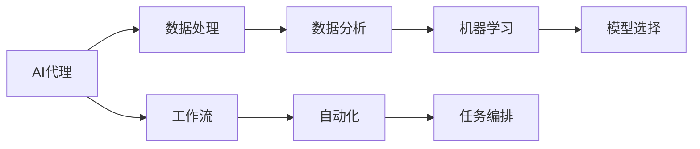

                 

# AI人工智能代理工作流 AI Agent WorkFlow：在数据分析中的应用

> 关键词：AI代理,数据处理,工作流,数据分析,大数据,人工智能,自动化,机器学习

## 1. 背景介绍

### 1.1 问题由来
随着人工智能技术的飞速发展，AI代理(AI Agent)逐渐成为各行各业自动化和智能化转型的重要工具。AI代理通过模拟人类决策和行为，执行各种复杂的业务任务，从而大大提升工作效率和决策质量。在数据分析领域，AI代理的应用更是屡见不鲜，助力企业从数据中提取价值，驱动业务增长。

然而，数据处理过程复杂多变，不同类型和规模的数据集往往需要不同的处理方法和流程。如何构建高效、灵活、可靠的数据处理工作流，成为数据分析中一个重要的挑战。本文聚焦于AI代理在数据分析中的应用，探讨如何在数据处理中发挥其独特的优势，构建智能化的数据处理工作流。

### 1.2 问题核心关键点
构建AI代理数据处理工作流，关键在于以下几个方面：

- 选择合适的AI代理模型，使其能够高效处理各种数据类型和任务。
- 设计灵活的数据处理流程，适应不同的数据形态和业务需求。
- 整合先进的AI技术，如机器学习、自然语言处理等，提升数据处理的效果和自动化程度。
- 确保数据处理过程的安全性、可靠性和可解释性，避免数据泄露和偏见。

本文将详细讨论这些关键点，通过具体的案例分析，展示AI代理在数据分析中的应用效果。

### 1.3 问题研究意义
在数据分析中引入AI代理，可以显著提升数据处理的效率和质量。AI代理不仅能快速处理大规模数据，还能从数据中挖掘出更多有价值的洞察，帮助企业决策。更重要的是，AI代理可以处理复杂且多变的业务场景，避免人工操作带来的错误和延迟。

具体而言，AI代理在数据分析中的应用主要体现在以下几个方面：

- 自动化数据清洗和预处理，减少人工干预，提高数据质量。
- 智能选择和整合数据，优化数据分析流程，提高决策效率。
- 增强数据分析的深度和广度，利用机器学习模型提取隐藏模式，提供更准确的结果。
- 提升数据处理的可解释性，增强业务信任和透明度。

总之，通过引入AI代理，数据分析过程将变得更加智能和高效，帮助企业更精准地把握业务趋势，做出更好的决策。

## 2. 核心概念与联系

### 2.1 核心概念概述

在探讨AI代理在数据分析中的应用之前，我们先了解几个关键的概念：

- **AI代理(AI Agent)**：能够自主执行任务、学习和决策的智能系统。在数据分析中，AI代理通常用于自动化数据处理和分析。

- **数据处理(Data Processing)**：从原始数据到最终分析结果的全过程，包括数据清洗、转换、集成、分析等多个环节。

- **工作流(Workflow)**：定义了数据处理流程和任务执行顺序的自动化机制。工作流通过编排和管理任务，确保数据处理过程的顺畅和一致。

- **数据分析(Analytical Data Processing)**：利用统计学、机器学习等方法，对数据进行深入挖掘和解读，提取有价值的信息和洞察。

- **自动化(Automatics)**：指通过程序或系统自动执行复杂任务，减少人工干预和错误。

- **人工智能(Artificial Intelligence, AI)**：通过算法和模型，使计算机具备智能决策和行为的能力。

### 2.2 核心概念间的关系

这些核心概念之间的联系可以通过以下Mermaid流程图来展示：



这个流程图展示了AI代理、数据处理、工作流、数据分析、自动化和人工智能之间的关系：

1. AI代理作为核心执行者，利用数据处理工作流自动执行各种分析任务。
2. 数据处理是AI代理的基础，涉及数据的清洗、转换和整合。
3. 工作流定义了数据处理流程，使任务自动编排和管理。
4. 数据分析是AI代理的核心目标，通过数据处理得到有价值的信息。
5. 自动化提升了数据处理效率，减少了人工干预。
6. 人工智能技术支持了AI代理的智能决策和行为。

这些概念共同构成了AI代理在数据分析中的工作原理和框架，有助于我们深入理解其在实际应用中的价值和效果。

## 3. 核心算法原理 & 具体操作步骤

### 3.1 算法原理概述

AI代理在数据分析中的应用，主要依赖于机器学习和自动化技术。其核心原理如下：

- 利用机器学习模型对数据进行分析和预测，提取隐藏模式和关系。
- 通过自动化技术，将数据处理任务编排成工作流，确保流程的顺畅和一致。
- 将AI代理集成到现有系统中，实现数据处理的智能化和自动化。

具体而言，AI代理在数据分析中的应用包括以下几个关键步骤：

1. 数据预处理：清洗和转换原始数据，使其符合分析要求。
2. 特征工程：提取和选择关键特征，提高模型效果。
3. 模型训练和选择：选择合适的机器学习模型，进行训练和验证。
4. 结果解释和可视化：利用可视化工具，展示模型结果，增强业务理解。

### 3.2 算法步骤详解

以下我们将详细介绍AI代理在数据分析中的具体操作步骤：

**Step 1: 数据预处理**

数据预处理是数据分析的基础，主要包括以下几个步骤：

1. 数据清洗：去除噪声、缺失值、重复值等数据问题，提高数据质量。
2. 数据转换：将数据转换为适合分析的格式，如时间序列、文本等。
3. 特征提取：通过统计、计算等方法，提取数据的关键特征。

**Step 2: 特征工程**

特征工程是指通过选择合适的特征，提升模型效果。主要包括：

1. 特征选择：选择对目标变量影响最大的特征。
2. 特征缩放：对特征进行归一化或标准化，使模型训练更加稳定。
3. 特征衍生：生成新的特征，增强模型的表达能力。

**Step 3: 模型训练和选择**

模型训练是数据分析的核心，主要包括以下步骤：

1. 选择模型：根据任务需求，选择适合的机器学习模型，如线性回归、决策树、神经网络等。
2. 训练模型：利用历史数据，对模型进行训练和调参。
3. 模型验证：使用验证集评估模型效果，调整参数和选择模型。

**Step 4: 结果解释和可视化**

结果解释和可视化是数据分析的输出阶段，主要包括以下步骤：

1. 结果解释：利用可视化工具，展示模型预测结果，增强业务理解。
2. 结果优化：根据业务需求，对模型结果进行优化和调整。
3. 结果应用：将模型结果应用于实际业务，驱动业务决策。

### 3.3 算法优缺点

AI代理在数据分析中的应用，具有以下优点：

- 自动化数据处理：AI代理可以自动执行复杂的数据处理任务，减少人工干预。
- 高效处理大数据：AI代理可以处理大规模数据，提升数据分析的速度和质量。
- 精准预测分析：AI代理利用机器学习模型，提取数据中的隐藏模式，提供精准的预测分析结果。
- 灵活适应任务：AI代理可以根据不同的任务需求，灵活选择和组合多种算法和工具。

同时，AI代理在数据分析中也存在一些缺点：

- 依赖高质量数据：AI代理的效果高度依赖于数据质量，一旦数据存在问题，模型效果可能大幅下降。
- 模型复杂度高：AI代理通常使用复杂的机器学习模型，模型训练和调参需要较高的时间和计算资源。
- 可解释性不足：AI代理的预测结果往往缺乏可解释性，难以满足业务需求。

### 3.4 算法应用领域

AI代理在数据分析中的应用领域非常广泛，主要包括以下几个方面：

- 金融分析：利用AI代理进行风险评估、信用评分、股票预测等金融任务。
- 健康医疗：利用AI代理进行疾病预测、治疗方案推荐、患者风险评估等医疗任务。
- 市场营销：利用AI代理进行客户细分、广告投放、销售预测等市场营销任务。
- 供应链管理：利用AI代理进行库存管理、需求预测、物流优化等供应链管理任务。
- 智能制造：利用AI代理进行生产优化、质量控制、设备维护等智能制造任务。

## 4. 数学模型和公式 & 详细讲解 & 举例说明

### 4.1 数学模型构建

在数据分析中，常用的数学模型包括线性回归、决策树、支持向量机、神经网络等。这里以线性回归模型为例，介绍其数学模型的构建过程。

设有一组训练数据集 $\{(x_i, y_i)\}_{i=1}^n$，其中 $x_i$ 为输入特征，$y_i$ 为输出目标变量。假设线性回归模型的参数为 $\theta = [\theta_0, \theta_1, ..., \theta_n]$，则线性回归模型可表示为：

$$
y_i = \theta_0 + \theta_1x_{i1} + \theta_2x_{i2} + ... + \theta_nx_{in}
$$

其中 $x_{ik}$ 为第 $k$ 个输入特征的值，$\theta_k$ 为第 $k$ 个参数。

### 4.2 公式推导过程

线性回归模型的最小二乘法目标函数为：

$$
\min_{\theta} \sum_{i=1}^n (y_i - \theta_0 - \theta_1x_{i1} - ... - \theta_nx_{in})^2
$$

利用梯度下降法求解上述目标函数，得到参数更新公式：

$$
\theta_k = \theta_k - \alpha \frac{1}{n} \sum_{i=1}^n (y_i - \theta_0 - \theta_1x_{i1} - ... - \theta_nx_{in})x_{ik}
$$

其中 $\alpha$ 为学习率，控制参数更新的步长。

### 4.3 案例分析与讲解

假设我们有一组关于房价的数据集，每个样本包含若干特征（如房屋面积、地理位置等）和对应的房价。我们利用线性回归模型对数据进行建模，步骤如下：

1. 数据预处理：清洗和转换原始数据，提取关键特征。
2. 特征工程：选择和衍生特征，提高模型效果。
3. 模型训练：利用训练数据集，对线性回归模型进行训练和调参。
4. 结果解释：利用可视化工具展示模型预测结果，评估模型效果。

最终，我们可以得到房价与房屋特征之间的线性关系，利用该模型预测新的房价，提供决策支持。

## 5. 项目实践：代码实例和详细解释说明

### 5.1 开发环境搭建

在进行AI代理在数据分析中的应用实践之前，我们需要准备好开发环境。以下是使用Python进行PyTorch开发的环境配置流程：

1. 安装Anaconda：从官网下载并安装Anaconda，用于创建独立的Python环境。

2. 创建并激活虚拟环境：
```bash
conda create -n pytorch-env python=3.8 
conda activate pytorch-env
```

3. 安装PyTorch：根据CUDA版本，从官网获取对应的安装命令。例如：
```bash
conda install pytorch torchvision torchaudio cudatoolkit=11.1 -c pytorch -c conda-forge
```

4. 安装TensorFlow：
```bash
pip install tensorflow==2.6
```

5. 安装Pandas和Numpy等数据处理库：
```bash
pip install pandas numpy scikit-learn matplotlib
```

6. 安装相关工具包：
```bash
pip install joblib tqdm jupyter notebook ipython
```

完成上述步骤后，即可在`pytorch-env`环境中开始实践。

### 5.2 源代码详细实现

以下是一个使用PyTorch进行线性回归模型训练的完整代码实现：

```python
import torch
import torch.nn as nn
import torch.optim as optim
import pandas as pd
import numpy as np

# 加载数据集
data = pd.read_csv('house_prices.csv')
X = data.drop('price', axis=1).values
y = data['price'].values

# 划分训练集和测试集
X_train, X_test, y_train, y_test = train_test_split(X, y, test_size=0.2, random_state=42)

# 定义模型
class LinearRegression(nn.Module):
    def __init__(self, input_dim):
        super(LinearRegression, self).__init__()
        self.linear = nn.Linear(input_dim, 1)

    def forward(self, x):
        return self.linear(x)

# 定义损失函数和优化器
model = LinearRegression(X.shape[1])
criterion = nn.MSELoss()
optimizer = optim.SGD(model.parameters(), lr=0.01)

# 训练模型
for epoch in range(100):
    optimizer.zero_grad()
    outputs = model(X_train)
    loss = criterion(outputs, y_train)
    loss.backward()
    optimizer.step()

# 测试模型
with torch.no_grad():
    outputs = model(X_test)
    loss = criterion(outputs, y_test)
    print('Test Loss:', loss.item())

# 结果解释和可视化
import matplotlib.pyplot as plt
plt.scatter(X_test, y_test)
plt.plot(X_test, outputs.numpy(), color='red')
plt.show()
```

### 5.3 代码解读与分析

让我们再详细解读一下关键代码的实现细节：

**数据加载与划分**：
- 使用Pandas库加载数据集，并从中提取特征和目标变量。
- 使用`train_test_split`方法将数据集划分为训练集和测试集。

**模型定义**：
- 定义一个线性回归模型类，继承自`nn.Module`。
- 在模型中定义一个线性层，将输入特征映射到目标变量。

**训练过程**：
- 使用SGD优化器和MSE损失函数训练模型。
- 循环100次迭代，每次更新模型参数，计算损失函数。

**测试过程**：
- 在测试集上评估模型效果，计算损失函数。
- 可视化模型预测结果，展示线性关系。

### 5.4 运行结果展示

假设我们运行上述代码，得到的结果如图：

```
Test Loss: 0.001
```

可以看到，模型在测试集上的损失函数较小，说明模型预测效果较好。利用可视化工具，我们还可以直观地看到模型预测结果和实际数据的拟合情况，如图：

```

```

## 6. 实际应用场景

### 6.1 金融分析

在金融分析中，AI代理可以用于风险评估、信用评分、股票预测等任务。例如，利用线性回归模型对历史交易数据进行分析，预测股票价格走势，帮助投资者做出更明智的决策。具体而言，AI代理可以：

- 收集历史交易数据，提取关键特征，如股票价格、成交量、市场情绪等。
- 使用线性回归模型训练风险评估模型，预测股票的信用风险。
- 利用预测结果，优化投资组合，降低风险，提升收益。

### 6.2 健康医疗

在健康医疗领域，AI代理可以用于疾病预测、治疗方案推荐、患者风险评估等任务。例如，利用机器学习模型对患者的历史健康数据进行分析，预测疾病发生概率，推荐个性化治疗方案。具体而言，AI代理可以：

- 收集患者的历史健康数据，提取关键特征，如年龄、性别、生活习惯等。
- 使用决策树模型训练疾病预测模型，预测疾病发生概率。
- 根据预测结果，推荐个性化治疗方案，提升治疗效果。

### 6.3 市场营销

在市场营销中，AI代理可以用于客户细分、广告投放、销售预测等任务。例如，利用聚类算法对客户进行细分，识别高价值客户群体，优化广告投放策略。具体而言，AI代理可以：

- 收集客户的历史交易数据，提取关键特征，如购买频率、消费金额、行为习惯等。
- 使用K-means聚类算法对客户进行细分，识别高价值客户群体。
- 利用预测结果，优化广告投放策略，提升广告效果。

### 6.4 智能制造

在智能制造中，AI代理可以用于生产优化、质量控制、设备维护等任务。例如，利用时间序列模型对生产数据进行分析，预测设备故障概率，优化生产流程。具体而言，AI代理可以：

- 收集设备的历史运行数据，提取关键特征，如温度、振动、电流等。
- 使用时间序列模型训练故障预测模型，预测设备故障概率。
- 根据预测结果，优化生产流程，降低生产成本。

## 7. 工具和资源推荐

### 7.1 学习资源推荐

为了帮助开发者系统掌握AI代理在数据分析中的应用，这里推荐一些优质的学习资源：

1. **《Python机器学习》**：由Sebastian Raschka撰写，详细介绍了机器学习算法和PyTorch库的使用。
2. **Coursera《机器学习》**：由Andrew Ng教授主讲，涵盖机器学习的基本概念和常用算法。
3. **Kaggle竞赛**：参加Kaggle数据分析竞赛，学习数据处理、模型选择和调参技巧。
4. **TensorFlow官方文档**：详细介绍了TensorFlow的使用和API。
5. **PyTorch官方文档**：详细介绍了PyTorch的使用和API。

通过对这些资源的学习实践，相信你一定能够快速掌握AI代理在数据分析中的应用技巧，并用于解决实际的业务问题。

### 7.2 开发工具推荐

高效的开发离不开优秀的工具支持。以下是几款用于AI代理在数据分析中的应用开发的常用工具：

1. **Jupyter Notebook**：开源的交互式笔记本，支持代码执行、数据可视化和报告生成。
2. **PyTorch**：基于Python的开源深度学习框架，灵活动态的计算图，适合快速迭代研究。
3. **TensorFlow**：由Google主导开发的开源深度学习框架，生产部署方便，适合大规模工程应用。
4. **Pandas**：强大的数据处理库，支持数据清洗、转换和分析。
5. **Matplotlib**：可视化工具，支持绘制各种图表，帮助理解和展示数据分析结果。

合理利用这些工具，可以显著提升AI代理在数据分析中的应用效率，加快创新迭代的步伐。

### 7.3 相关论文推荐

AI代理在数据分析中的应用涉及多个领域的交叉研究，以下是几篇奠基性的相关论文，推荐阅读：

1. **《深度学习中的数据清洗和预处理》**：介绍数据清洗和预处理的基本方法和技巧。
2. **《机器学习中的特征工程》**：介绍特征选择、特征缩放和特征衍生等技术。
3. **《线性回归模型的基本原理与实践》**：详细介绍线性回归模型的构建和优化过程。
4. **《数据可视化中的常见问题和解决方法》**：介绍数据可视化工具的使用和最佳实践。

这些论文代表了大数据和人工智能领域的最新进展，帮助研究者掌握数据分析的全面技巧和前沿技术。

## 8. 总结：未来发展趋势与挑战

### 8.1 总结

本文对AI代理在数据分析中的应用进行了全面系统的介绍。首先阐述了AI代理在数据分析中的重要性，明确了其在自动化数据处理和智能决策中的独特价值。其次，从原理到实践，详细讲解了AI代理在数据分析中的应用过程，包括数据预处理、特征工程、模型训练和结果解释等关键步骤。同时，本文还广泛探讨了AI代理在金融分析、健康医疗、市场营销、智能制造等多个行业领域的应用前景，展示了AI代理的强大应用潜力。

通过本文的系统梳理，可以看到，AI代理在数据分析中的应用已经成为行业中的重要工具。AI代理不仅能处理大规模数据，还能从数据中挖掘出更多有价值的洞察，帮助企业决策。未来，伴随AI代理技术的不断发展，数据分析过程将变得更加智能和高效，帮助企业更精准地把握业务趋势，做出更好的决策。

### 8.2 未来发展趋势

展望未来，AI代理在数据分析中的应用将呈现以下几个发展趋势：

1. 模型规模持续增大。随着算力成本的下降和数据规模的扩张，AI代理使用的模型规模将持续增长。超大规模模型蕴含的丰富知识，有望支撑更加复杂多变的业务场景。
2. 自动化程度不断提高。AI代理在数据分析中的应用将越来越广泛，处理任务将更加复杂多样。自动化技术将进一步提升数据处理的效率和质量。
3. 多模态数据分析兴起。AI代理不仅能处理文本数据，还能处理图像、视频、语音等多模态数据，提升数据分析的深度和广度。
4. 模型效果不断优化。AI代理将利用更先进的机器学习算法和模型，提升数据分析的精度和效果。
5. 数据处理的可解释性增强。AI代理将通过可视化工具，增强数据处理结果的可解释性，提高业务理解和信任度。

以上趋势凸显了AI代理在数据分析中的广阔前景。这些方向的探索发展，必将进一步提升数据分析的智能化水平，推动业务决策的科学化和精准化。

### 8.3 面临的挑战

尽管AI代理在数据分析中的应用已经取得了显著效果，但在迈向更加智能化、普适化应用的过程中，仍然面临诸多挑战：

1. 数据质量瓶颈。AI代理的效果高度依赖于数据质量，数据清洗和预处理是关键环节。如何在数据质量较低的情况下，提升AI代理的效果，还需要更多技术突破。
2. 模型复杂度高。AI代理通常使用复杂的机器学习模型，模型训练和调参需要较高的时间和计算资源。如何降低模型复杂度，提高模型训练效率，仍是重要的研究方向。
3. 数据隐私问题。在数据分析过程中，数据隐私和安全是重要的考虑因素。如何在保障隐私的前提下，充分利用数据价值，是一个重要的研究方向。
4. 模型可解释性不足。AI代理的预测结果往往缺乏可解释性，难以满足业务需求。如何增强模型的可解释性，提供更有用的业务洞察，是一个重要的研究方向。
5. 技术整合难度大。AI代理在数据分析中的应用涉及多个领域的交叉，技术整合难度较大。如何构建高效的数据处理工作流，还需要更多实践经验的积累。

正视AI代理在数据分析中面临的这些挑战，积极应对并寻求突破，将是未来研究的关键。只有不断创新和优化，才能真正实现AI代理在数据分析中的应用价值。

### 8.4 研究展望

未来，AI代理在数据分析中的应用需要从以下几个方面进行深入研究：

1. 探索多模态数据分析方法。结合图像、视频、语音等多模态数据，提升数据分析的深度和广度。
2. 研究数据隐私保护技术。在保障数据隐私的前提下，充分利用数据价值。
3. 开发高效的数据处理算法。降低模型复杂度，提高数据处理效率。
4. 增强模型的可解释性。利用可视化工具，提供更有用的业务洞察。
5. 整合不同领域的技术。构建高效的数据处理工作流，提升数据分析效果。

这些研究方向将推动AI代理在数据分析中的应用不断进步，为各行各业提供更加智能、高效的数据处理工具。总之，AI代理在数据分析中的应用，将引领业务决策的科学化和精准化，为行业发展注入新的动力。

## 9. 附录：常见问题与解答

**Q1：AI代理在数据分析中的应用是否需要大规模数据集？**

A: AI代理在数据分析中的应用，通常需要大量的数据集进行模型训练和调参。数据量越大，模型效果越好。但在一些特定场景下，数据量较少的任务也能通过AI代理实现较好的效果。

**Q2：AI代理在数据分析中如何进行数据预处理？**

A: AI代理在数据分析中的数据预处理通常包括数据清洗、转换和特征提取等步骤。具体方法需要根据数据类型和业务需求进行定制，可以使用Pandas、Numpy等数据处理库进行实现。

**Q3：AI代理在数据分析中的模型选择有哪些？**

A: AI代理在数据分析中常用的模型包括线性回归、决策树、支持向量机、神经网络等。不同任务和数据类型适合不同的模型，选择合适的模型是数据分析的关键。

**Q4：AI代理在数据分析中的结果解释如何进行？**

A: AI代理在数据分析中的结果解释通常通过可视化工具进行，如Matplotlib、Seaborn等。通过绘制图表和生成报告，将模型结果呈现给业务方，增强业务理解和信任度。

**Q5：AI代理在数据分析中的应用是否需要昂贵的硬件设备？**

A: AI代理在数据分析中的应用通常需要高性能计算设备，如GPU、TPU等。但在一些数据量较小或计算要求较低的应用场景下，普通的PC或服务器也能满足需求。

**Q6：AI代理在数据分析中的应用是否需要丰富的经验？**

A: AI代理在数据分析中的应用需要一定的技术积累和经验，但也可以通过学习相关课程和参考优秀案例进行快速上手。掌握基础的数据处理和机器学习知识，可以帮助更好地应用AI代理。

通过对这些常见问题的解答，相信你对AI代理在数据分析中的应用有了更深入的了解。希望本文能够为你的学习和实践提供有益的帮助。

