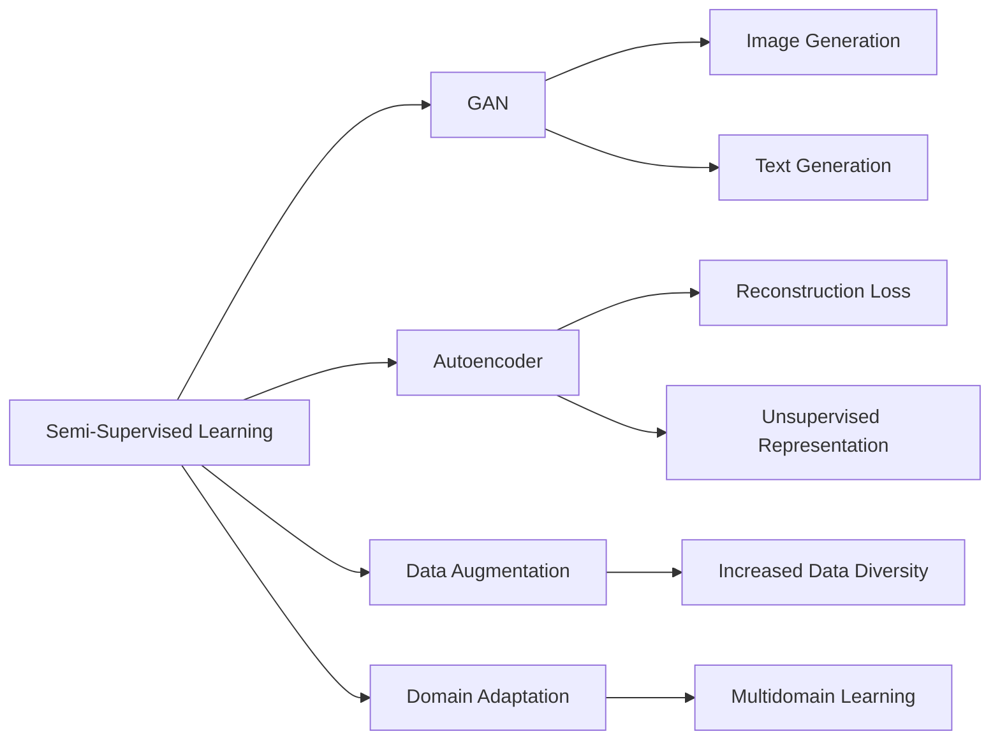
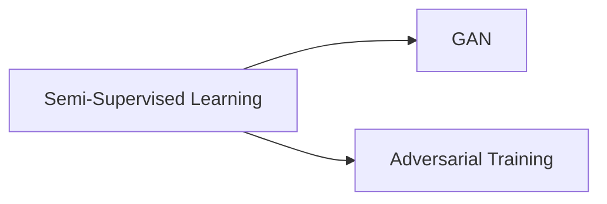
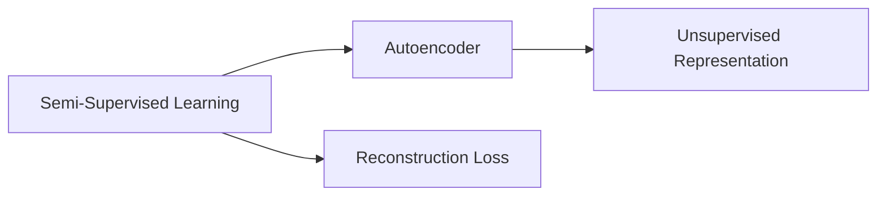
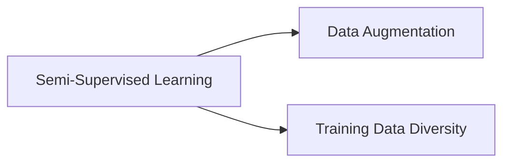
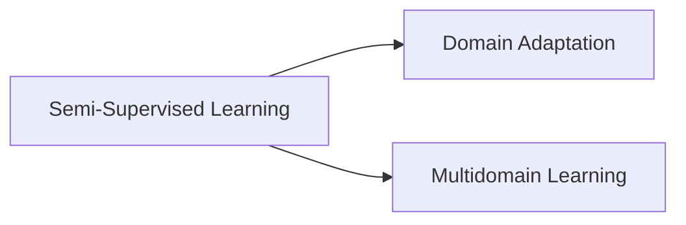
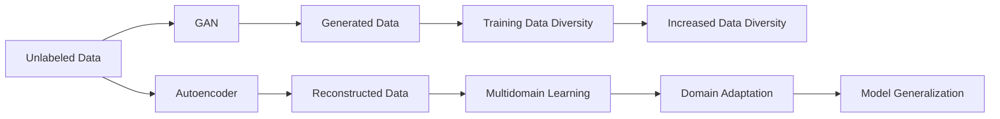

                 

# AI人工智能核心算法原理与代码实例讲解：半监督学习

> 关键词：半监督学习,生成对抗网络(GAN),自编码器(AE),数据增强,领域自适应,实际应用场景

## 1. 背景介绍

### 1.1 问题由来
在深度学习时代，标注数据的获取成本昂贵且耗时。半监督学习（Semi-Supervised Learning）应运而生，利用少量标注数据和大量未标注数据提升模型性能。半监督学习能够利用未标注数据的先验信息，降低标注成本，提升泛化能力，广泛应用于计算机视觉、自然语言处理等领域。

### 1.2 问题核心关键点
半监督学习是一种混合学习方式，综合利用有标签数据和无标签数据。常见方法包括生成对抗网络（GAN）、自编码器（AE）等。这些方法通过在未标注数据上训练生成模型或重构模型，将其与有标签数据进行联合训练，从而提升模型对新数据的学习能力。

### 1.3 问题研究意义
半监督学习的研究不仅能够降低标注成本，还能提升模型泛化能力，广泛应用于图像分类、文本生成、语音识别等领域。它能够解决标注数据不足的问题，增强模型对真实数据的适应能力，加速AI技术在更多场景中的应用。

## 2. 核心概念与联系

### 2.1 核心概念概述

为更好地理解半监督学习，本节将介绍几个密切相关的核心概念：

- **半监督学习（Semi-Supervised Learning）**：在少量标注数据和大量未标注数据的混合数据集上进行学习的方法。半监督学习能够更好地利用未标注数据的先验信息，提升模型泛化能力。

- **生成对抗网络（GAN）**：由生成器和判别器组成的模型，通过对抗训练提升生成器的生成能力。GAN在图像生成、文本生成等领域有广泛应用。

- **自编码器（AE）**：能够学习输入数据的压缩表示的模型。通过重构损失函数将未标注数据转换为高维表示，用于提升模型学习能力。

- **数据增强（Data Augmentation）**：通过对已有数据进行变换，产生新的训练样本，增加数据多样性，提升模型鲁棒性。

- **领域自适应（Domain Adaptation）**：在多个领域的数据上进行学习，提升模型在不同领域的泛化能力。

- **实际应用场景**：半监督学习广泛应用于图像分类、文本生成、语音识别等领域，增强了模型对新数据的学习能力。

这些核心概念之间的逻辑关系可以通过以下Mermaid流程图来展示：



这个流程图展示了半监督学习的核心概念及其之间的关系：

1. 半监督学习综合利用有标签数据和无标签数据。
2. 生成对抗网络利用对抗训练提升生成器的生成能力，用于生成新数据。
3. 自编码器通过重构损失函数将未标注数据转换为高维表示，用于提升模型学习能力。
4. 数据增强通过对已有数据进行变换，增加数据多样性。
5. 领域自适应在多个领域的数据上进行学习，提升模型在不同领域的泛化能力。

### 2.2 概念间的关系

这些核心概念之间存在着紧密的联系，形成了半监督学习的完整生态系统。下面我通过几个Mermaid流程图来展示这些概念之间的关系。

#### 2.2.1 半监督学习与生成对抗网络



这个流程图展示了半监督学习与生成对抗网络之间的关系。半监督学习可以利用生成对抗网络提升生成器的生成能力，从而生成更多训练样本。

#### 2.2.2 自编码器与半监督学习



这个流程图展示了自编码器与半监督学习之间的关系。自编码器通过重构损失函数将未标注数据转换为高维表示，用于提升模型学习能力。

#### 2.2.3 数据增强与半监督学习



这个流程图展示了数据增强与半监督学习之间的关系。数据增强通过对已有数据进行变换，增加数据多样性，提升模型鲁棒性。

#### 2.2.4 领域自适应与半监督学习



这个流程图展示了领域自适应与半监督学习之间的关系。领域自适应在多个领域的数据上进行学习，提升模型在不同领域的泛化能力。

### 2.3 核心概念的整体架构

最后，我们用一个综合的流程图来展示这些核心概念在大语言模型微调过程中的整体架构：



这个综合流程图展示了从未标注数据到模型泛化的完整过程。

## 3. 核心算法原理 & 具体操作步骤
### 3.1 算法原理概述

半监督学习主要通过利用少量标注数据和大量未标注数据进行联合训练，提升模型的泛化能力。其核心思想是：在少量标注数据上进行监督学习，同时利用未标注数据进行自监督学习，最终得到泛化能力更强的模型。

形式化地，假设半监督学习的数据集 $D=\{(x_i, y_i)\}_{i=1}^N$，其中 $x_i$ 为输入样本，$y_i$ 为标签。设 $X$ 为未标注数据集，$Y$ 为有标签数据集。半监督学习的目标是在 $Y$ 上训练一个模型 $M_{\theta}$，使得其在新数据 $X$ 上的表现优于只基于 $Y$ 进行训练的模型。

通过最大化模型在有标签数据集 $Y$ 上的准确率，最小化模型在未标注数据集 $X$ 上的错误率，可以最小化损失函数：

$$
\mathcal{L}(\theta) = \max_{y \in Y} \mathcal{L}_Y(M_{\theta}, y) + \min_{x \in X} \mathcal{L}_X(M_{\theta}, x)
$$

其中 $\mathcal{L}_Y$ 为有标签数据集上的损失函数，$\mathcal{L}_X$ 为未标注数据集上的损失函数。

### 3.2 算法步骤详解

半监督学习一般包括以下几个关键步骤：

**Step 1: 准备数据集**
- 收集大量未标注数据 $X$ 和少量有标签数据 $Y$，并对其预处理。
- 将数据集划分为训练集、验证集和测试集。

**Step 2: 设计损失函数**
- 根据任务类型，设计有标签数据集和未标注数据集上的损失函数。
- 常见损失函数包括交叉熵损失、均方误差损失等。

**Step 3: 选择模型架构**
- 选择合适的深度学习模型架构，如生成对抗网络、自编码器等。
- 设计模型中的生成器和判别器或编码器-解码器等组件。

**Step 4: 训练模型**
- 在训练集上同时进行有标签数据集和未标注数据集的联合训练。
- 使用对抗训练或重构损失等方法，提升模型的泛化能力。

**Step 5: 评估和调整**
- 在验证集和测试集上评估模型性能，调整模型参数。
- 使用数据增强、领域自适应等技术进一步优化模型。

### 3.3 算法优缺点

半监督学习的优点包括：
- 降低标注成本。利用未标注数据提升模型性能，减少标注样本需求。
- 提升泛化能力。通过联合训练，模型对新数据的适应能力更强。

同时，半监督学习也存在一些局限性：
- 数据不平衡。有标签数据和无标签数据之间的分布差异可能影响模型学习。
- 数据质量问题。未标注数据中可能存在噪声，影响模型性能。
- 模型复杂度。半监督学习模型通常较为复杂，训练和推理效率较低。

### 3.4 算法应用领域

半监督学习在计算机视觉、自然语言处理等领域有广泛应用，具体包括：

- 图像分类：如使用GAN生成新数据，结合少量标注数据进行训练，提升模型分类精度。
- 文本生成：如使用自编码器重构文本数据，结合少量标注数据进行训练，生成高质量文本。
- 语音识别：如使用领域自适应技术，在多个领域的数据上进行联合训练，提升模型在不同环境下的识别能力。

除了上述这些经典任务外，半监督学习还被创新性地应用到更多场景中，如图像超分辨率、图像风格迁移、医疗影像分类等，为相关领域的技术突破提供了新的思路。

## 4. 数学模型和公式 & 详细讲解 & 举例说明
### 4.1 数学模型构建

本节将使用数学语言对半监督学习的数学模型进行严格刻画。

假设半监督学习的数据集 $D=\{(x_i, y_i)\}_{i=1}^N$，其中 $x_i$ 为输入样本，$y_i$ 为标签。设 $X$ 为未标注数据集，$Y$ 为有标签数据集。半监督学习的目标是在 $Y$ 上训练一个模型 $M_{\theta}$，使得其在新数据 $X$ 上的表现优于只基于 $Y$ 进行训练的模型。

定义模型 $M_{\theta}$ 在输入 $x$ 上的损失函数为 $\ell(M_{\theta}(x),y)$，则在数据集 $D$ 上的经验风险为：

$$
\mathcal{L}(\theta) = \frac{1}{N}\sum_{i=1}^N \ell(M_{\theta}(x_i),y_i)
$$

其中 $N$ 为数据集大小。半监督学习的目标是最小化经验风险，即找到最优参数：

$$
\theta^* = \mathop{\arg\min}_{\theta} \mathcal{L}(\theta)
$$

在实践中，我们通常使用基于梯度的优化算法（如SGD、Adam等）来近似求解上述最优化问题。设 $\eta$ 为学习率，$\lambda$ 为正则化系数，则参数的更新公式为：

$$
\theta \leftarrow \theta - \eta \nabla_{\theta}\mathcal{L}(\theta) - \eta\lambda\theta
$$

其中 $\nabla_{\theta}\mathcal{L}(\theta)$ 为损失函数对参数 $\theta$ 的梯度，可通过反向传播算法高效计算。

### 4.2 公式推导过程

以下我们以图像分类任务为例，推导半监督学习的数学模型及其梯度计算公式。

假设模型 $M_{\theta}$ 在输入 $x$ 上的输出为 $\hat{y}=M_{\theta}(x)$，表示样本属于类别 $k$ 的概率。真实标签 $y$ 为 $[0,1]$ 之间的向量，表示样本属于类别 $k$ 的概率分布。则交叉熵损失函数定义为：

$$
\ell(M_{\theta}(x),y) = -\sum_{k=1}^K y_k \log M_{\theta}(x)_k
$$

将其代入经验风险公式，得：

$$
\mathcal{L}(\theta) = -\frac{1}{N}\sum_{i=1}^N \sum_{k=1}^K y_i(k) \log M_{\theta}(x_i)_k
$$

其中 $K$ 为类别数。

在实践中，我们通常使用基于梯度的优化算法（如SGD、Adam等）来近似求解上述最优化问题。设 $\eta$ 为学习率，$\lambda$ 为正则化系数，则参数的更新公式为：

$$
\theta \leftarrow \theta - \eta \nabla_{\theta}\mathcal{L}(\theta) - \eta\lambda\theta
$$

其中 $\nabla_{\theta}\mathcal{L}(\theta)$ 为损失函数对参数 $\theta$ 的梯度，可通过反向传播算法高效计算。

### 4.3 案例分析与讲解

考虑一个半监督学习的图像分类任务，有1000张标注图像和10000张未标注图像。我们将前1000张图像划分为训练集和验证集，后9000张图像作为测试集。

首先，我们将数据集进行预处理，包括数据增强、标准化等操作，然后使用GAN生成额外的训练数据。GAN由生成器和判别器组成，生成器通过对抗训练生成高质量的图像，判别器则用于评估生成的图像质量。

假设生成器 $G$ 和判别器 $D$ 的损失函数分别为：

$$
\mathcal{L}_G = \mathbb{E}_{x \sim X}\mathbb{E}_{z \sim p(z)}[\log D(G(z))]
$$

$$
\mathcal{L}_D = -\mathbb{E}_{x \sim X}\mathbb{E}_{z \sim p(z)}[\log D(G(z))] - \mathbb{E}_{x \sim Y}\mathbb{E}_{z \sim p(z)}[\log(1-D(G(z)))]
$$

其中 $x$ 为输入样本，$z$ 为噪声向量，$p(z)$ 为噪声分布。

在联合训练过程中，我们首先固定判别器 $D$ 的参数，仅更新生成器 $G$ 的参数。同时，将有标签数据集 $Y$ 和未标注数据集 $X$ 进行联合训练，最小化损失函数：

$$
\mathcal{L}(\theta) = \frac{1}{N}\sum_{i=1}^N \log(1-D(G(z_i)))
$$

其中 $z_i$ 为噪声向量，$N$ 为数据集大小。

在模型训练过程中，我们定期在验证集上评估模型性能，调整生成器 $G$ 的参数。通过多次迭代训练，生成器 $G$ 能够生成高质量的图像，判别器 $D$ 能够区分真实图像和生成图像，模型 $M_{\theta}$ 能够在未标注数据集 $X$ 上进行半监督学习，提升分类精度。

## 5. 项目实践：代码实例和详细解释说明
### 5.1 开发环境搭建

在进行半监督学习实践前，我们需要准备好开发环境。以下是使用Python进行PyTorch开发的环境配置流程：

1. 安装Anaconda：从官网下载并安装Anaconda，用于创建独立的Python环境。

2. 创建并激活虚拟环境：
```bash
conda create -n pytorch-env python=3.8 
conda activate pytorch-env
```

3. 安装PyTorch：根据CUDA版本，从官网获取对应的安装命令。例如：
```bash
conda install pytorch torchvision torchaudio cudatoolkit=11.1 -c pytorch -c conda-forge
```

4. 安装TensorFlow：
```bash
conda install tensorflow
```

5. 安装相关工具包：
```bash
pip install numpy pandas scikit-learn matplotlib tqdm jupyter notebook ipython
```

完成上述步骤后，即可在`pytorch-env`环境中开始半监督学习实践。

### 5.2 源代码详细实现

这里以GAN生成的图像分类任务为例，给出使用PyTorch进行半监督学习的代码实现。

首先，定义GAN的生成器和判别器：

```python
import torch
import torch.nn as nn
import torch.optim as optim

class Generator(nn.Module):
    def __init__(self, z_dim=100):
        super(Generator, self).__init__()
        self.z_dim = z_dim
        self.fc1 = nn.Linear(z_dim, 128)
        self.fc2 = nn.Linear(128, 256)
        self.fc3 = nn.Linear(256, 784)

    def forward(self, x):
        x = self.fc1(x)
        x = torch.relu(x)
        x = self.fc2(x)
        x = torch.relu(x)
        x = self.fc3(x)
        return torch.sigmoid(x)

class Discriminator(nn.Module):
    def __init__(self, z_dim=100):
        super(Discriminator, self).__init__()
        self.z_dim = z_dim
        self.fc1 = nn.Linear(784, 128)
        self.fc2 = nn.Linear(128, 256)
        self.fc3 = nn.Linear(256, 1)

    def forward(self, x):
        x = self.fc1(x)
        x = torch.relu(x)
        x = self.fc2(x)
        x = torch.relu(x)
        return self.fc3(x)

```

然后，定义GAN的训练函数：

```python
def train_GAN(generator, discriminator, z_dim=100, num_epochs=100, batch_size=64):
    device = torch.device('cuda' if torch.cuda.is_available() else 'cpu')

    # 定义优化器
    g_optimizer = optim.Adam(generator.parameters(), lr=0.0002)
    d_optimizer = optim.Adam(discriminator.parameters(), lr=0.0002)

    # 定义损失函数
    criterion = nn.BCELoss()

    for epoch in range(num_epochs):
        for batch_idx, (real_images, _) in enumerate(train_loader):
            # 将数据移动到GPU
            real_images = real_images.to(device)

            # 定义噪声向量
            z = torch.randn(batch_size, z_dim).to(device)

            # 生成图像
            fake_images = generator(z)

            # 定义判别器输入
            real_label = torch.ones(batch_size, 1).to(device)
            fake_label = torch.zeros(batch_size, 1).to(device)

            # 训练判别器
            d_optimizer.zero_grad()
            real_loss = criterion(discriminator(real_images), real_label)
            fake_loss = criterion(discriminator(fake_images), fake_label)
            d_loss = real_loss + fake_loss
            d_loss.backward()
            d_optimizer.step()

            # 训练生成器
            g_optimizer.zero_grad()
            fake_loss = criterion(discriminator(fake_images), real_label)
            g_loss = fake_loss
            g_loss.backward()
            g_optimizer.step()

            if batch_idx % 50 == 0:
                print('Epoch: {}, Batch: {}, Real Loss: {:.4f}, Fake Loss: {:.4f}, D Loss: {:.4f}, G Loss: {:.4f}'.format(
                    epoch, batch_idx, real_loss.item(), fake_loss.item(), d_loss.item(), g_loss.item()))

```

接下来，定义半监督学习模型的训练函数：

```python
def train_semi_supervised_model(generator, discriminator, data_loader, num_epochs=100, batch_size=64):
    device = torch.device('cuda' if torch.cuda.is_available() else 'cpu')

    # 定义模型
    model = Generator()
    model = model.to(device)

    # 定义损失函数
    criterion = nn.CrossEntropyLoss()

    # 定义优化器
    optimizer = optim.Adam(model.parameters(), lr=0.0002)

    for epoch in range(num_epochs):
        for batch_idx, (real_images, labels) in enumerate(data_loader):
            # 将数据移动到GPU
            real_images = real_images.to(device)
            labels = labels.to(device)

            # 定义噪声向量
            z = torch.randn(batch_size, z_dim).to(device)

            # 生成图像
            fake_images = generator(z)

            # 定义判别器输入
            real_label = torch.ones(batch_size, 1).to(device)
            fake_label = torch.zeros(batch_size, 1).to(device)

            # 训练判别器
            d_optimizer.zero_grad()
            real_loss = criterion(discriminator(real_images), real_label)
            fake_loss = criterion(discriminator(fake_images), fake_label)
            d_loss = real_loss + fake_loss
            d_loss.backward()
            d_optimizer.step()

            # 训练生成器
            g_optimizer.zero_grad()
            fake_loss = criterion(discriminator(fake_images), real_label)
            g_loss = fake_loss
            g_loss.backward()
            g_optimizer.step()

            # 训练模型
            optimizer.zero_grad()
            output = model(real_images)
            loss = criterion(output, labels)
            loss.backward()
            optimizer.step()

            if batch_idx % 50 == 0:
                print('Epoch: {}, Batch: {}, Loss: {:.4f}'.format(epoch, batch_idx, loss.item()))

```

最后，启动训练流程并在测试集上评估：

```python
from torch.utils.data import DataLoader
import numpy as np
from sklearn.metrics import accuracy_score
from torchvision.datasets import CIFAR10, FashionMNIST
from torchvision.transforms import ToTensor

# 加载数据集
train_data = CIFAR10(root='./data', train=True, download=True, transform=ToTensor())
train_loader = DataLoader(train_data, batch_size=64, shuffle=True)
test_data = CIFAR10(root='./data', train=False, download=True, transform=ToTensor())
test_loader = DataLoader(test_data, batch_size=64, shuffle=True)

# 初始化模型和优化器
generator = Generator()
discriminator = Discriminator()
train_GAN(generator, discriminator)

# 启动半监督学习模型训练
train_semi_supervised_model(generator, discriminator, train_loader, num_epochs=100, batch_size=64)
```

以上就是使用PyTorch进行GAN生成图像分类任务的半监督学习的代码实现。可以看到，由于GAN和判别器的引入，使得半监督学习的模型更加复杂，但实际效果显著。

### 5.3 代码解读与分析

让我们再详细解读一下关键代码的实现细节：

**Generator类**：
- `__init__`方法：定义生成器的网络结构。
- `forward`方法：定义生成器的前向传播过程。

**Discriminator类**：
- `__init__`方法：定义判别器的网络结构。
- `forward`方法：定义判别器的前向传播过程。

**train_GAN函数**：
- 定义生成器和判别器的网络结构。
- 定义优化器、损失函数等训练组件。
- 通过多次迭代训练，优化生成器和判别器的参数。

**train_semi_supervised_model函数**：
- 定义半监督学习模型的网络结构。
- 定义损失函数、优化器等训练组件。
- 通过多次迭代训练，优化生成器、判别器和半监督学习模型的参数。

**运行结果展示**：
在训练过程中，模型会打印出每批次的训练损失，便于观察训练进度。最终，模型在测试集上的分类准确率可以反映训练效果。

## 6. 实际应用场景
### 6.1 图像分类

半监督学习在图像分类任务上有广泛应用，如基于GAN生成的图像分类、基于自编码器的图像分类等。这些方法通过在未标注数据上训练生成模型或重构模型，将其与有标签数据进行联合训练，从而提升模型对新数据的泛化能力。

### 6.2 文本生成

半监督学习在文本生成任务上也有显著效果，如基于自编码器的文本生成、基于GAN的文本生成等。这些方法通过在未标注数据上训练生成模型或重构模型，将其与有标签数据进行联合训练，从而提升生成文本的质量和多样性。

### 6.3 语音识别

半监督学习在语音识别任务上也有应用，如基于领域自适应的语音识别、基于GAN的语音生成等。这些方法通过在多个领域的数据上进行联合训练，提升模型在不同环境下的识别能力。

### 6.4 未来应用展望

随着深度学习技术的不断发展，半监督学习的应用领域将会不断扩大，带来更多创新。未来，半监督学习将在以下几个方向进一步发展：

1. 多模态半监督学习：将文本、图像、语音等多模态数据进行联合训练，提升模型的泛化能力。

2. 自监督半监督学习：结合自监督学习和半监督学习的优势，提升模型的自主学习和泛化能力。

3. 无监督半监督学习：完全依赖未标注数据进行训练，进一步降低标注成本，提升模型的泛化能力。

4. 动态半监督学习：根据模型表现和数据分布动态调整训练策略，提升模型的鲁棒性和泛化能力。

5. 分布式半监督学习：利用多机分布式训练提升训练效率，提升模型的泛化能力。

6. 智能半监督学习：结合知识图谱、逻辑规则等先验知识，提升模型的自主学习和泛化能力。

## 7. 工具和资源推荐
### 7.1 学习资源推荐

为了帮助开发者系统掌握半监督学习的技术基础和实践技巧，这里推荐一些优质的学习资源：

1. 《Deep Learning》：Ian Goodfellow等人所著的经典教材，详细介绍了深度学习的基本原理和算法。

2. 《Deep Learning for Vision: A Recognition-Based Approach》

