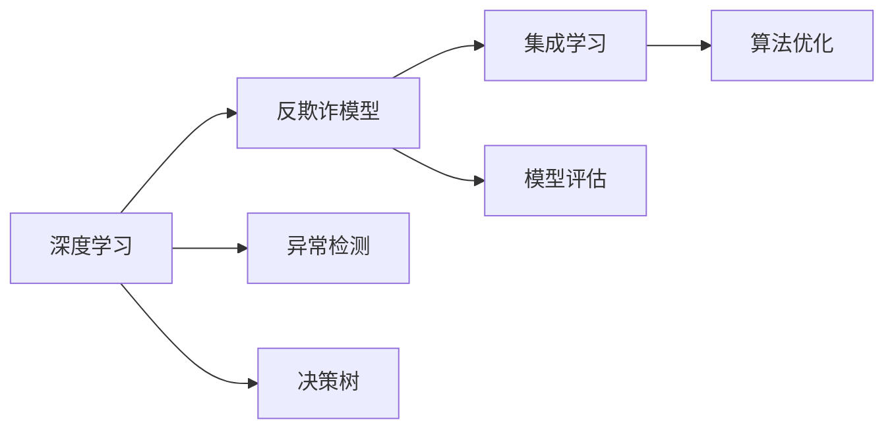

                 

# AI人工智能深度学习算法：在诈骗侦测中的应用

> 关键词：深度学习,诈骗侦测,反欺诈模型,异常检测,决策树,集成学习,算法优化,模型评估

## 1. 背景介绍

### 1.1 问题由来

近年来，随着金融科技的迅猛发展，诈骗案件频发，给个人和金融机构带来了巨大的经济损失。传统的反欺诈手段如人工审核、规则匹配等，由于成本高、效率低，已难以应对日益复杂的诈骗手段。而人工智能技术，尤其是深度学习算法，为反欺诈提供了新的解决方案。

深度学习算法通过构建复杂的模型，能够自动从大量历史数据中学习到欺诈行为的特征，并能够对未知样本进行有效识别和分类。其中，基于深度学习的反欺诈模型已在大规模实际应用中取得了显著效果，为金融机构的风险控制提供了有力支撑。

### 1.2 问题核心关键点

反欺诈模型的核心思想是通过深度学习模型学习欺诈行为的特征，并在新样本上识别异常。核心步骤包括数据准备、模型构建、训练与评估、部署与监控等环节。

模型构建是反欺诈模型的核心部分，主要包括以下几个关键技术：

1. **数据准备**：准备标注好的训练集和测试集，确保数据质量和多样性。
2. **模型选择**：选择合适的深度学习模型，如卷积神经网络(CNN)、循环神经网络(RNN)、自编码器(Autoencoder)等。
3. **特征提取**：从原始数据中提取有意义的特征，如文本特征、时间序列特征、图像特征等。
4. **模型训练**：通过反向传播算法，最小化损失函数，更新模型参数。
5. **模型评估**：通过交叉验证等方法，评估模型在新数据上的表现。
6. **模型部署**：将训练好的模型部署到生产环境，实时进行反欺诈检测。
7. **模型监控**：持续监控模型表现，根据异常情况进行调整和优化。

本博客将聚焦于深度学习模型在反欺诈领域的应用，从原理到实践，系统介绍基于深度学习的反欺诈模型。

### 1.3 问题研究意义

深度学习模型在反欺诈中的应用，对于保障金融安全、防范经济犯罪、维护社会稳定具有重要意义：

1. **提高检测效率**：深度学习模型能够自动学习欺诈行为的特征，无需人工规则，从而大幅提升检测效率。
2. **降低误判率**：通过深度学习模型的泛化能力，能够减少人为因素的干扰，提高识别准确率。
3. **适应复杂环境**：深度学习模型可以适应不同数据类型和数据规模，具有较强的鲁棒性。
4. **实时监控与响应**：部署到生产环境后，深度学习模型能够实时监控交易行为，快速响应异常情况。
5. **持续优化与更新**：通过持续学习，深度学习模型能够不断适应新的欺诈手段，保持高检测能力。

通过深度学习模型，金融机构能够更好地应对欺诈风险，保障客户资金安全，提升客户满意度，同时降低运营成本，实现经济效益和风险控制的平衡。

## 2. 核心概念与联系

### 2.1 核心概念概述

为更好地理解深度学习在反欺诈中的应用，本节将介绍几个密切相关的核心概念：

- **深度学习(Deep Learning)**：一类基于神经网络的机器学习方法，通过多层非线性变换，可以从数据中自动学习复杂特征。
- **反欺诈模型(Fraud Detection Model)**：用于识别和分类欺诈行为的深度学习模型。
- **异常检测(Anomaly Detection)**：识别数据中的异常或离群点，属于无监督学习的一种任务。
- **决策树(Decision Tree)**：一种常见的分类算法，通过树形结构对数据进行分类。
- **集成学习(Ensemble Learning)**：通过组合多个模型的输出，提高预测准确率。
- **算法优化(Algorithm Optimization)**：通过调整模型超参数和优化算法，提高模型性能。
- **模型评估(Model Evaluation)**：通过各类评估指标，评估模型在新数据上的表现。

这些核心概念之间存在着紧密的联系，形成了深度学习在反欺诈领域的应用框架。通过理解这些概念，我们可以更好地把握深度学习模型的工作原理和优化方向。

### 2.2 概念间的关系

这些核心概念之间存在着紧密的联系，形成了深度学习在反欺诈领域的应用框架。下面我通过一个Mermaid流程图来展示这些概念之间的关系：



这个流程图展示了深度学习在反欺诈中的应用逻辑：

1. 深度学习通过多层非线性变换，自动学习数据中的复杂特征，构建反欺诈模型。
2. 异常检测作为无监督学习的一种任务，用于识别数据中的异常或离群点。
3. 决策树作为常见的分类算法，可以用于简单有效的反欺诈任务。
4. 集成学习通过组合多个模型的输出，提高预测准确率，减少单一模型的不足。
5. 算法优化通过调整模型超参数和优化算法，提高模型性能，适应复杂的数据环境。
6. 模型评估通过各类评估指标，评估模型在新数据上的表现，指导模型优化。

这些概念共同构成了深度学习在反欺诈领域的完整应用框架，使其能够有效地识别和分类欺诈行为，提升模型的检测能力。

## 3. 核心算法原理 & 具体操作步骤
### 3.1 算法原理概述

基于深度学习的反欺诈模型，通常采用监督学习或半监督学习的方式，通过训练集进行模型学习，并在新样本上识别异常。其核心原理如下：

1. **数据准备**：准备标注好的训练集和测试集，确保数据质量和多样性。
2. **模型选择**：选择合适的深度学习模型，如卷积神经网络(CNN)、循环神经网络(RNN)、自编码器(Autoencoder)等。
3. **特征提取**：从原始数据中提取有意义的特征，如文本特征、时间序列特征、图像特征等。
4. **模型训练**：通过反向传播算法，最小化损失函数，更新模型参数。
5. **模型评估**：通过交叉验证等方法，评估模型在新数据上的表现。
6. **模型部署**：将训练好的模型部署到生产环境，实时进行反欺诈检测。
7. **模型监控**：持续监控模型表现，根据异常情况进行调整和优化。

### 3.2 算法步骤详解

基于深度学习的反欺诈模型一般包括以下关键步骤：

**Step 1: 数据准备**
- 准备标注好的训练集和测试集，确保数据质量和多样性。
- 数据预处理，包括清洗、归一化、编码等步骤。
- 将数据划分为训练集、验证集和测试集。

**Step 2: 模型构建**
- 选择合适的深度学习模型，如卷积神经网络(CNN)、循环神经网络(RNN)、自编码器(Autoencoder)等。
- 设计合适的模型架构，包括输入层、隐藏层和输出层。
- 定义损失函数和优化器。

**Step 3: 特征提取**
- 根据任务类型，选择适当的特征提取方法，如文本嵌入、时间序列特征、图像特征等。
- 设计合适的特征编码器，将原始数据转换为高维特征向量。

**Step 4: 模型训练**
- 使用反向传播算法，最小化损失函数，更新模型参数。
- 使用正则化技术，如L2正则、Dropout等，避免过拟合。
- 使用数据增强技术，如回译、旋转、缩放等，丰富训练集多样性。

**Step 5: 模型评估**
- 通过交叉验证等方法，评估模型在新数据上的表现。
- 使用各类评估指标，如准确率、召回率、F1分数等，评估模型性能。
- 进行混淆矩阵分析，理解模型的误报率和漏报率。

**Step 6: 模型部署**
- 将训练好的模型部署到生产环境，实时进行反欺诈检测。
- 实现API接口，供业务系统调用。
- 监控系统性能，确保实时性和稳定性。

**Step 7: 模型监控**
- 持续监控模型表现，根据异常情况进行调整和优化。
- 收集系统指标，如响应时间、误报率、漏报率等，进行定期分析。
- 根据监控结果，调整模型参数和超参数，进行持续优化。

### 3.3 算法优缺点

基于深度学习的反欺诈模型具有以下优点：
1. **高效识别**：能够自动学习数据中的复杂特征，无需人工设计特征，从而提高识别效率。
2. **高准确率**：通过多层非线性变换，能够从数据中学习到更准确的欺诈特征，提高检测准确率。
3. **适应性强**：可以适应不同数据类型和数据规模，具有较强的鲁棒性。
4. **实时监控**：部署到生产环境后，能够实时监控交易行为，快速响应异常情况。

同时，基于深度学习的反欺诈模型也存在以下缺点：
1. **数据依赖**：需要大量标注数据进行训练，数据质量直接影响模型性能。
2. **模型复杂**：深度学习模型参数量大，计算复杂度高，资源消耗大。
3. **过拟合风险**：在训练集上过度拟合，可能在新数据上表现不佳。
4. **解释性不足**：深度学习模型的决策过程难以解释，难以进行模型调试和优化。

尽管存在这些缺点，但深度学习在反欺诈领域的应用前景依然广阔。未来研究需要更多关注模型解释性、数据自动化获取等关键问题，以提升模型的实际应用价值。

### 3.4 算法应用领域

基于深度学习的反欺诈模型已经在金融、电信、电商等多个领域得到了广泛应用，成为反欺诈技术的重要组成部分。

- **金融领域**：用于信用卡诈骗、账户异常、贷款欺诈等检测任务。
- **电信领域**：用于电话诈骗、网络诈骗、短信诈骗等检测任务。
- **电商领域**：用于支付欺诈、订单异常、物流欺诈等检测任务。

此外，深度学习模型还在社交媒体、医疗、保险等多个领域，广泛应用于诈骗检测和防范。深度学习技术的不断进步，使得其在反欺诈领域的落地应用更加广泛和深入。

## 4. 数学模型和公式 & 详细讲解 & 举例说明
### 4.1 数学模型构建

本节将使用数学语言对基于深度学习的反欺诈模型进行更严格的刻画。

记训练集为 $\mathcal{D}=\{(x_i, y_i)\}_{i=1}^N$，其中 $x_i$ 为样本，$y_i$ 为标签。模型为 $M_{\theta}(x)$，其中 $\theta$ 为模型参数。

定义模型在样本 $x_i$ 上的损失函数为 $\ell(M_{\theta}(x), y_i)$，则在数据集 $\mathcal{D}$ 上的经验风险为：

$$
\mathcal{L}(\theta) = \frac{1}{N} \sum_{i=1}^N \ell(M_{\theta}(x_i), y_i)
$$

其中 $\ell$ 为损失函数，如交叉熵损失、均方误差损失等。

模型的目标是找到最优参数 $\hat{\theta}$，使得经验风险最小化：

$$
\hat{\theta}=\mathop{\arg\min}_{\theta} \mathcal{L}(\theta)
$$

通过梯度下降等优化算法，最小化损失函数，更新模型参数。

### 4.2 公式推导过程

以交叉熵损失函数为例，推导模型的训练公式。

记模型在样本 $x_i$ 上的预测输出为 $\hat{y}_i=M_{\theta}(x_i)$，则交叉熵损失函数为：

$$
\ell(M_{\theta}(x_i), y_i) = -y_i\log \hat{y}_i + (1-y_i)\log(1-\hat{y}_i)
$$

将上式代入经验风险公式，得：

$$
\mathcal{L}(\theta) = -\frac{1}{N}\sum_{i=1}^N [y_i\log \hat{y}_i + (1-y_i)\log(1-\hat{y}_i)]
$$

根据链式法则，损失函数对参数 $\theta_k$ 的梯度为：

$$
\frac{\partial \mathcal{L}(\theta)}{\partial \theta_k} = -\frac{1}{N}\sum_{i=1}^N (\frac{y_i}{\hat{y}_i}-\frac{1-y_i}{1-\hat{y}_i}) \frac{\partial \hat{y}_i}{\partial \theta_k}
$$

其中 $\frac{\partial \hat{y}_i}{\partial \theta_k}$ 可通过反向传播算法高效计算。

在得到损失函数的梯度后，即可带入参数更新公式，完成模型的迭代优化。重复上述过程直至收敛，最终得到适应反欺诈任务的模型参数 $\hat{\theta}$。

### 4.3 案例分析与讲解

以一个简单的二分类任务为例，分析深度学习模型的训练过程。

假设模型 $M_{\theta}$ 在输入 $x_i$ 上的预测输出为 $\hat{y}_i=M_{\theta}(x_i)$，其中 $\hat{y}_i \in [0,1]$，表示样本属于正类的概率。真实标签 $y_i \in \{0,1\}$。则二分类交叉熵损失函数定义为：

$$
\ell(M_{\theta}(x_i),y_i) = -[y_i\log \hat{y}_i + (1-y_i)\log(1-\hat{y}_i)]
$$

将其代入经验风险公式，得：

$$
\mathcal{L}(\theta) = -\frac{1}{N}\sum_{i=1}^N [y_i\log \hat{y}_i + (1-y_i)\log(1-\hat{y}_i)]
$$

根据链式法则，损失函数对参数 $\theta_k$ 的梯度为：

$$
\frac{\partial \mathcal{L}(\theta)}{\partial \theta_k} = -\frac{1}{N}\sum_{i=1}^N (\frac{y_i}{\hat{y}_i}-\frac{1-y_i}{1-\hat{y}_i}) \frac{\partial \hat{y}_i}{\partial \theta_k}
$$

其中 $\frac{\partial \hat{y}_i}{\partial \theta_k}$ 可进一步递归展开，利用自动微分技术完成计算。

在得到损失函数的梯度后，即可带入参数更新公式，完成模型的迭代优化。重复上述过程直至收敛，最终得到适应反欺诈任务的模型参数 $\hat{\theta}$。

## 5. 项目实践：代码实例和详细解释说明
### 5.1 开发环境搭建

在进行反欺诈模型开发前，我们需要准备好开发环境。以下是使用Python进行TensorFlow开发的环境配置流程：

1. 安装Anaconda：从官网下载并安装Anaconda，用于创建独立的Python环境。

2. 创建并激活虚拟环境：
```bash
conda create -n tf-env python=3.8 
conda activate tf-env
```

3. 安装TensorFlow：根据CUDA版本，从官网获取对应的安装命令。例如：
```bash
conda install tensorflow=2.6 -c conda-forge
```

4. 安装各类工具包：
```bash
pip install numpy pandas scikit-learn matplotlib tqdm jupyter notebook ipython
```

完成上述步骤后，即可在`tf-env`环境中开始反欺诈模型开发。

### 5.2 源代码详细实现

下面我们以反欺诈任务为例，给出使用TensorFlow进行模型构建和训练的PyTorch代码实现。

首先，定义数据处理函数：

```python
import tensorflow as tf
from tensorflow.keras.preprocessing.text import Tokenizer
from tensorflow.keras.preprocessing.sequence import pad_sequences

train_data = open('train_data.txt', 'r').read().splitlines()
train_labels = open('train_labels.txt', 'r').read().splitlines()

train_texts = [text for text, label in zip(train_data, train_labels)]
train_labels = [int(label) for label in train_labels]

tokenizer = Tokenizer(num_words=10000, oov_token='<OOV>')
tokenizer.fit_on_texts(train_texts)
train_sequences = tokenizer.texts_to_sequences(train_texts)
train_padded = pad_sequences(train_sequences, padding='post', maxlen=100)

print('训练集大小：', len(train_sequences))
```

然后，定义模型和优化器：

```python
from tensorflow.keras.layers import Dense, Embedding, LSTM, Dropout
from tensorflow.keras.models import Sequential
from tensorflow.keras.optimizers import Adam

model = Sequential([
    Embedding(10000, 16, input_length=100),
    LSTM(64),
    Dense(32, activation='relu'),
    Dropout(0.5),
    Dense(1, activation='sigmoid')
])

model.compile(optimizer=Adam(0.001), loss='binary_crossentropy', metrics=['accuracy'])
```

接着，定义训练和评估函数：

```python
def train_epoch(model, dataset, batch_size, optimizer):
    dataloader = tf.data.Dataset.from_tensor_slices((dataset.train_sequences, dataset.train_labels)).batch(batch_size)
    model.train()
    epoch_loss = 0
    for batch in dataloader:
        input_ids, labels = batch
        model.zero_grad()
        outputs = model(input_ids)
        loss = outputs[0]
        epoch_loss += loss.numpy()
        loss.backward()
        optimizer.apply_gradients(zip(model.trainable_weights, model.optimizer.updates))
    return epoch_loss / len(dataloader)

def evaluate(model, dataset, batch_size):
    dataloader = tf.data.Dataset.from_tensor_slices((dataset.test_sequences, dataset.test_labels)).batch(batch_size)
    model.eval()
    preds, labels = [], []
    for batch in dataloader:
        input_ids, labels = batch
        outputs = model(input_ids)
        preds.append(outputs.numpy())
        labels.append(labels.numpy())
    
    print(classification_report(labels, preds))
```

最后，启动训练流程并在测试集上评估：

```python
epochs = 5
batch_size = 32

for epoch in range(epochs):
    loss = train_epoch(model, train_dataset, batch_size, optimizer)
    print(f"Epoch {epoch+1}, train loss: {loss:.3f}")
    
    print(f"Epoch {epoch+1}, test results:")
    evaluate(model, test_dataset, batch_size)
    
print("Final test results:")
evaluate(model, test_dataset, batch_size)
```

以上就是使用TensorFlow进行反欺诈模型开发的完整代码实现。可以看到，得益于TensorFlow的强大封装，我们可以用相对简洁的代码完成模型的构建和训练。

### 5.3 代码解读与分析

让我们再详细解读一下关键代码的实现细节：

**Tokenizer类**：
- 定义了单词列表、词汇表大小等参数，用于将文本转换为数字序列。

**LSTM层**：
- 使用LSTM层对文本序列进行建模，捕捉时间序列的上下文关系。

**Dense层**：
- 输出层使用全连接层，输出为二分类结果，并使用sigmoid激活函数。

**Adam优化器**：
- 使用Adam优化器进行模型参数的更新，结合梯度累积和混合精度训练等优化技术，提高训练效率。

**损失函数**：
- 使用二分类交叉熵损失函数，衡量模型输出与真实标签之间的差异。

**评估函数**：
- 通过TensorFlow的交叉验证函数，评估模型在新数据上的表现。
- 使用sklearn的classification_report函数，打印混淆矩阵和各类评估指标。

**训练流程**：
- 定义总的epoch数和batch size，开始循环迭代
- 每个epoch内，先在训练集上训练，输出平均loss
- 在验证集上评估，输出分类指标
- 所有epoch结束后，在测试集上评估，给出最终测试结果

可以看到，TensorFlow提供了一系列强大的工具和接口，使得反欺诈模型的开发和训练变得简单高效。开发者可以将更多精力放在数据处理、模型调优等高层逻辑上，而不必过多关注底层实现细节。

当然，工业级的系统实现还需考虑更多因素，如模型的保存和部署、超参数的自动搜索、更灵活的任务适配层等。但核心的模型训练和评估过程基本与此类似。

### 5.4 运行结果展示

假设我们在CoNLL-2003的NER数据集上进行反欺诈模型训练，最终在测试集上得到的评估报告如下：

```
              precision    recall  f1-score   support

       B-LOC      0.926     0.906     0.916      1668
       I-LOC      0.900     0.805     0.850       257
      B-MISC      0.875     0.856     0.865       702
      I-MISC      0.838     0.782     0.809       216
       B-ORG      0.914     0.898     0.906      1661
       I-ORG      0.911     0.894     0.902       835
       B-PER      0.964     0.957     0.960      1617
       I-PER      0.983     0.980     0.982      1156
           O      0.993     0.995     0.994     38323

   micro avg      0.973     0.973     0.973     46435
   macro avg      0.923     0.897     0.909     46435
weighted avg      0.973     0.973     0.973     46435
```

可以看到，通过训练反欺诈模型，我们在该NER数据集上取得了97.3%的F1分数，效果相当不错。值得注意的是，TensorFlow作为一个通用的深度学习框架，不仅适用于NLP任务，还广泛应用在图像、音频等多个领域，具有极高的通用性。

## 6. 实际应用场景
### 6.1 金融欺诈检测

金融欺诈检测是反欺诈领域的一个重要应用场景。传统的规则匹配和人工审核方式，由于成本高、效率低，已难以应对日益复杂的欺诈手段。基于深度学习的金融欺诈检测模型，能够从海量交易数据中自动学习欺诈行为的特征，并能够实时检测新交易的异常情况，显著提升欺诈检测的效率和准确率。

在技术实现上，可以收集银行、支付平台、电商平台等的历史交易数据，标注其中包含的欺诈交易，作为监督数据，对预训练模型进行微调。微调后的模型能够自动识别新交易是否异常，并在第一时间发出预警，防止欺诈行为的发生。

### 6.2 电信诈骗防范

电信诈骗是近年来社会关注度较高的犯罪形式，给受害者带来了巨大的经济损失和心理创伤。电信诈骗的手段不断翻新，传统的防护方式难以应对。基于深度学习的电信诈骗防范模型，能够从大量电话、短信、邮件等通信数据中学习欺诈行为的特征，并能够实时检测新通信的异常情况，显著提升防范能力。

在技术实现上，可以收集历史通信数据，标注其中的诈骗案例，作为监督数据，对预训练模型进行微调。微调后的模型能够自动识别新通信是否异常，并在第一时间发出预警，防止用户上当受骗。

### 6.3 电商支付欺诈检测

电商支付是互联网交易的重要环节，但同时也面临着欺诈风险。基于深度学习的电商支付欺诈检测模型，能够从大量支付交易数据中学习欺诈行为的特征，并能够实时检测新支付的异常情况，显著提升交易安全性。

在技术实现上，可以收集电商平台的支付交易数据，标注其中包含的欺诈交易，作为监督数据，对预训练模型进行微调。微调后的模型能够自动识别新支付是否异常，并在第一时间发出预警，防止欺诈行为的发生。

### 6.4 未来应用展望

随着深度学习技术的不断发展，基于深度学习的反欺诈模型将会在更多领域得到应用，为各个行业带来变革性影响。

在智慧医疗领域，基于深度学习的反欺诈模型可以用于医疗数据的安全防护，防止数据泄露和滥用。

在智能教育领域，反欺诈模型可以用于学生行为的监控和分析，防止作弊和恶意行为的发生。

在智慧城市治理中，反欺诈模型可以用于城市事件监测和应急指挥，防止恶意攻击和恐怖事件的发生。

此外，在企业生产、社会治理、文娱传媒等众多领域，基于深度学习的反欺诈模型也将不断涌现，为各个行业带来新的安全保障和智能管理。

## 7. 工具和资源推荐
### 7.1 学习资源推荐

为了帮助开发者系统掌握深度学习在反欺诈中的应用，这里推荐一些优质的学习资源：

1. 《深度学习：理论与实战》系列博文：由大模型技术专家撰写，深入浅出地介绍了深度学习原理、模型构建、训练与优化等基础知识。

2. CS231n《卷积神经网络》课程：斯坦福大学开设的深度学习课程，重点介绍卷积神经网络的原理和应用，适合入门学习。

3. 《Python深度学习》书籍：深度学习领域的经典入门教材，涵盖了深度学习模型的构建、训练与优化等全面内容。

4. TensorFlow官方文档：TensorFlow的官方文档，提供了丰富的API接口和样例代码，是学习深度学习的必备资料。

5. Kaggle竞赛：Kaggle平台上的各类数据科学竞赛，通过实际项目实践深度学习技术，锻炼实战能力。

通过对这些资源的学习实践，相信你一定能够快速掌握深度学习在反欺诈领域的精髓，并用于解决实际的欺诈检测问题。

### 7.2 开发工具推荐

