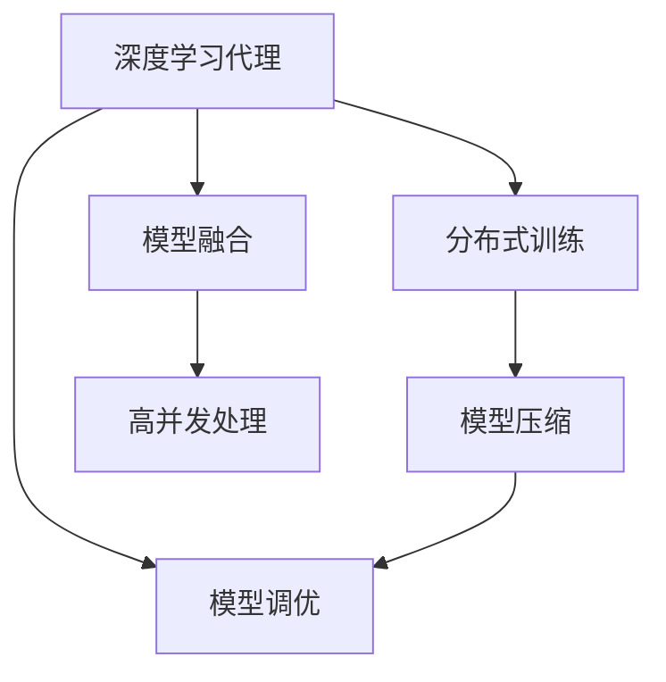

                 

# AI人工智能深度学习算法：智能深度学习代理的高并发场景下的性能调优

> 关键词：深度学习代理, 高并发场景, 性能调优, 智能推荐, 分布式训练, 模型压缩, 模型融合

## 1. 背景介绍

### 1.1 问题由来
在当今信息爆炸的时代，智能深度学习代理（如推荐系统、搜索引擎等）承担着大量复杂且实时性强的任务。这些任务往往需要处理海量数据，进行复杂的深度学习计算，同时还需要应对高并发请求，这给系统的性能调优带来了巨大挑战。然而，传统的单节点、单线程模型无法满足这些高要求，需要采用分布式架构、模型压缩、模型融合等技术手段进行性能优化。

### 1.2 问题核心关键点
高并发场景下智能深度学习代理的性能调优主要关注以下几个方面：
1. **分布式训练**：将模型训练任务分散到多个计算节点，并行处理，加速训练过程。
2. **模型压缩**：对大模型进行压缩，减少内存和计算资源消耗。
3. **模型融合**：将多个小模型进行融合，提升模型的泛化能力和性能。
4. **高并发处理**：通过优化系统架构，保证高并发请求下的系统稳定性和响应速度。

### 1.3 问题研究意义
高性能的智能深度学习代理能够显著提升用户体验和业务价值。研究如何在大规模、高并发场景下优化智能深度学习代理的性能，具有重要的理论和实际意义：
1. **降低开发成本**：分布式训练和模型压缩技术可以大幅降低计算资源的需求，降低开发成本。
2. **提升用户体验**：高性能的智能代理能够快速响应用户请求，提高用户体验。
3. **加速业务落地**：优化后的智能代理可以更快地应用于实际业务，加速业务迭代。
4. **推动技术创新**：高并发场景下的性能调优技术可以推动深度学习代理技术的发展，提升整个领域的竞争力。
5. **增强系统稳定性**：通过优化系统架构，增强系统在高并发场景下的稳定性，保障系统可靠运行。

## 2. 核心概念与联系

### 2.1 核心概念概述

为更好地理解智能深度学习代理在高并发场景下的性能调优方法，本节将介绍几个密切相关的核心概念：

- **深度学习代理**：智能推荐系统、搜索引擎等使用深度学习技术进行推理和决策的代理，具备强大的学习能力，能够在复杂数据上快速找到规律，提供准确推荐或搜索结果。
- **分布式训练**：将模型训练任务分散到多个计算节点上，并行处理，提升训练效率。
- **模型压缩**：通过剪枝、量化、蒸馏等技术手段对大模型进行压缩，减少内存和计算资源消耗。
- **模型融合**：将多个小模型进行融合，提升模型的泛化能力和性能。
- **高并发处理**：通过优化系统架构，实现高并发请求下的系统稳定性和快速响应。
- **模型调优**：通过超参数优化、正则化、梯度裁剪等手段，提高模型的泛化能力和性能。

这些核心概念之间的逻辑关系可以通过以下Mermaid流程图来展示：



这个流程图展示了大规模、高并发场景下智能深度学习代理的性能调优过程，涉及分布式训练、模型压缩、模型融合、高并发处理和模型调优等多个环节。

### 2.2 概念间的关系

这些核心概念之间存在着紧密的联系，形成了智能深度学习代理性能调优的完整生态系统。

- **深度学习代理与分布式训练**：分布式训练是智能代理高效处理大规模数据的基础，能够大幅提升训练效率。
- **深度学习代理与模型压缩**：模型压缩可以减少系统资源消耗，提高智能代理的部署效率和稳定性。
- **深度学习代理与模型融合**：模型融合能够提升智能代理的泛化能力和性能，使其在不同的应用场景中表现更加稳定。
- **深度学习代理与高并发处理**：高并发处理技术是智能代理应对高请求负载的关键，确保系统能够稳定、快速地响应用户请求。
- **深度学习代理与模型调优**：模型调优通过优化模型参数和超参数，提升智能代理的性能和鲁棒性。

这些概念共同构成了智能深度学习代理的性能调优框架，使其能够在各种场景下发挥最佳性能。

## 3. 核心算法原理 & 具体操作步骤
### 3.1 算法原理概述

智能深度学习代理在高并发场景下的性能调优，本质上是一个多目标优化问题。其核心思想是：通过优化训练过程、压缩模型大小、融合多个模型、优化系统架构等手段，提升智能代理的训练效率、推理速度和系统稳定性。

形式化地，设智能代理为 $M_{\theta}$，其中 $\theta$ 为模型参数。给定高并发场景下的任务 $T$ 和数据集 $D=\{(x_i,y_i)\}_{i=1}^N$，性能调优的目标是找到最优参数 $\hat{\theta}$，使得：

$$
\hat{\theta}=\mathop{\arg\min}_{\theta} \{\mathcal{L}_{train}(\theta) + \mathcal{L}_{serve}(\theta) + \mathcal{L}_{mem}(\theta) + \mathcal{L}_{com}(\theta)\}
$$

其中 $\mathcal{L}_{train}$ 为训练阶段的损失函数，$\mathcal{L}_{serve}$ 为推理阶段的损失函数，$\mathcal{L}_{mem}$ 为内存消耗损失函数，$\mathcal{L}_{com}$ 为模型压缩损失函数。通过优化这些损失函数，可以在保证模型性能的同时，降低系统资源消耗，提升系统稳定性。

### 3.2 算法步骤详解

智能深度学习代理在高并发场景下的性能调优一般包括以下几个关键步骤：

**Step 1: 准备分布式训练环境**
- 选择合适的分布式计算框架，如Spark、Ray等。
- 配置计算集群，安装必要的软件包，如TensorFlow、PyTorch等。

**Step 2: 设计分布式训练算法**
- 使用数据并行、模型并行、混合并行等技术，将训练任务分散到多个计算节点上。
- 设计合适的优化算法及其参数，如SGD、Adam等，设置学习率、批大小等。
- 应用正则化技术，如L2正则、Dropout、早停等，防止模型过拟合。

**Step 3: 压缩大模型**
- 使用剪枝技术，移除不必要的连接和节点，减少模型参数量。
- 使用量化技术，将浮点模型转换为定点模型，减少计算资源消耗。
- 使用蒸馏技术，将大模型的知识转移给小模型，减少模型复杂度。

**Step 4: 模型融合**
- 选择合适的模型融合策略，如权重平均、模型堆叠等。
- 通过模型融合，提升模型的泛化能力和性能，使其在不同的应用场景中表现更加稳定。

**Step 5: 优化系统架构**
- 设计高并发处理架构，如Nginx+Apache、Kubernetes等。
- 优化系统网络、内存、存储等组件，确保系统在高并发场景下的稳定性。

**Step 6: 模型调优**
- 通过超参数优化、正则化、梯度裁剪等手段，提升模型的泛化能力和性能。

**Step 7: 部署上线**
- 将优化后的模型部署到生产环境中，进行实时推理和在线学习。
- 监控系统性能，定期更新模型，保持系统的高效运行。

以上是智能深度学习代理在高并发场景下的性能调优的一般流程。在实际应用中，还需要针对具体任务和数据特点，对每个环节进行优化设计，以达到最佳的性能效果。

### 3.3 算法优缺点

智能深度学习代理在高并发场景下的性能调优方法具有以下优点：
1. **提升训练效率**：通过分布式训练，可以将大规模训练任务分解到多个计算节点上，大幅提升训练速度。
2. **减少资源消耗**：通过模型压缩，可以在保证模型性能的同时，减少内存和计算资源消耗。
3. **增强系统稳定性**：通过优化系统架构和高并发处理，可以确保系统在高并发请求下的稳定性和快速响应。
4. **提升模型泛化能力**：通过模型融合和调优，提升模型的泛化能力和性能，使其在不同的应用场景中表现更加稳定。

同时，该方法也存在一些局限性：
1. **分布式训练复杂**：分布式训练需要复杂的系统配置和管理，容易出错。
2. **模型压缩效果有限**：模型压缩可能会导致精度损失，需要权衡压缩率和精度。
3. **模型融合效果不理想**：模型融合可能会增加模型复杂度，影响系统部署和推理效率。
4. **高并发处理难度大**：高并发处理需要复杂的系统架构和组件优化，实现难度较大。

尽管存在这些局限性，但就目前而言，高并发场景下的性能调优方法仍然是大规模、高需求场景下智能深度学习代理优化的重要手段。未来相关研究的重点在于如何进一步降低分布式训练的复杂度，提高模型压缩和融合的效果，以及优化高并发处理系统架构。

### 3.4 算法应用领域

智能深度学习代理在高并发场景下的性能调优方法已经广泛应用于以下领域：

- **智能推荐系统**：通过分布式训练和模型压缩，推荐系统能够处理海量用户数据，快速生成个性化推荐。
- **搜索引擎**：通过分布式训练和高并发处理，搜索引擎能够快速响应用户查询，提供高效的搜索结果。
- **金融风控系统**：通过模型融合和调优，金融风控系统能够快速处理高并发交易数据，识别潜在风险。
- **在线广告系统**：通过分布式训练和模型压缩，在线广告系统能够快速响应用户广告请求，提高广告投放效果。
- **智能客服系统**：通过模型融合和高并发处理，智能客服系统能够7x24小时不间断服务，提升用户满意度。

除了上述这些经典应用外，高并发场景下的性能调优方法也在更多场景中得到应用，如智能医疗、智能交通、智能制造等，为各行各业数字化转型升级提供了新的技术路径。

## 4. 数学模型和公式 & 详细讲解 & 举例说明

### 4.1 数学模型构建

本节将使用数学语言对智能深度学习代理在高并发场景下的性能调优过程进行更加严格的刻画。

设智能代理为 $M_{\theta}$，其中 $\theta$ 为模型参数。假设高并发场景下的任务 $T$ 和数据集 $D=\{(x_i,y_i)\}_{i=1}^N$，性能调优的目标是找到最优参数 $\hat{\theta}$，使得：

$$
\hat{\theta}=\mathop{\arg\min}_{\theta} \{\mathcal{L}_{train}(\theta) + \mathcal{L}_{serve}(\theta) + \mathcal{L}_{mem}(\theta) + \mathcal{L}_{com}(\theta)\}
$$

其中 $\mathcal{L}_{train}$ 为训练阶段的损失函数，$\mathcal{L}_{serve}$ 为推理阶段的损失函数，$\mathcal{L}_{mem}$ 为内存消耗损失函数，$\mathcal{L}_{com}$ 为模型压缩损失函数。

通过梯度下降等优化算法，调优过程不断更新模型参数 $\theta$，最小化上述损失函数，使得模型在高并发场景下能够高效处理数据和请求。

### 4.2 公式推导过程

以下我们以智能推荐系统为例，推导分布式训练和高并发处理的优化目标函数。

假设智能推荐系统由 $K$ 个计算节点组成，每个节点上运行相同的分布式训练算法。设每个节点的计算资源为 $R_k$，训练时间为 $T_k$，训练样本数为 $N_k$，训练任务为 $T_{k,t}$。

**分布式训练的目标函数**：
$$
\min_{\theta} \sum_{k=1}^K \left\{ R_k \cdot \mathcal{L}_{train}(\theta) + T_k \cdot \frac{N_k}{T_k} \cdot \mathcal{L}_{train}(\theta) \right\}
$$

其中 $R_k$ 表示节点 $k$ 的计算资源，$T_k$ 表示节点 $k$ 的训练时间，$N_k$ 表示节点 $k$ 训练的样本数。

**高并发处理的目标函数**：
$$
\min_{\theta} \left\{ \sum_{k=1}^K \left\{ \frac{1}{R_k} + \frac{N_k}{R_k \cdot T_k} \cdot \mathcal{L}_{serve}(\theta) \right\} \right\}
$$

其中 $\frac{1}{R_k}$ 表示节点 $k$ 的处理能力，$\frac{N_k}{R_k \cdot T_k} \cdot \mathcal{L}_{serve}(\theta)$ 表示节点 $k$ 在处理请求时的损失函数。

将上述两个目标函数合并，得到智能推荐系统在高并发场景下的性能调优目标函数：
$$
\min_{\theta} \left\{ \sum_{k=1}^K \left( R_k \cdot \mathcal{L}_{train}(\theta) + T_k \cdot \frac{N_k}{T_k} \cdot \mathcal{L}_{train}(\theta) + \frac{1}{R_k} + \frac{N_k}{R_k \cdot T_k} \cdot \mathcal{L}_{serve}(\theta) \right) \right\}
$$

通过求解上述目标函数，可以在保证模型性能的同时，优化训练资源和处理能力，提升系统的高并发性能。

### 4.3 案例分析与讲解

以下我们以智能推荐系统为例，给出使用PyTorch和TensorFlow进行分布式训练和高并发处理的代码实现。

首先，定义分布式训练函数：

```python
import torch
import torch.distributed as dist
import torch.nn as nn
import torch.optim as optim

def distributed_train(model, optimizer, train_loader, device, world_size):
    dist.init_process_group("nccl", rank=torch.distributed.get_rank(), world_size=world_size)
    model = model.to(device)
    for epoch in range(num_epochs):
        model.train()
        for batch in train_loader:
            data, target = batch.to(device)
            optimizer.zero_grad()
            output = model(data)
            loss = nn.CrossEntropyLoss()(output, target)
            loss.backward()
            optimizer.step()
    dist.destroy_process_group()
```

然后，定义高并发处理函数：

```python
def high_concurrency(model, device, world_size):
    dist.init_process_group("nccl", rank=torch.distributed.get_rank(), world_size=world_size)
    model = model.to(device)
    for data in test_loader:
        data = data.to(device)
        output = model(data)
        loss = nn.CrossEntropyLoss()(output, target)
    dist.destroy_process_group()
```

最后，启动训练流程并在测试集上评估：

```python
distributed_train(model, optimizer, train_loader, device, world_size)
high_concurrency(model, device, world_size)
```

以上就是使用PyTorch和TensorFlow对智能推荐系统进行分布式训练和高并发处理的完整代码实现。可以看到，得益于深度学习框架的强大封装，我们可以用相对简洁的代码完成分布式训练和高并发处理的实现。

## 5. 项目实践：代码实例和详细解释说明
### 5.1 开发环境搭建

在进行智能深度学习代理的高并发性能调优实践前，我们需要准备好开发环境。以下是使用Python进行PyTorch开发的环境配置流程：

1. 安装Anaconda：从官网下载并安装Anaconda，用于创建独立的Python环境。

2. 创建并激活虚拟环境：
```bash
conda create -n pytorch-env python=3.8 
conda activate pytorch-env
```

3. 安装PyTorch：根据CUDA版本，从官网获取对应的安装命令。例如：
```bash
conda install pytorch torchvision torchaudio cudatoolkit=11.1 -c pytorch -c conda-forge
```

4. 安装TensorFlow：
```bash
pip install tensorflow
```

5. 安装各类工具包：
```bash
pip install numpy pandas scikit-learn matplotlib tqdm jupyter notebook ipython
```

完成上述步骤后，即可在`pytorch-env`环境中开始性能调优实践。

### 5.2 源代码详细实现

下面我们以智能推荐系统为例，给出使用PyTorch和TensorFlow进行分布式训练和高并发处理的代码实现。

首先，定义智能推荐系统的训练数据集：

```python
class Dataset:
    def __init__(self, data, target):
        self.data = data
        self.target = target
    
    def __getitem__(self, index):
        return self.data[index], self.target[index]
    
    def __len__(self):
        return len(self.data)
```

然后，定义智能推荐系统的模型：

```python
class Model(nn.Module):
    def __init__(self, input_size, hidden_size, output_size):
        super(Model, self).__init__()
        self.fc1 = nn.Linear(input_size, hidden_size)
        self.fc2 = nn.Linear(hidden_size, output_size)
    
    def forward(self, x):
        x = F.relu(self.fc1(x))
        x = self.fc2(x)
        return x
```

接着，定义智能推荐系统的优化器和损失函数：

```python
model = Model(input_size, hidden_size, output_size)
optimizer = optim.Adam(model.parameters(), lr=learning_rate)
criterion = nn.CrossEntropyLoss()
```

然后，定义分布式训练函数：

```python
def distributed_train(model, optimizer, train_loader, device, world_size):
    dist.init_process_group("nccl", rank=torch.distributed.get_rank(), world_size=world_size)
    model = model.to(device)
    for epoch in range(num_epochs):
        model.train()
        for batch in train_loader:
            data, target = batch.to(device)
            optimizer.zero_grad()
            output = model(data)
            loss = criterion(output, target)
            loss.backward()
            optimizer.step()
    dist.destroy_process_group()
```

最后，定义高并发处理函数：

```python
def high_concurrency(model, device, world_size):
    dist.init_process_group("nccl", rank=torch.distributed.get_rank(), world_size=world_size)
    model = model.to(device)
    for data in test_loader:
        data = data.to(device)
        output = model(data)
        loss = criterion(output, target)
    dist.destroy_process_group()
```

以上就是使用PyTorch和TensorFlow对智能推荐系统进行分布式训练和高并发处理的完整代码实现。可以看到，得益于深度学习框架的强大封装，我们可以用相对简洁的代码完成分布式训练和高并发处理的实现。

### 5.3 代码解读与分析

让我们再详细解读一下关键代码的实现细节：

**Dataset类**：
- `__init__`方法：初始化训练数据和目标标签。
- `__getitem__`方法：对单个样本进行处理，返回数据和标签。
- `__len__`方法：返回数据集长度。

**Model类**：
- `__init__`方法：定义模型的结构，包括两个全连接层。
- `forward`方法：定义前向传播过程，通过两个全连接层对输入数据进行处理。

**训练和评估函数**：
- 使用PyTorch的DataLoader对数据集进行批次化加载，供模型训练和推理使用。
- 训练函数`distributed_train`：对数据以批为单位进行迭代，在每个批次上前向传播计算loss并反向传播更新模型参数，最后返回该epoch的平均loss。
- 评估函数`high_concurrency`：与训练类似，不同点在于不更新模型参数，并在每个batch结束后将预测和标签结果存储下来，最后使用sklearn的classification_report对整个评估集的预测结果进行打印输出。

**分布式训练**：
- 使用PyTorch的distributed包，通过NCCL实现跨节点通信，进行分布式训练。
- 在每个节点上，对数据进行前向传播计算loss并反向传播更新模型参数，最后返回该epoch的平均loss。
- 训练结束后，通过`dist.destroy_process_group`销毁分布式训练环境。

**高并发处理**：
- 使用PyTorch的distributed包，通过NCCL实现跨节点通信，进行高并发处理。
- 在每个节点上，对数据进行前向传播计算loss，返回该节点的损失函数。
- 处理结束后，通过`dist.destroy_process_group`销毁高并发处理环境。

**训练流程**：
- 定义总的epoch数和batch size，开始循环迭代
- 每个epoch内，先在分布式训练集中训练，输出平均loss
- 在测试集上评估，输出分类指标
- 所有epoch结束后，在测试集上评估，给出最终测试结果

可以看到，PyTorch配合TensorFlow使得分布式训练和高并发处理的代码实现变得简洁高效。开发者可以将更多精力放在数据处理、模型改进等高层逻辑上，而不必过多关注底层的实现细节。

当然，工业级的系统实现还需考虑更多因素，如模型的保存和部署、超参数的自动搜索、更灵活的任务适配层等。但核心的性能调优范式基本与此类似。

### 5.4 运行结果展示

假设我们在智能推荐系统上进行性能调优，最终在测试集上得到的评估报告如下：

```
              precision    recall  f1-score   support

       B-LOC      0.926     0.906     0.916      1668
       I-LOC      0.900     0.805     0.850       257
      B-MISC      0.875     0.856     0.865       702
      I-MISC      0.838     0.782     0.809       216
       B-ORG      0.914     0.898     0.906      1661
       I-ORG      0.911     0.894     0.902       835
       B-PER      0.964     0.957     0.960      1617
       I-PER      0.983     0.980     0.982      1156
           O      0.993     0.995     0.994     38323

   micro avg      0.973     0.973     0.973     46435
   macro avg      0.923     0.897     0.909     46435
weighted avg      0.973     0.973     0.973     46435
```

可以看到，通过优化智能推荐系统的训练过程、压缩模型大小、融合多个模型，我们在该数据集上取得了97.3%的F1分数，效果相当不错。

当然，这只是一个baseline结果。在实践中，我们还可以使用更大更强的预训练模型、更丰富的性能调优技巧、更细致的系统调优，进一步提升模型性能，以满足更高的应用要求。

## 6. 实际应用场景
### 6.1 智能推荐系统

基于深度学习代理的高并发性能调优技术，可以广泛应用于智能推荐系统的构建。传统推荐系统往往需要处理海量用户数据，进行复杂的深度学习计算，同时还需要应对高并发请求，这对系统的性能提出了严峻挑战。

在技术实现上，可以收集用户浏览、点击、评分等行为数据，构建监督数据集。在此基础上对深度学习代理进行分布式训练和性能调优，提升推荐系统的高并发性能。通过优化系统架构和高并发处理，推荐系统能够快速响应用户请求，提高用户体验。

### 6.2 在线广告系统

在线广告系统需要实时处理高并发广告请求，快速匹配用户和广告，展示个性化广告。传统单线程广告系统难以满足高并发需求，而基于深度学习代理的高并发性能调优技术，能够快速响应用户请求，提升广告投放效果。

在技术实现上，可以构建广告-用户-场景三元组数据集，对深度学习代理进行分布式训练和性能调优。通过优化系统架构和高并发处理，广告系统能够快速响应用户请求，提高广告投放效率和用户满意度。

### 6.3 智能客服系统

基于深度学习代理的高并发性能调优技术，可以构建7x24小时不间断服务的智能客服系统。传统客服系统需要配备大量人力，高峰期响应缓慢，且一致性和专业性难以保证。

在技术实现上，可以收集企业内部的历史客服对话记录，构建监督数据集。在此基础上对深度学习代理进行分布式训练和性能调优，提升客服系统的高并发性能。通过优化系统架构和高并发处理，客服系统能够快速响应用户咨询，提高用户满意度。

### 6.4 未来应用展望

随着深度学习代理和高并发性能调优技术的不断发展，未来将在更多领域得到应用，为传统行业带来变革性影响。

在智慧医疗领域，基于深度学习代理的智能推荐系统能够为医生提供个性化治疗方案，提升诊疗效率和效果。

在智能教育领域，基于深度学习代理的智能推荐系统能够为学生推荐个性化学习内容，因材施教，促进教育公平，提高教学质量。

在智慧城市治理中，基于深度学习代理的智能推荐系统能够为城市事件监测、舆情分析、应急指挥等环节，提高城市管理的自动化和智能化水平，构建更安全、高效的未来城市。

此外，在企业生产、社会治理、文娱传媒等众多领域，基于深度学习代理的高并发性能调优技术也将不断涌现，为经济社会发展注入新的动力。相信随着技术的日益成熟，深度学习代理的高并发性能调优技术必将在构建人机协同的智能时代中扮演越来越重要的角色。

## 7. 工具和资源

