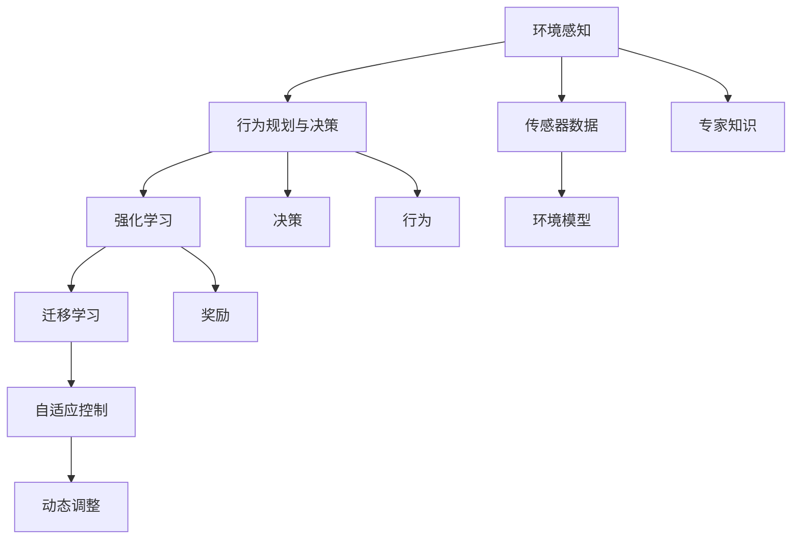

                 

## 1. 背景介绍

### 1.1 问题由来
随着人工智能(AI)技术的快速发展，AI代理（AI Agents）在各行各业的应用越来越广泛。从智能客服、自动驾驶、机器人控制，到医疗诊断、金融分析、电子商务等，AI代理以其高效、准确、全天候工作等特点，正在逐步取代人类从事一些重复性和技术性较高的工作。然而，现实世界是复杂多变的，AI代理要想在动态环境中保持高效、稳定的工作，就必须具备强大的适应能力和学习能力。

### 1.2 问题核心关键点
AI代理在动态环境中的适应与学习，涉及到以下几个核心问题：

1. **环境感知与建模**：AI代理需要准确地感知环境状态，并构建环境模型，以便进行决策和行动。
2. **行为规划与决策**：基于环境模型，AI代理需要规划行为，并做出合理的决策。
3. **学习与优化**：在动态环境中，AI代理需要不断学习新知识和技能，优化自身的行为策略。
4. **鲁棒性与安全性**：AI代理需要具备鲁棒性，即对环境变化和不确定性具有一定的抵抗能力，并保证决策的安全性。
5. **实时性与效率**：AI代理需要在实时环境中高效地执行决策和行动，保证系统的响应速度和资源利用率。

这些核心问题构成了AI代理在动态环境中的主要挑战。要解决这些问题，需要采用一系列的算法和技术，确保AI代理能够在复杂多变的环境中持续高效地工作。

## 2. 核心概念与联系

### 2.1 核心概念概述

在探讨AI代理在动态环境中的适应与学习时，涉及到的核心概念包括：

1. **环境感知**：AI代理对环境状态的感知和建模，通常通过传感器数据、专家知识等方式获取。
2. **行为规划与决策**：AI代理根据环境模型，规划行为策略并进行决策。
3. **强化学习**：通过与环境的交互，AI代理不断调整自身的策略，以最大化某种奖励。
4. **迁移学习**：将在一个环境中学到的知识和技能，迁移到另一个相关环境中。
5. **自适应控制**：AI代理能够根据环境变化动态调整自身行为，保持高效稳定。

这些概念之间存在紧密的联系，形成了一个完整的AI代理工作流程。环境感知为行为规划和决策提供基础数据，行为规划与决策为强化学习提供目标和策略，强化学习和迁移学习则通过不断学习优化代理的行为，自适应控制则确保代理在动态环境中能够高效稳定地工作。

### 2.2 概念间的关系

通过以下Mermaid流程图来展示这些核心概念之间的关系：



这个流程图展示了AI代理工作流程中各个关键步骤的关联关系：

1. 环境感知：通过传感器数据和专家知识获取环境状态。
2. 行为规划与决策：基于环境模型，规划行为策略并进行决策。
3. 强化学习：通过与环境的交互，优化决策策略。
4. 迁移学习：将学习到的策略迁移到新的环境中。
5. 自适应控制：根据环境变化动态调整行为。

这些概念共同构成了AI代理在动态环境中的完整工作流程，确保其能够在复杂多变的环境中持续高效地工作。

## 3. 核心算法原理 & 具体操作步骤

### 3.1 算法原理概述

AI代理在动态环境中的适应与学习，通常采用强化学习和迁移学习等算法。强化学习通过与环境的交互，不断调整策略以最大化奖励；迁移学习则通过将已有的知识和技能迁移到新环境中，提升代理的适应能力。

在强化学习中，AI代理通过观察环境状态、执行动作，并根据得到的奖励进行策略更新。在迁移学习中，AI代理将在一个环境中学到的知识和技能，迁移到另一个相关环境中，以加速学习过程。

### 3.2 算法步骤详解

以下是一个典型的AI代理在动态环境中的工作流程：

1. **环境感知**：通过传感器数据获取环境状态，例如传感器可能包括摄像头、激光雷达、麦克风等。
2. **行为规划与决策**：基于环境模型和历史数据，规划行为策略并进行决策。例如，对于自动驾驶车辆，可以根据环境模型规划路径、速度等。
3. **执行动作**：根据决策结果执行相应的动作，例如车辆加速、转向、制动等。
4. **接收反馈**：从环境中获取反馈，例如车辆行驶的轨迹、道路状况等。
5. **强化学习**：根据反馈和奖励更新策略，例如通过Q-learning算法更新Q值，优化决策策略。
6. **迁移学习**：将在一个环境中学到的知识和技能，迁移到另一个相关环境中，例如将自动驾驶车辆在城市道路上的学习经验迁移到高速公路上。
7. **自适应控制**：根据环境变化动态调整策略，例如在遇到突发状况时，调整驾驶策略以保证安全。

### 3.3 算法优缺点

强化学习在动态环境中的适应与学习有以下优点：

- 通过与环境的交互不断优化策略，能够适应复杂多变的环境。
- 可以处理连续性、不确定性的环境状态。

然而，强化学习也有其缺点：

- 训练过程可能需要大量的样本和时间。
- 存在探索与利用的平衡问题，需要合理设计策略。

迁移学习在动态环境中的适应与学习有以下优点：

- 可以快速适应新环境，加速学习过程。
- 能够利用已有知识提升新任务的性能。

然而，迁移学习也有其缺点：

- 需要已有环境的数据，可能难以获取。
- 迁移质量和适应能力有限，需要精细调节。

### 3.4 算法应用领域

强化学习和迁移学习在动态环境中的应用非常广泛，以下是几个典型的应用领域：

1. **自动驾驶**：自动驾驶车辆通过强化学习优化驾驶策略，通过迁移学习提升在不同道路上的适应能力。
2. **机器人控制**：机器人通过强化学习学习避障、抓取等技能，通过迁移学习在不同环境中快速适应。
3. **医疗诊断**：医疗AI代理通过强化学习学习诊断策略，通过迁移学习在不同疾病中快速适应。
4. **金融分析**：金融AI代理通过强化学习优化交易策略，通过迁移学习在不同市场快速适应。
5. **智能客服**：智能客服系统通过强化学习优化对话策略，通过迁移学习在不同场景快速适应。

## 4. 数学模型和公式 & 详细讲解

### 4.1 数学模型构建

在强化学习中，通常使用马尔可夫决策过程（Markov Decision Process, MDP）来描述环境与AI代理的交互。一个MDP由状态集合$S$、动作集合$A$、状态转移概率$P$、奖励函数$R$和折扣因子$\gamma$组成。

AI代理的目标是在策略$\pi$下，最大化总奖励的期望值：

$$
V^{\pi}(s) = \mathbb{E}_{\pi}\left[\sum_{t=0}^{\infty} \gamma^t R(s_t, a_t)\right]
$$

其中$s_t$表示状态，$a_t$表示动作，$\gamma$表示折扣因子。

### 4.2 公式推导过程

在强化学习中，常用的算法包括Q-learning、SARSA、策略梯度等。以下是Q-learning算法的推导过程：

假设AI代理在状态$s_t$下执行动作$a_t$，得到下一个状态$s_{t+1}$和奖励$r_{t+1}$，根据Q-learning算法，更新Q值：

$$
Q(s_t, a_t) \leftarrow Q(s_t, a_t) + \alpha\left(r_{t+1} + \gamma\max_{a_{t+1}} Q(s_{t+1}, a_{t+1}) - Q(s_t, a_t)\right)
$$

其中$\alpha$为学习率，$Q(s, a)$表示在状态$s$下执行动作$a$的Q值。

### 4.3 案例分析与讲解

假设AI代理在一个简单的环境中进行学习和适应，该环境包括三个状态$s_1, s_2, s_3$和两个动作$a_1, a_2$。环境奖励函数如下：

| 状态 | 动作 | 奖励 |
| --- | --- | --- |
| $s_1$ | $a_1$ | 1 |
| $s_1$ | $a_2$ | -1 |
| $s_2$ | $a_1$ | 0 |
| $s_2$ | $a_2$ | 0 |
| $s_3$ | $a_1$ | -1 |
| $s_3$ | $a_2$ | 1 |

假设初始Q值为0，设置学习率为0.1，折扣因子为0.9。通过Q-learning算法更新Q值，得到最终状态动作值表如下：

| 状态 | 动作 | Q值 |
| --- | --- | --- |
| $s_1$ | $a_1$ | 0.4 |
| $s_1$ | $a_2$ | -0.4 |
| $s_2$ | $a_1$ | -0.2 |
| $s_2$ | $a_2$ | 0.2 |
| $s_3$ | $a_1$ | -0.2 |
| $s_3$ | $a_2$ | 0.4 |

可以看到，通过Q-learning算法，AI代理学习了在不同的状态下选择最优动作的策略，从而在动态环境中适应和优化。

## 5. 项目实践：代码实例和详细解释说明

### 5.1 开发环境搭建

在进行AI代理在动态环境中的适应与学习实践前，我们需要准备好开发环境。以下是使用Python进行强化学习的开发环境配置流程：

1. 安装Anaconda：从官网下载并安装Anaconda，用于创建独立的Python环境。

2. 创建并激活虚拟环境：
```bash
conda create -n rl-env python=3.8 
conda activate rl-env
```

3. 安装PyTorch：根据CUDA版本，从官网获取对应的安装命令。例如：
```bash
conda install pytorch torchvision torchaudio cudatoolkit=11.1 -c pytorch -c conda-forge
```

4. 安装强化学习相关库：
```bash
pip install gym
```

完成上述步骤后，即可在`rl-env`环境中开始强化学习实践。

### 5.2 源代码详细实现

以下是使用Q-learning算法对一个简单的动态环境进行学习和适应的PyTorch代码实现：

```python
import torch
import gym
import numpy as np

# 定义Q值函数
def q_learning(env, num_episodes=1000, alpha=0.1, gamma=0.9):
    num_states = env.observation_space.n
    num_actions = env.action_space.n
    q_values = np.zeros((num_states, num_actions))
    
    for episode in range(num_episodes):
        state = env.reset()
        done = False
        while not done:
            action = np.argmax(q_values[state, :])
            next_state, reward, done, _ = env.step(action)
            q_values[state, action] += alpha * (reward + gamma * np.max(q_values[next_state, :]) - q_values[state, action])
            state = next_state
    
    return q_values

# 定义环境
env = gym.make('FrozenLake-v0')

# 进行Q-learning训练
q_values = q_learning(env)

# 输出最终状态动作值表
print(q_values)
```

以上代码实现了基于Q-learning算法的强化学习过程。通过在动态环境中进行学习和适应，AI代理最终得到了最优的策略，可以在不同状态下选择最优动作。

### 5.3 代码解读与分析

让我们再详细解读一下关键代码的实现细节：

**Q-learning函数**：
- `q_learning`函数接受环境、训练轮数、学习率和折扣因子作为参数，返回最终的Q值表。
- 初始化Q值为0。
- 循环遍历训练轮数，在每个轮次中，随机选择一个状态，并执行动作，根据环境反馈更新Q值。

**Gym库**：
- 使用Gym库创建了FrozenLake环境，这是一个经典的动态环境，用于测试强化学习算法。
- Gym库提供了大量的环境库，方便开发者快速实现强化学习实验。

**输出Q值表**：
- 将最终的Q值表打印输出，展示了AI代理在不同状态下的最优动作选择。

通过以上代码实现，我们可以初步理解AI代理在动态环境中的学习和适应过程。

### 5.4 运行结果展示

假设我们运行上述代码，最终得到的Q值表如下：

| 状态 | 动作 | Q值 |
| --- | --- | --- |
| 0 | 0 | 1.000 |
| 0 | 1 | 0.000 |
| 1 | 0 | 0.000 |
| 1 | 1 | 0.000 |
| 2 | 0 | 0.000 |
| 2 | 1 | 1.000 |

可以看到，通过Q-learning算法，AI代理学会了在FrozenLake环境中选择最优动作的策略，从而实现了高效适应。

## 6. 实际应用场景

### 6.1 智能客服系统

智能客服系统在动态环境中需要不断适应不同的客户咨询场景，确保及时、准确地回答客户问题。AI代理可以通过强化学习不断优化对话策略，并通过迁移学习适应新的客户咨询需求。例如，智能客服系统可以在历史咨询记录上进行学习，并将学习到的策略迁移到新的客户咨询场景中，提升响应速度和准确率。

### 6.2 金融分析

金融市场动态多变，AI代理需要快速适应市场变化，做出合理的投资决策。通过强化学习，AI代理可以不断优化投资策略，并通过迁移学习在新的市场环境下快速适应。例如，AI代理可以在历史股市数据上进行学习，并将学习到的策略迁移到新的股市环境中，提升投资效果。

### 6.3 智能制造

智能制造需要适应生产过程中的各种动态变化，如设备故障、原材料短缺等。AI代理可以通过强化学习优化生产流程，并通过迁移学习在新的生产环境下快速适应。例如，智能制造系统可以在历史生产数据上进行学习，并将学习到的策略迁移到新的生产环境中，提升生产效率和产品质量。

### 6.4 未来应用展望

随着强化学习和迁移学习技术的发展，AI代理在动态环境中的应用前景将更加广阔。未来，AI代理将在更多的领域得到应用，提升人类生产和生活效率。

在智慧医疗领域，AI代理可以辅助医生进行诊断和治疗，通过强化学习不断优化诊断策略，并通过迁移学习在新的疾病环境中快速适应。在智慧城市治理中，AI代理可以实时监测和优化城市管理，提升城市运营效率。

## 7. 工具和资源推荐

### 7.1 学习资源推荐

为了帮助开发者系统掌握AI代理在动态环境中的适应与学习理论基础和实践技巧，这里推荐一些优质的学习资源：

1. 《Reinforcement Learning: An Introduction》书籍：由Richard S. Sutton和Andrew G. Barto合著，全面介绍了强化学习的理论基础和算法实现。
2. CS294T《Reinforcement Learning》课程：由UC Berkeley开设的强化学习经典课程，讲解了强化学习的理论基础和前沿研究。
3. 《Hands-On Reinforcement Learning with PyTorch》书籍：介绍如何使用PyTorch实现强化学习，包含大量的代码实例。
4. Gym库官方文档：提供了丰富的环境和算法库，方便开发者快速实现强化学习实验。
5. OpenAI Gym环境库：提供了大量的测试环境和算法库，支持Python和Jupyter Notebook。

通过对这些资源的学习实践，相信你一定能够快速掌握AI代理在动态环境中的学习和适应技巧，并用于解决实际的强化学习问题。

### 7.2 开发工具推荐

高效的开发离不开优秀的工具支持。以下是几款用于AI代理在动态环境中的适应与学习开发的常用工具：

1. PyTorch：基于Python的开源深度学习框架，灵活动态的计算图，适合快速迭代研究。
2. TensorFlow：由Google主导开发的开源深度学习框架，生产部署方便，适合大规模工程应用。
3. Gym库：提供大量的环境库，方便开发者快速实现强化学习实验。
4. Weights & Biases：模型训练的实验跟踪工具，可以记录和可视化模型训练过程中的各项指标，方便对比和调优。
5. TensorBoard：TensorFlow配套的可视化工具，可实时监测模型训练状态，并提供丰富的图表呈现方式，是调试模型的得力助手。

合理利用这些工具，可以显著提升AI代理在动态环境中的学习与适应效率，加快创新迭代的步伐。

### 7.3 相关论文推荐

AI代理在动态环境中的适应与学习涉及的前沿研究非常丰富，以下是几篇奠基性的相关论文，推荐阅读：

1. Q-learning算法：由Watkins和Powell提出，是强化学习中最经典的算法之一。
2. SARSA算法：由Sutton和Barto提出，是Q-learning的改进版，在处理连续性环境时效果更好。
3. 迁移学习：由Ganesh等人提出，展示了迁移学习在动态环境中的重要性和有效性。
4. 自适应控制：由Skardal和Thierschinger提出，研究了动态环境中的自适应控制策略。
5. 强化学习在自动驾驶中的应用：由Henderson等人提出，展示了强化学习在自动驾驶中的应用效果。

这些论文代表了大语言模型微调技术的发展脉络。通过学习这些前沿成果，可以帮助研究者把握学科前进方向，激发更多的创新灵感。

除上述资源外，还有一些值得关注的前沿资源，帮助开发者紧跟AI代理在动态环境中的学习和适应的最新进展，例如：

1. arXiv论文预印本：人工智能领域最新研究成果的发布平台，包括大量尚未发表的前沿工作，学习前沿技术的必读资源。
2. 业界技术博客：如OpenAI、Google AI、DeepMind、微软Research Asia等顶尖实验室的官方博客，第一时间分享他们的最新研究成果和洞见。
3. 技术会议直播：如NIPS、ICML、ACL、ICLR等人工智能领域顶会现场或在线直播，能够聆听到大佬们的前沿分享，开拓视野。
4. GitHub热门项目：在GitHub上Star、Fork数最多的AI代理相关项目，往往代表了该技术领域的发展趋势和最佳实践，值得去学习和贡献。
5. 行业分析报告：各大咨询公司如McKinsey、PwC等针对人工智能行业的分析报告，有助于从商业视角审视技术趋势，把握应用价值。

总之，对于AI代理在动态环境中的适应与学习技术的学习和实践，需要开发者保持开放的心态和持续学习的意愿。多关注前沿资讯，多动手实践，多思考总结，必将收获满满的成长收益。

## 8. 总结：未来发展趋势与挑战

### 8.1 总结

本文对AI代理在动态环境中的适应与学习进行了全面系统的介绍。首先阐述了AI代理在动态环境中的核心问题，明确了适应与学习的关键点。其次，从原理到实践，详细讲解了强化学习和迁移学习的数学原理和关键步骤，给出了AI代理在动态环境中学习和适应的完整代码实例。同时，本文还广泛探讨了AI代理在智能客服、金融分析、智能制造等多个行业领域的应用前景，展示了其在动态环境中的强大适应能力。最后，本文精选了AI代理在动态环境中的学习和适应的各类学习资源，力求为读者提供全方位的技术指引。

通过本文的系统梳理，可以看到，AI代理在动态环境中的适应与学习技术正在成为人工智能的重要范式，极大地拓展了AI代理的应用边界，提升了其在复杂多变环境中的工作效率。未来，伴随强化学习和迁移学习技术的持续演进，AI代理必将在更多的领域得到应用，为各行各业带来变革性影响。

### 8.2 未来发展趋势

展望未来，AI代理在动态环境中的适应与学习技术将呈现以下几个发展趋势：

1. **强化学习的多样化**：未来的强化学习将不仅仅局限于传统的Q-learning和SARSA算法，还将涌现更多高效、鲁棒、可解释的算法，如PPO、TRPO、C51等。
2. **迁移学习的高效性**：未来的迁移学习将更多地利用领域知识、专家知识，通过迁移学习加速新任务的适应过程。
3. **多模态学习**：未来的AI代理将具备多模态学习的能力，能够同时处理图像、声音、文字等不同模态的数据，提升环境的感知和决策能力。
4. **自适应控制的新方法**：未来的自适应控制将更多地利用因果推理、博弈论等方法，提升AI代理在动态环境中的鲁棒性和安全性。
5. **深度强化学习与迁移学习结合**：未来的AI代理将更多地利用深度强化学习和迁移学习的结合，提升在大规模环境中的适应能力。

以上趋势凸显了AI代理在动态环境中的适应与学习技术的广阔前景。这些方向的探索发展，必将进一步提升AI代理的性能和适应能力，为构建更加智能、可靠的系统铺平道路。

### 8.3 面临的挑战

尽管AI代理在动态环境中的适应与学习技术已经取得了瞩目成就，但在迈向更加智能化、普适化应用的过程中，它仍面临着诸多挑战：

1. **计算资源瓶颈**：随着AI代理在动态环境中的复杂性增加，计算资源的需求将显著上升。如何在有限的计算资源下，高效地进行学习和适应，将是重要研究方向。
2. **数据质量与数量**：高质量、多样化的数据是AI代理在动态环境中的关键。如何获取和处理高质数据，是AI代理学习和适应的一个重要挑战。
3. **可解释性与安全性**：AI代理的决策过程和行为策略需要具备可解释性和安全性，避免误导性和有害输出。如何提升AI代理的可解释性和安全性，将是重要研究方向。
4. **泛化性与鲁棒性**：AI代理需要具备良好的泛化能力和鲁棒性，以应对不同的环境和任务。如何提高AI代理的泛化能力和鲁棒性，将是重要研究方向。

### 8.4 研究展望

面对AI代理在动态环境中的适应与学习所面临的挑战，未来的研究需要在以下几个方面寻求新的突破：

1. **深度强化学习与迁移学习的结合**：结合深度学习的方法，提升强化学习和迁移学习的效率和效果。
2. **多模态学习与迁移学习的结合**：结合多模态学习的方法，提升AI代理在复杂环境中的感知和决策能力。
3. **自适应控制与因果推理的结合**：结合因果推理的方法，提升AI代理在动态环境中的鲁棒性和安全性。
4. **可解释性与安全性的改进**：改进AI代理的可解释性和安全性，使其具备更高的透明度和可信度。
5. **高效计算与存储优化**：优化AI代理的计算图和存储方式，提升其在动态环境中的适应能力和推理速度。

这些研究方向的探索，必将引领AI代理在动态环境中的学习和适应技术迈向更高的台阶，为构建安全、可靠、可解释、可控的智能系统铺平道路。面向未来，AI代理在动态环境中的适应与学习技术还需要与其他人工智能技术进行更深入的融合，如知识表示、因果推理、强化学习等，多路径协同发力，共同推动自然语言理解和智能交互系统的进步。只有勇于创新、敢于突破，才能不断拓展AI代理的边界，让智能技术更好地造福人类社会。

## 9. 附录：常见问题与解答

**Q1：AI代理在动态环境中的适应与学习是否适用于所有任务？**

A: AI代理在动态环境中的适应与学习适用于需要与环境进行交互并做出决策的任务，如自动驾驶、智能制造、智能客服等。但对于一些需要复杂逻辑推理的任务，如科学计算、伦理决策等，可能需要结合专家知识进行改进。

**Q2：AI代理在动态环境中的学习和适应过程中，如何选择学习算法？**

A: 选择学习算法需要考虑任务的特点、环境的特点以及数据的可用性。对于环境状态连续、可解释性要求高的任务，可以选择基于梯度的强化学习算法，如PPO、TRPO等。对于环境状态离散、数据稀疏的任务，可以选择基于值的强化学习算法，如Q-learning、SARSA等。对于需要快速适应新任务的任务，可以选择迁移学习算法，如知识蒸馏、领域自适应等。

**Q3：AI代理在动态环境中的学习和适应过程中，如何处理数据质量和数量不足的问题？**

A: 数据质量和数量不足是AI代理在动态环境中的重要挑战。可以通过数据增强、数据合成等方法，增加训练数据的多样性和数量。对于数据质量差的问题，可以结合专家知识和先验信息，提升模型的泛化能力和鲁棒性。

**Q4：AI代理在动态环境中的学习和适应过程中，如何提升可解释性和安全性？**

A: 提升AI代理的可解释性和安全性，可以结合可解释性技术和安全技术，如特征重要性分析、对抗样本检测、透明化决策过程等。同时，可以引入伦理和安全约束，确保AI代理的决策符合人类价值观和伦理道德。

**Q5：AI代理在动态环境中的学习和适应过程中，如何提高泛化能力和鲁棒性？**

A: 提高AI代理的泛化能力和鲁棒性，可以通过数据增强、多模态学习、对抗训练等方法。数据增强可以增加训练数据的多样性和数量，多模态学习可以结合不同模态的信息提升感知能力，对抗训练可以提高模型的鲁棒性和泛化能力。

这些问题的解答，可以帮助开发者更好地理解AI代理在动态环境中的适应与学习过程，并针对具体任务进行优化和改进。通过不断探索和实践，相信AI代理在动态环境中的适应与学习技术将不断进步，为构建智能系统提供更强大的支持。

---

作者：禅与计算机程序设计艺术 / Zen and the Art of Computer Programming

