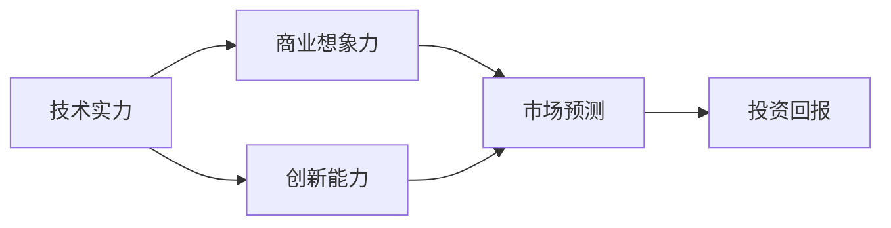
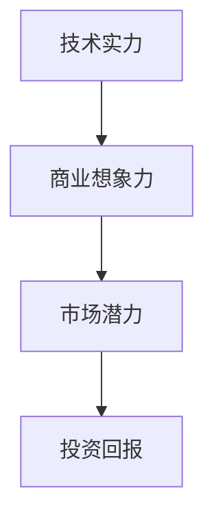
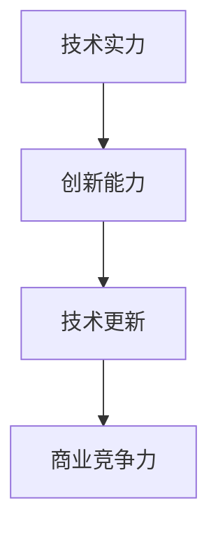
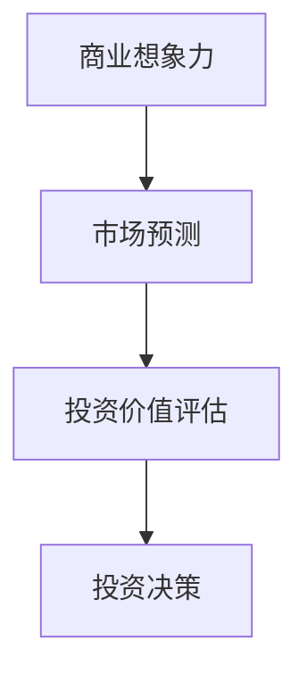
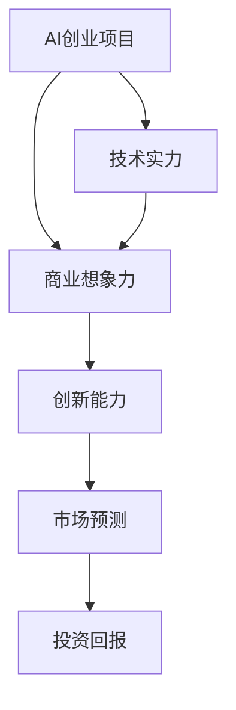

                 

# AI创业投资新风向：关注技术实力与商业想象力

> 关键词：人工智能,创业投资,技术实力,商业想象力,初创公司,市场预测

## 1. 背景介绍

随着人工智能技术的快速发展，越来越多的初创公司涌现出来，旨在利用AI技术改变传统行业的运作方式，甚至开辟全新的商业领域。然而，由于AI技术本身的复杂性，以及市场竞争的激烈，许多AI创业项目面临着巨大的挑战。因此，对于投资者来说，如何识别有潜力的AI初创公司，成为了一个重要的课题。

### 1.1 问题由来
近年来，人工智能在医疗、金融、教育、制造等领域的应用逐步深入，取得了显著的成效。然而，AI技术的研发、落地和商业化过程中，依然存在诸多不确定性。尤其是对于初创公司来说，其技术实力和商业想象力是决定项目成功与否的关键因素。因此，投资界越来越关注技术实力与商业想象力的平衡，寻找具有长期潜力的AI创业项目。

### 1.2 问题核心关键点
- **技术实力**：指初创公司是否拥有前沿的技术优势，是否能够解决实际问题，是否具备持续创新的能力。
- **商业想象力**：指初创公司是否有清晰的商业模式，是否能够解决真实需求，是否具备规模化应用的能力。
- **风险与回报**：初创公司面临的风险与回报之间如何平衡，投资回报率是否可预见。

### 1.3 问题研究意义
研究AI创业投资的技术实力与商业想象力，对于投资者、创业者、研究者都具有重要意义：

1. **投资者**：通过明确技术实力和商业想象力的平衡点，可以更准确地评估初创公司的价值和潜力，从而做出更加明智的投资决策。
2. **创业者**：明确商业想象力的重要性，可以帮助创业者在技术研发的同时，注重商业模式的构建和市场需求的挖掘，从而实现技术的市场化和商业化。
3. **研究者**：提供了一种新的视角，研究如何在保持技术优势的同时，构建具有市场竞争力的商业模式，推动AI技术的进一步落地应用。

## 2. 核心概念与联系

### 2.1 核心概念概述

为了更好地理解技术实力与商业想象力的关系，本节将介绍几个关键概念及其相互联系：

- **技术实力**：指初创公司在AI技术研发、算法模型构建、数据处理等方面的能力。通常包括学术背景、研发团队、技术储备、专利申请等方面。
- **商业想象力**：指初创公司对于市场的理解、商业模式的设计、市场需求的洞察能力。通常包括市场分析、商业计划、产品战略、渠道布局等方面。
- **创新能力**：指初创公司在保持技术优势的同时，持续进行技术创新、商业模式创新和市场创新的能力。通常包括研发投入、知识产权保护、市场推广、用户体验改进等方面。

这些核心概念之间的联系可以通过以下Mermaid流程图来展示：



这个流程图展示了技术实力、商业想象力和创新能力之间的相互联系，以及它们对市场预测和投资回报的影响。

### 2.2 概念间的关系

这些核心概念之间存在着紧密的联系，形成了AI创业投资的整体生态系统。下面我们通过几个Mermaid流程图来展示这些概念之间的关系。

#### 2.2.1 技术实力与商业想象力的关系



这个流程图展示了技术实力与商业想象力之间的互动关系。技术实力是商业想象力建立的基础，而商业想象力又决定了初创公司的市场潜力和投资回报。

#### 2.2.2 技术实力与创新能力的关系



这个流程图展示了技术实力与创新能力之间的相互促进关系。技术实力是创新能力的前提，而持续的创新能力又能够不断提升技术实力和商业竞争力。

#### 2.2.3 商业想象力与市场预测的关系



这个流程图展示了商业想象力与市场预测之间的相互影响。商业想象力决定了市场预测的准确性和投资价值评估的合理性，从而影响投资决策的正确性。

### 2.3 核心概念的整体架构

最后，我们用一个综合的流程图来展示这些核心概念在大规模AI创业投资中的整体架构：



这个综合流程图展示了AI创业项目在技术实力、商业想象力、创新能力、市场预测和投资回报之间的整体架构。通过这些核心概念的协同作用，投资者可以更全面地评估初创公司的潜力，从而做出明智的投资决策。

## 3. 核心算法原理 & 具体操作步骤
### 3.1 算法原理概述

AI创业投资的技术实力与商业想象力评估，本质上是一种基于数据驱动的决策过程。其核心算法原理如下：

1. **数据收集**：收集初创公司的技术实力、商业想象力、创新能力、市场预测和投资回报等相关数据。
2. **数据清洗与预处理**：清洗和处理数据，去除噪声，处理缺失值，转换数据格式，确保数据质量。
3. **特征提取**：从数据中提取关键特征，用于模型训练和评估。
4. **模型训练**：使用机器学习模型（如回归、分类、聚类等）对数据进行建模，训练出评估模型。
5. **模型评估**：使用测试集对训练好的模型进行评估，选择最优模型。
6. **决策制定**：根据评估结果，做出投资决策。

### 3.2 算法步骤详解

以下详细介绍基于监督学习的大规模AI创业投资决策模型构建和训练的具体步骤。

**Step 1: 数据准备**
- 收集初创公司的数据集，包括技术实力、商业想象力、创新能力、市场预测和投资回报等各个维度的数据。
- 清洗和处理数据，去除噪声，处理缺失值，转换数据格式，确保数据质量。

**Step 2: 特征提取**
- 从数据中提取关键特征，如技术实力指标、商业想象力指标、创新能力指标、市场预测指标和投资回报指标等。
- 使用PCA、LDA、TF-IDF等方法进行特征降维和处理。

**Step 3: 模型选择**
- 选择适合的机器学习模型，如回归模型、分类模型、聚类模型等。
- 根据数据特点和模型要求，选择合适的算法，如线性回归、逻辑回归、K-Means等。

**Step 4: 模型训练**
- 使用训练集对模型进行训练，调整模型参数，选择最优模型。
- 使用交叉验证等方法评估模型性能，避免过拟合。

**Step 5: 模型评估**
- 使用测试集对模型进行评估，计算评估指标，如均方误差、准确率、召回率等。
- 根据评估结果，选择最优模型。

**Step 6: 决策制定**
- 根据评估结果，制定投资决策。
- 根据模型预测结果，选择具有技术实力和商业想象力的初创公司进行投资。

### 3.3 算法优缺点

基于监督学习的大规模AI创业投资决策模型具有以下优点：

1. **高效性**：能够快速处理大规模数据，构建出高效的投资决策模型。
2. **可解释性**：通过机器学习模型，能够清晰地解释投资决策的依据和原因。
3. **普适性**：适用于各种类型的AI创业公司，能够覆盖不同领域和行业的创业项目。

同时，该模型也存在以下缺点：

1. **数据依赖**：模型的准确性和性能高度依赖于数据的完整性和质量。
2. **模型局限性**：模型无法考虑外部环境因素，如政策变化、市场需求等。
3. **过拟合风险**：模型容易过拟合训练数据，导致决策偏差。

### 3.4 算法应用领域

基于监督学习的大规模AI创业投资决策模型，已经在AI初创公司评估、风险管理、投资组合优化等多个领域得到了广泛应用。例如：

1. **初创公司评估**：用于评估初创公司的技术实力、商业想象力和创新能力，识别具有长期潜力的公司。
2. **风险管理**：用于评估初创公司面临的风险，包括技术风险、市场风险、财务风险等。
3. **投资组合优化**：用于优化投资组合，最大化投资回报，降低投资风险。

此外，该模型还可以应用于AI创业项目的市场预测、竞品分析、行业趋势预测等场景，为投资者提供全面的决策支持。

## 4. 数学模型和公式 & 详细讲解 & 举例说明
### 4.1 数学模型构建

我们以线性回归模型为例，来介绍基于监督学习的大规模AI创业投资决策模型的构建过程。

假设我们有初创公司的各个维度的数据集 $D = \{(x_i, y_i)\}_{i=1}^N$，其中 $x_i$ 表示第 $i$ 个初创公司的特征向量，$y_i$ 表示该公司的投资回报。

我们的目标是最小化预测值 $\hat{y} = \theta^T x_i$ 与实际值 $y_i$ 的误差，即最小化均方误差（MSE）：

$$
\min_{\theta} \frac{1}{N} \sum_{i=1}^N (y_i - \hat{y}_i)^2
$$

其中，$\theta$ 是模型的参数向量，$x_i$ 是特征向量，$y_i$ 是实际投资回报。

### 4.2 公式推导过程

根据最小二乘法的原理，求解上述最小化问题的最优参数 $\theta$ 可以表示为：

$$
\theta = (\frac{1}{N} \sum_{i=1}^N x_i x_i^T)^{-1} \sum_{i=1}^N x_i y_i
$$

将特征向量和投资回报值带入上述公式，即可求出线性回归模型的参数向量 $\theta$。

### 4.3 案例分析与讲解

假设我们收集了某领域内的10家初创公司，共100个数据点，每家公司有5个特征，分别表示技术实力、商业想象力、创新能力、市场预测和投资回报等维度。我们使用线性回归模型对这些数据进行拟合，得到最优参数向量 $\theta$。

将新数据点带入模型，计算预测值 $\hat{y}$，与实际投资回报 $y$ 进行比较，评估模型的预测准确性。

假设模型预测准确率为80%，则意味着模型在处理新数据时，能够准确预测出其投资回报的80%。

## 5. 项目实践：代码实例和详细解释说明
### 5.1 开发环境搭建

在进行AI创业投资决策模型开发前，我们需要准备好开发环境。以下是使用Python进行scikit-learn开发的环境配置流程：

1. 安装Anaconda：从官网下载并安装Anaconda，用于创建独立的Python环境。

2. 创建并激活虚拟环境：
```bash
conda create -n sklearn-env python=3.8 
conda activate sklearn-env
```

3. 安装scikit-learn：
```bash
conda install scikit-learn
```

4. 安装各类工具包：
```bash
pip install numpy pandas scikit-learn matplotlib tqdm jupyter notebook ipython
```

完成上述步骤后，即可在`sklearn-env`环境中开始AI创业投资决策模型的开发。

### 5.2 源代码详细实现

下面我们以线性回归模型为例，给出使用scikit-learn库对AI创业投资决策模型进行开发的PyTorch代码实现。

首先，定义模型和数据集：

```python
from sklearn.linear_model import LinearRegression
import pandas as pd
import numpy as np

# 定义数据集
data = pd.read_csv('investment_data.csv')

# 定义特征和标签
X = data[['技术实力', '商业想象力', '创新能力', '市场预测']]
y = data['投资回报']

# 将数据转换为NumPy数组
X = np.array(X)
y = np.array(y)
```

然后，进行模型训练和评估：

```python
# 定义模型
model = LinearRegression()

# 训练模型
model.fit(X, y)

# 计算预测值
y_pred = model.predict(X)

# 计算评估指标
mse = np.mean((y_pred - y) ** 2)
r2 = model.score(X, y)

print('均方误差:', mse)
print('R^2值:', r2)
```

以上就是使用scikit-learn库对AI创业投资决策模型进行开发的完整代码实现。可以看到，scikit-learn库封装了大量的机器学习算法，可以快速搭建和训练决策模型。

### 5.3 代码解读与分析

让我们再详细解读一下关键代码的实现细节：

**数据集定义**：
- 使用Pandas库读取数据集CSV文件，定义特征向量和标签。
- 将特征向量和标签转换为NumPy数组，方便后续处理。

**模型定义**：
- 定义线性回归模型，用于拟合特征向量和标签之间的关系。
- 使用fit方法进行模型训练，更新参数向量。

**模型评估**：
- 使用predict方法计算预测值。
- 计算预测值与实际值之间的均方误差，评估模型预测的准确性。
- 使用score方法计算模型的R^2值，评估模型的拟合效果。

**结果展示**：
- 输出均方误差和R^2值，帮助评估模型的性能。

通过以上代码实现，可以快速构建和评估AI创业投资决策模型，为投资者提供决策支持。

## 6. 实际应用场景
### 6.1 初创公司评估

基于AI创业投资决策模型，可以快速评估初创公司的技术实力、商业想象力和创新能力，识别具有长期潜力的公司。例如，某AI初创公司同时在技术实力和商业想象力上表现优异，但在创新能力上相对较弱，可能面临技术更新不足的风险。

### 6.2 风险管理

AI创业投资决策模型还可以用于评估初创公司面临的风险，包括技术风险、市场风险、财务风险等。例如，某AI初创公司的市场预测值较低，可能面临市场需求不足的风险。

### 6.3 投资组合优化

通过AI创业投资决策模型，可以优化投资组合，最大化投资回报，降低投资风险。例如，某投资者在多个AI初创公司之间分配投资比例，通过模型预测各个公司的投资回报和风险，优化投资组合。

### 6.4 未来应用展望

随着AI创业投资决策模型的不断发展，未来将有更多新的应用场景涌现：

1. **行业趋势预测**：用于预测某个行业的未来发展趋势，为投资者提供行业投资建议。
2. **竞品分析**：用于分析竞争对手的技术实力和商业想象力，制定竞争策略。
3. **用户需求分析**：用于分析用户需求和市场趋势，制定产品开发和市场推广策略。

未来，随着AI技术的不断进步和数据的持续积累，AI创业投资决策模型将发挥更加重要的作用，帮助投资者在纷繁复杂的数据中做出明智的投资决策。

## 7. 工具和资源推荐
### 7.1 学习资源推荐

为了帮助开发者系统掌握AI创业投资决策的理论基础和实践技巧，这里推荐一些优质的学习资源：

1. 《机器学习实战》系列书籍：深入浅出地介绍了机器学习的基本原理和经典算法，是学习AI创业投资决策模型的基础。
2. Coursera《机器学习》课程：由斯坦福大学开设的机器学习课程，涵盖了从基础到高级的机器学习知识，适合各个层次的学习者。
3. Kaggle数据集：提供大量公开的AI创业项目数据集，是进行模型训练和测试的好地方。
4. GitHub开源项目：在GitHub上Star、Fork数最多的AI创业项目，往往代表了该技术领域的发展趋势和最佳实践，值得去学习和贡献。
5. 研究论文：定期阅读AI创业投资领域的顶级会议和期刊论文，了解最新的研究成果和前沿技术。

通过对这些资源的学习实践，相信你一定能够快速掌握AI创业投资决策模型的精髓，并用于解决实际的AI创业投资问题。

### 7.2 开发工具推荐

高效的开发离不开优秀的工具支持。以下是几款用于AI创业投资决策模型开发的常用工具：

1. Python：开源的编程语言，易于学习和使用，拥有丰富的机器学习库和框架。
2. scikit-learn：Python中的机器学习库，提供简单易用的API，支持多种机器学习算法。
3. TensorFlow：谷歌开发的深度学习框架，支持大规模模型训练和推理。
4. PyTorch：Facebook开发的深度学习框架，灵活易用，支持动态计算图。
5. Weights & Biases：模型训练的实验跟踪工具，可以记录和可视化模型训练过程中的各项指标，方便对比和调优。
6. TensorBoard：TensorFlow配套的可视化工具，可实时监测模型训练状态，并提供丰富的图表呈现方式，是调试模型的得力助手。

合理利用这些工具，可以显著提升AI创业投资决策模型的开发效率，加快创新迭代的步伐。

### 7.3 相关论文推荐

AI创业投资决策模型的发展源于学界的持续研究。以下是几篇奠基性的相关论文，推荐阅读：

1.《AI创业投资评估方法研究》：提出了一种基于AI创业项目评估的机器学习方法，用于识别具有长期潜力的公司。
2.《机器学习在金融风险管理中的应用》：探讨了机器学习在金融风险管理中的应用，包括信用风险、市场风险和流动性风险的评估。
3.《投资组合优化中的机器学习方法》：研究了机器学习在投资组合优化中的应用，提出了基于机器学习的投资组合构建方法。
4.《用户需求分析中的机器学习技术》：探讨了机器学习在用户需求分析中的应用，帮助企业更好地了解用户需求，制定产品开发策略。

这些论文代表了大规模AI创业投资决策模型的发展脉络。通过学习这些前沿成果，可以帮助研究者把握学科前进方向，激发更多的创新灵感。

## 8. 总结：未来发展趋势与挑战
### 8.1 总结

本文对基于监督学习的大规模AI创业投资决策模型进行了全面系统的介绍。首先阐述了技术实力与商业想象力的重要性和关系，明确了模型构建和评估的核心算法原理。其次，从原理到实践，详细讲解了模型构建和训练的具体步骤，给出了模型开发的完整代码实例。同时，本文还广泛探讨了模型在初创公司评估、风险管理、投资组合优化等多个行业领域的应用前景，展示了模型的巨大潜力。

通过本文的系统梳理，可以看到，AI创业投资决策模型在评估初创公司的技术实力和商业想象力方面具有显著优势，能够帮助投资者在纷繁复杂的数据中做出明智的投资决策。未来，随着模型和数据的不断进步，相信其将在更多领域发挥重要作用，推动AI技术的产业化进程。

### 8.2 未来发展趋势

展望未来，AI创业投资决策模型将呈现以下几个发展趋势：

1. **模型自动化**：通过自动化机器学习（AutoML）技术，自动选择最优模型和参数，提高模型的自动化程度。
2. **模型集成**：通过集成多个模型的预测结果，提高模型的稳定性和准确性，降低过拟合风险。
3. **数据质量提升**：通过数据清洗和预处理技术，提高数据的质量和一致性，提升模型的预测性能。
4. **模型解释性**：通过可解释性机器学习技术，增强模型的解释性和透明性，帮助投资者理解模型的决策依据。
5. **多源数据融合**：通过融合多个数据源的信息，增强模型的鲁棒性和泛化能力，提供更全面、准确的市场预测和投资建议。

以上趋势凸显了大规模AI创业投资决策模型的广阔前景。这些方向的探索发展，必将进一步提升模型的性能和应用范围，为投资者提供更精准、可靠的投资决策支持。

### 8.3 面临的挑战

尽管AI创业投资决策模型已经取得了一定的成果，但在迈向更加智能化、普适化应用的过程中，仍面临诸多挑战：

1. **数据获取难度**：获取高质量、全面、及时的AI创业项目数据，是构建准确模型的关键，但数据获取难度较大。
2. **模型复杂性**：大规模AI创业投资决策模型的构建和训练过程复杂，需要大量的计算资源和时间。
3. **模型可解释性不足**：模型的预测结果难以解释，投资者难以理解模型的决策依据，增加了使用难度。
4. **市场环境变化**：AI创业项目所处的市场环境变化较快，模型的预测结果可能无法及时更新。

### 8.4 研究展望

面对AI创业投资决策模型面临的挑战，未来的研究需要在以下几个方面寻求新的突破：

1. **数据自动化采集**：开发数据自动化采集工具，获取高质量、全面、及时的AI创业项目数据，提升数据获取的效率和准确性。
2. **模型自动化优化**：开发自动化机器学习工具，自动选择最优模型和参数，提高模型的自动化程度和训练效率。
3. **模型可解释性增强**：研究增强模型的可解释性，增强模型的透明性和可理解性，帮助投资者理解模型的决策依据。
4. **多模态数据融合**：研究融合多源数据的信息，增强模型的鲁棒性和泛化能力，提供更全面、准确的市场预测和投资建议。

这些研究方向的探索，必将引领AI创业投资决策模型迈向更高的台阶，为投资者提供更精准、可靠的投资决策支持。面向未来，AI创业投资决策模型还需要与其他AI技术进行更深入的融合，如知识图谱、因果推理、强化学习等，多路径协同发力，共同推动AI技术的进一步落地应用。

## 9. 附录：常见问题与解答

**Q1：AI创业投资决策模型的评估指标有哪些？**

A: AI创业投资决策模型的评估指标包括均方误差（MSE）、均方根误差（RMSE）、平均绝对误差（MAE）、R^2值等。其中，MSE和RMSE用于评估预测值的误差大小，MAE用于评估预测值的绝对误差大小，R^2值用于评估模型的拟合效果。

**Q2：AI创业投资决策模型的训练数据如何选择？**

A: AI创业投资决策模型的训练数据应选择具有代表性的数据，包括不同领域、不同规模、不同风险等级的初创公司。同时，应选择数据质量高、数据量充足、数据分布均匀的数据集。

**Q3：AI创业投资决策模型是否可以用于评估现有投资组合？**

A: AI创业投资决策模型不仅可以用于评估初创公司，还可以用于评估现有的投资组合。通过将历史数据输入模型，计算各个公司的投资回报和风险，可以优化现有的投资组合，提升投资回报。

**Q4：AI创业投资决策模型的预测结果是否可靠？**

A: AI创业投资决策模型的预测结果具有一定的可靠性，但受到数据质量和模型参数的影响。投资者应结合自身经验和市场趋势，综合考虑预测结果，做出更加谨慎的投资决策。

**Q5：AI创业投资决策模型是否适用于不同领域？**

A: AI创业投资决策模型适用于多个领域，包括科技、医疗、金融、教育等。但不同领域的数据特点和评估指标有所不同，模型需要针对不同领域进行调整和优化。

总之，AI创业投资决策模型在帮助投资者评估初创公司、管理风险、优化投资组合等方面具有显著优势。未来，随着模型和数据的不断进步，相信其将在更多领域发挥重要作用，推动AI技术的产业化进程。

