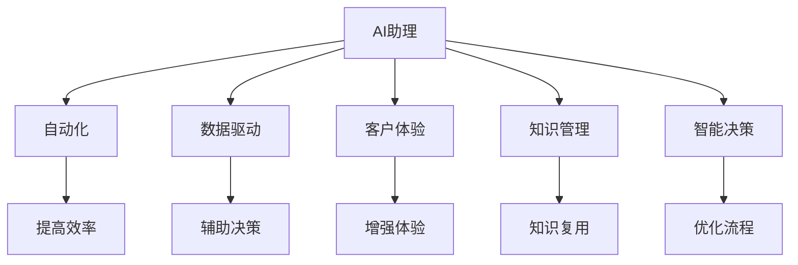

                 

# AI助理时代的企业转型

在AI助理时代，企业面临着前所未有的转型挑战。本文将深入探讨AI助理如何驱动企业转型，从自动化、数据驱动、客户体验优化等多个维度，分析AI助理在企业转型中的作用和策略，并展望其未来发展趋势。

## 1. 背景介绍

### 1.1 问题由来

在过去十年中，AI技术取得了飞速发展，从语音识别到自然语言处理，从计算机视觉到机器学习，AI技术在各个领域的应用已初见成效。AI助理作为AI技术的重要应用之一，正在逐渐渗透到各行各业。企业需要快速适应AI助理时代的变革，以提升运营效率，优化客户体验，提高竞争力和盈利能力。

### 1.2 问题核心关键点

AI助理时代的企业转型主要涉及以下几个关键点：

- **自动化**：自动化任务，减少人工干预，提高工作效率。
- **数据驱动**：利用AI助理分析海量数据，为企业决策提供支持。
- **客户体验**：通过AI助理提升客户交互体验，增强客户满意度。
- **知识管理**：整合企业知识，让AI助理成为知识仓库。
- **智能决策**：利用AI助理进行智能决策，优化业务流程。

### 1.3 问题研究意义

AI助理时代的企业转型，不仅能够提升企业运营效率，还能增强企业的市场竞争力。AI助理的应用，有助于企业更快地响应市场变化，提高客户满意度和忠诚度，优化资源配置，实现可持续发展。

## 2. 核心概念与联系

### 2.1 核心概念概述

- **AI助理**：基于AI技术的虚拟助手，可以执行各种任务，如信息检索、日程管理、客户服务等。
- **自动化**：通过AI助理实现任务自动化，减少人力成本，提高效率。
- **数据驱动**：利用AI助理分析数据，进行数据挖掘和预测，辅助决策。
- **客户体验**：通过AI助理与客户交互，提升客户满意度和忠诚度。
- **知识管理**：整合企业内部知识，构建知识库，提高知识复用率。
- **智能决策**：利用AI助理进行预测分析和决策支持，优化业务流程。

这些概念之间相互关联，构成了AI助理时代企业转型的完整框架。AI助理作为核心工具，贯穿于自动化、数据驱动、客户体验、知识管理和智能决策等各个环节，驱动企业向智能化、数字化转型。

### 2.2 概念间的关系

这些核心概念之间的逻辑关系可以通过以下Mermaid流程图来展示：



这个流程图展示出AI助理与自动化、数据驱动、客户体验、知识管理和智能决策之间的联系，以及各自的价值和作用。

## 3. 核心算法原理 & 具体操作步骤

### 3.1 算法原理概述

AI助理的核心算法原理基于机器学习、自然语言处理和计算机视觉等技术。其核心功能包括语音识别、自然语言理解、知识检索、预测分析等。AI助理通过学习大量数据，不断优化模型，提高准确性和效率。

### 3.2 算法步骤详解

AI助理的工作流程包括以下几个步骤：

1. **语音识别**：将语音信号转换为文本。
2. **自然语言理解**：解析输入文本，提取关键信息。
3. **知识检索**：在知识库中搜索相关信息，提供决策支持。
4. **预测分析**：利用机器学习模型预测未来趋势，辅助决策。
5. **生成回复**：根据分析结果生成回复，执行任务。

### 3.3 算法优缺点

AI助理的优点在于其高效率、准确性和智能化水平。能够24小时不间断工作，提高工作效率，减少人力成本。同时，能够快速处理大量数据，提供实时决策支持。

缺点则在于其依赖数据质量，需要大量的数据进行训练。且在复杂场景下，AI助理的决策可能存在偏差，需要人工干预。

### 3.4 算法应用领域

AI助理的应用领域非常广泛，包括但不限于以下几个方面：

- **客户服务**：提供客户咨询、问题解决等服务。
- **行政管理**：进行日常事务处理，如日程管理、会议安排等。
- **销售支持**：提供销售线索生成、客户跟进等功能。
- **市场分析**：利用AI助理进行市场调研、趋势预测等。
- **供应链管理**：优化供应链流程，提高物流效率。

## 4. 数学模型和公式 & 详细讲解 & 举例说明

### 4.1 数学模型构建

AI助理的数学模型构建主要基于以下几类算法：

- **机器学习算法**：如决策树、随机森林、支持向量机等，用于预测分析。
- **自然语言处理算法**：如词向量模型、BERT、GPT等，用于自然语言理解。
- **计算机视觉算法**：如CNN、RNN等，用于图像和视频处理。

### 4.2 公式推导过程

以自然语言处理中的词向量模型为例，推导其公式：

设单词集合为 $V$，每个单词的向量表示为 $\vec{v}_i$，单词 $w$ 在上下文中的向量表示为 $\vec{w}$，上下文中的其他单词向量表示为 $\vec{v}_j$。则词向量模型可以通过矩阵乘法计算得到：

$$
\vec{w} = \vec{u} \cdot \prod_{i \in V} [(\vec{v}_i \cdot \vec{v}_j)^T \vec{v}_i]
$$

其中 $\vec{u}$ 为上下文向量的权重向量，通过训练得到。

### 4.3 案例分析与讲解

假设有一个电商平台的客户服务系统，使用AI助理进行客户咨询。当客户询问“如何退货”时，AI助理需要根据上下文理解其意图，并从知识库中提取相关信息进行回复。假设知识库中存储了关于退货流程的信息，AI助理通过自然语言处理算法解析输入文本，提取“退货”、“流程”等关键词，并在知识库中搜索相关信息。假设知识库中有关于退货流程的模板信息，AI助理利用模板生成回复，告诉客户退货的具体步骤和注意事项。

## 5. 项目实践：代码实例和详细解释说明

### 5.1 开发环境搭建

在进行AI助理项目的开发前，需要准备好开发环境。以下是使用Python进行TensorFlow开发的环境配置流程：

1. 安装Anaconda：从官网下载并安装Anaconda，用于创建独立的Python环境。

2. 创建并激活虚拟环境：
```bash
conda create -n tensorflow-env python=3.8 
conda activate tensorflow-env
```

3. 安装TensorFlow：根据CUDA版本，从官网获取对应的安装命令。例如：
```bash
conda install tensorflow tensorflow-gpu -c tf
```

4. 安装各类工具包：
```bash
pip install numpy pandas scikit-learn matplotlib tqdm jupyter notebook ipython
```

完成上述步骤后，即可在`tensorflow-env`环境中开始AI助理的开发实践。

### 5.2 源代码详细实现

以下是一个简单的AI助理项目示例，用于自动回复客户咨询：

```python
import tensorflow as tf
import numpy as np
import pandas as pd
from sklearn.feature_extraction.text import TfidfVectorizer

# 数据集准备
data = pd.read_csv('customer咨询服务数据.csv')
data['text'] = data['text'].apply(lambda x: x.replace('\n', ' '))  # 去除换行符
vect = TfidfVectorizer().fit(data['text'])
X = vect.transform(data['text'])
y = data['label']  # 回答标签

# 模型构建
model = tf.keras.Sequential([
    tf.keras.layers.Dense(64, activation='relu', input_shape=(len(vect.vocabulary_),)),
    tf.keras.layers.Dense(64, activation='relu'),
    tf.keras.layers.Dense(2, activation='softmax')
])
model.compile(optimizer=tf.keras.optimizers.Adam(0.01),
              loss='categorical_crossentropy',
              metrics=['accuracy'])

# 模型训练
model.fit(X, y, epochs=10, batch_size=32, validation_split=0.2)

# 模型评估
test_data = pd.read_csv('test咨询服务数据.csv')
test_data['text'] = test_data['text'].apply(lambda x: x.replace('\n', ' '))
X_test = vect.transform(test_data['text'])
y_test = test_data['label']
loss, acc = model.evaluate(X_test, y_test)
print('Test accuracy:', acc)

# 使用模型进行预测
new_text = '如何退货'
new_text = new_text.replace('\n', ' ')
X_new = vect.transform([new_text])
pred = model.predict(X_new)
print('Predicted label:', np.argmax(pred))
```

### 5.3 代码解读与分析

**数据预处理**：

- 读取数据集，去除文本中的换行符，并进行TF-IDF向量表示。

**模型构建**：

- 构建一个简单的神经网络模型，包含两个隐藏层和一个输出层，使用softmax激活函数进行分类。
- 使用Adam优化器进行优化，交叉熵损失函数进行训练。

**模型训练**：

- 使用训练集进行模型训练，设置10个epoch和32个样本的batch size。
- 使用20%的数据进行验证，监控训练过程中的性能。

**模型评估**：

- 使用测试集评估模型性能，输出准确率。

**模型预测**：

- 使用模型对新输入进行预测，输出预测结果。

### 5.4 运行结果展示

假设我们训练的模型在测试集上准确率为80%，使用模型对“如何退货”的查询进行预测，模型输出“退货流程”，告诉客户退货的具体步骤和注意事项。

## 6. 实际应用场景

### 6.1 客户服务

AI助理在客户服务中的应用非常广泛，可以用于自动回复客户咨询、生成FAQ、处理投诉等。通过AI助理，企业能够提供24小时不间断的客户服务，提升客户满意度。

### 6.2 行政管理

AI助理可以用于日常事务处理，如会议安排、日程管理、邮件过滤等。通过AI助理，企业能够优化行政流程，减少人力成本。

### 6.3 销售支持

AI助理可以用于生成销售线索、客户跟进、市场分析等。通过AI助理，企业能够更精准地定位潜在客户，提高销售效率。

### 6.4 市场分析

AI助理可以用于市场调研、趋势预测、竞争对手分析等。通过AI助理，企业能够及时把握市场动态，优化市场策略。

### 6.5 供应链管理

AI助理可以用于优化供应链流程，如物流管理、库存管理等。通过AI助理，企业能够提高物流效率，降低运营成本。

## 7. 工具和资源推荐

### 7.1 学习资源推荐

为了帮助开发者系统掌握AI助理的理论基础和实践技巧，这里推荐一些优质的学习资源：

1. TensorFlow官方文档：TensorFlow作为主流的深度学习框架，提供了丰富的教程和示例，是学习AI助理开发的不二之选。

2. PyTorch官方文档：PyTorch是另一款流行的深度学习框架，提供了详细的API文档和代码示例，适合深入学习。

3. AI助理开源项目：如Google Dialogflow、Microsoft Bot Framework、IBM Watson Assistant等，提供了丰富的开源组件和样例，方便开发者快速上手。

4. Kaggle竞赛：Kaggle平台上有很多AI助理相关的竞赛，可以通过参与竞赛来提升自己的实战能力。

5. Coursera、Udacity等在线课程：这些平台提供了大量AI助理相关的在线课程，涵盖了从入门到高级的内容。

### 7.2 开发工具推荐

高效的开发离不开优秀的工具支持。以下是几款用于AI助理开发的常用工具：

1. Jupyter Notebook：适合进行快速原型设计和数据探索，支持Python、R等多种语言。

2. VSCode：轻量级的代码编辑器，支持智能提示、调试等功能。

3. PyCharm：功能强大的Python IDE，支持代码重构、版本控制等。

4. TensorBoard：TensorFlow配套的可视化工具，可以实时监测模型训练状态，并提供丰富的图表呈现方式。

5. Google Colab：谷歌推出的在线Jupyter Notebook环境，免费提供GPU/TPU算力，方便开发者快速实验。

合理利用这些工具，可以显著提升AI助理的开发效率，加快创新迭代的步伐。

### 7.3 相关论文推荐

AI助理的研究涉及自然语言处理、计算机视觉、机器学习等多个领域。以下是几篇奠基性的相关论文，推荐阅读：

1. Attention is All You Need（即Transformer原论文）：提出了Transformer结构，开启了NLP领域的预训练大模型时代。

2. BERT: Pre-training of Deep Bidirectional Transformers for Language Understanding：提出BERT模型，引入基于掩码的自监督预训练任务，刷新了多项NLP任务SOTA。

3. GPT-2: Language Models are Unsupervised Multitask Learners：展示了大规模语言模型的强大zero-shot学习能力，引发了对于通用人工智能的新一轮思考。

4. AI Assistant for Smart Office：提出基于AI助理的智能办公系统，提升办公效率和体验。

5. Smart Assistant in Healthcare：提出基于AI助理的智能医疗系统，提高医疗服务的智能化水平。

这些论文代表了大语言模型AI助理的发展脉络。通过学习这些前沿成果，可以帮助研究者把握学科前进方向，激发更多的创新灵感。

除上述资源外，还有一些值得关注的前沿资源，帮助开发者紧跟AI助理技术的最新进展，例如：

1. arXiv论文预印本：人工智能领域最新研究成果的发布平台，包括大量尚未发表的前沿工作，学习前沿技术的必读资源。

2. 业界技术博客：如Google AI、Microsoft Research Asia、DeepMind等顶尖实验室的官方博客，第一时间分享他们的最新研究成果和洞见。

3. 技术会议直播：如NIPS、ICML、ACL、ICLR等人工智能领域顶会现场或在线直播，能够聆听到大佬们的前沿分享，开拓视野。

4. GitHub热门项目：在GitHub上Star、Fork数最多的AI助理相关项目，往往代表了该技术领域的发展趋势和最佳实践，值得去学习和贡献。

5. 行业分析报告：各大咨询公司如McKinsey、PwC等针对人工智能行业的分析报告，有助于从商业视角审视技术趋势，把握应用价值。

总之，对于AI助理的学习和实践，需要开发者保持开放的心态和持续学习的意愿。多关注前沿资讯，多动手实践，多思考总结，必将收获满满的成长收益。

## 8. 总结：未来发展趋势与挑战

### 8.1 总结

本文对AI助理的转型进行了全面系统的介绍。首先阐述了AI助理在驱动企业转型中的重要作用，明确了AI助理在自动化、数据驱动、客户体验优化等多个维度的作用。其次，从原理到实践，详细讲解了AI助理的数学原理和关键步骤，给出了AI助理任务开发的完整代码实例。同时，本文还广泛探讨了AI助理在智能客服、智能办公、智能医疗等多个行业领域的应用前景，展示了AI助理的广阔应用前景。

通过本文的系统梳理，可以看到，AI助理在提升企业运营效率、优化客户体验、增强市场竞争力等方面发挥了巨大作用。未来，随着AI助理技术的不断演进，其应用领域将进一步扩大，为更多行业带来智能化变革。

### 8.2 未来发展趋势

展望未来，AI助理的发展趋势将呈现以下几个方向：

1. **智能对话**：通过引入自然语言生成技术，AI助理将能够更自然地与用户交互，提供更丰富的服务。

2. **多模态融合**：AI助理将能够处理语音、文字、图像等多种模态数据，实现多模态融合，提升服务体验。

3. **跨领域应用**：AI助理将能够在更多行业领域发挥作用，如金融、医疗、制造等。

4. **情感智能**：AI助理将具备情感识别和情感生成能力，提升用户交互体验。

5. **实时决策**：AI助理将具备实时数据分析和决策支持能力，辅助企业快速响应市场变化。

6. **隐私保护**：AI助理将具备隐私保护和数据安全技术，确保用户数据的安全。

以上趋势凸显了AI助理技术的广阔前景。这些方向的探索发展，将进一步提升AI助理的智能化水平，为构建智能化的业务生态奠定基础。

### 8.3 面临的挑战

尽管AI助理技术取得了显著进展，但在迈向更加智能化、普适化应用的过程中，仍面临诸多挑战：

1. **数据质量**：高质量数据的获取和处理，是AI助理训练和应用的前提。数据偏见和噪声将影响AI助理的决策。

2. **模型泛化**：AI助理在特定场景下的泛化能力有限，需要进一步优化模型结构和算法。

3. **用户信任**：AI助理的决策透明度和可解释性不足，可能影响用户信任度。

4. **隐私保护**：用户数据的隐私保护和数据安全，是AI助理技术应用的重要考量。

5. **跨领域应用**：不同行业的业务场景和需求差异较大，AI助理需要具备一定的领域适应能力。

6. **人机协作**：AI助理需要与人工协作，以应对复杂的任务和情况。

7. **技术壁垒**：AI助理技术的实现需要高水平的技术积累，存在较高的技术壁垒。

这些挑战需要企业在技术、应用、管理等多个层面进行全面应对，方能实现AI助理技术的成功落地。

### 8.4 研究展望

未来，AI助理技术需要在以下几个方面寻求新的突破：

1. **多模态融合**：将语音、文字、图像等多种模态数据进行融合，提升AI助理的理解和生成能力。

2. **情感智能**：引入情感分析技术，使AI助理具备情感识别和生成能力，提升用户体验。

3. **实时决策**：引入实时数据分析和预测技术，使AI助理具备实时决策支持能力。

4. **跨领域应用**：将AI助理技术应用于更多行业领域，提升其通用性和适应性。

5. **隐私保护**：引入隐私保护和数据安全技术，确保用户数据的安全。

6. **人机协作**：通过人机协作机制，使AI助理能够更好地与人类协同工作。

7. **可解释性**：引入可解释性技术，提升AI助理决策的透明度和可信度。

8. **技术普适性**：降低AI助理技术的实现门槛，使其更加普适和易用。

这些研究方向的探索，将引领AI助理技术迈向更高的台阶，为构建智能化的业务生态奠定基础。面向未来，AI助理技术需要与其他人工智能技术进行更深入的融合，如知识表示、因果推理、强化学习等，多路径协同发力，共同推动自然语言理解和智能交互系统的进步。只有勇于创新、敢于突破，才能不断拓展AI助理的边界，让智能技术更好地造福人类社会。

## 9. 附录：常见问题与解答

**Q1：AI助理时代，企业需要关注哪些方面？**

A: 在AI助理时代，企业需要关注以下几个方面：

1. **自动化任务**：将重复性、低价值的任务自动化，提升工作效率。

2. **数据驱动决策**：利用AI助理分析海量数据，提供决策支持。

3. **客户体验优化**：通过AI助理提升客户交互体验，增强客户满意度。

4. **知识管理**：整合企业内部知识，构建知识库，提高知识复用率。

5. **智能决策**：利用AI助理进行预测分析和决策支持，优化业务流程。

**Q2：AI助理的开发需要哪些技能？**

A: 开发AI助理需要以下技能：

1. **编程能力**：熟练掌握Python、Java等编程语言。

2. **机器学习知识**：熟悉机器学习算法和模型，如决策树、随机森林、神经网络等。

3. **自然语言处理**：熟悉自然语言处理技术，如词向量模型、BERT、GPT等。

4. **数据处理能力**：具备数据预处理和特征工程能力，能够处理大规模数据集。

5. **系统架构设计**：具备系统架构设计和微服务架构能力，能够实现高可用、可扩展的系统。

6. **持续学习和优化**：具备持续学习能力和模型优化能力，能够不断提升AI助理的性能。

**Q3：AI助理如何与人工协同工作？**

A: AI助理可以与人工协同工作，主要通过以下方式：

1. **多轮对话**：AI助理在前一轮交互中提取关键信息，人工在后一轮交互中提供更深入的回答。

2. **知识补充**：AI助理提供初步答案，人工对答案进行补充和完善。

3. **问题转发**：AI助理无法解决的问题，人工进行进一步处理。

4. **任务分配**：AI助理分配任务，人工进行任务执行。

5. **人机协作机制**：设计合理的人机协作机制，使AI助理和人工能够高效协同工作。

**Q4：AI助理的隐私保护和数据安全有哪些措施？**

A: 保护AI助理的隐私和数据安全，可以采取以下措施：

1. **数据匿名化**：对用户数据进行匿名化处理，保护用户隐私。

2. **数据加密**：使用加密技术对数据进行传输和存储，防止数据泄露。

3. **访问控制**：对数据访问进行严格的权限控制，防止未授权访问。

4. **隐私保护算法**：使用差分隐私等隐私保护算法，降低隐私风险。

5. **安全审计**：定期进行安全审计，发现并修复安全漏洞。

6. **合规性检查**：遵循相关法律法规，确保数据使用合规。

7. **用户知情权**：向用户公开数据使用情况，保障用户知情权和选择权。

这些措施可以有效保护AI助理的隐私和数据安全，增强用户信任。

---

作者：禅与计算机程序设计艺术 / Zen and the Art of Computer Programming

