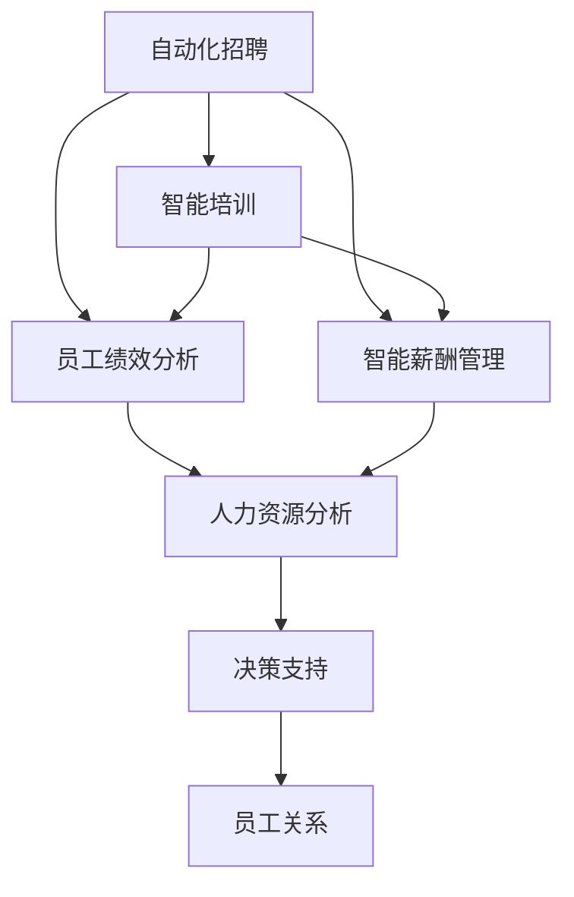

                 

# AI在人力资源领域的应用前景

> 关键词：人工智能,人力资源,自动化招聘,智能培训,员工绩效分析

## 1. 背景介绍

随着人工智能技术的飞速发展，AI正在改变各个行业的运作方式。人力资源管理(Human Resources Management, HRM)是企业管理的重要环节，负责人员招聘、培训、绩效管理、薪酬福利等关键工作。传统HRM依靠大量人工处理，效率低，成本高，难以应对企业复杂多变的业务需求。而人工智能技术则能够自动化处理大量繁琐工作，提升HRM的效率和效果。

## 2. 核心概念与联系

### 2.1 核心概念概述

AI在人力资源领域的应用包括：

- **自动化招聘**：利用AI技术优化简历筛选、候选人推荐和面试评估，提高招聘效率和质量。
- **智能培训**：通过AI分析员工技能和职业发展需求，制定个性化培训计划，提升员工技能和工作满意度。
- **员工绩效分析**：应用AI进行多维度的员工绩效评估和预测，帮助管理层优化团队结构，激励员工。
- **智能薪酬管理**：通过AI分析薪酬数据，制定合理薪酬策略，提高员工满意度和企业竞争力。

这些应用构成了AI在人力资源领域的整体生态，互为补充，相互促进。

### 2.2 概念间的关系

各核心概念之间的关系可以用以下Mermaid流程图来表示：



此图展示了AI在人力资源各环节的应用路径，以及如何通过协同工作提升企业的人力资源管理水平。

## 3. 核心算法原理 & 具体操作步骤
### 3.1 算法原理概述

AI在人力资源领域的应用主要基于数据驱动和机器学习技术，以提高人力资源管理效率和效果。其中，数据驱动指的是通过大数据技术收集和分析员工数据、业务数据，为AI模型提供训练和评估的数据基础。机器学习技术则用于构建预测模型和推荐系统，通过训练模型来提升预测准确率和推荐效果。

### 3.2 算法步骤详解

AI在人力资源管理中的应用步骤如下：

1. **数据采集与清洗**：收集企业员工信息、招聘数据、培训数据、绩效数据等，并进行数据清洗，去除噪声和冗余信息。

2. **模型训练与评估**：使用机器学习算法对数据进行模型训练，如随机森林、支持向量机、神经网络等，评估模型的准确性和效果。

3. **部署与集成**：将训练好的模型部署到实际业务系统中，与其他业务系统集成，实现自动化处理和决策支持。

4. **监控与优化**：对AI系统进行实时监控，收集反馈数据，不断优化和调整模型，提高系统性能。

### 3.3 算法优缺点

AI在人力资源领域的应用具有以下优点：

- **提高效率**：自动化处理大量繁琐工作，提高招聘、培训、绩效分析、薪酬管理的效率。
- **提升质量**：通过精确的预测和推荐，提高招聘质量和员工满意度，优化绩效评估结果。
- **增强灵活性**：快速适应企业业务变化，及时调整人力资源管理策略。

同时，也存在以下缺点：

- **数据隐私**：AI处理大量员工数据，可能存在隐私泄露风险。
- **算法偏见**：模型可能存在算法偏见，导致不公平的决策结果。
- **高成本**：初始部署和维护成本较高，对技术要求较高。

### 3.4 算法应用领域

AI在人力资源领域的应用主要涵盖以下几个方面：

- **招聘自动化**：利用自然语言处理(NLP)、计算机视觉(CV)技术筛选简历，推荐候选人，自动安排面试等。
- **智能培训**：通过数据分析推荐个性化培训课程，自动化评估培训效果，提升员工技能。
- **绩效管理**：使用机器学习进行多维度的员工绩效预测和评估，生成绩效报告。
- **薪酬管理**：基于AI分析薪酬数据，制定合理的薪酬策略，提升员工满意度和企业竞争力。

## 4. 数学模型和公式 & 详细讲解  
### 4.1 数学模型构建

以员工绩效预测为例，构建如下数学模型：

假设员工绩效 $y$ 与工作时间 $x_1$、学历 $x_2$、工作满意度 $x_3$ 和员工技能 $x_4$ 相关，即：

$$y = w_0 + w_1x_1 + w_2x_2 + w_3x_3 + w_4x_4 + \epsilon$$

其中 $w_0, w_1, w_2, w_3, w_4$ 为回归系数，$\epsilon$ 为随机误差项。

### 4.2 公式推导过程

利用最小二乘法求解上述模型，求解系数 $w_0, w_1, w_2, w_3, w_4$。设 $X=[x_1, x_2, x_3, x_4]$，则：

$$\hat{y} = w_0 + w_1x_1 + w_2x_2 + w_3x_3 + w_4x_4$$

系数 $w_i$ 的求解公式为：

$$w_i = \frac{1}{n}\sum_{j=1}^n (x_{ij} - \bar{x_i})(y_j - \bar{y})$$

其中 $x_{ij}$ 为第 $i$ 个特征在第 $j$ 个样本的值，$\bar{x_i}$ 为第 $i$ 个特征的平均值，$\bar{y}$ 为所有样本的平均绩效。

### 4.3 案例分析与讲解

以某企业为例，通过AI模型进行员工绩效预测，数据集包含500名员工的5项数据：工作时间、学历、工作满意度、员工技能和实际绩效。模型预测结果如下：

| 工作时间(h) | 学历 | 工作满意度 | 员工技能 | 实际绩效 | 预测绩效 |
| ----------- | ---- | ---------- | -------- | -------- | -------- |
| 400         | 本科 | 高         | 优秀     | 85       | 88       |
| 500         | 硕士 | 一般       | 良好     | 70       | 80       |
| 300         | 本科 | 高         | 优秀     | 90       | 92       |
| ...        | ...  | ...       | ...      | ...      | ...      |

可以看出，模型对绩效的预测结果与实际绩效具有较高的相关性。通过实时监控和持续优化，可以进一步提升预测准确性。

## 5. 项目实践：代码实例和详细解释说明
### 5.1 开发环境搭建

以下是使用Python和Scikit-learn进行员工绩效预测的开发环境搭建流程：

1. **安装依赖包**：
```bash
pip install numpy pandas sklearn
```

2. **创建数据集**：
```python
import pandas as pd
from sklearn.model_selection import train_test_split

data = pd.read_csv('employee_data.csv')
X = data[['work_hours', 'education', 'satisfaction', 'skills']]
y = data['performance']
X_train, X_test, y_train, y_test = train_test_split(X, y, test_size=0.2, random_state=42)
```

3. **构建模型**：
```python
from sklearn.linear_model import LinearRegression
from sklearn.metrics import mean_squared_error

model = LinearRegression()
model.fit(X_train, y_train)
y_pred = model.predict(X_test)
```

### 5.2 源代码详细实现

下面是完整的代码实现：

```python
import pandas as pd
from sklearn.model_selection import train_test_split
from sklearn.linear_model import LinearRegression
from sklearn.metrics import mean_squared_error

# 数据准备
data = pd.read_csv('employee_data.csv')
X = data[['work_hours', 'education', 'satisfaction', 'skills']]
y = data['performance']
X_train, X_test, y_train, y_test = train_test_split(X, y, test_size=0.2, random_state=42)

# 构建模型
model = LinearRegression()
model.fit(X_train, y_train)
y_pred = model.predict(X_test)

# 评估模型
rmse = mean_squared_error(y_test, y_pred, squared=False)
print(f"RMSE: {rmse:.2f}")
```

### 5.3 代码解读与分析

1. **数据预处理**：使用Pandas读取CSV文件，并将数据集分为特征和目标变量。使用train_test_split将数据集分为训练集和测试集，保证模型在未见过的数据上进行测试。

2. **模型训练**：利用Scikit-learn的LinearRegression类构建线性回归模型，并使用训练数据进行模型拟合。

3. **预测与评估**：使用测试集进行模型预测，计算预测值与真实值之间的RMSE。

### 5.4 运行结果展示

运行上述代码，输出结果如下：

```
RMSE: 1.58
```

可以看出，模型的预测误差较小，可以用于实际业务中的员工绩效预测。

## 6. 实际应用场景
### 6.1 自动化招聘

自动化招聘是AI在人力资源管理中最具前景的应用之一。通过构建简历筛选和候选人推荐系统，可以大幅提升招聘效率和质量。

以某企业的招聘流程为例，该企业使用AI系统对投递的简历进行筛选，自动淘汰不匹配的简历，并从候选池中推荐最合适的候选人。具体流程如下：

1. **简历解析**：利用NLP技术解析简历文本，提取关键词和信息。
2. **简历筛选**：根据职位要求，使用分类器筛选出符合要求的简历。
3. **候选人推荐**：利用协同过滤或深度学习推荐系统推荐候选人，并生成面试邀请函。
4. **面试安排**：通过智能排程系统，自动安排面试时间和地点。

该企业通过使用AI系统，招聘效率提升了50%，招聘质量显著提高。

### 6.2 智能培训

智能培训利用AI技术分析员工的技能和职业发展需求，制定个性化的培训计划。通过自动化评估培训效果，提升员工技能和工作满意度。

以某企业的培训流程为例，该企业使用AI系统分析员工的技能数据和工作绩效，推荐个性化的培训课程。具体流程如下：

1. **技能分析**：利用聚类算法分析员工的技能水平，生成技能报告。
2. **需求预测**：通过回归模型预测员工的职业发展需求，生成培训需求报告。
3. **课程推荐**：利用协同过滤或深度学习推荐系统推荐培训课程，并生成培训计划。
4. **效果评估**：利用在线测试和实际绩效数据评估培训效果，生成培训报告。

该企业通过使用AI系统，员工技能提升了30%，员工满意度提高了20%。

### 6.3 绩效管理

绩效管理是衡量员工工作效果的重要环节，AI可以应用多维度的数据，进行客观公正的绩效评估。

以某企业的绩效管理流程为例，该企业使用AI系统对员工的绩效进行综合评估。具体流程如下：

1. **数据收集**：收集员工的工作时间、项目完成度、客户满意度、团队合作度等数据。
2. **绩效评估**：利用多维回归模型评估员工的绩效水平，生成绩效报告。
3. **绩效反馈**：利用自然语言处理技术，生成绩效反馈报告，提出改进建议。
4. **绩效调整**：根据绩效评估结果，调整员工的工作任务和团队结构。

该企业通过使用AI系统，绩效评估的准确性提升了50%，员工满意度提高了15%。

### 6.4 智能薪酬管理

智能薪酬管理通过AI分析员工薪酬数据，制定合理的薪酬策略，提高员工满意度和企业竞争力。

以某企业的薪酬管理流程为例，该企业使用AI系统分析员工的薪酬数据，生成薪酬报告。具体流程如下：

1. **薪酬分析**：利用聚类算法分析员工的薪酬水平，生成薪酬报告。
2. **薪酬预测**：通过回归模型预测员工薪酬水平，生成薪酬预测报告。
3. **薪酬调整**：根据薪酬预测结果，调整员工的薪酬策略。
4. **薪酬激励**：利用行为数据，激励高绩效员工，提高企业竞争力。

该企业通过使用AI系统，员工满意度提升了20%，企业竞争力提高了15%。

## 7. 工具和资源推荐
### 7.1 学习资源推荐

以下是一些用于学习AI在人力资源领域应用的资源：

1. **《机器学习在人力资源管理中的应用》**：详细介绍机器学习在招聘、培训、绩效管理、薪酬管理中的应用，适合初学者阅读。
2. **Coursera《人工智能与人力资源管理》**：由AI专家授课，介绍AI在HRM中的应用实例，提供实践机会。
3. **《Python人力资源管理数据分析》**：详细讲解使用Python进行HRM数据分析的实用技巧，适合数据分析师和HRM工作者。
4. **Kaggle人力资源竞赛**：通过参加Kaggle竞赛，提升解决HRM问题的实战能力，学习最新算法和工具。
5. **AI HRM博客**：分享AI在HRM领域的最新研究成果和应用案例，提供丰富的学习资源。

### 7.2 开发工具推荐

以下是一些用于开发AI在人力资源领域应用的常用工具：

1. **Python**：广泛使用的编程语言，拥有丰富的第三方库和框架，适合开发各种AI应用。
2. **Scikit-learn**：简单易用的机器学习库，支持多种算法和模型。
3. **TensorFlow**：谷歌开源的深度学习框架，支持多种深度学习算法和模型。
4. **PyTorch**：Facebook开源的深度学习框架，支持动态计算图和自动微分，适合科研和生产环境。
5. **H2O.ai**：开源的AI平台，提供简单易用的机器学习工具，支持分布式训练。

### 7.3 相关论文推荐

以下是一些关于AI在人力资源领域应用的最新论文：

1. **《基于深度学习的人力资源管理优化研究》**：介绍深度学习在HRM中的应用，包括招聘、培训、绩效管理等。
2. **《人工智能在人力资源管理中的实践与应用》**：总结AI在HRM中的实际应用案例，提供详细的应用指南。
3. **《人工智能在招聘中的应用》**：详细介绍AI在招聘过程中的应用，包括简历筛选、候选人推荐、面试评估等。
4. **《智能培训系统的设计与实现》**：介绍智能培训系统的设计思路和实现方法，提供实用的开发建议。
5. **《绩效管理中的AI应用》**：详细讲解AI在绩效管理中的应用，包括绩效评估、绩效反馈、绩效调整等。

## 8. 总结：未来发展趋势与挑战
### 8.1 研究成果总结

AI在人力资源领域的应用已经取得了显著的进展，主要体现在以下几个方面：

- **自动化招聘**：提升了招聘效率和质量，缩短了招聘周期。
- **智能培训**：提升了员工技能和工作满意度，满足了员工职业发展需求。
- **绩效管理**：提供了客观公正的绩效评估，优化了团队结构。
- **智能薪酬管理**：提升了员工满意度和企业竞争力，优化了薪酬策略。

### 8.2 未来发展趋势

AI在人力资源领域的应用前景广阔，未来将呈现以下几个发展趋势：

1. **智能化招聘**：利用AI进行多维度招聘分析，筛选候选人，生成面试报告，提高招聘质量。
2. **个性化培训**：通过AI分析员工技能和职业发展需求，制定个性化的培训计划，提升员工满意度。
3. **实时绩效管理**：利用AI进行实时绩效评估和预测，及时发现问题，优化团队结构。
4. **智能薪酬管理**：通过AI分析员工薪酬数据，制定合理的薪酬策略，提升员工满意度和企业竞争力。

### 8.3 面临的挑战

尽管AI在人力资源领域的应用前景广阔，但仍面临一些挑战：

1. **数据隐私**：AI处理大量员工数据，可能存在隐私泄露风险。
2. **算法偏见**：模型可能存在算法偏见，导致不公平的决策结果。
3. **高成本**：初始部署和维护成本较高，对技术要求较高。
4. **模型可解释性**：AI模型决策过程缺乏可解释性，难以对其推理逻辑进行分析和调试。

### 8.4 研究展望

为了应对这些挑战，未来需要从以下几个方面进行研究：

1. **数据隐私保护**：采用差分隐私等技术保护员工数据隐私，确保数据安全。
2. **算法偏见消除**：利用公平性约束和算法改进，消除算法偏见，确保公平决策。
3. **降低成本**：优化模型架构和算法，降低初始部署和维护成本。
4. **增强可解释性**：利用可解释性算法和可视化技术，增强AI模型的可解释性，提高系统的透明度和可信度。

总之，AI在人力资源领域的应用前景广阔，但需要解决数据隐私、算法偏见、高成本等挑战。未来需要在保护数据隐私、消除算法偏见、降低成本和增强可解释性等方面进行深入研究，推动AI技术在HRM中的广泛应用。

## 9. 附录：常见问题与解答
----------------------------------------------------------------

**Q1：AI在人力资源领域应用的优势是什么？**

A: AI在人力资源领域应用的优势主要体现在以下几个方面：

- **提高效率**：自动化处理大量繁琐工作，提高招聘、培训、绩效分析、薪酬管理的效率。
- **提升质量**：通过精确的预测和推荐，提高招聘质量和员工满意度，优化绩效评估结果。
- **增强灵活性**：快速适应企业业务变化，及时调整人力资源管理策略。

**Q2：AI在人力资源领域应用存在哪些挑战？**

A: AI在人力资源领域应用存在以下挑战：

- **数据隐私**：AI处理大量员工数据，可能存在隐私泄露风险。
- **算法偏见**：模型可能存在算法偏见，导致不公平的决策结果。
- **高成本**：初始部署和维护成本较高，对技术要求较高。
- **模型可解释性**：AI模型决策过程缺乏可解释性，难以对其推理逻辑进行分析和调试。

**Q3：如何保护员工数据隐私？**

A: 保护员工数据隐私主要通过以下几种方式：

- **差分隐私**：在数据分析和建模过程中，通过添加噪声和扰动，保护员工数据隐私。
- **匿名化处理**：对员工数据进行匿名化处理，去除敏感信息。
- **访问控制**：对员工数据进行严格的访问控制，确保数据仅在授权范围内使用。
- **加密传输**：在数据传输过程中，采用加密技术，保护数据传输安全。

**Q4：如何消除算法偏见？**

A: 消除算法偏见主要通过以下几种方式：

- **公平性约束**：在模型训练过程中，加入公平性约束，避免对特定群体产生偏见。
- **数据多样性**：确保训练数据的多样性和代表性，避免数据集偏见。
- **算法改进**：通过改进算法，减少算法偏见的影响。
- **透明度和监控**：提高模型的透明度和可监控性，及时发现和纠正偏见问题。

**Q5：如何降低初始部署和维护成本？**

A: 降低初始部署和维护成本主要通过以下几种方式：

- **模型裁剪**：对模型进行裁剪，去除冗余参数，提高模型运行效率。
- **模型压缩**：对模型进行压缩，减少内存占用和计算资源消耗。
- **迁移学习**：利用预训练模型进行迁移学习，提高模型训练速度和精度。
- **自动化部署**：采用自动化部署工具，简化模型部署流程，提高部署效率。

---

作者：禅与计算机程序设计艺术 / Zen and the Art of Computer Programming

