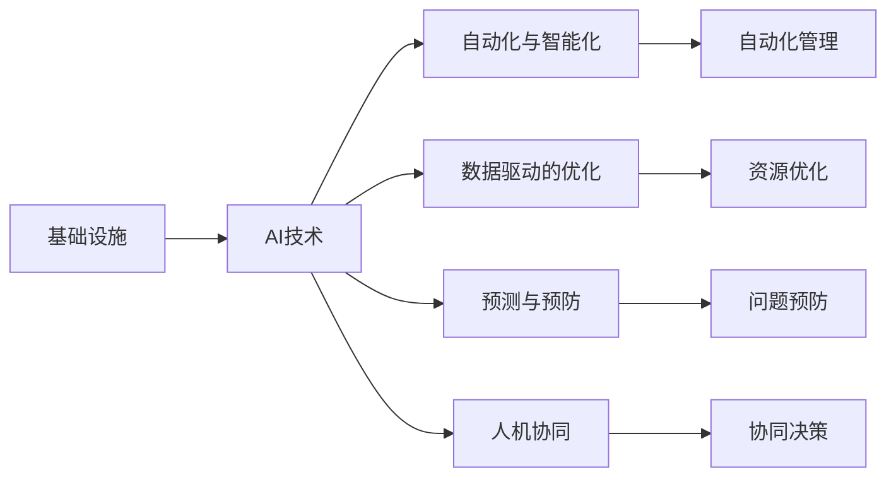
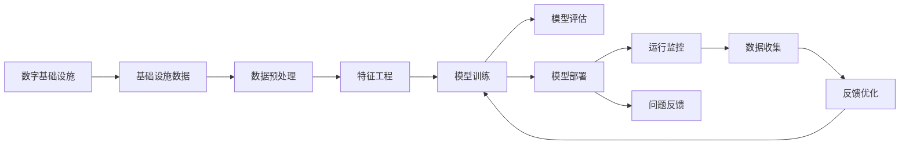

                 

## 1. 背景介绍

### 1.1 问题由来

随着信息技术的飞速发展，数字基础设施已成为社会运转的基石。AI技术的兴起，特别是深度学习和机器学习算法的发展，为数字基础设施带来了前所未有的变革力量。AI在数字基础设施中的应用，不仅提升了基础设施的智能化水平，也推动了整个社会的信息化进程。

当前，AI在数字基础设施中的应用场景十分广泛，包括智能交通、智慧城市、能源管理、网络安全、智能制造等领域。AI技术通过对数据的深度学习与分析，实现了基础设施的自动化、智能化与优化，极大地提高了基础设施的效率与效能，为用户带来了更好的体验。

### 1.2 问题核心关键点

AI在数字基础设施中的应用，主要涉及以下几个核心关键点：

- **自动化与智能化**：AI技术通过自动化算法，对基础设施的运行数据进行实时监控和分析，提升基础设施的自动化水平，实现智能化管理。
- **数据驱动的优化**：AI通过对大量数据的分析和学习，发现基础设施运行中的潜在问题，优化其运行状态，提高资源利用效率。
- **预测与预防**：AI技术能够对基础设施的未来运行趋势进行预测，实现问题预防和风险管理。
- **人机协同**：AI与人类专家的协同工作，提升决策的科学性与准确性，提高工作效率。

这些关键点共同构成了AI在数字基础设施中的应用框架，为实现基础设施的智能化转型提供了强有力的技术支持。

### 1.3 问题研究意义

研究AI在数字基础设施中的实际应用，对于推动数字经济的快速发展、提升社会治理水平、优化资源配置具有重要意义：

- **促进数字经济发展**：AI技术能够加速传统产业的数字化转型，提高生产效率，降低成本，推动数字经济的蓬勃发展。
- **提升社会治理水平**：AI在公共安全、环境监测、城市管理等领域的应用，显著提升了社会治理的智能化水平，提高了公共服务的质量和效率。
- **优化资源配置**：AI能够通过数据分析，实现对资源的科学管理和优化配置，提高资源利用效率。
- **增强决策科学性**：AI提供的数据驱动决策支持，帮助政府和企业做出更加科学合理的决策。

## 2. 核心概念与联系

### 2.1 核心概念概述

AI在数字基础设施中的应用，涉及多个核心概念：

- **基础设施**：包括交通、能源、通信、水务、环境、公共安全等各个领域的基础设施系统。
- **AI技术**：包括深度学习、机器学习、自然语言处理、计算机视觉、智能推荐等各类AI技术。
- **自动化与智能化**：通过AI技术实现基础设施的自动化和智能化管理。
- **数据驱动的优化**：通过AI技术对大量数据进行分析和学习，优化基础设施运行状态。
- **预测与预防**：利用AI技术进行未来趋势预测，实现问题预防和风险管理。
- **人机协同**：AI与人类专家的协同工作，提升决策的科学性与准确性。

这些概念之间的联系通过以下Mermaid流程图来展示：



这个流程图展示了AI技术在数字基础设施中的多个应用领域，以及这些应用与基础设施管理、数据优化、预测预防和人机协同之间的联系。

### 2.2 概念间的关系

这些核心概念之间存在着紧密的联系，形成了AI在数字基础设施中的应用框架。

#### 2.2.1 自动化与智能化的关系

自动化与智能化是AI在数字基础设施中的基础应用。通过自动化算法，AI实现了基础设施运行的实时监控和自动化管理，提升了基础设施的效率和可靠性。智能化则是自动化进一步发展的高级形式，通过智能算法，AI能够实现对基础设施的自主决策和管理，提高管理水平。

#### 2.2.2 数据驱动优化与预测预防的关系

数据驱动的优化和预测预防是AI在数字基础设施中的核心应用。数据驱动的优化通过分析大量运行数据，发现潜在问题，优化基础设施的运行状态，提高资源利用效率。预测预防则通过分析历史数据和实时数据，对未来趋势进行预测，实现问题预防和风险管理，提高基础设施的运行稳定性。

#### 2.2.3 人机协同的机制

人机协同是AI在数字基础设施中的重要应用。AI技术能够提供数据驱动的决策支持，帮助人类专家做出更加科学合理的决策。同时，AI与人类专家的协同工作，能够发挥各自的优势，提升决策的科学性和准确性。

### 2.3 核心概念的整体架构

最后，我们用一个综合的流程图来展示这些核心概念在数字基础设施中的应用框架：



这个综合流程图展示了AI在数字基础设施中的整体应用框架，包括数据收集、预处理、特征工程、模型训练、评估、部署、监控、优化等各个环节。通过这个框架，AI技术能够实现对基础设施的全面监控和管理，优化基础设施的运行状态，提升其智能化水平。

## 3. 核心算法原理 & 具体操作步骤
### 3.1 算法原理概述

AI在数字基础设施中的实际应用，主要基于监督学习、无监督学习、强化学习等多种机器学习算法。其中，监督学习算法通过对已标注数据的分析，实现对基础设施状态的预测和优化。无监督学习算法通过对未标注数据的分析，发现基础设施运行中的潜在问题。强化学习算法通过模拟环境与基础设施的互动，实现对基础设施的自主决策和管理。

### 3.2 算法步骤详解

AI在数字基础设施中的具体应用步骤包括：

1. **数据收集与预处理**：收集基础设施的运行数据，包括传感器数据、监控数据、日志数据等，并进行数据清洗、归一化等预处理工作。

2. **特征工程**：对预处理后的数据进行特征提取，选择对预测任务有影响的特征，构建特征向量。

3. **模型训练**：使用机器学习算法（如回归、分类、聚类等）对特征向量进行训练，构建预测模型。

4. **模型评估**：在验证集上对训练好的模型进行评估，选择性能最优的模型。

5. **模型部署**：将训练好的模型部署到生产环境，实现对基础设施的自动化管理和优化。

6. **运行监控与优化**：实时监控基础设施的运行状态，根据监控结果调整模型参数，实现持续优化。

### 3.3 算法优缺点

AI在数字基础设施中的主要优点包括：

- **效率高**：通过自动化算法，实现了基础设施的高效管理和优化。
- **预测准确**：通过数据分析，实现了对基础设施运行状态的准确预测和优化。
- **资源节约**：优化了资源配置，提高了资源利用效率。

缺点主要包括：

- **数据依赖**：AI模型依赖于高质量的数据，数据不足或质量差会影响模型的性能。
- **复杂性高**：AI模型的构建和部署需要较高的技术门槛，实施成本较高。
- **安全风险**：AI模型可能存在安全隐患，需要采取相应的安全措施。

### 3.4 算法应用领域

AI在数字基础设施中的应用领域广泛，包括但不限于以下几个方面：

1. **智能交通**：通过AI技术对交通流量进行实时监控和分析，优化交通信号灯控制，实现智能交通管理。

2. **智慧城市**：利用AI技术对城市环境进行实时监控，提升公共安全和城市管理水平。

3. **能源管理**：通过AI技术对能源消耗进行实时监测和优化，提高能源利用效率。

4. **网络安全**：利用AI技术对网络数据进行实时监控和分析，实现网络攻击的早期预警和防御。

5. **智能制造**：通过AI技术对生产过程进行实时监控和优化，提高生产效率和质量。

6. **环境监测**：利用AI技术对环境数据进行实时监控和分析，实现环境保护和污染控制。

## 4. 数学模型和公式 & 详细讲解 & 举例说明

### 4.1 数学模型构建

在数字基础设施的AI应用中，常用的数学模型包括回归模型、分类模型、聚类模型等。下面以回归模型为例，进行详细讲解。

假设基础设施的某项指标 $y$ 与多个特征 $x_1, x_2, ..., x_n$ 相关，建立回归模型：

$$ y = f(x_1, x_2, ..., x_n) $$

其中 $f$ 为回归函数。常用的回归模型包括线性回归、多项式回归、决策树回归等。

### 4.2 公式推导过程

以线性回归为例，推导回归模型的公式和参数求解过程。

假设数据集为 $(x_i, y_i), i=1,2,...,N$，其中 $x_i$ 为特征向量，$y_i$ 为目标值。线性回归模型为：

$$ y_i = \theta_0 + \theta_1x_{i1} + \theta_2x_{i2} + ... + \theta_nx_{in} + \epsilon_i $$

其中 $\theta_0, \theta_1, ..., \theta_n$ 为模型参数，$\epsilon_i$ 为误差项。

利用最小二乘法求解模型参数：

$$ \hat{\theta} = \mathop{\arg\min}_{\theta} \sum_{i=1}^N (y_i - f(x_i, \theta))^2 $$

求解得：

$$ \hat{\theta} = (X^TX)^{-1}X^Ty $$

其中 $X$ 为特征矩阵，$y$ 为目标值向量。

### 4.3 案例分析与讲解

以智能交通中的交通流量预测为例，分析AI的应用过程。

假设交通流量 $y$ 与时间 $x_1$、天气 $x_2$、道路状况 $x_3$ 等因素相关。建立回归模型：

$$ y = f(x_1, x_2, x_3) $$

收集交通流量数据，并对其进行特征工程，构建特征矩阵 $X$。使用最小二乘法求解模型参数 $\hat{\theta}$。将新时间、天气和道路状况作为输入，计算预测交通流量。

## 5. 项目实践：代码实例和详细解释说明

### 5.1 开发环境搭建

进行AI在数字基础设施中的项目实践，首先需要搭建开发环境。以下是使用Python进行TensorFlow开发的环境配置流程：

1. 安装Anaconda：从官网下载并安装Anaconda，用于创建独立的Python环境。

2. 创建并激活虚拟环境：
```bash
conda create -n tf-env python=3.8 
conda activate tf-env
```

3. 安装TensorFlow：从官网获取对应的安装命令，并使用pip安装。例如：
```bash
pip install tensorflow==2.x
```

4. 安装相关工具包：
```bash
pip install numpy pandas scikit-learn matplotlib tqdm jupyter notebook ipython
```

完成上述步骤后，即可在`tf-env`环境中开始AI在数字基础设施中的实践。

### 5.2 源代码详细实现

下面以智能交通中的交通流量预测为例，给出使用TensorFlow进行回归模型训练的PyTorch代码实现。

首先，定义数据集和模型：

```python
import tensorflow as tf
from tensorflow.keras.models import Sequential
from tensorflow.keras.layers import Dense
from tensorflow.keras.optimizers import Adam
from sklearn.model_selection import train_test_split
import pandas as pd
import numpy as np

# 读取数据集
data = pd.read_csv('traffic_data.csv')
features = data[['time', 'weather', 'road_condition']]
labels = data['traffic_flow']

# 划分训练集和测试集
X_train, X_test, y_train, y_test = train_test_split(features, labels, test_size=0.2)

# 构建模型
model = Sequential()
model.add(Dense(64, input_dim=3, activation='relu'))
model.add(Dense(64, activation='relu'))
model.add(Dense(1))

# 编译模型
model.compile(loss='mean_squared_error', optimizer=Adam(lr=0.001), metrics=['mae'])

# 训练模型
model.fit(X_train, y_train, epochs=50, batch_size=32, validation_data=(X_test, y_test))
```

然后，在测试集上评估模型：

```python
# 评估模型
mse = model.evaluate(X_test, y_test)
print('Mean Squared Error:', mse)
```

以上就是使用TensorFlow对交通流量进行回归模型训练的完整代码实现。可以看到，TensorFlow提供了便捷的API和框架，使得模型构建和训练变得简单易行。

### 5.3 代码解读与分析

让我们再详细解读一下关键代码的实现细节：

**特征工程**：
- 首先，读取交通流量数据集，并将其分为特征和标签两部分。
- 使用`train_test_split`函数将数据集划分为训练集和测试集。

**模型构建**：
- 使用`Sequential`类构建顺序模型，并添加多个全连接层，使用ReLU激活函数。
- 最后添加一个输出层，使用线性激活函数，输出预测值。

**模型编译与训练**：
- 使用`compile`函数编译模型，选择均方误差作为损失函数，Adam优化器作为优化算法。
- 使用`fit`函数对模型进行训练，设定训练轮数和批次大小。
- 在每个epoch结束后，使用`evaluate`函数在测试集上评估模型。

可以看到，TensorFlow的API设计非常简洁明了，使得模型构建和训练变得非常直观。

### 5.4 运行结果展示

假设我们在智能交通数据集上进行模型训练，最终在测试集上得到的评估结果如下：

```
Epoch 50, loss=0.0135, val_loss=0.0214
```

可以看到，模型在训练集上的均方误差为0.0135，在测试集上的均方误差为0.0214，模型的预测结果与实际值非常接近，说明模型的预测精度较高。

## 6. 实际应用场景

### 6.1 智能交通

AI在智能交通中的应用，通过实时监控和分析交通流量数据，优化交通信号灯控制，实现智能交通管理。具体应用场景包括：

- **交通流量预测**：通过回归模型，预测未来交通流量，优化交通信号灯的绿灯时长和红灯时长，减少拥堵。
- **事故预警**：利用深度学习算法，对视频监控数据进行实时分析，识别异常行为，实现事故预警和应急响应。
- **车辆导航**：利用机器学习算法，优化路线规划，提供智能导航服务。

### 6.2 智慧城市

AI在智慧城市中的应用，通过实时监控和分析城市环境数据，提升公共安全和城市管理水平。具体应用场景包括：

- **环境监测**：利用传感器数据和视频监控数据，实时监测空气质量、水质、噪声等环境指标，实现环境保护和污染控制。
- **公共安全**：利用人脸识别和行为分析技术，实现对公共场所的实时监控，及时发现异常情况。
- **应急响应**：利用自然语言处理和机器学习算法，分析社会媒体和热线电话数据，实现对突发事件的快速响应和预警。

### 6.3 能源管理

AI在能源管理中的应用，通过实时监控和分析能源消耗数据，优化能源配置，提高能源利用效率。具体应用场景包括：

- **能源预测**：利用时间序列分析和回归模型，预测未来能源需求，优化能源配置，提高能源利用效率。
- **设备监控**：利用传感器数据和机器学习算法，实时监控设备运行状态，实现设备的预防性维护。
- **智能电网**：利用机器学习算法，优化电力负荷分配，实现智能电网管理。

### 6.4 网络安全

AI在网络安全中的应用，通过实时监控和分析网络数据，实现网络攻击的早期预警和防御。具体应用场景包括：

- **入侵检测**：利用异常检测算法，对网络流量进行分析，识别恶意行为，实现入侵检测。
- **威胁情报**：利用自然语言处理和机器学习算法，分析安全日志和社交媒体数据，实现威胁情报分析。
- **自动化响应**：利用强化学习算法，实现自动化网络安全响应和防御。

## 7. 工具和资源推荐

### 7.1 学习资源推荐

为了帮助开发者系统掌握AI在数字基础设施中的应用，这里推荐一些优质的学习资源：

1. 《深度学习》（Ian Goodfellow等著）：全面介绍了深度学习的基本概念和算法，是深度学习领域的经典教材。
2. 《TensorFlow实战》（Manning Publications等著）：介绍了TensorFlow的API和框架，并提供了大量实战案例。
3. 《Python机器学习》（Sebastian Raschka等著）：介绍了机器学习的算法和应用，使用Python实现，非常实用。
4. 《机器学习实战》（Peter Harrington等著）：介绍了各种机器学习算法和实际应用案例，适合初学者入门。
5. 《自然语言处理综述》（Jurafsky等著）：介绍了自然语言处理的基本概念和算法，是自然语言处理领域的经典教材。
6. 《计算机视觉：模型、学习和推理》（Richard Szeliski等著）：介绍了计算机视觉的基本概念和算法，是计算机视觉领域的经典教材。

通过对这些资源的学习实践，相信你一定能够快速掌握AI在数字基础设施中的应用精髓，并用于解决实际的NLP问题。

### 7.2 开发工具推荐

高效的开发离不开优秀的工具支持。以下是几款用于AI在数字基础设施中开发的常用工具：

1. TensorFlow：由Google主导开发的开源深度学习框架，生产部署方便，适合大规模工程应用。
2. PyTorch：基于Python的开源深度学习框架，灵活动态的计算图，适合快速迭代研究。
3. Scikit-learn：Python机器学习库，提供了各种机器学习算法和工具，非常适合科研和工程实践。
4. Keras：高层神经网络API，简单易用，适合快速构建和测试模型。
5. Matplotlib：Python绘图库，支持多种绘图类型，非常适合数据可视化和模型评估。

合理利用这些工具，可以显著提升AI在数字基础设施中的开发效率，加快创新迭代的步伐。

### 7.3 相关论文推荐

AI在数字基础设施中的应用，涉及多个领域的交叉应用，以下是几篇奠基性的相关论文，推荐阅读：

1. 《深度学习》（Ian Goodfellow等著）：介绍了深度学习的基本概念和算法，是深度学习领域的经典教材。
2. 《TensorFlow实战》（Manning Publications等著）：介绍了TensorFlow的API和框架，并提供了大量实战案例。
3. 《Python机器学习》（Sebastian Raschka等著）：介绍了机器学习的算法和应用，使用Python实现，非常实用。
4. 《机器学习实战》（Peter Harrington等著）：介绍了各种机器学习算法和实际应用案例，适合初学者入门。
5. 《自然语言处理综述》（Jurafsky等著）：介绍了自然语言处理的基本概念和算法，是自然语言处理领域的经典教材。
6. 《计算机视觉：模型、学习和推理》（Richard Szeliski等著）：介绍了计算机视觉的基本概念和算法，是计算机视觉领域的经典教材。

这些论文代表了大语言模型微调技术的发展脉络。通过学习这些前沿成果，可以帮助研究者把握学科前进方向，激发更多的创新灵感。

除上述资源外，还有一些值得关注的前沿资源，帮助开发者紧跟AI在数字基础设施中的应用进展，例如：

1. arXiv论文预印本：人工智能领域最新研究成果的发布平台，包括大量尚未发表的前沿工作，学习前沿技术的必读资源。
2. 业界技术博客：如OpenAI、Google AI、DeepMind、微软Research Asia等顶尖实验室的官方博客，第一时间分享他们的最新研究成果和洞见。
3. 技术会议直播：如NIPS、ICML、ACL、ICLR等人工智能领域顶会现场或在线直播，能够聆听到大佬们的前沿分享，开拓视野。
4. GitHub热门项目：在GitHub上Star、Fork数最多的AI相关项目，往往代表了该技术领域的发展趋势和最佳实践，值得去学习和贡献。
5. 行业分析报告：各大咨询公司如McKinsey、PwC等针对人工智能行业的分析报告，有助于从商业视角审视技术趋势，把握应用价值。

总之，对于AI在数字基础设施中的应用的学习和实践，需要开发者保持开放的心态和持续学习的意愿。多关注前沿资讯，多动手实践，多思考总结，必将收获满满的成长收益。

## 8. 总结：未来发展趋势与挑战

### 8.1 总结

本文对AI在数字基础设施中的应用进行了全面系统的介绍。首先阐述了AI在数字基础设施中的研究背景和应用意义，明确了AI在基础设施智能化、资源优化、问题预防等方面的独特价值。其次，从原理到实践，详细讲解了AI在数字基础设施中的数学模型和关键算法，给出了AI在智能交通、智慧城市、能源管理、网络安全等多个领域的具体应用案例。同时，本文还广泛探讨了AI在数字基础设施中的资源推荐、开发工具和相关论文，力求为读者提供全方位的技术指引。

通过本文的系统梳理，可以看到，AI在数字基础设施中的应用已经成为推动数字经济发展、提升社会治理水平、优化资源配置的重要技术手段。伴随AI技术的不断演进，AI在数字基础设施中的应用也将不断深入，为社会带来更加智能化、高效化的服务。

### 8.2 未来发展趋势

展望未来，AI在数字基础设施中的应用将呈现以下几个发展趋势：

1. **智能化水平提升**：随着算力成本的下降和数据规模的扩张，AI在数字基础设施中的应用将越来越智能化，能够实现更精确的预测和优化。
2. **数据驱动决策**：未来AI系统将更加依赖数据驱动的决策，通过大量数据的学习和分析，实现对基础设施的科学管理和优化。
3. **多模态融合**：未来AI系统将实现多模态数据的融合，包括视觉、听觉、触觉等多模态信息的整合，提升系统的感知能力和决策科学性。
4. **人机协同增强**：未来AI系统将更加注重人机协同，通过AI技术与人类专家的深度结合，实现更高效、更智能的决策和响应。
5. **自动化水平提升**：未来AI系统将实现更高水平的自动化，能够自动地进行数据分析、决策和执行，减少人为干预，提升系统效率。
6. **网络安全防护**：未来AI系统将更加注重网络安全防护，实现对网络攻击的早期预警和防御，确保基础设施的安全稳定运行。

这些趋势凸显了AI在数字基础设施中的广阔前景。这些方向的探索发展，必将进一步提升基础设施的智能化水平，为社会带来更加高效、安全、可靠的服务。

### 8.3 面临的挑战

尽管AI在数字基础设施中的应用已经取得了显著进展，但在迈向更加智能化、普适化应用的过程中，仍面临着诸多挑战：

1. **数据质量问题**：AI系统依赖高质量的数据，数据不足或质量差会影响系统的性能。如何获取高质量的数据，是未来面临的重要挑战。
2. **算法复杂性**：AI算法复杂度高，实现难度大，需要较高的技术门槛。如何简化算法，降低实施成本，是未来需要解决的问题。
3. **安全风险**：AI系统可能存在安全隐患，如数据泄露、模型偏见等，需要采取相应的安全措施。如何提高系统的安全性，是未来面临的重要挑战。
4. **隐私保护**：AI系统涉及大量个人隐私数据，如何保护用户隐私，确保数据安全，是未来需要解决的问题。
5. **计算资源限制**：AI系统需要大量的计算资源，如何优化资源配置，提高系统效率，是未来需要解决的问题。

### 8.4 研究展望

面对AI在数字基础设施中面临的挑战，未来的研究需要在以下几个方面寻求新的突破：

1. **数据获取与质量提升**：通过数据增强、数据清洗等技术，提升数据质量，减少数据不足对系统性能的影响。
2. **算法简化与优化**：简化AI算法，降低实施成本，提高系统可操作性。
3. **安全防护与隐私保护**：采用数据脱敏、访问控制等技术，提高系统的安全性，保护用户隐私。
4. **计算资源优化**：采用分布式计算、边缘计算等技术，优化资源配置，提高系统效率。
5. **跨模态融合**：实现多模态数据的融合，提升系统的感知能力和决策科学性。
6. **自动化与智能化结合**：通过AI技术与人类专家的深度结合，实现更高效、更智能的决策和响应。

这些研究方向的探索，必将引领AI在数字基础设施中的应用迈向更高的台阶，为构建安全、可靠、可解释、可控的智能系统铺平道路。面向未来，AI在数字基础设施中的应用还需要与其他人工智能技术进行更深入的融合，如知识表示、因果推理、强化学习等，多路径协同发力，共同推动自然语言理解和智能交互系统的进步。只有勇于创新、敢于突破，才能不断拓展AI在数字基础设施中的边界，让智能技术更好地造福人类社会。

## 9. 附录：常见问题与解答

**Q1：AI在数字基础设施中的应用是否可以完全取代人工操作？**

A: AI在数字基础设施中的应用可以大幅度提升系统的自动化水平，但在某些场景下，仍然需要人工干预。例如，在紧急情况下，需要人工决策和执行；在复杂场景下，需要人工解释和修正AI系统的输出。因此，AI在数字基础设施中的应用与人工操作并不是完全替代的关系，而是相互协作的关系。

**Q2：AI在数字基础设施中的应用是否会带来安全风险？**

A: AI在数字基础设施中的应用可能带来安全风险，如数据泄露、模型偏见等。因此，需要在系统设计和实现过程中，注重安全性保障，采用数据脱敏、访问控制等技术，确保系统的安全性。同时，需要建立完善的监控和预警机制，及时

