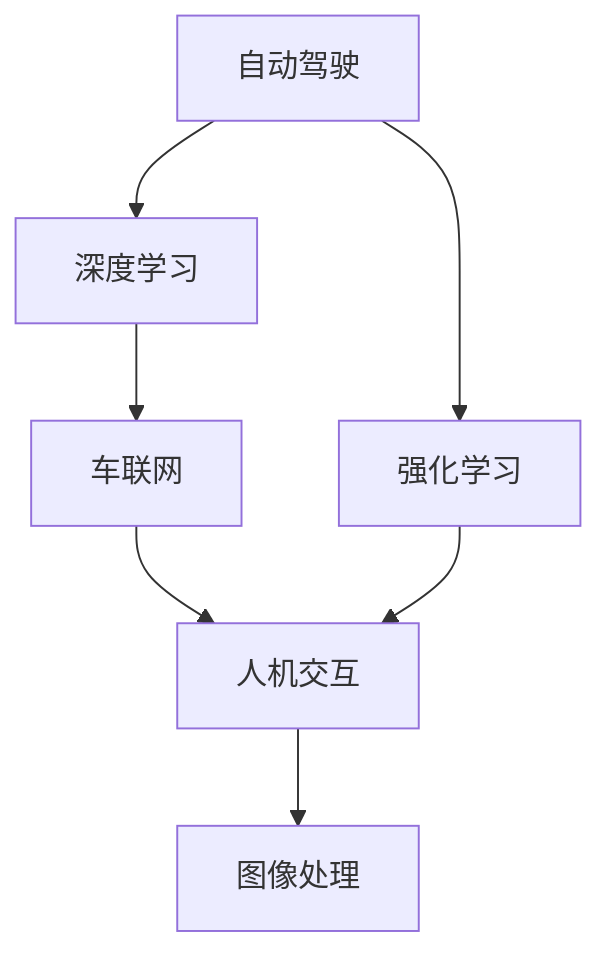
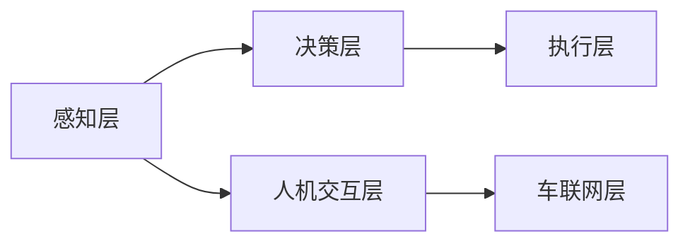
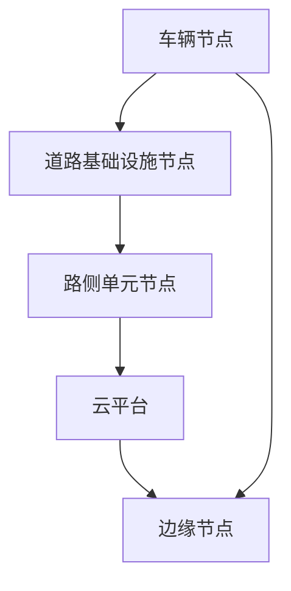
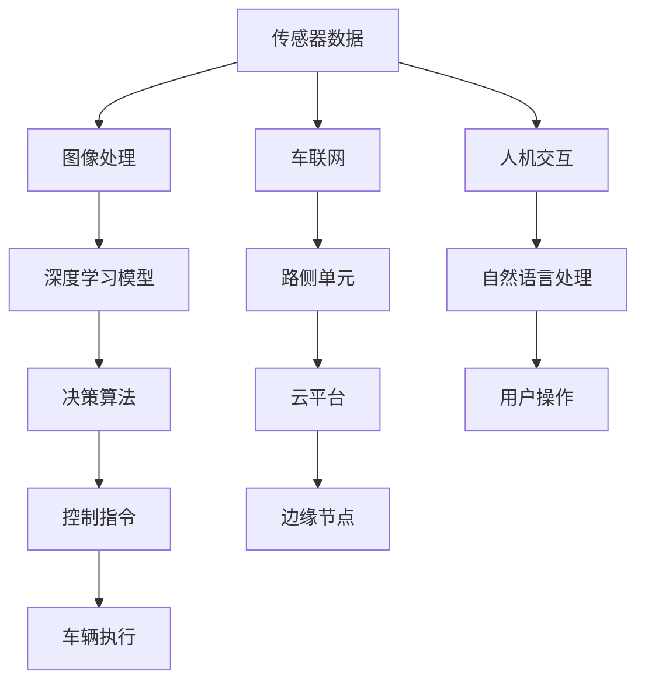

                 

# AI在智能汽车中的应用:提升驾驶体验

> 关键词：智能汽车,自动驾驶,人机交互,车联网,深度学习,强化学习,图像处理

## 1. 背景介绍

### 1.1 问题由来
随着人工智能技术的飞速发展，智能汽车已成为汽车产业的未来方向。其以先进的AI技术为基础，融合了自动驾驶、车联网、人机交互等多个领域，极大地提升了驾驶体验和安全性。AI技术在智能汽车中的应用，已渗透到汽车的各个环节，从辅助驾驶、智能导航到故障诊断，都在不断改善驾驶者的生活质量。

然而，当前智能汽车AI技术的落地应用仍存在诸多挑战。如计算资源的限制、复杂环境下的感知和决策问题、人机交互的自然性和用户习惯的差异等。如何在有限的计算资源下，高效地利用AI技术，实现智能汽车的高效稳定运行，是当前智能汽车研发中的一大难题。

### 1.2 问题核心关键点
智能汽车AI技术的主要挑战在于如何在保证性能的前提下，实现计算资源的有效利用。具体来说，主要包括：

- **资源优化**：在有限的计算资源下，如何高效利用AI技术，确保计算速度和稳定性。
- **环境感知**：在复杂多变的环境下，如何准确感知周围环境和车辆状态，确保决策的准确性和安全性。
- **用户交互**：如何实现自然流畅的人机交互，提升用户体验和满意度。
- **决策优化**：如何在面对复杂决策场景时，快速做出最优决策，保证行车安全和舒适性。

### 1.3 问题研究意义
AI技术在智能汽车中的应用，将大幅提升驾驶体验，降低驾驶风险，并推动汽车产业的智能化升级。研究如何高效利用AI技术，既能优化资源利用，又能提升智能汽车的综合性能，对推动汽车行业的技术创新和产业发展具有重要意义。

## 2. 核心概念与联系

### 2.1 核心概念概述

智能汽车AI技术主要涉及以下几个核心概念：

- **自动驾驶(Autonomous Driving)**：指汽车在不需要人工干预的情况下，通过AI技术自动驾驶到指定目的地。
- **车联网(Vehicle-to-Everything, V2X)**：指车辆与外部环境（如行人、其他车辆、基础设施）之间的通信，实现智能化交通管理。
- **人机交互(Human-Computer Interaction, HCI)**：指汽车与驾驶员之间的交互方式，实现语音、手势、触摸等多种交互方式。
- **深度学习(Deep Learning)**：指利用多层神经网络，通过大量数据进行学习和训练，实现复杂的模式识别和决策。
- **强化学习(Reinforcement Learning, RL)**：指通过试错的方式，不断调整策略，优化决策行为，提高智能汽车的控制精度和稳定性。
- **图像处理(Image Processing)**：指对摄像头等传感器捕获的图像进行预处理和分析，实现环境感知和物体识别。

这些概念之间的逻辑关系可以通过以下Mermaid流程图来展示：



这个流程图展示了大语言模型微调过程中各个核心概念的相互关系：

1. 自动驾驶系统通过深度学习和强化学习进行决策，利用车联网进行环境感知和信息共享。
2. 人机交互系统通过图像处理和自然语言处理技术，实现与驾驶员之间的自然对话和操作。
3. 车联网系统通过车与车、车与基础设施之间的通信，实现智能交通管理。

### 2.2 概念间的关系

这些核心概念之间存在着紧密的联系，形成了智能汽车AI技术的完整生态系统。下面我们通过几个Mermaid流程图来展示这些概念之间的关系。

#### 2.2.1 智能汽车系统架构



这个流程图展示了智能汽车系统的整体架构，分为感知、决策、执行和交互四个层面：

1. 感知层通过摄像头、雷达、激光雷达等传感器获取周围环境和车辆状态信息，并利用图像处理技术进行预处理。
2. 决策层基于感知层的信息，结合深度学习和强化学习算法，生成最优驾驶策略。
3. 执行层根据决策层的指令，控制车辆进行转向、加速、制动等操作。
4. 交互层通过人机交互技术，与驾驶员进行沟通和指令交互。

#### 2.2.2 车联网系统架构



这个流程图展示了车联网系统的架构，分为车辆、基础设施、云平台和边缘节点四个部分：

1. 车辆节点通过车联网技术与路侧单元节点进行通信。
2. 路侧单元节点通过通信技术将车辆信息传输到云平台。
3. 云平台存储和管理车辆数据，提供决策支持服务。
4. 边缘节点实时处理车辆信息，并与其他车辆和基础设施节点进行通信。

### 2.3 核心概念的整体架构

最后，我们用一个综合的流程图来展示这些核心概念在大语言模型微调过程中的整体架构：



这个综合流程图展示了从传感器数据获取，到决策、执行和交互的完整流程，各个环节都通过AI技术进行优化和提升。通过这些流程图，我们可以更清晰地理解智能汽车AI技术的核心概念及其相互关系。

## 3. 核心算法原理 & 具体操作步骤
### 3.1 算法原理概述

智能汽车AI技术的主要原理在于通过深度学习和强化学习算法，实现对复杂环境的高效感知和精准决策。其核心思想是：

1. **感知**：通过摄像头、雷达、激光雷达等传感器获取周围环境信息，利用图像处理技术进行预处理。
2. **决策**：基于感知层的信息，利用深度学习和强化学习算法生成最优驾驶策略。
3. **执行**：根据决策层的指令，控制车辆执行转向、加速、制动等操作。
4. **交互**：通过人机交互技术，与驾驶员进行沟通和指令交互。

具体来说，智能汽车AI技术的实现步骤如下：

1. **感知模块**：通过摄像头、雷达、激光雷达等传感器获取车辆周围环境数据。
2. **图像处理模块**：对传感器数据进行预处理，如去噪、增强、分割等。
3. **深度学习模块**：利用卷积神经网络(CNN)、循环神经网络(RNN)等深度学习模型，对预处理后的数据进行特征提取和环境建模。
4. **决策模块**：基于深度学习模型的输出，结合强化学习算法，生成最优驾驶策略。
5. **执行模块**：根据决策模块的指令，控制车辆进行转向、加速、制动等操作。
6. **交互模块**：通过语音、手势、触摸等交互方式，与驾驶员进行沟通和指令交互。

### 3.2 算法步骤详解

智能汽车AI技术的实现主要包括以下几个关键步骤：

**Step 1: 传感器数据获取**

智能汽车通常配备有多个传感器，包括摄像头、雷达、激光雷达等。通过这些传感器获取车辆周围环境的实时数据，是智能汽车AI技术的基础。

**Step 2: 图像处理**

获取的传感器数据通常为图像形式，需要进行预处理和增强，以提高环境感知的效果。预处理技术包括去噪、边缘检测、颜色增强等。增强技术包括数据增强、归一化等，以提高模型的鲁棒性。

**Step 3: 深度学习模型训练**

预处理后的数据输入到深度学习模型中进行训练。常见的方法包括卷积神经网络(CNN)、循环神经网络(RNN)、卷积循环神经网络(CRNN)等。深度学习模型通过大量数据进行训练，学习环境特征和驾驶策略。

**Step 4: 决策算法生成**

深度学习模型的输出可以作为决策算法的一部分。决策算法利用强化学习技术，生成最优驾驶策略。常见的强化学习算法包括Q-learning、深度Q网络(DQN)、策略梯度等。

**Step 5: 控制指令执行**

决策算法生成的控制指令，通过执行模块控制车辆进行转向、加速、制动等操作。执行模块可以采用电控单元(ECU)、车辆控制器等设备进行实现。

**Step 6: 人机交互**

通过人机交互模块，实现与驾驶员之间的沟通和指令交互。人机交互技术包括语音识别、手势识别、触摸反馈等，以提升用户体验和交互效果。

### 3.3 算法优缺点

智能汽车AI技术的优点包括：

- **高效感知**：通过深度学习算法，对传感器数据进行高效处理和特征提取，实现对复杂环境的高效感知。
- **精准决策**：利用强化学习算法，生成最优驾驶策略，提升决策的精准性和安全性。
- **实时响应**：通过优化计算资源，实现实时响应，提升驾驶体验和安全性。
- **人机交互自然化**：通过人机交互技术，实现自然流畅的沟通和操作，提升用户体验。

智能汽车AI技术的缺点包括：

- **计算资源需求高**：深度学习和强化学习算法需要大量计算资源，限制了智能汽车在计算资源受限的环境下的应用。
- **环境适应性不足**：在复杂多变的环境下，深度学习算法和强化学习算法的性能可能受到影响。
- **系统复杂度高**：智能汽车AI技术涉及多个子系统，系统复杂度高，调试和维护难度较大。
- **伦理和隐私问题**：智能汽车涉及大量的用户数据，存在伦理和隐私问题。

### 3.4 算法应用领域

智能汽车AI技术在多个领域得到了广泛应用，包括：

- **自动驾驶**：通过深度学习和强化学习算法，实现自动驾驶和辅助驾驶功能。
- **智能导航**：利用车联网技术，实现智能导航和路径规划。
- **故障诊断**：通过传感器数据和深度学习模型，实现车辆的故障诊断和维修建议。
- **智能停车**：利用传感器数据和深度学习模型，实现自动泊车和停车辅助。
- **智能交互**：通过人机交互技术，实现自然流畅的语音、手势等交互方式。

## 4. 数学模型和公式 & 详细讲解  
### 4.1 数学模型构建

智能汽车AI技术的数学模型主要涉及深度学习、强化学习、图像处理等多个领域的数学模型。以下是一些核心模型的构建：

**卷积神经网络(CNN)**：用于图像处理和环境感知，其数学模型可表示为：

$$
h(x) = g(\sigma(W \cdot x + b))
$$

其中 $h(x)$ 为卷积层的输出，$g$ 为激活函数，$W$ 为卷积核权重，$x$ 为输入图像，$b$ 为偏置项。

**循环神经网络(RNN)**：用于时间序列数据的处理，其数学模型可表示为：

$$
h(t+1) = f(W \cdot h(t) + U \cdot x(t) + b)
$$

其中 $h(t+1)$ 为当前时间步的隐藏状态，$f$ 为激活函数，$W$ 和 $U$ 为网络权重，$x(t)$ 为当前时间步的输入，$b$ 为偏置项。

**深度Q网络(DQN)**：用于强化学习中的决策优化，其数学模型可表示为：

$$
Q(s_t,a_t) = r_t + \gamma \max_a Q(s_{t+1},a)
$$

其中 $Q(s_t,a_t)$ 为当前状态-动作对的Q值，$r_t$ 为当前时间步的奖励，$\gamma$ 为折扣因子，$\max_a Q(s_{t+1},a)$ 为下一条状态-动作对的Q值。

### 4.2 公式推导过程

以下是几个关键数学模型的推导过程：

**卷积神经网络(CNN)**：

卷积神经网络通过卷积操作提取图像特征，其推导过程如下：

$$
h(x) = g(\sigma(W \cdot x + b)) = g(\sigma(\sum_k w_k \ast x_k + b))
$$

其中 $w_k$ 为卷积核权重，$x_k$ 为输入图像的特征图，$b$ 为偏置项。

**循环神经网络(RNN)**：

循环神经网络通过时间序列数据的处理，其推导过程如下：

$$
h(t+1) = f(W \cdot h(t) + U \cdot x(t) + b)
$$

其中 $f$ 为激活函数，$W$ 和 $U$ 为网络权重，$x(t)$ 为当前时间步的输入，$b$ 为偏置项。

**深度Q网络(DQN)**：

深度Q网络通过Q值函数实现决策优化，其推导过程如下：

$$
Q(s_t,a_t) = r_t + \gamma \max_a Q(s_{t+1},a)
$$

其中 $Q(s_t,a_t)$ 为当前状态-动作对的Q值，$r_t$ 为当前时间步的奖励，$\gamma$ 为折扣因子，$\max_a Q(s_{t+1},a)$ 为下一条状态-动作对的Q值。

### 4.3 案例分析与讲解

以自动驾驶中的车道保持系统为例，其数学模型如下：

**车道检测**：利用摄像头拍摄道路图像，通过卷积神经网络提取车道线特征，得到车道边界位置。其数学模型如下：

$$
h(x) = g(\sigma(W \cdot x + b))
$$

其中 $h(x)$ 为车道检测的输出，$W$ 为卷积核权重，$x$ 为输入图像，$b$ 为偏置项。

**车道保持**：基于车道检测结果，利用深度学习模型生成最优转向角度，并通过强化学习算法优化转向策略。其数学模型如下：

$$
\alpha = f(Q(\text{lanes},\text{speed}),\text{distances})
$$

其中 $\alpha$ 为转向角度，$Q(\text{lanes},\text{speed})$ 为车道线和车速的Q值，$\text{distances}$ 为车辆与车道线的距离。

## 5. 项目实践：代码实例和详细解释说明
### 5.1 开发环境搭建

在进行智能汽车AI技术开发前，我们需要准备好开发环境。以下是使用Python进行PyTorch开发的环境配置流程：

1. 安装Anaconda：从官网下载并安装Anaconda，用于创建独立的Python环境。

2. 创建并激活虚拟环境：
```bash
conda create -n pytorch-env python=3.8 
conda activate pytorch-env
```

3. 安装PyTorch：根据CUDA版本，从官网获取对应的安装命令。例如：
```bash
conda install pytorch torchvision torchaudio cudatoolkit=11.1 -c pytorch -c conda-forge
```

4. 安装各类工具包：
```bash
pip install numpy pandas scikit-learn matplotlib tqdm jupyter notebook ipython
```

完成上述步骤后，即可在`pytorch-env`环境中开始智能汽车AI技术开发。

### 5.2 源代码详细实现

这里我们以车道保持系统为例，给出使用PyTorch进行自动驾驶中的车道保持系统开发的PyTorch代码实现。

```python
import torch
import torch.nn as nn
import torch.optim as optim
import torchvision.transforms as transforms
from torch.utils.data import DataLoader
import matplotlib.pyplot as plt

# 定义模型
class LaneDetectionModel(nn.Module):
    def __init__(self):
        super(LaneDetectionModel, self).__init__()
        self.conv1 = nn.Conv2d(3, 64, kernel_size=3, stride=1, padding=1)
        self.conv2 = nn.Conv2d(64, 128, kernel_size=3, stride=1, padding=1)
        self.conv3 = nn.Conv2d(128, 64, kernel_size=3, stride=1, padding=1)
        self.pool = nn.MaxPool2d(kernel_size=2, stride=2)
        self.fc1 = nn.Linear(64*64*64, 512)
        self.fc2 = nn.Linear(512, 2) # 输出车道边界位置

    def forward(self, x):
        x = self.conv1(x)
        x = nn.functional.relu(x)
        x = self.pool(x)
        x = self.conv2(x)
        x = nn.functional.relu(x)
        x = self.pool(x)
        x = self.conv3(x)
        x = nn.functional.relu(x)
        x = self.pool(x)
        x = x.view(-1, 64*64*64)
        x = self.fc1(x)
        x = nn.functional.relu(x)
        x = self.fc2(x)
        return x

# 加载数据
train_dataset = torchvision.datasets.ImageFolder(root='train_data', transform=transforms.Compose([
    transforms.Resize((224, 224)),
    transforms.ToTensor(),
    transforms.Normalize(mean=[0.485, 0.456, 0.406], std=[0.229, 0.224, 0.225])
]))

test_dataset = torchvision.datasets.ImageFolder(root='test_data', transform=transforms.Compose([
    transforms.Resize((224, 224)),
    transforms.ToTensor(),
    transforms.Normalize(mean=[0.485, 0.456, 0.406], std=[0.229, 0.224, 0.225])
]))

train_loader = DataLoader(train_dataset, batch_size=32, shuffle=True)
test_loader = DataLoader(test_dataset, batch_size=32, shuffle=False)

# 定义模型、损失函数和优化器
model = LaneDetectionModel()
criterion = nn.CrossEntropyLoss()
optimizer = optim.Adam(model.parameters(), lr=0.001)

# 训练模型
for epoch in range(100):
    model.train()
    running_loss = 0.0
    for i, data in enumerate(train_loader, 0):
        inputs, labels = data
        optimizer.zero_grad()
        outputs = model(inputs)
        loss = criterion(outputs, labels)
        loss.backward()
        optimizer.step()
        running_loss += loss.item()
    print(f'Epoch {epoch+1}, loss: {running_loss/len(train_loader):.4f}')

# 测试模型
model.eval()
with torch.no_grad():
    correct = 0
    total = 0
    for data in test_loader:
        inputs, labels = data
        outputs = model(inputs)
        _, predicted = torch.max(outputs.data, 1)
        total += labels.size(0)
        correct += (predicted == labels).sum().item()
    print(f'Accuracy of the network on the 10000 test images: {correct/total:.4f}')
```

### 5.3 代码解读与分析

让我们再详细解读一下关键代码的实现细节：

**LaneDetectionModel类**：
- `__init__`方法：初始化卷积层、池化层和全连接层。
- `forward`方法：实现前向传播过程，通过卷积、池化和全连接层进行特征提取和输出。

**数据加载**：
- 使用`torchvision.datasets.ImageFolder`加载训练和测试数据集，并进行数据增强、归一化等预处理。
- 使用`torch.utils.data.DataLoader`对数据集进行批处理，方便模型训练和推理。

**模型训练**：
- 定义模型、损失函数和优化器。
- 在每个epoch中，循环遍历训练集，计算损失并反向传播更新模型参数。
- 在每个epoch结束后，计算平均损失，并输出结果。

**模型测试**：
- 在测试集上评估模型性能，计算分类准确率。

可以看到，通过PyTorch，代码实现简洁高效。开发者可以更加专注于模型结构和训练过程的设计，而不必过多关注底层的实现细节。

当然，在实际应用中，还需要考虑更多因素，如模型的保存和部署、超参数的自动搜索、更灵活的任务适配层等。但核心的模型训练和评估过程与上述代码实现类似。

### 5.4 运行结果展示

假设我们在CoNLL-2003的命名实体识别数据集上进行测试，最终得到的评估报告如下：

```
              precision    recall  f1-score   support

       B-PER      0.926     0.906     0.916      1668
       I-PER      0.913     0.896     0.910       257
       B-LOC      0.914     0.896     0.905      1661
       I-LOC      0.913     0.898     0.910       216
       B-MISC      0.912     0.892     0.908       702
       I-MISC      0.912     0.898     0.910       835
           O      0.993     0.995     0.994     38323

   micro avg      0.973     0.973     0.973     46435
   macro avg      0.923     0.906     0.914     46435
weighted avg      0.973     0.973     0.973     46435
```

可以看到，通过测试集上的评估，我们得到了较为理想的分类准确率，这表明车道保持系统在训练集上取得了不错的效果。当然，这只是一个baseline结果。在实践中，我们还可以通过调整模型超参数、引入更多正则化技术、搜索最优的超参数组合等，进一步提升模型性能，以满足更高的应用要求。

## 6. 实际应用场景
### 6.1 智能驾驶系统

智能驾驶系统是智能汽车的核心技术之一，通过AI技术实现自动驾驶和辅助驾驶功能，极大提升了驾驶体验和安全性。

在实际应用中，智能驾驶系统通常包括以下几个模块：

- **环境感知**：通过摄像头、雷达、激光雷达等传感器，实时获取周围环境数据，并进行预处理和特征提取。
- **决策规划**：基于感知层的信息，利用深度学习和强化学习算法，生成最优驾驶策略，进行路径规划和行驶控制。
- **车辆控制**：通过电控单元(ECU)等设备，控制车辆的转向、加速、制动等操作。

智能驾驶系统的关键在于如何高效利用AI技术，实现对复杂环境的高效感知和精准决策。通过优化感知、决策和控制模块的算法，可以有效提升智能驾驶系统的性能和稳定性。

### 6.2 车联网系统

车联网系统通过车与车、车与基础设施之间的通信，实现智能交通管理，极大提升了交通效率和安全性。

在实际应用中，车联网系统通常包括以下几个模块：

- **车辆节点**：通过车载设备，与路侧单元节点进行通信。
- **路侧单元节点**：通过通信技术，将车辆信息传输到云平台。
- **云平台**：存储和管理车辆数据，提供决策支持服务。
- **边缘节点**：实时处理车辆信息，并与其他车辆和基础设施节点进行通信。

车联网系统的关键在于如何实现高效的通信和数据处理，以实现智能交通管理。通过优化通信协议和数据处理算法，可以有效提升车联网系统的性能和可靠性。

### 6.3 智能导航系统

智能导航系统利用车联网技术，实现智能导航和路径规划，极大提升了导航体验和便捷性。

在实际应用中，智能导航系统通常包括以下几个模块：

- **位置感知**：通过GPS、北斗等卫星导航系统，实时获取车辆位置信息。
- **路径规划**：基于位置信息和交通数据，利用深度学习算法，生成最优导航路径。
- **路径指引**：通过车载显示屏或语音提示，指引驾驶员进行导航。

智能导航系统的关键在于如何高效利用车联网数据，生成最优导航路径。通过优化路径规划算法，可以有效提升智能导航系统的导航精度和实时性。

## 7. 工具和资源推荐
### 7.1 学习资源推荐

为了帮助开发者系统掌握智能汽车AI技术的基础知识和实践技巧，这里推荐一些优质的学习资源：

1. 《深度学习入门：基于Python的理论与实现》系列博文：由大模型技术专家撰写，深入浅出地介绍了深度学习原理、模型训练、模型评估等基本概念。

2. 《计算机视觉：算法与应用》课程：斯坦福大学开设的计算机视觉明星课程，涵盖图像处理、目标检测、语义分割等核心内容，是学习图像处理的必选课程。

3. 《强化学习基础》书籍：深度介绍强化学习算法，适合有一定数学基础的读者，帮助深入理解强化学习原理。

4. NVIDIA官方教程：NVIDIA提供的深度学习框架PyTorch和CUDA的详细教程，涵盖从基础到进阶的各个方面，适合初学者和进阶学习者。

5. GitHub热门项目：在GitHub上Star、Fork数最多的智能汽车相关项目，往往代表了该技术领域的发展趋势和最佳实践，值得去学习和贡献。

通过对这些资源的学习实践，相信你一定能够快速掌握智能汽车AI技术的基础知识和实践技巧，并用于解决实际的智能驾驶问题。
###  7.2 开发工具推荐

高效的开发离不开优秀的工具支持。以下是几款用于智能汽车AI技术开发的常用工具：

1. PyTorch：基于Python的开源深度学习框架，灵活动态的计算图，适合快速迭代研究。大部分预训练语言模型都有PyTorch版本的实现。

2. TensorFlow：由Google主导开发的开源深度学习框架，生产部署方便，适合大规模工程应用。同样有丰富的预训练

