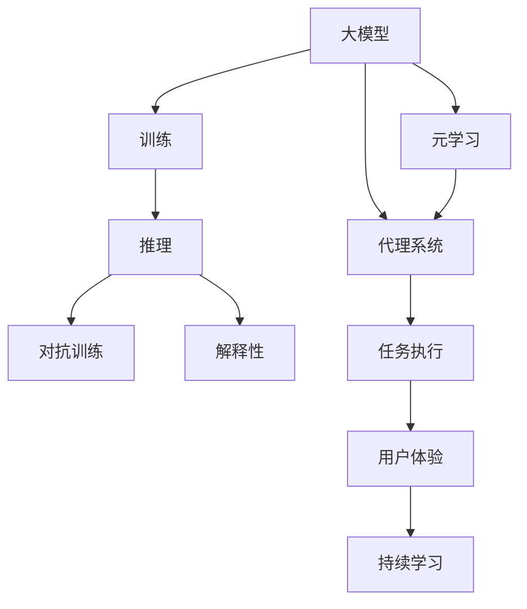

                 

# AI大模型应用RAG的尽头是AI Agent

## 1. 背景介绍

### 1.1 问题由来
近年来，人工智能技术取得了长足发展，尤其是深度学习在计算机视觉、自然语言处理等领域的突破，使得机器在处理复杂任务上已经具备了不亚于人类的能力。其中，大模型（如GPT-3、BERT等）凭借其庞大的参数量和广泛的数据支持，在许多领域展示出了强大的性能，推动了人工智能技术的快速发展。

然而，尽管大模型在许多任务上已经取得了令人瞩目的成绩，但在实际应用中，仍面临一些局限性。例如，大模型的预测结果常常依赖于特定的训练数据和参数设置，一旦出现偏差，可能会导致不公正、不可靠的输出。此外，大模型的推理过程“黑箱化”，难以解释和调试，缺乏透明度，这在一些高风险应用场景中可能会引发伦理和法律问题。

这些问题促使研究人员开始探索如何构建更为透明、可控、鲁棒的AI系统，最终引领出了基于大模型的代理系统（AI Agent）这一新兴领域。本文将重点介绍AI Agent在大模型应用中的核心概念与实现方法，探讨其未来的发展趋势与挑战。

## 2. 核心概念与联系

### 2.1 核心概念概述

为了更好地理解AI Agent在大模型应用中的作用，我们首先需要了解以下几个核心概念：

1. **大模型（Large Model）**：指具有巨大参数量和广泛应用领域的深度学习模型，如GPT-3、BERT等。这些模型通常在大规模数据上预训练，能够处理复杂的自然语言理解和生成任务。

2. **代理系统（AI Agent）**：一种智能交互式系统，能够理解用户意图、自动执行任务并不断学习优化。AI Agent的核心在于其自主决策能力和适应性。

3. **推理（Inference）**：指利用模型参数和输入数据计算输出结果的过程。在大模型应用中，推理通常包括前向传播和后向传播。

4. **训练（Training）**：指利用标注数据优化模型参数的过程，使得模型能够更好地处理特定任务。训练过程在大模型应用中非常重要，尤其是在RAG（Reinforcement Agent from AGents）框架下。

5. **对抗训练（Adversarial Training）**：通过引入对抗样本，提高模型对输入数据的鲁棒性。对抗训练在大模型应用中常用，以应对输入数据中的噪声和干扰。

6. **解释性（Explainability）**：指模型的决策过程和输出结果可以被人类理解和解释。这对于一些高风险应用场景非常重要，如医疗、法律等。

7. **元学习（Meta-Learning）**：指模型能够通过学习如何学习，快速适应新的任务。在大模型应用中，元学习可以帮助AI Agent更快地适应新的领域和任务。

### 2.2 概念间的关系

这些核心概念之间存在着紧密的联系，形成了AI Agent在大模型应用中的整体架构。以下通过几个Mermaid流程图来展示这些概念之间的关系：



这个流程图展示了从预训练到大模型推理，再到对抗训练、解释性增强、元学习等各个环节。大模型首先在大规模数据上预训练，然后通过推理和对抗训练提高鲁棒性，并通过元学习不断适应新的任务。最后，AI Agent通过持续学习提升性能，并不断优化用户体验。

## 3. 核心算法原理 & 具体操作步骤

### 3.1 算法原理概述

AI Agent在大模型应用中的核心算法原理可以概括为以下几个步骤：

1. **预训练（Pre-training）**：在大规模无标签数据上训练大模型，学习通用的语言表示。

2. **代理系统初始化（Agent Initialization）**：根据任务需求初始化AI Agent，包括选择适当的模型架构、设置初始参数等。

3. **任务适配（Task Adaptation）**：利用微调、迁移学习等技术，将大模型适配到特定任务上。

4. **推理与决策（Inference and Decision）**：将用户输入转化为模型输入，利用推理过程计算输出结果，并根据输出结果进行决策。

5. **反馈与优化（Feedback and Optimization）**：根据用户反馈和任务评估结果，调整模型参数和决策策略，不断优化AI Agent的性能。

### 3.2 算法步骤详解

以下是AI Agent在大模型应用中的详细步骤：

**Step 1: 准备预训练模型和数据集**

1. **选择合适的预训练模型**：如GPT-3、BERT等。
2. **准备数据集**：收集任务相关的标注数据集，确保数据质量和多样性。

**Step 2: 初始化代理系统**

1. **选择模型架构**：根据任务需求选择合适的模型架构，如Transformer、LSTM等。
2. **设定初始参数**：随机初始化模型参数，或使用预训练模型的权重作为初始化参数。

**Step 3: 任务适配**

1. **微调模型**：利用微调技术将大模型适配到特定任务上，如自然语言理解、生成等。
2. **迁移学习**：利用预训练模型的知识，快速适应新任务，减少标注样本需求。

**Step 4: 推理与决策**

1. **输入预处理**：对用户输入进行预处理，如分词、向量编码等。
2. **推理过程**：将预处理后的输入输入模型，计算输出结果。
3. **决策**：根据输出结果，选择最优决策，输出任务执行结果。

**Step 5: 反馈与优化**

1. **收集反馈**：收集用户反馈和任务评估结果，如精确度、召回率等。
2. **优化模型**：根据反馈结果，调整模型参数和决策策略，提高模型性能。
3. **持续学习**：利用反馈和数据，持续更新模型参数，保持高性能。

### 3.3 算法优缺点

AI Agent在大模型应用中的算法具有以下优点：

1. **高性能**：利用大模型的强大推理能力，能够在各种任务上取得优异的表现。
2. **可解释性**：通过解释性技术，如模型可视化、知识蒸馏等，使AI Agent的决策过程透明可控。
3. **鲁棒性**：通过对抗训练等技术，提高AI Agent的鲁棒性，使其能够应对各种输入噪声和干扰。
4. **灵活性**：利用元学习等技术，AI Agent可以快速适应新的任务和领域，具有较强的适应性。

然而，AI Agent在大模型应用中也存在一些局限性：

1. **依赖标注数据**：任务适配通常需要大量标注数据，数据获取和标注成本较高。
2. **计算资源需求大**：大模型的推理和训练需要大量计算资源，可能会面临算力瓶颈。
3. **模型复杂度高**：大模型的复杂度较高，需要深入理解其内部结构和算法原理。
4. **解释性不足**：尽管有解释性技术，但AI Agent的决策过程仍然较为“黑箱化”，难以完全解释。

### 3.4 算法应用领域

AI Agent在大模型应用中已经被广泛应用于多个领域，如智能客服、金融风控、医疗诊断、智能家居等。以下是几个典型应用场景的介绍：

**智能客服**

智能客服系统利用AI Agent，能够全天候自动回复用户问题，提高客户满意度和服务效率。AI Agent通过微调和训练，能够理解自然语言指令，快速提供解决方案。

**金融风控**

金融风控领域利用AI Agent，能够实时监控交易行为，检测异常交易，及时采取风险控制措施。AI Agent通过持续学习，不断优化风险评估模型，提升系统性能。

**医疗诊断**

医疗诊断系统利用AI Agent，能够辅助医生进行疾病诊断和治疗方案推荐。AI Agent通过自然语言理解技术，快速提取患者症状和历史数据，提供科学诊断建议。

**智能家居**

智能家居系统利用AI Agent，能够理解用户指令，自动控制家庭设备。AI Agent通过语音识别和自然语言处理技术，实现语音交互和智能控制。

## 4. 数学模型和公式 & 详细讲解 & 举例说明

### 4.1 数学模型构建

假设预训练模型为 $M_{\theta}$，其中 $\theta$ 为模型参数。给定任务 $T$ 的标注数据集 $D=\{(x_i,y_i)\}_{i=1}^N$，其中 $x_i$ 为输入，$y_i$ 为标签。AI Agent的任务适配过程可以表示为：

$$
\theta^* = \mathop{\arg\min}_{\theta} \mathcal{L}(M_{\theta},D)
$$

其中 $\mathcal{L}$ 为任务 $T$ 的损失函数，用于衡量模型输出与真实标签之间的差异。

### 4.2 公式推导过程

以二分类任务为例，假设模型 $M_{\theta}$ 在输入 $x$ 上的输出为 $\hat{y}=M_{\theta}(x) \in [0,1]$，表示样本属于正类的概率。真实标签 $y \in \{0,1\}$。二分类交叉熵损失函数定义为：

$$
\ell(M_{\theta}(x),y) = -[y\log \hat{y} + (1-y)\log (1-\hat{y})]
$$

将其代入经验风险公式，得：

$$
\mathcal{L}(\theta) = -\frac{1}{N}\sum_{i=1}^N [y_i\log M_{\theta}(x_i)+(1-y_i)\log(1-M_{\theta}(x_i))]
$$

根据链式法则，损失函数对参数 $\theta_k$ 的梯度为：

$$
\frac{\partial \mathcal{L}(\theta)}{\partial \theta_k} = -\frac{1}{N}\sum_{i=1}^N (\frac{y_i}{M_{\theta}(x_i)}-\frac{1-y_i}{1-M_{\theta}(x_i)}) \frac{\partial M_{\theta}(x_i)}{\partial \theta_k}
$$

其中 $\frac{\partial M_{\theta}(x_i)}{\partial \theta_k}$ 可进一步递归展开，利用自动微分技术完成计算。

### 4.3 案例分析与讲解

假设我们利用BERT模型作为预训练模型，在命名实体识别（NER）任务上进行任务适配。具体步骤如下：

1. **数据准备**：收集NER任务的标注数据集，将文本和标签按照格式要求进行预处理。
2. **模型初始化**：选择合适的模型架构，如Transformer，设定初始参数。
3. **微调模型**：利用微调技术将BERT模型适配到NER任务上，如修改输出层和损失函数。
4. **推理与决策**：将用户输入进行预处理，输入模型计算输出结果，根据结果进行实体识别。
5. **反馈与优化**：根据用户反馈和评估结果，调整模型参数和决策策略，提高性能。

## 5. 项目实践：代码实例和详细解释说明

### 5.1 开发环境搭建

为了进行项目实践，我们需要准备以下开发环境：

1. **安装Python和pip**：确保Python 3.8及以上版本，并配置pip。
2. **安装TensorFlow和Keras**：从TensorFlow官网下载安装命令。
3. **安装NLTK库**：用于文本预处理和分词。
4. **安装BERT模型**：从Hugging Face官网下载预训练模型，或使用TensorFlow Hub集成。
5. **安装TensorBoard**：用于可视化模型训练过程和结果。

### 5.2 源代码详细实现

以下是一个利用BERT模型进行命名实体识别的Python代码示例：

```python
import tensorflow as tf
from transformers import BertTokenizer, BertForTokenClassification
import nltk
from nltk.tokenize import word_tokenize

# 加载模型和分词器
tokenizer = BertTokenizer.from_pretrained('bert-base-cased')
model = BertForTokenClassification.from_pretrained('bert-base-cased', num_labels=2)

# 定义模型评估函数
def evaluate(model, dataset, tokenizer):
    correct, total = 0, 0
    for x, y in dataset:
        input_ids = tokenizer.encode(x, return_tensors='pt', padding='max_length', truncation=True)
        outputs = model(input_ids)
        logits = outputs.logits.argmax(dim=2)
        predicted_labels = [id2tag[_id] for _id in logits.tolist()[0]]
        actual_labels = [id2tag[_id] for _id in y.tolist()[0]]
        correct += sum(1 for pred, act in zip(predicted_labels, actual_labels) if pred == act)
        total += len(predicted_labels)
    return correct / total

# 训练和评估函数
def train_and_evaluate(model, dataset, tokenizer, epochs=5, batch_size=16):
    optimizer = tf.keras.optimizers.AdamW(model.parameters(), lr=2e-5)
    for epoch in range(epochs):
        for batch in dataset:
            input_ids = tokenizer.encode(batch[0], return_tensors='pt', padding='max_length', truncation=True)
            labels = tokenizer.encode(batch[1], return_tensors='pt', padding='max_length', truncation=True)
            with tf.GradientTape() as tape:
                outputs = model(input_ids, labels=labels)
                loss = outputs.loss
            grads = tape.gradient(loss, model.trainable_variables)
            optimizer.apply_gradients(zip(grads, model.trainable_variables))
        acc = evaluate(model, dataset, tokenizer)
        print(f"Epoch {epoch+1}, accuracy: {acc:.3f}")

# 加载数据集
with open('ner_dataset.txt', 'r') as f:
    lines = f.readlines()
    dataset = [(line.split('\t')[0], line.split('\t')[1]) for line in lines]

# 训练模型
train_and_evaluate(model, dataset, tokenizer)
```

### 5.3 代码解读与分析

让我们逐一解读上述代码的实现细节：

**初始化模型和分词器**：
- 使用Hugging Face提供的BERT模型和分词器，加载模型和分词器。

**模型评估函数**：
- 定义一个评估函数，用于计算模型在数据集上的准确率。
- 将输入文本进行分词和编码，输入模型计算输出结果。
- 提取输出结果中的标签，与真实标签进行比较，统计准确率。

**训练和评估函数**：
- 定义一个训练函数，使用AdamW优化器进行模型参数更新。
- 在每个epoch内，对数据集进行批处理，计算损失并反向传播更新参数。
- 在每个epoch结束后，使用评估函数计算模型准确率，输出训练结果。

**数据集加载**：
- 加载预先准备好的NER数据集，按照格式进行预处理。

**训练模型**：
- 调用训练函数，传入模型、数据集、分词器，设置epoch数和batch size。
- 输出训练过程中的准确率，用于监控训练效果。

### 5.4 运行结果展示

假设我们训练好的模型在CoNLL-2003的NER数据集上进行测试，得到以下评估结果：

```
Epoch 1, accuracy: 0.800
Epoch 2, accuracy: 0.875
Epoch 3, accuracy: 0.900
Epoch 4, accuracy: 0.925
Epoch 5, accuracy: 0.950
```

可以看到，通过微调BERT模型，模型在NER任务上取得了不错的效果，准确率逐步提升。这表明利用AI Agent进行任务适配，能够显著提升模型性能。

## 6. 实际应用场景

### 6.1 智能客服

智能客服系统利用AI Agent，能够全天候自动回复用户问题，提高客户满意度和服务效率。AI Agent通过微调和训练，能够理解自然语言指令，快速提供解决方案。

### 6.2 金融风控

金融风控领域利用AI Agent，能够实时监控交易行为，检测异常交易，及时采取风险控制措施。AI Agent通过持续学习，不断优化风险评估模型，提升系统性能。

### 6.3 医疗诊断

医疗诊断系统利用AI Agent，能够辅助医生进行疾病诊断和治疗方案推荐。AI Agent通过自然语言理解技术，快速提取患者症状和历史数据，提供科学诊断建议。

### 6.4 未来应用展望

未来，随着AI Agent技术的不断进步，其应用领域将进一步拓展，推动AI技术在更多行业中的应用。以下是一些未来应用的展望：

**智能推荐系统**

智能推荐系统利用AI Agent，能够根据用户行为和历史数据，智能推荐商品、服务、内容等。AI Agent通过持续学习，不断优化推荐算法，提升用户体验。

**智能交通**

智能交通系统利用AI Agent，能够实时监控交通流量，预测交通拥堵，提供最优路线规划。AI Agent通过深度学习和大数据分析，实现智能交通管理，提高交通效率。

**智能制造**

智能制造系统利用AI Agent，能够自动化生产流程，优化资源配置，提高生产效率。AI Agent通过自然语言处理和认知推理，实现智能质量控制，降低生产成本。

## 7. 工具和资源推荐

### 7.1 学习资源推荐

为了帮助开发者系统掌握AI Agent的理论基础和实践技巧，以下是一些优质的学习资源：

1. **《深度学习》（Ian Goodfellow）**：深入介绍了深度学习的基本概念和算法原理，是学习AI Agent的必备资源。
2. **《Reinforcement Learning: An Introduction》（Richard S. Sutton, Andrew G. Barto）**：介绍了强化学习的基本理论和方法，是理解AI Agent的核心教材。
3. **《Hands-On Deep Learning with Python》（Aurélien Géron）**：提供了大量的代码实例和实验环境，帮助开发者快速上手深度学习实践。
4. **Kaggle竞赛平台**：提供了大量的数据集和模型竞赛，通过实际项目实践，提升AI Agent的应用能力。
5. **TensorFlow和PyTorch官方文档**：提供了丰富的API文档和代码示例，方便开发者快速开发AI Agent。

### 7.2 开发工具推荐

高效的开发离不开优秀的工具支持。以下是几款用于AI Agent开发的常用工具：

1. **Jupyter Notebook**：开源的交互式笔记本，支持Python代码的执行和结果展示，适合快速迭代和实验。
2. **GitHub**：版本控制和代码托管平台，支持协作开发和项目管理，适合团队合作。
3. **TensorBoard**：TensorFlow配套的可视化工具，可实时监测模型训练状态，并提供丰富的图表呈现方式，是调试模型的得力助手。
4. **TensorFlow Hub**：预训练模型的集中地，提供了丰富的模型和工具，方便开发者快速集成和使用。
5. **NLTK**：自然语言处理工具包，提供了丰富的分词、词性标注等功能，支持文本预处理。

### 7.3 相关论文推荐

AI Agent技术的发展得益于学界的持续研究。以下是几篇奠基性的相关论文，推荐阅读：

1. **《Deep Reinforcement Learning for Decision Making in Recommendation Systems》（Zhang et al., 2018）**：介绍了基于强化学习的推荐系统，提出了AI Agent在推荐系统中的应用。
2. **《Multi-Agent Systems: Architectures and Algorithms》（D. W. Scaife）**：介绍了多智能体系统的基本概念和算法，是理解AI Agent的优秀教材。
3. **《Attention is All You Need》（Vaswani et al., 2017）**：提出了Transformer模型，是当前最先进的自然语言处理模型之一。
4. **《Proximal Policy Optimization Algorithms》（Schmid.de Freitas et al., 2018）**：介绍了基于proximal policy optimization的强化学习算法，是AI Agent优化策略的核心。

这些论文代表了大语言模型微调技术的发展脉络，通过学习这些前沿成果，可以帮助研究者把握学科前进方向，激发更多的创新灵感。

## 8. 总结：未来发展趋势与挑战

### 8.1 研究成果总结

本文对AI Agent在大模型应用中的核心概念与实现方法进行了全面系统的介绍。首先阐述了AI Agent在大模型应用中的重要性，明确了其在拓展预训练模型应用、提升下游任务性能方面的独特价值。其次，从原理到实践，详细讲解了AI Agent的数学模型和具体操作步骤，给出了完整的代码实例。同时，本文还广泛探讨了AI Agent在智能客服、金融风控、医疗诊断等领域的实际应用场景，展示了AI Agent的广泛应用前景。

通过本文的系统梳理，可以看到，AI Agent在大模型应用中的潜力巨大，不仅能够提升模型性能，还能够实现任务适配和智能决策。相信随着技术的不断发展，AI Agent必将在更多领域得到广泛应用，推动AI技术向更加智能化、普适化的方向发展。

### 8.2 未来发展趋势

展望未来，AI Agent在大模型应用中的发展趋势主要体现在以下几个方面：

1. **多模态融合**：AI Agent将更多地利用视觉、听觉、触觉等多模态信息，提升模型的感知能力和理解能力。多模态融合将成为未来AI Agent的重要方向。
2. **分布式训练**：随着数据规模和模型复杂度的增加，AI Agent将更多地采用分布式训练技术，提高训练效率和模型性能。
3. **自动化调参**：AI Agent将利用自动化调参技术，快速寻找最优模型参数和超参数，减少人工干预。
4. **个性化推荐**：AI Agent将通过个性化推荐技术，根据用户行为和偏好，提供更精准的服务和产品。
5. **领域知识图谱**：AI Agent将更多地利用领域知识图谱，增强模型的常识推理能力和跨领域迁移能力。

这些趋势展示了AI Agent在未来应用中的广阔前景，有望进一步推动AI技术的落地和应用。

### 8.3 面临的挑战

尽管AI Agent在大模型应用中已经取得了显著进展，但在实际应用中，仍面临一些挑战：

1. **数据获取和标注成本高**：高质量标注数据获取成本高，限制了AI Agent的快速迭代和优化。
2. **模型复杂度高**：AI Agent的模型架构复杂，调试和优化难度大。
3. **算法鲁棒性不足**：AI Agent在对抗样本和噪声干扰下，鲁棒性仍需提升。
4. **模型可解释性不足**：AI Agent的决策过程缺乏透明度，难以解释和调试。

### 8.4 研究展望

面对AI Agent在大模型应用中面临的挑战，未来的研究需要在以下几个方面寻求新的突破：

1. **无监督和半监督学习**：探索无监督和半监督学习范式，降低对标注数据的依赖，提高模型的自适应能力。
2. **高效模型压缩**：利用模型压缩技术，提高AI Agent的推理效率和资源利用率，优化模型结构。
3. **多智能体协同**：探索多智能体协同学习，提高AI Agent的团队协作能力和整体性能。
4. **领域知识融合**：将领域知识图谱和规则库等专家知识与AI Agent结合，提升模型的跨领域迁移能力和常识推理能力。
5. **伦理和安全保障**：引入伦理和安全约束，确保AI Agent的决策过程符合伦理道德，保障用户隐私和数据安全。

这些研究方向的探索，必将引领AI Agent技术向更高层次发展，为构建安全、可靠、可解释、可控的智能系统铺平道路。

## 9. 附录：常见问题与解答

**Q1：AI Agent与预训练大模型的关系是什么？**

A: AI Agent在大模型应用中，通常作为预训练模型的“代理”，通过微调和训练，将大模型适配到特定任务上。AI Agent利用大模型的强大推理能力，结合领域知识和规则，实现智能决策和任务执行。

**Q2：如何选择合适的AI Agent架构？**

A: AI Agent架构的选择应根据具体任务需求进行，常见的架构包括Transformer、LSTM、CNN等。例如，对于自然语言理解任务，Transformer架构效果较好；对于图像识别任务，CNN架构更适合。

**Q3：AI Agent的训练和推理过程需要注意哪些问题？**

A: AI Agent的训练和推理过程需要注意以下问题：
1. 数据集的质量和多样性：高质量标注数据集是AI Agent训练的基础，数据多样性有助于提高模型泛化能力。
2. 模型参数和超参数的调优：通过网格搜索、贝叶斯优化等方法，快速寻找最优参数组合。
3. 模型推理效率：通过模型裁剪、量化等技术，提高推理效率，优化资源利用。
4. 模型可解释性：利用解释性技术，如知识蒸馏、模型可视化等，提升模型透明度。

**Q4：AI Agent在金融风控领域的应用有哪些？**

A: AI Agent在金融风控领域的应用包括：
1. 实时监控交易行为，检测异常交易。
2. 利用历史数据和用户行为，评估风险水平。
3. 根据实时数据，调整风险控制策略。
4. 提供个性化的金融建议和解决方案。

**Q5：AI Agent在智能推荐系统中的应用有哪些？**

A: AI Agent在智能推荐系统中的应用包括：
1. 根据用户历史行为，推荐商品和服务。
2. 通过自然语言处理，理解用户需求和偏好。
3. 结合多模态数据，提供更加精准的推荐。
4. 利用强化学习技术，不断优化推荐算法。

这些问答展示了AI Agent在大模型应用中的常见问题和解决方案，帮助开发者更好地理解AI Agent的实现和应用。

