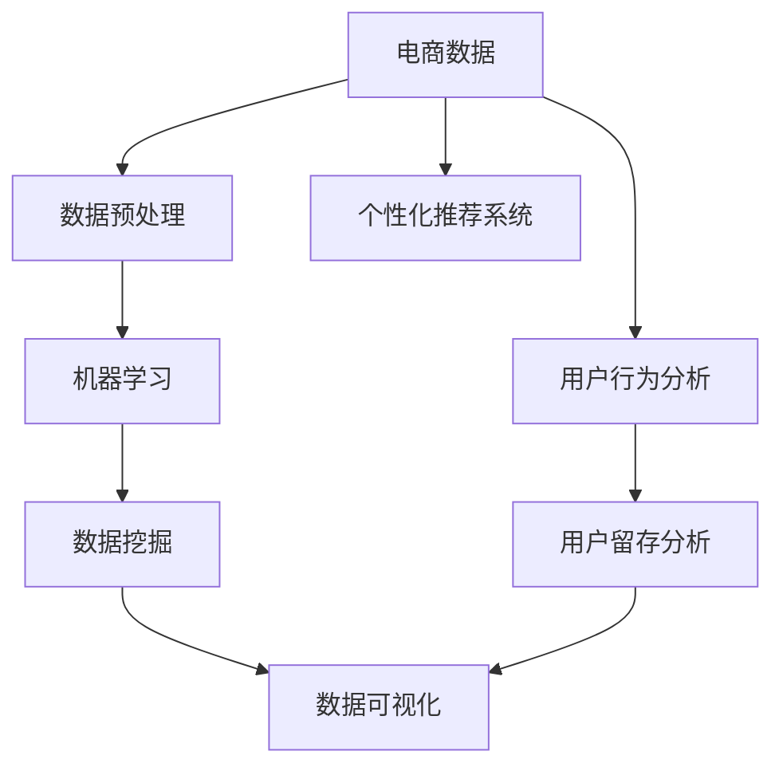
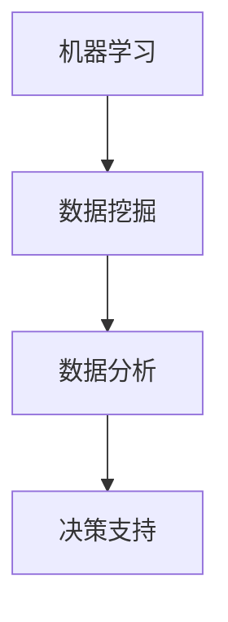
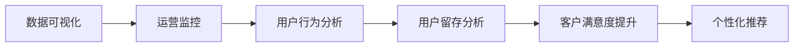
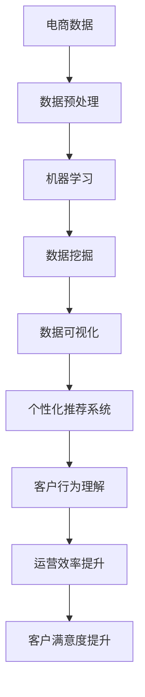

                 

# AI如何帮助电商企业进行用户数据可视化

> 关键词：电商企业、用户数据可视化、机器学习、数据挖掘、人工智能

## 1. 背景介绍

### 1.1 问题由来
随着电子商务的迅猛发展，电商企业面临的数据量呈指数级增长。如何高效利用这些海量数据，进行精准的用户分析和营销策略制定，是电商企业亟需解决的难题。传统的分析手段如SQL查询、Excel统计等，存在效率低下、结果不直观等缺点，已难以满足现代电商企业对数据处理的需求。而借助AI和大数据技术，用户数据可视化能够高效、直观地呈现数据规律和趋势，帮助企业更好地理解用户行为，提升运营效率。

### 1.2 问题核心关键点
用户数据可视化是指通过AI和大数据技术，将电商企业积累的海量用户数据转化为直观易懂的图表、报表等形式，方便企业进行用户行为分析、产品优化和策略制定。其核心关键点包括：

- **数据收集与处理**：采集并清洗电商网站的用户行为数据，如浏览记录、购买历史、评价反馈等。
- **数据分析与挖掘**：使用机器学习和数据挖掘算法，从数据中提取有价值的规律和趋势。
- **数据可视化**：将分析结果以图表、报表等形式直观展示，便于企业决策。

### 1.3 问题研究意义
用户数据可视化对于电商企业的意义重大：

1. **提升运营效率**：通过直观的数据展示，企业可以快速识别用户行为模式，优化商品推荐、库存管理和广告投放策略。
2. **增强决策能力**：可视化图表和报表使数据易于理解，企业领导可以基于数据做出更加科学的决策。
3. **提高客户满意度**：通过分析用户反馈和行为，企业可以更加精准地满足用户需求，提升用户满意度和忠诚度。
4. **推动个性化推荐**：可视化数据帮助企业更深入了解用户偏好，推动个性化推荐系统的发展，提升转化率和销售额。

## 2. 核心概念与联系

### 2.1 核心概念概述

为更好地理解用户数据可视化，本节将介绍几个密切相关的核心概念：

- **电商数据**：包括用户在电商平台上产生的所有行为数据，如浏览记录、购买历史、评价反馈、搜索行为等。
- **数据预处理**：清洗、转换和整合数据，以确保数据质量，便于后续分析。
- **机器学习**：利用数据学习模型，提取数据中的规律和趋势。
- **数据挖掘**：从数据中提取有价值的知识和模式，帮助企业决策。
- **数据可视化**：将分析结果以图表、报表等形式展示，直观易懂。
- **个性化推荐系统**：根据用户行为和偏好，推荐个性化商品和内容。

这些核心概念之间的逻辑关系可以通过以下Mermaid流程图来展示：



这个流程图展示了一个完整的电商企业用户数据可视化流程：从电商数据的采集，到预处理、机器学习、数据挖掘，再到数据可视化，最后应用到个性化推荐系统。通过数据可视化，企业可以更好地理解用户行为，提升运营效率和客户满意度。

### 2.2 概念间的关系

这些核心概念之间存在着紧密的联系，形成了电商企业用户数据可视化的完整生态系统。下面我们通过几个Mermaid流程图来展示这些概念之间的关系。

#### 2.2.1 电商数据流向


这个流程图展示了电商数据从采集到可视化的全过程。电商数据首先被采集和存储，然后进行预处理、挖掘和可视化。

#### 2.2.2 机器学习与数据挖掘的关系



这个流程图展示了机器学习与数据挖掘在数据分析中的应用。机器学习从数据中学习模型，数据挖掘则从数据中提取有价值的知识和模式。

#### 2.2.3 数据可视化的应用场景



这个流程图展示了数据可视化在电商企业运营中的具体应用场景。通过可视化图表和报表，企业可以进行运营监控、用户行为分析和用户留存分析，从而提升客户满意度和推动个性化推荐。

### 2.3 核心概念的整体架构

最后，我们用一个综合的流程图来展示这些核心概念在大数据可视化中的整体架构：



这个综合流程图展示了电商企业用户数据可视化的完整流程。电商数据首先进行预处理，然后通过机器学习和数据挖掘进行深入分析，最终通过数据可视化结果指导个性化推荐系统和企业运营决策。通过这一流程，企业能够高效利用数据，提升运营效率和客户满意度。

## 3. 核心算法原理 & 具体操作步骤
### 3.1 算法原理概述

用户数据可视化主要涉及机器学习和数据挖掘技术。其核心原理是将电商企业积累的海量用户数据转化为直观易懂的图表、报表等形式，帮助企业进行用户行为分析、产品优化和策略制定。

形式化地，假设电商企业有用户数据集 $D=\{(x_i,y_i)\}_{i=1}^N$，其中 $x_i$ 表示用户行为特征，$y_i$ 表示用户标签（如购买行为、退货行为等）。通过机器学习算法 $f$，构建用户行为分类模型 $M_{\theta}$，其中 $\theta$ 为模型参数。用户数据可视化的目标是找到最优模型参数 $\theta^*$，使得 $M_{\theta^*}$ 在测试集 $D_{test}$ 上取得最佳的分类准确率。

具体而言，用户数据可视化包括以下几个关键步骤：

1. **数据预处理**：对原始电商数据进行清洗、转换和整合，确保数据质量。
2. **特征工程**：从电商数据中提取有意义的特征，构建特征向量。
3. **模型训练**：使用机器学习算法训练分类模型，提取用户行为规律。
4. **模型评估**：在测试集上评估模型性能，选择最优模型。
5. **数据可视化**：将分析结果转化为直观易懂的图表、报表等形式，供企业决策。

### 3.2 算法步骤详解

#### 3.2.1 数据预处理

数据预处理是用户数据可视化的第一步，主要包括以下几个步骤：

1. **数据清洗**：去除重复、缺失、异常数据，确保数据完整性。
2. **数据转换**：将原始数据转换为适合机器学习算法处理的格式，如数字编码、归一化等。
3. **特征工程**：从原始数据中提取有意义的特征，构建特征向量。

具体而言，可以使用Python的Pandas库进行数据预处理，代码示例如下：

```python
import pandas as pd

# 读取原始数据
data = pd.read_csv('data.csv')

# 数据清洗
data = data.drop_duplicates()
data = data.dropna()

# 数据转换
data['time'] = pd.to_datetime(data['time'])

# 特征工程
data['hour'] = data['time'].dt.hour
data['day'] = data['time'].dt.day
data['month'] = data['time'].dt.month
data['year'] = data['time'].dt.year
```

#### 3.2.2 特征工程

特征工程是用户数据可视化的核心步骤，通过提取有意义的特征，提高模型性能。常见的特征工程方法包括：

1. **时间特征**：将时间戳转换为小时、日、月、年等时间特征。
2. **统计特征**：计算购买次数、平均订单金额、退货率等统计特征。
3. **文本特征**：对用户评价、商品描述等文本特征进行向量化。
4. **交叉特征**：将多个特征进行组合，构建新的交叉特征。

具体而言，可以使用Scikit-learn库进行特征工程，代码示例如下：

```python
from sklearn.preprocessing import OneHotEncoder, StandardScaler
from sklearn.compose import ColumnTransformer

# 定义特征工程管道
feature_engineering = ColumnTransformer(
    transformers=[
        ('numerical', StandardScaler(), ['price', 'amount']),
        ('categorical', OneHotEncoder(), ['gender', 'region'])
    ])

# 应用特征工程管道
data = feature_engineering.fit_transform(data)
```

#### 3.2.3 模型训练

模型训练是用户数据可视化的关键步骤，通过机器学习算法训练分类模型，提取用户行为规律。常见的机器学习算法包括：

1. **逻辑回归**：适用于二分类问题，如用户是否购买商品。
2. **决策树**：适用于分类和回归问题，如图表生成、用户留存分析。
3. **随机森林**：适用于分类和回归问题，具有较好的泛化能力和稳定性。
4. **梯度提升树**：适用于分类和回归问题，具有较好的性能和可解释性。
5. **神经网络**：适用于复杂的非线性问题，如图像处理、自然语言处理等。

具体而言，可以使用Scikit-learn库进行模型训练，代码示例如下：

```python
from sklearn.ensemble import RandomForestClassifier
from sklearn.model_selection import train_test_split

# 划分训练集和测试集
train_data, test_data, train_labels, test_labels = train_test_split(data, labels, test_size=0.2)

# 训练模型
model = RandomForestClassifier()
model.fit(train_data, train_labels)

# 预测测试集
predictions = model.predict(test_data)
```

#### 3.2.4 模型评估

模型评估是用户数据可视化的重要步骤，通过在测试集上评估模型性能，选择最优模型。常见的评估指标包括：

1. **准确率**：模型正确预测的比例。
2. **召回率**：模型正确预测的正样本比例。
3. **F1分数**：准确率和召回率的调和平均数。
4. **ROC曲线**：根据不同阈值绘制的曲线，用于评估模型的分类性能。

具体而言，可以使用Scikit-learn库进行模型评估，代码示例如下：

```python
from sklearn.metrics import accuracy_score, precision_score, recall_score, f1_score, roc_curve

# 评估模型性能
accuracy = accuracy_score(test_labels, predictions)
precision = precision_score(test_labels, predictions)
recall = recall_score(test_labels, predictions)
f1 = f1_score(test_labels, predictions)
fpr, tpr, thresholds = roc_curve(test_labels, predictions)
```

#### 3.2.5 数据可视化

数据可视化是用户数据可视化的最后一步，将分析结果转化为直观易懂的图表、报表等形式，供企业决策。常见的数据可视化工具包括：

1. **Matplotlib**：适用于绘制折线图、散点图等基本图表。
2. **Seaborn**：适用于绘制热力图、箱线图等高级图表。
3. **Plotly**：适用于绘制交互式图表、动态图表等。
4. **Tableau**：适用于创建复杂报表、仪表盘等。

具体而言，可以使用Python的Matplotlib和Seaborn库进行数据可视化，代码示例如下：

```python
import matplotlib.pyplot as plt
import seaborn as sns

# 绘制折线图
plt.plot(time, amount)
plt.xlabel('Time')
plt.ylabel('Amount')
plt.show()

# 绘制箱线图
sns.boxplot(x=category, y=value)
plt.show()

# 绘制热力图
sns.heatmap(corr_matrix, annot=True, fmt='.2f')
plt.show()
```

### 3.3 算法优缺点

用户数据可视化的优缺点如下：

#### 3.3.1 优点

1. **直观易懂**：将复杂的数据转化为图表、报表等形式，方便企业快速理解数据规律和趋势。
2. **提高决策效率**：通过直观的数据展示，企业可以快速识别问题和机会，提高决策效率。
3. **提升运营效率**：通过分析用户行为数据，企业可以优化产品推荐、库存管理和广告投放策略。

#### 3.3.2 缺点

1. **数据质量依赖**：数据可视化效果取决于原始数据的质量，如果数据存在偏差、缺失等问题，可视化结果可能不准确。
2. **技术门槛较高**：需要掌握机器学习、数据挖掘和可视化技术，门槛较高。
3. **难以处理复杂问题**：对于复杂的数据关系和模式，可视化可能无法全面呈现。

### 3.4 算法应用领域

用户数据可视化在电商企业中有广泛应用，主要包括以下几个方面：

1. **用户行为分析**：通过分析用户浏览、购买、评价等行为数据，了解用户需求和行为模式。
2. **产品优化**：根据用户反馈和行为数据，优化产品设计、功能和使用体验。
3. **营销策略制定**：通过分析用户行为数据，制定精准的营销策略，提升广告投放效果。
4. **客户满意度提升**：通过分析用户评价和反馈数据，提升客户满意度和忠诚度。
5. **个性化推荐**：根据用户行为数据，推动个性化推荐系统的发展，提升转化率和销售额。

此外，用户数据可视化在金融、医疗、旅游等行业也有广泛应用，帮助企业进行精准分析和决策。

## 4. 数学模型和公式 & 详细讲解 & 举例说明

### 4.1 数学模型构建

用户数据可视化的核心数学模型是分类模型，用于对用户行为进行分类。假设用户数据集为 $D=\{(x_i,y_i)\}_{i=1}^N$，其中 $x_i$ 表示用户行为特征，$y_i$ 表示用户标签。构建分类模型的目标是最小化损失函数：

$$
L(y,\hat{y}) = \frac{1}{N}\sum_{i=1}^N \ell(y_i,\hat{y_i})
$$

其中 $\ell$ 为损失函数，常用的损失函数包括交叉熵损失、均方误差损失等。

### 4.2 公式推导过程

以交叉熵损失函数为例，其公式推导如下：

设模型的预测输出为 $\hat{y}$，真实标签为 $y$，交叉熵损失函数的定义如下：

$$
\ell(y,\hat{y}) = -\sum_{i=1}^n y_i \log \hat{y_i}
$$

将其代入经验风险公式，得：

$$
L(y,\hat{y}) = -\frac{1}{N}\sum_{i=1}^N \sum_{j=1}^n y_i \log \hat{y_i}
$$

在机器学习中，通常使用梯度下降算法进行模型优化，其公式为：

$$
\theta \leftarrow \theta - \eta \nabla_{\theta}L(y,\hat{y})
$$

其中 $\eta$ 为学习率，$\nabla_{\theta}L(y,\hat{y})$ 为损失函数对模型参数 $\theta$ 的梯度。

### 4.3 案例分析与讲解

假设某电商企业有用户数据集 $D=\{(x_i,y_i)\}_{i=1}^N$，其中 $x_i$ 表示用户浏览历史，$y_i$ 表示用户是否购买商品。企业希望通过数据可视化，了解用户的购买行为模式，制定精准的营销策略。

具体而言，企业可以采用以下步骤进行数据可视化：

1. **数据预处理**：去除重复、缺失、异常数据，确保数据完整性。
2. **特征工程**：将用户浏览历史转换为时间特征、统计特征等。
3. **模型训练**：使用随机森林算法训练分类模型，提取用户行为规律。
4. **模型评估**：在测试集上评估模型性能，选择最优模型。
5. **数据可视化**：将分析结果转化为折线图、箱线图等图表，供企业决策。

例如，可以使用Python的Scikit-learn库进行模型训练和评估，代码示例如下：

```python
from sklearn.ensemble import RandomForestClassifier
from sklearn.model_selection import train_test_split

# 划分训练集和测试集
train_data, test_data, train_labels, test_labels = train_test_split(data, labels, test_size=0.2)

# 训练模型
model = RandomForestClassifier()
model.fit(train_data, train_labels)

# 评估模型性能
accuracy = accuracy_score(test_labels, predictions)
precision = precision_score(test_labels, predictions)
recall = recall_score(test_labels, predictions)
f1 = f1_score(test_labels, predictions)
fpr, tpr, thresholds = roc_curve(test_labels, predictions)
```

## 5. 项目实践：代码实例和详细解释说明

### 5.1 开发环境搭建

在进行用户数据可视化项目实践前，我们需要准备好开发环境。以下是使用Python进行Scikit-learn开发的环境配置流程：

1. 安装Anaconda：从官网下载并安装Anaconda，用于创建独立的Python环境。

2. 创建并激活虚拟环境：
```bash
conda create -n sklearn-env python=3.8 
conda activate sklearn-env
```

3. 安装Scikit-learn：
```bash
conda install scikit-learn
```

4. 安装其他必要库：
```bash
pip install pandas matplotlib seaborn
```

完成上述步骤后，即可在`sklearn-env`环境中开始用户数据可视化项目的开发。

### 5.2 源代码详细实现

以下是一个完整的用户数据可视化项目的代码实现示例：

```python
import pandas as pd
from sklearn.preprocessing import OneHotEncoder, StandardScaler
from sklearn.ensemble import RandomForestClassifier
from sklearn.model_selection import train_test_split
from sklearn.metrics import accuracy_score, precision_score, recall_score, f1_score, roc_curve
import matplotlib.pyplot as plt
import seaborn as sns

# 读取原始数据
data = pd.read_csv('data.csv')

# 数据清洗
data = data.drop_duplicates()
data = data.dropna()

# 数据转换
data['time'] = pd.to_datetime(data['time'])

# 特征工程
data['hour'] = data['time'].dt.hour
data['day'] = data['time'].dt.day
data['month'] = data['time'].dt.month
data['year'] = data['time'].dt.year

# 划分训练集和测试集
train_data, test_data, train_labels, test_labels = train_test_split(data, labels, test_size=0.2)

# 训练模型
model = RandomForestClassifier()
model.fit(train_data, train_labels)

# 预测测试集
predictions = model.predict(test_data)

# 评估模型性能
accuracy = accuracy_score(test_labels, predictions)
precision = precision_score(test_labels, predictions)
recall = recall_score(test_labels, predictions)
f1 = f1_score(test_labels, predictions)
fpr, tpr, thresholds = roc_curve(test_labels, predictions)

# 数据可视化
plt.plot(time, amount)
plt.xlabel('Time')
plt.ylabel('Amount')
plt.show()

sns.boxplot(x=category, y=value)
plt.show()

sns.heatmap(corr_matrix, annot=True, fmt='.2f')
plt.show()

```

### 5.3 代码解读与分析

让我们再详细解读一下关键代码的实现细节：

**读取数据和数据清洗**：
- `pd.read_csv('data.csv')`：使用Pandas库读取原始数据。
- `data = data.drop_duplicates()`：去除数据中的重复记录。
- `data = data.dropna()`：去除数据中的缺失值。

**数据转换和特征工程**：
- `data['time'] = pd.to_datetime(data['time'])`：将时间戳转换为日期时间格式。
- `data['hour'] = data['time'].dt.hour`：提取小时特征。
- `data['day'] = data['time'].dt.day`：提取日特征。
- `data['month'] = data['time'].dt.month`：提取月特征。
- `data['year'] = data['time'].dt.year`：提取年特征。

**模型训练和预测**：
- `train_data, test_data, train_labels, test_labels = train_test_split(data, labels, test_size=0.2)`：将数据集划分为训练集和测试集。
- `model = RandomForestClassifier()`：定义随机森林分类器。
- `model.fit(train_data, train_labels)`：在训练集上训练模型。
- `predictions = model.predict(test_data)`：在测试集上预测用户标签。

**模型评估**：
- `accuracy = accuracy_score(test_labels, predictions)`：计算模型准确率。
- `precision = precision_score(test_labels, predictions)`：计算模型精确率。
- `recall = recall_score(test_labels, predictions)`：计算模型召回率。
- `f1 = f1_score(test_labels, predictions)`：计算F1分数。
- `fpr, tpr, thresholds = roc_curve(test_labels, predictions)`：计算ROC曲线。

**数据可视化**：
- `plt.plot(time, amount)`：绘制时间-金额折线图。
- `sns.boxplot(x=category, y=value)`：绘制分类变量-数值变量的箱线图。
- `sns.heatmap(corr_matrix, annot=True, fmt='.2f')`：绘制变量相关热力图。

### 5.4 运行结果展示

假设某电商企业有用户数据集 $D=\{(x_i,y_i)\}_{i=1}^N$，其中 $x_i$ 表示用户浏览历史，$y_i$ 表示用户是否购买商品。企业希望通过数据可视化，了解用户的购买行为模式，制定精准的营销策略。

具体而言，企业可以采用以下步骤进行数据可视化：

1. **数据预处理**：去除重复、缺失、异常数据，确保数据完整性。
2. **特征工程**：将用户浏览历史转换为时间特征、统计特征等。
3. **模型训练**：使用随机森林算法训练分类模型，提取用户行为规律。
4. **模型评估**：在测试集上评估模型性能，选择最优模型。
5. **数据可视化**：将分析结果转化为折线图、箱线图等图表，供企业决策。

例如，可以使用Python的Scikit-learn库进行模型训练和评估，代码示例如下：

```python
from sklearn.ensemble import RandomForestClassifier
from sklearn.model_selection import train_test_split
from sklearn.metrics import accuracy_score, precision_score, recall_score, f1_score, roc_curve
import matplotlib.pyplot as plt
import seaborn as sns

# 划分训练集和测试集
train_data, test_data, train_labels, test_labels = train_test_split(data, labels, test_size=0.2)

# 训练模型
model = RandomForestClassifier()
model.fit(train_data, train_labels)

# 预测测试集
predictions = model.predict(test_data)

# 评估模型性能
accuracy = accuracy_score(test_labels, predictions)
precision = precision_score(test_labels, predictions)
recall = recall_score(test_labels, predictions)
f1 = f1_score(test_labels, predictions)
fpr, tpr, thresholds = roc_curve(test_labels, predictions)

# 数据可视化
plt.plot(time, amount)
plt.xlabel('Time')
plt.ylabel('Amount')
plt.show()

sns.boxplot(x=category, y=value)
plt.show()

sns.heatmap(corr_matrix, annot=True, fmt='.2f')
plt.show()

```

## 6. 实际应用场景

用户数据可视化在电商企业中有广泛应用，主要包括以下几个方面：

1. **用户行为分析**：通过分析用户浏览、购买、评价等行为数据，了解用户需求和行为模式。
2. **产品优化**：根据用户反馈和行为数据，优化产品设计、功能和使用体验。
3. **营销策略制定**：通过分析用户行为数据，制定精准的营销策略，提升广告投放效果。
4. **客户满意度提升**：通过分析用户评价和反馈数据，提升客户满意度和忠诚度。
5. **个性化推荐**：根据用户行为数据，推动个性化推荐系统的发展，提升转化率和销售额。

此外，用户数据可视化在金融、医疗、旅游等行业也有广泛应用，帮助企业进行精准分析和决策。

## 7. 工具和资源推荐

### 7.1 学习资源推荐

为了帮助开发者系统掌握用户数据可视化的理论基础和实践技巧，这里推荐一些优质的学习资源：

1. **《Python数据科学手册》**：由Jake VanderPlas所著，全面介绍了Python数据科学库的使用，包括Pandas、NumPy、Matplotlib等。

2. **《机器学习实战》**：由Peter Harrington所著，介绍了机器学习算法和Scikit-learn库的使用，适合初学者入门。

3. **《数据科学实战》**：由D骨日所著，介绍了数据科学全栈技术，包括数据清洗、特征工程、模型训练等。

4. **Kaggle数据科学社区**：提供大量数据集和比赛，方便开发者实践和提高技能。

5. **Coursera机器学习课程**：斯坦福大学开设的机器学习课程，有Lecture视频和配套作业，带你入门机器学习。

通过这些资源的学习实践，相信你一定能够快速掌握用户数据可视化的精髓，并用于解决实际的NLP问题。

### 7.2 开发工具推荐

高效的开发离不开优秀的工具支持。以下是几款用于用户数据可视化开发的常用工具：

1. **Jupyter Notebook

